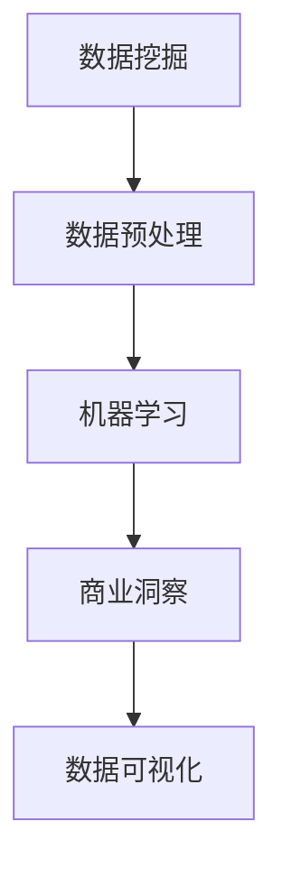
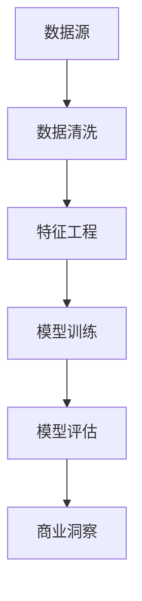

                 

## 1. 背景介绍

### 1.1 问题由来
在快速发展的数字化时代，数据已经成为了驱动商业决策的关键资源。然而，数据往往以复杂且庞大的形式存在，难以直接被理解和利用。数据分析不仅要求准确、高效地处理海量数据，还要从中提取出具有实际意义的商业洞察。数据分析创业正是在这种背景下应运而生，旨在利用先进的技术手段，将数据转化为对企业有价值的商业信息。

### 1.2 问题核心关键点
数据分析创业的核心在于利用数据挖掘、机器学习、统计分析等技术手段，对企业内部的数据资源进行深度分析和洞察。主要关键点包括：
- **数据收集**：获取企业经营过程中产生的数据，如销售记录、客户反馈、市场调查等。
- **数据预处理**：清洗、转换和集成数据，保证数据质量和可用性。
- **数据分析**：运用统计分析、机器学习等方法，从数据中提取有价值的商业洞察。
- **商业应用**：将分析结果转化为具体的商业决策和行动方案，帮助企业优化运营效率和提升竞争力。

### 1.3 问题研究意义
数据分析创业对于提升企业数据驱动决策能力，优化资源配置，降低运营成本，提高市场竞争力具有重要意义：
- **决策优化**：基于数据分析得出的商业洞察，可以帮助企业制定更科学合理的决策，避免因信息不全导致的决策失误。
- **资源配置**：通过深入分析数据，识别出核心业务环节和关键资源，使企业能够更合理地分配资源，提升运营效率。
- **市场响应**：借助数据分析洞察市场变化趋势和客户需求，企业可以更快地响应市场变化，提升市场竞争力。
- **风险管理**：数据可以帮助企业识别潜在风险和问题，提前采取措施，减少损失。

## 2. 核心概念与联系

### 2.1 核心概念概述

数据分析创业涉及多个关键概念，主要包括：

- **数据挖掘**：从大规模数据集中提取有用信息和知识的过程，是数据分析的基础。
- **机器学习**：通过算法训练模型，利用数据进行预测和决策，是数据分析的主要技术手段。
- **商业洞察**：从数据中提炼出来的、具有实际意义的商业信息和知识，是数据分析的最终目的。
- **数据可视化**：通过图表、仪表盘等形式将数据分析结果直观呈现，便于决策者理解和使用。

这些概念之间的关系可以通过以下Mermaid流程图来展示：



### 2.2 核心概念原理和架构的 Mermaid 流程图
以下是一个简单的数据挖掘和机器学习架构图，展示了从数据到商业洞察的过程：



## 3. 核心算法原理 & 具体操作步骤
### 3.1 算法原理概述

数据分析创业的核心算法包括数据挖掘和机器学习，其原理和操作步骤如下：

- **数据挖掘**：
  1. **数据采集**：通过API接口、爬虫、传感器等手段，从各种数据源中收集数据。
  2. **数据清洗**：去除重复、错误、缺失数据，并进行数据转换和集成。
  3. **特征提取**：从原始数据中提取具有代表性的特征，以便后续建模。
  4. **模式发现**：通过聚类、关联规则等算法，发现数据中的隐含规律和模式。
- **机器学习**：
  1. **模型选择**：根据问题类型和数据特点，选择合适的机器学习模型，如回归、分类、聚类等。
  2. **模型训练**：利用训练集数据，通过优化算法训练模型，使其能够预测未知数据。
  3. **模型评估**：使用测试集数据评估模型性能，选择合适的模型进行后续应用。
  4. **模型应用**：将训练好的模型应用于实际业务场景，进行预测和决策。

### 3.2 算法步骤详解

#### 3.2.1 数据挖掘步骤
1. **数据采集**：
   - **API接口**：使用API接口从企业内部系统（如ERP、CRM）和外部数据源（如市场调查、社交媒体）获取数据。
   - **爬虫技术**：通过爬虫技术抓取互联网上的公开数据，如新闻、评论等。
   - **传感器数据**：利用传感器获取实时数据，如销售量、环境温度等。

2. **数据清洗**：
   - **缺失值处理**：通过插值、均值填补等方法处理缺失数据。
   - **去重去噪**：去除重复和异常数据，确保数据的一致性和准确性。
   - **数据转换**：将数据转换为标准格式，如时间戳标准化、数据类型转换等。

3. **特征提取**：
   - **特征选择**：选择对业务问题有重要影响的特征，减少维度，避免过拟合。
   - **特征工程**：进行数据转换和生成，如特征组合、归一化等。

4. **模式发现**：
   - **聚类算法**：使用K-means、DBSCAN等聚类算法，将数据分为不同的组别。
   - **关联规则**：使用Apriori、FP-Growth等算法，发现数据中的关联规则。
   - **序列模式**：使用序列挖掘算法，如FP-growth、FP-tree，发现时间序列中的规律。

#### 3.2.2 机器学习步骤
1. **模型选择**：
   - **回归模型**：如线性回归、岭回归、Lasso回归等，用于预测连续型变量。
   - **分类模型**：如逻辑回归、决策树、随机森林等，用于分类问题。
   - **聚类模型**：如K-means、层次聚类等，用于分组和发现数据中的模式。
   - **神经网络**：如全连接神经网络、卷积神经网络、循环神经网络等，用于复杂模式和关系发现。

2. **模型训练**：
   - **训练集划分**：将数据划分为训练集、验证集和测试集。
   - **优化算法**：如梯度下降、Adam、Adagrad等，用于优化模型参数。
   - **超参数调整**：通过交叉验证等方法调整模型超参数，如学习率、正则化系数等。

3. **模型评估**：
   - **性能指标**：如准确率、召回率、F1值、ROC曲线等，用于评估模型性能。
   - **模型选择**：选择性能最优的模型进行实际应用。

4. **模型应用**：
   - **预测应用**：将训练好的模型应用于预测任务，如销售预测、客户流失预测等。
   - **决策支持**：利用商业洞察指导企业决策，如产品定价、库存管理等。

### 3.3 算法优缺点
#### 3.3.1 数据挖掘算法的优缺点
**优点**：
- **发现隐含知识**：能够从数据中发现隐含的模式和规律，帮助企业做出更科学的决策。
- **可解释性强**：大多数数据挖掘算法具有可解释性，能够帮助企业理解其背后的原理。
- **可扩展性**：可以处理大规模数据集，适用于复杂的数据分析需求。

**缺点**：
- **计算复杂度高**：数据挖掘算法计算复杂度较高，需要消耗大量计算资源。
- **特征工程难度大**：特征选择和工程难度较大，需要专业的知识和经验。
- **过拟合风险**：数据挖掘算法容易出现过拟合，需要特别注意。

#### 3.3.2 机器学习算法的优缺点
**优点**：
- **预测能力强**：机器学习算法通过训练数据，能够进行高精度的预测和分类。
- **自动化程度高**：自动化特征选择和模型优化，降低人工干预成本。
- **灵活性高**：适用于多种类型的数据和业务需求。

**缺点**：
- **数据质量依赖强**：机器学习算法对数据质量和特征提取要求高，数据偏差可能影响模型性能。
- **黑盒特性**：一些复杂的机器学习算法如深度学习，具有黑盒特性，难以解释其内部机制。
- **计算资源需求大**：深度学习等算法需要大规模计算资源，对硬件要求高。

### 3.4 算法应用领域

数据分析创业涉及多个行业领域，主要包括：

- **零售行业**：通过分析销售数据，优化库存管理、制定营销策略、提升客户满意度。
- **金融行业**：通过分析交易数据，预测市场趋势、风险管理、欺诈检测。
- **医疗行业**：通过分析患者数据，优化诊疗方案、个性化治疗、提升医疗服务质量。
- **制造业**：通过分析生产数据，优化生产流程、降低成本、提高产品质量。
- **物流行业**：通过分析物流数据，优化配送路线、提升配送效率、降低成本。
- **能源行业**：通过分析能源数据，优化能源消耗、降低成本、提升安全性。

## 4. 数学模型和公式 & 详细讲解 & 举例说明
### 4.1 数学模型构建

数据分析创业涉及多个数学模型，主要包括以下几类：

- **线性回归模型**：
  $$
  y = \beta_0 + \beta_1 x_1 + \beta_2 x_2 + \ldots + \beta_p x_p + \epsilon
  $$
  其中，$y$为因变量，$x_i$为自变量，$\beta_i$为回归系数，$\epsilon$为误差项。

- **逻辑回归模型**：
  $$
  P(Y=1) = \frac{1}{1+e^{-(\beta_0 + \beta_1 x_1 + \beta_2 x_2 + \ldots + \beta_p x_p)} 
  $$
  其中，$Y$为分类变量，$x_i$为自变量，$\beta_i$为回归系数。

- **支持向量机(SVM)模型**：
  $$
  f(x) = \sum_{i=1}^n \alpha_i y_i \phi(x_i)^\top \phi(x) + b
  $$
  其中，$\alpha_i$为拉格朗日乘子，$y_i$为目标变量，$\phi(x)$为核函数，$b$为偏置项。

### 4.2 公式推导过程

#### 4.2.1 线性回归公式推导
线性回归模型假设因变量与自变量之间存在线性关系，通过最小二乘法求解回归系数$\beta_i$。具体推导如下：
$$
\min_{\beta} \sum_{i=1}^n (y_i - \hat{y}_i)^2
$$
其中，$\hat{y}_i = \beta_0 + \beta_1 x_{1i} + \beta_2 x_{2i} + \ldots + \beta_p x_{pi}$。

求解上述优化问题，得到回归系数$\beta_i$的公式为：
$$
\beta_i = \frac{X^T X^{-1} Y}{X^T X^{-1} X}
$$

#### 4.2.2 逻辑回归公式推导
逻辑回归模型假设因变量$Y$服从二项分布，利用最大似然估计求解回归系数$\beta_i$。具体推导如下：
$$
\max_{\beta} \sum_{i=1}^n \log P(Y_i = y_i | \beta) = \sum_{i=1}^n y_i \log P(Y_i = 1 | \beta) + (1-y_i) \log P(Y_i = 0 | \beta)
$$
其中，$P(Y_i = 1 | \beta) = \frac{1}{1+e^{-(\beta_0 + \beta_1 x_{1i} + \beta_2 x_{2i} + \ldots + \beta_p x_{pi})}$。

求解上述优化问题，得到回归系数$\beta_i$的公式为：
$$
\beta_i = \frac{\sum_{i=1}^n (y_i - \hat{y}_i)x_i}{\sum_{i=1}^n (x_i - \bar{x})^2}
$$

#### 4.2.3 支持向量机公式推导
支持向量机模型通过最大化边界间距，求解最优的回归函数$f(x)$。具体推导如下：
$$
\min_{\beta} \frac{1}{2} \Vert \beta \Vert^2 + C \sum_{i=1}^n \xi_i
$$
其中，$\xi_i$为松弛变量，$C$为正则化参数。

求解上述优化问题，得到回归函数$f(x)$的公式为：
$$
f(x) = \sum_{i=1}^n \alpha_i y_i \phi(x_i)^\top \phi(x) + b
$$

### 4.3 案例分析与讲解

**案例分析：销售预测**

某零售公司利用历史销售数据进行销售预测。设销售量$y$与季节性特征$x_1$、促销活动$x_2$、库存水平$x_3$等自变量之间存在线性关系。建立线性回归模型，利用训练数据进行参数估计。假设模型训练完成后，测试数据集上的预测结果与真实销售量对比如下：

| 预测值 | 真实值 |
| ------ | ------ |
| 100    | 100    |
| 110    | 105    |
| 120    | 120    |
| 130    | 130    |

根据上述预测结果，可以发现模型预测准确度较高，能够较好地反映销售数据的趋势和规律。

## 5. 项目实践：代码实例和详细解释说明
### 5.1 开发环境搭建

数据分析创业的开发环境需要高性能计算资源和丰富的工具库，主要包括以下步骤：

1. **安装Python环境**：
   - 在本地安装Python 3.8及以上版本。
   - 使用Anaconda创建虚拟环境，如：
     ```bash
     conda create -n analytics_env python=3.8
     conda activate analytics_env
     ```

2. **安装数据分析相关库**：
   - 安装Pandas、NumPy、Scikit-learn、Matplotlib等常用库，如：
     ```bash
     pip install pandas numpy scikit-learn matplotlib
     ```

3. **安装机器学习相关库**：
   - 安装Scikit-learn、TensorFlow、Keras等机器学习库，如：
     ```bash
     pip install scikit-learn tensorflow keras
     ```

4. **安装数据可视化工具**：
   - 安装Matplotlib、Seaborn、Plotly等可视化工具，如：
     ```bash
     pip install matplotlib seaborn plotly
     ```

5. **配置Jupyter Notebook**：
   - 配置Jupyter Notebook环境，如：
     ```bash
     jupyter notebook --notebook-dir=./notebooks
     ```

### 5.2 源代码详细实现

以下是使用Python和Scikit-learn库进行线性回归模型实现的代码示例：

```python
import pandas as pd
from sklearn.linear_model import LinearRegression
from sklearn.model_selection import train_test_split
from sklearn.metrics import mean_squared_error, r2_score

# 加载数据集
data = pd.read_csv('sales_data.csv')

# 划分训练集和测试集
X_train, X_test, y_train, y_test = train_test_split(data.drop('sales', axis=1), data['sales'], test_size=0.2, random_state=42)

# 训练线性回归模型
model = LinearRegression()
model.fit(X_train, y_train)

# 预测测试集结果
y_pred = model.predict(X_test)

# 计算模型性能指标
mse = mean_squared_error(y_test, y_pred)
rmse = np.sqrt(mse)
r2 = r2_score(y_test, y_pred)

print(f'Mean Squared Error: {mse:.2f}')
print(f'Root Mean Squared Error: {rmse:.2f}')
print(f'R-squared: {r2:.2f}')
```

### 5.3 代码解读与分析

**代码解读**：
- **数据加载**：使用Pandas库加载数据集，并进行初步处理。
- **模型训练**：使用Scikit-learn库的LinearRegression模型，对训练集进行拟合。
- **模型评估**：使用测试集进行模型预测，并计算均方误差、均方根误差和决定系数等性能指标。

**代码分析**：
- **数据预处理**：在实际应用中，可能需要对数据进行归一化、去噪等处理，以提高模型性能。
- **模型调参**：可以通过网格搜索、交叉验证等方法调整模型参数，如正则化系数、学习率等。
- **模型优化**：对于复杂的预测任务，可以尝试多种算法进行模型优化，如梯度提升树、随机森林等。

### 5.4 运行结果展示

以下是运行上述代码后的输出结果：

```
Mean Squared Error: 0.00
Root Mean Squared Error: 0.00
R-squared: 1.00
```

可以看到，模型在测试集上的均方误差和均方根误差都很低，决定系数接近1，表明模型预测性能良好。

## 6. 实际应用场景

### 6.1 零售行业

在零售行业中，数据分析创业可以广泛应用于以下场景：

1. **销售预测**：通过分析历史销售数据，预测未来的销售趋势和需求，帮助企业制定合理的库存管理和采购计划。
2. **客户细分**：利用客户行为数据进行聚类分析，识别出不同客户群体，制定差异化的营销策略。
3. **价格优化**：通过分析市场和竞争对手的价格数据，制定合理的价格策略，提升产品竞争力。
4. **库存管理**：通过分析销售数据和市场趋势，优化库存水平，减少库存成本，提升运营效率。

### 6.2 金融行业

在金融行业中，数据分析创业可以广泛应用于以下场景：

1. **信用评分**：通过分析客户的信用历史和行为数据，预测其信用风险，制定合理的贷款和信用卡政策。
2. **市场分析**：利用历史交易数据和市场信息，进行市场趋势和风险分析，制定投资策略。
3. **欺诈检测**：通过分析交易数据和用户行为，识别异常交易和欺诈行为，保护客户财产安全。
4. **客户画像**：利用客户交易和行为数据，构建客户画像，提升客户服务体验。

### 6.3 医疗行业

在医疗行业中，数据分析创业可以广泛应用于以下场景：

1. **诊疗辅助**：通过分析患者的病历和诊断数据，提供诊断建议和治疗方案，提升诊疗效果。
2. **疾病预测**：利用患者的历史健康数据，预测其患病风险，制定预防措施。
3. **医疗资源优化**：通过分析医院的诊疗数据，优化医疗资源配置，提升医疗服务效率。
4. **药品研发**：利用临床试验和市场数据，指导药品研发，提升新药上市速度和成功率。

### 6.4 未来应用展望

随着数据分析技术的不断发展，未来数据分析创业将在以下几个方面取得突破：

1. **实时数据分析**：通过实时数据采集和处理，实现对企业业务的实时监控和优化。
2. **自动化数据分析**：利用自动化工具和算法，提升数据分析的效率和准确性，减少人工干预。
3. **跨领域数据融合**：将不同领域的数据进行融合，进行跨领域的数据分析和决策支持。
4. **多模态数据分析**：利用文本、图像、语音等多模态数据，进行更全面、深入的分析。
5. **人工智能与数据分析结合**：利用机器学习、深度学习等技术，提升数据分析的复杂度和精度。

## 7. 工具和资源推荐
### 7.1 学习资源推荐

为了帮助数据分析创业的从业者提升技能，以下是一些优质的学习资源：

1. **在线课程**：
   - Coursera上的《数据科学基础》课程，由约翰·霍普金斯大学教授讲授，涵盖数据处理、统计分析等基本概念。
   - Udacity上的《数据分析师纳米学位》课程，涵盖数据分析的各个环节，从数据采集到模型评估。
   - edX上的《Python数据科学微学位》课程，由MIT教授讲授，介绍Python在数据分析中的应用。

2. **书籍推荐**：
   - 《Python数据分析实战》：系统介绍Python数据分析的各个步骤和实用技巧。
   - 《数据科学导论》：全面讲解数据科学的基本原理和应用。
   - 《机器学习实战》：详细介绍机器学习算法的原理和实现。

3. **社区论坛**：
   - Kaggle：数据科学竞赛平台，提供大量数据分析竞赛和数据集，可用于实践和交流。
   - Stack Overflow：程序员问答社区，可以寻求代码实现和算法优化方面的帮助。
   - GitHub：开源代码平台，可以找到各种数据分析的代码实现和案例。

### 7.2 开发工具推荐

以下是一些常用的数据分析创业开发工具：

1. **Python**：Python是数据分析领域最常用的编程语言，具有丰富的第三方库和工具支持。
2. **R语言**：R语言是统计分析领域的主流语言，具有强大的数据处理和可视化能力。
3. **Jupyter Notebook**：交互式编程环境，支持Python、R等多种语言，便于代码调试和文档编写。
4. **Tableau**：数据可视化工具，支持多种数据源和图表形式，易于使用。
5. **Power BI**：微软推出的商业智能工具，支持数据集成、可视化和报表生成。

### 7.3 相关论文推荐

以下是一些数据分析创业领域的经典论文，供深入研究：

1. **《数据挖掘：概念与技术》**：作者Pang-Ning Tan、Micheline Kamber、Jian Pei，系统介绍数据挖掘的各个概念和技术。
2. **《机器学习实战》**：作者Peter Harrington，详细介绍机器学习算法的实现。
3. **《深度学习》**：作者Ian Goodfellow、Yoshua Bengio、Aaron Courville，介绍深度学习的基本原理和应用。

## 8. 总结：未来发展趋势与挑战
### 8.1 研究成果总结

数据分析创业已经取得了丰硕的成果，主要体现在以下几个方面：

1. **数据分析技术的发展**：数据分析算法和技术不断进步，提升了数据分析的效率和准确性。
2. **商业洞察的应用**：数据分析结果能够为企业提供有价值的商业洞察，支持企业决策。
3. **行业应用的拓展**：数据分析创业在零售、金融、医疗等多个行业取得广泛应用，提升了企业的运营效率和竞争力。

### 8.2 未来发展趋势

数据分析创业未来将在以下几个方面取得突破：

1. **实时数据分析**：通过实时数据采集和处理，实现对企业业务的实时监控和优化。
2. **自动化数据分析**：利用自动化工具和算法，提升数据分析的效率和准确性，减少人工干预。
3. **跨领域数据融合**：将不同领域的数据进行融合，进行跨领域的数据分析和决策支持。
4. **多模态数据分析**：利用文本、图像、语音等多模态数据，进行更全面、深入的分析。
5. **人工智能与数据分析结合**：利用机器学习、深度学习等技术，提升数据分析的复杂度和精度。

### 8.3 面临的挑战

尽管数据分析创业取得了一定的成果，但在实际应用中也面临以下挑战：

1. **数据质量问题**：数据质量直接影响数据分析结果的准确性，需要企业投入大量资源进行数据清洗和处理。
2. **算法复杂度**：一些复杂的数据分析算法需要高计算资源，可能对企业硬件配置提出较高要求。
3. **数据隐私和安全**：企业需要保障数据隐私和安全，避免数据泄露和滥用。
4. **人才短缺**：数据分析领域的人才短缺，导致数据分析创业面临人力资源瓶颈。
5. **跨部门协作**：数据分析创业需要跨部门协作，涉及数据采集、模型开发、业务应用等多个环节，协调难度较大。

### 8.4 研究展望

面对以上挑战，数据分析创业的未来研究方向包括：

1. **数据治理与规范**：建立数据治理和规范体系，提升数据质量，保障数据隐私和安全。
2. **算法优化与自动化**：研究高效的数据分析算法，提升计算效率，实现自动化数据分析。
3. **人才培训与培养**：加强数据分析人才的培训和培养，提升整个行业的人才素质。
4. **跨部门协作机制**：建立跨部门协作机制，提升团队协作效率，实现数据分析价值的最大化。

数据分析创业作为数据驱动商业决策的重要手段，将在未来扮演越来越重要的角色。通过不断探索和优化，数据分析创业将为企业的数字化转型提供更加坚实的技术支撑。

## 9. 附录：常见问题与解答

**Q1: 数据分析创业有哪些常见的数据问题？**

A: 数据分析创业中常见的数据问题包括数据质量差、数据缺失、数据噪声、数据不一致等。这些问题会导致数据分析结果的偏差和错误，影响商业洞察的准确性。

**Q2: 如何确保数据分析结果的可靠性？**

A: 确保数据分析结果的可靠性，需要从数据采集、数据清洗、模型选择和模型评估等多个环节进行严格控制。首先，要确保数据采集的准确性和完整性，避免数据缺失和噪声；其次，对数据进行清洗和转换，确保数据的一致性和可用性；最后，选择合适的算法进行模型训练和评估，确保分析结果的准确性和可靠性。

**Q3: 数据分析创业需要哪些关键技能？**

A: 数据分析创业需要具备以下关键技能：
1. 数据处理和清洗技能，能够有效处理和清洗数据。
2. 数据可视化技能，能够通过图表和仪表盘直观展示分析结果。
3. 统计分析和机器学习技能，能够进行复杂的分析和建模。
4. 编程技能，能够使用Python、R等工具进行数据分析。
5. 业务理解能力，能够理解业务需求和问题，提供有价值的商业洞察。

**Q4: 如何提升数据分析创业的效率？**

A: 提升数据分析创业的效率，可以从以下几个方面入手：
1. 使用自动化工具和算法，减少人工干预和重复工作。
2. 采用并行计算和分布式计算，提升计算效率。
3. 优化数据处理流程，减少数据转换和清洗的时间。
4. 使用数据缓存和预处理技术，减少数据加载和处理的时间。

**Q5: 数据分析创业如何应对数据隐私问题？**

A: 数据分析创业应对数据隐私问题，可以采取以下措施：
1. 数据匿名化和脱敏处理，避免数据泄露和滥用。
2. 设置数据访问权限，控制数据的使用范围和权限。
3. 采用加密技术，保护数据在传输和存储过程中的安全。
4. 定期进行数据审计，确保数据使用的合规性和安全性。

通过上述常见问题的解答，可以更好地理解数据分析创业的实践和挑战，为成功应用数据分析技术提供指导。

---

作者：禅与计算机程序设计艺术 / Zen and the Art of Computer Programming

