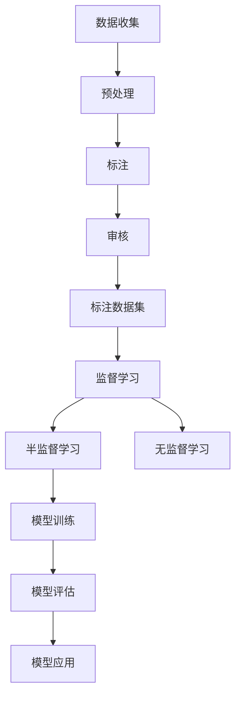

                 

# 数据标注：人工智能发展背后的幕后功臣

> 关键词：数据标注,人工智能,机器学习,深度学习,监督学习,有标签数据,无标签数据,半监督学习,标注质量,标注成本,标注效率

## 1. 背景介绍

### 1.1 问题由来

在当今的人工智能(AI)领域，尤其是机器学习和深度学习领域，数据标注作为人工智能发展背后的重要幕后功臣，其重要性不容忽视。数据标注（Data Annotation）是指将原始无标签数据转化为有标签数据的过程，是监督学习、半监督学习、无监督学习等人工智能训练的必要步骤。可以说，没有标注数据，许多AI技术的进步将无从谈起。

从图像识别、语音识别到自然语言处理（NLP），几乎所有的AI应用都依赖于数据标注。然而，数据标注工作繁琐耗时、成本高昂，成为制约人工智能技术进步的一大瓶颈。因此，深入理解数据标注的原理、流程和技术，对于推动AI技术的进一步发展具有重要意义。

### 1.2 问题核心关键点

数据标注的核心在于确保标注数据的准确性和可靠性，这是任何基于标注数据的AI算法能够有效工作的关键。具体来说，数据标注的核心关键点包括：

- **标注准确性**：标注数据应尽可能反映真实情况，避免标注错误。
- **标注一致性**：标注数据应保持一致性，不同标注者对同一数据点的标注结果应尽可能相同。
- **标注效率**：在保证准确性的前提下，尽可能提高标注效率，降低成本。
- **标注样本数量**：标注样本数量应足够多，以充分反映数据的多样性和复杂性。

## 2. 核心概念与联系

### 2.1 核心概念概述

为更好地理解数据标注在人工智能中的应用，本节将介绍几个密切相关的核心概念：

- **监督学习**：一种常见的机器学习范式，需要大量标注数据进行训练，模型通过学习数据标签与特征之间的关系进行预测。
- **半监督学习**：在标注数据有限的情况下，利用无标签数据进行学习，结合少量标注数据提高模型性能。
- **无标签数据**：未经任何标注的原始数据，其标签需要通过数据标注过程获得。
- **标注数据集**：经过标注处理的带有标签的数据集，是训练监督学习模型的基础。
- **数据标注流程**：从数据收集、预处理到标注、审核的完整流程，确保标注数据的质量。

这些概念之间的逻辑关系可以通过以下Mermaid流程图来展示：



这个流程图展示的数据标注核心概念及其之间的关系：

1. 数据收集：从不同渠道获取原始数据。
2. 数据预处理：对原始数据进行清洗、归一化等处理，以适应后续的标注工作。
3. 数据标注：将预处理后的数据转化为有标签数据。
4. 数据审核：对标注结果进行审核，确保标注数据的准确性和一致性。
5. 标注数据集：由审核通过的标注数据构成的数据集，用于模型训练。
6. 模型训练：利用标注数据集进行监督学习、半监督学习或无监督学习，训练得到模型。
7. 模型评估：对训练好的模型进行性能评估，确保其在新数据上的泛化能力。
8. 模型应用：将模型部署到实际应用中，进行预测、推理等任务。

## 3. 核心算法原理 & 具体操作步骤
### 3.1 算法原理概述

数据标注的算法原理主要基于监督学习，通过将原始无标签数据与标注数据集结合，训练出能够对新数据进行有效预测的模型。其核心思想是通过标注数据集中的标签信息，指导模型学习数据特征与标签之间的映射关系。

具体来说，数据标注的算法流程包括以下几个步骤：

1. **数据收集**：从网络、数据库、传感器等渠道获取原始数据。
2. **数据预处理**：对原始数据进行清洗、归一化、去噪等处理，去除无关信息，增强数据质量。
3. **数据标注**：根据领域知识和专家经验，为数据集中的每个数据点赋予标签，生成标注数据集。
4. **数据审核**：对标注结果进行人工审核，确保标注数据的准确性和一致性。
5. **模型训练**：利用标注数据集进行监督学习或半监督学习，训练得到预测模型。
6. **模型评估**：对训练好的模型在新数据集上进行性能评估，确保其在未知数据上的泛化能力。
7. **模型应用**：将模型部署到实际应用中，进行预测、推理等任务，生成结果。

### 3.2 算法步骤详解

数据标注的具体操作步骤如下：

**Step 1: 数据收集**
从不同渠道获取原始数据，可以是文本、图像、音频、视频等多种形式。

**Step 2: 数据预处理**
对原始数据进行清洗、归一化、去噪等预处理操作，去除无关信息，增强数据质量。

**Step 3: 数据标注**
根据领域知识和专家经验，为数据集中的每个数据点赋予标签。标注过程可以由人工完成，也可以使用自动化工具。

**Step 4: 数据审核**
对标注结果进行人工审核，确保标注数据的准确性和一致性。发现错误或歧义进行修正。

**Step 5: 模型训练**
利用标注数据集进行监督学习或半监督学习，训练得到预测模型。选择合适的优化算法及其参数，设置学习率、批大小、迭代轮数等。

**Step 6: 模型评估**
对训练好的模型在新数据集上进行性能评估，确保其在未知数据上的泛化能力。

**Step 7: 模型应用**
将模型部署到实际应用中，进行预测、推理等任务，生成结果。

### 3.3 算法优缺点

数据标注的算法具有以下优点：

- **监督学习的有效性和泛化能力**：标注数据集的存在使得模型可以学习到数据的标签信息，从而提高模型的泛化能力和预测准确性。
- **提高数据利用率**：标注数据集提供了更多有标签数据，可以更充分地利用数据集，避免数据浪费。
- **适应性强**：标注数据集可以适应各种复杂、多变的实际应用场景。

同时，数据标注的算法也存在一些缺点：

- **标注成本高**：标注过程需要大量人力和时间，成本高昂，特别是对于大规模数据集。
- **标注质量不稳定**：标注结果受标注者的主观因素影响，存在不一致性，影响标注质量。
- **标注效率低**：人工标注速度较慢，难以满足大规模数据集的标注需求。
- **标注依赖专家经验**：标注过程依赖于领域专家的知识和经验，对标注者的专业水平要求高。

### 3.4 算法应用领域

数据标注的算法在多个领域得到了广泛应用，具体包括：

- **图像识别**：如自动驾驶、医疗影像、智能监控等。利用标注数据集训练图像识别模型，实现对不同场景下的物体识别。
- **语音识别**：如智能语音助手、语音识别系统等。利用标注数据集训练语音识别模型，实现对语音信号的识别和理解。
- **自然语言处理**：如机器翻译、情感分析、问答系统等。利用标注数据集训练语言模型，实现对自然语言的理解和生成。
- **生物信息学**：如基因组学、蛋白质组学等。利用标注数据集训练生物信息学模型，实现对生物数据的分析和预测。
- **金融分析**：如信用评分、风险评估等。利用标注数据集训练金融模型，实现对金融数据的分析和预测。
- **医疗健康**：如疾病诊断、个性化治疗等。利用标注数据集训练医疗模型，实现对健康数据的分析和预测。

## 4. 数学模型和公式 & 详细讲解 & 举例说明

### 4.1 数学模型构建

数据标注的数学模型构建通常涉及监督学习、半监督学习、无监督学习的框架。以监督学习为例，其基本框架如下：

设训练数据集为 $D=\{(x_i, y_i)\}_{i=1}^N$，其中 $x_i$ 表示数据特征，$y_i$ 表示标签。模型参数为 $\theta$，目标是最小化损失函数 $\mathcal{L}(\theta)$：

$$
\mathcal{L}(\theta) = \frac{1}{N} \sum_{i=1}^N \ell(f(x_i, \theta), y_i)
$$

其中 $f(x_i, \theta)$ 表示模型对数据 $x_i$ 的预测结果，$\ell$ 表示损失函数。

### 4.2 公式推导过程

以分类任务为例，假设模型 $f(x_i, \theta)$ 为线性分类器，其输出为 $\hat{y}_i=f(x_i, \theta)$。则分类任务中的损失函数通常采用交叉熵损失：

$$
\ell(f(x_i, \theta), y_i) = -\log\frac{\exp(\hat{y}_iy_i)}{\sum_{j=1}^K\exp(\hat{y}_jy_j)}
$$

其中 $K$ 表示类别数，$y_i$ 为 $[1, K]$ 之间的整数，表示数据点 $i$ 的类别。

将上述损失函数带入监督学习的基本框架中，得：

$$
\mathcal{L}(\theta) = \frac{1}{N} \sum_{i=1}^N [-\log\frac{\exp(\hat{y}_iy_i)}{\sum_{j=1}^K\exp(\hat{y}_jy_j)}
$$

在标注数据集 $D$ 上的经验风险最小化问题为：

$$
\theta^* = \mathop{\arg\min}_{\theta} \mathcal{L}(\theta)
$$

利用梯度下降等优化算法，可以求解上述最优化问题，得到模型参数 $\theta$。

### 4.3 案例分析与讲解

假设我们有一个标注数据集 $D=\{(x_i, y_i)\}_{i=1}^N$，其中 $x_i$ 表示手写数字图像，$y_i$ 表示数字标签。我们可以使用卷积神经网络（CNN）作为模型 $f(x_i, \theta)$，利用交叉熵损失函数进行训练。

首先，定义CNN模型结构：

```python
import torch.nn as nn
import torch.nn.functional as F

class CNN(nn.Module):
    def __init__(self):
        super(CNN, self).__init__()
        self.conv1 = nn.Conv2d(1, 32, kernel_size=3, padding=1)
        self.pool = nn.MaxPool2d(kernel_size=2)
        self.fc1 = nn.Linear(32*28*28, 128)
        self.fc2 = nn.Linear(128, 10)

    def forward(self, x):
        x = F.relu(self.conv1(x))
        x = self.pool(x)
        x = F.relu(self.fc1(x.view(-1, 32*28*28)))
        x = self.fc2(x)
        return x
```

然后，定义训练函数：

```python
import torch.optim as optim
from torch.utils.data import DataLoader
from torchvision import datasets, transforms

# 加载MNIST数据集
train_dataset = datasets.MNIST(root='./data', train=True, download=True, transform=transforms.ToTensor())
test_dataset = datasets.MNIST(root='./data', train=False, download=True, transform=transforms.ToTensor())

# 划分数据集
train_loader = DataLoader(train_dataset, batch_size=64, shuffle=True)
test_loader = DataLoader(test_dataset, batch_size=64, shuffle=False)

# 定义模型
model = CNN()

# 定义损失函数和优化器
criterion = nn.CrossEntropyLoss()
optimizer = optim.Adam(model.parameters(), lr=0.001)

# 定义训练函数
def train(epoch):
    model.train()
    for batch_idx, (data, target) in enumerate(train_loader):
        data, target = data.to(device), target.to(device)
        optimizer.zero_grad()
        output = model(data)
        loss = criterion(output, target)
        loss.backward()
        optimizer.step()
        if batch_idx % 100 == 0:
            print('Train Epoch: {} [{}/{} ({:.0f}%)]\tLoss: {:.6f}'.format(
                epoch, batch_idx * len(data), len(train_loader.dataset),
                100. * batch_idx / len(train_loader), loss.item()))

# 训练模型
device = torch.device("cuda" if torch.cuda.is_available() else "cpu")
model.to(device)
train(train_loader, device)
```

在上述代码中，我们使用MNIST数据集进行数字识别的训练，定义了CNN模型结构、损失函数和优化器，并通过训练函数进行模型训练。

## 5. 项目实践：代码实例和详细解释说明
### 5.1 开发环境搭建

在进行数据标注实践前，我们需要准备好开发环境。以下是使用Python进行PyTorch开发的环境配置流程：

1. 安装Anaconda：从官网下载并安装Anaconda，用于创建独立的Python环境。

2. 创建并激活虚拟环境：
```bash
conda create -n pytorch-env python=3.8 
conda activate pytorch-env
```

3. 安装PyTorch：根据CUDA版本，从官网获取对应的安装命令。例如：
```bash
conda install pytorch torchvision torchaudio cudatoolkit=11.1 -c pytorch -c conda-forge
```

4. 安装TensorBoard：用于可视化模型训练过程，与TensorFlow配套使用。

5. 安装TensorFlow：谷歌主导的深度学习框架，生产部署方便。

6. 安装Keras：高级神经网络API，方便模型构建。

完成上述步骤后，即可在`pytorch-env`环境中开始数据标注实践。

### 5.2 源代码详细实现

这里我们以自然语言处理（NLP）中的命名实体识别（NER）任务为例，给出使用Transformers库对BERT模型进行标注的PyTorch代码实现。

首先，定义NER任务的数据处理函数：

```python
from transformers import BertTokenizer
from torch.utils.data import Dataset
import torch

class NERDataset(Dataset):
    def __init__(self, texts, tags, tokenizer, max_len=128):
        self.texts = texts
        self.tags = tags
        self.tokenizer = tokenizer
        self.max_len = max_len
        
    def __len__(self):
        return len(self.texts)
    
    def __getitem__(self, item):
        text = self.texts[item]
        tags = self.tags[item]
        
        encoding = self.tokenizer(text, return_tensors='pt', max_length=self.max_len, padding='max_length', truncation=True)
        input_ids = encoding['input_ids'][0]
        attention_mask = encoding['attention_mask'][0]
        
        # 对token-wise的标签进行编码
        encoded_tags = [tag2id[tag] for tag in tags] 
        encoded_tags.extend([tag2id['O']] * (self.max_len - len(encoded_tags)))
        labels = torch.tensor(encoded_tags, dtype=torch.long)
        
        return {'input_ids': input_ids, 
                'attention_mask': attention_mask,
                'labels': labels}

# 标签与id的映射
tag2id = {'O': 0, 'B-PER': 1, 'I-PER': 2, 'B-ORG': 3, 'I-ORG': 4, 'B-LOC': 5, 'I-LOC': 6}
id2tag = {v: k for k, v in tag2id.items()}

# 创建dataset
tokenizer = BertTokenizer.from_pretrained('bert-base-cased')

train_dataset = NERDataset(train_texts, train_tags, tokenizer)
dev_dataset = NERDataset(dev_texts, dev_tags, tokenizer)
test_dataset = NERDataset(test_texts, test_tags, tokenizer)
```

然后，定义模型和优化器：

```python
from transformers import BertForTokenClassification, AdamW

model = BertForTokenClassification.from_pretrained('bert-base-cased', num_labels=len(tag2id))

optimizer = AdamW(model.parameters(), lr=2e-5)
```

接着，定义训练和评估函数：

```python
from torch.utils.data import DataLoader
from tqdm import tqdm
from sklearn.metrics import classification_report

device = torch.device('cuda') if torch.cuda.is_available() else torch.device('cpu')
model.to(device)

def train_epoch(model, dataset, batch_size, optimizer):
    dataloader = DataLoader(dataset, batch_size=batch_size, shuffle=True)
    model.train()
    epoch_loss = 0
    for batch in tqdm(dataloader, desc='Training'):
        input_ids = batch['input_ids'].to(device)
        attention_mask = batch['attention_mask'].to(device)
        labels = batch['labels'].to(device)
        model.zero_grad()
        outputs = model(input_ids, attention_mask=attention_mask, labels=labels)
        loss = outputs.loss
        epoch_loss += loss.item()
        loss.backward()
        optimizer.step()
    return epoch_loss / len(dataloader)

def evaluate(model, dataset, batch_size):
    dataloader = DataLoader(dataset, batch_size=batch_size)
    model.eval()
    preds, labels = [], []
    with torch.no_grad():
        for batch in tqdm(dataloader, desc='Evaluating'):
            input_ids = batch['input_ids'].to(device)
            attention_mask = batch['attention_mask'].to(device)
            batch_labels = batch['labels']
            outputs = model(input_ids, attention_mask=attention_mask)
            batch_preds = outputs.logits.argmax(dim=2).to('cpu').tolist()
            batch_labels = batch_labels.to('cpu').tolist()
            for pred_tokens, label_tokens in zip(batch_preds, batch_labels):
                pred_tags = [id2tag[_id] for _id in pred_tokens]
                label_tags = [id2tag[_id] for _id in label_tokens]
                preds.append(pred_tags[:len(label_tokens)])
                labels.append(label_tags)
                
    print(classification_report(labels, preds))
```

最后，启动训练流程并在测试集上评估：

```python
epochs = 5
batch_size = 16

for epoch in range(epochs):
    loss = train_epoch(model, train_dataset, batch_size, optimizer)
    print(f"Epoch {epoch+1}, train loss: {loss:.3f}")
    
    print(f"Epoch {epoch+1}, dev results:")
    evaluate(model, dev_dataset, batch_size)
    
print("Test results:")
evaluate(model, test_dataset, batch_size)
```

以上就是使用PyTorch对BERT进行命名实体识别任务标注的完整代码实现。可以看到，得益于Transformers库的强大封装，我们可以用相对简洁的代码完成BERT模型的加载和标注。

### 5.3 代码解读与分析

让我们再详细解读一下关键代码的实现细节：

**NERDataset类**：
- `__init__`方法：初始化文本、标签、分词器等关键组件。
- `__len__`方法：返回数据集的样本数量。
- `__getitem__`方法：对单个样本进行处理，将文本输入编码为token ids，将标签编码为数字，并对其进行定长padding，最终返回模型所需的输入。

**tag2id和id2tag字典**：
- 定义了标签与数字id之间的映射关系，用于将token-wise的预测结果解码回真实的标签。

**训练和评估函数**：
- 使用PyTorch的DataLoader对数据集进行批次化加载，供模型训练和推理使用。
- 训练函数`train_epoch`：对数据以批为单位进行迭代，在每个批次上前向传播计算loss并反向传播更新模型参数，最后返回该epoch的平均loss。
- 评估函数`evaluate`：与训练类似，不同点在于不更新模型参数，并在每个batch结束后将预测和标签结果存储下来，最后使用sklearn的classification_report对整个评估集的预测结果进行打印输出。

**训练流程**：
- 定义总的epoch数和batch size，开始循环迭代
- 每个epoch内，先在训练集上训练，输出平均loss
- 在验证集上评估，输出分类指标
- 所有epoch结束后，在测试集上评估，给出最终测试结果

可以看到，PyTorch配合Transformers库使得BERT标注的代码实现变得简洁高效。开发者可以将更多精力放在数据处理、模型改进等高层逻辑上，而不必过多关注底层的实现细节。

当然，工业级的系统实现还需考虑更多因素，如模型的保存和部署、超参数的自动搜索、更灵活的任务适配层等。但核心的标注范式基本与此类似。

## 6. 实际应用场景
### 6.1 智能客服系统

基于数据标注的对话技术，可以广泛应用于智能客服系统的构建。传统客服往往需要配备大量人力，高峰期响应缓慢，且一致性和专业性难以保证。而使用标注后的对话模型，可以7x24小时不间断服务，快速响应客户咨询，用自然流畅的语言解答各类常见问题。

在技术实现上，可以收集企业内部的历史客服对话记录，将问题和最佳答复构建成监督数据，在此基础上对预训练对话模型进行标注。标注后的对话模型能够自动理解用户意图，匹配最合适的答案模板进行回复。对于客户提出的新问题，还可以接入检索系统实时搜索相关内容，动态组织生成回答。如此构建的智能客服系统，能大幅提升客户咨询体验和问题解决效率。

### 6.2 金融舆情监测

金融机构需要实时监测市场舆论动向，以便及时应对负面信息传播，规避金融风险。传统的人工监测方式成本高、效率低，难以应对网络时代海量信息爆发的挑战。基于数据标注的文本分类和情感分析技术，为金融舆情监测提供了新的解决方案。

具体而言，可以收集金融领域相关的新闻、报道、评论等文本数据，并对其进行主题标注和情感标注。在此基础上对预训练语言模型进行标注，使其能够自动判断文本属于何种主题，情感倾向是正面、中性还是负面。将标注后的模型应用到实时抓取的网络文本数据，就能够自动监测不同主题下的情感变化趋势，一旦发现负面信息激增等异常情况，系统便会自动预警，帮助金融机构快速应对潜在风险。

### 6.3 个性化推荐系统

当前的推荐系统往往只依赖用户的历史行为数据进行物品推荐，无法深入理解用户的真实兴趣偏好。基于数据标注的个性化推荐系统可以更好地挖掘用户行为背后的语义信息，从而提供更精准、多样的推荐内容。

在实践中，可以收集用户浏览、点击、评论、分享等行为数据，提取和用户交互的物品标题、描述、标签等文本内容。将文本内容作为模型输入，用户的后续行为（如是否点击、购买等）作为监督信号，在此基础上标注预训练语言模型。标注后的模型能够从文本内容中准确把握用户的兴趣点。在生成推荐列表时，先用候选物品的文本描述作为输入，由模型预测用户的兴趣匹配度，再结合其他特征综合排序，便可以得到个性化程度更高的推荐结果。

### 6.4 未来应用展望

随着数据标注技术的不断发展，其应用场景也将越来越广泛。

在智慧医疗领域，基于标注的医学影像识别、疾病诊断等技术将提升医疗服务的智能化水平，辅助医生诊疗，加速新药开发进程。

在智能教育领域，标注技术可应用于作业批改、学情分析、知识推荐等方面，因材施教，促进教育公平，提高教学质量。

在智慧城市治理中，标注技术可应用于城市事件监测、舆情分析、应急指挥等环节，提高城市管理的自动化和智能化水平，构建更安全、高效的未来城市。

此外，在企业生产、社会治理、文娱传媒等众多领域，基于标注技术的人工智能应用也将不断涌现，为传统行业数字化转型升级提供新的技术路径。相信随着技术的日益成熟，标注技术将成为人工智能落地应用的重要手段，推动人工智能技术不断进步。

## 7. 工具和资源推荐
### 7.1 学习资源推荐

为了帮助开发者系统掌握数据标注的原理和实践技巧，这里推荐一些优质的学习资源：

1. 《深度学习入门：基于Python的理论与实现》系列博文：由深度学习专家撰写，全面介绍了深度学习模型的构建与优化，包括标注数据的处理。

2. 《自然语言处理综论》课程：斯坦福大学开设的NLP明星课程，涵盖深度学习、语言模型、标注技术等核心概念，是学习标注技术的重要参考。

3. 《深度学习实战》书籍：基于TensorFlow和Keras的深度学习实战指南，详细介绍了标注数据的处理与模型训练。

4. HuggingFace官方文档：Transformers库的官方文档，提供了海量预训练模型和完整的标注样例代码，是上手实践的必备资料。

5. CLUE开源项目：中文语言理解测评基准，涵盖大量不同类型的中文标注数据集，并提供了基于标注的baseline模型，助力中文NLP技术发展。

通过对这些资源的学习实践，相信你一定能够快速掌握数据标注的精髓，并用于解决实际的NLP问题。
###  7.2 开发工具推荐

高效的开发离不开优秀的工具支持。以下是几款用于数据标注开发的常用工具：

1. LabelImg：一款开源的图像标注工具，支持多种格式的图片处理和标注。

2. VGG Image Annotator (VIA)：一个灵活的图像标注工具，支持多格式图片处理和批量标注。

3. RectLabel：一款可视化图像标注工具，支持实时预览标注结果。

4. ELAN：一个专业的标注软件，适用于复杂文本数据的标注和分析。

5. Prodigy：一款基于Web的标注平台，支持多种标注任务和格式，易于使用和扩展。

6. Supervise：一款简单易用的标注工具，支持图像、文本等多种数据类型。

合理利用这些工具，可以显著提升数据标注任务的开发效率，加快创新迭代的步伐。

### 7.3 相关论文推荐

数据标注技术的发展源于学界的持续研究。以下是几篇奠基性的相关论文，推荐阅读：

1. "Crowdsourcing Image Annotation with Multiple Annotation Workers"：论文提出了多标注者协同标注的方法，提升了标注数据的一致性和准确性。

2. "Annotating Weakly Supervised Training Data"：探讨了利用无标签数据进行弱监督训练的方法，提升了模型的泛化能力和标注数据的利用率。

3. "Training Deep Neural Networks with Data Augmentation"：介绍了数据增强技术，通过生成更多标注数据，提高了标注效率和标注数据的多样性。

4. "Learning from No-Label Data"：研究了无标签数据在模型训练中的应用，探索了在无标注数据下进行训练的方法。

5. "Zero-Shot Learning with Word Vectors"：探讨了在无标签数据上进行零样本学习的方法，展示了如何利用预训练的词向量提升模型的性能。

这些论文代表了大数据标注技术的发展脉络。通过学习这些前沿成果，可以帮助研究者把握学科前进方向，激发更多的创新灵感。

## 8. 总结：未来发展趋势与挑战

### 8.1 总结

本文对数据标注技术进行了全面系统的介绍。首先阐述了数据标注在人工智能发展中的重要作用，明确了数据标注在监督学习、半监督学习、无监督学习等机器学习过程中的核心地位。其次，从原理到实践，详细讲解了数据标注的数学模型和关键操作步骤，给出了数据标注任务开发的完整代码实例。同时，本文还广泛探讨了数据标注技术在智能客服、金融舆情、个性化推荐等多个行业领域的应用前景，展示了数据标注技术的巨大潜力。此外，本文精选了数据标注技术的各类学习资源，力求为读者提供全方位的技术指引。

通过本文的系统梳理，可以看到，数据标注技术是人工智能发展不可或缺的重要环节，其高质量的标注数据能够显著提升模型的性能和泛化能力。数据标注的过程虽然繁琐耗时，但通过合理选择标注工具、利用数据增强技术、引入半监督学习等方法，可以在一定程度上缓解标注成本和标注效率的矛盾，确保标注数据的高质量。未来，随着数据标注技术的不断演进，其在人工智能应用中的重要性将更加凸显，推动AI技术在更多领域落地应用。

### 8.2 未来发展趋势

展望未来，数据标注技术将呈现以下几个发展趋势：

1. **自动化标注**：利用AI技术自动完成标注过程，减少人工标注的时间和成本。

2. **多源数据融合**：将不同数据源的标注结果进行融合，提升标注数据的多样性和准确性。

3. **无标签数据利用**：利用无标签数据进行模型训练，提升模型的泛化能力和标注数据的利用率。

4. **跨模态标注**：将不同模态的数据进行联合标注，提升模型对多模态数据的理解能力。

5. **分布式标注**：利用分布式计算和协同标注技术，加速标注过程，提高标注效率。

6. **可解释性增强**：利用可解释性技术，提升标注过程的透明度，增强标注结果的可信度。

### 8.3 面临的挑战

尽管数据标注技术已经取得了一定的进展，但在迈向更加智能化、普适化应用的过程中，它仍面临诸多挑战：

1. **标注成本高**：标注过程需要大量人力和时间，成本高昂，特别是对于大规模数据集。

2. **标注质量不稳定**：标注结果受标注者的主观因素影响，存在不一致性，影响标注质量。

3. **标注效率低**：人工标注速度较慢，难以满足大规模数据集的标注需求。

4. **标注依赖专家经验**：标注过程依赖于领域专家的知识和经验，对标注者的专业水平要求高。

5. **标注数据隐私**：标注过程中涉及大量敏感数据，如何保护数据隐私和安全是一个重要问题。

### 8.4 研究展望

面对数据标注技术所面临的种种挑战，未来的研究需要在以下几个方面寻求新的突破：

1. **自动化标注技术**：进一步提升AI技术在标注过程中的应用，减少人工标注的依赖。

2. **多源数据融合技术**：探索如何通过多源数据联合标注，提升标注数据的丰富性和多样性。

3. **无标签数据利用方法**：研究如何利用无标签数据进行半监督学习，提升模型的泛化能力。

4. **跨模态标注技术**：探索跨模态数据联合标注的方法，提升模型对多模态数据的理解能力。

5. **分布式标注技术**：研究分布式计算和协同标注技术，提升标注过程的效率和可靠性。

6. **标注数据隐私保护**：研究如何在使用标注数据进行训练和推理时，保护数据隐私和安全。

这些研究方向将进一步推动数据标注技术的发展，为人工智能技术的落地应用提供更有力的支撑。

## 9. 附录：常见问题与解答

**Q1：数据标注对AI技术的发展有何重要性？**

A: 数据标注是AI技术发展的重要基础。在监督学习、半监督学习、无监督学习等机器学习过程中，标注数据是训练模型的必要条件。标注数据的质量和数量直接影响模型的性能和泛化能力。高质量的标注数据能够显著提升模型的性能和应用效果，确保其在实际应用场景中的有效性和可靠性。

**Q2：数据标注的过程一般分为哪些步骤？**

A: 数据标注的过程一般分为以下几个步骤：

1. **数据收集**：从不同渠道获取原始数据，如网络、数据库、传感器等。
2. **数据预处理**：对原始数据进行清洗、归一化、去噪等预处理操作，去除无关信息，增强数据质量。
3. **数据标注**：根据领域知识和专家经验，为数据集中的每个数据点赋予标签。
4. **数据审核**：对标注结果进行人工审核，确保标注数据的准确性和一致性。
5. **标注数据集构建**：将审核通过的标注数据构成的数据集，用于模型训练。

**Q3：数据标注的成本如何降低？**

A: 数据标注的成本可以通过以下几种方式降低：

1. **自动化标注技术**：利用AI技术自动完成标注过程，减少人工标注的时间和成本。
2. **多源数据融合**：将不同数据源的标注结果进行融合，提升标注数据的多样性和准确性。
3. **无标签数据利用**：利用无标签数据进行半监督学习，提升模型的泛化能力和标注数据的利用率。
4. **分布式标注**：利用分布式计算和协同标注技术，加速标注过程，提高标注效率。

**Q4：数据标注的质量如何提升？**

A: 数据标注的质量可以通过以下几种方式提升：

1. **标注过程标准化**：制定标注标准和规范，确保标注过程的一致性和准确性。
2. **标注人员培训**：对标注人员进行培训，提升其专业水平和标注技能。
3. **标注结果审核**：对标注结果进行人工审核，发现错误或歧义进行修正。
4. **多标注者协同**：利用多标注者协同标注，提升标注数据的一致性和准确性。
5. **标注数据多样性**：增加标注数据的多样性和代表性，提升模型的泛化能力。

**Q5：数据标注的未来发展方向有哪些？**

A: 数据标注的未来发展方向包括：

1. **自动化标注技术**：进一步提升AI技术在标注过程中的应用，减少人工标注的依赖。
2. **多源数据融合技术**：探索如何通过多源数据联合标注，提升标注数据的丰富性和多样性。
3. **无标签数据利用方法**：研究如何利用无标签数据进行半监督学习，提升模型的泛化能力。
4. **跨模态标注技术**：探索跨模态数据联合标注的方法，提升模型对多模态数据的理解能力。
5. **分布式标注技术**：研究分布式计算和协同标注技术，提升标注过程的效率和可靠性。
6. **标注数据隐私保护**：研究如何在使用标注数据进行训练和推理时，保护数据隐私和安全。

这些研究方向将进一步推动数据标注技术的发展，为人工智能技术的落地应用提供更有力的支撑。

---

作者：禅与计算机程序设计艺术 / Zen and the Art of Computer Programming

