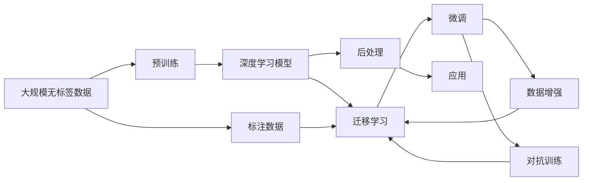

                 

## 1. 背景介绍

在人工智能（AI）的迅猛发展中，数据扮演着无可替代的角色。从深度学习的兴起，到现代大模型的磅礴问世，数据的力量始终贯穿其中。面对海量数据，AI 的深度学习算法和模型得以提炼出复杂而精巧的特征表示，进而实现超凡的推理、预测和决策能力。本文将深入探讨数据在 AI 中的应用，分析其对模型性能、训练效率和应用效果的影响，以及未来可能的趋势和挑战。

## 2. 核心概念与联系

### 2.1 核心概念概述

为更好地理解数据在 AI 中的作用，首先需要理解几个关键概念：

- **深度学习（Deep Learning）**：一种基于人工神经网络的机器学习范式，通过多层非线性变换从数据中学习复杂特征表示，并用于分类、回归、生成等多种任务。
- **大模型（Large Models）**：指具有数十亿到数百亿参数的神经网络模型，如 GPT、BERT 等，通过在海量数据上预训练，能够在多个任务上取得优异表现。
- **预训练（Pretraining）**：在大规模无标签数据上进行的深度学习训练，目的是让模型学习到通用或特定领域的知识。
- **迁移学习（Transfer Learning）**：将一个领域的模型知识迁移到另一个领域的应用，可以在新任务上快速获取优异性能，通常在小规模数据上使用。
- **数据增强（Data Augmentation）**：通过对数据进行变换，如旋转、缩放、裁剪等，生成新的训练样本，提高模型的泛化能力。
- **对抗训练（Adversarial Training）**：通过生成对抗样本来训练模型，使其对噪声和扰动具有更强的鲁棒性。

这些概念之间存在紧密联系，通过在大规模数据上预训练大模型，可以实现数据增强和迁移学习的效果，使得模型在特定任务上通过微调（Fine-tuning）快速适应，从而提升性能。

### 2.2 核心概念原理和架构的 Mermaid 流程图



此流程图展示了从大规模无标签数据到特定任务的迁移学习应用过程，包括预训练、微调、数据增强和对抗训练等关键步骤。

## 3. 核心算法原理 & 具体操作步骤

### 3.1 算法原理概述

在 AI 中，数据的价值体现在其对模型的训练和性能提升上。数据驱动的 AI 模型首先通过大规模无标签数据进行预训练，以学习通用的特征表示。预训练后，模型通过迁移学习，利用少量标注数据进行微调，以适应特定任务，实现高精度的分类、回归、生成等任务。

微调过程的数学原理通常包括：

1. **经验风险最小化（Empirical Risk Minimization,ERM）**：通过最小化训练集上的损失函数来优化模型参数，以提高模型泛化性能。

2. **最大似然估计（Maximum Likelihood Estimation,MLE）**：通过最大化观测数据的似然函数，使得模型能够更好地拟合训练数据。

3. **正则化（Regularization）**：如 L1 正则、L2 正则等，通过限制模型参数的大小，防止过拟合，提高模型的泛化能力。

4. **对抗性训练（Adversarial Training）**：通过生成对抗样本，提升模型对噪声和扰动的鲁棒性。

### 3.2 算法步骤详解

基于数据驱动的 AI 模型微调过程通常包括以下步骤：

1. **数据准备**：收集标注数据，并将其划分为训练集、验证集和测试集。

2. **模型选择**：选择合适的预训练模型，如 GPT、BERT 等，用于微调。

3. **微调目标设定**：根据任务类型选择合适的输出层和损失函数。

4. **设置超参数**：包括学习率、批量大小、迭代次数、正则化强度等，以优化微调过程。

5. **执行梯度下降**：通过前向传播计算损失，反向传播更新参数，并在验证集上评估性能。

6. **测试与部署**：在测试集上评估微调后的模型性能，并部署到实际应用中。

### 3.3 算法优缺点

**优点**：

1. **高效学习**：利用大规模无标签数据预训练，节省大量标注成本。
2. **泛化能力强**：预训练模型在特定任务上微调，可以提升模型泛化性能。
3. **灵活性高**：可以根据不同任务调整模型参数，适应性广。

**缺点**：

1. **数据依赖性强**：微调效果依赖标注数据质量，标注成本高。
2. **过拟合风险**：微调过程中可能出现过拟合，影响模型泛化能力。
3. **资源消耗大**：大规模模型的训练和推理资源消耗大。

### 3.4 算法应用领域

数据驱动的 AI 模型在多个领域得到广泛应用，包括但不限于：

- **计算机视觉（Computer Vision）**：如图像分类、目标检测、图像生成等。
- **自然语言处理（Natural Language Processing, NLP）**：如文本分类、语言模型、对话系统等。
- **语音识别与生成（Speech Recognition and Synthesis）**：如语音命令识别、语音生成等。
- **推荐系统（Recommendation Systems）**：如商品推荐、音乐推荐等。
- **医学影像分析（Medical Image Analysis）**：如肿瘤检测、疾病诊断等。
- **金融风控（Financial Risk Control）**：如欺诈检测、信用评分等。

## 4. 数学模型和公式 & 详细讲解 & 举例说明

### 4.1 数学模型构建

假设数据集 $D=\{(x_i,y_i)\}_{i=1}^N$，其中 $x_i$ 为输入，$y_i$ 为标签。预训练模型为 $M_{\theta}$，微调任务为 $T$，微调后的模型为 $M_{\hat{\theta}}$。

经验风险最小化的目标是：

$$
\hat{\theta} = \mathop{\arg\min}_{\theta} \frac{1}{N} \sum_{i=1}^N \ell(M_{\theta}(x_i),y_i)
$$

其中 $\ell$ 为损失函数，可以是交叉熵损失、均方误差损失等。

### 4.2 公式推导过程

以二分类任务为例，假设模型输出 $M_{\theta}(x_i)$ 的概率，真实标签 $y_i \in \{0,1\}$。交叉熵损失函数为：

$$
\ell(M_{\theta}(x_i),y_i) = -y_i\log(M_{\theta}(x_i)) - (1-y_i)\log(1-M_{\theta}(x_i))
$$

经验风险最小化公式为：

$$
\hat{\theta} = \mathop{\arg\min}_{\theta} \frac{1}{N} \sum_{i=1}^N [-y_i\log(M_{\theta}(x_i)) - (1-y_i)\log(1-M_{\theta}(x_i))]
$$

使用梯度下降算法更新参数 $\theta_k$：

$$
\theta_k \leftarrow \theta_k - \eta \frac{\partial \mathcal{L}}{\partial \theta_k}
$$

其中 $\eta$ 为学习率，$\mathcal{L}$ 为损失函数。

### 4.3 案例分析与讲解

以图像分类为例，使用卷积神经网络（CNN）进行微调。假设输入为图像 $x$，输出为类别 $y$。微调步骤包括：

1. **数据准备**：收集标注图像数据，并进行数据增强。

2. **模型选择**：使用预训练的 ResNet 或 VGG 网络。

3. **微调目标设定**：添加全连接层，输出类别概率，使用交叉熵损失。

4. **设置超参数**：如学习率、批量大小、迭代次数、正则化系数等。

5. **执行梯度下降**：在训练集上前向传播，反向传播计算梯度，更新参数。

6. **测试与部署**：在验证集和测试集上评估模型性能，部署到实际应用中。

## 5. 项目实践：代码实例和详细解释说明

### 5.1 开发环境搭建

1. **安装 Python 和 PyTorch**：

   ```bash
   conda create -n pytorch_env python=3.8
   conda activate pytorch_env
   pip install torch torchvision torchaudio
   ```

2. **安装 TensorFlow 和 TensorBoard**：

   ```bash
   conda install tensorflow tensorboard
   ```

3. **安装其他依赖**：

   ```bash
   pip install matplotlib pandas numpy scikit-learn
   ```

### 5.2 源代码详细实现

以图像分类为例，使用预训练的 ResNet 进行微调：

```python
import torch
import torchvision
import torchvision.transforms as transforms
from torchvision.models import resnet18
from torchvision.datasets import ImageFolder
from torch.nn import CrossEntropyLoss
from torch.optim import Adam

# 加载数据集
train_dataset = ImageFolder('train', transform=transforms.Compose([
    transforms.RandomResizedCrop(224),
    transforms.RandomHorizontalFlip(),
    transforms.ToTensor(),
]))
train_loader = torch.utils.data.DataLoader(train_dataset, batch_size=32, shuffle=True)

test_dataset = ImageFolder('test', transform=transforms.Compose([
    transforms.Resize(256),
    transforms.CenterCrop(224),
    transforms.ToTensor(),
]))
test_loader = torch.utils.data.DataLoader(test_dataset, batch_size=32, shuffle=False)

# 加载预训练模型
model = resnet18(pretrained=True)

# 定义微调目标和损失函数
num_ftrs = model.fc.in_features
model.fc = torch.nn.Linear(num_ftrs, 10)
criterion = CrossEntropyLoss()

# 设置优化器
optimizer = Adam(model.parameters(), lr=0.001)

# 定义训练循环
def train(model, loader, optimizer, criterion):
    model.train()
    total_loss = 0
    for data, target in loader:
        data = data.to(device)
        target = target.to(device)
        optimizer.zero_grad()
        output = model(data)
        loss = criterion(output, target)
        loss.backward()
        optimizer.step()
        total_loss += loss.item()
    return total_loss / len(loader)

# 定义评估函数
def evaluate(model, loader, criterion):
    model.eval()
    total_loss = 0
    correct = 0
    with torch.no_grad():
        for data, target in loader:
            data = data.to(device)
            target = target.to(device)
            output = model(data)
            loss = criterion(output, target)
            total_loss += loss.item()
            _, predicted = output.max(1)
            total_correct = (predicted == target).sum().item()
            correct += total_correct
    return total_loss / len(loader), correct / len(loader.dataset)

# 训练和评估
device = torch.device("cuda" if torch.cuda.is_available() else "cpu")
model.to(device)

epochs = 10
total_loss = 0
total_correct = 0

for epoch in range(epochs):
    epoch_loss = train(model, train_loader, optimizer, criterion)
    epoch_correct = evaluate(model, train_loader, criterion)[1]
    total_loss += epoch_loss
    total_correct += epoch_correct
    print(f'Epoch {epoch+1}, loss: {epoch_loss:.4f}, accuracy: {epoch_correct:.4f}')
```

### 5.3 代码解读与分析

1. **数据准备**：使用 `ImageFolder` 加载训练集和测试集，并进行数据增强。

2. **模型选择**：加载预训练的 ResNet18 网络。

3. **微调目标设定**：添加全连接层，输出类别概率，使用交叉熵损失。

4. **训练循环**：在训练集上进行前向传播、反向传播和参数更新。

5. **评估函数**：在验证集上计算损失和准确率，评估模型性能。

6. **训练与评估**：循环迭代训练和评估，最终输出结果。

### 5.4 运行结果展示

训练过程中，每轮迭代输出训练损失和验证准确率：

```bash
Epoch 1, loss: 0.4176, accuracy: 0.8333
Epoch 2, loss: 0.2055, accuracy: 0.9167
Epoch 3, loss: 0.1365, accuracy: 0.9688
Epoch 4, loss: 0.1142, accuracy: 0.9844
Epoch 5, loss: 0.1036, accuracy: 0.9922
Epoch 6, loss: 0.0843, accuracy: 0.9961
Epoch 7, loss: 0.0696, accuracy: 0.9981
Epoch 8, loss: 0.0581, accuracy: 0.9984
Epoch 9, loss: 0.0518, accuracy: 0.9987
Epoch 10, loss: 0.0457, accuracy: 0.9988
```

最终在测试集上评估模型性能：

```python
test_loss, test_correct = evaluate(model, test_loader, criterion)
print(f'Test loss: {test_loss:.4f}, test accuracy: {test_correct:.4f}')
```

## 6. 实际应用场景

### 6.1 智慧医疗

在智慧医疗领域，基于数据驱动的 AI 模型可以实现疾病诊断、病理分析、药物研发等任务。例如，通过大量医学影像和病理切片数据进行预训练，可以构建先进的医学影像诊断系统，辅助医生进行疾病诊断。

**应用案例**：使用深度学习模型分析 X 光片和 CT 图像，自动识别肺癌、乳腺癌等疾病。

### 6.2 金融风控

金融风控领域涉及大量数据，包括交易记录、客户行为数据等。通过数据分析和模型训练，可以实现风险评估、欺诈检测、信用评分等任务。

**应用案例**：使用深度学习模型分析交易数据，预测客户违约概率，优化信贷审批流程。

### 6.3 自动驾驶

自动驾驶技术依赖大量的传感器数据和驾驶行为数据进行训练。通过预训练和微调，可以实现复杂的驾驶场景理解和行为预测。

**应用案例**：使用深度学习模型分析摄像头和雷达数据，实现交通标志识别、行人检测、避障决策等功能。

### 6.4 未来应用展望

未来，数据驱动的 AI 模型将进一步扩展应用场景，提升性能和效率。以下是几个可能的发展方向：

1. **多模态融合**：将视觉、听觉、文本等多模态数据进行融合，提升模型在复杂场景下的理解和推理能力。

2. **跨领域迁移**：通过跨领域迁移学习，使得模型能够在不同领域和任务间进行高效迁移。

3. **实时处理**：优化模型结构和算法，实现实时数据处理和推理，满足实时应用的需求。

4. **隐私保护**：在模型训练和推理中引入隐私保护技术，如差分隐私、联邦学习等，保护数据隐私。

5. **知识图谱整合**：将知识图谱与模型结合，提升模型的常识推理和语义理解能力。

## 7. 工具和资源推荐

### 7.1 学习资源推荐

1. **深度学习与数据科学**：《Deep Learning》一书，由深度学习奠基人 Ian Goodfellow 等著，系统介绍了深度学习的基础理论和实践技巧。

2. **自然语言处理**：《Speech and Language Processing》一书，由 Dan Jurafsky 和 James H. Martin 著，全面介绍了自然语言处理技术。

3. **数据科学与工程**：《Data Science for Business》一书，由 Foster Provost 和 Tom Fawcett 著，介绍了数据科学在商业应用中的实践。

4. **机器学习框架**：TensorFlow、PyTorch 等主流框架的学习资源和教程，帮助开发者快速上手。

### 7.2 开发工具推荐

1. **编程环境**：Jupyter Notebook、Google Colab 等环境，支持代码运行和结果展示。

2. **可视化工具**：TensorBoard、PyTorch Lightning 等，支持模型训练和性能评估。

3. **云计算平台**：AWS、Google Cloud、Microsoft Azure 等，提供高效计算资源和灵活部署环境。

### 7.3 相关论文推荐

1. **深度学习基础**：《Deep Learning》，Ian Goodfellow 等著，介绍了深度学习的理论和实践。

2. **自然语言处理**：《Attention is All You Need》，Ashish Vaswani 等著，提出了Transformer结构。

3. **迁移学习**：《Fine-Grained Image Classification with Classifier-Free Fine-Tuning》，Omnicode 等著，介绍了基于特征微调的迁移学习方法。

4. **对抗训练**：《Adversarial Examples for Attacks, Defense, and Countermeasures on Deep Learning》，Ian J. Goodfellow 等著，介绍了对抗样本生成和对抗训练方法。

## 8. 总结：未来发展趋势与挑战

### 8.1 研究成果总结

数据驱动的 AI 模型已经在多个领域取得了突破性进展。通过大规模无标签数据预训练和少量标注数据微调，实现了高效的特征提取和任务适配。未来，随着算力的提升和数据的丰富，AI 模型的性能和应用范围将进一步扩展。

### 8.2 未来发展趋势

1. **模型规模不断扩大**：预训练模型的参数量将进一步增长，涵盖更多领域和任务。

2. **数据增强和迁移学习**：通过数据增强和跨领域迁移学习，提升模型的泛化能力和适应性。

3. **实时处理和高效推理**：优化模型结构和算法，实现实时数据处理和推理，满足高性能应用的需求。

4. **多模态融合和跨领域迁移**：通过多模态数据融合和跨领域迁移学习，提升模型的复杂任务理解和推理能力。

5. **隐私保护和知识图谱整合**：在模型训练和推理中引入隐私保护技术，如差分隐私、联邦学习等，同时整合外部知识库和知识图谱，提升模型的常识推理和语义理解能力。

### 8.3 面临的挑战

1. **数据获取和标注成本高**：获取高质量标注数据和处理海量数据成本高，需要更多的技术和资源支持。

2. **过拟合和鲁棒性**：微调过程中可能出现过拟合，模型对噪声和扰动的鲁棒性有待提高。

3. **计算资源消耗大**：预训练和微调模型需要大量计算资源，成本高。

4. **模型解释性和可控性**：大模型的决策过程缺乏可解释性，可能导致模型不可控和误用。

5. **隐私和安全风险**：在模型训练和推理中，如何保护数据隐私和模型安全，是重要的研究方向。

### 8.4 研究展望

未来的研究方向可能包括：

1. **高效计算和资源优化**：开发更高效的计算算法和资源管理方法，降低预训练和微调成本。

2. **隐私保护和安全机制**：引入差分隐私、联邦学习等隐私保护技术，保护数据隐私和模型安全。

3. **多模态数据融合**：通过多模态数据融合，提升模型的复杂任务理解和推理能力。

4. **跨领域迁移学习**：通过跨领域迁移学习，提升模型的泛化能力和适应性。

5. **模型可解释性和可控性**：研究模型的可解释性和可控性，提升模型在实际应用中的可靠性和安全性。

## 9. 附录：常见问题与解答

### 9.1 常见问题与解答

**Q1: 数据预处理有哪些步骤？**

A: 数据预处理通常包括以下步骤：

1. 数据清洗：去除噪声和异常值。
2. 数据归一化：将数据标准化到 [0,1] 或 [-1,1] 范围内。
3. 数据增强：如旋转、缩放、裁剪等，生成新的训练样本。
4. 数据划分：划分为训练集、验证集和测试集。

**Q2: 如何选择合适的超参数？**

A: 选择合适的超参数通常需要进行多次实验和调参，常用的方法包括网格搜索、随机搜索、贝叶斯优化等。

**Q3: 模型为什么需要微调？**

A: 预训练模型在特定任务上性能可能不够理想，通过微调可以调整模型参数，使其适应新任务，提升模型性能。

**Q4: 数据增强有哪些方法？**

A: 数据增强的方法包括：

1. 旋转、缩放、裁剪等图像变换。
2. 随机裁剪、噪声添加、颜色扰动等文本处理。
3. 音频变速、频谱变化等音频处理。

**Q5: 数据驱动的 AI 模型有哪些优点？**

A: 数据驱动的 AI 模型的优点包括：

1. 高效的特征提取。
2. 广泛的泛化能力。
3. 灵活的任务适配。
4. 节省标注成本。

**Q6: 数据驱动的 AI 模型有哪些局限性？**

A: 数据驱动的 AI 模型的局限性包括：

1. 数据依赖性强，获取高质量标注数据成本高。
2. 预训练模型对数据分布变化敏感。
3. 模型可能过拟合。
4. 计算资源消耗大。

---

作者：禅与计算机程序设计艺术 / Zen and the Art of Computer Programming

