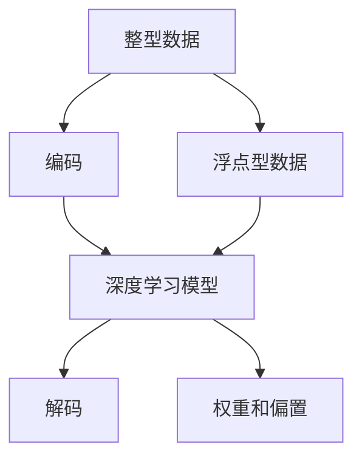

                 

# 整数和浮点数：神经网络的数据基础

在深度学习的世界里，数据是神经网络的基础。对于整型和浮点型数据，不同的处理方式将直接影响模型的性能和效率。本文将深入探讨神经网络中整型和浮点型数据的原理和应用，帮助读者理解这些数据类型在深度学习中的角色和重要性。

## 1. 背景介绍

### 1.1 问题由来
深度学习模型由大量的参数组成，需要大量的数据进行训练。数据不仅影响模型的训练速度，还直接影响模型的准确性和泛化能力。数据通常分为整型数据和浮点型数据，其中整型数据被广泛应用于输入数据的编码和表示，而浮点型数据则常用于模型的权重和参数。了解这两种数据类型的原理和应用，对于深度学习的开发者和研究人员来说至关重要。

### 1.2 问题核心关键点
- 整型数据在深度学习中的编码和表示。
- 浮点型数据在深度学习模型中的作用和优缺点。
- 整型和浮点型数据在深度学习中的应用场景。
- 整型和浮点型数据的处理方式对深度学习模型的影响。

## 2. 核心概念与联系

### 2.1 核心概念概述

为了更好地理解整型和浮点型数据在深度学习中的作用，我们首先需要了解一些核心概念：

- **整型数据(Integer Data)**：指数据类型为整数的数值，常用于表示离散性的特征或参数。
- **浮点型数据(Floating-Point Data)**：指数据类型为浮点数的数值，常用于表示连续性的特征或参数，包括模型的权重和偏置等。
- **深度学习模型(Deep Learning Model)**：由多层神经网络组成的模型，用于处理复杂的数据结构和任务。
- **编码和解码(Encoding and Decoding)**：将输入数据转化为模型可以处理的数值形式，将模型输出转化为可解释的形式。

这些核心概念之间的关系可以通过以下Mermaid流程图来展示：



这个流程图展示整型和浮点型数据在深度学习中的作用和联系：

1. 整型数据通过编码转化为模型可以处理的数值形式。
2. 浮点型数据作为模型的权重和偏置，直接参与模型的训练和推理。
3. 编码后的整型数据和浮点型数据一起输入到深度学习模型中，用于学习数据之间的关系和规律。

## 3. 核心算法原理 & 具体操作步骤

### 3.1 算法原理概述

整型和浮点型数据在深度学习中有着不同的处理方式和原理。下面我们将详细讲解这两种数据类型的算法原理。

#### 整型数据的处理
整型数据在深度学习中通常用于编码和表示输入特征。例如，在图像识别任务中，图像像素值通常被表示为整型数据，方便模型进行特征提取和处理。整型数据的主要处理方式包括：

- **编码**：将输入数据转化为整型数值，通常使用哈希函数或索引映射等方法。
- **归一化**：对整型数据进行归一化处理，以提高模型的稳定性和泛化能力。

#### 浮点型数据的处理
浮点型数据在深度学习中主要用于模型的权重和偏置。浮点型数据的主要处理方式包括：

- **初始化**：在模型训练前，对浮点型数据进行初始化处理，如Xavier初始化、He初始化等，以提高模型的收敛速度和稳定性。
- **更新**：在模型训练过程中，使用梯度下降等优化算法更新浮点型数据，以最小化损失函数。

### 3.2 算法步骤详解

整型和浮点型数据在深度学习中的应用主要体现在模型的编码和解码过程中。下面我们将详细介绍这些步骤。

#### 整型数据的编码
整型数据的编码通常包括以下步骤：

1. **数据收集**：收集输入数据，并将其转化为整型数值。
2. **编码**：使用哈希函数或索引映射等方法将整型数据进行编码。
3. **数据归一化**：对编码后的整型数据进行归一化处理，以提高模型的稳定性和泛化能力。

#### 浮点型数据的初始化
浮点型数据的初始化通常包括以下步骤：

1. **随机初始化**：在模型训练前，对浮点型数据进行随机初始化处理，以打破对称性，避免梯度消失或爆炸。
2. **Xavier初始化**：使用Xavier初始化方法，根据输入和输出的神经元数量，自动调整初始化值。
3. **He初始化**：使用He初始化方法，对深度神经网络进行更加稳健的初始化处理。

#### 浮点型数据的更新
浮点型数据的更新通常包括以下步骤：

1. **计算梯度**：使用梯度下降等优化算法，计算模型损失函数对浮点型数据的梯度。
2. **更新权重**：根据计算出的梯度，使用优化算法更新浮点型数据，以最小化损失函数。
3. **正则化**：使用L2正则化等技术，防止模型过拟合，提高模型的泛化能力。

### 3.3 算法优缺点

整型和浮点型数据在深度学习中各有优缺点，下面我们将详细介绍这些优缺点。

#### 整型数据的优点
1. **高效性**：整型数据通常比浮点型数据更小，占用更少的内存和计算资源，加速模型的训练和推理。
2. **稳定性**：整型数据通常具有更好的数值稳定性，可以避免数值计算中的精度损失。

#### 整型数据的缺点
1. **有限性**：整型数据通常只能表示有限的数值范围，难以表示一些连续性的特征。
2. **离散性**：整型数据通常只能表示离散性的特征，难以表示一些连续性的特征。

#### 浮点型数据的优点
1. **连续性**：浮点型数据可以表示连续性的特征，适合处理复杂的数据结构和任务。
2. **精确性**：浮点型数据通常具有更高的精度，可以更精确地表示数值和模型参数。

#### 浮点型数据的缺点
1. **资源占用**：浮点型数据通常比整型数据占用更多的内存和计算资源，降低模型的训练和推理速度。
2. **数值不稳定**：浮点型数据在数值计算中容易受到舍入误差和数值不稳定性的影响，导致模型不稳定。

### 3.4 算法应用领域

整型和浮点型数据在深度学习中有着广泛的应用，下面是一些典型的应用领域：

- **图像处理**：在图像处理中，像素值通常被表示为整型数据，方便模型进行特征提取和处理。
- **自然语言处理**：在自然语言处理中，词语的向量表示通常被表示为浮点型数据，方便模型进行语义理解和生成。
- **推荐系统**：在推荐系统中，用户的行为和偏好通常被表示为整型数据，方便模型进行特征提取和推荐。
- **语音识别**：在语音识别中，音频信号通常被表示为浮点型数据，方便模型进行特征提取和分类。

## 4. 数学模型和公式 & 详细讲解  
### 4.1 数学模型构建

整型和浮点型数据在深度学习中有着不同的数学模型和公式。下面我们将详细介绍这些数学模型和公式。

#### 整型数据的数学模型
整型数据在深度学习中通常用于编码和表示输入特征，其数学模型可以表示为：

$$
\mathbf{x} = \mathbf{x}_{int}
$$

其中，$\mathbf{x}$ 表示整型数据，$\mathbf{x}_{int}$ 表示原始的输入数据。整型数据通常经过编码和归一化处理，转化为模型可以处理的数值形式。

#### 浮点型数据的数学模型
浮点型数据在深度学习中主要用于模型的权重和偏置，其数学模型可以表示为：

$$
\mathbf{w} = \mathbf{w}_{fp}
$$

其中，$\mathbf{w}$ 表示浮点型数据，$\mathbf{w}_{fp}$ 表示模型的权重和偏置。浮点型数据通常经过初始化和更新处理，参与模型的训练和推理。

### 4.2 公式推导过程

整型和浮点型数据在深度学习中的应用可以通过以下公式进行推导：

#### 整型数据的编码公式
整型数据的编码公式可以表示为：

$$
\mathbf{x}_{int} = \text{Hash}(\mathbf{x}_{raw})
$$

其中，$\mathbf{x}_{raw}$ 表示原始的输入数据，$\text{Hash}(\cdot)$ 表示哈希函数。整型数据的编码通常使用哈希函数或索引映射等方法，将输入数据转化为整型数值。

#### 浮点型数据的初始化公式
浮点型数据的初始化公式可以表示为：

$$
\mathbf{w}_{fp} = \text{Xavier}(\mathbf{W}_{in}, \mathbf{W}_{out})
$$

其中，$\mathbf{W}_{in}$ 表示输入神经元的数量，$\mathbf{W}_{out}$ 表示输出神经元的数量，$\text{Xavier}$ 表示Xavier初始化方法。浮点型数据的初始化通常使用Xavier初始化或He初始化方法，根据输入和输出的神经元数量，自动调整初始化值。

#### 浮点型数据的更新公式
浮点型数据的更新公式可以表示为：

$$
\mathbf{w}_{fp} = \mathbf{w}_{fp} - \eta \nabla_{\mathbf{w}_{fp}}\mathcal{L}
$$

其中，$\eta$ 表示学习率，$\nabla_{\mathbf{w}_{fp}}\mathcal{L}$ 表示损失函数对浮点型数据的梯度。浮点型数据的更新通常使用梯度下降等优化算法，根据计算出的梯度，使用优化算法更新浮点型数据，以最小化损失函数。

### 4.3 案例分析与讲解

为了更好地理解整型和浮点型数据在深度学习中的作用，下面我们将通过一个具体的案例进行讲解。

**案例：手写数字识别**

手写数字识别任务中，输入数据是手写数字的图像，像素值通常被表示为整型数据。对于整型数据的编码，可以使用哈希函数或索引映射等方法，将像素值转化为整型数值。例如，可以使用以下公式进行编码：

$$
\mathbf{x}_{int} = \text{Hash}(\mathbf{x}_{raw})
$$

其中，$\mathbf{x}_{raw}$ 表示原始的输入数据，$\text{Hash}(\cdot)$ 表示哈希函数。在手写数字识别任务中，整型数据通常经过编码和归一化处理，转化为模型可以处理的数值形式。

对于浮点型数据的初始化，可以使用Xavier初始化或He初始化方法，根据输入和输出的神经元数量，自动调整初始化值。例如，可以使用以下公式进行初始化：

$$
\mathbf{w}_{fp} = \text{Xavier}(\mathbf{W}_{in}, \mathbf{W}_{out})
$$

其中，$\mathbf{W}_{in}$ 表示输入神经元的数量，$\mathbf{W}_{out}$ 表示输出神经元的数量，$\text{Xavier}$ 表示Xavier初始化方法。在手写数字识别任务中，浮点型数据通常经过初始化和更新处理，参与模型的训练和推理。

## 5. 项目实践：代码实例和详细解释说明

### 5.1 开发环境搭建

在进行深度学习项目实践前，我们需要准备好开发环境。以下是使用Python进行PyTorch开发的环境配置流程：

1. 安装Anaconda：从官网下载并安装Anaconda，用于创建独立的Python环境。

2. 创建并激活虚拟环境：
```bash
conda create -n pytorch-env python=3.8 
conda activate pytorch-env
```

3. 安装PyTorch：根据CUDA版本，从官网获取对应的安装命令。例如：
```bash
conda install pytorch torchvision torchaudio cudatoolkit=11.1 -c pytorch -c conda-forge
```

4. 安装TensorFlow：从官网下载安装包，使用pip进行安装。例如：
```bash
pip install tensorflow
```

5. 安装各类工具包：
```bash
pip install numpy pandas scikit-learn matplotlib tqdm jupyter notebook ipython
```

完成上述步骤后，即可在`pytorch-env`环境中开始项目实践。

### 5.2 源代码详细实现

下面我们以手写数字识别任务为例，给出使用TensorFlow对模型进行训练和测试的PyTorch代码实现。

首先，定义手写数字识别任务的数学模型：

```python
import torch
import torch.nn as nn
import torch.optim as optim

class HandwrittenDigitModel(nn.Module):
    def __init__(self):
        super(HandwrittenDigitModel, self).__init__()
        self.fc1 = nn.Linear(784, 256)
        self.fc2 = nn.Linear(256, 10)
    
    def forward(self, x):
        x = x.view(-1, 784)
        x = torch.relu(self.fc1(x))
        x = self.fc2(x)
        return x

# 定义损失函数和优化器
model = HandwrittenDigitModel()
criterion = nn.CrossEntropyLoss()
optimizer = optim.SGD(model.parameters(), lr=0.01)
```

然后，定义训练和评估函数：

```python
from torchvision import datasets, transforms

# 定义数据预处理
transform = transforms.Compose([
    transforms.ToTensor(),
    transforms.Normalize((0.5,), (0.5,))
])

# 加载MNIST数据集
train_dataset = datasets.MNIST('data/', train=True, download=True, transform=transform)
test_dataset = datasets.MNIST('data/', train=False, transform=transform)

# 定义数据加载器
train_loader = torch.utils.data.DataLoader(train_dataset, batch_size=64, shuffle=True)
test_loader = torch.utils.data.DataLoader(test_dataset, batch_size=64, shuffle=False)

# 训练函数
def train_epoch(model, data_loader, optimizer):
    model.train()
    total_loss = 0
    for i, (inputs, labels) in enumerate(data_loader):
        inputs, labels = inputs.to(device), labels.to(device)
        optimizer.zero_grad()
        outputs = model(inputs)
        loss = criterion(outputs, labels)
        loss.backward()
        optimizer.step()
        total_loss += loss.item()
    return total_loss / len(data_loader)

# 评估函数
def evaluate(model, data_loader):
    model.eval()
    total_correct = 0
    total_count = 0
    with torch.no_grad():
        for inputs, labels in data_loader:
            inputs, labels = inputs.to(device), labels.to(device)
            outputs = model(inputs)
            _, predicted = torch.max(outputs.data, 1)
            total_correct += (predicted == labels).sum().item()
            total_count += labels.size(0)
    return total_correct / total_count

# 训练模型
device = torch.device('cuda' if torch.cuda.is_available() else 'cpu')
model.to(device)

for epoch in range(10):
    train_loss = train_epoch(model, train_loader, optimizer)
    test_acc = evaluate(model, test_loader)
    print(f'Epoch {epoch+1}, train loss: {train_loss:.4f}, test acc: {test_acc:.4f}')
```

以上就是使用PyTorch对手写数字识别任务进行训练和测试的完整代码实现。可以看到，使用PyTorch可以方便地定义模型和损失函数，进行数据的加载和处理，以及模型的训练和评估。

### 5.3 代码解读与分析

让我们再详细解读一下关键代码的实现细节：

**HandwrittenDigitModel类**：
- `__init__`方法：定义模型的结构，包括两个全连接层。
- `forward`方法：定义前向传播过程，包括线性变换和激活函数。

**train_epoch和evaluate函数**：
- `train_epoch`函数：定义训练过程，包括前向传播、计算损失、反向传播和优化器更新。
- `evaluate`函数：定义评估过程，包括前向传播和计算准确率。

**训练流程**：
- 定义总的epoch数，开始循环迭代
- 每个epoch内，在训练集上训练，输出平均损失和测试集上的准确率
- 所有epoch结束后，输出最终的训练结果

可以看到，PyTorch提供了丰富的API和工具，可以大大简化深度学习项目的开发过程。合理利用这些工具，可以显著提升深度学习项目的开发效率，加快创新迭代的步伐。

## 6. 实际应用场景

### 6.1 手写数字识别

手写数字识别任务中，输入数据是手写数字的图像，像素值通常被表示为整型数据。对于整型数据的编码，可以使用哈希函数或索引映射等方法，将像素值转化为整型数值。例如，可以使用以下公式进行编码：

$$
\mathbf{x}_{int} = \text{Hash}(\mathbf{x}_{raw})
$$

其中，$\mathbf{x}_{raw}$ 表示原始的输入数据，$\text{Hash}(\cdot)$ 表示哈希函数。在手写数字识别任务中，整型数据通常经过编码和归一化处理，转化为模型可以处理的数值形式。

对于浮点型数据的初始化，可以使用Xavier初始化或He初始化方法，根据输入和输出的神经元数量，自动调整初始化值。例如，可以使用以下公式进行初始化：

$$
\mathbf{w}_{fp} = \text{Xavier}(\mathbf{W}_{in}, \mathbf{W}_{out})
$$

其中，$\mathbf{W}_{in}$ 表示输入神经元的数量，$\mathbf{W}_{out}$ 表示输出神经元的数量，$\text{Xavier}$ 表示Xavier初始化方法。在手写数字识别任务中，浮点型数据通常经过初始化和更新处理，参与模型的训练和推理。

### 6.2 图像分类

图像分类任务中，输入数据是图像像素值，通常被表示为浮点型数据。对于浮点型数据的初始化，可以使用Xavier初始化或He初始化方法，根据输入和输出的神经元数量，自动调整初始化值。例如，可以使用以下公式进行初始化：

$$
\mathbf{w}_{fp} = \text{Xavier}(\mathbf{W}_{in}, \mathbf{W}_{out})
$$

其中，$\mathbf{W}_{in}$ 表示输入神经元的数量，$\mathbf{W}_{out}$ 表示输出神经元的数量，$\text{Xavier}$ 表示Xavier初始化方法。在图像分类任务中，浮点型数据通常经过初始化和更新处理，参与模型的训练和推理。

对于整型数据的编码，可以使用哈希函数或索引映射等方法，将像素值转化为整型数值。例如，可以使用以下公式进行编码：

$$
\mathbf{x}_{int} = \text{Hash}(\mathbf{x}_{raw})
$$

其中，$\mathbf{x}_{raw}$ 表示原始的输入数据，$\text{Hash}(\cdot)$ 表示哈希函数。在图像分类任务中，整型数据通常经过编码和归一化处理，转化为模型可以处理的数值形式。

### 6.3 自然语言处理

自然语言处理任务中，输入数据是词语的向量表示，通常被表示为浮点型数据。对于浮点型数据的初始化，可以使用Xavier初始化或He初始化方法，根据输入和输出的神经元数量，自动调整初始化值。例如，可以使用以下公式进行初始化：

$$
\mathbf{w}_{fp} = \text{Xavier}(\mathbf{W}_{in}, \mathbf{W}_{out})
$$

其中，$\mathbf{W}_{in}$ 表示输入神经元的数量，$\mathbf{W}_{out}$ 表示输出神经元的数量，$\text{Xavier}$ 表示Xavier初始化方法。在自然语言处理任务中，浮点型数据通常经过初始化和更新处理，参与模型的训练和推理。

对于整型数据的编码，可以使用哈希函数或索引映射等方法，将词语转化为整型数值。例如，可以使用以下公式进行编码：

$$
\mathbf{x}_{int} = \text{Hash}(\mathbf{x}_{raw})
$$

其中，$\mathbf{x}_{raw}$ 表示原始的输入数据，$\text{Hash}(\cdot)$ 表示哈希函数。在自然语言处理任务中，整型数据通常经过编码和归一化处理，转化为模型可以处理的数值形式。

### 6.4 未来应用展望

随着深度学习技术的发展，整型和浮点型数据在深度学习中的应用将更加广泛。未来，整型和浮点型数据的应用将更加深入，如在多模态学习、知识图谱、推荐系统等领域，整型和浮点型数据将发挥更加重要的作用。

在多模态学习中，整型和浮点型数据可以用于不同模态数据的编码和表示，实现多模态数据的融合和协同建模。在知识图谱中，整型和浮点型数据可以用于知识节点的编码和表示，实现知识图谱的构建和推理。在推荐系统中，整型和浮点型数据可以用于用户行为和偏好的编码和表示，实现推荐模型的训练和推理。

## 7. 工具和资源推荐
### 7.1 学习资源推荐

为了帮助开发者系统掌握整型和浮点型数据在深度学习中的原理和应用，这里推荐一些优质的学习资源：

1. 《Deep Learning》书籍：Ian Goodfellow、Yoshua Bengio和Aaron Courville合著的深度学习经典教材，详细介绍了深度学习的理论基础和实践技巧。
2. 《Python深度学习》书籍：Francois Chollet所著，详细介绍了使用TensorFlow和Keras进行深度学习的技巧和实践。
3. 《TensorFlow官方文档》：TensorFlow官方文档，提供了完整的API和工具介绍，是深度学习开发者必备的参考资料。
4. 《PyTorch官方文档》：PyTorch官方文档，提供了丰富的API和工具介绍，是深度学习开发者必备的参考资料。
5. 《自然语言处理综论》书籍：斯坦福大学李飞飞教授所著，详细介绍了自然语言处理的基础知识和前沿技术。

通过对这些资源的学习实践，相信你一定能够全面掌握整型和浮点型数据在深度学习中的应用，并用于解决实际的深度学习问题。

### 7.2 开发工具推荐

高效的开发离不开优秀的工具支持。以下是几款用于深度学习开发的工具：

1. PyTorch：基于Python的开源深度学习框架，灵活动态的计算图，适合快速迭代研究。
2. TensorFlow：由Google主导开发的开源深度学习框架，生产部署方便，适合大规模工程应用。
3. Keras：基于Python的高层深度学习API，简单易用，适合快速原型开发。
4. Weights & Biases：模型训练的实验跟踪工具，可以记录和可视化模型训练过程中的各项指标，方便对比和调优。
5. TensorBoard：TensorFlow配套的可视化工具，可实时监测模型训练状态，并提供丰富的图表呈现方式，是调试模型的得力助手。

合理利用这些工具，可以显著提升深度学习项目的开发效率，加快创新迭代的步伐。

### 7.3 相关论文推荐

整型和浮点型数据在深度学习中的应用源于学界的持续研究。以下是几篇奠基性的相关论文，推荐阅读：

1. "ImageNet Classification with Deep Convolutional Neural Networks"：Alex Krizhevsky、Ilya Sutskever和Geoffrey Hinton合著，介绍了使用深度卷积神经网络进行图像分类的经典方法。
2. "Natural Language Processing (almost) from Scratch"：Klas Månsson和Daniel Kühlisch合著，介绍了使用深度学习进行自然语言处理的基本原理和技巧。
3. "Understanding the Difficulties of Training Deep Feedforward Neural Networks"：Yann LeCun、Léon Bottou、George Bengio和Christopher J.C. Burges合著，介绍了深度神经网络的训练和优化方法。

这些论文代表了大数据和深度学习的发展脉络。通过学习这些前沿成果，可以帮助研究者把握学科前进方向，激发更多的创新灵感。

## 8. 总结：未来发展趋势与挑战

### 8.1 总结

本文对整型和浮点型数据在深度学习中的原理和应用进行了全面系统的介绍。首先，我们详细讲解了整型和浮点型数据在深度学习中的编码和表示方式，帮助读者理解这些数据类型在深度学习中的角色和重要性。其次，我们介绍了整型和浮点型数据在深度学习中的初始化、更新和优化方法，帮助读者掌握这些数据类型的处理技巧。最后，我们探讨了整型和浮点型数据在深度学习中的实际应用场景，展示了这些数据类型在深度学习中的广泛应用。

通过本文的系统梳理，可以看到，整型和浮点型数据在深度学习中扮演着重要的角色，对于深度学习模型的性能和效率有着直接的影响。合理利用整型和浮点型数据，可以显著提升深度学习模型的训练速度、推理速度和准确率，进一步推动深度学习技术的发展和应用。

### 8.2 未来发展趋势

整型和浮点型数据在深度学习中的应用将持续发展，未来将呈现以下几个趋势：

1. **多模态融合**：整型和浮点型数据将广泛应用于多模态数据的编码和表示，实现多模态数据的融合和协同建模。
2. **知识图谱**：整型和浮点型数据将用于知识图谱的构建和推理，实现知识表示和知识推理。
3. **推荐系统**：整型和浮点型数据将用于推荐系统的用户行为和偏好编码，实现推荐模型的训练和推理。
4. **深度强化学习**：整型和浮点型数据将应用于深度强化学习中的状态编码和奖励表示，实现智能决策和行为控制。
5. **自动化学习**：整型和浮点型数据将用于自动化学习的特征选择和超参数优化，实现自动化的模型训练和调优。

这些趋势将推动整型和浮点型数据在深度学习中的应用不断拓展，提升深度学习模型的性能和应用范围。相信随着深度学习技术的持续发展，整型和浮点型数据的应用将更加广泛，深度学习模型也将更加智能化、自动化。

### 8.3 面临的挑战

尽管整型和浮点型数据在深度学习中的应用已经取得了显著进展，但在迈向更加智能化、普适化应用的过程中，它仍面临着诸多挑战：

1. **数值稳定性**：浮点型数据在数值计算中容易受到舍入误差和数值不稳定性的影响，导致模型不稳定。如何在保证数值稳定的前提下，提高模型的训练和推理效率，是一个重要的研究方向。
2. **资源占用**：浮点型数据通常比整型数据占用更多的内存和计算资源，降低模型的训练和推理速度。如何在保证模型性能的前提下，减少资源占用，是一个重要的研究方向。
3. **模型泛化**：整型和浮点型数据在深度学习中的应用容易过拟合，导致模型泛化能力不足。如何在保证模型泛化能力的前提下，提高模型的训练效率，是一个重要的研究方向。
4. **多模态融合**：不同模态数据之间的编码和表示差异较大，如何进行有效的融合和协同建模，是一个重要的研究方向。
5. **自动化学习**：整型和浮点型数据在自动化学习中的应用，如何自动选择特征和超参数，实现自动化的模型训练和调优，是一个重要的研究方向。

这些挑战将需要研究者不断探索和突破，推动整型和浮点型数据在深度学习中的应用不断进步。相信随着深度学习技术的不断发展和完善，这些挑战终将一一被克服，整型和浮点型数据在深度学习中的应用将更加广泛和深入。

### 8.4 研究展望

面对整型和浮点型数据在深度学习中面临的挑战，未来的研究需要在以下几个方面寻求新的突破：

1. **数值稳定化技术**：开发更加稳定的数值计算方法，减少数值不稳定性的影响，提高模型的训练和推理效率。
2. **资源优化技术**：开发更加高效的资源利用方法，减少资源占用，提升模型的训练和推理速度。
3. **模型泛化能力**：开发更加泛化的模型训练方法，提高模型的泛化能力和稳定性。
4. **多模态融合技术**：开发更加有效的多模态融合方法，实现不同模态数据的有效融合和协同建模。
5. **自动化学习技术**：开发更加自动化的模型训练和调优方法，实现自动化的特征选择和超参数优化。

这些研究方向的探索将推动整型和浮点型数据在深度学习中的应用不断进步，为深度学习技术的发展和应用提供新的动力。相信随着深度学习技术的不断发展和完善，整型和浮点型数据在深度学习中的应用将更加广泛和深入，推动深度学习技术迈向更加智能化、自动化、普适化的新阶段。

## 9. 附录：常见问题与解答

**Q1：整型数据和浮点型数据在深度学习中的区别是什么？**

A: 整型数据和浮点型数据在深度学习中的主要区别在于其数值范围和精度。整型数据通常用于编码和表示离散性的特征，如像素值、类别标签等，具有有限的数值范围和更高的数值稳定性。浮点型数据通常用于编码和表示连续性的特征，如模型权重、偏置等，具有更高的精度和更大的数值范围。

**Q2：整型数据和浮点型数据在深度学习中的编码和表示方式有哪些？**

A: 整型数据的编码和表示方式通常包括哈希函数、索引映射等方法，将离散性的特征转化为整型数值。浮点型数据的编码和表示方式通常包括Xavier初始化、He初始化等方法，根据输入和输出的神经元数量，自动调整初始化值。

**Q3：整型数据和浮点型数据在深度学习中的优缺点是什么？**

A: 整型数据在深度学习中的优点包括更高的数值稳定性、更低的资源占用等，但缺点是有限的数值范围和离散性。浮点型数据在深度学习中的优点包括更高的精度、更大的数值范围等，但缺点是更高的资源占用和数值不稳定性。

**Q4：整型数据和浮点型数据在深度学习中的应用场景有哪些？**

A: 整型数据在深度学习中通常用于图像处理、自然语言处理等任务中的特征编码，如像素值、词语向量等。浮点型数据在深度学习中通常用于模型的权重和偏置，参与模型的训练和推理。整型数据和浮点型数据在深度学习中的应用场景非常广泛，几乎涵盖了所有的深度学习任务。

**Q5：整型数据和浮点型数据在深度学习中的处理方式有哪些？**

A: 整型数据在深度学习中的处理方式通常包括编码、归一化等方法，将离散性的特征转化为整型数值。浮点型数据在深度学习中的处理方式通常包括初始化、更新、正则化等方法，参与模型的训练和推理。

---

作者：禅与计算机程序设计艺术 / Zen and the Art of Computer Programming

