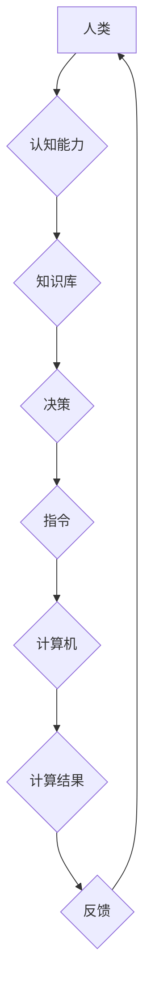

> 人类计算，可持续发展，人工智能，计算模型，算法优化，数据驱动，未来趋势

## 1. 背景介绍

在当今数字时代，计算能力是推动社会进步和经济增长的关键驱动力。从智能手机到云计算，从自动驾驶到医疗诊断，计算技术无处不在，深刻地改变着我们的生活方式和工作模式。然而，随着计算需求的不断增长，传统计算模式面临着能源消耗高、环境污染严重等挑战。如何实现计算的可持续发展，成为一个亟待解决的课题。

人类计算作为一种新兴的计算模式，以人类的智慧和认知能力为基础，通过人机协同的方式进行计算，具有高效、灵活、可扩展等特点。它不仅可以缓解传统计算模式的资源压力，还能更好地解决一些复杂、多变、需要人类主观判断的问题。

## 2. 核心概念与联系

### 2.1 人类计算的概念

人类计算是指利用人类的认知能力、创造力、判断力和经验，与计算机技术相结合，共同完成计算任务的一种新型计算模式。它强调人与机器的协同合作，将人类的智慧融入到计算过程中，以实现更高效、更智能、更可持续的计算。

### 2.2 人类计算与传统计算的对比

| 特征 | 传统计算 | 人类计算 |
|---|---|---|
| 计算方式 | 依赖于算法和数据处理 | 依赖于人类的认知和判断 |
| 计算能力 | 强大，但缺乏灵活性 | 灵活性强，但计算能力有限 |
| 数据处理 | 依赖于结构化数据 | 能够处理结构化和非结构化数据 |
| 问题解决 | 擅长解决确定性问题 | 擅长解决复杂、多变的问题 |
| 可持续性 | 能耗高，环境污染严重 | 能耗低，环境友好 |

### 2.3 人类计算的架构



## 3. 核心算法原理 & 具体操作步骤

### 3.1 算法原理概述

人类计算的核心算法原理是基于人类认知能力的模拟和增强。通过将人类的知识、经验和决策过程转化为可执行的算法，可以实现人机协同计算。常见的算法包括：

* **启发式算法:** 借鉴人类的经验和直觉，通过启发式规则和策略来解决问题。
* **机器学习算法:** 利用数据训练模型，使模型能够自动学习和改进。
* **深度学习算法:** 基于多层神经网络，能够学习更复杂的模式和关系。

### 3.2 算法步骤详解

以启发式算法为例，其步骤如下：

1. **问题定义:** 明确需要解决的问题，并将其转化为可计算的形式。
2. **知识表示:** 将人类的知识和经验表示为算法可理解的形式，例如规则、模型或图谱。
3. **启发式规则设计:** 设计基于人类经验和直觉的启发式规则，用于指导算法的搜索和决策。
4. **算法执行:** 根据启发式规则和问题数据，执行算法并生成解决方案。
5. **结果评估:** 对算法生成的解决方案进行评估，并根据评估结果进行调整和改进。

### 3.3 算法优缺点

**优点:**

* 灵活性强，能够适应复杂、多变的问题。
* 能够利用人类的经验和知识，提高解决问题的效率。
* 能够处理非结构化数据，扩展计算能力。

**缺点:**

* 计算效率相对较低，难以处理海量数据。
* 算法设计依赖于人类经验，存在主观性和局限性。
* 算法的解释性和可信度相对较低。

### 3.4 算法应用领域

* **决策支持:** 辅助人类做出更明智的决策，例如医疗诊断、金融投资、市场营销等。
* **创意设计:** 辅助人类进行创意设计，例如艺术创作、产品设计、建筑设计等。
* **问题解决:** 帮助人类解决复杂、多变的问题，例如科学研究、工程设计、社会问题等。

## 4. 数学模型和公式 & 详细讲解 & 举例说明

### 4.1 数学模型构建

人类计算可以抽象为一个信息处理系统，其数学模型可以描述为：

$$
I = f(K, E, A)
$$

其中：

* $I$：计算结果
* $K$：人类知识
* $E$：环境信息
* $A$：算法

### 4.2 公式推导过程

该公式表明，计算结果取决于人类知识、环境信息和算法的相互作用。

* 人类知识提供问题的理解和解决方案的框架。
* 环境信息提供问题的具体背景和约束条件。
* 算法提供计算过程的逻辑和步骤。

### 4.3 案例分析与讲解

例如，在医疗诊断领域，人类计算可以将患者的症状、病史、检查结果等环境信息与医生积累的医学知识和经验相结合，通过机器学习算法进行分析和预测，最终得出诊断结果。

## 5. 项目实践：代码实例和详细解释说明

### 5.1 开发环境搭建

* 操作系统：Windows/macOS/Linux
* 编程语言：Python
* 开发工具：Jupyter Notebook

### 5.2 源代码详细实现

```python
# 人类计算示例代码

# 知识库
knowledge_base = {
    "症状": {
        "发烧": ["感冒", "流感", "肺炎"],
        "咳嗽": ["感冒", "支气管炎", "肺炎"],
        "头痛": ["感冒", "脑炎", "偏头痛"]
    },
    "疾病": {
        "感冒": "病毒感染",
        "流感": "病毒感染",
        "肺炎": "细菌感染"
    }
}

# 环境信息
symptoms = ["发烧", "咳嗽"]

# 启发式规则
def diagnose(symptoms):
    possible_diseases = []
    for symptom in symptoms:
        possible_diseases.extend(knowledge_base["症状"][symptom])
    return list(set(possible_diseases))

# 算法执行
diagnosis_result = diagnose(symptoms)

# 结果展示
print("可能的疾病：", diagnosis_result)
```

### 5.3 代码解读与分析

该代码示例展示了人类计算的基本流程：

1. 定义知识库，存储人类的医学知识。
2. 获取环境信息，即患者的症状。
3. 设计启发式规则，根据症状推断可能的疾病。
4. 执行算法，根据规则和知识库生成诊断结果。
5. 展示结果，输出可能的疾病列表。

### 5.4 运行结果展示

```
可能的疾病： ['感冒', '流感', '肺炎']
```

## 6. 实际应用场景

### 6.1 医疗诊断

人类计算可以辅助医生进行疾病诊断，提高诊断准确率和效率。例如，通过分析患者的症状、病史、检查结果等信息，结合医学知识库和机器学习算法，可以辅助医生诊断各种疾病。

### 6.2 科学研究

人类计算可以帮助科学家解决复杂科学问题，加速科研进展。例如，通过分析海量实验数据，结合专家知识和机器学习算法，可以帮助科学家发现新的规律和模式。

### 6.3 教育培训

人类计算可以个性化定制教育内容，提高学习效率。例如，通过分析学生的学习情况和知识掌握程度，结合教学资源和人工智能算法，可以为学生提供个性化的学习方案和辅导。

### 6.4 未来应用展望

随着人工智能技术的发展，人类计算将在更多领域得到应用，例如：

* **智能制造:** 人类计算可以帮助制造企业优化生产流程，提高生产效率和产品质量。
* **金融服务:** 人类计算可以帮助金融机构进行风险管理、欺诈检测和个性化服务。
* **城市管理:** 人类计算可以帮助城市管理部门优化交通规划、资源分配和公共服务。

## 7. 工具和资源推荐

### 7.1 学习资源推荐

* **书籍:**
    * 《人类计算：可持续发展的推动力》
    * 《人工智能：一种现代方法》
    * 《深度学习》
* **在线课程:**
    * Coursera 人工智能课程
    * edX 深度学习课程
    * Udacity 人工智能工程师 Nanodegree

### 7.2 开发工具推荐

* **编程语言:** Python
* **机器学习库:** TensorFlow, PyTorch, scikit-learn
* **数据可视化工具:** Matplotlib, Seaborn

### 7.3 相关论文推荐

* **人类计算的定义和分类**
* **人类计算的算法和模型**
* **人类计算的应用案例和未来展望**

## 8. 总结：未来发展趋势与挑战

### 8.1 研究成果总结

人类计算作为一种新兴的计算模式，具有高效、灵活、可扩展等特点，能够有效解决传统计算模式难以解决的问题。

### 8.2 未来发展趋势

* **算法优化:** 开发更智能、更有效的算法，提高人类计算的效率和准确性。
* **知识表示:** 建立更完善的知识表示方法，更好地融合人类知识和计算能力。
* **人机交互:** 设计更自然、更直观的交互方式，增强人机协同的效率和体验。

### 8.3 面临的挑战

* **算法解释性:** 提高人类计算算法的解释性和可信度，增强用户对算法结果的信任。
* **数据安全:** 保护人类计算过程中产生的数据安全，防止数据泄露和滥用。
* **伦理问题:** 关注人类计算的伦理问题，确保其应用符合人类价值观和社会规范。

### 8.4 研究展望

未来，人类计算将继续朝着更智能、更可持续的方向发展，为人类社会带来更多福祉。


## 9. 附录：常见问题与解答

### 9.1 什么是人类计算？

人类计算是指利用人类的认知能力、创造力、判断力和经验，与计算机技术相结合，共同完成计算任务的一种新型计算模式。

### 9.2 人类计算有什么优势？

人类计算具有高效、灵活、可扩展等特点，能够解决传统计算模式难以解决的问题，例如复杂、多变的问题，以及需要人类主观判断的问题。

### 9.3 人类计算有哪些应用场景？

人类计算的应用场景非常广泛，例如医疗诊断、科学研究、教育培训、智能制造、金融服务、城市管理等。

### 9.4 人类计算面临哪些挑战？

人类计算面临着算法解释性、数据安全、伦理问题等挑战。

### 9.5 人类计算的未来发展趋势是什么？

未来，人类计算将朝着更智能、更可持续的方向发展，例如算法优化、知识表示、人机交互等方面。


作者：禅与计算机程序设计艺术 / Zen and the Art of Computer Programming 
<end_of_turn>