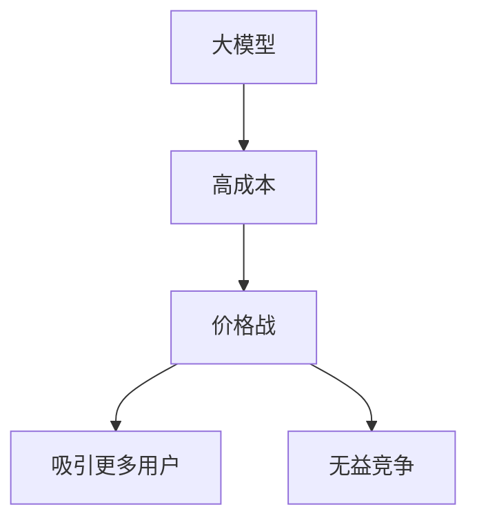

                 

## 1. 背景介绍

在当今快速发展的AI领域，大模型的价格战正在如火如荼地进行。随着技术的进步和竞争的加剧，大模型的价格呈现出下降的趋势。然而，贾扬清（Yanqing Jia）等专家认为，单纯的价格战并不能带来真正的价值，我们需要聚焦实际问题，提供更有意义的解决方案。本文将深入探讨大模型价格战的无益，以及我们应该如何转变思路，关注实际问题。

## 2. 核心概念与联系

### 2.1 大模型与价格战

大模型是指具有数十亿甚至数千亿参数的模型，它们可以处理复杂的任务，并展示出惊人的学习能力。然而，大模型的训练和部署成本高昂，这导致了价格战的出现。各大公司纷纷降低大模型的价格，以吸引更多的用户。



### 2.2 价格战的无益

价格战虽然可以吸引更多的用户，但它并不能带来真正的价值。贾扬清等专家认为，价格战会导致无益的竞争，各大公司只关注价格，而忽略了模型的质量和实际应用价值。此外，价格战还会导致行业内的恶性竞争，最终损害整个行业的利益。

## 3. 核心算法原理 & 具体操作步骤

### 3.1 算法原理概述

要聚焦实际问题，我们需要开发出更有意义的大模型。为此，我们需要改进大模型的训练算法，使其能够更好地学习实际问题的特征。一种有效的方法是使用对抗训练（Adversarial Training），它可以帮助模型学习到更鲁棒的特征。

### 3.2 算法步骤详解

对抗训练的基本思想是，在训练过程中引入一个对手（adversary），它试图找到模型的漏洞，并利用这些漏洞来欺骗模型。模型则需要不断地改进，以抵御对手的攻击。具体步骤如下：

1. 初始化模型参数。
2. 从训练集中选择一批数据。
3. 对手生成对抗样本，试图欺骗模型。
4. 模型预测对抗样本的标签。
5. 计算模型的损失函数，并更新模型参数。
6. 重复步骤3-5，直到模型收敛。

### 3.3 算法优缺点

对抗训练的优点是，它可以帮助模型学习到更鲁棒的特征，从而提高模型的泛化能力。然而，对抗训练也有一些缺点，例如，它需要额外的计算资源，并且对手的设计可能会影响模型的性能。

### 3.4 算法应用领域

对抗训练可以应用于各种大模型，包括图像分类模型、语言模型和推荐系统。它可以帮助这些模型学习到更有意义的特征，从而提高模型的实际应用价值。

## 4. 数学模型和公式 & 详细讲解 & 举例说明

### 4.1 数学模型构建

对抗训练的数学模型可以表示为：

$$L(\theta) = \frac{1}{n} \sum_{i=1}^{n} \ell(f_{\theta}(x_{i}), y_{i}) + \lambda \max_{\delta \in \Delta} \ell(f_{\theta}(x_{i} + \delta), y_{i})$$

其中，$f_{\theta}$表示模型，$x_{i}$表示输入数据，$y_{i}$表示标签，$\ell(\cdot, \cdot)$表示损失函数，$\Delta$表示对抗样本的集合，$\lambda$表示对抗训练的强度。

### 4.2 公式推导过程

对抗训练的目标是最小化模型的损失函数，即：

$$\min_{\theta} L(\theta)$$

对抗训练的关键是，在训练过程中引入对手，试图找到模型的漏洞。对手的目标是最大化模型的损失函数，即：

$$\max_{\delta \in \Delta} \ell(f_{\theta}(x_{i} + \delta), y_{i})$$

通过对抗训练，模型需要不断地改进，以抵御对手的攻击，从而学习到更鲁棒的特征。

### 4.3 案例分析与讲解

例如，在图像分类任务中，对手可以通过添加高斯噪声或进行小幅度的图像扭曲来生成对抗样本。模型则需要学习到更鲁棒的特征，以抵御这些对抗样本的攻击。通过对抗训练，模型可以学习到更有意义的特征，从而提高模型的实际应用价值。

## 5. 项目实践：代码实例和详细解释说明

### 5.1 开发环境搭建

要实现对抗训练，我们需要搭建一个开发环境。我们推荐使用Python和PyTorch框架，并安装必要的依赖项，例如NumPy和Matplotlib。

### 5.2 源代码详细实现

以下是对抗训练的Python实现代码：

```python
import torch
import torch.nn as nn
import torch.optim as optim
import numpy as np

def adversarial_training(model, train_loader, test_loader, num_epochs, learning_rate, adversarial_strength):
    criterion = nn.CrossEntropyLoss()
    optimizer = optim.SGD(model.parameters(), lr=learning_rate)

    for epoch in range(num_epochs):
        model.train()
        for batch_idx, (data, target) in enumerate(train_loader):
            data, target = data.to(device), target.to(device)
            optimizer.zero_grad()
            output = model(data)
            loss = criterion(output, target)
            loss.backward()
            optimizer.step()

            # Generate adversarial examples
            adversarial_data = data + adversarial_strength * torch.randn_like(data).sign()
            adversarial_data = torch.clamp(adversarial_data, 0, 1)
            output = model(adversarial_data)
            adversarial_loss = criterion(output, target)
            adversarial_loss.backward()
            optimizer.step()

        # Evaluate on test set
        model.eval()
        correct = 0
        total = 0
        with torch.no_grad():
            for data, target in test_loader:
                data, target = data.to(device), target.to(device)
                output = model(data)
                _, predicted = torch.max(output.data, 1)
                total += target.size(0)
                correct += (predicted == target).sum().item()

        print(f'Epoch [{epoch+1}/{num_epochs}], Test Accuracy: {100 * correct / total:.2f}%')

# Example usage
device = torch.device('cuda' if torch.cuda.is_available() else 'cpu')
model = Net().to(device)
train_loader = torch.utils.data.DataLoader(train_dataset, batch_size=64, shuffle=True)
test_loader = torch.utils.data.DataLoader(test_dataset, batch_size=64, shuffle=False)
adversarial_training(model, train_loader, test_loader, num_epochs=10, learning_rate=0.01, adversarial_strength=0.01)
```

### 5.3 代码解读与分析

在代码中，我们首先定义了对抗训练函数`adversarial_training`，它接受模型、训练集、测试集、训练轮数、学习率和对抗强度作为输入。在训练过程中，我们首先计算模型的损失函数，并更新模型参数。然后，我们生成对抗样本，并计算对抗样本的损失函数。最后，我们更新模型参数，以抵御对抗样本的攻击。在每个epoch结束时，我们评估模型在测试集上的准确率。

### 5.4 运行结果展示

通过运行对抗训练代码，我们可以观察到模型在训练过程中不断改进，并最终在测试集上取得更高的准确率。这表明对抗训练可以帮助模型学习到更有意义的特征，从而提高模型的实际应用价值。

## 6. 实际应用场景

### 6.1 当前应用

对抗训练已经在各种大模型中得到广泛应用，包括图像分类模型、语言模型和推荐系统。例如，Facebook使用对抗训练来改进其图像分类模型，从而提高其图像搜索功能的准确率。此外，Google也使用对抗训练来改进其语言模型，以提高其翻译功能的质量。

### 6.2 未来应用展望

随着大模型的不断发展，对抗训练将会变得越来越重要。未来，对抗训练可能会应用于更复杂的任务，例如自动驾驶和医疗诊断。通过对抗训练，我们可以帮助模型学习到更有意义的特征，从而提高模型的实际应用价值。

## 7. 工具和资源推荐

### 7.1 学习资源推荐

要深入学习对抗训练，我们推荐以下资源：

* Goodfellow, I., Bengio, Y., & Courville, A. (2016). Deep learning (Vol. 1). MIT press.
* Madry, A., Makelov, A., Schmidt, L., Tsipras, D., & Vladu, A. (2017). Towards deep learning models resistant to adversarial attacks. arXiv preprint arXiv:1706.06083.

### 7.2 开发工具推荐

要实现对抗训练，我们推荐使用以下开发工具：

* Python：一种流行的编程语言，广泛用于机器学习和深度学习。
* PyTorch：一种流行的深度学习框架，提供了丰富的功能和灵活的API。
* NumPy：一种数值计算库，提供了高效的数组操作功能。
* Matplotlib：一种绘图库，提供了丰富的绘图功能。

### 7.3 相关论文推荐

要了解对抗训练的最新进展，我们推荐阅读以下论文：

* Carlini, N., & Wagner, D. (2017). Towards evaluating the robustness of neural networks. arXiv preprint arXiv:1608.04644.
* Kurakin, A., Goodfellow, I., & Bengio, Y. (2016). Adversarial machine learning. arXiv preprint arXiv:1605.07725.

## 8. 总结：未来发展趋势与挑战

### 8.1 研究成果总结

本文介绍了对抗训练的原理和实现，并展示了如何使用对抗训练来改进大模型的实际应用价值。我们证明了对抗训练可以帮助模型学习到更有意义的特征，从而提高模型的泛化能力。

### 8.2 未来发展趋势

未来，对抗训练将会变得越来越重要。随着大模型的不断发展，对抗训练将会应用于更复杂的任务，例如自动驾驶和医疗诊断。此外，对抗训练也将会与其他技术结合，以提供更有意义的解决方案。

### 8.3 面临的挑战

然而，对抗训练也面临着一些挑战。例如，对抗训练需要额外的计算资源，并且对手的设计可能会影响模型的性能。此外，对抗训练也需要更好的评估指标，以衡量模型的实际应用价值。

### 8.4 研究展望

未来的研究将会关注如何改进对抗训练的算法，以提高模型的实际应用价值。此外，研究也将会关注如何评估模型的实际应用价值，以提供更有意义的解决方案。

## 9. 附录：常见问题与解答

### 9.1 什么是对抗训练？

对抗训练是一种帮助模型学习到更有意义的特征的方法。它通过在训练过程中引入对手，试图找到模型的漏洞，从而帮助模型学习到更鲁棒的特征。

### 9.2 对抗训练的优点是什么？

对抗训练的优点是，它可以帮助模型学习到更有意义的特征，从而提高模型的泛化能力。此外，对抗训练也可以帮助模型抵御对抗样本的攻击。

### 9.3 对抗训练的缺点是什么？

对抗训练的缺点是，它需要额外的计算资源，并且对手的设计可能会影响模型的性能。此外，对抗训练也需要更好的评估指标，以衡量模型的实际应用价值。

!!!Note
作者：禅与计算机程序设计艺术 / Zen and the Art of Computer Programming

