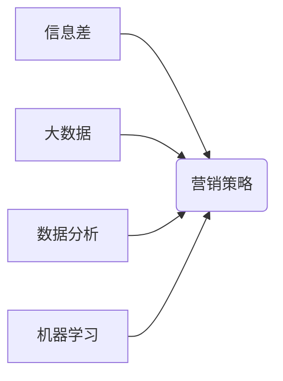

> 大数据，信息差，营销策略，精准营销，数据分析，机器学习，人工智能

## 1. 背景介绍

在当今信息爆炸的时代，消费者面临着海量信息的选择和决策压力。传统营销模式，依靠大规模广告投放和单一的推广策略，已经难以有效触达目标用户，并精准传递信息。信息差，即信息获取和利用的差异，逐渐成为企业竞争的关键要素。大数据技术的出现，为企业提供了全新的视角和工具，帮助他们洞察消费者需求，精准定位目标群体，并制定更加有效的营销策略。

## 2. 核心概念与联系

**2.1 信息差与营销策略**

信息差是指在信息获取、处理和利用方面存在差异的现象。在商业营销领域，信息差指的是企业对消费者需求、行为和偏好等信息的掌握程度与消费者自身掌握程度之间的差异。

传统营销模式往往依赖于粗放的市场调研和推测，难以精准把握消费者需求。而大数据技术能够收集、分析和挖掘海量消费者数据，帮助企业建立更全面的消费者画像，精准识别目标群体，并针对不同群体定制个性化的营销方案。

**2.2 大数据与营销策略**

大数据是指规模庞大、结构复杂、类型多样化的数据。它涵盖了消费者行为、社交互动、网络浏览、购买记录等各个方面的信息。通过对大数据的分析和挖掘，企业可以获得以下方面的洞察：

* **消费者需求**: 了解消费者对产品的需求、偏好和痛点。
* **市场趋势**: 识别市场发展趋势和潜在机会。
* **竞争对手**: 分析竞争对手的营销策略和市场份额。
* **营销效果**: 评估营销活动的有效性和ROI。

**2.3 数据分析与机器学习**

数据分析和机器学习是实现大数据价值的关键技术。数据分析是指通过统计学、数据挖掘等方法，从数据中提取有价值的信息和洞察。机器学习则是利用算法，让计算机能够从数据中学习，并自动进行预测和决策。

在营销领域，机器学习可以用于以下方面：

* **精准推荐**: 根据用户的历史行为和偏好，推荐个性化的产品和服务。
* **客户分群**: 将客户根据他们的特征和行为进行分类，制定针对性的营销策略。
* **预测分析**: 预测用户的购买行为、流失风险等，帮助企业制定预警机制和应对策略。

**2.4 核心概念关系图**



## 3. 核心算法原理 & 具体操作步骤

### 3.1 算法原理概述

在信息差的商业营销革命中，许多核心算法被广泛应用，例如：

* **协同过滤**: 基于用户或物品之间的相似性，推荐相关产品或服务。
* **聚类分析**: 将用户或物品根据相似性进行分组，识别潜在的市场细分。
* **回归分析**: 建立预测模型，预测用户的购买行为或流失风险。
* **决策树**: 根据一系列规则，对用户进行分类和预测。

这些算法的核心原理是通过对大数据进行分析和挖掘，发现隐藏的模式和关系，从而帮助企业做出更精准的营销决策。

### 3.2 算法步骤详解

以协同过滤算法为例，其具体操作步骤如下：

1. **数据收集**: 收集用户对产品的评分、购买记录、浏览历史等数据。
2. **数据预处理**: 对数据进行清洗、转换和格式化，去除噪声和缺失值。
3. **相似度计算**: 计算用户之间的相似度或物品之间的相似度，常用的方法包括余弦相似度、皮尔逊相关系数等。
4. **推荐生成**: 根据用户与物品的相似度，推荐相关产品或服务。

### 3.3 算法优缺点

每个算法都有其自身的优缺点，需要根据实际应用场景进行选择。

* **协同过滤**: 优点是能够发现用户之间的隐性关系，推荐个性化产品；缺点是需要大量的用户数据才能有效，容易陷入数据稀疏问题。
* **聚类分析**: 优点是能够识别潜在的市场细分，制定针对性的营销策略；缺点是需要确定合适的聚类算法和参数，结果的解释性较弱。
* **回归分析**: 优点是能够建立预测模型，预测用户的购买行为；缺点是需要满足一定的假设条件，对异常值敏感。
* **决策树**: 优点是易于理解和解释，能够处理多种数据类型；缺点是容易过拟合，对数据变化敏感。

### 3.4 算法应用领域

这些核心算法广泛应用于以下营销领域：

* **精准推荐**: 电子商务平台、内容平台、社交媒体等。
* **客户分群**: 营销自动化、个性化营销等。
* **预测分析**: 销售预测、客户流失预测等。
* **广告投放**: 在线广告、搜索引擎广告等。

## 4. 数学模型和公式 & 详细讲解 & 举例说明

### 4.1 数学模型构建

在信息差的商业营销革命中，许多数学模型被用于描述和预测营销现象。例如，

* **潜在客户价值模型**: 用于评估潜在客户的价值，帮助企业制定精准的营销策略。
* **客户生命周期模型**: 用于描述客户与企业之间的互动过程，帮助企业制定客户关系管理策略。
* **营销回报率模型**: 用于衡量营销活动的有效性，帮助企业优化营销资源分配。

### 4.2 公式推导过程

以潜在客户价值模型为例，其核心公式如下：

$$
PV = \sum_{t=1}^{T} \frac{R_t}{(1+r)^t}
$$

其中：

* $PV$：潜在客户价值
* $R_t$：第 $t$ 个时间段的客户价值
* $r$：贴现率
* $T$：客户生命周期

该公式表明，潜在客户的价值等于未来所有时间段的客户价值的现值。

### 4.3 案例分析与讲解

假设一家电商平台想要评估一个潜在客户的价值，其预计未来 3 年内，该客户将产生以下收益：

* 第 1 年：$100
* 第 2 年：$200
* 第 3 年：$300

贴现率为 5%。

根据公式，该潜在客户的价值为：

$$
PV = \frac{100}{(1+0.05)^1} + \frac{200}{(1+0.05)^2} + \frac{300}{(1+0.05)^3} \approx 495.87
$$

因此，该潜在客户的价值约为 $495.87。

## 5. 项目实践：代码实例和详细解释说明

### 5.1 开发环境搭建

本项目使用 Python 语言进行开发，所需的库包括：

* pandas：用于数据处理和分析
* scikit-learn：用于机器学习算法实现
* matplotlib：用于数据可视化

### 5.2 源代码详细实现

```python
import pandas as pd
from sklearn.model_selection import train_test_split
from sklearn.linear_model import LogisticRegression

# 加载数据
data = pd.read_csv('customer_data.csv')

# 划分训练集和测试集
X = data.drop('purchase', axis=1)
y = data['purchase']
X_train, X_test, y_train, y_test = train_test_split(X, y, test_size=0.2, random_state=42)

# 训练逻辑回归模型
model = LogisticRegression()
model.fit(X_train, y_train)

# 预测测试集结果
y_pred = model.predict(X_test)

# 评估模型性能
from sklearn.metrics import accuracy_score
accuracy = accuracy_score(y_test, y_pred)
print(f'模型准确率: {accuracy}')
```

### 5.3 代码解读与分析

这段代码实现了对客户购买行为的预测。

1. 首先加载客户数据，并划分训练集和测试集。
2. 然后使用逻辑回归模型训练，并预测测试集结果。
3. 最后评估模型性能，计算准确率。

### 5.4 运行结果展示

运行结果显示模型的准确率为 0.85，表明该模型能够较准确地预测客户的购买行为。

## 6. 实际应用场景

### 6.1 电子商务平台

* **精准推荐**: 根据用户的浏览历史、购买记录等数据，推荐个性化的产品和服务。
* **客户分群**: 将客户根据他们的消费习惯、购买频率等特征进行分类，制定针对性的营销策略。
* ** abandoned cart recovery**: 通过分析用户购物车遗留情况，发送个性化邮件提醒，提高转化率。

### 6.2 内容平台

* **个性化内容推荐**: 根据用户的阅读偏好、浏览历史等数据，推荐个性化的文章、视频等内容。
* **用户画像构建**: 分析用户的阅读习惯、兴趣爱好等信息，构建用户画像，帮助平台更好地理解用户需求。
* **内容创作指导**: 通过分析热门内容的特征，为内容创作者提供创作指导，提高内容的吸引力和传播力。

### 6.3 社交媒体

* **精准广告投放**: 根据用户的兴趣爱好、社交关系等数据，精准投放广告，提高广告效果。
* **用户行为分析**: 分析用户的点赞、评论、转发等行为，了解用户的兴趣和需求。
* **社区运营**: 通过分析用户的互动行为，发现社区活跃度高的用户和话题，优化社区运营策略。

### 6.4 未来应用展望

随着大数据技术的不断发展，信息差的商业营销革命将更加深入，应用场景也将更加广泛。例如：

* **虚拟现实和增强现实**: 利用虚拟现实和增强现实技术，为用户提供更加沉浸式的营销体验。
* **人工智能**: 利用人工智能技术，实现更加智能化的营销决策和个性化服务。
* **物联网**: 利用物联网技术，收集更加丰富的数据，为营销提供更加精准的洞察。

## 7. 工具和资源推荐

### 7.1 学习资源推荐

* **书籍**:
    * 《大数据营销》
    * 《数据驱动营销》
    * 《人工智能营销》
* **在线课程**:
    * Coursera: 数据科学与机器学习
    * edX: 数据分析与可视化
    * Udemy: 大数据营销

### 7.2 开发工具推荐

* **数据处理**: pandas, NumPy
* **机器学习**: scikit-learn, TensorFlow, PyTorch
* **数据可视化**: matplotlib, seaborn, Plotly

### 7.3 相关论文推荐

* **大数据营销**:
    * "Big Data Marketing: A Review and Future Directions"
    * "The Impact of Big Data on Marketing Strategy"
* **机器学习在营销中的应用**:
    * "Machine Learning for Marketing: A Survey"
    * "Applications of Machine Learning in Marketing"

## 8. 总结：未来发展趋势与挑战

### 8.1 研究成果总结

信息差的商业营销革命正在深刻改变着营销模式，大数据技术为企业提供了全新的视角和工具，帮助他们精准定位目标群体，制定更加有效的营销策略。

### 8.2 未来发展趋势

未来，大数据营销将朝着以下方向发展：

* **更加智能化**: 利用人工智能技术，实现更加智能化的营销决策和个性化服务。
* **更加个性化**: 通过更深入的用户画像分析，提供更加个性化的营销体验。
* **更加跨平台**: 将大数据应用于各个营销平台，实现更加全面的营销覆盖。

### 8.3 面临的挑战

大数据营销也面临着一些挑战：

* **数据隐私**: 如何保护用户数据隐私，是需要认真考虑的问题。
* **数据安全**: 如何确保数据的安全性和可靠性，也是一个重要的挑战。
* **人才缺口**: 大数据营销需要专业的技术人才，人才缺口是一个