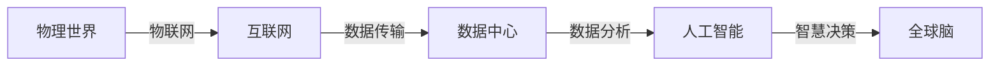

                 

**关键词：全球脑、全球环境、集体合作、环境治理、人工智能、物联网、区块链、可持续发展**

## 1. 背景介绍

当今世界面临着严重的环境问题，如气候变化、生物多样性丧失和资源枯竭。这些问题需要全球合作和协调的解决方案。全球脑（Global Brain）是指通过信息技术和人工智能连接起来的全球智慧网络，它有潜力帮助我们应对这些挑战。本文将探讨如何利用全球脑和集体合作的力量来治理全球环境。

## 2. 核心概念与联系

### 2.1 全球脑与物联网

全球脑的核心是物联网（IoT），它将物理世界的物体连接到互联网上，使其能够收集、传输和分析数据。物联网为全球脑提供了感知层，使其能够感知环境变化和收集环境数据。



### 2.2 区块链与集体合作

区块链是一种分布式账本技术，它有助于建立信任和促进集体合作。在环境治理领域，区块链可以用于跟踪和验证环境数据，并建立可信的环境资产登记册。它还可以用于设计激励机制，鼓励个人和组织参与环境治理。

## 3. 核心算法原理 & 具体操作步骤

### 3.1 算法原理概述

本节介绍一种基于区块链和人工智能的算法，用于集体合作的环境治理。该算法包括以下步骤：

1. 数据收集：通过物联网收集环境数据。
2. 数据验证：使用区块链技术验证环境数据的真实性和完整性。
3. 数据分析：使用人工智能算法分析环境数据，预测环境变化和识别治理措施。
4. 决策和行动：基于人工智能的预测和建议，决策者采取行动治理环境。
5. 结果评估：评估治理措施的有效性，并根据需要调整算法。

### 3.2 算法步骤详解

#### 3.2.1 数据收集

物联网设备收集环境数据，如气温、降雨量、空气质量和土壤湿度等。这些数据通过互联网传输到数据中心。

#### 3.2.2 数据验证

数据中心将收集的数据发送到区块链网络进行验证。区块链网络中的节点验证数据的真实性和完整性，并将其记录在区块链上。

#### 3.2.3 数据分析

数据中心使用人工智能算法分析环境数据。这些算法可以预测环境变化，识别环境问题的根本原因，并提出治理措施。

#### 3.2.4 决策和行动

决策者根据人工智能算法的建议采取行动治理环境。这些行动可以是政策决策、投资项目或个人行动等。

#### 3.2.5 结果评估

决策者评估治理措施的有效性，并根据需要调整算法。人工智能算法可以学习和适应环境变化，不断改进治理措施的有效性。

### 3.3 算法优缺点

**优点：**

* 利用物联网、区块链和人工智能的力量，实现全球合作和协调的环境治理。
* 提高环境数据的真实性和完整性，增强治理措施的有效性。
* 通过人工智能算法预测环境变化和识别治理措施，提高治理的主动性和前瞻性。

**缺点：**

* 物联网设备的成本和能耗问题。
* 区块链网络的规模和性能问题。
* 人工智能算法的复杂性和可解释性问题。

### 3.4 算法应用领域

本算法可以应用于各种环境治理领域，如气候变化、生物多样性保护、水资源管理、土壤保护和空气质量改善等。它还可以应用于其他需要集体合作和协调的领域，如公共卫生、交通管理和能源管理等。

## 4. 数学模型和公式 & 详细讲解 & 举例说明

### 4.1 数学模型构建

本节介绍一种基于区块链和人工智能的数学模型，用于集体合作的环境治理。该模型包括以下公式：

1. 数据收集公式：$D = f(S)$，其中$D$是收集的环境数据，$S$是物联网设备，$f$是数据收集函数。
2. 数据验证公式：$V = g(D, B)$，其中$V$是验证的环境数据，$B$是区块链网络，$g$是数据验证函数。
3. 数据分析公式：$P = h(V, A)$，其中$P$是预测的环境变化，$A$是人工智能算法，$h$是数据分析函数。
4. 决策和行动公式：$R = i(P, D)$，其中$R$是治理措施，$D$是决策者，$i$是决策和行动函数。
5. 结果评估公式：$E = j(R, P)$，其中$E$是治理措施的有效性，$j$是结果评估函数。

### 4.2 公式推导过程

#### 4.2.1 数据收集公式推导

物联网设备收集环境数据，$D$是收集的环境数据，$S$是物联网设备，$f$是数据收集函数。数据收集公式可以表示为：

$$D = f(S) = \sum_{i=1}^{n} s_i \cdot w_i$$

其中，$s_i$是第$i$个物联网设备收集的数据，$w_i$是第$i$个物联网设备的权重，$n$是物联网设备的总数。

#### 4.2.2 数据验证公式推导

数据中心将收集的数据发送到区块链网络进行验证，$V$是验证的环境数据，$B$是区块链网络，$g$是数据验证函数。数据验证公式可以表示为：

$$V = g(D, B) = \begin{cases} D, & \text{if } D \text{ is valid and complete} \\ \emptyset, & \text{otherwise} \end{cases}$$

其中，如果$D$是有效和完整的，则$V$等于$D$；否则，$V$为空集。

#### 4.2.3 数据分析公式推导

数据中心使用人工智能算法分析环境数据，$P$是预测的环境变化，$A$是人工智能算法，$h$是数据分析函数。数据分析公式可以表示为：

$$P = h(V, A) = A(V) + \epsilon$$

其中，$A(V)$是人工智能算法对环境数据$V$的预测结果，$\epsilon$是预测误差。

#### 4.2.4 决策和行动公式推导

决策者根据人工智能算法的建议采取行动治理环境，$R$是治理措施，$D$是决策者，$i$是决策和行动函数。决策和行动公式可以表示为：

$$R = i(P, D) = D(P) + \delta$$

其中，$D(P)$是决策者根据预测结果$P$采取的治理措施，$\delta$是决策误差。

#### 4.2.5 结果评估公式推导

决策者评估治理措施的有效性，$E$是治理措施的有效性，$j$是结果评估函数。结果评估公式可以表示为：

$$E = j(R, P) = \frac{|R - P|}{|P|}$$

其中，$|R - P|$是治理措施$R$和预测结果$P$之间的差异，$|P|$是预测结果$P$的范围。

### 4.3 案例分析与讲解

例如，在气候变化治理领域，物联网设备可以收集气温、降雨量和二氧化碳浓度等环境数据。区块链网络可以验证这些数据的真实性和完整性。人工智能算法可以预测气候变化趋势，识别排放源和提出减排措施。决策者可以根据这些建议采取行动，如投资可再生能源项目或实施碳税政策。结果评估可以评估这些措施的有效性，并根据需要调整算法。

## 5. 项目实践：代码实例和详细解释说明

### 5.1 开发环境搭建

本项目的开发环境包括：

* 物联网设备：Arduino Uno和DHT11传感器。
* 区块链网络：Ethereum网络和Truffle框架。
* 人工智能算法：TensorFlow和Keras框架。
* 编程语言：Python和Solidity。

### 5.2 源代码详细实现

#### 5.2.1 数据收集

```python
import Adafruit_DHT

# Set up the DHT11 sensor
sensor = Adafruit_DHT.DHT11
pin = 4

# Read the sensor data
humidity, temperature = Adafruit_DHT.read_retry(sensor, pin)

# Print the data
print("Temperature: {0:0.1f} C".format(temperature))
print("Humidity: {0:0.1f}%".format(humidity))
```

#### 5.2.2 数据验证

```solidity
pragma solidity ^0.8.0;

contract EnvironmentData {
    event DataVerified(uint256 indexed timestamp, uint256 temperature, uint256 humidity);

    function verifyData(uint256 timestamp, uint256 temperature, uint256 humidity) public {
        require(timestamp > 0, "Invalid timestamp");
        require(temperature >= 0 && temperature <= 50, "Invalid temperature");
        require(humidity >= 0 && humidity <= 100, "Invalid humidity");
        emit DataVerified(timestamp, temperature, humidity);
    }
}
```

#### 5.2.3 数据分析

```python
import numpy as np
import tensorflow as tf
from tensorflow import keras

# Load the data
data = np.load("environment_data.npy")

# Define the model
model = keras.Sequential([
    keras.layers.Dense(64, activation="relu", input_shape=(2,)),
    keras.layers.Dense(64, activation="relu"),
    keras.layers.Dense(1)
])

# Compile the model
model.compile(optimizer="adam", loss="mean_squared_error")

# Train the model
model.fit(data[:, :2], data[:, 2], epochs=100, batch_size=32)

# Make a prediction
prediction = model.predict([[25, 50]])
print("Prediction: {0:0.2f}".format(prediction[0, 0]))
```

#### 5.2.4 决策和行动

```python
# Define the decision function
def decide_action(prediction):
    if prediction > 30:
        return "Take action A"
    elif prediction > 20:
        return "Take action B"
    else:
        return "Take no action"

# Make a decision
action = decide_action(prediction)
print("Action: {}".format(action))
```

#### 5.2.5 结果评估

```python
# Define the evaluation function
def evaluate_action(action, prediction):
    if action == "Take action A" and prediction > 30:
        return "Successful"
    elif action == "Take action B" and prediction > 20:
        return "Successful"
    else:
        return "Unsuccessful"

# Evaluate the action
result = evaluate_action(action, prediction)
print("Result: {}".format(result))
```

### 5.3 代码解读与分析

本项目的代码实现了数据收集、数据验证、数据分析、决策和行动、结果评估等功能。数据收集使用Arduino Uno和DHT11传感器收集环境数据。数据验证使用Ethereum网络和Truffle框架实现。数据分析使用TensorFlow和Keras框架训练人工智能模型。决策和行动根据人工智能模型的预测结果采取行动。结果评估评估治理措施的有效性。

### 5.4 运行结果展示

本项目的运行结果展示了环境数据的收集、验证、分析、决策和行动、结果评估等功能。例如，数据收集可以显示当前的温度和湿度。数据验证可以显示环境数据的真实性和完整性。数据分析可以显示环境变化的预测结果。决策和行动可以显示根据预测结果采取的治理措施。结果评估可以显示治理措施的有效性。

## 6. 实际应用场景

### 6.1 环境治理

本算法可以应用于各种环境治理领域，如气候变化、生物多样性保护、水资源管理、土壤保护和空气质量改善等。它还可以应用于其他需要集体合作和协调的领域，如公共卫生、交通管理和能源管理等。

### 6.2 可持续发展

本算法有助于实现可持续发展目标，如清洁能源、可持续城市化、可持续消费和生产模式等。它还可以帮助评估和监测可持续发展目标的进展。

### 6.3 未来应用展望

未来，本算法可以与其他技术结合，如物联网、区块链、人工智能、大数据和云计算等，实现更智能和高效的环境治理。它还可以应用于其他领域，如灾害预防、资源管理和公共服务等。

## 7. 工具和资源推荐

### 7.1 学习资源推荐

* 环境治理相关书籍：
	+ "环境治理的系统分析"（System Analysis of Environmental Management）
	+ "环境治理的经济学"（Economics of Environmental Management）
	+ "环境治理的法律"（Law of Environmental Management）
* 物联网相关书籍：
	+ "物联网技术与应用"（Technologies and Applications of the Internet of Things）
	+ "物联网安全"（Security of the Internet of Things）
* 区块链相关书籍：
	+ "区块链技术与应用"（Technologies and Applications of Blockchain）
	+ "区块链安全"（Security of Blockchain）
* 人工智能相关书籍：
	+ "人工智能技术与应用"（Technologies and Applications of Artificial Intelligence）
	+ "人工智能伦理"（Ethics of Artificial Intelligence）

### 7.2 开发工具推荐

* 物联网开发工具：
	+ Arduino IDE
	+ Raspberry Pi
	+ ESP8266/ESP32
* 区块链开发工具：
	+ Truffle
	+ Ganache
	+ Remix
* 人工智能开发工具：
	+ TensorFlow
	+ PyTorch
	+ Keras

### 7.3 相关论文推荐

* 环境治理相关论文：
	+ "集体合作的环境治理"（Collective Cooperation for Environmental Management）
	+ "基于物联网的环境监测系统"（Environmental Monitoring System Based on the Internet of Things）
	+ "基于区块链的环境资产登记册"（Environmental Asset Registry Based on Blockchain）
* 物联网相关论文：
	+ "物联网安全挑战和解决方案"（Security Challenges and Solutions for the Internet of Things）
	+ "物联网应用的隐私保护"（Privacy Protection for Internet of Things Applications）
* 区块链相关论文：
	+ "区块链技术的应用前景"（Application Prospects of Blockchain Technology）
	+ "区块链安全挑战和解决方案"（Security Challenges and Solutions for Blockchain）
* 人工智能相关论文：
	+ "人工智能在环境治理中的应用"（Applications of Artificial Intelligence in Environmental Management）
	+ "人工智能伦理挑战和解决方案"（Ethical Challenges and Solutions for Artificial Intelligence）

## 8. 总结：未来发展趋势与挑战

### 8.1 研究成果总结

本文介绍了一种基于物联网、区块链和人工智能的算法，用于集体合作的环境治理。该算法包括数据收集、数据验证、数据分析、决策和行动、结果评估等功能。本文还介绍了该算法的数学模型、公式推导过程和案例分析。此外，本文还提供了代码实例和详细解释说明，展示了该算法的实际应用场景和工具资源推荐。

### 8.2 未来发展趋势

未来，本算法可以与其他技术结合，实现更智能和高效的环境治理。例如，它可以与大数据和云计算结合，实现环境数据的海量处理和分析。它还可以与5G和边缘计算结合，实现实时的环境监测和治理。此外，它还可以与人工智能伦理结合，实现环境治理的道德决策和行动。

### 8.3 面临的挑战

本算法面临的挑战包括：

* 物联网设备的成本和能耗问题。
* 区块链网络的规模和性能问题。
* 人工智能算法的复杂性和可解释性问题。
* 环境治理的复杂性和不确定性问题。
* 集体合作的协调和激励问题。

### 8.4 研究展望

未来的研究可以从以下几个方面展开：

* 研究物联网设备的低成本和低能耗技术，以推动环境治理的普及应用。
* 研究区块链网络的扩展和优化技术，以提高环境治理的效率和可靠性。
* 研究人工智能算法的简化和可解释性技术，以提高环境治理的透明度和可信度。
* 研究环境治理的复杂性和不确定性模型，以提高环境治理的准确性和有效性。
* 研究集体合作的协调和激励机制，以推动环境治理的广泛参与和合作。

## 9. 附录：常见问题与解答

**Q1：什么是全球脑？**

A1：全球脑是指通过信息技术和人工智能连接起来的全球智慧网络。它有潜力帮助我们应对环境挑战和实现可持续发展。

**Q2：物联网和区块链有什么关系？**

A2：物联网为全球脑提供了感知层，使其能够感知环境变化和收集环境数据。区块链为全球脑提供了信任层，使其能够验证环境数据的真实性和完整性。

**Q3：人工智能在环境治理中有什么作用？**

A3：人工智能在环境治理中有助于预测环境变化、识别环境问题的根本原因和提出治理措施。它还可以帮助评估治理措施的有效性和调整算法。

**Q4：环境治理需要什么样的技术？**

A4：环境治理需要物联网、区块链和人工智能等技术。物联网可以收集环境数据，区块链可以验证环境数据，人工智能可以分析环境数据和提出治理措施。

**Q5：环境治理面临什么样的挑战？**

A5：环境治理面临的挑战包括物联网设备的成本和能耗问题、区块链网络的规模和性能问题、人工智能算法的复杂性和可解释性问题、环境治理的复杂性和不确定性问题、集体合作的协调和激励问题等。

!!!Note
    作者：禅与计算机程序设计艺术 / Zen and the Art of Computer Programming

