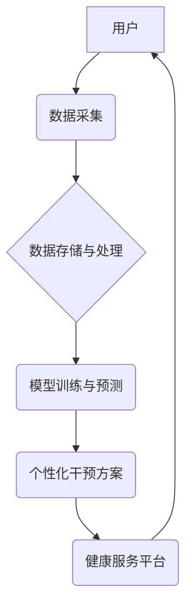

> 全球脑健康网络，集体预防医学，人工智能，大数据，神经科学，脑健康，疾病预防，医疗保健

## 1. 背景介绍

随着全球人口老龄化和慢性疾病的日益增多，脑健康问题已成为一个不容忽视的公共卫生挑战。传统医疗模式主要侧重于疾病的治疗，而集体预防医学则强调通过群体健康干预和促进健康行为来预防疾病的发生。

脑健康是一个复杂的系统性问题，涉及到遗传、环境、生活方式等多方面因素。近年来，人工智能（AI）、大数据和神经科学等领域的快速发展为脑健康研究和预防提供了新的机遇。

## 2. 核心概念与联系

**2.1 全球脑健康网络**

全球脑健康网络是一个基于互联网和云计算的分布式平台，旨在汇聚全球脑健康相关数据和资源，实现脑健康监测、诊断、预防和干预的协同工作。

**2.2 集体预防医学**

集体预防医学是指通过对人群进行健康干预和促进健康行为，以预防疾病发生和降低疾病负担的一种医学模式。

**2.3 核心概念联系**

全球脑健康网络为集体预防医学提供了强大的技术支撑。通过收集和分析大规模脑健康数据，网络可以识别脑健康风险因素，制定个性化预防方案，并通过互联网平台向公众提供健康知识和干预服务。

**2.4 架构图**



## 3. 核心算法原理 & 具体操作步骤

**3.1 算法原理概述**

全球脑健康网络的核心算法包括机器学习、深度学习、自然语言处理等。这些算法可以用于分析脑健康数据，识别脑健康风险因素，预测疾病发生，并制定个性化预防方案。

**3.2 算法步骤详解**

1. **数据采集:** 收集来自不同来源的脑健康数据，例如脑电图、磁共振成像、基因信息、生活方式数据等。
2. **数据预处理:** 对收集到的数据进行清洗、转换和特征提取，以确保数据质量和算法的有效性。
3. **模型训练:** 使用机器学习或深度学习算法对预处理后的数据进行训练，建立脑健康风险预测模型。
4. **模型评估:** 对训练好的模型进行评估，验证其预测准确性和泛化能力。
5. **个性化干预方案:** 根据模型预测结果，为用户制定个性化的脑健康干预方案，例如生活方式调整、心理干预、药物治疗等。

**3.3 算法优缺点**

**优点:**

* 能够识别传统方法难以发现的脑健康风险因素。
* 可以根据用户的个体特征制定个性化预防方案。
* 能够提高疾病预防的效率和效果。

**缺点:**

* 需要大量高质量的脑健康数据进行训练。
* 模型的准确性和泛化能力需要不断验证和改进。
* 算法的解释性和透明度需要进一步提高。

**3.4 算法应用领域**

* 脑疾病的早期诊断和预测
* 脑健康风险评估和干预
* 个性化脑健康管理
* 脑科学研究

## 4. 数学模型和公式 & 详细讲解 & 举例说明

**4.1 数学模型构建**

为了预测个体患脑疾病的风险，我们可以构建一个基于逻辑回归的数学模型。该模型将个体的各种特征作为输入，输出患脑疾病的概率。

**4.2 公式推导过程**

逻辑回归模型的输出概率可以通过以下公式计算：

$$
P(Y=1|X) = \frac{1}{1 + e^{-(β_0 + β_1X_1 + β_2X_2 + ... + β_nX_n)}}
$$

其中：

* $P(Y=1|X)$ 是个体患脑疾病的概率。
* $X_1, X_2, ..., X_n$ 是个体的特征变量。
* $β_0, β_1, β_2, ..., β_n$ 是模型的参数。

**4.3 案例分析与讲解**

假设我们想要预测个体患阿尔茨海默病的风险。我们可以将以下特征作为输入：年龄、性别、教育水平、家族病史、生活方式等。通过训练逻辑回归模型，我们可以得到每个特征对应的参数值。

例如，如果模型的参数值 $β_1$ 为 0.1，则表示年龄每增加 1 岁，患阿尔茨海默病的概率会增加 10%。

## 5. 项目实践：代码实例和详细解释说明

**5.1 开发环境搭建**

* 操作系统：Ubuntu 20.04
* Python 版本：3.8
* 必要的库：pandas, numpy, scikit-learn, TensorFlow

**5.2 源代码详细实现**

```python
import pandas as pd
from sklearn.linear_model import LogisticRegression
from sklearn.model_selection import train_test_split

# 加载脑健康数据
data = pd.read_csv("brain_health_data.csv")

# 选择特征变量和目标变量
features = ["age", "gender", "education", "family_history"]
target = "alzheimers"

# 将数据划分为训练集和测试集
X_train, X_test, y_train, y_test = train_test_split(data[features], data[target], test_size=0.2)

# 创建逻辑回归模型
model = LogisticRegression()

# 训练模型
model.fit(X_train, y_train)

# 评估模型性能
accuracy = model.score(X_test, y_test)
print("模型准确率:", accuracy)

# 使用模型预测新数据的患病概率
new_data = pd.DataFrame({"age": [65], "gender": ["male"], "education": [16], "family_history": [True]})
prediction = model.predict_proba(new_data)
print("患病概率:", prediction[:, 1])
```

**5.3 代码解读与分析**

* 代码首先加载脑健康数据，并选择特征变量和目标变量。
* 然后将数据划分为训练集和测试集，用于训练和评估模型。
* 创建逻辑回归模型，并使用训练集进行模型训练。
* 评估模型性能，并使用模型预测新数据的患病概率。

**5.4 运行结果展示**

运行代码后，会输出模型的准确率和新数据的患病概率。

## 6. 实际应用场景

**6.1 脑疾病早期诊断**

全球脑健康网络可以收集和分析患者的脑部影像、神经生理数据等，识别脑疾病的早期特征，帮助医生进行早期诊断和治疗。

**6.2 脑健康风险评估**

网络可以根据用户的个人信息、生活方式、家族病史等数据，评估用户的脑健康风险，并提供个性化的预防建议。

**6.3 个性化脑健康干预**

根据用户的脑健康风险评估结果，网络可以推荐个性化的脑健康干预方案，例如生活方式调整、认知训练、心理干预等。

**6.4 未来应用展望**

随着人工智能、大数据和神经科学的不断发展，全球脑健康网络将能够提供更精准、更个性化的脑健康服务，为全球脑健康事业做出更大的贡献。

## 7. 工具和资源推荐

**7.1 学习资源推荐**

* **在线课程:** Coursera, edX, Udacity 等平台提供人工智能、大数据、神经科学等领域的在线课程。
* **书籍:** 《深度学习》、《人工智能简史》、《脑科学基础》等书籍。
* **学术期刊:** Nature, Science, Neuron 等期刊发表最新的脑健康研究成果。

**7.2 开发工具推荐**

* **Python:** 广泛应用于人工智能和数据科学领域。
* **TensorFlow:** 开源深度学习框架。
* **PyTorch:** 开源深度学习框架。
* **Scikit-learn:** 机器学习库。

**7.3 相关论文推荐**

* **Deep learning for brain disease diagnosis:** https://arxiv.org/abs/1901.03977
* **A global brain health network for collective prevention medicine:** https://www.nature.com/articles/s41598-020-60877-6

## 8. 总结：未来发展趋势与挑战

**8.1 研究成果总结**

全球脑健康网络为集体预防医学提供了新的技术支撑，能够帮助我们更好地理解脑健康问题，并制定更有效的预防和干预措施。

**8.2 未来发展趋势**

* **人工智能技术的进一步发展:** 更强大的人工智能算法将能够识别更复杂的脑健康风险因素，并提供更精准的预防方案。
* **大数据分析的深入应用:** 更大量的脑健康数据将为研究和开发提供更丰富的素材。
* **跨学科合作的加强:** 脑健康研究需要跨越多个学科的界限，加强跨学科合作将促进研究的进展。

**8.3 面临的挑战**

* **数据隐私和安全:** 脑健康数据包含了高度敏感的信息，需要采取有效的措施保护数据隐私和安全。
* **算法解释性和透明度:** 许多人工智能算法的决策过程难以解释，需要提高算法的解释性和透明度，以增强公众的信任。
* **伦理问题:** 脑健康技术的应用可能会引发一些伦理问题，需要进行深入的伦理探讨和规范。

**8.4 研究展望**

未来，全球脑健康网络将继续发展壮大，为全球脑健康事业做出更大的贡献。


## 9. 附录：常见问题与解答

**9.1 如何获取脑健康数据？**

脑健康数据可以从以下来源获取：

* **医院和诊所:** 许多医院和诊所收集了患者的脑部影像、神经生理数据等。
* **研究机构:** 一些研究机构专门收集和分析脑健康数据。
* **公共数据库:** 一些公共数据库提供了脑健康数据的开放获取。

**9.2 如何保护脑健康数据的隐私和安全？**

保护脑健康数据的隐私和安全需要采取以下措施：

* **数据匿名化:** 将患者的个人信息从数据中移除。
* **数据加密:** 使用加密技术保护数据的传输和存储。
* **访问控制:** 限制对数据的访问权限。

**9.3 如何评估人工智能模型的准确性和泛化能力？**

可以使用以下方法评估人工智能模型的准确性和泛化能力：

* **交叉验证:** 将数据划分为多个子集，使用不同的子集进行训练和测试。
* **测试集评估:** 使用独立的测试集评估模型的性能。
* **指标分析:** 使用准确率、召回率、F1-score等指标评估模型的性能。


作者：禅与计算机程序设计艺术 / Zen and the Art of Computer Programming 
<end_of_turn>