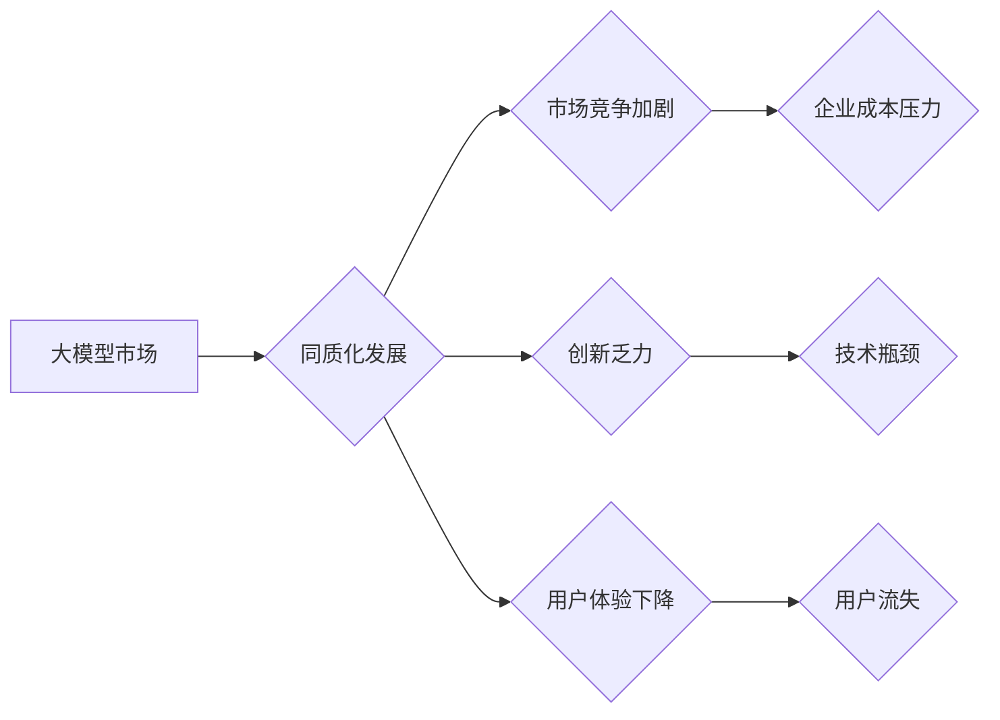

> 大模型，同质化，竞争，创新，应用场景，贾扬清，中国AI

## 1. 背景介绍

近年来，人工智能（AI）技术蓬勃发展，大模型作为AI领域的重要组成部分，迅速成为全球科技界的焦点。大模型是指参数规模庞大、训练数据海量的人工智能模型，能够在自然语言处理、计算机视觉、语音识别等多个领域展现出强大的能力。

国内大模型市场近年来发展迅速，涌现出众多优秀的大模型，例如百度文心一言、阿里达摩院的文心模型、华为的盘古模型等。这些大模型在各自领域取得了显著的成果，也为国内AI产业的发展注入了强劲动力。

然而，随着大模型市场竞争的加剧，同质化发展的问题日益突出。许多大模型在架构、训练数据、应用场景等方面存在着相似性，导致市场竞争日趋激烈，创新乏力。

## 2. 核心概念与联系

**2.1 大模型的定义与特点**

大模型是指参数规模庞大、训练数据海量的人工智能模型。其特点包括：

* **参数规模巨大:** 大模型通常拥有数十亿甚至数千亿个参数，这使得它们能够学习到更复杂的模式和关系。
* **训练数据海量:** 大模型的训练需要大量的文本、图像、音频等数据，这些数据通常来自互联网、书籍、数据库等各种来源。
* **泛化能力强:** 由于参数规模庞大、训练数据海量，大模型通常具有较强的泛化能力，能够在未见过的任务和数据上表现良好。

**2.2 同质化发展的定义与危害**

同质化发展是指市场上产品或服务缺乏差异化，呈现出相似性，导致市场竞争激烈，创新乏力。

同质化发展对大模型市场的影响包括：

* **市场竞争加剧:** 同质化发展导致市场竞争更加激烈，企业需要不断降低成本、提高效率才能在市场中立足。
* **创新乏力:** 同质化发展不利于创新，因为企业缺乏动力去探索新的技术和应用场景。
* **用户体验下降:** 同质化发展导致产品或服务缺乏差异化，用户体验下降。

**2.3 贾扬清的观点**

贾扬清，中国人工智能领域的知名专家，曾多次指出国内大模型市场存在同质化发展的风险。他认为，国内大模型发展过于依赖于参数规模和训练数据量，缺乏对应用场景和用户需求的关注。

贾扬清建议，国内大模型发展应更加注重以下几个方面：

* **应用场景导向:** 大模型的开发和应用应以实际应用场景为导向，解决用户痛点，提升用户体验。
* **模型细分:** 应根据不同的应用场景，开发不同类型的细分模型，避免过度追求通用性。
* **开源与共建:** 鼓励开源和共建，促进大模型技术的普及和发展。

**2.4 Mermaid 流程图**



## 3. 核心算法原理 & 具体操作步骤

**3.1 算法原理概述**

大模型的训练主要基于深度学习算法，其中Transformer模型是目前最主流的架构。Transformer模型的核心思想是利用注意力机制来捕捉文本序列中的长距离依赖关系，从而实现更准确的文本理解和生成。

**3.2 算法步骤详解**

大模型的训练过程可以概括为以下步骤：

1. **数据预处理:** 将原始数据进行清洗、格式化、编码等处理，使其能够被模型理解。
2. **模型构建:** 根据具体的应用场景，选择合适的模型架构，并设置模型参数。
3. **模型训练:** 使用训练数据对模型进行训练，通过调整模型参数，使模型能够准确地预测目标输出。
4. **模型评估:** 使用测试数据对模型进行评估，衡量模型的性能。
5. **模型部署:** 将训练好的模型部署到实际应用场景中，用于进行预测或生成。

**3.3 算法优缺点**

**优点:**

* 泛化能力强: 大模型能够在未见过的任务和数据上表现良好。
* 表现能力强: 大模型在自然语言处理、计算机视觉、语音识别等多个领域取得了显著的成果。

**缺点:**

* 计算资源消耗大: 大模型的训练需要大量的计算资源，成本较高。
* 训练时间长: 大模型的训练时间通常很长，需要数天甚至数周。
* 数据依赖性强: 大模型的性能与训练数据的质量密切相关，数据质量差会导致模型性能下降。

**3.4 算法应用领域**

大模型在多个领域都有广泛的应用，例如：

* **自然语言处理:** 文本生成、机器翻译、问答系统、情感分析等。
* **计算机视觉:** 图像识别、物体检测、图像分割等。
* **语音识别:** 语音转文本、语音合成等。
* **推荐系统:** 商品推荐、内容推荐等。

## 4. 数学模型和公式 & 详细讲解 & 举例说明

**4.1 数学模型构建**

Transformer模型的核心是注意力机制，其数学模型可以表示为：

$$
Attention(Q, K, V) = softmax(\frac{QK^T}{\sqrt{d_k}})V
$$

其中：

* $Q$：查询矩阵
* $K$：键矩阵
* $V$：值矩阵
* $d_k$：键向量的维度
* $softmax$：softmax函数

**4.2 公式推导过程**

注意力机制的目的是计算查询向量与键向量的相关性，并根据相关性对值向量进行加权求和。

公式推导过程如下：

1. 计算查询向量 $Q$ 与键向量 $K$ 的点积，并除以 $\sqrt{d_k}$。
2. 对点积结果应用softmax函数，得到每个键向量的权重。
3. 将权重与值向量 $V$ 进行加权求和，得到最终的注意力输出。

**4.3 案例分析与讲解**

例如，在机器翻译任务中，查询向量可以表示为源语言的词向量，键向量可以表示为目标语言的词向量，值向量可以表示为目标语言的词嵌入。

注意力机制可以帮助模型捕捉源语言和目标语言之间的语义关系，从而实现更准确的翻译。

## 5. 项目实践：代码实例和详细解释说明

**5.1 开发环境搭建**

* 操作系统：Ubuntu 20.04
* Python 版本：3.8
* CUDA 版本：11.0
* cuDNN 版本：8.0

**5.2 源代码详细实现**

```python
import torch
import torch.nn as nn

class Attention(nn.Module):
    def __init__(self, d_model, num_heads):
        super(Attention, self).__init__()
        self.d_model = d_model
        self.num_heads = num_heads
        self.head_dim = d_model // num_heads

        self.query = nn.Linear(d_model, d_model)
        self.key = nn.Linear(d_model, d_model)
        self.value = nn.Linear(d_model, d_model)
        self.fc_out = nn.Linear(d_model, d_model)

    def forward(self, query, key, value, mask=None):
        batch_size = query.size(0)

        # Linear projections
        Q = self.query(query).view(batch_size, -1, self.num_heads, self.head_dim).transpose(1, 2)
        K = self.key(key).view(batch_size, -1, self.num_heads, self.head_dim).transpose(1, 2)
        V = self.value(value).view(batch_size, -1, self.num_heads, self.head_dim).transpose(1, 2)

        # Scaled dot-product attention
        scores = torch.matmul(Q, K.transpose(-2, -1)) / torch.sqrt(torch.tensor(self.head_dim, dtype=torch.float))
        if mask is not None:
            scores = scores.masked_fill(mask == 0, -1e9)
        attention_weights = torch.softmax(scores, dim=-1)

        # Weighted sum of values
        context = torch.matmul(attention_weights, V)

        # Concatenate heads and project
        context = context.transpose(1, 2).contiguous().view(batch_size, -1, self.d_model)
        output = self.fc_out(context)

        return output, attention_weights
```

**5.3 代码解读与分析**

这段代码实现了Transformer模型中的注意力机制。

* `Attention`类定义了注意力机制的结构，包括查询、键、值线性变换层以及最终的输出层。
* `forward`方法实现了注意力机制的计算过程，包括线性变换、点积计算、softmax归一化以及加权求和。
* `mask`参数用于屏蔽无效的注意力计算，例如在机器翻译任务中，需要屏蔽源语言中已经翻译过的词。

**5.4 运行结果展示**

运行该代码可以得到注意力机制的输出结果以及注意力权重。

注意力权重可以直观地展示模型对不同词语的关注程度，有助于理解模型的决策过程。

## 6. 实际应用场景

**6.1 文本生成**

大模型在文本生成领域有着广泛的应用，例如：

* **机器翻译:** 将一种语言翻译成另一种语言。
* **文本摘要:** 将长篇文本压缩成短篇摘要。
* **对话系统:** 与用户进行自然语言对话。

**6.2 计算机视觉**

大模型在计算机视觉领域也取得了显著的成果，例如：

* **图像识别:** 将图像分类为不同的类别。
* **物体检测:** 在图像中检测出特定物体的位置和大小。
* **图像分割:** 将图像分割成不同的区域。

**6.3 语音识别**

大模型在语音识别领域也发挥着重要作用，例如：

* **语音转文本:** 将语音转换为文本。
* **语音合成:** 将文本转换为语音。

**6.4 未来应用展望**

随着大模型技术的不断发展，其应用场景将更加广泛，例如：

* **个性化推荐:** 根据用户的兴趣和偏好，推荐个性化的商品、内容等。
* **自动驾驶:** 帮助自动驾驶汽车理解周围环境，做出决策。
* **医疗诊断:** 辅助医生进行疾病诊断。

## 7. 工具和资源推荐

**7.1 学习资源推荐**

* **书籍:**
    * 《深度学习》
    * 《自然语言处理》
* **在线课程:**
    * Coursera: 深度学习
    * edX: 自然语言处理
* **博客:**
    * Jay Alammar's Blog: https://jalammar.github.io/
    * The Gradient: https://thegradient.pub/

**7.2 开发工具推荐**

* **框架:**
    * TensorFlow
    * PyTorch
* **库:**
    * Hugging Face Transformers
    * OpenAI API

**7.3 相关论文推荐**

* **Attention Is All You Need:** https://arxiv.org/abs/1706.03762
* **BERT: Pre-training of Deep Bidirectional Transformers for Language Understanding:** https://arxiv.org/abs/1810.04805

## 8. 总结：未来发展趋势与挑战

**8.1 研究成果总结**

近年来，大模型技术取得了显著的进展，在多个领域展现出强大的能力。