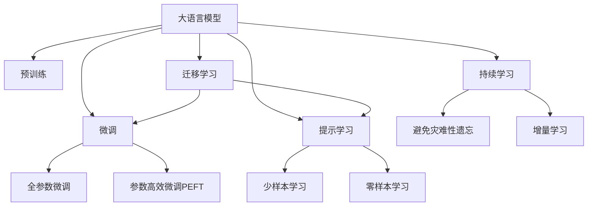

                 

# 无限的潜力：LLM 的无限指令集

> 关键词：

## 1. 背景介绍

### 1.1 问题由来
大语言模型（Large Language Models, LLMs），如GPT、BERT、T5等，自诞生以来，凭借其强大的语言理解和生成能力，在自然语言处理（NLP）领域取得了令人瞩目的成果。这些模型通过大规模无标签数据的预训练，学习到通用的语言表示，并在下游任务中通过微调（Fine-Tuning）进一步优化，从而大幅提升模型在特定任务上的性能。

然而，LLMs 的潜力远不止于此。随着研究的深入和技术的演进，LLMs 正在逐步突破传统语言模型的束缚，探索更加灵活、更具表现力的指令形式。这些指令不仅能够引导模型进行推理和生成，还能赋予模型更加广阔的应用空间和更强的适应能力。本文将深入探讨大语言模型指令集的无限可能性，以及如何构建和使用这些指令集，以解锁其无限潜力。

### 1.2 问题核心关键点
1. **大语言模型**：通过自回归或自编码模型在大规模语料上进行预训练的语言模型，具备强大的语言理解和生成能力。
2. **指令集**：指一组具体的指令或提示，用于引导模型完成特定任务或生成特定输出。
3. **无限指令集**：指一个不断扩充和完善的指令集合，能够覆盖各种不同的应用场景和需求，具有无限的扩展性和灵活性。
4. **微调**：在预训练模型的基础上，通过有监督的训练优化模型在特定任务上的性能。
5. **迁移学习**：将一个领域学到的知识迁移到另一个相关领域，提升模型在不同任务上的表现。

## 2. 核心概念与联系

### 2.1 核心概念概述

为了更好地理解大语言模型指令集，我们先对一些核心概念进行概述：

- **大语言模型**：以自回归（如GPT）或自编码（如BERT）模型为代表的大规模预训练语言模型。通过在大规模无标签文本语料上进行预训练，学习到通用的语言表示，具备强大的语言理解和生成能力。

- **指令集**：一组具体的指令或提示，用于引导模型完成特定任务或生成特定输出。指令集可以通过微调或提示学习的方式进行构建和扩展。

- **微调**：在预训练模型的基础上，使用下游任务的少量标注数据，通过有监督的训练优化模型在特定任务上的性能。通常只需要调整顶层分类器或解码器，并以较小的学习率更新全部或部分模型参数。

- **迁移学习**：将一个领域学到的知识迁移到另一个相关领域，提升模型在不同任务上的表现。大模型的预训练-微调过程即是一种典型的迁移学习方式。

- **提示学习**：通过在输入文本中添加提示模板，引导大语言模型进行特定任务的推理和生成。可以在不更新模型参数的情况下，实现零样本或少样本学习。

- **少样本学习**：指在只有少量标注样本的情况下，模型能够快速适应新任务的学习方法。在大语言模型中，通常通过在输入中提供少量示例来实现，无需更新模型参数。

- **零样本学习**：指模型在没有见过任何特定任务的训练样本的情况下，仅凭任务描述就能够执行新任务的能力。大语言模型通过预训练获得的广泛知识，使其能够理解任务指令并生成相应输出。

- **持续学习**：也称为终身学习，指模型能够持续从新数据中学习，同时保持已学习的知识，而不会出现灾难性遗忘。这对于保持大语言模型的时效性和适应性至关重要。

这些核心概念之间的逻辑关系可以通过以下Mermaid流程图来展示：



这个流程图展示了大语言模型的核心概念及其之间的关系：

1. 大语言模型通过预训练获得基础能力。
2. 微调是对预训练模型进行任务特定的优化，可以分为全参数微调和参数高效微调（PEFT）。
3. 提示学习是一种不更新模型参数的方法，可以实现少样本学习和零样本学习。
4. 迁移学习是连接预训练模型与下游任务的桥梁，可以通过微调或提示学习来实现。
5. 持续学习旨在使模型能够不断学习新知识，同时避免遗忘旧知识。

这些概念共同构成了大语言模型的学习和应用框架，使其能够在各种场景下发挥强大的语言理解和生成能力。通过理解这些核心概念，我们可以更好地把握大语言模型的工作原理和优化方向。

## 3. 核心算法原理 & 具体操作步骤
### 3.1 算法原理概述

大语言模型的指令集，本质上是通过有监督的微调或提示学习，将预训练模型转化为能够执行特定任务的工具。其核心思想是：将预训练的大语言模型视作一个强大的"特征提取器"，通过在特定任务的数据集上进行有监督的微调或提示学习，使得模型能够理解并执行具体的指令。

形式化地，假设预训练模型为 $M_{\theta}$，其中 $\theta$ 为预训练得到的模型参数。给定下游任务 $T$ 的指令集 $I=\{(i, y_i)\}_{i=1}^N$，其中 $i$ 表示指令，$y_i$ 表示指令对应的输出。微调的目标是找到新的模型参数 $\hat{\theta}$，使得模型能够准确地执行这些指令。

通过梯度下降等优化算法，微调过程不断更新模型参数 $\theta$，最小化模型在指令集上的损失函数，使得模型输出逼近正确答案 $y_i$。由于 $\theta$ 已经通过预训练获得了较好的初始化，因此即便在少量指令上进行调整，也能较快收敛到理想的模型参数 $\hat{\theta}$。

### 3.2 算法步骤详解

大语言模型指令集的构建和应用过程包括以下几个关键步骤：

**Step 1: 准备预训练模型和指令集**
- 选择合适的预训练语言模型 $M_{\theta}$ 作为初始化参数，如 GPT、BERT、T5 等。
- 设计或收集任务相关的指令集 $I$，每个指令 $i$ 需要明确标注对应的输出 $y_i$。

**Step 2: 设计指令格式**
- 根据任务类型，设计合适的指令模板 $I^{format}$。
- 对于生成任务，指令格式通常包含目标输出的具体描述。
- 对于分类任务，指令格式可能包含输入文本和目标类别描述。

**Step 3: 添加任务适配层**
- 根据任务类型，在预训练模型顶层设计合适的输出层和损失函数。
- 对于分类任务，通常在顶层添加线性分类器和交叉熵损失函数。
- 对于生成任务，通常使用语言模型的解码器输出概率分布，并以负对数似然为损失函数。

**Step 4: 设置微调超参数**
- 选择合适的优化算法及其参数，如 AdamW、SGD 等，设置学习率、批大小、迭代轮数等。
- 设置正则化技术及强度，包括权重衰减、Dropout、Early Stopping 等。
- 确定冻结预训练参数的策略，如仅微调顶层，或全部参数都参与微调。

**Step 5: 执行指令训练**
- 将指令数据分批次输入模型，前向传播计算损失函数。
- 反向传播计算参数梯度，根据设定的优化算法和学习率更新模型参数。
- 周期性在验证集上评估模型性能，根据性能指标决定是否触发 Early Stopping。
- 重复上述步骤直到满足预设的迭代轮数或 Early Stopping 条件。

**Step 6: 测试和部署**
- 在测试集上评估微调后模型 $M_{\hat{\theta}}$ 的性能，对比微调前后的性能提升。
- 使用微调后的模型对新指令进行推理预测，集成到实际的应用系统中。
- 持续收集新的指令，定期重新微调模型，以适应新的指令需求。

以上是使用有监督学习构建大语言模型指令集的一般流程。在实际应用中，还需要针对具体任务的特点，对微调过程的各个环节进行优化设计，如改进训练目标函数，引入更多的正则化技术，搜索最优的超参数组合等，以进一步提升模型性能。

### 3.3 算法优缺点

大语言模型指令集构建和应用方法具有以下优点：

1. **灵活性**：通过设计灵活多样的指令，模型可以执行各种类型的任务，从简单的信息提取到复杂的推理生成。
2. **可扩展性**：指令集可以动态扩展，不断加入新的指令，提升模型的适应能力。
3. **通用性**：基于大语言模型的指令集可以覆盖各种不同的应用场景，提升模型的应用范围。
4. **零样本和少样本学习**：提示学习等技术可以在不更新模型参数的情况下，实现零样本或少样本学习，减少微调成本。

同时，该方法也存在一定的局限性：

1. **依赖指令质量**：指令集的设计质量直接影响到模型的性能，过于复杂或模糊的指令可能导致模型生成不准确的输出。
2. **泛化能力有限**：在训练数据和指令数据分布差异较大的情况下，模型泛化性能可能受到限制。
3. **可解释性不足**：模型生成的指令和输出通常缺乏可解释性，难以理解其内部工作机制。
4. **安全性风险**：指令集设计不当可能导致模型生成有害、误导性的输出，带来潜在的安全风险。

尽管存在这些局限性，但就目前而言，基于指令集的微调方法已成为大语言模型应用的重要范式。未来相关研究的重点在于如何进一步提高指令集的鲁棒性和可解释性，避免安全风险，并结合其他AI技术，实现更加高效、智能的指令执行。

### 3.4 算法应用领域

基于大语言模型指令集的微调方法，已经在多个领域得到了广泛应用，涵盖各类NLP任务：

- **文本分类**：如情感分析、主题分类、意图识别等。通过微调使模型学习指令和标签映射关系。
- **命名实体识别**：识别文本中的人名、地名、机构名等特定实体。通过微调使模型理解指令和实体边界。
- **关系抽取**：从文本中抽取实体之间的语义关系。通过微调使模型理解指令和关系类型。
- **问答系统**：对自然语言问题给出答案。将问题-答案对作为指令，训练模型学习匹配答案。
- **机器翻译**：将源语言文本翻译成目标语言。通过微调使模型理解指令和语言映射关系。
- **文本摘要**：将长文本压缩成简短摘要。通过微调使模型理解指令和要点提取。
- **对话系统**：使机器能够与人自然对话。将多轮对话历史作为上下文，微调模型进行回复生成。

除了上述这些经典任务外，大语言模型指令集还被创新性地应用到更多场景中，如可控文本生成、常识推理、代码生成、数据增强等，为NLP技术带来了全新的突破。随着指令集的不断丰富和完善，相信NLP技术将在更广阔的应用领域大放异彩。

## 4. 数学模型和公式 & 详细讲解  
### 4.1 数学模型构建

本节将使用数学语言对大语言模型指令集构建过程进行更加严格的刻画。

记预训练语言模型为 $M_{\theta}$，其中 $\theta$ 为预训练得到的模型参数。假设指令集为 $I=\{(i, y_i)\}_{i=1}^N$，其中 $i$ 表示指令，$y_i$ 表示指令对应的输出。

定义模型 $M_{\theta}$ 在指令 $i$ 上的损失函数为 $\ell(M_{\theta}(i),y_i)$，则在指令集 $I$ 上的经验风险为：

$$
\mathcal{L}(\theta) = \frac{1}{N}\sum_{i=1}^N \ell(M_{\theta}(i),y_i)
$$

微调的目标是最小化经验风险，即找到最优参数：

$$
\theta^* = \mathop{\arg\min}_{\theta} \mathcal{L}(\theta)
$$

在实践中，我们通常使用基于梯度的优化算法（如SGD、Adam等）来近似求解上述最优化问题。设 $\eta$ 为学习率，$\lambda$ 为正则化系数，则参数的更新公式为：

$$
\theta \leftarrow \theta - \eta \nabla_{\theta}\mathcal{L}(\theta) - \eta\lambda\theta
$$

其中 $\nabla_{\theta}\mathcal{L}(\theta)$ 为损失函数对参数 $\theta$ 的梯度，可通过反向传播算法高效计算。

### 4.2 公式推导过程

以下我们以文本分类任务为例，推导交叉熵损失函数及其梯度的计算公式。

假设模型 $M_{\theta}$ 在输入 $x$ 上的输出为 $\hat{y}=M_{\theta}(x) \in [0,1]$，表示样本属于正类的概率。真实标签 $y \in \{0,1\}$。则二分类交叉熵损失函数定义为：

$$
\ell(M_{\theta}(x),y) = -[y\log \hat{y} + (1-y)\log (1-\hat{y})]
$$

将其代入经验风险公式，得：

$$
\mathcal{L}(\theta) = -\frac{1}{N}\sum_{i=1}^N [y_i\log M_{\theta}(i)+(1-y_i)\log(1-M_{\theta}(i))]
$$

根据链式法则，损失函数对参数 $\theta_k$ 的梯度为：

$$
\frac{\partial \mathcal{L}(\theta)}{\partial \theta_k} = -\frac{1}{N}\sum_{i=1}^N (\frac{y_i}{M_{\theta}(i)}-\frac{1-y_i}{1-M_{\theta}(i)}) \frac{\partial M_{\theta}(i)}{\partial \theta_k}
$$

其中 $\frac{\partial M_{\theta}(i)}{\partial \theta_k}$ 可进一步递归展开，利用自动微分技术完成计算。

在得到损失函数的梯度后，即可带入参数更新公式，完成模型的迭代优化。重复上述过程直至收敛，最终得到适应指令集的最优模型参数 $\theta^*$。

## 5. 项目实践：代码实例和详细解释说明
### 5.1 开发环境搭建

在进行指令集构建实践前，我们需要准备好开发环境。以下是使用Python进行PyTorch开发的环境配置流程：

1. 安装Anaconda：从官网下载并安装Anaconda，用于创建独立的Python环境。

2. 创建并激活虚拟环境：
```bash
conda create -n pytorch-env python=3.8 
conda activate pytorch-env
```

3. 安装PyTorch：根据CUDA版本，从官网获取对应的安装命令。例如：
```bash
conda install pytorch torchvision torchaudio cudatoolkit=11.1 -c pytorch -c conda-forge
```

4. 安装Transformers库：
```bash
pip install transformers
```

5. 安装各类工具包：
```bash
pip install numpy pandas scikit-learn matplotlib tqdm jupyter notebook ipython
```

完成上述步骤后，即可在`pytorch-env`环境中开始指令集构建实践。

### 5.2 源代码详细实现

下面我以文本分类任务为例，给出使用Transformers库对BERT模型进行指令集构建的PyTorch代码实现。

首先，定义文本分类任务的数据处理函数：

```python
from transformers import BertTokenizer
from torch.utils.data import Dataset
import torch

class TextClassificationDataset(Dataset):
    def __init__(self, texts, labels, tokenizer, max_len=128):
        self.texts = texts
        self.labels = labels
        self.tokenizer = tokenizer
        self.max_len = max_len
        
    def __len__(self):
        return len(self.texts)
    
    def __getitem__(self, item):
        text = self.texts[item]
        label = self.labels[item]
        
        encoding = self.tokenizer(text, return_tensors='pt', max_length=self.max_len, padding='max_length', truncation=True)
        input_ids = encoding['input_ids'][0]
        attention_mask = encoding['attention_mask'][0]
        
        # 对label进行编码
        label = label2id[label] if label != 'O' else label2id['O']
        labels = torch.tensor(label, dtype=torch.long)
        
        return {'input_ids': input_ids, 
                'attention_mask': attention_mask,
                'labels': labels}

# 标签与id的映射
label2id = {'O': 0, 'class1': 1, 'class2': 2, 'class3': 3}

# 创建dataset
tokenizer = BertTokenizer.from_pretrained('bert-base-cased')

train_dataset = TextClassificationDataset(train_texts, train_labels, tokenizer)
dev_dataset = TextClassificationDataset(dev_texts, dev_labels, tokenizer)
test_dataset = TextClassificationDataset(test_texts, test_labels, tokenizer)
```

然后，定义模型和优化器：

```python
from transformers import BertForTokenClassification, AdamW

model = BertForTokenClassification.from_pretrained('bert-base-cased', num_labels=len(label2id))

optimizer = AdamW(model.parameters(), lr=2e-5)
```

接着，定义训练和评估函数：

```python
from torch.utils.data import DataLoader
from tqdm import tqdm
from sklearn.metrics import classification_report

device = torch.device('cuda') if torch.cuda.is_available() else torch.device('cpu')
model.to(device)

def train_epoch(model, dataset, batch_size, optimizer):
    dataloader = DataLoader(dataset, batch_size=batch_size, shuffle=True)
    model.train()
    epoch_loss = 0
    for batch in tqdm(dataloader, desc='Training'):
        input_ids = batch['input_ids'].to(device)
        attention_mask = batch['attention_mask'].to(device)
        labels = batch['labels'].to(device)
        model.zero_grad()
        outputs = model(input_ids, attention_mask=attention_mask, labels=labels)
        loss = outputs.loss
        epoch_loss += loss.item()
        loss.backward()
        optimizer.step()
    return epoch_loss / len(dataloader)

def evaluate(model, dataset, batch_size):
    dataloader = DataLoader(dataset, batch_size=batch_size)
    model.eval()
    preds, labels = [], []
    with torch.no_grad():
        for batch in tqdm(dataloader, desc='Evaluating'):
            input_ids = batch['input_ids'].to(device)
            attention_mask = batch['attention_mask'].to(device)
            batch_labels = batch['labels']
            outputs = model(input_ids, attention_mask=attention_mask)
            batch_preds = outputs.logits.argmax(dim=2).to('cpu').tolist()
            batch_labels = batch_labels.to('cpu').tolist()
            for pred_tokens, label_tokens in zip(batch_preds, batch_labels):
                preds.append(pred_tokens)
                labels.append(label_tokens)
                
    print(classification_report(labels, preds))
```

最后，启动训练流程并在测试集上评估：

```python
epochs = 5
batch_size = 16

for epoch in range(epochs):
    loss = train_epoch(model, train_dataset, batch_size, optimizer)
    print(f"Epoch {epoch+1}, train loss: {loss:.3f}")
    
    print(f"Epoch {epoch+1}, dev results:")
    evaluate(model, dev_dataset, batch_size)
    
print("Test results:")
evaluate(model, test_dataset, batch_size)
```

以上就是使用PyTorch对BERT进行文本分类任务指令集构建的完整代码实现。可以看到，得益于Transformers库的强大封装，我们可以用相对简洁的代码完成BERT模型的加载和指令集的构建。

### 5.3 代码解读与分析

让我们再详细解读一下关键代码的实现细节：

**TextClassificationDataset类**：
- `__init__`方法：初始化文本、标签、分词器等关键组件。
- `__len__`方法：返回数据集的样本数量。
- `__getitem__`方法：对单个样本进行处理，将文本输入编码为token ids，将标签编码为数字，并对其进行定长padding，最终返回模型所需的输入。

**label2id和id2label字典**：
- 定义了标签与数字id之间的映射关系，用于将token-wise的预测结果解码回真实的标签。

**训练和评估函数**：
- 使用PyTorch的DataLoader对数据集进行批次化加载，供模型训练和推理使用。
- 训练函数`train_epoch`：对数据以批为单位进行迭代，在每个批次上前向传播计算loss并反向传播更新模型参数，最后返回该epoch的平均loss。
- 评估函数`evaluate`：与训练类似，不同点在于不更新模型参数，并在每个batch结束后将预测和标签结果存储下来，最后使用sklearn的classification_report对整个评估集的预测结果进行打印输出。

**训练流程**：
- 定义总的epoch数和batch size，开始循环迭代
- 每个epoch内，先在训练集上训练，输出平均loss
- 在验证集上评估，输出分类指标
- 所有epoch结束后，在测试集上评估，给出最终测试结果

可以看到，PyTorch配合Transformers库使得BERT指令集的构建代码实现变得简洁高效。开发者可以将更多精力放在数据处理、模型改进等高层逻辑上，而不必过多关注底层的实现细节。

当然，工业级的系统实现还需考虑更多因素，如模型的保存和部署、超参数的自动搜索、更灵活的任务适配层等。但核心的指令集构建范式基本与此类似。

## 6. 实际应用场景
### 6.1 智能客服系统

基于大语言模型指令集构建的对话技术，可以广泛应用于智能客服系统的构建。传统客服往往需要配备大量人力，高峰期响应缓慢，且一致性和专业性难以保证。而使用指令集构建的对话模型，可以7x24小时不间断服务，快速响应客户咨询，用自然流畅的语言解答各类常见问题。

在技术实现上，可以收集企业内部的历史客服对话记录，将问题和最佳答复构建成监督数据，在此基础上对预训练对话模型进行指令集构建。构建后的模型能够自动理解用户意图，匹配最合适的答案模板进行回复。对于客户提出的新问题，还可以接入检索系统实时搜索相关内容，动态组织生成回答。如此构建的智能客服系统，能大幅提升客户咨询体验和问题解决效率。

### 6.2 金融舆情监测

金融机构需要实时监测市场舆论动向，以便及时应对负面信息传播，规避金融风险。传统的人工监测方式成本高、效率低，难以应对网络时代海量信息爆发的挑战。基于大语言模型指令集的文本分类和情感分析技术，为金融舆情监测提供了新的解决方案。

具体而言，可以收集金融领域相关的新闻、报道、评论等文本数据，并对其进行主题标注和情感标注。在此基础上对预训练语言模型进行指令集构建，使其能够自动判断文本属于何种主题，情感倾向是正面、中性还是负面。将指令集构建后的模型应用到实时抓取的网络文本数据，就能够自动监测不同主题下的情感变化趋势，一旦发现负面信息激增等异常情况，系统便会自动预警，帮助金融机构快速应对潜在风险。

### 6.3 个性化推荐系统

当前的推荐系统往往只依赖用户的历史行为数据进行物品推荐，无法深入理解用户的真实兴趣偏好。基于大语言模型指令集的个性化推荐系统可以更好地挖掘用户行为背后的语义信息，从而提供更精准、多样的推荐内容。

在实践中，可以收集用户浏览、点击、评论、分享等行为数据，提取和用户交互的物品标题、描述、标签等文本内容。将文本内容作为模型输入，用户的后续行为（如是否点击、购买等）作为监督信号，在此基础上构建预训练语言模型。构建后的模型能够从文本内容中准确把握用户的兴趣点。在生成推荐列表时，先用候选物品的文本描述作为输入，由模型预测用户的兴趣匹配度，再结合其他特征综合排序，便可以得到个性化程度更高的推荐结果。

### 6.4 未来应用展望

随着大语言模型指令集构建方法的不断发展，基于指令集的微调方法将在更多领域得到应用，为传统行业带来变革性影响。

在智慧医疗领域，基于指令集的医疗问答、病历分析、药物研发等应用将提升医疗服务的智能化水平，辅助医生诊疗，加速新药开发进程。

在智能教育领域，指令集构建的作业批改、学情分析、知识推荐等功能，将因材施教，促进教育公平，提高教学质量。

在智慧城市治理中，指令集构建的城市事件监测、舆情分析、应急指挥等环节，将提高城市管理的自动化和智能化水平，构建更安全、高效的未来城市。

此外，在企业生产、社会治理、文娱传媒等众多领域，基于大语言模型指令集的AI应用也将不断涌现，为经济社会发展注入新的动力。相信随着技术的日益成熟，指令集构建范式将成为人工智能落地应用的重要范式，推动人工智能向更广阔的领域加速渗透。

## 7. 工具和资源推荐
### 7.1 学习资源推荐

为了帮助开发者系统掌握大语言模型指令集的构建方法，这里推荐一些优质的学习资源：

1. 《Transformer从原理到实践》系列博文：由大模型技术专家撰写，深入浅出地介绍了Transformer原理、BERT模型、指令集构建等前沿话题。

2. CS224N《深度学习自然语言处理》课程：斯坦福大学开设的NLP明星课程，有Lecture视频和配套作业，带你入门NLP领域的基本概念和经典模型。

3. 《Natural Language Processing with Transformers》书籍：Transformers库的作者所著，全面介绍了如何使用Transformers库进行NLP任务开发，包括指令集构建在内的诸多范式。

4. HuggingFace官方文档：Transformers库的官方文档，提供了海量预训练模型和完整的指令集构建样例代码，是上手实践的必备资料。

5. CLUE开源项目：中文语言理解测评基准，涵盖大量不同类型的中文NLP数据集，并提供了基于指令集的baseline模型，助力中文NLP技术发展。

通过对这些资源的学习实践，相信你一定能够快速掌握大语言模型指令集的构建方法，并用于解决实际的NLP问题。
###  7.2 开发工具推荐

高效的开发离不开优秀的工具支持。以下是几款用于大语言模型指令集构建开发的常用工具：

1. PyTorch：基于Python的开源深度学习框架，灵活动态的计算图，适合快速迭代研究。大部分预训练语言模型都有PyTorch版本的实现。

2. TensorFlow：由Google主导开发的开源深度学习框架，生产部署方便，适合大规模工程应用。同样有丰富的预训练语言模型资源。

3. Transformers库：HuggingFace开发的NLP工具库，集成了众多SOTA语言模型，支持PyTorch和TensorFlow，是进行指令集构建开发的利器。

4. Weights & Biases：模型训练的实验跟踪工具，可以记录和可视化模型训练过程中的各项指标，方便对比和调优。与主流深度学习框架无缝集成。

5. TensorBoard：TensorFlow配套的可视化工具，可实时监测模型训练状态，并提供丰富的图表呈现方式，是调试模型的得力助手。

6. Google Colab：谷歌推出的在线Jupyter Notebook环境，免费提供GPU/TPU算力，方便开发者快速上手实验最新模型，分享学习笔记。

合理利用这些工具，可以显著提升大语言模型指令集构建的开发效率，加快创新迭代的步伐。

### 7.3 相关论文推荐

大语言模型指令集构建方法的发展源于学界的持续研究。以下是几篇奠基性的相关论文，推荐阅读：

1. Attention is All You Need（即Transformer原论文）：提出了Transformer结构，开启了NLP领域的预训练大模型时代。

2. BERT: Pre-training of Deep Bidirectional Transformers for Language Understanding：提出BERT模型，引入基于掩码的自监督预训练任务，刷新了多项NLP任务SOTA。

3. Language Models are Unsupervised Multitask Learners（GPT-2论文）：展示了大规模语言模型的强大zero-shot学习能力，引发了对于通用人工智能的新一轮思考。

4. Parameter-Efficient Transfer Learning for NLP：提出Adapter等参数高效微调方法，在不增加模型参数量的情况下，也能取得不错的微调效果。

5. Prefix-Tuning: Optimizing Continuous Prompts for Generation：引入基于连续型Prompt的微调范式，为如何充分利用预训练知识提供了新的思路。

6. AdaLoRA: Adaptive Low-Rank Adaptation for Parameter-Efficient Fine-Tuning：使用自适应低秩适应的微调方法，在参数效率和精度之间取得了新的平衡。

这些论文代表了大语言模型指令集构建技术的发展脉络。通过学习这些前沿成果，可以帮助研究者把握学科前进方向，激发更多的创新灵感。

## 8. 总结：未来发展趋势与挑战

### 8.1 总结

本文对大语言模型指令集的构建方法进行了全面系统的介绍。首先阐述了指令集构建的背景和意义，明确了指令集在拓展预训练模型应用、提升下游任务性能方面的独特价值。其次，从原理到实践，详细讲解了指令集构建的数学原理和关键步骤，给出了指令集构建任务开发的完整代码实例。同时，本文还广泛探讨了指令集在智能客服、金融舆情、个性化推荐等多个行业领域的应用前景，展示了指令集构建范式的巨大潜力。此外，本文精选了指令集构建技术的各类学习资源，力求为读者提供全方位的技术指引。

通过本文的系统梳理，可以看到，基于大语言模型指令集的微调方法正在成为NLP领域的重要范式，极大地拓展了预训练语言模型的应用边界，催生了更多的落地场景。受益于大规模语料的预训练，指令集构建的微调模型以更低的时间和标注成本，在小样本条件下也能取得理想的效果，有力推动了NLP技术的产业化进程。未来，伴随预训练语言模型和指令集构建方法的持续演进，相信NLP技术将在更广阔的应用领域大放异彩，深刻影响人类的生产生活方式。

### 8.2 未来发展趋势

展望未来，大语言模型指令集构建技术将呈现以下几个发展趋势：

1. **模型规模持续增大**：随着算力成本的下降和数据规模的扩张，预训练语言模型的参数量还将持续增长。超大规模语言模型蕴含的丰富语言知识，有望支撑更加复杂多变的指令集构建。

2. **指令集日趋多样**：指令集将涵盖更多样的任务和需求，包括生成、分类、推理等，提供更全面、灵活的模型应用。

3. **零样本和少样本学习**：基于指令集的模型将更好地利用大模型的语言理解能力，通过更加巧妙的任务描述，在更少的标注样本上也能实现理想的效果。

4. **跨模态融合**：指令集构建方法将更多地融合视觉、语音、文本等多模态数据，实现更全面、更准确的模型推理和生成。

5. **因果推断和对比学习**：通过引入因果推断和对比学习思想，增强指令集构建模型建立稳定因果关系的能力，学习更加普适、鲁棒的语言表征。

6. **可解释性和安全性**：指令集构建的模型将赋予更强的可解释性，通过提供清晰的推理过程，提高模型的可信度和可用性。同时，将更加注重模型的安全性，避免有害、误导性的输出。

以上趋势凸显了大语言模型指令集构建技术的广阔前景。这些方向的探索发展，必将进一步提升NLP系统的性能和应用范围，为人类认知智能的进化带来深远影响。

### 8.3 面临的挑战

尽管大语言模型指令集构建技术已经取得了瞩目成就，但在迈向更加智能化、普适化应用的过程中，它仍面临着诸多挑战：

1. **依赖指令质量**：指令集的设计质量直接影响到模型的性能，过于复杂或模糊的指令可能导致模型生成不准确的输出。

2. **泛化能力有限**：在训练数据和指令数据分布差异较大的情况下，模型泛化性能可能受到限制。

3. **可解释性不足**：指令集构建的模型生成的指令和输出通常缺乏可解释性，难以理解其内部工作机制。

4. **安全性风险**：指令集设计不当可能导致模型生成有害、误导性的输出，带来潜在的安全风险。

尽管存在这些挑战，但就目前而言，基于指令集的微调方法已成为大语言模型应用的重要范式。未来相关研究的重点在于如何进一步提高指令集的鲁棒性和可解释性，避免安全风险，并结合其他AI技术，实现更加高效、智能的指令执行。

### 8.4 研究展望

面对大语言模型指令集构建所面临的种种挑战，未来的研究需要在以下几个方面寻求新的突破：

1. **探索无监督和半监督指令集构建方法**：摆脱对大规模标注数据的依赖，利用自监督学习、主动学习等无监督和半监督范式，最大限度利用非结构化数据，实现更加灵活高效的指令集构建。

2. **研究参数高效和计算高效的指令集构建范式**：开发更加参数高效的指令集构建方法，在固定大部分预训练参数的同时，只更新极少量的任务相关参数。同时优化指令集构建模型的计算图，减少前向传播和反向传播的资源消耗，实现更加轻量级、实时性的部署。

3. **融合因果和对比学习范式**：通过引入因果推断和对比学习思想，增强指令集构建模型建立稳定因果关系的能力，学习更加普适、鲁棒的语言表征，从而提升模型泛化性和抗干扰能力。

4. **引入更多先验知识**：将符号化的先验知识，如知识图谱、逻辑规则等，与神经网络模型进行巧妙融合，引导指令集构建过程学习更准确、合理的语言模型。同时加强不同模态数据的整合，实现视觉、语音等多模态信息与文本信息的协同建模。

5. **结合因果分析和博弈论工具**：将因果分析方法引入指令集构建模型，识别出模型决策的关键特征，增强输出解释的因果性和逻辑性。借助博弈论工具刻画人机交互过程，主动探索并规避模型的脆弱点，提高系统稳定性。

6. **纳入伦理道德约束**：在指令集构建模型的训练目标中引入伦理导向的评估指标，过滤和惩罚有偏见、有害的输出倾向。同时加强人工干预和审核，建立模型行为的监管机制，确保输出符合人类价值观和伦理道德。

这些研究方向的探索，必将引领大语言模型指令集构建技术迈向更高的台阶，为构建安全、可靠、可解释、可控的智能系统铺平道路。面向未来，大语言模型指令集构建技术还需要与其他人工智能技术进行更深入的融合，如知识表示、因果推理、强化学习等，多路径协同发力，共同推动自然语言理解和智能交互系统的进步。只有勇于创新、敢于突破，才能不断拓展语言模型的边界，让智能技术更好地造福人类社会。

## 9. 附录：常见问题与解答
**Q1：大语言模型指令集是否适用于所有NLP任务？**

A: 大语言模型指令集在大多数NLP任务上都能取得不错的效果，特别是对于数据量较小的任务。但对于一些特定领域的任务，如医学、法律等，仅仅依靠通用语料预训练的模型可能难以很好地适应。此时需要在特定领域语料上进一步预训练，再进行指令集构建，才能获得理想效果。此外，对于一些需要时效性、个性化很强的任务，如对话、推荐等，指令集构建方法也需要针对性的改进优化。

**Q2：指令集的设计质量对模型性能有影响吗？**

A: 指令集的设计质量对模型性能有显著影响。过于复杂或模糊的指令可能导致模型生成不准确的输出，而清晰、具体的指令能够引导模型更准确地执行任务。指令集的设计需要考虑语言的自然性和任务的复杂度，进行多次迭代优化。

**Q3：大语言模型指令集的泛化能力有限吗？**

A: 大语言模型指令集的泛化能力可能受到训练数据和指令数据分布差异的影响。如果指令数据与实际应用场景相差较大，模型在真实数据上的表现可能会下降。因此，在设计指令集时，应尽可能涵盖各种可能的输入格式和输出类型，确保模型在多种情况下都能稳定运行。

**Q4：大语言模型指令集是否需要持续更新？**

A: 大语言模型指令集需要随着新任务的不断涌现，进行持续更新和优化。新的指令集应覆盖更多样化的应用场景和需求，提升模型的适应能力。同时，应定期评估模型性能，发现和修复潜在问题，确保模型始终处于最佳状态。

**Q5：大语言模型指令集在推理时如何保证鲁棒性？**

A: 大语言模型指令集在推理时，可以通过引入对抗样本、增加数据增强等手段提高模型的鲁棒性。对抗样本训练可以增强模型对输入噪声和扰动的容忍度，数据增强可以增加模型的泛化能力，从而减少推理过程中的错误率。

**Q6：大语言模型指令集在生产环境中部署时需要注意什么？**

A: 在生产环境中部署大语言模型指令集时，需要注意以下几个方面：
1. 模型裁剪：去除不必要的层和参数，减小模型尺寸，加快推理速度。
2. 量化加速：将浮点模型转为定点模型，压缩存储空间，提高计算效率。
3. 服务化封装：将模型封装为标准化服务接口，便于集成调用。
4. 弹性伸缩：根据请求流量动态调整资源配置，平衡服务质量和成本。
5. 监控告警：实时采集系统指标，设置异常告警阈值，确保服务稳定性。

大语言模型指令集为NLP应用开启了广阔的想象空间，但如何将强大的性能转化为稳定、高效、安全的业务价值，还需要工程实践的不断打磨。唯有从数据、算法、工程、业务等多个维度协同发力，才能真正实现人工智能技术在垂直行业的规模化落地。总之，指令集构建需要开发者根据具体任务，不断迭代和优化模型、数据和算法，方能得到理想的效果。

---

作者：禅与计算机程序设计艺术 / Zen and the Art of Computer Programming

