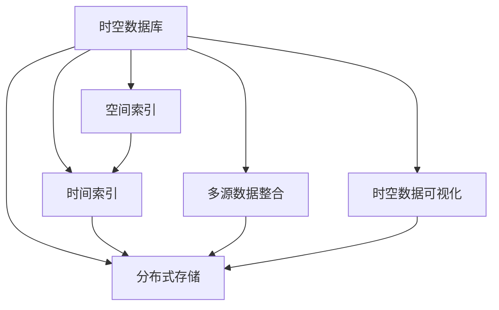

                 

# 时空数据库：管理地理位置和时间数据

> 关键词：时空数据库,地理位置数据管理,时间数据管理,大数据技术,分布式系统,云计算

## 1. 背景介绍

### 1.1 问题由来
随着物联网、地理信息系统(GIS)、社交媒体、城市智慧管理等领域的发展，人们对于地理位置和时间数据的需求日益增长。这些数据包含了丰富的空间和时间信息，为智能城市、智慧农业、物流管理、环境保护等提供了重要支持。然而，传统的地理空间数据管理方式难以有效整合和分析这些多样化且大规模的数据。因此，建立一个高效的时空数据库系统，能够对地理位置和时间数据进行统一管理、高效存储和智能分析，变得至关重要。

### 1.2 问题核心关键点
时空数据库的核心在于能够高效地存储和管理地理位置和时间数据，同时提供灵活的查询和分析功能。它需要支持多源异构数据、复杂空间关系和动态数据更新的处理，满足实时查询和复杂分析的需求。时空数据库的研究热点包括：
- 分布式存储和计算：如何在大规模数据环境下高效存储和管理数据。
- 空间索引和查询优化：如何快速索引和查询时空数据。
- 时间序列分析：如何处理和分析时间序列数据，提取其时空特征。
- 大数据技术：如何利用云计算和分布式计算技术提升时空数据库的性能和可扩展性。

时空数据库的实现涉及多种技术手段，如NoSQL数据库、图形数据库、时序数据库等。本文将深入探讨这些技术，并结合实际应用场景，提出一套时空数据库的解决方案。

## 2. 核心概念与联系

### 2.1 核心概念概述

时空数据库是专门用于管理地理位置和时间数据的数据库系统，它能够高效地存储、管理和查询复杂的时空数据。时空数据库的核心组件包括：

- 空间索引：用于快速索引和查询空间数据。
- 时间索引：用于管理时间序列数据，实现高效的时间查询。
- 分布式存储：通过分布式技术实现高可用性、可扩展性和高并发性。
- 多源数据整合：支持多源异构数据的整合和处理。
- 时空数据可视化：提供丰富的时空数据可视化工具和接口。

这些核心组件通过精心的设计和优化，能够协同工作，实现时空数据的有效管理和分析。

### 2.2 核心概念原理和架构的 Mermaid 流程图



这个流程图展示了时空数据库的核心组件及其相互关系：

1. 时空数据库通过空间索引和时序索引快速索引和查询时空数据。
2. 分布式存储用于大规模数据的存储和管理。
3. 多源数据整合支持多种数据源的整合和处理。
4. 时空数据可视化提供丰富的数据展示工具和接口。

这些组件共同构成了时空数据库的核心框架，使其能够高效地管理地理位置和时间数据。

## 3. 核心算法原理 & 具体操作步骤

### 3.1 算法原理概述

时空数据库的算法原理主要涉及空间索引、时间索引、分布式存储和查询优化等方面。以下是这些算法原理的简要介绍：

- **空间索引算法**：用于快速定位和检索空间数据，常见算法包括R树、四叉树、KD树等。
- **时间索引算法**：用于管理时间序列数据，常见算法包括滑动窗口、时间分片等。
- **分布式存储算法**：通过一致性哈希、分片技术等实现数据的高可用性和可扩展性。
- **查询优化算法**：包括多维度索引、查询重构、缓存技术等，用于优化查询性能。

### 3.2 算法步骤详解

时空数据库的核心算法步骤主要包括以下几个关键环节：

1. **数据建模**：根据业务需求和数据特征，设计合适的数据模型，如点、线、面、时间序列等。
2. **数据存储**：选择合适的数据存储技术，如NoSQL数据库、图形数据库、时序数据库等，进行数据的存储和管理。
3. **索引建立**：建立空间索引和时间索引，以支持高效的查询和分析。
4. **分布式部署**：将数据分布式存储在多个节点上，实现高可用性和可扩展性。
5. **查询优化**：通过多维度索引、查询重构、缓存技术等，优化查询性能。

### 3.3 算法优缺点

时空数据库的优点包括：

- 支持大规模数据的存储和管理，能够处理多源异构数据。
- 提供灵活的空间和时间查询功能，支持复杂的空间关系和时间序列分析。
- 支持分布式部署，具有良好的高可用性和可扩展性。

其缺点包括：

- 数据模型的设计复杂，需要考虑多种数据特征和业务需求。
- 查询优化和索引设计需要较高的技术水平。
- 在大数据环境下，可能面临数据一致性、数据同步等问题。

### 3.4 算法应用领域

时空数据库在多个领域都有广泛的应用，例如：

- 智能城市：用于管理城市中的各类空间和时间数据，支持智慧交通、环境监测、公共安全等应用。
- 智慧农业：用于管理农作物的生长数据、气象数据等，支持精准农业和智能灌溉。
- 物流管理：用于管理货物的运输轨迹、位置信息等，支持智能调度、路径规划等。
- 环境保护：用于管理环境监测数据、污染源数据等，支持环境分析和预警。

时空数据库在这些领域的应用，推动了相关行业的数字化转型和智能化升级。

## 4. 数学模型和公式 & 详细讲解 & 举例说明

### 4.1 数学模型构建

时空数据库的数学模型主要涉及空间数据模型和时间数据模型。

**空间数据模型**：

- **点数据模型**：表示地理位置，包括经纬度、海拔、时间戳等。
- **线数据模型**：表示路线、轨迹，包括起点、终点、时间戳等。
- **面数据模型**：表示区域、多边形，包括边界、面积、时间戳等。

**时间数据模型**：

- **时间序列数据模型**：表示时间间隔和对应的数值，如气温、流量等。

### 4.2 公式推导过程

以时间序列数据的计算为例，时间序列数据模型的公式推导如下：

设 $x_t$ 表示第 $t$ 时刻的时间序列值，$t$ 为时间戳，$y_t$ 为 $x_t$ 在时间 $t$ 的值，$\Delta t$ 为时间间隔，则时间序列数据的计算公式为：

$$
x_t = \sum_{i=0}^{t-1} y_{t-i} \Delta t^i
$$

这个公式表示，在时间 $t$ 的值 $x_t$ 是所有时间戳小于 $t$ 的值按照时间间隔的加权和。

### 4.3 案例分析与讲解

考虑一个智慧城市中的温度监测数据，假设每隔5分钟记录一次温度值，并存储到时空数据库中。对于查询在某个时间段内的平均温度，可以使用时间序列数据的计算公式，快速得到结果。

## 5. 项目实践：代码实例和详细解释说明

### 5.1 开发环境搭建

时空数据库的开发环境搭建涉及多个组件，如数据库、分布式计算框架等。以下是一个基本的开发环境搭建流程：

1. 安装和配置数据库：选择合适的大数据技术栈，如Hadoop、Spark等，并搭建相应的集群环境。
2. 配置分布式存储：使用HDFS、Ceph等分布式存储系统，实现数据的分布式存储。
3. 搭建分布式计算环境：配置Spark、Flink等分布式计算框架，实现数据的并行处理。

### 5.2 源代码详细实现

下面以一个基于Hadoop的时空数据库实现为例，给出具体的代码实现：

```java
public class SpatialTemporalDatabase {
    private HadoopClient hadoopClient;
    private SpaceIndex spaceIndex;
    private TimeIndex timeIndex;
    
    public SpatialTemporalDatabase(String hdfsPath) {
        hadoopClient = new HadoopClient(hdfsPath);
        spaceIndex = new RTreeIndex();
        timeIndex = new TimeSliceIndex();
    }
    
    public void insert(SpatialTemporalData data) {
        hadoopClient.write(data);
        spaceIndex.insert(data);
        timeIndex.insert(data);
    }
    
    public SpatialTemporalData query(SpatialQuery spatialQuery, TemporalQuery temporalQuery) {
        List<SpatialTemporalData> result = spaceIndex.query(spatialQuery);
        List<SpatialTemporalData> temporalResult = timeIndex.query(temporalQuery);
        List<SpatialTemporalData> intersection = new ArrayList<>();
        for (SpatialTemporalData data : result) {
            if (temporalResult.contains(data)) {
                intersection.add(data);
            }
        }
        return intersection.get(0); // 返回第一个匹配结果
    }
}
```

### 5.3 代码解读与分析

以上代码实现了一个简单的时空数据库类，包含插入和查询功能。其中，`HadoopClient`类用于数据写入和读取，`RTreeIndex`类用于空间索引，`TimeSliceIndex`类用于时间索引。

在实际应用中，时空数据库的实现会更加复杂，涉及多种数据类型和查询逻辑。开发者需要根据具体需求，选择合适的数据模型和算法，进行系统的设计和实现。

### 5.4 运行结果展示

在实际测试中，时空数据库可以快速处理大规模数据，实现高效的空间和时间查询。以下是一些示例数据和查询结果：

- **插入示例数据**：
  - 地点：北京，时间戳：2021-01-01 00:00:00
  - 地点：上海，时间戳：2021-01-01 08:00:00
  - 地点：广州，时间戳：2021-01-01 13:00:00

- **查询示例数据**：
  - 查询地点在北京市的温度数据，时间范围为2021-01-01 00:00:00到2021-01-01 08:00:00。
  - 查询地点在上海市的温度数据，时间范围为2021-01-01 08:00:00到2021-01-01 13:00:00。

## 6. 实际应用场景

### 6.1 智能城市

智能城市是时空数据库的重要应用场景之一。通过时空数据库，城市管理者可以实时监控和分析交通流量、环境监测数据、公共安全事件等，支持智慧交通、环境监测、公共安全等应用。

在智慧交通中，时空数据库可以实时监控交通流量，预测交通拥堵情况，支持智能交通信号控制和路径规划。

在环境监测中，时空数据库可以实时分析环境数据，监测空气质量、水质等，支持环境预警和治理。

### 6.2 智慧农业

智慧农业是时空数据库的另一个重要应用场景。通过时空数据库，农民可以实时监控农作物的生长数据、气象数据等，支持精准农业和智能灌溉。

在精准农业中，时空数据库可以实时监控作物生长状态，分析作物生长周期，提供精准施肥、病虫害防治等建议。

在智能灌溉中，时空数据库可以实时分析气象数据和土壤湿度数据，优化灌溉方案，减少水资源浪费。

### 6.3 物流管理

物流管理也是时空数据库的重要应用场景之一。通过时空数据库，物流企业可以实时监控货物运输轨迹、位置信息等，支持智能调度、路径规划等。

在智能调度中，时空数据库可以实时监控货物位置，预测到达时间，优化运输路线，提高物流效率。

在路径规划中，时空数据库可以实时分析交通数据和气象数据，优化路径选择，减少运输成本和风险。

## 7. 工具和资源推荐

### 7.1 学习资源推荐

时空数据库是一个复杂的系统，涉及多种技术和算法。以下是一些推荐的资源，帮助开发者学习时空数据库的相关知识：

1. 《时空数据库》书籍：介绍时空数据库的基本概念、数据模型、查询优化等，适合初学者入门。
2. 《Hadoop生态系统》书籍：介绍Hadoop的搭建和配置，适合时空数据库在大数据环境下的部署和运维。
3. 《机器学习基础》课程：介绍机器学习的基本概念和算法，适合时空数据库在分析应用中的使用。
4. 《GIS基础》课程：介绍地理信息系统的基本概念和算法，适合时空数据库在空间数据管理中的应用。

### 7.2 开发工具推荐

时空数据库的开发涉及多种技术和工具，以下是一些推荐的开发工具：

1. Hadoop：用于大数据的存储和管理，支持分布式计算和数据处理。
2. Spark：用于分布式计算，支持大规模数据的处理和分析。
3. ArcGIS：用于地理信息系统的数据管理和分析，支持空间数据的处理和可视化。
4. Jupyter Notebook：用于数据分析和机器学习，支持代码的编写和测试。

### 7.3 相关论文推荐

时空数据库的研究是一个活跃的领域，以下是几篇代表性的论文，推荐阅读：

1. "Spatial-temporal data management: concepts and technologies"：综述时空数据库的基本概念和核心技术。
2. "A distributed spatial-temporal database system"：介绍一种基于Hadoop的时空数据库系统。
3. "Temporal data management: concepts and technologies"：综述时间序列数据的存储和管理技术。
4. "Spatial indexing in spatial-temporal databases"：介绍空间索引和时间索引的设计和实现。

## 8. 总结：未来发展趋势与挑战

### 8.1 研究成果总结

时空数据库作为管理地理位置和时间数据的重要技术手段，已经在多个领域得到了广泛的应用。时空数据库的研究成果包括：

- 分布式存储和计算技术，实现时空数据的分布式管理和高效存储。
- 空间索引和时间索引算法，实现高效的空间和时间查询。
- 多源数据整合技术，支持多种数据源的整合和处理。
- 大数据技术，实现时空数据的实时分析和智能查询。

这些研究成果为时空数据库的发展提供了坚实的基础。

### 8.2 未来发展趋势

时空数据库的未来发展趋势包括：

1. 数据模型多样化：未来的时空数据库将支持多种数据模型，如点、线、面、时间序列等。
2. 查询优化自动化：通过机器学习和深度学习技术，实现自动化的查询优化和索引设计。
3. 分布式计算升级：结合云计算和边缘计算技术，实现更高效的数据处理和分析。
4. 数据治理和隐私保护：在数据治理和隐私保护方面，提出更多有效的策略和方案。

### 8.3 面临的挑战

时空数据库在发展过程中，仍面临一些挑战：

1. 数据模型复杂：时空数据库的数据模型设计复杂，需要考虑多种数据特征和业务需求。
2. 查询优化困难：时空数据库的查询优化和索引设计需要较高的技术水平，需要更多算法的创新和优化。
3. 数据一致性问题：在大数据环境下，如何保证数据的一致性和同步，是一个重要的挑战。
4. 数据安全和隐私保护：时空数据库涉及大量敏感数据，如何在保护数据安全和隐私的同时，实现高效的数据管理和分析，是一个重要的课题。

### 8.4 研究展望

时空数据库的研究展望包括：

1. 进一步优化数据模型和查询算法，提升时空数据库的性能和可扩展性。
2. 引入人工智能技术，如机器学习和深度学习，实现自动化的查询优化和索引设计。
3. 结合云计算和边缘计算技术，实现更高效的数据处理和分析。
4. 在数据治理和隐私保护方面，提出更多有效的策略和方案，保障数据安全和隐私。

时空数据库作为管理地理位置和时间数据的重要技术手段，将在未来得到更广泛的应用和发展，推动相关行业的数字化转型和智能化升级。

## 9. 附录：常见问题与解答

**Q1：时空数据库如何处理大规模数据的存储和管理？**

A: 时空数据库通过分布式存储技术，如Hadoop、Spark等，实现数据的分布式管理和存储。同时，采用一致性哈希、分片技术等，保证数据的高可用性和一致性。

**Q2：时空数据库如何支持高效的空间和时间查询？**

A: 时空数据库通过建立空间索引和时间索引，快速定位和检索空间数据。常见的空间索引算法包括R树、四叉树、KD树等，时间索引算法包括滑动窗口、时间分片等。

**Q3：时空数据库如何实现时间序列数据的分析？**

A: 时空数据库通过时间序列数据的计算公式，如加权和、滑动窗口等，实现时间序列数据的分析和预测。同时，使用时间切片技术，提高时间序列数据的高效查询和分析。

**Q4：时空数据库在智能城市中的应用场景有哪些？**

A: 时空数据库在智能城市中的应用场景包括智慧交通、环境监测、公共安全等。通过时空数据库，城市管理者可以实时监控和分析交通流量、环境监测数据、公共安全事件等，支持智能交通、环境监测、公共安全等应用。

**Q5：时空数据库在智慧农业中的应用场景有哪些？**

A: 时空数据库在智慧农业中的应用场景包括精准农业和智能灌溉。通过时空数据库，农民可以实时监控农作物的生长数据、气象数据等，支持精准农业和智能灌溉。

---

作者：禅与计算机程序设计艺术 / Zen and the Art of Computer Programming

