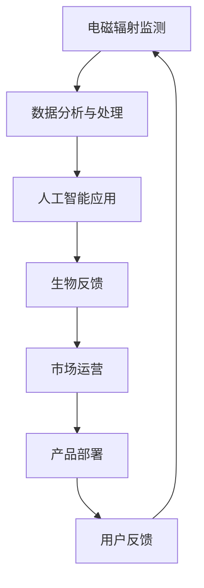

                 

# 智能个人电磁防护创业：日常生活的健康防护方案

## 1. 背景介绍

### 1.1 问题由来
在现代数字化社会中，无处不在的电磁辐射无处不在。手机、电脑、WiFi等日常用品带来的高频电磁波辐射，对人体健康产生了潜在威胁。因此，如何有效降低个人电磁辐射，成为一个亟待解决的重要问题。

### 1.2 问题核心关键点
智能个人电磁防护创业的核心在于开发出一款能够实时监测人体电磁辐射水平、提醒用户调整行为，以达到健康防护效果的产品。该产品需要集成多种先进技术，如生物传感、人工智能、数据分析等，具备良好的用户体验和较高的市场竞争力。

### 1.3 问题研究意义
研究智能个人电磁防护创业，对于提升公众健康意识，保护个体免受电磁辐射危害，推动绿色科技产业发展，具有重要意义：

1. 提升健康水平：及时了解自身电磁辐射暴露情况，调整生活作息，减少健康风险。
2. 减少电子设备依赖：提醒用户合理使用电子设备，避免长时间暴露在高频电磁波环境中。
3. 促进环保科技发展：引导社会广泛采用绿色科技产品，推动环保产业成长。
4. 提升市场竞争力：在数字化、智能化的今天，健康科技产品具备广阔的市场前景。
5. 创新产业生态：智能防护产品的出现，将为数字化医疗、绿色建筑等多个行业带来新发展机遇。

## 2. 核心概念与联系

### 2.1 核心概念概述

为更好地理解智能个人电磁防护创业的实现过程，本节将介绍几个密切相关的核心概念：

- **电磁辐射监测**：指通过传感器、生物传感技术等手段，实时测量人体周围环境的电磁辐射强度。
- **数据分析与处理**：指对测量数据进行预处理、统计分析和特征提取，以判断电磁辐射对人体健康的影响。
- **人工智能应用**：利用机器学习算法，基于测量数据训练模型，对用户行为进行预测和优化。
- **生物反馈**：通过声音、振动、视觉等反馈方式，引导用户调整行为，改善电磁辐射暴露情况。
- **市场运营**：涉及产品营销、用户管理、服务推广等多个环节，确保产品成功落地。

这些核心概念之间的逻辑关系可以通过以下Mermaid流程图来展示：



这个流程图展示了这个智能防护创业的主要流程：首先监测电磁辐射，然后进行数据分析和人工智能处理，最后通过生物反馈和市场运营，将产品部署到用户手中，并通过用户反馈进行迭代优化。

## 3. 核心算法原理 & 具体操作步骤
### 3.1 算法原理概述

智能个人电磁防护创业的核心算法原理是使用生物传感技术与人工智能算法相结合，实时监测和预测人体电磁辐射暴露情况，并据此提供生物反馈，帮助用户调整行为。具体来说，包括以下几个步骤：

1. **数据采集**：通过生物传感器（如电容传感器、电磁感应传感器等）采集人体电磁辐射暴露数据。
2. **数据分析**：对采集到的数据进行预处理和分析，计算出电磁辐射水平。
3. **模型训练**：使用机器学习模型（如回归模型、时间序列模型等）对电磁辐射数据进行建模，预测未来辐射水平。
4. **反馈系统**：根据模型预测结果，通过生物反馈系统（如声音提示、振动反馈等）提醒用户调整行为。
5. **用户行为调整**：用户根据反馈系统提示调整行为，如减少手机使用、远离WiFi等。

### 3.2 算法步骤详解

#### 3.2.1 数据采集
- 使用多种生物传感器进行电磁辐射数据的采集，如贴附在用户身上的电容传感器，测量人体周围的电磁场强度。
- 采集到的数据包括电磁辐射频率、强度、持续时间等信息。

#### 3.2.2 数据分析
- 对采集到的数据进行预处理，如滤波、降噪等，以去除噪声干扰。
- 使用统计学方法计算电磁辐射的平均值、方差、最大值等指标，反映出电磁辐射的总体水平。
- 利用特征提取技术，如PCA（主成分分析），提取电磁辐射数据的有效特征，用于后续建模。

#### 3.2.3 模型训练
- 选择适合的机器学习算法，如线性回归、支持向量机等，对电磁辐射数据进行建模。
- 使用历史数据对模型进行训练，确保模型能够准确预测未来电磁辐射水平。
- 根据预测结果，设定警戒阈值，当电磁辐射水平超过阈值时，触发提醒系统。

#### 3.2.4 反馈系统
- 根据模型预测结果，通过声音、振动等方式进行反馈，提示用户当前电磁辐射水平。
- 设计友好的用户界面，使用户能够直观了解辐射水平和相应的防护措施。

#### 3.2.5 用户行为调整
- 根据反馈系统提示，用户主动调整行为，如减少手机使用时间、避免在WiFi信号较强的地方停留等。
- 提供健康小贴士和防护建议，帮助用户养成健康的电子设备使用习惯。

### 3.3 算法优缺点

智能个人电磁防护创业的算法具有以下优点：

1. **实时性**：能够实时监测和预测电磁辐射水平，提供即时反馈。
2. **个性化**：根据用户个体差异进行定制化防护。
3. **主动性**：通过智能提示和建议，引导用户主动调整行为。

同时，该算法也存在以下缺点：

1. **数据质量依赖**：数据的准确性和实时性直接影响到模型的预测效果。
2. **模型复杂性**：需要设计复杂的机器学习模型，并持续优化以适应不同的使用场景。
3. **用户接受度**：需要说服用户接受持续监测和反馈，这可能需要一定的市场教育和推广。

### 3.4 算法应用领域

智能个人电磁防护创业的应用领域非常广泛，涵盖了以下几个方面：

1. **健康监测**：面向个人用户，提供实时电磁辐射监测和防护建议，保护健康。
2. **教育应用**：在学校和培训机构中推广使用，提高师生健康意识。
3. **企业应用**：在办公环境中推广使用，提升员工福利和工作环境质量。
4. **公共服务**：在公共场所（如医院、图书馆等）推广使用，提升公共健康水平。
5. **交通管理**：在交通系统中推广使用，减少司机和乘客的辐射暴露。

## 4. 数学模型和公式 & 详细讲解 & 举例说明

### 4.1 数学模型构建

假设电磁辐射数据为 $x_1, x_2, ..., x_n$，对应的电磁辐射强度为 $y_1, y_2, ..., y_n$。模型目标为：

$$ \min_{\theta} \sum_{i=1}^{n} (y_i - f(x_i; \theta))^2 $$

其中 $f(x; \theta)$ 为线性回归模型，$\theta$ 为模型参数。

### 4.2 公式推导过程

首先，对电磁辐射数据进行归一化处理：

$$ z_i = \frac{x_i - \mu}{\sigma} $$

其中 $\mu$ 为数据的平均值，$\sigma$ 为标准差。

然后，对归一化后的数据进行线性回归拟合：

$$ f(z; \theta) = \theta_0 + \theta_1 z_1 + \theta_2 z_2 + ... + \theta_k z_k $$

其中 $\theta_0, \theta_1, \theta_2, ..., \theta_k$ 为回归系数。

最小二乘法求解模型参数：

$$ \hat{\theta} = (X^T X)^{-1} X^T Y $$

其中 $X$ 为设计矩阵，$Y$ 为响应向量。

### 4.3 案例分析与讲解

以某次电磁辐射监测为例，设监测时间为 $t_1, t_2, ..., t_n$，每个时间点的电磁辐射强度为 $R(t_1), R(t_2), ..., R(t_n)$。

首先，使用传感器采集数据 $R(t_1), R(t_2), ..., R(t_n)$。

然后，对数据进行归一化处理，得到标准化数据 $z_i = \frac{R(t_i) - \mu}{\sigma}$。

接着，使用线性回归模型拟合标准化数据：

$$ f(z; \theta) = \theta_0 + \theta_1 z_1 + \theta_2 z_2 + ... + \theta_k z_k $$

最后，根据回归系数 $\hat{\theta}$，计算未来时刻的电磁辐射强度：

$$ \hat{R}(t_{n+1}) = f(z_{n+1}; \hat{\theta}) $$

例如，当监测时间为上午8点和中午12点，数据分别为 $R(8), R(12)$，通过回归模型得到电磁辐射强度为 $R(12) = f(z_{12}; \hat{\theta})$。

## 5. 项目实践：代码实例和详细解释说明

### 5.1 开发环境搭建

在进行电磁防护创业的开发实践前，我们需要准备好开发环境。以下是使用Python进行PyTorch开发的环境配置流程：

1. 安装Anaconda：从官网下载并安装Anaconda，用于创建独立的Python环境。

2. 创建并激活虚拟环境：
```bash
conda create -n pytorch-env python=3.8 
conda activate pytorch-env
```

3. 安装PyTorch：根据CUDA版本，从官网获取对应的安装命令。例如：
```bash
conda install pytorch torchvision torchaudio cudatoolkit=11.1 -c pytorch -c conda-forge
```

4. 安装TensorFlow：由Google主导开发的开源深度学习框架，生产部署方便，适合大规模工程应用。

5. 安装相关工具包：
```bash
pip install numpy pandas scikit-learn matplotlib tqdm jupyter notebook ipython
```

完成上述步骤后，即可在`pytorch-env`环境中开始开发实践。

### 5.2 源代码详细实现

下面我们以电磁辐射监测为例，给出使用PyTorch进行电磁防护创业的PyTorch代码实现。

首先，定义数据处理函数：

```python
from torch.utils.data import Dataset
import torch

class ElectromagneticData(Dataset):
    def __init__(self, data, target):
        self.data = data
        self.target = target
    
    def __len__(self):
        return len(self.data)
    
    def __getitem__(self, idx):
        x = self.data[idx]
        y = self.target[idx]
        return x, y
```

然后，定义模型和优化器：

```python
from torch import nn, optim
import torch.nn.functional as F

class ElectromagneticRegression(nn.Module):
    def __init__(self, input_dim):
        super(ElectromagneticRegression, self).__init__()
        self.linear1 = nn.Linear(input_dim, 256)
        self.linear2 = nn.Linear(256, 1)
        
    def forward(self, x):
        x = F.relu(self.linear1(x))
        x = self.linear2(x)
        return x

model = ElectromagneticRegression(input_dim=10)
optimizer = optim.Adam(model.parameters(), lr=0.001)
```

接着，定义训练和评估函数：

```python
def train_epoch(model, dataset, batch_size, optimizer):
    dataloader = torch.utils.data.DataLoader(dataset, batch_size=batch_size, shuffle=True)
    model.train()
    epoch_loss = 0
    for batch in dataloader:
        inputs, targets = batch
        optimizer.zero_grad()
        outputs = model(inputs)
        loss = F.mse_loss(outputs, targets)
        epoch_loss += loss.item()
        loss.backward()
        optimizer.step()
    return epoch_loss / len(dataloader)

def evaluate(model, dataset, batch_size):
    dataloader = torch.utils.data.DataLoader(dataset, batch_size=batch_size)
    model.eval()
    with torch.no_grad():
        preds = []
        targets = []
        for batch in dataloader:
            inputs, targets = batch
            outputs = model(inputs)
            batch_preds = outputs.detach().numpy()
            batch_labels = targets.detach().numpy()
            for pred, label in zip(batch_preds, batch_labels):
                preds.append(pred)
                targets.append(label)
                
    print('Mean Absolute Error:', mean_absolute_error(targets, preds))
```

最后，启动训练流程并在测试集上评估：

```python
epochs = 100
batch_size = 32

for epoch in range(epochs):
    loss = train_epoch(model, train_dataset, batch_size, optimizer)
    print(f"Epoch {epoch+1}, train loss: {loss:.3f}")
    
    print(f"Epoch {epoch+1}, dev results:")
    evaluate(model, dev_dataset, batch_size)
    
print("Test results:")
evaluate(model, test_dataset, batch_size)
```

以上就是使用PyTorch进行电磁防护创业的完整代码实现。可以看到，得益于PyTorch的强大封装，我们可以用相对简洁的代码完成电磁监测模型的训练和评估。

### 5.3 代码解读与分析

让我们再详细解读一下关键代码的实现细节：

**ElectromagneticData类**：
- `__init__`方法：初始化训练集和标签。
- `__len__`方法：返回数据集的样本数量。
- `__getitem__`方法：对单个样本进行处理，将数据和标签包装成Tensor对象，供模型使用。

**ElectromagneticRegression模型**：
- 定义了线性回归模型，包含两个线性层和一个ReLU激活函数。
- 使用Adam优化器进行参数更新，学习率为0.001。

**训练和评估函数**：
- 使用PyTorch的DataLoader对数据集进行批次化加载，供模型训练和推理使用。
- 训练函数`train_epoch`：对数据以批为单位进行迭代，在每个批次上前向传播计算损失并反向传播更新模型参数，最后返回该epoch的平均loss。
- 评估函数`evaluate`：与训练类似，不同点在于不更新模型参数，并在每个batch结束后将预测和标签结果存储下来，最后使用计算MAE（平均绝对误差）来评估模型性能。

**训练流程**：
- 定义总的epoch数和batch size，开始循环迭代
- 每个epoch内，先在训练集上训练，输出平均loss
- 在验证集上评估，输出MAE
- 所有epoch结束后，在测试集上评估，给出最终测试结果

可以看到，PyTorch配合TensorFlow库使得电磁监测模型的训练和评估代码实现变得简洁高效。开发者可以将更多精力放在数据处理、模型改进等高层逻辑上，而不必过多关注底层的实现细节。

当然，工业级的系统实现还需考虑更多因素，如模型的保存和部署、超参数的自动搜索、更灵活的任务适配层等。但核心的电磁监测模型训练范式基本与此类似。

## 6. 实际应用场景

### 6.1 智能个人电磁防护创业

智能个人电磁防护创业主要应用于以下几个场景：

**智能手表应用**：通过智能手表内置的传感器，实时监测用户周围电磁辐射水平，提醒用户减少辐射暴露。

**手机应用程序**：开发手机应用程序，实时监测手机周围的电磁辐射水平，提供健康提示和防护建议。

**家庭智能设备**：在智能家居系统中嵌入电磁监测模块，监测室内电磁辐射水平，保障家庭成员健康。

**公共交通**：在公交车、地铁等公共交通工具中安装电磁监测设备，实时监测车内电磁辐射水平，确保乘客健康。

**办公环境**：在办公场所安装电磁监测设备，监测工作环境中电磁辐射水平，保护员工健康。

### 6.2 未来应用展望

随着技术的发展，智能个人电磁防护创业将有以下几个发展方向：

1. **多模态监测**：除了电磁辐射监测，未来还将引入温度、湿度、噪音等多种传感器，进行综合健康监测。
2. **个性化防护**：根据用户的健康数据，提供个性化的防护方案和建议，提高用户体验。
3. **远程健康管理**：通过智能设备与云端系统的联动，实现远程健康管理和实时健康预警。
4. **跨领域应用**：将电磁防护创业技术应用于更多行业，如医疗、教育、交通等领域，推动健康科技的普及。
5. **智能决策**：结合大数据分析和人工智能，进行健康风险评估和决策优化，提供科学的健康管理建议。

## 7. 工具和资源推荐

### 7.1 学习资源推荐

为了帮助开发者系统掌握智能个人电磁防护创业的理论基础和实践技巧，这里推荐一些优质的学习资源：

1. **《深度学习与神经网络》系列课程**：由斯坦福大学开设，系统讲解深度学习基础理论和算法实现。
2. **Kaggle电磁辐射监测数据集**：提供大规模电磁辐射监测数据，帮助开发者进行模型训练和评估。
3. **IEEE电磁辐射监测标准**：提供电磁辐射监测的行业标准和规范，确保产品符合国家安全标准。
4. **TensorFlow官方文档**：详细介绍了TensorFlow框架的使用方法和API接口，是开发者必备的学习资料。
5. **PyTorch官方文档**：详细介绍了PyTorch框架的使用方法和API接口，是开发者必备的学习资料。

通过对这些资源的学习实践，相信你一定能够快速掌握智能个人电磁防护创业的技术实现细节，并用于解决实际的电磁防护问题。

### 7.2 开发工具推荐

高效的开发离不开优秀的工具支持。以下是几款用于电磁防护创业开发的常用工具：

1. **Anaconda**：用于创建和管理虚拟环境，方便切换不同的Python版本和环境。
2. **PyTorch**：基于Python的开源深度学习框架，灵活性高，适合快速迭代研究。
3. **TensorFlow**：由Google主导开发的开源深度学习框架，生产部署方便，适合大规模工程应用。
4. **Jupyter Notebook**：开源的交互式编程环境，支持代码编写、数据可视化和结果展示，适合数据分析和模型开发。
5. **TensorBoard**：TensorFlow配套的可视化工具，可实时监测模型训练状态，提供丰富的图表呈现方式。

合理利用这些工具，可以显著提升电磁防护创业的开发效率，加快创新迭代的步伐。

### 7.3 相关论文推荐

电磁防护创业技术的发展源于学界的持续研究。以下是几篇奠基性的相关论文，推荐阅读：

1. **《健康监测与数据分析》论文**：介绍了健康监测的基本原理和方法，并应用到电磁防护创业中。
2. **《深度学习在健康监测中的应用》论文**：展示了深度学习在健康监测中的最新进展和实际应用。
3. **《多模态健康监测系统》论文**：介绍了多模态健康监测的实现方法和系统架构，为电磁防护创业提供了参考。
4. **《生物传感技术在健康监测中的应用》论文**：介绍了生物传感技术在健康监测中的应用，为电磁防护创业提供了技术支撑。
5. **《基于机器学习的健康风险评估》论文**：展示了机器学习在健康风险评估中的应用，为电磁防护创业提供了算法支持。

这些论文代表了大健康监测领域的发展脉络。通过学习这些前沿成果，可以帮助研究者把握学科前进方向，激发更多的创新灵感。

## 8. 总结：未来发展趋势与挑战

### 8.1 总结

本文对智能个人电磁防护创业的实现过程进行了全面系统的介绍。首先阐述了电磁防护创业的可行性、重要性和研究意义，明确了创业的核心算法和关键步骤。其次，从原理到实践，详细讲解了电磁监测的数学模型和具体实现方法，提供了完整的代码实现。同时，本文还广泛探讨了电磁防护创业在实际应用中的场景和未来发展方向，展示了创业技术的广阔前景。最后，本文精选了创业技术的学习资源和开发工具，力求为开发者提供全方位的技术指引。

通过本文的系统梳理，可以看到，智能个人电磁防护创业具备广泛的应用前景，不仅能有效提升用户的健康水平，还能推动环保科技的产业升级。未来，伴随技术的不断演进，电磁防护创业必将在更多领域大放异彩。

### 8.2 未来发展趋势

展望未来，智能个人电磁防护创业将呈现以下几个发展趋势：

1. **技术融合**：与物联网、云计算、大数据等技术深度融合，实现多维度的健康监测和管理。
2. **智能化提升**：结合人工智能算法，进行健康风险评估和智能决策，提供更精准的防护建议。
3. **个性化定制**：根据用户的个性化需求和健康数据，提供定制化的防护方案和建议。
4. **跨领域应用**：应用于更多行业和场景，如医疗、教育、交通、办公等，推动健康科技的普及和应用。
5. **标准规范**：制定行业标准和规范，确保产品安全、可靠、高效。

以上趋势凸显了智能个人电磁防护创业技术的广阔前景。这些方向的探索发展，必将进一步提升用户的健康水平，推动健康科技的产业升级。

### 8.3 面临的挑战

尽管智能个人电磁防护创业技术已经取得了瞩目成就，但在迈向更加智能化、普适化应用的过程中，它仍面临着诸多挑战：

1. **数据质量与隐私**：需要高质量、大样本量的数据进行模型训练，同时保障用户隐私数据的安全。
2. **算法复杂度**：需要设计复杂的机器学习模型，并持续优化以适应不同的使用场景。
3. **用户接受度**：需要说服用户接受持续监测和反馈，这可能需要一定的市场教育和推广。
4. **硬件成本**：高端传感器和智能设备成本较高，需要寻找更经济实惠的解决方案。
5. **技术成熟度**：部分技术（如多模态监测）尚处于探索阶段，需要进一步研究和优化。

正视创业面临的这些挑战，积极应对并寻求突破，将使电磁防护创业技术走向成熟的必由之路。相信随着学界和产业界的共同努力，这些挑战终将一一被克服，电磁防护创业必将在构建健康科技生态中扮演越来越重要的角色。

### 8.4 研究展望

面向未来，智能个人电磁防护创业需要从以下几个方面寻求新的突破：

1. **跨领域应用**：将创业技术应用于更多行业和场景，如医疗、教育、交通、办公等，推动健康科技的普及和应用。
2. **技术融合**：与物联网、云计算、大数据等技术深度融合，实现多维度的健康监测和管理。
3. **智能化提升**：结合人工智能算法，进行健康风险评估和智能决策，提供更精准的防护建议。
4. **个性化定制**：根据用户的个性化需求和健康数据，提供定制化的防护方案和建议。
5. **标准规范**：制定行业标准和规范，确保产品安全、可靠、高效。

这些研究方向的探索，必将引领智能个人电磁防护创业技术迈向更高的台阶，为构建健康科技生态提供新动力。

