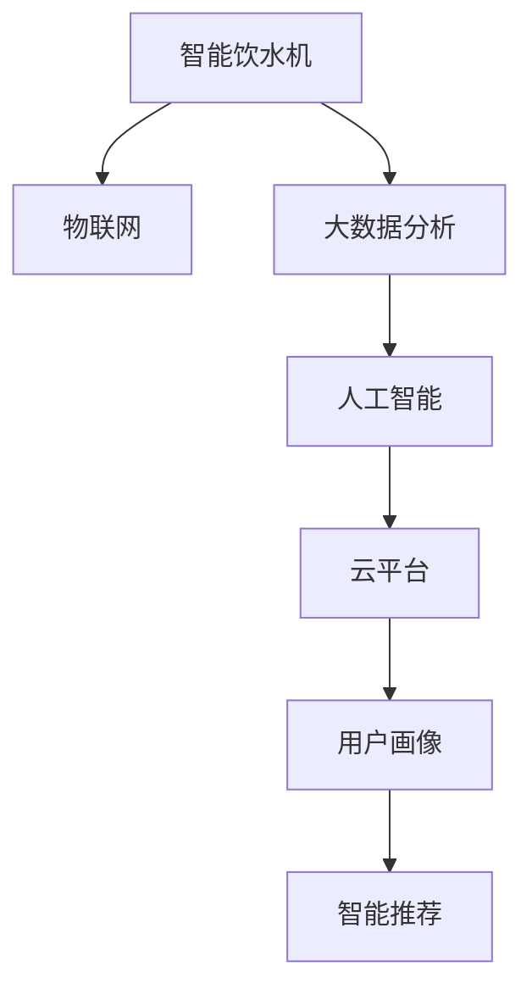

                 

# 智能健康饮水创业：科技助力的健康生活

在数字化大潮的推动下，人们的生活方式正在经历深刻的变革。其中，智能健康饮水领域无疑是受到科技助力最多、最具前景的创新应用之一。本文将深入探讨智能健康饮水创业的原理、算法、项目实践以及未来发展趋势，为希望在这领域深耕的创业者提供一份全面的技术指南。

## 1. 背景介绍

### 1.1 问题由来
随着社会生活节奏的加快，人们对健康饮水有了更高的要求。以往机械式饮水方式已无法满足个性化和智能化的需求。传统饮水机的低效率、卫生状况差等问题，亟需通过科技手段进行改进。智能饮水机作为新一代饮水设备，集成了物联网、大数据分析、人工智能等多种技术，具备温度控制、水质监测、智能提醒等多项功能，极大地提升了饮水体验和饮水效率。

### 1.2 问题核心关键点
智能饮水创业的核心在于如何整合智能饮水设备和云平台，利用物联网和大数据技术，为用户提供个性化的饮水解决方案。通过传感技术采集饮水行为数据，结合人工智能模型进行数据分析和处理，实现实时反馈和智能提醒。此外，如何保证饮水机系统的稳定性和安全性，也是智能饮水创业面临的重要挑战。

## 2. 核心概念与联系

### 2.1 核心概念概述

为更好地理解智能健康饮水创业的技术原理和应用，本节将介绍几个密切相关的核心概念：

- **智能饮水机**：集成传感器、物联网技术和AI算法，具备温度控制、水质监测、用户行为分析等功能的饮水设备。
- **物联网(IoT)**：通过互联网将各种设备连接起来，实现数据的实时传输和处理，为智能饮水机的远程监控和管理提供支持。
- **大数据分析**：利用云计算技术处理海量饮水行为数据，通过统计分析和机器学习算法，提取有价值的信息，实现智能决策。
- **人工智能(AI)**：包括机器学习、深度学习等多种算法，用于饮水行为的预测和异常检测，提升饮水机的智能化程度。
- **云平台**：提供数据存储、计算和应用托管服务，实现智能饮水机的远程管理和用户数据的保护。
- **用户画像**：通过分析用户的饮水行为数据，构建用户画像，实现个性化推荐和智能提醒。
- **智能推荐**：根据用户偏好和行为数据，推荐合适的饮水方案，如水的温度、种类等。

这些核心概念之间的逻辑关系可以通过以下Mermaid流程图来展示：



这个流程图展示出智能饮水创业涉及的核心概念及其之间的关系：

1. 智能饮水机通过物联网实现数据传输和远程控制。
2. 大数据分析技术用于处理饮水行为数据，提取有价值的信息。
3. 人工智能算法进行数据分析和模型训练，提升饮水机的智能化水平。
4. 云平台提供数据存储和应用托管服务，实现数据的可靠性和可扩展性。
5. 用户画像和智能推荐技术为用户提供个性化饮水方案。

## 3. 核心算法原理 & 具体操作步骤

### 3.1 算法原理概述

智能饮水创业的核心在于利用物联网和大数据技术，结合人工智能算法，构建智能饮水解决方案。其核心思想是：通过物联网设备采集用户的饮水行为数据，传输至云平台进行大数据分析和人工智能模型的训练，从而实现对饮水行为的预测和智能推荐。

形式化地，假设智能饮水机的传感器数据为 $D=\{x_i\}_{i=1}^N$，其中 $x_i$ 包含温度、水质、饮水时间等信息。定义智能饮水系统的损失函数为 $\mathcal{L}(y,\hat{y})$，其中 $y$ 为真实饮水行为标签，$\hat{y}$ 为模型预测饮水行为。智能饮水创业的目标是最小化损失函数，即找到最优模型参数 $\theta$：

$$
\theta^* = \mathop{\arg\min}_{\theta} \mathcal{L}(y,\hat{y})
$$

在实践中，我们通常使用基于梯度的优化算法（如Adam、SGD等）来近似求解上述最优化问题。设 $\eta$ 为学习率，$\lambda$ 为正则化系数，则参数的更新公式为：

$$
\theta \leftarrow \theta - \eta \nabla_{\theta}\mathcal{L}(y,\hat{y}) - \eta\lambda\theta
$$

其中 $\nabla_{\theta}\mathcal{L}(y,\hat{y})$ 为损失函数对参数 $\theta$ 的梯度，可通过反向传播算法高效计算。

### 3.2 算法步骤详解

智能饮水创业的一般流程包括以下几个关键步骤：

**Step 1: 收集饮水行为数据**
- 安装智能饮水机，并开启传感器数据采集。传感器的数据类型包括但不限于饮水温度、水质、饮水时间等。
- 确保饮水机的数据采集器能够稳定运行，实时记录饮水行为数据。

**Step 2: 数据清洗与预处理**
- 对采集到的原始数据进行清洗，去除异常数据和噪声。
- 对数据进行标准化处理，使其符合后续模型的输入要求。

**Step 3: 特征工程与建模**
- 设计合适的特征，如饮水时间、饮水温度、饮水频率等，用于表示用户的饮水行为。
- 选择合适的机器学习或深度学习算法，如随机森林、神经网络等，建立饮水行为预测模型。

**Step 4: 模型训练与评估**
- 将清洗后的饮水行为数据分为训练集和测试集，训练模型。
- 在测试集上评估模型的性能，使用准确率、召回率等指标衡量模型的预测能力。
- 根据评估结果调整模型参数，进行多次迭代训练，直至模型达到满意的性能。

**Step 5: 模型部署与迭代**
- 将训练好的模型部署到云平台，提供API接口供用户调用。
- 持续收集用户的饮水行为数据，周期性地重新训练模型，以适应新的饮水行为和偏好。

### 3.3 算法优缺点

智能饮水创业的监督学习方法具有以下优点：
1. 数据驱动。通过收集用户的饮水行为数据，为用户提供个性化的饮水建议，从而提升用户体验。
2. 实时反馈。通过物联网技术，可以实现饮水行为的实时监控和反馈，及时发现异常并提醒用户。
3. 用户画像。通过大数据分析和人工智能模型，可以构建用户画像，实现更精准的用户推荐。

同时，该方法也存在一定的局限性：
1. 对设备依赖。智能饮水创业的成功离不开高质量的饮水机设备和传感器的稳定运行。
2. 隐私风险。饮水行为数据的采集和存储可能涉及用户隐私问题，需做好数据保护措施。
3. 模型泛化能力。如果模型仅在特定数据集上训练，其泛化能力可能有限，难以应对新用户和新场景。
4. 计算资源。大数据分析和深度学习模型的训练需要大量计算资源，初期投入较大。

尽管存在这些局限性，但就目前而言，基于监督学习的智能饮水创业方法仍是大数据和人工智能技术在饮水领域应用的经典范式。未来相关研究的重点在于如何进一步降低对设备硬件的依赖，提高模型的泛化能力，同时兼顾隐私保护和计算效率等因素。

### 3.4 算法应用领域

基于智能饮水创业的监督学习方法，已经在智能饮水设备、健康管理、智能家居等多个领域得到广泛应用，例如：

- 智能饮水机：利用传感器采集饮水温度、水质等数据，结合AI模型实时监控用户饮水行为，提供个性化饮水建议。
- 健康管理：通过监测用户的饮水行为，结合其他健康数据（如步数、睡眠等），实现全面的健康管理。
- 智能家居：将饮水机与智能音箱、智能灯光等设备联动，实现全场景智能家居生活。
- 智慧城市：通过大数据分析平台，收集城市内饮水机数据，分析饮水行为趋势，为城市水资源管理和公共健康提供决策支持。

除了上述这些经典应用外，智能饮水创业还将进一步拓展到更多场景中，如智能办公、智能教育、智能服务机器人等，为智慧城市建设和生活方式的变革注入新的活力。

## 4. 数学模型和公式 & 详细讲解

### 4.1 数学模型构建

本节将使用数学语言对智能饮水创业的模型训练和预测过程进行更加严格的刻画。

假设智能饮水系统的特征集合为 $X=\{x_1,x_2,...,x_n\}$，标签集合为 $Y=\{y_1,y_2,...,y_m\}$，其中 $x_i$ 和 $y_i$ 分别表示饮水行为特征和标签。定义损失函数为交叉熵损失，即：

$$
\mathcal{L}(y,\hat{y}) = -\frac{1}{N}\sum_{i=1}^N (y_i\log \hat{y}_i + (1-y_i)\log (1-\hat{y}_i))
$$

其中 $\hat{y}_i$ 为模型预测的饮水行为标签。在训练过程中，使用梯度下降等优化算法更新模型参数，最小化损失函数。

### 4.2 公式推导过程

以二分类任务为例，推导交叉熵损失函数及其梯度的计算公式。

假设模型 $M_{\theta}$ 在输入 $x$ 上的输出为 $\hat{y}=M_{\theta}(x) \in [0,1]$，表示样本属于正类的概率。真实标签 $y \in \{0,1\}$。则二分类交叉熵损失函数定义为：

$$
\mathcal{L}(y,\hat{y}) = -[y\log \hat{y} + (1-y)\log (1-\hat{y})]
$$

将其代入总体损失函数公式，得：

$$
\mathcal{L}(\theta) = -\frac{1}{N}\sum_{i=1}^N [y_i\log M_{\theta}(x_i)+(1-y_i)\log(1-M_{\theta}(x_i))]
$$

根据链式法则，损失函数对参数 $\theta_k$ 的梯度为：

$$
\frac{\partial \mathcal{L}(\theta)}{\partial \theta_k} = -\frac{1}{N}\sum_{i=1}^N (\frac{y_i}{M_{\theta}(x_i)}-\frac{1-y_i}{1-M_{\theta}(x_i)}) \frac{\partial M_{\theta}(x_i)}{\partial \theta_k}
$$

其中 $\frac{\partial M_{\theta}(x_i)}{\partial \theta_k}$ 可进一步递归展开，利用自动微分技术完成计算。

在得到损失函数的梯度后，即可带入参数更新公式，完成模型的迭代优化。重复上述过程直至收敛，最终得到适应饮水行为预测的最优模型参数 $\theta^*$。

## 5. 项目实践：代码实例和详细解释说明

### 5.1 开发环境搭建

在进行智能饮水创业的实践前，我们需要准备好开发环境。以下是使用Python进行Keras开发的环境配置流程：

1. 安装Anaconda：从官网下载并安装Anaconda，用于创建独立的Python环境。

2. 创建并激活虚拟环境：
```bash
conda create -n drink-env python=3.8 
conda activate drink-env
```

3. 安装Keras：
```bash
pip install keras tensorflow pandas sklearn
```

4. 安装各类工具包：
```bash
pip install numpy matplotlib scikit-learn 
```

完成上述步骤后，即可在`drink-env`环境中开始智能饮水创业的实践。

### 5.2 源代码详细实现

下面我们以智能饮水机项目为例，给出使用Keras进行饮水行为预测的Python代码实现。

首先，定义饮水行为预测的训练和评估函数：

```python
from keras.models import Sequential
from keras.layers import Dense
from keras.optimizers import Adam

def build_model(input_dim, output_dim):
    model = Sequential()
    model.add(Dense(64, input_dim=input_dim, activation='relu'))
    model.add(Dense(64, activation='relu'))
    model.add(Dense(output_dim, activation='sigmoid'))
    model.compile(optimizer=Adam(lr=0.001), loss='binary_crossentropy', metrics=['accuracy'])
    return model

def train_model(model, X_train, y_train, X_test, y_test, epochs=10):
    model.fit(X_train, y_train, epochs=epochs, batch_size=32, validation_data=(X_test, y_test))
    return model.evaluate(X_test, y_test)

def evaluate_model(model, X_test, y_test):
    loss, accuracy = model.evaluate(X_test, y_test)
    print(f'Test Loss: {loss:.4f}')
    print(f'Test Accuracy: {accuracy:.4f}')
```

然后，准备数据集并进行模型训练：

```python
import pandas as pd
import numpy as np

# 读取数据集
data = pd.read_csv('drinking_data.csv')

# 将饮水时间转换为时间戳
data['drinking_time'] = pd.to_datetime(data['drinking_time']).apply(lambda x: (x - pd.Timestamp('2021-01-01')).total_seconds() // 3600)

# 定义特征和标签
X = data[['drinking_time', 'temperature', 'water_quality']]
y = data['drinking_frequency'] > 0

# 标准化数据
from sklearn.preprocessing import StandardScaler
scaler = StandardScaler()
X = scaler.fit_transform(X)

# 划分训练集和测试集
from sklearn.model_selection import train_test_split
X_train, X_test, y_train, y_test = train_test_split(X, y, test_size=0.2, random_state=42)

# 构建模型
model = build_model(input_dim=X_train.shape[1], output_dim=1)

# 训练模型
model = train_model(model, X_train, y_train, X_test, y_test)
```

最后，对训练好的模型进行评估：

```python
evaluate_model(model, X_test, y_test)
```

以上就是使用Keras进行智能饮水行为预测的完整代码实现。可以看到，得益于Keras的强大封装，我们可以用相对简洁的代码完成饮水行为预测模型的训练和评估。

### 5.3 代码解读与分析

让我们再详细解读一下关键代码的实现细节：

**build_model函数**：
- 定义了模型结构，包括两个隐藏层和一个输出层。
- 使用sigmoid激活函数，处理二分类问题。
- 使用Adam优化器，设定学习率。
- 编译模型，设置损失函数和评估指标。

**train_model函数**：
- 使用fit方法对模型进行训练，设定迭代次数和批次大小。
- 在每个epoch结束时，评估模型在测试集上的性能。

**evaluate_model函数**：
- 使用evaluate方法在测试集上评估模型性能。
- 打印模型的损失和准确率。

这些函数彼此相互协作，实现了从数据预处理到模型训练和评估的完整流程。

## 6. 实际应用场景

### 6.1 智能饮水机

智能饮水机是智能饮水创业的主要载体，通过物联网技术采集饮水行为数据，结合AI模型进行饮水行为预测和智能提醒，提供个性化饮水建议。

具体而言，可以收集用户的饮水时间、饮水温度、饮水频率等行为数据，训练AI模型预测用户未来一段时间内的饮水需求。根据预测结果，饮水机可以自动调整水温，提醒用户定时饮水。对于特殊人群（如儿童、老人），系统还可以根据其饮水行为习惯，制定个性化的饮水方案。

### 6.2 健康管理

智能饮水行为数据可以与用户的其他健康数据（如步数、睡眠、心率等）结合，构建全面的健康管理方案。通过大数据分析和机器学习模型，分析用户的饮水行为与健康指标之间的关系，预测用户的健康状况，提出健康建议。

例如，对于经常忘记饮水的用户，系统可以定期提醒用户饮水，并根据用户的饮水习惯，建议合适的饮水频率和饮水时间，帮助用户养成健康的饮水习惯。

### 6.3 智能家居

智能饮水创业可以与其他智能家居设备联动，实现全场景智能家居生活。例如，将饮水机与智能音箱、智能灯光等设备联动，实现饮水行为的语音控制。用户可以通过语音指令打开饮水机、调整水温、设置饮水时间等，提升生活便利性。

### 6.4 未来应用展望

随着智能饮水创业的不断深入，未来的应用场景将更加广阔，例如：

- 智能办公：在办公室内部署智能饮水机，监测员工饮水行为，结合其他办公数据（如工作时长、运动量等），分析员工的饮水和健康状况，提出相应的健康建议。
- 智能服务机器人：将智能饮水机集成到服务机器人中，在商场、医院等人流密集场所提供个性化饮水服务，提升用户体验。
- 智慧城市：通过大数据分析和AI模型，分析城市内饮水机数据，研究市民饮水行为趋势，为城市水资源管理和公共健康提供决策支持。

此外，在企业生产、社会治理、文娱传媒等众多领域，智能饮水创业也将不断拓展，为智慧城市建设和生活方式的变革注入新的活力。

## 7. 工具和资源推荐

### 7.1 学习资源推荐

为了帮助开发者系统掌握智能饮水创业的技术基础和实践技巧，这里推荐一些优质的学习资源：

1. 《深度学习实战》系列博文：由Keras官方团队撰写，涵盖深度学习模型的搭建、训练和优化等核心技术，是入门Keras的好选择。
2. CS231n《深度学习计算机视觉》课程：斯坦福大学开设的计算机视觉课程，介绍了深度学习在图像处理中的应用，为智能饮水创业提供图像处理的理论基础。
3. 《Keras深度学习教程》书籍：Keras官方文档的扩展，详细介绍了Keras在深度学习模型训练中的各种应用，适合实战练习。
4. TensorFlow官方文档：介绍TensorFlow的开发环境搭建、模型构建、训练和优化等技术，是学习TensorFlow的必备资料。
5. Kaggle平台：提供丰富的数据集和竞赛项目，通过实际应用练习智能饮水创业的相关技术。

通过对这些资源的学习实践，相信你一定能够快速掌握智能饮水创业的技术精髓，并用于解决实际的饮水问题。

### 7.2 开发工具推荐

高效的开发离不开优秀的工具支持。以下是几款用于智能饮水创业开发的常用工具：

1. Keras：基于Python的开源深度学习框架，具有简单易用的API设计，适合快速迭代研究。大部分智能饮水创业模型都有Keras版本的实现。
2. TensorFlow：由Google主导开发的开源深度学习框架，生产部署方便，适合大规模工程应用。同样有丰富的智能饮水创业资源。
3. Jupyter Notebook：提供交互式编程环境，支持Python代码的实时展示和调试，是智能饮水创业项目开发的得力助手。
4. Weights & Biases：模型训练的实验跟踪工具，可以记录和可视化模型训练过程中的各项指标，方便对比和调优。与主流深度学习框架无缝集成。
5. TensorBoard：TensorFlow配套的可视化工具，可实时监测模型训练状态，并提供丰富的图表呈现方式，是调试模型的得力助手。

合理利用这些工具，可以显著提升智能饮水创业任务的开发效率，加快创新迭代的步伐。

### 7.3 相关论文推荐

智能饮水创业的发展源于学界的持续研究。以下是几篇奠基性的相关论文，推荐阅读：

1. "Building Deep Learning Models in Python"：介绍Keras框架的构建和应用，是智能饮水创业项目开发的必备知识。
2. "Deep Learning for NLP and Computer Vision"：介绍深度学习在自然语言处理和计算机视觉中的应用，为智能饮水创业提供理论基础。
3. "Integrating IoT into Smart Water Systems"：探讨物联网技术在智能饮水系统中的应用，为智能饮水创业提供实践指南。
4. "Health Monitoring Using IoT and Machine Learning"：介绍物联网和大数据在健康监测中的应用，为智能饮水创业提供参考。
5. "A Survey on Smart Water Systems"：综述智能饮水系统的最新进展，为智能饮水创业提供全面的技术支持。

这些论文代表了大语言模型微调技术的发展脉络。通过学习这些前沿成果，可以帮助研究者把握学科前进方向，激发更多的创新灵感。

## 8. 总结：未来发展趋势与挑战

### 8.1 总结

本文对基于监督学习的智能饮水创业方法进行了全面系统的介绍。首先阐述了智能饮水创业的研究背景和意义，明确了饮水行为预测在智能饮水系统中的应用价值。其次，从原理到实践，详细讲解了监督学习的数学原理和关键步骤，给出了智能饮水创业项目开发的完整代码实例。同时，本文还广泛探讨了智能饮水创业在智能饮水机、健康管理、智能家居等多个领域的应用前景，展示了智能饮水创业范式的广阔前景。此外，本文精选了智能饮水创业的学习资源，力求为读者提供全方位的技术指引。

通过本文的系统梳理，可以看到，基于监督学习的智能饮水创业方法已经在大数据和人工智能技术应用中展现了强大的生命力，极大地提升了饮水系统的智能化水平，为人们的健康饮水提供了有力的技术支持。未来，伴随智能饮水创业的不断演进，其应用场景将更加多样，技术内涵将更加丰富，必将为智慧城市建设和人们的健康生活带来更多创新和便利。

### 8.2 未来发展趋势

展望未来，智能饮水创业技术将呈现以下几个发展趋势：

1. 物联网与大数据的深度融合。物联网技术将进一步完善智能饮水系统的数据采集和传输，大数据技术将提升饮水行为预测的准确性和实时性。

2. AI模型性能的提升。深度学习模型将在更多饮水行为预测任务中发挥作用，提高模型的泛化能力和推理能力。

3. 用户画像的精细化。通过构建更精细化的用户画像，实现更精准的健康饮水建议和个性化饮水方案。

4. 隐私保护技术的进步。如何在饮水行为数据采集和存储过程中保障用户隐私，成为智能饮水创业面临的重要课题。

5. 跨领域应用的拓展。智能饮水创业不仅可以用于饮水行为预测，还可扩展到健康管理、智能家居等领域，提升用户体验。

以上趋势凸显了智能饮水创业技术的广阔前景。这些方向的探索发展，必将进一步提升饮水系统的智能化水平，为人们的健康饮水提供更可靠、更便捷、更个性化的解决方案。

### 8.3 面临的挑战

尽管智能饮水创业技术已经取得了瞩目成就，但在迈向更加智能化、普适化应用的过程中，它仍面临着诸多挑战：

1. 对物联网设备的依赖。智能饮水创业的成功离不开高质量的饮水机设备和传感器的稳定运行。如何降低设备成本，提高设备稳定性，是智能饮水创业的重要挑战。

2. 数据隐私和安全问题。饮水行为数据的采集和存储可能涉及用户隐私问题，如何保障数据安全，防止数据泄露，是智能饮水创业面临的重大挑战。

3. 模型泛化能力。模型仅在特定数据集上训练，其泛化能力可能有限，难以应对新用户和新场景。如何在有限的数据集上训练出高泛化能力的模型，是智能饮水创业的重要研究方向。

4. 计算资源消耗。大数据分析和深度学习模型的训练需要大量计算资源，初期投入较大。如何在有限的计算资源下，训练出高性能的模型，是智能饮水创业需要解决的技术难题。

尽管存在这些挑战，但智能饮水创业仍是大数据和人工智能技术在饮水领域应用的经典范式。未来相关研究的重点在于如何进一步降低设备硬件的依赖，提高模型的泛化能力，同时兼顾隐私保护和计算效率等因素。

### 8.4 研究展望

面对智能饮水创业所面临的种种挑战，未来的研究需要在以下几个方面寻求新的突破：

1. 探索低成本、高稳定的物联网设备。开发低成本、高精度的饮水机和传感器，提升设备的稳定性和可靠性。

2. 研究高效的数据隐私保护技术。利用差分隐私、联邦学习等技术，在保障用户隐私的前提下，实现数据的有效利用。

3. 开发高泛化能力的深度学习模型。使用迁移学习、自监督学习等方法，提升模型在少样本数据上的泛化能力。

4. 结合多种数据源。将物联网、智能穿戴设备、公共健康数据等多种数据源结合，构建更加全面、准确的饮水行为模型。

5. 引入因果分析和博弈论工具。将因果分析方法引入饮水行为预测模型，识别出模型决策的关键特征，增强输出解释的因果性和逻辑性。

6. 纳入伦理道德约束。在模型训练目标中引入伦理导向的评估指标，过滤和惩罚有偏见、有害的输出倾向。

这些研究方向的探索，必将引领智能饮水创业技术迈向更高的台阶，为构建安全、可靠、可解释、可控的智能饮水系统铺平道路。面向未来，智能饮水创业技术还需要与其他人工智能技术进行更深入的融合，如知识表示、因果推理、强化学习等，多路径协同发力，共同推动智能饮水系统的进步。只有勇于创新、敢于突破，才能不断拓展智能饮水系统的边界，让智能技术更好地造福人们的健康饮水生活。

## 9. 附录：常见问题与解答

**Q1：智能饮水创业需要哪些技术支持？**

A: 智能饮水创业需要多种技术的支持，包括但不限于：

1. 物联网技术：用于数据采集和传输，实现饮水机的远程监控和管理。
2. 大数据技术：用于处理海量饮水行为数据，提取有价值的信息。
3. 人工智能技术：用于饮水行为的预测和智能推荐。
4. 云平台技术：用于数据的存储和管理，提供API接口供用户调用。

这些技术互相协作，共同构成了智能饮水创业的核心支撑体系。

**Q2：智能饮水创业如何保障数据隐私？**

A: 保障数据隐私是智能饮水创业面临的重要挑战。以下是几种常见的数据隐私保护措施：

1. 数据匿名化：将用户的饮水行为数据进行匿名化处理，去除可识别信息。
2. 差分隐私：在数据分析过程中加入噪声，保护用户隐私。
3. 联邦学习：在云端进行模型训练，不将数据集中存储，保障数据安全。
4. 安全多方计算：多方参与数据计算，不泄露用户数据。

这些措施可以在保障数据隐私的前提下，实现数据的有效利用。

**Q3：智能饮水创业在实际应用中如何保证模型性能？**

A: 保证模型性能是智能饮水创业的重要目标。以下是几种常见的模型优化措施：

1. 数据增强：通过数据扩充和增强，提升模型的泛化能力。
2. 正则化：使用L2正则、Dropout等技术，防止模型过拟合。
3. 对抗训练：引入对抗样本，提高模型鲁棒性。
4. 参数高效微调：使用Adapter、Prefix等技术，减少模型参数量，提高模型性能。
5. 迁移学习：在有限数据集上，通过迁移学习提高模型的泛化能力。

这些措施可以提升智能饮水创业模型的性能，保证饮水行为预测的准确性和实时性。

**Q4：智能饮水创业如何实现智能推荐？**

A: 智能饮水创业的智能推荐系统主要依赖于大数据分析和人工智能算法。以下是几种常见的推荐技术：

1. 协同过滤：基于用户行为数据，推荐相似用户喜欢的饮水建议。
2. 内容推荐：基于饮水内容特征，推荐相关饮水建议。
3. 混合推荐：结合协同过滤和内容推荐，提升推荐效果。
4. 深度推荐：使用深度学习模型，推荐个性化的饮水建议。

这些技术可以实现更加精准、多样化的饮水推荐，提升用户体验。

**Q5：智能饮水创业如何保证系统的稳定性和安全性？**

A: 保证系统的稳定性和安全性是智能饮水创业的重要目标。以下是几种常见的系统保障措施：

1. 数据冗余：多份数据备份，防止数据丢失。
2. 容错机制：设计系统容错机制，保证系统在故障情况下正常运行。
3. 安全认证：实现系统的安全认证，保障用户数据安全。
4. 异常检测：实时监测系统状态，及时发现异常并进行处理。
5. 安全培训：对系统管理员进行安全培训，提高系统安全性。

这些措施可以提升智能饮水创业系统的稳定性和安全性，保障用户数据的安全。

**Q6：智能饮水创业如何实现个性化饮水推荐？**

A: 实现个性化饮水推荐需要构建用户画像，通过数据分析和机器学习算法，为用户提供个性化的饮水建议。以下是几种常见的个性化推荐技术：

1. 用户画像：通过分析用户的饮水行为数据，构建用户画像，实现个性化推荐。
2. 行为分析：分析用户的饮水行为特征，预测用户的饮水需求。
3. 智能提醒：根据用户的饮水行为习惯，设置饮水提醒，提升饮水频率。
4. 推荐算法：使用协同过滤、内容推荐等算法，推荐个性化的饮水建议。

这些技术可以实现更加精准、个性化的饮水推荐，提升用户体验。

**Q7：智能饮水创业在实际应用中如何降低设备成本？**

A: 降低设备成本是智能饮水创业的重要目标。以下是几种常见的降低设备成本措施：

1. 开源硬件：使用开源硬件平台，降低设备成本。
2. 低功耗设计：设计低功耗的饮水机和传感器，降低设备功耗。
3. 模块化设计：采用模块化设计，降低设备维护成本。
4. 共享平台：采用共享平台，降低设备采购成本。

这些措施可以在降低设备成本的同时，提高设备的稳定性和可靠性。

作者：禅与计算机程序设计艺术 / Zen and the Art of Computer Programming

