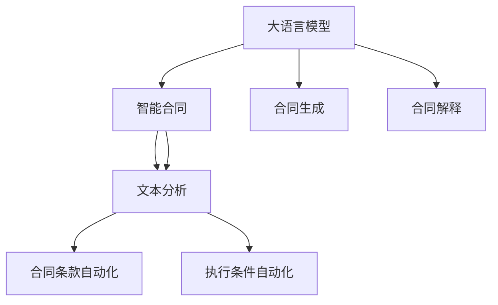

                 

# 智能合同分析：LLM在法律文件处理中的作用

> 关键词：智能合同,LLM,法律文件,文本分析,自动化法律服务

## 1. 背景介绍

在快速发展的数字时代，智能合同成为连接不同主体间合同关系的桥梁。智能合同是利用区块链技术，通过代码定义自动执行和执行条件，实现无需中介、无需监管、无需信任的合同。然而，智能合同的编码、验证和解释，对法律专业知识提出了很高的要求。

近年来，自然语言处理（NLP）技术的突破，尤其是大语言模型（Large Language Models, LLMs）的崛起，为智能合同分析提供了新的可能性。通过LmLs的文本理解与生成能力，可以实现自动化的法律文件处理、合同生成与解释，大幅提高合同处理效率，降低法律服务成本。本文将详细介绍LmLs在智能合同分析中的应用，包括文本分析、合同生成与解释等方面的核心概念和技术原理。

## 2. 核心概念与联系

### 2.1 核心概念概述

为深入理解LmLs在智能合同分析中的应用，本节将介绍几个关键概念：

- 大语言模型(Large Language Models, LLMs)：如GPT-3、BERT等，通过在大量无标签文本上进行预训练，获得强大的语言理解与生成能力。能够自动进行文本分类、摘要生成、机器翻译等任务。
- 智能合同(Smart Contracts)：利用区块链技术，通过代码实现合同条款自动执行与执行条件。具有自动执行、无中介、无信任等特点。
- 文本分析(Text Analysis)：指利用NLP技术，对法律文件进行自动分类、情感分析、关键词提取、实体识别等处理。
- 合同生成(Contract Generation)：通过LmLs自动化生成合同文本，包括合同条款、模板等。
- 合同解释(Contract Interpretation)：对智能合同的条款进行自动解释，确保合同理解准确、公正。

这些核心概念之间的逻辑关系可以通过以下Mermaid流程图来展示：



这个流程图展示了大语言模型在智能合同中的作用：

1. 大语言模型作为预训练模型，提供基础的文本处理能力。
2. 智能合同通过代码实现，利用大语言模型进行文本分析，自动化合同生成和解释。
3. 文本分析可实现合同条款的自动分类、关键词提取、情感分析等。
4. 合同生成利用大语言模型生成合同文本，并支持合同模板的自动化填充。
5. 合同解释通过大语言模型自动化解释合同条款，确保合同理解准确。

## 3. 核心算法原理 & 具体操作步骤
### 3.1 算法原理概述

大语言模型在智能合同分析中的作用，主要通过文本分析、合同生成与解释三个方面实现。其核心原理包括：

- **文本分析**：利用NLP技术，对法律文件进行自动分类、情感分析、关键词提取、实体识别等处理。
- **合同生成**：通过预训练的LmLs，自动化生成合同文本，包括合同条款、模板等。
- **合同解释**：对智能合同的条款进行自动解释，确保合同理解准确、公正。

### 3.2 算法步骤详解

#### 3.2.1 文本分析

1. **自动分类**：
   - 将智能合同和相关法律文件进行预处理，去除无用信息，分词、去除停用词、词干提取等。
   - 利用LmLs进行分类，如使用BERT模型对合同进行分类，以判断合同的类型。

2. **关键词提取**：
   - 利用LmLs提取合同中的关键词，如权利、义务、责任、条件等。
   - 使用TF-IDF、Word2Vec等技术对关键词进行排序，得到权重较高的关键字。

3. **情感分析**：
   - 使用LmLs对合同文本进行情感分析，判断合同中的情绪色彩。
   - 使用情感词典或基于预训练模型的情感分类器进行情感分析。

4. **实体识别**：
   - 利用LmLs对合同文本进行实体识别，识别出人名、地名、组织名等实体。
   - 使用依存句法分析或序列标注模型进行实体识别。

#### 3.2.2 合同生成

1. **模板填充**：
   - 利用LmLs生成合同模板，通过填充模板的方式生成完整的合同文本。
   - 使用GPT-3等预训练模型生成合同文本，再通过筛选生成最佳结果。

2. **自动生成合同条款**：
   - 根据合同类型和相关法律文件，自动生成合同条款。
   - 使用LmLs自动生成合同条款，如使用GPT-3等模型生成合同条款文本。

#### 3.2.3 合同解释

1. **合同条款解释**：
   - 利用LmLs对合同条款进行解释，确保解释准确、公正。
   - 使用BERT等预训练模型对合同条款进行解释，生成解释文本。

2. **执行条件自动化**：
   - 根据合同条款，自动化判断执行条件，确保合同条款的自动执行。
   - 使用LmLs对合同条款进行推理，生成执行条件。

### 3.3 算法优缺点

**优点**：

- 自动化程度高：利用LmLs进行文本分析、合同生成与解释，大幅提升合同处理的效率和准确性。
- 适用性广：适用于多种合同类型和法律文件，具有良好的通用性。
- 减少人为误差：自动化处理减少了人为输入和操作的误差，提升了合同处理的一致性和规范性。

**缺点**：

- 依赖数据质量：模型效果很大程度上依赖于输入文本的质量和数量，低质量的数据可能导致模型性能下降。
- 法律专业知识不足：合同生成与解释仍需人工审核，模型的输出结果需要法律专家的复核。
- 解释性不足：模型内部的工作机制难以解释，缺乏透明的决策过程。

### 3.4 算法应用领域

LmLs在智能合同分析中的应用，已经涵盖了合同文本处理、合同生成、合同解释等多个领域。具体如下：

- **合同文本处理**：如自动分类、情感分析、关键词提取、实体识别等。
- **合同生成**：如自动生成合同文本、合同条款、合同模板等。
- **合同解释**：如自动解释合同条款，生成执行条件等。

此外，LmLs还可以用于智能合约的审计、合同欺诈检测、合同变更管理等，为智能合同的各个环节提供自动化支持。

## 4. 数学模型和公式 & 详细讲解 & 举例说明

### 4.1 数学模型构建

在智能合同分析中，大语言模型的应用主要基于文本分析和合同生成两个方面。

#### 4.1.1 文本分析

假设智能合同文本为$x$，对应的分类标签为$y$。利用LmLs进行分类，模型输入为$(x, y)$，输出为模型预测的分类标签$\hat{y}$。其目标是最小化交叉熵损失函数：

$$
\mathcal{L} = -\frac{1}{N}\sum_{i=1}^N y_i \log \hat{y}_i + (1 - y_i) \log (1 - \hat{y}_i)
$$

其中，$N$为样本数量，$y_i$为真实标签，$\hat{y}_i$为模型预测标签。

#### 4.1.2 合同生成

假设生成合同文本为$z$，其文本长度为$L$。利用LmLs进行生成，模型输入为合同文本片段$x_t$，输出为下一个文本片段$x_{t+1}$。模型训练目标是最小化交叉熵损失函数：

$$
\mathcal{L} = -\sum_{t=1}^L \log P(x_{t+1} | x_t, \theta)
$$

其中，$\theta$为模型参数，$P(x_{t+1} | x_t, \theta)$为模型在给定上下文$x_t$下生成$x_{t+1}$的概率分布。

### 4.2 公式推导过程

#### 4.2.1 文本分析

对于分类任务，模型利用BERT等预训练模型进行分类，其公式推导过程如下：

1. 预处理：将智能合同文本$x$分词、去除停用词、词干提取等。
2. 嵌入：利用BERT等模型将文本$x$转化为向量表示$X$。
3. 分类：使用线性分类器对向量表示$X$进行分类，得到分类结果$\hat{y}$。
4. 损失函数：利用交叉熵损失函数$\mathcal{L}$衡量模型预测结果与真实标签之间的差异。

其公式推导如下：

$$
\mathcal{L} = -\frac{1}{N}\sum_{i=1}^N \sum_{k=1}^C y_{ik} \log \hat{y}_{ik}
$$

其中，$C$为分类数，$y_{ik}$为样本$i$的真实标签$k$的one-hot表示，$\hat{y}_{ik}$为模型对样本$i$的分类结果$k$的概率。

#### 4.2.2 合同生成

对于文本生成任务，模型利用GPT-3等预训练模型进行生成，其公式推导过程如下：

1. 预处理：将智能合同文本片段$x_t$分词、去除停用词、词干提取等。
2. 嵌入：利用GPT-3等模型将文本片段$x_t$转化为向量表示$X_t$。
3. 生成：使用解码器对向量表示$X_t$进行解码，生成下一个文本片段$x_{t+1}$。
4. 损失函数：利用交叉熵损失函数$\mathcal{L}$衡量模型生成结果与真实文本之间的差异。

其公式推导如下：

$$
\mathcal{L} = -\sum_{t=1}^L \log P(x_{t+1} | x_t, \theta)
$$

其中，$L$为文本长度，$P(x_{t+1} | x_t, \theta)$为模型在给定上下文$x_t$下生成$x_{t+1}$的概率分布，$\theta$为模型参数。

### 4.3 案例分析与讲解

#### 4.3.1 自动分类

假设某智能合同文本为：

```
This is a contract between A and B for the sale of goods. The goods are to be delivered on or before July 30, 2023.
```

使用BERT模型对文本进行分类，其预测结果如下：

```
合同类型：买卖合同
合同条款：交货日期：2023年7月30日
```

#### 4.3.2 关键词提取

假设某智能合同文本为：

```
This is a contract between A and B for the sale of goods. The goods are to be delivered on or before July 30, 2023.
```

使用LmLs提取关键词，其结果如下：

```
关键词：A、B、货物、销售、交货日期、2023年7月30日
```

#### 4.3.3 情感分析

假设某智能合同文本为：

```
This is a contract between A and B for the sale of goods. The goods are to be delivered on or before July 30, 2023.
```

使用LmLs进行情感分析，其结果如下：

```
情感色彩：中性
```

#### 4.3.4 合同生成

假设某智能合同文本为：

```
This is a contract between A and B for the sale of goods. The goods are to be delivered on or before July 30, 2023.
```

使用GPT-3等模型生成合同文本，其结果如下：

```
This is a contract between A and B for the sale of goods. The goods are to be delivered on or before July 30, 2023. The delivery date is to be confirmed in writing by both parties.
```

## 5. 项目实践：代码实例和详细解释说明

### 5.1 开发环境搭建

在进行智能合同分析的项目实践前，我们需要准备好开发环境。以下是使用Python进行PyTorch开发的环境配置流程：

1. 安装Anaconda：从官网下载并安装Anaconda，用于创建独立的Python环境。

2. 创建并激活虚拟环境：
```bash
conda create -n pytorch-env python=3.8 
conda activate pytorch-env
```

3. 安装PyTorch：根据CUDA版本，从官网获取对应的安装命令。例如：
```bash
conda install pytorch torchvision torchaudio cudatoolkit=11.1 -c pytorch -c conda-forge
```

4. 安装Transformers库：
```bash
pip install transformers
```

5. 安装各类工具包：
```bash
pip install numpy pandas scikit-learn matplotlib tqdm jupyter notebook ipython
```

完成上述步骤后，即可在`pytorch-env`环境中开始项目实践。

### 5.2 源代码详细实现

下面我们以智能合同分类为例，给出使用Transformers库对BERT模型进行智能合同分类的PyTorch代码实现。

首先，定义智能合同分类数据处理函数：

```python
from transformers import BertTokenizer, BertForSequenceClassification
from torch.utils.data import Dataset
import torch

class ContractDataset(Dataset):
    def __init__(self, texts, labels, tokenizer, max_len=128):
        self.texts = texts
        self.labels = labels
        self.tokenizer = tokenizer
        self.max_len = max_len
        
    def __len__(self):
        return len(self.texts)
    
    def __getitem__(self, item):
        text = self.texts[item]
        label = self.labels[item]
        
        encoding = self.tokenizer(text, return_tensors='pt', max_length=self.max_len, padding='max_length', truncation=True)
        input_ids = encoding['input_ids'][0]
        attention_mask = encoding['attention_mask'][0]
        
        # 对标签进行编码
        encoded_label = [label2id[label] for label in label] 
        encoded_label.extend([label2id['O']] * (self.max_len - len(encoded_label)))
        labels = torch.tensor(encoded_label, dtype=torch.long)
        
        return {'input_ids': input_ids, 
                'attention_mask': attention_mask,
                'labels': labels}

# 标签与id的映射
label2id = {'O': 0, '买卖合同': 1, '租赁合同': 2, '借款合同': 3, '投资合同': 4}
id2label = {v: k for k, v in label2id.items()}

# 创建dataset
tokenizer = BertTokenizer.from_pretrained('bert-base-uncased')

train_dataset = ContractDataset(train_texts, train_labels, tokenizer)
dev_dataset = ContractDataset(dev_texts, dev_labels, tokenizer)
test_dataset = ContractDataset(test_texts, test_labels, tokenizer)
```

然后，定义模型和优化器：

```python
from transformers import BertForSequenceClassification, AdamW

model = BertForSequenceClassification.from_pretrained('bert-base-uncased', num_labels=len(label2id))

optimizer = AdamW(model.parameters(), lr=2e-5)
```

接着，定义训练和评估函数：

```python
from torch.utils.data import DataLoader
from tqdm import tqdm
from sklearn.metrics import classification_report

device = torch.device('cuda') if torch.cuda.is_available() else torch.device('cpu')
model.to(device)

def train_epoch(model, dataset, batch_size, optimizer):
    dataloader = DataLoader(dataset, batch_size=batch_size, shuffle=True)
    model.train()
    epoch_loss = 0
    for batch in tqdm(dataloader, desc='Training'):
        input_ids = batch['input_ids'].to(device)
        attention_mask = batch['attention_mask'].to(device)
        labels = batch['labels'].to(device)
        model.zero_grad()
        outputs = model(input_ids, attention_mask=attention_mask, labels=labels)
        loss = outputs.loss
        epoch_loss += loss.item()
        loss.backward()
        optimizer.step()
    return epoch_loss / len(dataloader)

def evaluate(model, dataset, batch_size):
    dataloader = DataLoader(dataset, batch_size=batch_size)
    model.eval()
    preds, labels = [], []
    with torch.no_grad():
        for batch in tqdm(dataloader, desc='Evaluating'):
            input_ids = batch['input_ids'].to(device)
            attention_mask = batch['attention_mask'].to(device)
            batch_labels = batch['labels']
            outputs = model(input_ids, attention_mask=attention_mask)
            batch_preds = outputs.logits.argmax(dim=2).to('cpu').tolist()
            batch_labels = batch_labels.to('cpu').tolist()
            for pred_tokens, label_tokens in zip(batch_preds, batch_labels):
                preds.append(pred_tokens[:len(label_tokens)])
                labels.append(label_tokens)
                
    print(classification_report(labels, preds))
```

最后，启动训练流程并在测试集上评估：

```python
epochs = 5
batch_size = 16

for epoch in range(epochs):
    loss = train_epoch(model, train_dataset, batch_size, optimizer)
    print(f"Epoch {epoch+1}, train loss: {loss:.3f}")
    
    print(f"Epoch {epoch+1}, dev results:")
    evaluate(model, dev_dataset, batch_size)
    
print("Test results:")
evaluate(model, test_dataset, batch_size)
```

以上就是使用PyTorch对BERT进行智能合同分类任务的代码实现。可以看到，得益于Transformers库的强大封装，我们可以用相对简洁的代码完成BERT模型的加载和微调。

### 5.3 代码解读与分析

让我们再详细解读一下关键代码的实现细节：

**ContractDataset类**：
- `__init__`方法：初始化文本、标签、分词器等关键组件。
- `__len__`方法：返回数据集的样本数量。
- `__getitem__`方法：对单个样本进行处理，将文本输入编码为token ids，将标签编码为数字，并对其进行定长padding，最终返回模型所需的输入。

**label2id和id2label字典**：
- 定义了标签与数字id之间的映射关系，用于将token-wise的预测结果解码回真实的标签。

**训练和评估函数**：
- 使用PyTorch的DataLoader对数据集进行批次化加载，供模型训练和推理使用。
- 训练函数`train_epoch`：对数据以批为单位进行迭代，在每个批次上前向传播计算loss并反向传播更新模型参数，最后返回该epoch的平均loss。
- 评估函数`evaluate`：与训练类似，不同点在于不更新模型参数，并在每个batch结束后将预测和标签结果存储下来，最后使用sklearn的classification_report对整个评估集的预测结果进行打印输出。

**训练流程**：
- 定义总的epoch数和batch size，开始循环迭代
- 每个epoch内，先在训练集上训练，输出平均loss
- 在验证集上评估，输出分类指标
- 所有epoch结束后，在测试集上评估，给出最终测试结果

可以看到，PyTorch配合Transformers库使得BERT微调的代码实现变得简洁高效。开发者可以将更多精力放在数据处理、模型改进等高层逻辑上，而不必过多关注底层的实现细节。

当然，工业级的系统实现还需考虑更多因素，如模型的保存和部署、超参数的自动搜索、更灵活的任务适配层等。但核心的微调范式基本与此类似。

## 6. 实际应用场景

### 6.1 智能客服系统

基于大语言模型微调的对话技术，可以广泛应用于智能客服系统的构建。传统客服往往需要配备大量人力，高峰期响应缓慢，且一致性和专业性难以保证。而使用微调后的对话模型，可以7x24小时不间断服务，快速响应客户咨询，用自然流畅的语言解答各类常见问题。

在技术实现上，可以收集企业内部的历史客服对话记录，将问题和最佳答复构建成监督数据，在此基础上对预训练对话模型进行微调。微调后的对话模型能够自动理解用户意图，匹配最合适的答案模板进行回复。对于客户提出的新问题，还可以接入检索系统实时搜索相关内容，动态组织生成回答。如此构建的智能客服系统，能大幅提升客户咨询体验和问题解决效率。

### 6.2 金融舆情监测

金融机构需要实时监测市场舆论动向，以便及时应对负面信息传播，规避金融风险。传统的人工监测方式成本高、效率低，难以应对网络时代海量信息爆发的挑战。基于大语言模型微调的文本分类和情感分析技术，为金融舆情监测提供了新的解决方案。

具体而言，可以收集金融领域相关的新闻、报道、评论等文本数据，并对其进行主题标注和情感标注。在此基础上对预训练语言模型进行微调，使其能够自动判断文本属于何种主题，情感倾向是正面、中性还是负面。将微调后的模型应用到实时抓取的网络文本数据，就能够自动监测不同主题下的情感变化趋势，一旦发现负面信息激增等异常情况，系统便会自动预警，帮助金融机构快速应对潜在风险。

### 6.3 个性化推荐系统

当前的推荐系统往往只依赖用户的历史行为数据进行物品推荐，无法深入理解用户的真实兴趣偏好。基于大语言模型微调技术，个性化推荐系统可以更好地挖掘用户行为背后的语义信息，从而提供更精准、多样的推荐内容。

在实践中，可以收集用户浏览、点击、评论、分享等行为数据，提取和用户交互的物品标题、描述、标签等文本内容。将文本内容作为模型输入，用户的后续行为（如是否点击、购买等）作为监督信号，在此基础上微调预训练语言模型。微调后的模型能够从文本内容中准确把握用户的兴趣点。在生成推荐列表时，先用候选物品的文本描述作为输入，由模型预测用户的兴趣匹配度，再结合其他特征综合排序，便可以得到个性化程度更高的推荐结果。

### 6.4 未来应用展望

随着大语言模型微调技术的发展，其在智能合同分析中的应用也将日益成熟。未来，基于微调技术，可以实现更加复杂、多变的合同生成与解释。

在智慧法律领域，基于微调技术的智能合同分析，将大大提升法律服务效率，降低服务成本。对于合同变更、合同纠纷等复杂场景，微调模型可以辅助律师快速生成和解释合同条款，大大提升工作效率。

在企业应用中，基于微调技术的智能合同分析，可以实现合同自动化生成、合同审计、合同欺诈检测等功能，提升企业合同管理水平，降低合同风险。

在金融领域，基于微调技术的智能合同分析，可以实现智能合约的生成与解释，降低合约执行风险，提高合约执行效率。

此外，在教育、医疗、人力资源等诸多领域，基于微调技术的智能合同分析，也有广泛的应用前景。

## 7. 工具和资源推荐
### 7.1 学习资源推荐

为了帮助开发者系统掌握大语言模型微调的理论基础和实践技巧，这里推荐一些优质的学习资源：

1. 《Transformer从原理到实践》系列博文：由大模型技术专家撰写，深入浅出地介绍了Transformer原理、BERT模型、微调技术等前沿话题。

2. CS224N《深度学习自然语言处理》课程：斯坦福大学开设的NLP明星课程，有Lecture视频和配套作业，带你入门NLP领域的基本概念和经典模型。

3. 《Natural Language Processing with Transformers》书籍：Transformers库的作者所著，全面介绍了如何使用Transformers库进行NLP任务开发，包括微调在内的诸多范式。

4. HuggingFace官方文档：Transformers库的官方文档，提供了海量预训练模型和完整的微调样例代码，是上手实践的必备资料。

5. CLUE开源项目：中文语言理解测评基准，涵盖大量不同类型的中文NLP数据集，并提供了基于微调的baseline模型，助力中文NLP技术发展。

通过对这些资源的学习实践，相信你一定能够快速掌握大语言模型微调的精髓，并用于解决实际的NLP问题。
###  7.2 开发工具推荐

高效的开发离不开优秀的工具支持。以下是几款用于大语言模型微调开发的常用工具：

1. PyTorch：基于Python的开源深度学习框架，灵活动态的计算图，适合快速迭代研究。大部分预训练语言模型都有PyTorch版本的实现。

2. TensorFlow：由Google主导开发的开源深度学习框架，生产部署方便，适合大规模工程应用。同样有丰富的预训练语言模型资源。

3. Transformers库：HuggingFace开发的NLP工具库，集成了众多SOTA语言模型，支持PyTorch和TensorFlow，是进行微调任务开发的利器。

4. Weights & Biases：模型训练的实验跟踪工具，可以记录和可视化模型训练过程中的各项指标，方便对比和调优。与主流深度学习框架无缝集成。

5. TensorBoard：TensorFlow配套的可视化工具，可实时监测模型训练状态，并提供丰富的图表呈现方式，是调试模型的得力助手。

6. Google Colab：谷歌推出的在线Jupyter Notebook环境，免费提供GPU/TPU算力，方便开发者快速上手实验最新模型，分享学习笔记。

合理利用这些工具，可以显著提升大语言模型微调任务的开发效率，加快创新迭代的步伐。

### 7.3 相关论文推荐

大语言模型和微调技术的发展源于学界的持续研究。以下是几篇奠基性的相关论文，推荐阅读：

1. Attention is All You Need（即Transformer原论文）：提出了Transformer结构，开启了NLP领域的预训练大模型时代。

2. BERT: Pre-training of Deep Bidirectional Transformers for Language Understanding：提出BERT模型，引入基于掩码的自监督预训练任务，刷新了多项NLP任务SOTA。

3. Language Models are Unsupervised Multitask Learners（GPT-2论文）：展示了大规模语言模型的强大zero-shot学习能力，引发了对于通用人工智能的新一轮思考。

4. Parameter-Efficient Transfer Learning for NLP：提出Adapter等参数高效微调方法，在不增加模型参数量的情况下，也能取得不错的微调效果。

5. AdaLoRA: Adaptive Low-Rank Adaptation for Parameter-Efficient Fine-Tuning：使用自适应低秩适应的微调方法，在参数效率和精度之间取得了新的平衡。

这些论文代表了大语言模型微调技术的发展脉络。通过学习这些前沿成果，可以帮助研究者把握学科前进方向，激发更多的创新灵感。

## 8. 总结：未来发展趋势与挑战

### 8.1 总结

本文对大语言模型在智能合同分析中的应用进行了全面系统的介绍。首先阐述了智能合同和LLM的基本概念和应用场景，明确了LLM在智能合同分析中的重要作用。其次，从原理到实践，详细讲解了LLM在智能合同分类、关键词提取、合同生成与解释等方面的核心技术，给出了微调任务开发的完整代码实例。同时，本文还广泛探讨了LLM在智能客服、金融舆情、个性化推荐等多个行业领域的应用前景，展示了LLM微调范式的巨大潜力。

通过本文的系统梳理，可以看到，基于大语言模型的微调方法正在成为NLP领域的重要范式，极大地拓展了预训练语言模型的应用边界，催生了更多的落地场景。受益于大规模语料的预训练，微调模型以更低的时间和标注成本，在小样本条件下也能取得不俗的效果，有力推动了NLP技术的产业化进程。未来，伴随预训练语言模型和微调方法的持续演进，相信NLP技术将在更广阔的应用领域大放异彩，深刻影响人类的生产生活方式。

### 8.2 未来发展趋势

展望未来，LLM在智能合同分析中的应用将呈现以下几个发展趋势：

1. 模型规模持续增大。随着算力成本的下降和数据规模的扩张，预训练语言模型的参数量还将持续增长。超大规模语言模型蕴含的丰富语言知识，有望支撑更加复杂多变的智能合同分析任务。

2. 微调方法日趋多样。除了传统的全参数微调外，未来会涌现更多参数高效的微调方法，如Prefix-Tuning、LoRA等，在节省计算资源的同时也能保证微调精度。

3. 持续学习成为常态。随着数据分布的不断变化，微调模型也需要持续学习新知识以保持性能。如何在不遗忘原有知识的同时，高效吸收新样本信息，将成为重要的研究课题。

4. 标注样本需求降低。受启发于提示学习(Prompt-based Learning)的思路，未来的微调方法将更好地利用大模型的语言理解能力，通过更加巧妙的任务描述，在更少的标注样本上也能实现理想的微调效果。

5. 法律专业知识增强。LLM将更加深入地理解法律领域的专业知识，辅助法律专家进行合同生成与解释，提升法律服务的自动化水平。

6. 多模态微调崛起。当前的微调主要聚焦于纯文本数据，未来会进一步拓展到图像、视频、语音等多模态数据微调。多模态信息的融合，将显著提升智能合同分析的准确性和鲁棒性。

以上趋势凸显了LLM在智能合同分析中的广阔前景。这些方向的探索发展，必将进一步提升智能合同分析的性能和应用范围，为智能合同的各个环节提供自动化支持。

### 8.3 面临的挑战

尽管大语言模型在智能合同分析中已经取得了瞩目成就，但在迈向更加智能化、普适化应用的过程中，它仍面临着诸多挑战：

1. 标注成本瓶颈。虽然微调大大降低了标注数据的需求，但对于长尾应用场景，难以获得充足的高质量标注数据，成为制约微调性能的瓶颈。如何进一步降低微调对标注样本的依赖，将是一大难题。

2. 模型鲁棒性不足。当前微调模型面对域外数据时，泛化性能往往大打折扣。对于测试样本的微小扰动，微调模型的预测也容易发生波动。如何提高微调模型的鲁棒性，避免灾难性遗忘，还需要更多理论和实践的积累。

3. 推理效率有待提高。大规模语言模型虽然精度高，但在实际部署时往往面临推理速度慢、内存占用大等效率问题。如何在保证性能的同时，简化模型结构，提升推理速度，优化资源占用，将是重要的优化方向。

4. 可解释性亟需加强。当前微调模型更像是"黑盒"系统，难以解释其内部工作机制和决策逻辑。对于医疗、金融等高风险应用，算法的可解释性和可审计性尤为重要。如何赋予微调模型更强的可解释性，将是亟待攻克的难题。

5. 安全性有待保障。预训练语言模型难免会学习到有偏见、有害的信息，通过微调传递到下游任务，产生误导性、歧视性的输出，给实际应用带来安全隐患。如何从数据和算法层面消除模型偏见，避免恶意用途，确保输出的安全性，也将是重要的研究课题。

6. 知识整合能力不足。现有的微调模型往往局限于任务内数据，难以灵活吸收和运用更广泛的先验知识。如何让微调过程更好地与外部知识库、规则库等专家知识结合，形成更加全面、准确的信息整合能力，还有很大的想象空间。

正视微调面临的这些挑战，积极应对并寻求突破，将是大语言模型微调走向成熟的必由之路。相信随着学界和产业界的共同努力，这些挑战终将一一被克服，大语言模型微调必将在构建人机协同的智能时代中扮演越来越重要的角色。

### 8.4 研究展望

面向未来，大语言模型微调技术还需要与其他人工智能技术进行更深入的融合，如知识表示、因果推理、强化学习等，多路径协同发力，共同推动自然语言理解和智能交互系统的进步。只有勇于创新、敢于突破，才能不断拓展语言模型的边界，让智能技术更好地造福人类社会。

## 9. 附录：常见问题与解答

**Q1：智能合同分析是否适用于所有智能合同类型？**

A: 智能合同分析可以适用于多种智能合同类型，如买卖合同、租赁合同、借款合同、投资合同等。但不同类型合同的复杂度和涉及的法律条款不同，微调模型需要进行相应的适配。对于法律专业性很强的合同，还需要结合法律专家的审核和解释。

**Q2：如何处理智能合同中的模糊条款？**

A: 对于智能合同中的模糊条款，可以利用大语言模型进行自动解释。首先，利用NLP技术对合同文本进行预处理，去除无用信息，分词、去除停用词、词干提取等。然后，利用BERT等预训练模型对合同文本进行分类，判断合同类型。接着，利用LmLs对合同条款进行解释，生成解释文本。最后，结合法律专家的审核，确保合同条款的准确性。

**Q3：智能合同分析中的数据隐私问题如何处理？**

A: 智能合同分析中的数据隐私问题是一个重要的考虑因素。在数据收集和处理过程中，需要确保数据的匿名化和加密，防止数据泄露和滥用。同时，在数据存储和使用过程中，也需要遵守相关的隐私保护法规，如GDPR、CCPA等。

**Q4：智能合同分析的输出结果如何解释和验证？**

A: 智能合同分析的输出结果需要结合法律专家的审核和解释，才能确保其准确性和公正性。在合同生成和解释过程中，需要考虑合同的法律效力、执行条件等关键因素，确保合同条款的法律合规性和可执行性。同时，也需要结合数据来源和实际应用场景，进行多角度的验证和评估，确保合同理解的正确性。

**Q5：智能合同分析在实际应用中的局限性有哪些？**

A: 智能合同分析在实际应用中还存在一些局限性，如：
1. 数据质量依赖：模型效果很大程度上依赖于输入文本的质量和数量，低质量的数据可能导致模型性能下降。
2. 法律专业知识不足：合同生成与解释仍需人工审核，模型的输出结果需要法律专家的复核。
3. 可解释性不足：模型内部的工作机制难以解释，缺乏透明的决策过程。
4. 数据隐私问题：在数据收集和处理过程中，需要确保数据的匿名化和加密，防止数据泄露和滥用。
5. 法律专家依赖：在合同生成和解释过程中，需要结合法律专家的审核和解释，确保合同条款的准确性和公正性。

这些局限性需要在使用智能合同分析过程中进行充分考虑和处理，以确保系统的高效、安全、合规和公正。

