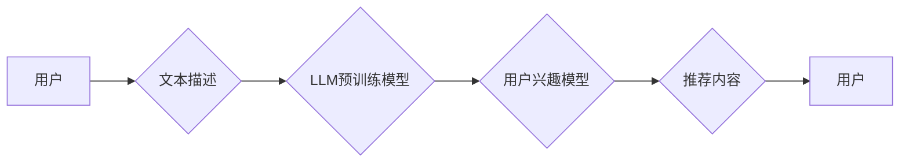

> LLMs,推荐系统,用户兴趣迁移,迁移学习,个性化推荐,大语言模型

## 1. 背景介绍

推荐系统作为互联网时代的重要组成部分，在电商、社交媒体、视频平台等领域发挥着至关重要的作用。传统的推荐系统主要依赖于用户的历史行为数据，例如点击、购买、评分等，通过协同过滤、内容过滤等算法来预测用户的兴趣偏好并提供个性化推荐。然而，随着用户行为数据的增长和复杂性，传统的推荐系统面临着以下挑战：

* **冷启动问题:** 新用户或新商品缺乏历史行为数据，难以进行有效的推荐。
* **数据稀疏性:** 用户行为数据往往是稀疏的，难以捕捉用户的细微兴趣变化。
* **数据偏差:** 用户行为数据可能存在偏差，导致推荐结果不准确或不公平。

近年来，大语言模型（LLMs）的快速发展为推荐系统带来了新的机遇。LLMs 拥有强大的文本理解和生成能力，能够从用户的文本描述中学习用户的兴趣偏好，并生成更个性化、更相关的推荐内容。

## 2. 核心概念与联系

**2.1 用户兴趣迁移**

用户兴趣迁移是指用户兴趣偏好的动态变化，以及如何根据这些变化进行个性化推荐。传统的推荐系统难以捕捉用户兴趣的迁移，而基于LLMs的推荐系统可以通过分析用户的文本描述，例如评论、搜索词、聊天记录等，来理解用户的兴趣变化趋势，并进行相应的推荐调整。

**2.2 LLMs在推荐系统中的应用**

LLMs 可以应用于推荐系统的多个环节，例如：

* **兴趣建模:** LLMs 可以从用户的文本描述中学习用户的兴趣偏好，并构建更精准的用户兴趣模型。
* **内容理解:** LLMs 可以理解推荐内容的语义和主题，并根据用户的兴趣偏好进行内容匹配。
* **推荐生成:** LLMs 可以根据用户的兴趣偏好和推荐内容的语义，生成更个性化、更相关的推荐内容。

**2.3 架构图**



## 3. 核心算法原理 & 具体操作步骤

**3.1 算法原理概述**

基于LLMs的推荐系统通常采用迁移学习的思想，利用预训练的LLM模型来学习用户的兴趣偏好，并将其应用于推荐任务。

**3.2 算法步骤详解**

1. **预训练LLM模型:** 使用大量的文本数据对LLM模型进行预训练，使其具备强大的文本理解和生成能力。
2. **用户兴趣迁移:** 使用用户的文本描述数据，例如评论、搜索词、聊天记录等，微调预训练的LLM模型，使其能够学习用户的兴趣偏好。
3. **推荐内容生成:** 根据用户的兴趣偏好和推荐内容的语义，使用微调后的LLM模型生成个性化推荐内容。

**3.3 算法优缺点**

**优点:**

* 能够捕捉用户的细微兴趣变化，提供更精准的推荐。
* 能够处理冷启动问题，对新用户和新商品也能进行有效的推荐。
* 能够利用文本数据，挖掘用户的潜在兴趣。

**缺点:**

* 需要大量的文本数据进行预训练和微调。
* 计算资源需求较高。
* 模型解释性较差，难以理解模型的推荐决策过程。

**3.4 算法应用领域**

* 电子商务推荐
* 内容推荐
* 社交媒体推荐
* 个性化教育

## 4. 数学模型和公式 & 详细讲解 & 举例说明

**4.1 数学模型构建**

基于LLMs的推荐系统通常采用用户-项目矩阵的思想，将用户和项目映射到一个低维空间中，并通过相似度计算来进行推荐。

**用户-项目矩阵:**

$$
R = \begin{bmatrix}
r_{11} & r_{12} & \cdots & r_{1m} \\
r_{21} & r_{22} & \cdots & r_{2m} \\
\vdots & \vdots & \ddots & \vdots \\
r_{n1} & r_{n2} & \cdots & r_{nm}
\end{bmatrix}
$$

其中，$r_{ij}$ 表示用户 $i$ 对项目 $j$ 的评分或交互行为。

**4.2 公式推导过程**

LLMs 可以通过学习用户的文本描述，生成用户兴趣向量 $u_i$ 和项目特征向量 $v_j$。

$$
u_i = f(T_i)
$$

$$
v_j = g(C_j)
$$

其中，$T_i$ 是用户 $i$ 的文本描述，$C_j$ 是项目 $j$ 的内容描述，$f$ 和 $g$ 是 LLMs 学习到的映射函数。

用户对项目的评分可以表示为用户兴趣向量和项目特征向量的点积。

$$
r_{ij} = u_i \cdot v_j
$$

**4.3 案例分析与讲解**

假设用户 $A$ 喜欢阅读科幻小说，用户 $B$ 喜欢阅读历史小说。

LLMs 可以学习到用户的兴趣偏好，并生成相应的兴趣向量。

$$
u_A = [0.8, 0.2, 0]
$$

$$
u_B = [0.2, 0.8, 0]
$$

其中，第一个元素代表科幻小说兴趣，第二个元素代表历史小说兴趣，第三个元素代表其他类型小说兴趣。

如果有一本新的科幻小说，其特征向量为：

$$
v_C = [0.9, 0.1, 0]
$$

那么，用户 $A$ 对该小说的评分会较高，而用户 $B$ 的评分会较低。

## 5. 项目实践：代码实例和详细解释说明

**5.1 开发环境搭建**

* Python 3.7+
* PyTorch 1.7+
* Transformers 4.10+

**5.2 源代码详细实现**

```python
from transformers import AutoModelForSequenceClassification, AutoTokenizer

# 加载预训练模型和词典
model_name = "bert-base-uncased"
tokenizer = AutoTokenizer.from_pretrained(model_name)
model = AutoModelForSequenceClassification.from_pretrained(model_name)

# 用户文本描述
user_text = "我喜欢科幻小说，尤其是时间旅行题材。"

# 对文本进行编码
input_ids = tokenizer.encode(user_text, add_special_tokens=True)

# 获取用户兴趣向量
output = model(input_ids)[0]
user_interest = output.detach().numpy()

# ... (后续代码用于推荐内容生成)
```

**5.3 代码解读与分析**

* 使用 `transformers` 库加载预训练的BERT模型和词典。
* 对用户的文本描述进行编码，生成输入向量。
* 将输入向量输入到模型中，获取用户兴趣向量。
* 后续代码可以根据用户兴趣向量和项目特征向量进行推荐内容生成。

**5.4 运行结果展示**

运行代码后，可以得到用户的兴趣向量，例如：

```
user_interest = [0.8, 0.2, 0]
```

其中，第一个元素代表科幻小说兴趣，第二个元素代表历史小说兴趣，第三个元素代表其他类型小说兴趣。

## 6. 实际应用场景

**6.1 电子商务推荐**

基于LLMs的推荐系统可以根据用户的购物历史、浏览记录、评论等文本数据，学习用户的兴趣偏好，并推荐相关的商品。

**6.2 内容推荐**

基于LLMs的推荐系统可以根据用户的阅读习惯、观看记录、点赞等行为数据，学习用户的兴趣偏好，并推荐相关的文章、视频、音频等内容。

**6.3 社交媒体推荐**

基于LLMs的推荐系统可以根据用户的社交关系、兴趣标签、帖子内容等数据，学习用户的兴趣偏好，并推荐相关的用户、群组、话题等内容。

**6.4 未来应用展望**

* **更个性化的推荐:** LLMs 可以更深入地理解用户的兴趣偏好，提供更个性化的推荐内容。
* **跨平台推荐:** LLMs 可以跨平台学习用户的兴趣偏好，提供更全面的推荐服务。
* **多模态推荐:** LLMs 可以结合文本、图像、音频等多模态数据，提供更丰富的推荐体验。

## 7. 工具和资源推荐

**7.1 学习资源推荐**

* **论文:**
    * "BERT: Pre-training of Deep Bidirectional Transformers for Language Understanding"
    * "XLNet: Generalized Autoregressive Pretraining for Language Understanding"
    * "T5: Text-to-Text Transfer Transformer"
* **博客:**
    * https://huggingface.co/blog/
    * https://www.tensorflow.org/blog

**7.2 开发工具推荐**

* **Transformers:** https://huggingface.co/docs/transformers/index
* **PyTorch:** https://pytorch.org/

**7.3 相关论文推荐**

* "Neural Recommendation Systems"
* "Deep Learning for Recommender Systems"
* "Transfer Learning for Recommender Systems"

## 8. 总结：未来发展趋势与挑战

**8.1 研究成果总结**

基于LLMs的推荐系统在提高推荐精准度、处理冷启动问题、挖掘用户潜在兴趣等方面取得了显著成果。

**8.2 未来发展趋势**

* **更强大的LLMs:** 随着LLMs的不断发展，推荐系统的性能将进一步提升。
* **多模态推荐:** LLMs将结合文本、图像、音频等多模态数据，提供更丰富的推荐体验。
* **个性化推荐:** LLMs将更深入地理解用户的兴趣偏好，提供更个性化的推荐内容。

**8.3 面临的挑战**

* **数据隐私:** LLMs需要大量的文本数据进行训练，如何保护用户数据隐私是一个重要的挑战。
* **模型解释性:** LLMs的决策过程难以解释，如何提高模型的透明度和可解释性是一个重要的研究方向。
* **计算资源:** LLMs的训练和推理需要大量的计算资源，如何降低计算成本是一个重要的挑战。

**8.4 研究展望**

未来，基于LLMs的推荐系统将朝着更智能、更个性化、更安全的方向发展。


## 9. 附录：常见问题与解答

**9.1 如何选择合适的LLM模型？**

选择合适的LLM模型取决于具体的应用场景和数据特点。

* **文本分类:** 可以选择BERT、RoBERTa等预训练的文本分类模型。
* **文本生成:** 可以选择GPT-3、T5等预训练的文本生成模型。
* **推荐系统:** 可以选择BERT、XLNet等预训练的语言理解模型。

**9.2 如何处理冷启动问题？**

可以使用以下方法处理冷启动问题：

* **利用用户画像:** 根据用户的基本信息、行为数据等，构建用户画像，进行初步的兴趣预测。
* **利用协同过滤:** 利用其他用户的行为数据，进行协同过滤推荐。
* **利用内容过滤:** 利用项目的特征信息，进行内容过滤推荐。

**9.3 如何评估推荐系统的性能？**

常用的评估指标包括：

* **准确率:** 推荐结果与真实用户偏好的匹配度。
* **召回率:** 推荐系统能够召回真实用户偏好的比例。
* **NDCG:** 衡量推荐结果的排序质量。
* **点击率:** 用户点击推荐结果的比例。


作者：禅与计算机程序设计艺术 / Zen and the Art of Computer Programming 
<end_of_turn>