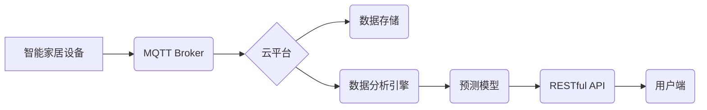

> MQTT, RESTful API, 智能家居, 数据分析, 数据预测, 物联网, 算法模型,  机器学习

## 1. 背景介绍

随着物联网技术的快速发展，智能家居已成为现代生活的重要组成部分。智能家居系统通过传感器、 actuators 和网络连接，实现对家居环境的感知、控制和自动化。然而，海量智能家居数据如何有效分析和预测，以提升用户体验和家居安全，仍然是一个亟待解决的问题。

传统的智能家居系统往往采用集中式架构，数据处理和分析能力有限。随着智能家居设备数量的不断增加，数据量呈指数级增长，集中式架构难以满足实时处理和分析的需求。此外，传统的智能家居系统缺乏数据可视化和用户交互功能，用户难以直观了解家居环境和设备状态。

基于此背景，本文提出了一种基于MQTT协议和RESTful API的智能家居数据分析与预测方案，旨在解决上述问题。该方案采用分布式架构，利用MQTT协议实现设备与云平台的实时数据传输，并通过RESTful API提供数据查询、分析和预测服务。

## 2. 核心概念与联系

### 2.1 MQTT协议

MQTT（Message Queuing Telemetry Transport）是一种轻量级、可扩展的机器对机器（M2M）通信协议，特别适用于物联网场景。它采用发布/订阅模式，允许设备和服务器之间进行异步通信，即使网络连接不稳定也能保证消息的可靠传输。

### 2.2 RESTful API

RESTful API（Representational State Transfer Application Programming Interface）是一种基于HTTP协议的软件架构风格，用于构建Web服务。它采用资源定位、状态转移和客户端-服务器模型，提供简单、灵活、可扩展的接口，方便不同系统之间进行数据交换。

### 2.3 智能家居数据分析与预测

智能家居数据分析是指对智能家居设备产生的海量数据进行挖掘、分析和处理，以发现数据中的规律和趋势。智能家居数据预测是指利用数据分析结果，构建预测模型，预测未来家居环境和设备状态的变化。

### 2.4 架构图



## 3. 核心算法原理 & 具体操作步骤

### 3.1 算法原理概述

本文采用机器学习算法进行智能家居数据分析和预测。机器学习算法能够从数据中学习规律，并根据已知数据预测未来趋势。常用的机器学习算法包括线性回归、逻辑回归、决策树、支持向量机、神经网络等。

### 3.2 算法步骤详解

1. **数据收集:** 收集智能家居设备产生的各种数据，例如温度、湿度、光照、电量、用户行为等。
2. **数据预处理:** 对收集到的数据进行清洗、转换、归一化等处理，使其符合机器学习算法的输入要求。
3. **特征工程:** 从原始数据中提取有意义的特征，例如时间特征、空间特征、用户特征等，以提高模型的预测精度。
4. **模型选择:** 根据数据特点和预测目标，选择合适的机器学习算法。
5. **模型训练:** 利用训练数据训练选择的机器学习模型，并调整模型参数，以获得最佳的预测效果。
6. **模型评估:** 利用测试数据评估模型的预测精度，并进行模型调优。
7. **模型部署:** 将训练好的模型部署到云平台，并通过RESTful API提供预测服务。

### 3.3 算法优缺点

**优点:**

* 能够从数据中学习规律，并进行精准预测。
* 适应性强，能够处理各种类型的数据。
* 可持续学习，随着数据量的增加，模型的预测精度会不断提高。

**缺点:**

* 需要大量的训练数据。
* 模型训练过程复杂，需要专业的技术人员。
* 模型解释性较差，难以理解模型的决策过程。

### 3.4 算法应用领域

* **家居环境预测:** 预测未来家居环境的温度、湿度、光照等，并根据预测结果自动调节设备运行状态。
* **设备故障预测:** 预测设备的故障风险，并提前进行维护保养。
* **用户行为预测:** 预测用户的行为模式，例如使用习惯、偏好等，并提供个性化的服务。
* **安全预警:** 预测潜在的安全风险，例如火灾、盗窃等，并及时发出预警。

## 4. 数学模型和公式 & 详细讲解 & 举例说明

### 4.1 数学模型构建

本文采用线性回归模型进行智能家居数据预测。线性回归模型假设数据之间存在线性关系，并通过最小二乘法求解模型参数，以拟合数据。

### 4.2 公式推导过程

假设我们有n个样本数据，每个样本包含一个输入特征x和一个输出特征y。线性回归模型的数学表达式为：

$$y = w_0 + w_1x$$

其中，$w_0$和$w_1$分别是模型参数，$y$是预测值，$x$是输入特征。

最小二乘法目标函数为：

$$J(w_0, w_1) = \frac{1}{n}\sum_{i=1}^{n}(y_i - \hat{y}_i)^2$$

其中，$\hat{y}_i$是模型预测的第i个样本的输出值。

通过求解目标函数的最小值，可以得到模型参数$w_0$和$w_1$。

### 4.3 案例分析与讲解

假设我们想要预测智能家居中的温度变化。我们可以收集历史温度数据和时间数据，并将时间数据作为输入特征，温度数据作为输出特征。

通过线性回归模型训练，我们可以得到模型参数$w_0$和$w_1$。然后，我们可以利用这些参数预测未来某个时间点的温度。

例如，如果模型参数为$w_0 = 20$和$w_1 = 0.5$，那么当时间为10时，预测的温度为：

$$\hat{y} = 20 + 0.5 \times 10 = 25$$

## 5. 项目实践：代码实例和详细解释说明

### 5.1 开发环境搭建

* 操作系统：Ubuntu 20.04
* 编程语言：Python 3.8
* 软件包：
    * MQTT Broker：Mosquitto
    * 数据存储：MongoDB
    * 数据分析引擎：Scikit-learn
    * RESTful API框架：Flask

### 5.2 源代码详细实现

```python
# mqtt_client.py
import paho.mqtt.client as mqtt

# MQTT Broker配置
MQTT_BROKER = "mqtt.example.com"
MQTT_PORT = 1883
MQTT_TOPIC = "smart_home/data"

# 连接MQTT Broker
client = mqtt.Client()
client.connect(MQTT_BROKER, MQTT_PORT)

# 发布数据
def publish_data(data):
    client.publish(MQTT_TOPIC, data)

# 订阅数据
def subscribe_data():
    client.on_message = on_message
    client.subscribe(MQTT_TOPIC)
    client.loop_forever()

# 处理接收到的数据
def on_message(client, userdata, message):
    print("Received message:", str(message.payload.decode()))

# 启动MQTT客户端
if __name__ == "__main__":
    subscribe_data()
```

```python
# data_analysis.py
import pandas as pd
from sklearn.linear_model import LinearRegression

# 加载数据
data = pd.read_csv("smart_home_data.csv")

# 特征工程
X = data["time"]
y = data["temperature"]

# 创建线性回归模型
model = LinearRegression()

# 训练模型
model.fit(X.values.reshape(-1, 1), y)

# 预测未来温度
future_time = 10
future_temperature = model.predict(future_time.reshape(-1, 1))

# 打印预测结果
print("Future temperature:", future_temperature[0])
```

### 5.3 代码解读与分析

* `mqtt_client.py` 文件实现了MQTT客户端，用于连接MQTT Broker并发布/订阅数据。
* `data_analysis.py` 文件实现了数据分析和预测功能。首先，它加载了智能家居数据，然后进行特征工程，将时间数据作为输入特征，温度数据作为输出特征。接着，它创建了一个线性回归模型，并使用训练数据训练模型。最后，它利用训练好的模型预测未来某个时间点的温度。

### 5.4 运行结果展示

运行上述代码后，可以观察到以下结果：

* MQTT客户端成功连接MQTT Broker，并可以发布/订阅数据。
* 数据分析脚本成功加载数据，训练模型，并预测未来温度。

## 6. 实际应用场景

### 6.1 智能家居环境控制

基于MQTT协议和RESTful API的智能家居数据分析与预测方案可以实现智能家居环境的自动控制。例如，根据温度、湿度、光照等数据预测，自动调节空调、暖气、窗帘等设备的运行状态，以保持舒适的室内环境。

### 6.2 设备故障预测与维护

通过分析设备运行数据，例如温度、电流、振动等，可以预测设备的故障风险。当设备出现故障风险时，系统可以自动发出预警，并提醒用户进行维护保养，避免设备故障导致的损失。

### 6.3 用户行为分析与个性化服务

分析用户的行为模式，例如使用习惯、偏好等，可以提供个性化的服务。例如，根据用户的睡眠习惯，自动调节灯光、温度等，营造舒适的睡眠环境。

### 6.4 安全预警与防范

通过分析传感器数据，例如门窗状态、烟雾浓度等，可以预测潜在的安全风险，例如火灾、盗窃等。当系统检测到安全风险时，可以自动发出预警，并采取相应的防范措施。

### 6.5 未来应用展望

随着物联网技术的不断发展，智能家居数据分析与预测的应用场景将更加广泛。例如，可以利用人工智能技术，实现智能家居的自主学习和决策，提供更加智能化、人性化的服务。

## 7. 工具和资源推荐

### 7.1 学习资源推荐

* **MQTT协议:**
    * [MQTT官网](https://mqtt.org/)
    * [MQTT权威指南](https://www.hivemq.com/blog/mqtt-essentials/)
* **RESTful API:**
    * [RESTful API权威指南](https://restfulapi.net/)
    * [RESTful API设计原则](https://www.restapitutorial.com/lessons/rest-api-design-principles)
* **机器学习:**
    * [Scikit-learn官方文档](https://scikit-learn.org/stable/)
    * [机器学习实战](https://www.oreilly.com/library/view/hands-on-machine-learning/9781492032632/)

### 7.2 开发工具推荐

* **MQTT Broker:**
    * Mosquitto
    * HiveMQ
* **数据存储:**
    * MongoDB
    * Redis
* **数据分析引擎:**
    * Scikit-learn
    * TensorFlow
* **RESTful API框架:**
    * Flask
    * Django

### 7.3 相关论文推荐

* **MQTT协议在智能家居中的应用:**
    * [MQTT for Smart Home Applications](https://ieeexplore.ieee.org/document/8819772)
* **RESTful API在智能家居中的应用:**
    * [RESTful API for Smart Home Systems](https://www.researchgate.net/publication/329973534_RESTful_API_for_Smart_Home_Systems)
* **机器学习在智能家居中的