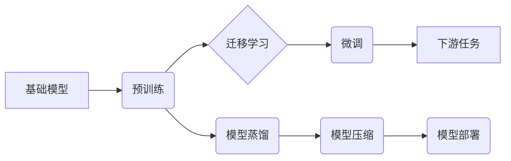

> 基础模型、大模型、深度学习、迁移学习、模型蒸馏、模型压缩、模型部署、AI生态系统

## 1. 背景介绍

近年来，深度学习技术取得了飞速发展，基础模型（Foundation Models）作为其重要组成部分，在人工智能领域掀起了新的浪潮。基础模型是指在海量数据上预训练的强大通用模型，能够在各种下游任务中表现出卓越的性能，并通过微调实现特定领域应用。

传统的深度学习模型通常针对特定任务进行训练，需要大量的标注数据和专门的模型架构设计。而基础模型则打破了这种局限性，通过预训练的方式学习到更广泛的知识和表示能力，从而能够适应多种任务，并降低对特定任务数据和模型设计的依赖。

基础模型的出现，标志着人工智能发展进入了一个新的阶段，它为构建更智能、更通用、更易于使用的AI系统提供了强大的基础。

## 2. 核心概念与联系

### 2.1 基础模型

基础模型是指在海量数据上进行预训练的强大通用模型，其核心特点包括：

* **通用性:** 基础模型能够在多种下游任务中表现出良好的性能，例如自然语言处理、计算机视觉、语音识别等。
* **可迁移性:** 基础模型可以被微调到特定领域或任务，并快速达到较高的性能。
* **规模化:** 基础模型通常具有庞大的参数量，能够学习到更复杂的知识和表示能力。

### 2.2 大模型

大模型是指参数量超过数十亿甚至千亿的深度学习模型。大模型通常是基础模型的代表，其规模化训练能够带来更强的学习能力和泛化能力。

### 2.3 迁移学习

迁移学习是指利用预训练模型在源任务上的知识，迁移到目标任务上的学习方法。基础模型的预训练过程可以看作是一种迁移学习，其学习到的知识可以被应用于各种下游任务。

### 2.4 模型蒸馏

模型蒸馏是一种知识迁移技术，通过训练一个较小的模型来模仿一个较大的模型的输出，从而实现模型压缩和效率提升。

### 2.5 模型压缩

模型压缩是指通过各种技术手段，减少模型参数量和计算复杂度，从而提高模型的效率和部署便捷性。

**基础模型技术生态系统**



## 3. 核心算法原理 & 具体操作步骤

### 3.1 算法原理概述

基础模型的训练主要基于深度学习算法，例如Transformer、BERT、GPT等。这些算法通过多层神经网络结构，学习到文本或数据的复杂表示，并能够捕捉到长距离依赖关系和语义信息。

### 3.2 算法步骤详解

1. **数据预处理:** 将原始数据进行清洗、格式化和编码，使其能够被模型理解。
2. **模型架构设计:** 选择合适的深度学习模型架构，例如Transformer、BERT、GPT等。
3. **预训练:** 在海量数据上进行模型训练，学习到通用的语言表示或知识。
4. **微调:** 将预训练模型应用于特定任务，通过调整模型参数，使其能够更好地适应目标任务。
5. **评估:** 使用测试数据评估模型性能，并根据结果进行模型优化和调整。

### 3.3 算法优缺点

**优点:**

* **通用性强:** 基础模型能够在多种下游任务中表现出良好的性能。
* **可迁移性好:** 基础模型可以被微调到特定领域或任务。
* **效率高:** 预训练模型可以节省大量训练时间和资源。

**缺点:**

* **训练成本高:** 基础模型的训练需要大量的计算资源和时间。
* **数据依赖性强:** 基础模型的性能取决于训练数据的质量和规模。
* **可解释性差:** 深度学习模型的内部机制难以理解。

### 3.4 算法应用领域

基础模型在各个领域都有广泛的应用，例如：

* **自然语言处理:** 文本分类、情感分析、机器翻译、问答系统等。
* **计算机视觉:** 图像识别、物体检测、图像分割、视频分析等。
* **语音识别:** 语音转文本、语音合成、语音助手等。
* **推荐系统:** 商品推荐、内容推荐、用户画像等。

## 4. 数学模型和公式 & 详细讲解 & 举例说明

### 4.1 数学模型构建

基础模型的训练通常基于深度学习的数学模型，例如神经网络。神经网络由多个层组成，每一层包含多个神经元。每个神经元接收来自上一层的输入，并通过激活函数进行处理，输出到下一层。

**神经网络模型:**

$$
y = f(W_L x_L + b_L)
$$

其中：

* $y$ 是输出值
* $x_L$ 是上一层的输出值
* $W_L$ 是当前层的权重矩阵
* $b_L$ 是当前层的偏置向量
* $f$ 是激活函数

### 4.2 公式推导过程

深度学习模型的训练过程基于梯度下降算法，其目标是找到最优的模型参数，使得模型的预测结果与真实值之间的误差最小。

**损失函数:**

$$
L(y, \hat{y})
$$

其中：

* $y$ 是真实值
* $\hat{y}$ 是模型预测值

**梯度下降算法:**

$$
\theta = \theta - \alpha \nabla L(y, \hat{y})
$$

其中：

* $\theta$ 是模型参数
* $\alpha$ 是学习率
* $\nabla L(y, \hat{y})$ 是损失函数对模型参数的梯度

### 4.3 案例分析与讲解

例如，在自然语言处理任务中，可以使用BERT模型进行文本分类。BERT模型在预训练阶段学习到文本的语义表示，然后通过微调，将其应用于特定分类任务。

在微调阶段，将BERT模型的输出层替换为分类层，并使用交叉熵损失函数进行训练。通过梯度下降算法，不断更新模型参数，使得模型能够准确地分类文本。

## 5. 项目实践：代码实例和详细解释说明

### 5.1 开发环境搭建

使用Python语言和深度学习框架TensorFlow或PyTorch进行基础模型的开发和训练。

### 5.2 源代码详细实现

```python
# 使用TensorFlow进行BERT模型的微调

import tensorflow as tf

# 加载预训练的BERT模型
bert_model = tf.keras.applications.BERT_EN_uncased(
    weights='bert_base_uncased',
    include_Pooling=False
)

# 添加分类层
output_layer = tf.keras.layers.Dense(num_classes, activation='softmax')(bert_model.output)

# 创建模型
model = tf.keras.Model(inputs=bert_model.input, outputs=output_layer)

# 编译模型
model.compile(optimizer='adam',
              loss='sparse_categorical_crossentropy',
              metrics=['accuracy'])

# 训练模型
model.fit(train_data, train_labels, epochs=10)

# 评估模型
loss, accuracy = model.evaluate(test_data, test_labels)
print('Loss:', loss)
print('Accuracy:', accuracy)
```

### 5.3 代码解读与分析

* 加载预训练的BERT模型，并去除Pooling层。
* 添加分类层，输出层的神经元数量等于分类任务的类别数。
* 创建模型，将BERT模型的输入作为模型的输入，分类层的输出作为模型的输出。
* 编译模型，使用Adam优化器、交叉熵损失函数和准确率作为评估指标。
* 训练模型，使用训练数据和标签进行训练。
* 评估模型，使用测试数据和标签评估模型的性能。

### 5.4 运行结果展示

训练完成后，可以查看模型的训练损失和准确率曲线，以及测试集上的准确率。

## 6. 实际应用场景

基础模型在各个领域都有广泛的应用，例如：

### 6.1 自然语言处理

* **文本分类:** 基于基础模型的文本分类模型能够准确地识别文本的类别，例如新闻分类、情感分析等。
* **机器翻译:** 基于基础模型的机器翻译模型能够将文本从一种语言翻译成另一种语言，例如英语翻译成中文。
* **问答系统:** 基于基础模型的问答系统能够理解用户的问题，并从知识库中找到相应的答案。

### 6.2 计算机视觉

* **图像识别:** 基于基础模型的图像识别模型能够识别图像中的物体，例如人脸识别、物体检测等。
* **图像分割:** 基于基础模型的图像分割模型能够将图像分割成不同的区域，例如医学图像分割。
* **视频分析:** 基于基础模型的视频分析模型能够理解视频内容，例如动作识别、事件检测等。

### 6.3 语音识别

* **语音转文本:** 基于基础模型的语音转文本模型能够将语音转换为文本，例如语音助手、会议记录等。
* **语音合成:** 基于基础模型的语音合成模型能够将文本转换为语音，例如语音播报、虚拟助手等。

### 6.4 未来应用展望

基础模型的应用前景广阔，未来将有更多新的应用场景出现，例如：

* **个性化推荐:** 基于用户行为和偏好的基础模型能够提供更精准的个性化推荐。
* **自动代码生成:** 基于代码库和编程规范的基础模型能够自动生成代码，提高开发效率。
* **科学发现:** 基于海量数据的基础模型能够帮助科学家发现新的规律和知识。

## 7. 工具和资源推荐

### 7.1 学习资源推荐

* **书籍:**
    * 《深度学习》
    * 《自然语言处理》
    * 《计算机视觉》
* **在线课程:**
    * Coursera
    * edX
    * Udacity
* **博客和论坛:**
    * TensorFlow Blog
    * PyTorch Blog
    * Stack Overflow

### 7.2 开发工具推荐

* **深度学习框架:** TensorFlow, PyTorch
* **编程语言:** Python
* **云计算平台:** AWS, Azure, GCP

### 7.3 相关论文推荐

* **BERT:** Devlin et al., BERT: Pre-training of Deep Bidirectional Transformers for Language Understanding
* **GPT:** Radford et al., Language Models are Few-Shot Learners
* **Transformer:** Vaswani et al., Attention Is All You Need

## 8. 总结：未来发展趋势与挑战

### 8.1 研究成果总结

基础模型技术取得了显著的进展，在各个领域都展现出强大的应用潜力。

### 8.2 未来发展趋势

* **模型规模化:** 模型参数量将继续增加，带来更强的学习能力和泛化能力。
* **多模态学习:** 基础模型将融合文本、图像、音频等多种模态数据，实现更全面的知识表示。
* **可解释性增强:** 研究者将致力于提高基础模型的可解释性，使其能够更好地被理解和应用。

### 8.3 面临的挑战

* **训练成本高:** 大型基础模型的训练需要大量的计算资源和时间，成本较高。
* **数据依赖性强:** 基础模型的性能取决于训练数据的质量和规模，数据获取和标注仍然是一个挑战。
* **伦理问题:** 基础模型的应用可能带来一些伦理问题，例如偏见、隐私等，需要引起重视和解决。

### 8.4 研究展望

未来，基础模型技术将继续发展，并应用于更多领域，为人工智能的发展做出更大的贡献。

## 9. 附录：常见问题与解答

### 9.1 什么是基础模型？

基础模型是指在海量数据上进行预训练的强大通用模型，其核心特点包括通用性、可迁移性和规模化。

### 9.2 基础模型的优势是什么？

基础模型的优势在于其通用性、可迁移性和效率。

