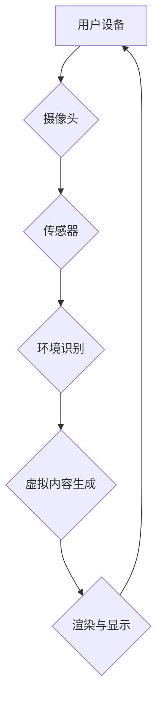

> 增强现实 (AR)、电商、用户体验、虚拟试衣、产品展示、购物决策、未来趋势

## 1. 背景介绍

电子商务的蓬勃发展为消费者提供了便捷的购物体验，但传统的电商模式仍然存在一些局限性，例如缺乏真实的商品感官体验，导致消费者难以准确判断商品的尺寸、颜色、材质等信息，从而影响购物决策。增强现实 (AR) 技术的出现为电商领域带来了新的机遇，它能够将虚拟信息叠加到现实世界中，为消费者提供更加沉浸式的购物体验，从而提升电商的转化率和用户满意度。

## 2. 核心概念与联系

**2.1 增强现实 (AR) 技术**

增强现实 (AR) 技术是一种将虚拟信息叠加到现实世界中，并与用户交互的计算机技术。它通过摄像头、传感器、软件等设备，将虚拟物体、信息、动画等内容实时地呈现到用户的现实世界中，从而增强用户的感知和理解能力。

**2.2 电商与 AR 技术的结合**

电商平台可以通过 AR 技术，为消费者提供更加真实的商品体验，例如：

* **虚拟试衣:** 消费者可以通过 AR 应用，在手机或平板电脑上虚拟试穿衣服，从而更直观地了解衣服的款式、颜色、尺寸等信息，减少退货率。
* **产品展示:** 消费者可以通过 AR 应用，查看商品的3D模型、材质、功能等信息，更加全面地了解商品的特点，提升购物决策的准确性。
* **交互式购物:** 消费者可以通过 AR 应用，与商品进行互动，例如旋转、放大、缩小商品，查看商品的细节信息，从而更加深入地了解商品。

**2.3 AR 技术架构**



## 3. 核心算法原理 & 具体操作步骤

**3.1 算法原理概述**

AR 技术的核心算法包括环境识别、目标跟踪、虚拟内容渲染等。环境识别算法用于识别用户的周围环境，例如墙壁、地面、家具等，为虚拟内容的放置提供参考。目标跟踪算法用于跟踪用户的移动和视角变化，确保虚拟内容始终与用户的视线保持一致。虚拟内容渲染算法用于将虚拟内容渲染到用户的设备屏幕上，并与现实世界进行融合。

**3.2 算法步骤详解**

1. **环境识别:** 使用深度学习算法，例如卷积神经网络 (CNN)，对摄像头采集的图像进行分析，识别用户的周围环境。
2. **目标跟踪:** 使用目标检测算法，例如YOLO，跟踪用户的移动和视角变化，并根据用户的移动轨迹更新虚拟内容的位置和姿态。
3. **虚拟内容渲染:** 使用3D图形渲染引擎，将虚拟内容渲染到用户的设备屏幕上，并根据环境识别结果，将虚拟内容与现实世界进行融合。

**3.3 算法优缺点**

* **优点:** 能够为消费者提供更加真实的商品体验，提升购物决策的准确性，提高电商平台的转化率和用户满意度。
* **缺点:** 需要强大的计算能力和复杂的算法，对设备的硬件要求较高，目前还存在一些技术难题，例如虚拟内容的渲染精度、用户交互的流畅度等。

**3.4 算法应用领域**

AR 技术在电商领域之外，还广泛应用于其他领域，例如：

* **教育:** AR 应用可以将抽象的知识点转化为可视化的内容，帮助学生更好地理解和记忆知识。
* **医疗:** AR 应用可以帮助医生进行手术指导、病灶定位等，提高手术的精准度和安全性。
* **旅游:** AR 应用可以为游客提供虚拟导游、景点信息等，增强游客的旅游体验。

## 4. 数学模型和公式 & 详细讲解 & 举例说明

**4.1 数学模型构建**

AR 技术的数学模型主要包括以下几个方面：

* **相机模型:** 描述相机拍摄图像的几何关系，包括焦距、内参、外参等参数。
* **环境模型:** 描述用户的周围环境的几何形状和材质信息，例如墙壁、地面、家具等。
* **虚拟内容模型:** 描述虚拟内容的几何形状、材质、纹理等信息。

**4.2 公式推导过程**

* **相机模型:**

    * **内参矩阵:**

    $$
    K = \begin{bmatrix}
    f_x & 0 & c_x \\
    0 & f_y & c_y \\
    0 & 0 & 1
    \end{bmatrix}
    $$

    其中，$f_x$ 和 $f_y$ 是水平和垂直方向的焦距，$c_x$ 和 $c_y$ 是图像主点的坐标。

    * **外参矩阵:**

    $$
    R = \begin{bmatrix}
    r_{11} & r_{12} & r_{13} \\
    r_{21} & r_{22} & r_{23} \\
    r_{31} & r_{32} & r_{33}
    \end{bmatrix}
    $$

    $$
    t = \begin{bmatrix}
    t_x \\
    t_y \\
    t_z
    \end{bmatrix}
    $$

    其中，$R$ 是旋转矩阵，$t$ 是平移向量。

* **环境模型:** 可以使用点云数据、三角网格等方式表示环境的几何形状。

* **虚拟内容模型:** 可以使用3D模型、纹理贴图等方式表示虚拟内容的几何形状和材质信息。

**4.3 案例分析与讲解**

例如，在虚拟试衣应用中，需要将用户的实时图像与虚拟衣服模型进行融合。

1. 首先，使用相机模型和环境识别算法，获取用户的实时图像和周围环境信息。
2. 然后，使用目标跟踪算法，跟踪用户的移动和视角变化。
3. 最后，使用虚拟内容渲染算法，将虚拟衣服模型渲染到用户的实时图像上，并根据用户的移动和视角变化，调整虚拟衣服模型的位置和姿态，从而实现虚拟试衣的效果。

## 5. 项目实践：代码实例和详细解释说明

**5.1 开发环境搭建**

* 操作系统: Android 或 iOS
* 开发工具: Unity 或 Unreal Engine
* 编程语言: C# 或 C++

**5.2 源代码详细实现**

由于篇幅限制，这里只提供部分代码示例，具体实现细节请参考相关开发文档和教程。

```csharp
// Unity 中的代码示例
using UnityEngine;

public class ARVirtualTryOn : MonoBehaviour
{
    public GameObject virtualClothesModel; // 虚拟衣服模型

    private Camera mainCamera; // 主相机

    void Start()
    {
        mainCamera = Camera.main;
    }

    void Update()
    {
        // 获取用户的实时图像
        Texture2D screenTexture = new Texture2D(Screen.width, Screen.height, TextureFormat.RGB24, false);
        screenTexture.ReadPixels(new Rect(0, 0, Screen.width, Screen.height), 0, 0);
        screenTexture.Apply();

        // 将虚拟衣服模型渲染到用户的实时图像上
        virtualClothesModel.GetComponent<Renderer>().material.mainTexture = screenTexture;
    }
}
```

**5.3 代码解读与分析**

这段代码示例演示了如何在 Unity 中将虚拟衣服模型渲染到用户的实时图像上。

1. `virtualClothesModel` 变量存储了虚拟衣服模型的 GameObject 对象。
2. `mainCamera` 变量存储了主相机的 Camera 对象。
3. `Start()` 方法中，获取了主相机对象。
4. `Update()` 方法中，获取了用户的实时图像，并将图像作为虚拟衣服模型的材质纹理，从而实现虚拟试衣的效果。

**5.4 运行结果展示**

运行这段代码后，用户可以通过手机或平板电脑的摄像头，看到虚拟衣服模型叠加在自己的身上，从而实现虚拟试衣的效果。

## 6. 实际应用场景

**6.1 虚拟试衣**

虚拟试衣应用可以帮助消费者在购买衣服之前，虚拟试穿不同的款式和颜色，从而更直观地了解衣服的款式、颜色、尺寸等信息，减少退货率。

**6.2 产品展示**

电商平台可以通过 AR 应用，为消费者提供更加真实的商品展示体验，例如：

* **3D 模型展示:** 消费者可以通过 AR 应用，查看商品的3D模型，更加全面地了解商品的特点。
* **材质展示:** 消费者可以通过 AR 应用，查看商品的材质信息，例如皮革、布料、金属等，更加直观地了解商品的质感。
* **功能展示:** 消费者可以通过 AR 应用，查看商品的功能演示，例如手机的拍照功能、家具的收纳功能等，更加深入地了解商品的使用方法。

**6.3 交互式购物**

电商平台可以通过 AR 应用，为消费者提供更加交互式的购物体验，例如：

* **虚拟试用:** 消费者可以通过 AR 应用，虚拟试用化妆品、香水等商品，从而更直观地了解商品的效果。
* **虚拟家居布置:** 消费者可以通过 AR 应用，虚拟布置家居环境，例如摆放家具、装饰品等，从而更直观地了解家居风格。

**6.4 未来应用展望**

随着 AR 技术的不断发展，其在电商领域的应用场景将会更加广泛，例如：

* **个性化推荐:** AR 应用可以根据消费者的喜好和需求，提供更加个性化的商品推荐。
* **增强现实购物导购:** AR 应用可以为消费者提供虚拟购物导购，帮助消费者找到心仪的商品。
* **虚拟试衣室:** AR 应用可以为消费者提供虚拟试衣室，让消费者可以在虚拟环境中试穿不同的衣服，从而更加方便快捷地购物。

## 7. 工具和资源推荐

**7.1 学习资源推荐**

* **书籍:**
    * 《增强现实技术》
    * 《ARKit 编程指南》
    * 《ARCore 开发指南》
* **在线课程:**
    * Coursera 上的 AR/VR 课程
    * Udemy 上的 AR/VR 课程
* **技术博客:**
    * ARPost
    * Augmented Reality News

**7.2 开发工具推荐**

* **Unity:** 一款跨平台的游戏引擎，支持 AR 开发。
* **Unreal Engine:** 一款高性能的游戏引擎，支持 AR 开发。
* **ARKit:** 苹果公司推出的 AR 开发框架。
* **ARCore:** 谷歌公司推出的 AR 开发框架。

**7.3 相关论文推荐**

* **A Survey of Augmented Reality Technologies**
* **ARKit: A Platform for Augmented Reality on iOS**
* **ARCore: A Platform for Augmented Reality on Android**

## 8. 总结：未来发展趋势与挑战

**8.1 研究成果总结**

AR 技术在电商领域的应用取得了显著的成果，例如虚拟试衣、产品展示、交互式购物等应用场景得到了广泛的应用。

**8.2 未来发展趋势**

* **更逼真的虚拟体验:** AR 技术将更加注重虚拟内容的逼真度，例如更加真实的材质、光影效果、交互体验等。
* **更智能的交互方式:** AR 应用将更加智能化，例如语音控制、手势识别等交互方式将更加普及。
* **更广泛的应用场景:** AR 技术将应用于更多的电商场景，例如虚拟试妆、虚拟家居布置等。

**8.3 面临的挑战**

* **技术难题:** AR 技术仍然面临一些技术难题，例如虚拟内容的渲染精度、用户交互的流畅度等。
* **硬件限制:** AR 应用对设备的硬件要求较高，例如需要高性能的处理器、内存、摄像头等。
* **用户体验:** AR 应用的用户体验还需要进一步提升，例如需要更加直观、便捷、舒适的用户界面和交互方式。

**8.4 研究展望**

未来，AR 技术在电商领域的应用将会更加广泛和深入，为消费者提供更加沉浸式的购物体验，提升电商平台的竞争力。


## 9. 附录：