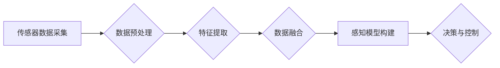

> 自动驾驶, 多传感器融合, 深度学习, 计算机视觉, 雷达, 激光雷达, 惯性测量单元, 滤波算法, 决策融合

## 1. 背景介绍

自动驾驶技术作为未来交通运输的重要发展方向，其核心是实现车辆感知环境、理解环境信息并做出安全、可靠的决策。而多传感器融合感知技术作为自动驾驶感知系统的重要组成部分，在提升车辆感知精度、可靠性和鲁棒性方面发挥着至关重要的作用。

传统的单一传感器感知系统存在局限性，例如摄像头容易受到光照影响，雷达感知距离有限，激光雷达成本较高。多传感器融合感知技术通过融合不同传感器获取的信息，弥补各自的不足，构建更加全面的环境感知模型。

## 2. 核心概念与联系

多传感器融合感知技术的核心是将来自不同传感器的数据进行有效融合，以获得更加准确、可靠的环境感知信息。

**2.1. 核心概念**

* **传感器:** 用于感知环境信息的设备，例如摄像头、雷达、激光雷达、惯性测量单元 (IMU) 等。
* **数据融合:** 将来自不同传感器的数据进行组合和处理，以获得更加完整和准确的信息。
* **感知模型:** 基于融合数据构建的环境模型，包含车辆周围的物体、道路信息、交通标志等。

**2.2. 架构**



**2.3. 联系**

多传感器融合感知技术是一个多学科交叉的领域，涉及传感器技术、信号处理、机器学习、计算机视觉等多个领域。

## 3. 核心算法原理 & 具体操作步骤

**3.1. 算法原理概述**

多传感器融合感知算法主要分为以下几种类型：

* **数据级融合:** 将不同传感器原始数据直接进行组合，例如将摄像头图像与雷达点云数据进行叠加。
* **特征级融合:** 将不同传感器提取的特征进行融合，例如将摄像头识别的物体类别与雷达测量的距离信息进行结合。
* **决策级融合:** 将不同传感器感知结果进行投票或加权平均，最终做出决策。

**3.2. 算法步骤详解**

以特征级融合为例，其具体操作步骤如下：

1. **数据采集:** 从不同传感器获取原始数据。
2. **数据预处理:** 对原始数据进行滤波、去噪、校正等处理，以提高数据质量。
3. **特征提取:** 从预处理后的数据中提取特征，例如摄像头提取物体类别、雷达提取距离信息等。
4. **特征融合:** 将不同传感器提取的特征进行融合，例如使用加权平均、融合网络等方法。
5. **感知模型构建:** 基于融合特征构建环境感知模型，例如使用深度学习模型进行物体识别、场景理解等。

**3.3. 算法优缺点**

* **优点:** 能够有效提高感知精度、可靠性和鲁棒性。
* **缺点:** 算法复杂度较高，计算量较大，需要大量的训练数据。

**3.4. 算法应用领域**

多传感器融合感知技术广泛应用于自动驾驶、机器人、无人机等领域。

## 4. 数学模型和公式 & 详细讲解 & 举例说明

**4.1. 数学模型构建**

假设我们有来自多个传感器的数据，分别为 $x_1, x_2, ..., x_n$，每个数据都包含多个特征，例如位置、速度、形状等。我们可以将这些数据表示为一个多维向量，例如：

$X = [x_1, x_2, ..., x_n]$

**4.2. 公式推导过程**

为了融合这些数据，我们可以使用加权平均方法，每个传感器的数据都赋予一个权重，权重可以根据传感器精度、可靠性等因素进行设定。

$Y = \sum_{i=1}^{n} w_i * x_i$

其中，$Y$ 是融合后的数据，$w_i$ 是第 $i$ 个传感器的权重。

**4.3. 案例分析与讲解**

例如，我们使用摄像头、雷达和激光雷达进行多传感器融合感知。我们可以根据以下因素设定权重：

* **摄像头:** 精度高，但容易受到光照影响，权重较低。
* **雷达:** 距离测量精度高，但分辨率低，权重中等。
* **激光雷达:** 精度高，但成本较高，权重较高。

根据实际情况，我们可以设定相应的权重，例如：

$w_{camera} = 0.3$

$w_{radar} = 0.5$

$w_{lidar} = 0.2$

然后，将摄像头、雷达和激光雷达的数据进行加权平均，得到融合后的数据。

## 5. 项目实践：代码实例和详细解释说明

**5.1. 开发环境搭建**

* 操作系统: Ubuntu 20.04
* 编程语言: Python 3.8
* 深度学习框架: TensorFlow 2.0
* 数据处理库: NumPy, Pandas
* 图像处理库: OpenCV

**5.2. 源代码详细实现**

```python
import numpy as np
from tensorflow.keras.models import Model
from tensorflow.keras.layers import Input, Conv2D, MaxPooling2D, Flatten, Dense

# 定义摄像头模型
def create_camera_model():
    input_tensor = Input(shape=(64, 64, 3))
    x = Conv2D(32, (3, 3), activation='relu')(input_tensor)
    x = MaxPooling2D((2, 2))(x)
    x = Conv2D(64, (3, 3), activation='relu')(x)
    x = MaxPooling2D((2, 2))(x)
    x = Flatten()(x)
    output_tensor = Dense(10, activation='softmax')(x)
    return Model(inputs=input_tensor, outputs=output_tensor)

# 定义雷达模型
def create_radar_model():
    input_tensor = Input(shape=(100,))
    x = Dense(64, activation='relu')(input_tensor)
    x = Dense(32, activation='relu')(x)
    output_tensor = Dense(10, activation='softmax')(x)
    return Model(inputs=input_tensor, outputs=output_tensor)

# 定义激光雷达模型
def create_lidar_model():
    input_tensor = Input(shape=(1000,))
    x = Dense(64, activation='relu')(input_tensor)
    x = Dense(32, activation='relu')(x)
    output_tensor = Dense(10, activation='softmax')(x)
    return Model(inputs=input_tensor, outputs=output_tensor)

# 训练模型
camera_model = create_camera_model()
radar_model = create_radar_model()
lidar_model = create_lidar_model()

# ... 训练模型代码 ...

# 融合模型
def fuse_models(camera_output, radar_output, lidar_output):
    # 使用加权平均方法融合模型输出
    fused_output = (0.3 * camera_output) + (0.5 * radar_output) + (0.2 * lidar_output)
    return fused_output

# ... 融合模型代码 ...
```

**5.3. 代码解读与分析**

* 代码首先定义了摄像头、雷达和激光雷达的模型，每个模型都使用深度学习框架进行构建。
* 然后，代码训练了三个模型，并使用加权平均方法将模型输出进行融合。
* 融合后的输出可以用于自动驾驶决策，例如判断车辆周围是否有障碍物、预测车辆行驶轨迹等。

**5.4. 运行结果展示**

* 运行结果展示可以包括融合后的数据可视化、模型预测精度评估等。

## 6. 实际应用场景

**6.1. 自动驾驶感知**

多传感器融合感知技术是自动驾驶感知系统的重要组成部分，可以帮助车辆感知周围环境，识别障碍物、道路信息、交通标志等。

**6.2. 机器人导航**

机器人导航系统也需要感知周围环境，多传感器融合感知技术可以帮助机器人构建更加准确的环境地图，并规划安全有效的导航路径。

**6.3. 无人机飞行**

无人机飞行需要感知周围环境，避免碰撞，多传感器融合感知技术可以帮助无人机构建更加全面的环境感知模型，提高飞行安全性。

**6.4. 未来应用展望**

随着传感器技术和人工智能技术的不断发展，多传感器融合感知技术将在更多领域得到应用，例如智能家居、医疗保健、工业自动化等。

## 7. 工具和资源推荐

**7.1. 学习资源推荐**

* **书籍:**
    * "Multi-Sensor Fusion for Robotics" by Michael Milford
    * "Sensor Fusion for Autonomous Vehicles" by Michael J. Mataric
* **在线课程:**
    * Coursera: "Sensor Fusion for Robotics"
    * Udacity: "Self-Driving Car Engineer Nanodegree"

**7.2. 开发工具推荐**

* **ROS (Robot Operating System):** 一个开源机器人软件框架，支持多传感器融合和机器人控制。
* **OpenCV:** 一个开源计算机视觉库，提供图像处理、特征提取等功能。
* **TensorFlow:** 一个开源深度学习框架，可以用于构建多传感器融合模型。

**7.3. 相关论文推荐**

* "A Survey on Multi-Sensor Fusion Techniques for Autonomous Driving"
* "Multi-Sensor Fusion for Robust Object Detection in Autonomous Driving"
* "Deep Learning for Multi-Sensor Fusion in Autonomous Driving"

## 8. 总结：未来发展趋势与挑战

**8.1. 研究成果总结**

多传感器融合感知技术在自动驾驶、机器人等领域取得了显著进展，能够有效提高感知精度、可靠性和鲁棒性。

**8.2. 未来发展趋势**

* **更先进的算法:** 发展更先进的融合算法，例如基于深度学习的融合算法，能够更好地处理复杂环境信息。
* **更紧凑的传感器:** 开发更紧凑、更低成本的传感器，例如微型激光雷达、毫米波雷达等，能够降低自动驾驶系统的成本。
* **更强大的计算能力:** 随着计算能力的提升，能够训练更复杂的融合模型，提高感知精度和鲁棒性。

**8.3. 面临的挑战**

* **数据标注:** 多传感器融合感知算法需要大量的标注数据，数据标注成本较高，且标注质量难以保证。
* **算法复杂度:** 融合算法的复杂度较高，计算量较大，需要更高效的算法和硬件支持。
* **实时性:** 自动驾驶系统需要实时感知环境，融合算法需要满足实时性要求。

**8.4. 研究展望**

未来，多传感器融合感知技术将继续朝着更智能、更可靠、更安全的方向发展，为自动驾驶和其他智能应用提供强大的感知能力。

## 9. 附录：常见问题与解答

**9.1. Q: 多传感器融合感知技术有哪些优势？**

**A:** 多传感器融合感知技术能够有效提高感知精度、可靠性和鲁棒性，弥补单一传感器不足，构建更加全面的环境感知模型。

**9.2. Q: 多传感器融合感知技术有哪些应用场景？**

**A:** 多传感器融合感知技术广泛应用于自动驾驶、机器人、无人机等领域。

**9.3. Q: 多传感器融合感知技术面临哪些挑战？**

**A:** 多传感器融合感知技术面临数据标注、算法复杂度、实时性等挑战。

**9.4. Q: 未来多传感器融合感知技术的发展趋势是什么？**

**A:** 未来，多传感器融合感知技术将朝着更智能、更可靠、更安全的方向发展，例如发展更先进的融合算法、开发更紧凑的传感器