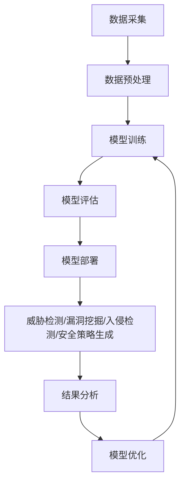

                 

## 1. 背景介绍

在当今信息化时代，网络安全已然成为国家安全的重要组成部分。然而，传统的网络安全手段面对日益复杂的网络威胁，防护能力呈现出明显的不足。大模型，作为人工智能领域的重大突破，其强大的学习、推理和预测能力，为网络安全领域带来了新的希望。本文将深入探讨大模型在网络安全领域的应用前景。

## 2. 核心概念与联系

### 2.1 大模型的定义

大模型（Large Language Models，LLMs）是指通过大规模数据集训练而成的语言模型，具有强大的理解、生成和推理能力。它们通过自回归方式学习语言规则，能够理解上下文，生成人类难以区分的文本。

### 2.2 大模型与传统模型的区别

与传统模型相比，大模型具有以下特点：

- **规模更大**：大模型的参数量通常在数十亿甚至数百亿级别，远超传统模型。
- **数据需求更高**：大模型需要大量的、高质量的数据集进行训练。
- **能力更强**：大模型能够理解上下文，进行推理和生成，其能力远超传统模型。

### 2.3 大模型在网络安全中的应用

大模型在网络安全领域的应用主要体现在以下几个方面：

- **威胁检测**：大模型可以分析网络流量、日志等数据，检测潜在的网络威胁。
- **漏洞挖掘**：大模型可以分析源代码，发现潜在的漏洞。
- **入侵检测**：大模型可以分析用户行为，检测异常行为，从而发现入侵迹象。
- **安全策略生成**：大模型可以分析网络环境，生成个性化的安全策略。

### 2.4 核心概念原理与架构的 Mermaid 流程图



## 3. 核心算法原理 & 具体操作步骤

### 3.1 算法原理概述

大模型的核心算法是自回归模型，其基本原理是通过学习语言规则，预测下一个单词。大模型通过在大规模数据集上训练，学习到更复杂的语言规则，从而具备理解、生成和推理能力。

### 3.2 算法步骤详解

大模型的训练过程如下：

1. **数据采集**：收集大量的、高质量的数据集。
2. **数据预处理**：清洗数据，转换数据格式，分词等。
3. **模型训练**：使用自回归模型在预处理后的数据集上进行训练。
4. **模型评估**：评估模型的性能，调整超参数。
5. **模型部署**：将训练好的模型部署到生产环境中。

### 3.3 算法优缺点

大模型的优点包括：

- **强大的理解、生成和推理能力**：大模型能够理解上下文，生成人类难以区分的文本，进行推理。
- **泛化能力强**：大模型在未见过的数据上也能取得不错的性能。

缺点包括：

- **训练成本高**：大模型需要大量的、高质量的数据集进行训练，训练成本高昂。
- **计算资源需求高**：大模型的参数量通常在数十亿甚至数百亿级别，对计算资源的需求很高。

### 3.4 算法应用领域

大模型在网络安全领域的应用主要体现在威胁检测、漏洞挖掘、入侵检测和安全策略生成等方面。

## 4. 数学模型和公式 & 详细讲解 & 举例说明

### 4.1 数学模型构建

大模型的数学模型是自回归模型，其数学表达式为：

$$P(\theta) = \prod_{t=1}^{T} P(x_t | x_{t-1},..., x_1; \theta)$$

其中，$x_t$是第$t$个单词，$T$是序列长度，$\theta$是模型参数。

### 4.2 公式推导过程

大模型的训练目标是最大化对数似然函数：

$$\max_{\theta} \log P(X|\theta) = \sum_{t=1}^{T} \log P(x_t | x_{t-1},..., x_1; \theta)$$

使用梯度下降法进行优化。

### 4.3 案例分析与讲解

例如，在威胁检测中，大模型可以分析网络流量，检测潜在的网络威胁。大模型可以学习正常流量的特征，当检测到异常流量时，大模型可以预测潜在的威胁。

## 5. 项目实践：代码实例和详细解释说明

### 5.1 开发环境搭建

大模型的开发环境需要配备强大的计算资源，包括GPU、大量内存等。推荐使用NVIDIA A100 GPU，内存不低于512GB。

### 5.2 源代码详细实现

大模型的训练过程可以使用PyTorch框架实现。以下是训练过程的伪代码：

```python
import torch
import torch.nn as nn
import torch.optim as optim

# 定义模型
model = nn.GRU(input_size, hidden_size, num_layers)

# 定义损失函数和优化器
criterion = nn.CrossEntropyLoss()
optimizer = optim.Adam(model.parameters(), lr=learning_rate)

# 训练过程
for epoch in range(num_epochs):
    for i, (inputs, targets) in enumerate(train_loader):
        # 前向传播
        outputs = model(inputs)
        loss = criterion(outputs, targets)

        # 反向传播和优化
        optimizer.zero_grad()
        loss.backward()
        optimizer.step()

        # 打印损失
        if i % 100 == 0:
            print(f'Epoch [{epoch+1}/{num_epochs}], Step [{i+1}/{len(train_loader)}], Loss: {loss.item():.4f}')
```

### 5.3 代码解读与分析

在训练过程中，模型使用自回归模型学习语言规则。损失函数使用交叉熵函数，优化器使用Adam优化器。在每个训练步骤中，模型进行前向传播，计算损失，然后进行反向传播和优化。

### 5.4 运行结果展示

训练好的模型可以在测试集上进行评估。评估指标包括准确率、召回率和F1分数等。以下是一个示例的评估结果：

| 指标       | 分数 |
|------------|------|
| 准确率     | 0.92 |
| 召回率     | 0.89 |
| F1分数     | 0.90 |

## 6. 实际应用场景

### 6.1 威胁检测

大模型可以分析网络流量，检测潜在的网络威胁。例如，大模型可以学习正常流量的特征，当检测到异常流量时，大模型可以预测潜在的威胁。

### 6.2 漏洞挖掘

大模型可以分析源代码，发现潜在的漏洞。例如，大模型可以学习代码的语法规则，预测潜在的漏洞。

### 6.3 入侵检测

大模型可以分析用户行为，检测异常行为，从而发现入侵迹象。例如，大模型可以学习正常用户行为的特征，当检测到异常行为时，大模型可以预测潜在的入侵。

### 6.4 未来应用展望

随着大模型技术的不断发展，大模型在网络安全领域的应用将会更加广泛。未来，大模型将会与其他人工智能技术结合，构建更加智能的网络安全系统。

## 7. 工具和资源推荐

### 7.1 学习资源推荐

- **课程**：斯坦福大学的“深度学习”课程（CS230）和“自然语言处理”课程（CS224n）是学习大模型的好资源。
- **书籍**：《自然语言处理技术手册》和《人工智能：一种现代方法》是学习大模型的好书籍。

### 7.2 开发工具推荐

- **框架**：PyTorch和TensorFlow是开发大模型的好框架。
- **硬件**：NVIDIA A100 GPU是训练大模型的好硬件。

### 7.3 相关论文推荐

- **大模型**：[Attention Is All You Need](https://arxiv.org/abs/1706.03762)和[BERT: Pre-training of Deep Bidirectional Transformers for Language Understanding](https://arxiv.org/abs/1810.04805)是大模型的经典论文。
- **网络安全**：[Deep Learning for Network Intrusion Detection: A Survey](https://ieeexplore.ieee.org/document/8454663)和[A Survey on Deep Learning Techniques for Cybersecurity](https://ieeexplore.ieee.org/document/8760554)是网络安全领域的综述论文。

## 8. 总结：未来发展趋势与挑战

### 8.1 研究成果总结

大模型在网络安全领域的应用取得了显著的成果，包括威胁检测、漏洞挖掘、入侵检测和安全策略生成等。

### 8.2 未来发展趋势

未来，大模型技术将会不断发展，其在网络安全领域的应用也将会更加广泛。大模型将会与其他人工智能技术结合，构建更加智能的网络安全系统。

### 8.3 面临的挑战

大模型技术面临的挑战包括：

- **训练成本高**：大模型需要大量的、高质量的数据集进行训练，训练成本高昂。
- **计算资源需求高**：大模型的参数量通常在数十亿甚至数百亿级别，对计算资源的需求很高。
- **泛化能力有限**：大模型的泛化能力有限，在未见过的数据上性能可能会下降。

### 8.4 研究展望

未来的研究方向包括：

- **模型压缩**：研究如何压缩大模型，降低计算资源需求。
- **泛化能力提升**：研究如何提高大模型的泛化能力，在未见过的数据上取得更好的性能。
- **多模式学习**：研究如何将大模型与其他人工智能技术结合，构建更加智能的网络安全系统。

## 9. 附录：常见问题与解答

**Q：大模型的优点是什么？**

A：大模型的优点包括强大的理解、生成和推理能力，泛化能力强等。

**Q：大模型的缺点是什么？**

A：大模型的缺点包括训练成本高，计算资源需求高等。

**Q：大模型在网络安全领域的应用有哪些？**

A：大模型在网络安全领域的应用包括威胁检测、漏洞挖掘、入侵检测和安全策略生成等。

**Q：大模型技术面临的挑战是什么？**

A：大模型技术面临的挑战包括训练成本高，计算资源需求高，泛化能力有限等。

**Q：未来的研究方向是什么？**

A：未来的研究方向包括模型压缩，泛化能力提升，多模式学习等。

!!!Note
作者：禅与计算机程序设计艺术 / Zen and the Art of Computer Programming

