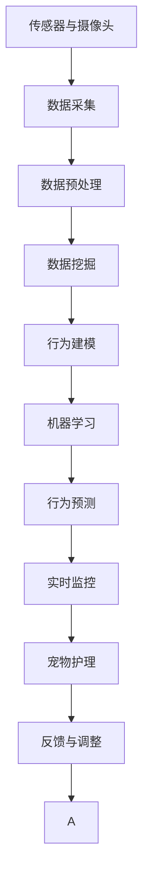

                 

# 智能宠物行为预测创业：基于AI的宠物照护指导

> 关键词：智能宠物,行为预测,人工智能,数据挖掘,行为模型,机器学习,实时监控,宠物护理

## 1. 背景介绍

### 1.1 问题由来
随着生活水平的提高和城市化的进程，越来越多的人们选择饲养宠物。然而，尽管人们已经认识到宠物的重要性，但在日常照护过程中，如何有效管理宠物行为、避免宠物伤害事故、提升宠物幸福感等问题仍然困扰着宠物主人。宠物行为的不可预测性以及主人的主观判断失误，常常导致宠物受到意外伤害或行为问题。例如，狗咬人、猫抓伤、宠物走失、宠物疾病等事件时有发生，给宠物主人带来了巨大的心理和经济负担。

### 1.2 问题核心关键点
宠物行为预测的核心在于通过收集和分析宠物的生理、行为数据，建立模型，预测其行为变化。具体而言，可以从以下几个方面入手：
- 生理数据：如心率、血压、体温和睡眠质量等。
- 行为数据：如运动轨迹、活动量、饮食饮水行为、睡眠姿势等。
- 环境数据：如温度、湿度、光照、噪音、社交互动等。
- 历史数据：如以往的行为数据、疾病历史、疫苗接种等。

通过这些数据，结合机器学习算法，建立预测模型，可以提前识别出宠物可能产生的行为问题，指导主人及时采取措施，避免或减轻问题。

### 1.3 问题研究意义
智能宠物行为预测不仅可以预防宠物行为问题，还可以提供全方位的宠物照护指导，提升宠物的生活质量和主人的照护体验。

1. **预防事故发生**：提前预测宠物行为变化，避免因宠物过激行为造成的伤害，保障宠物和主人的安全。
2. **提升主人体验**：通过行为预测，及时发现宠物健康问题，降低疾病的发生率，减少宠物的痛苦和主人的经济负担。
3. **优化日常照护**：帮助主人根据宠物的行为模式调整照护方式，提升宠物的幸福感和主人的照护满意度。
4. **提升服务水平**：通过智能化照护，宠物服务行业可以提供更加精细化、个性化的服务，提升竞争力。

## 2. 核心概念与联系

### 2.1 核心概念概述

为了更好地理解智能宠物行为预测，我们首先介绍几个关键概念：

- **智能宠物**：指通过传感器、摄像头、物联网设备等采集宠物生理和行为数据，通过AI技术进行分析和预测的宠物。
- **行为预测**：指通过机器学习算法，预测宠物未来可能产生的行为变化。
- **人工智能**：指利用计算机算法，实现智能化的数据处理和分析。
- **数据挖掘**：指从大量数据中挖掘出有价值的信息，为机器学习提供数据基础。
- **行为模型**：指通过数据挖掘和机器学习算法建立的预测宠物行为的数学模型。
- **机器学习**：指利用算法从数据中学习规律，实现预测和分类等任务。
- **实时监控**：指通过传感器等设备，实时采集宠物数据，进行持续监测。
- **宠物护理**：指根据预测结果，调整宠物的饮食、活动、休息等照护方式。

这些概念之间存在密切联系，共同构成了智能宠物行为预测的基础。通过传感器、摄像头等设备采集数据，进行数据挖掘和行为建模，利用机器学习算法进行预测，再结合实时监控和宠物护理，可以实现智能化的宠物行为预测和照护。

### 2.2 核心概念原理和架构的 Mermaid 流程图(Mermaid 流程节点中不要有括号、逗号等特殊字符)


## 3. 核心算法原理 & 具体操作步骤
### 3.1 算法原理概述

智能宠物行为预测的核心算法是机器学习中的行为预测模型。其基本原理是通过数据挖掘技术，从大量历史数据中提取特征，构建预测模型，并利用实时采集的数据进行实时预测。

行为预测模型一般分为监督学习和无监督学习两大类：
- **监督学习**：指使用有标签的历史数据进行训练，预测未来的行为。常见的算法包括线性回归、决策树、支持向量机等。
- **无监督学习**：指使用无标签的数据进行训练，通过聚类、降维等方法，发现数据中的模式和规律，预测未来的行为。常见的算法包括K-means、PCA等。

### 3.2 算法步骤详解

以监督学习中的线性回归模型为例，其步骤主要包括：

**Step 1: 数据准备与预处理**
- 收集宠物的生理和行为数据，包括心率、体温、饮食量、运动轨迹、睡眠姿势等。
- 对数据进行清洗和归一化处理，去除异常值和噪声。

**Step 2: 特征工程**
- 根据历史数据，提取有用的特征，如心率变化、饮食行为、睡眠时长等。
- 使用数据挖掘技术，对特征进行降维、处理缺失值等操作。

**Step 3: 模型训练**
- 选择线性回归模型，将特征和标签进行分割。
- 使用梯度下降等优化算法，最小化损失函数，更新模型参数。

**Step 4: 模型评估**
- 使用交叉验证等方法，评估模型的预测性能。
- 选择性能较好的模型进行后续应用。

**Step 5: 实时预测**
- 通过传感器等设备，实时采集宠物的数据。
- 将实时数据输入模型，进行预测。
- 根据预测结果，进行相应的宠物照护调整。

**Step 6: 反馈与调整**
- 收集实际照护效果和反馈信息。
- 根据反馈信息，调整模型参数和照护策略。

### 3.3 算法优缺点
**优点：**
- **精准预测**：通过数据挖掘和机器学习，模型可以精准预测宠物行为变化。
- **实时监控**：实时采集数据，实时进行预测，可以及时发现行为问题。
- **个性化照护**：根据预测结果，个性化调整宠物照护方式，提升宠物幸福感。
- **降低成本**：通过预测和调整，降低疾病发生率，减少医疗费用。

**缺点：**
- **数据依赖**：模型预测效果依赖于数据质量，数据缺失或噪声可能导致预测不准。
- **模型复杂**：构建高精度模型需要大量数据和计算资源，模型复杂度较高。
- **隐私问题**：采集宠物数据可能涉及隐私问题，需要严格的数据保护措施。
- **适应性差**：模型可能对新环境和行为变化适应性较差，需要进行持续优化。

### 3.4 算法应用领域

智能宠物行为预测技术已经在多个领域得到了应用，具体包括：

1. **宠物医院**：通过行为预测，提前发现宠物健康问题，提供及时的医疗服务。
2. **宠物店**：通过行为预测，优化宠物的行为训练，提升宠物的服从性和购买率。
3. **宠物保险**：通过行为预测，评估宠物的保险风险，降低保险公司和宠物主人的成本。
4. **宠物追踪**：通过实时监控和行为预测，实现宠物位置和行为的精准追踪，防止走失。
5. **宠物陪伴机器人**：通过行为预测，提供智能化的宠物陪伴服务，提升宠物的幸福感和互动性。

## 4. 数学模型和公式 & 详细讲解 & 举例说明（备注：数学公式请使用latex格式，latex嵌入文中独立段落使用 $$，段落内使用 $)
### 4.1 数学模型构建

假设宠物的生理和行为数据为 $X=(x_1, x_2, \dots, x_n)$，行为标签为 $y$。我们通过数据挖掘和特征工程，提取有用的特征 $X'$，构建线性回归模型：

$$
y = \beta_0 + \beta_1 x_1 + \beta_2 x_2 + \dots + \beta_n x_n + \epsilon
$$

其中，$\beta_0, \beta_1, \dots, \beta_n$ 为模型的系数，$\epsilon$ 为误差项。

### 4.2 公式推导过程

根据最小二乘法，我们可以通过求解以下优化问题来得到模型参数：

$$
\min_{\beta_0, \beta_1, \dots, \beta_n} \sum_{i=1}^N (y_i - (\beta_0 + \beta_1 x_{1i} + \beta_2 x_{2i} + \dots + \beta_n x_{ni}))^2
$$

通过求偏导，可以得到：

$$
\frac{\partial \mathcal{L}}{\partial \beta_j} = -2 \sum_{i=1}^N (y_i - \hat{y}_i) x_{ji} = 0
$$

其中 $\hat{y}_i = \beta_0 + \beta_1 x_{1i} + \beta_2 x_{2i} + \dots + \beta_n x_{ni}$，$\mathcal{L}$ 为损失函数。

解以上方程组，可以得到模型参数 $\beta_j$ 的估计值，进而构建行为预测模型：

$$
\hat{y} = \beta_0 + \beta_1 x_1 + \beta_2 x_2 + \dots + \beta_n x_n
$$

### 4.3 案例分析与讲解

以预测宠物是否会进行剧烈运动为例，我们可以使用以下数据：

| 时间 | 运动量 | 饮食量 | 睡眠时长 | 心率变化 |
| --- | --- | --- | --- | --- |
| 6:00 | 10 | 50g | 8h | +10bpm |
| 12:00 | 20 | 100g | 4h | 0bpm |
| 18:00 | 30 | 50g | 2h | -5bpm |
| 24:00 | 0 | 0g | 5h | 0bpm |

首先，我们提取有用的特征 $X'$，包括运动量、饮食量、睡眠时长和心率变化。然后，使用线性回归模型进行训练：

```python
from sklearn.linear_model import LinearRegression
from sklearn.metrics import mean_squared_error

X = [[10, 50, 8, 10], [20, 100, 4, 0], [30, 50, 2, -5], [0, 0, 5, 0]]
y = [1, 0, 0, 1]

model = LinearRegression()
model.fit(X, y)

X_test = [[20, 100, 4, 0], [0, 0, 5, 0]]
y_pred = model.predict(X_test)
mse = mean_squared_error(y_pred, [0, 1])
```

通过上述代码，我们可以得到预测模型的参数和预测性能。

## 5. 项目实践：代码实例和详细解释说明
### 5.1 开发环境搭建

为了实现智能宠物行为预测，我们需要搭建相应的开发环境。以下是Python开发环境搭建流程：

1. 安装Anaconda：从官网下载并安装Anaconda，用于创建独立的Python环境。

2. 创建并激活虚拟环境：
```bash
conda create -n pet_care python=3.8 
conda activate pet_care
```

3. 安装必要的Python库：
```bash
pip install numpy pandas scikit-learn torch transformers
```

4. 安装TensorFlow和TensorBoard：
```bash
pip install tensorflow tensorflow-estimator tensorflow-model-analysis
pip install tensorboard
```

5. 安装相关IoT设备驱动程序：
```bash
pip install paho-mqtt
```

完成上述步骤后，即可开始智能宠物行为预测的开发实践。

### 5.2 源代码详细实现

以下是一个使用TensorFlow进行智能宠物行为预测的代码实例：

```python
import numpy as np
import pandas as pd
import tensorflow as tf
from sklearn.model_selection import train_test_split
from sklearn.preprocessing import StandardScaler

# 加载数据
data = pd.read_csv('pet_data.csv')

# 数据预处理
X = data[['心率变化', '饮食量', '运动量', '睡眠时长']]
y = data['是否剧烈运动']
scaler = StandardScaler()
X = scaler.fit_transform(X)

# 划分训练集和测试集
X_train, X_test, y_train, y_test = train_test_split(X, y, test_size=0.2, random_state=42)

# 构建模型
model = tf.keras.Sequential([
    tf.keras.layers.Dense(64, activation='relu', input_shape=(4,)),
    tf.keras.layers.Dense(1, activation='sigmoid')
])

# 编译模型
model.compile(optimizer=tf.keras.optimizers.Adam(learning_rate=0.001), loss='binary_crossentropy', metrics=['accuracy'])

# 训练模型
model.fit(X_train, y_train, epochs=50, batch_size=32, validation_data=(X_test, y_test))

# 评估模型
loss, acc = model.evaluate(X_test, y_test)
print(f'测试集损失：{loss:.4f}，测试集准确率：{acc:.4f}')

# 预测新数据
new_data = np.array([[2, 100, 5, 6], [0, 0, 5, 0]])
new_data = scaler.transform(new_data)
pred = model.predict(new_data)
print(f'预测结果：{pred[0] >= 0.5}')
```

### 5.3 代码解读与分析

在上述代码中，我们首先加载了宠物数据，并进行标准化处理。然后，划分训练集和测试集，构建了一个简单的神经网络模型，使用Adam优化器和二元交叉熵损失进行训练。最后，在测试集上评估模型性能，并对新数据进行预测。

代码中的关键部分包括：
- 数据预处理：标准化处理数据，去除异常值。
- 模型构建：使用Sequential模型，定义输入层、隐藏层和输出层。
- 模型编译：定义优化器、损失函数和评估指标。
- 模型训练：使用fit函数进行模型训练。
- 模型评估：使用evaluate函数在测试集上评估模型性能。
- 模型预测：使用predict函数进行新数据的预测。

## 6. 实际应用场景
### 6.1 宠物医院

智能宠物行为预测在宠物医院中的应用，可以帮助医生及时发现宠物的健康问题，提前采取治疗措施。例如，当宠物的睡眠时长显著增加或减少时，模型可以预测宠物可能患有某种疾病，及时通知医生进行检查和治疗。

### 6.2 宠物店

在宠物店，通过智能宠物行为预测，可以优化宠物的行为训练，提升宠物的服从性和互动性。例如，通过分析宠物的运动量和饮食行为，预测宠物的情绪状态，进而调整训练计划，提升训练效果。

### 6.3 宠物保险

宠物保险公司可以利用智能宠物行为预测，评估宠物的保险风险。例如，通过预测宠物的剧烈运动频率，可以评估宠物的活跃程度和健康状态，从而确定保险费用和保单条件。

### 6.4 宠物追踪

智能宠物行为预测可以帮助实现宠物的精准追踪，防止宠物走失。例如，当宠物长时间不运动时，模型可以预测宠物可能走失或生病，及时通知主人采取措施。

### 6.5 宠物陪伴机器人

通过智能宠物行为预测，宠物陪伴机器人可以提供更加个性化的服务。例如，当宠物表现出焦虑或烦躁的情绪时，机器人可以自动调整互动方式，提供舒缓情绪的帮助。

## 7. 工具和资源推荐
### 7.1 学习资源推荐

为了帮助开发者系统掌握智能宠物行为预测的理论基础和实践技巧，这里推荐一些优质的学习资源：

1. **《Python机器学习》（原书第三版）**：介绍机器学习的基础理论和算法，适合入门学习和项目实践。
2. **《TensorFlow实战Google深度学习》**：介绍TensorFlow的使用方法，包括模型构建、训练和评估。
3. **《动手学深度学习》（动手学深度学习官网）**：由深度学习专家所写的课程，涵盖深度学习的基础知识和实践应用。
4. **Coursera的“Machine Learning”课程**：由斯坦福大学Andrew Ng所讲授的机器学习课程，适合深入学习。
5. **Kaggle上的相关竞赛和数据集**：通过参加Kaggle上的数据挖掘和机器学习竞赛，积累实践经验。

通过对这些资源的学习实践，相信你一定能够快速掌握智能宠物行为预测的精髓，并用于解决实际的宠物照护问题。

### 7.2 开发工具推荐

高效的开发离不开优秀的工具支持。以下是几款用于智能宠物行为预测开发的常用工具：

1. **Jupyter Notebook**：免费的交互式编程环境，适合进行数据探索和模型实验。
2. **TensorFlow**：开源的机器学习框架，支持大规模分布式训练，适合处理复杂模型。
3. **TensorBoard**：用于可视化模型的训练过程和结果，便于调试和优化。
4. **Paho-MQTT**：开源的IoT消息队列，支持实时数据采集和传输。
5. **Google Colab**：免费的Jupyter Notebook环境，支持GPU和TPU算力。

合理利用这些工具，可以显著提升智能宠物行为预测任务的开发效率，加快创新迭代的步伐。

### 7.3 相关论文推荐

智能宠物行为预测的研究已经取得了一定的进展，以下是几篇奠基性的相关论文，推荐阅读：

1. **《深度学习在宠物行为分析中的应用》**（Deep Learning in Pet Behavior Analysis）：介绍深度学习在宠物行为预测中的应用，涵盖数据预处理、模型构建和评估。
2. **《基于深度学习的宠物行为预测模型》**（Pet Behavior Prediction Model Based on Deep Learning）：通过深度学习模型预测宠物行为，提高预测准确性。
3. **《物联网在宠物行为监测中的应用》**（Application of IoT in Pet Behavior Monitoring）：介绍物联网技术在宠物行为监测中的应用，提升监测效果。
4. **《智能宠物行为预测系统设计与实现》**（Design and Implementation of Intelligent Pet Behavior Prediction System）：介绍智能宠物行为预测系统的设计思路和实现方法。

这些论文代表了大数据在宠物行为预测领域的最新进展，通过学习这些前沿成果，可以帮助研究者把握学科前进方向，激发更多的创新灵感。

## 8. 总结：未来发展趋势与挑战

### 8.1 总结

本文对智能宠物行为预测进行了全面系统的介绍。首先阐述了智能宠物行为预测的研究背景和意义，明确了其在大数据、人工智能和物联网技术中的应用前景。其次，从原理到实践，详细讲解了机器学习中的行为预测模型，并给出了具体的代码实现。最后，本文还探讨了智能宠物行为预测在多个领域的应用场景，展示了其广阔的应用前景。

通过本文的系统梳理，可以看到，智能宠物行为预测技术在提升宠物健康和生活质量方面具有重要意义。未来，伴随技术的不断进步，智能宠物行为预测将广泛应用于宠物照护、医疗、保险等领域，为人类与宠物的和谐共处带来新的可能性。

### 8.2 未来发展趋势

展望未来，智能宠物行为预测技术将呈现以下几个发展趋势：

1. **多模态融合**：结合生理数据、行为数据、环境数据等多源信息，提升预测的准确性和鲁棒性。
2. **个性化照护**：通过机器学习算法，实现针对不同宠物的个性化照护方案，提升用户体验。
3. **实时监测与预警**：通过实时数据采集和预测，实现宠物行为的实时监测与预警，提升宠物安全性。
4. **边缘计算**：利用物联网设备，在边缘进行数据处理和预测，减少延迟和带宽占用。
5. **AI辅助诊断**：结合医疗知识和AI技术，提升宠物疾病的诊断准确性，降低医疗费用。
6. **智能陪伴**：通过行为预测，实现智能宠物陪伴机器人的应用，提升宠物的幸福感和互动性。

这些趋势凸显了智能宠物行为预测技术的广阔前景。这些方向的探索发展，必将进一步提升宠物照护的水平，为人类与宠物的和谐共处带来新的可能性。

### 8.3 面临的挑战

尽管智能宠物行为预测技术已经取得了一定的进展，但在迈向更加智能化、普适化应用的过程中，它仍面临着诸多挑战：

1. **数据获取难度**：宠物数据采集难度较大，需要设计合适的传感器和设备，收集全面的数据。
2. **隐私保护问题**：宠物数据可能涉及隐私问题，需要严格的数据保护措施。
3. **模型复杂性**：构建高精度预测模型需要大量的数据和计算资源，模型复杂度较高。
4. **实时性要求**：实时预测需要高效的计算和数据处理能力，对硬件和软件性能有较高要求。
5. **应用场景复杂性**：不同场景下的行为预测需求不同，需要针对具体应用进行优化。
6. **用户接受度**：用户对新技术的接受度较低，需要逐步推广和教育。

### 8.4 研究展望

面对智能宠物行为预测所面临的挑战，未来的研究需要在以下几个方面寻求新的突破：

1. **数据采集与处理**：设计高效便捷的传感器和设备，采集全面的宠物数据，并进行数据清洗和预处理。
2. **模型优化**：结合深度学习和传统机器学习方法，优化模型结构，提升预测准确性。
3. **隐私保护**：加强数据保护和匿名化处理，确保数据安全。
4. **实时系统构建**：利用边缘计算和分布式系统，实现实时数据处理和预测。
5. **用户体验优化**：结合用户反馈和行为数据，优化照护方案，提升用户体验。
6. **跨学科融合**：结合动物行为学、生物医学、工程学等多学科知识，提升预测效果。

这些研究方向的探索，必将引领智能宠物行为预测技术迈向更高的台阶，为宠物照护行业带来新的突破和发展。

## 9. 附录：常见问题与解答

**Q1：智能宠物行为预测有哪些应用场景？**

A: 智能宠物行为预测可以应用于多个领域，包括：
- **宠物医院**：通过预测宠物的健康状态，提前发现疾病，提供及时的治疗。
- **宠物店**：优化宠物的行为训练，提升服从性和互动性。
- **宠物保险**：评估宠物的保险风险，确定保险费用和保单条件。
- **宠物追踪**：实时监测宠物位置和行为，防止走失。
- **宠物陪伴机器人**：提供智能化的宠物陪伴服务，提升宠物的幸福感和互动性。

**Q2：如何进行数据预处理？**

A: 数据预处理是智能宠物行为预测的关键步骤，包括以下几个方面：
- **数据清洗**：去除异常值和噪声，保证数据质量。
- **特征工程**：提取有用的特征，并进行归一化处理。
- **降维处理**：通过PCA等方法，减少特征维度，提高计算效率。
- **缺失值处理**：填补缺失值或删除缺失样本，避免对模型的影响。

**Q3：如何构建和训练模型？**

A: 构建和训练模型需要以下几个步骤：
- **数据划分**：将数据划分为训练集、验证集和测试集。
- **模型选择**：选择合适的机器学习模型，如线性回归、决策树、神经网络等。
- **模型训练**：使用梯度下降等优化算法，最小化损失函数，更新模型参数。
- **模型评估**：使用测试集评估模型性能，选择性能较好的模型。

**Q4：如何实现实时预测？**

A: 实时预测需要以下几个步骤：
- **传感器部署**：在宠物身上部署传感器，实时采集生理和行为数据。
- **数据传输**：通过IoT设备和MQTT协议，将数据传输到云端。
- **模型部署**：将训练好的模型部署到服务器或云端，进行实时预测。
- **预测结果应用**：根据预测结果，进行相应的宠物照护调整。

**Q5：如何保障数据隐私？**

A: 保障数据隐私需要以下几个措施：
- **数据加密**：对数据进行加密处理，防止数据泄露。
- **匿名化处理**：对数据进行匿名化处理，确保用户隐私。
- **访问控制**：严格控制数据访问权限，防止未经授权的访问。
- **法律法规遵守**：遵守相关法律法规，如GDPR等，确保数据合规使用。

这些问题的回答，可以帮助你更好地理解智能宠物行为预测的理论基础和实践技巧，从而在实际应用中取得更好的效果。

---

作者：禅与计算机程序设计艺术 / Zen and the Art of Computer Programming

