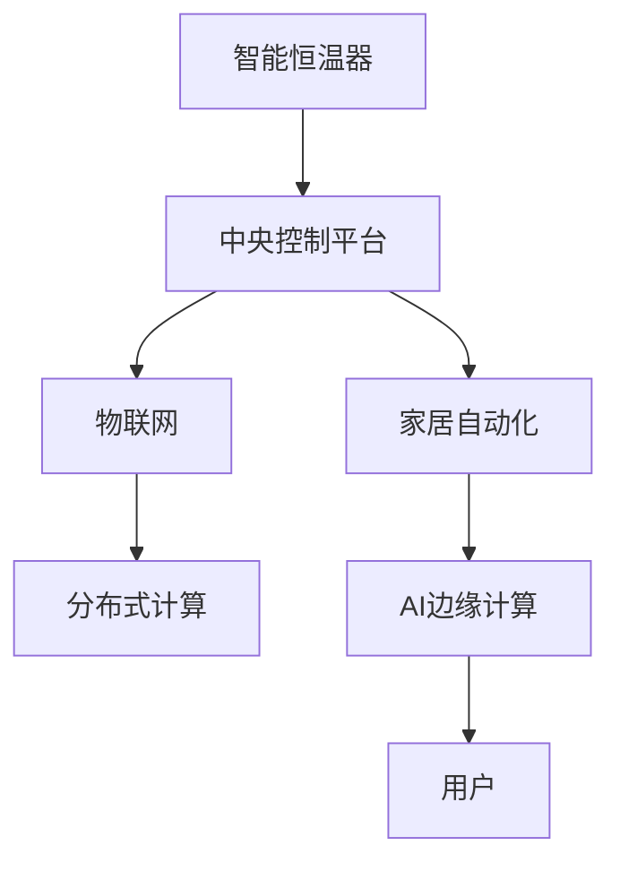

                 

# 智能家居集成：创建智能恒温器

> 关键词：智能家居,智能恒温器,集成开发,物联网,家居自动化

## 1. 背景介绍

### 1.1 问题由来
智能家居作为未来家庭生活的重要方向，近年来得到了快速的发展。其中，智能恒温器因其能自动调节室内温度，从而提升居住舒适度和能效，被广泛应用于家庭和商业场所。然而，由于恒温器制造商众多，技术标准不一，导致智能恒温器之间无法互通互联，无法形成统一的生态系统。

### 1.2 问题核心关键点
如何将众多不同型号的智能恒温器集成到一个统一的智能家居系统中，是一个亟待解决的问题。我们提出了一种基于物联网和分布式计算技术的智能恒温器集成方案，通过搭建一个中央控制平台，实现不同恒温器的协同控制，从而提升用户体验和系统的整体效率。

## 2. 核心概念与联系

### 2.1 核心概念概述

为更好地理解智能恒温器集成的解决方案，本节将介绍几个核心概念：

- **智能恒温器**：具备物联网接入能力，能够远程控制和监控室温的电器设备，例如Nest、Ecobee等。
- **中央控制平台**：作为智能恒温器集成的核心，用于连接和控制各个恒温器，实现系统的全局协同。
- **物联网**：连接传感器、设备、系统和用户之间的网络，实现数据互通和实时控制。
- **分布式计算**：将任务分散到多台计算机上执行，提升系统的可扩展性和容错能力。
- **家居自动化**：通过智能设备和系统的协作，自动完成家庭任务，提升生活质量。
- **AI边缘计算**：在设备端进行数据分析和推理，降低对云端计算的依赖，提升响应速度。

这些核心概念之间的逻辑关系可以通过以下Mermaid流程图来展示：



这个流程图展示了智能恒温器集成的关键组件及其之间的关系：

1. 智能恒温器通过物联网接入中央控制平台。
2. 中央控制平台通过分布式计算实现任务分散，提升系统效率。
3. 家居自动化通过AI边缘计算提升响应速度，实现自动控制。
4. 用户通过中央控制平台交互，控制各智能恒温器，提升生活质量。

## 3. 核心算法原理 & 具体操作步骤
### 3.1 算法原理概述

智能恒温器集成的核心算法包括：

- **数据采集与传输**：采集各个恒温器的温度、模式、故障信息等数据，并通过物联网进行实时传输。
- **数据存储与处理**：将采集到的数据存储在云端或边缘计算节点，进行清洗、聚合和分析。
- **智能决策与控制**：根据当前环境数据和用户设置，智能决策并控制各恒温器的运行状态。
- **用户交互与反馈**：提供用户界面，实现对各恒温器的远程控制和状态监控，同时收集用户反馈，不断优化算法。

### 3.2 算法步骤详解

智能恒温器集成的主要算法步骤如下：

**Step 1: 数据采集与传输**

- 部署传感器和智能恒温器，监测室内外温度、湿度等环境参数。
- 使用物联网协议（如MQTT、CoAP等）将传感器数据和恒温器状态实时传输到中央控制平台。

**Step 2: 数据存储与处理**

- 将采集到的数据存储在分布式数据库中，如Hadoop、Elasticsearch等，便于快速查询和分析。
- 使用数据清洗和聚合技术，过滤噪音数据，计算平均值、标准差等统计量。

**Step 3: 智能决策与控制**

- 根据用户设置的目标温度、舒适度范围等参数，结合实时环境数据，计算最优运行模式。
- 控制各恒温器进入相应的运行模式，调节温度、风速等参数，保证室内舒适度。

**Step 4: 用户交互与反馈**

- 提供Web、手机App等界面，用户可随时查看室内外温度、各恒温器状态等。
- 收集用户反馈，动态调整各恒温器的运行策略，提升用户体验。

### 3.3 算法优缺点

智能恒温器集成的算法优点包括：

1. **灵活性**：适用于多种不同型号和品牌的恒温器，只需接入物联网即可。
2. **可扩展性**：通过分布式计算和边缘计算，支持大规模系统扩展。
3. **高可靠性**：分布式系统具有容错能力，单点故障不会影响整体系统。
4. **用户友好**：提供丰富用户界面，易于操作和监控。

同时，该算法也存在一定的局限性：

1. **网络延迟**：物联网传输可能存在延迟，影响实时控制效果。
2. **数据安全**：大规模数据存储和传输，存在隐私和安全风险。
3. **设备兼容性**：不同恒温器协议和接口不统一，集成难度较大。
4. **资源消耗**：大规模数据处理和实时计算，对计算资源要求较高。

尽管存在这些局限性，但就目前而言，基于物联网和分布式计算的智能恒温器集成方法仍是最主流的选择。未来相关研究的重点在于如何进一步降低网络延迟，提高数据安全，增强设备兼容性，同时兼顾资源效率和用户体验。

### 3.4 算法应用领域

智能恒温器集成技术已经在智能家居领域得到广泛应用，涵盖了以下多个方面：

- **家居控制**：通过中央控制平台实现对各恒温器的统一管理和控制，提升用户便利性。
- **能效管理**：根据环境数据和用户习惯，智能调节各恒温器的运行模式，降低能源消耗。
- **健康监测**：利用恒温器采集的数据，结合AI算法监测用户健康状况，提供健康建议。
- **安全防护**：通过异常检测和预警机制，及时发现和处理安全隐患，提升家居安全水平。
- **智能服务**：集成第三方服务，如智能安防、智能照明等，提升整体智能化水平。

除了上述这些经典应用外，智能恒温器集成还被创新性地应用到更多场景中，如智慧建筑、智能办公、智能旅游等，为物联网技术在更多领域的落地应用提供了新的思路。随着物联网和AI技术的不断进步，相信智能恒温器集成技术将在更广泛的场景下发挥作用，带来更便捷、更智能、更绿色的家庭生活。

## 4. 数学模型和公式 & 详细讲解  
### 4.1 数学模型构建

本节将使用数学语言对智能恒温器集成的计算模型进行更加严格的刻画。

记智能恒温器的数量为 $N$，设第 $i$ 个恒温器的当前温度为 $T_i(t)$，目标温度为 $T_i^{target}$，当前模式为 $M_i(t)$，目标模式为 $M_i^{target}$，当前故障状态为 $F_i(t)$。

假设各个恒温器状态是独立的，则整个系统的状态向量 $X_t$ 可以表示为：

$$
X_t = [T_1(t), T_2(t), ..., T_N(t), M_1(t), M_2(t), ..., M_N(t), F_1(t), F_2(t), ..., F_N(t)]
$$

则系统状态的转移概率为：

$$
P(X_{t+1}|X_t) = \prod_{i=1}^N P(T_{i+1}|T_i, M_i, F_i)P(M_{i+1}|T_i, M_i, F_i)P(F_{i+1}|T_i, M_i, F_i)
$$

其中 $P(T_{i+1}|T_i, M_i, F_i)$ 表示在当前温度、模式和故障状态下，第 $i$ 个恒温器下一次温度的转移概率。

### 4.2 公式推导过程

根据恒温器的工作原理，假设恒温器的温度调节是一个线性系统，则有：

$$
T_{i+1} = f(T_i, M_i, F_i, \epsilon_i)
$$

其中 $\epsilon_i$ 是温度调节的随机噪声，假设其服从正态分布 $N(0, \sigma_i^2)$。

根据上述模型，我们可以得到恒温器温度的转移概率为：

$$
P(T_{i+1}|T_i, M_i, F_i) = \mathcal{N}(f(T_i, M_i, F_i), \sigma_i^2)
$$

同理，恒温器的模式和故障状态转移概率也可以根据实际工作逻辑和统计数据进行建模。

### 4.3 案例分析与讲解

假设一个包含三个恒温器的智能家居系统，每个恒温器都是独立工作的。设三个恒温器的当前温度分别为 $T_1(t), T_2(t), T_3(t)$，目标温度分别为 $T_1^{target}, T_2^{target}, T_3^{target}$，当前模式分别为 $M_1(t), M_2(t), M_3(t)$，目标模式分别为 $M_1^{target}, M_2^{target}, M_3^{target}$，当前故障状态分别为 $F_1(t), F_2(t), F_3(t)$。

假设恒温器的温度调节是线性的，且每个恒温器的温度转移概率服从正态分布，模式和故障状态转移概率也类似。则整个系统的状态转移概率可以表示为：

$$
P(X_{t+1}|X_t) = \mathcal{N}(f(T_1(t), M_1(t), F_1(t)), \sigma_1^2)\mathcal{N}(f(T_2(t), M_2(t), F_2(t)), \sigma_2^2)\mathcal{N}(f(T_3(t), M_3(t), F_3(t)), \sigma_3^2)
$$

其中 $f$ 表示温度调节函数，$\sigma_1, \sigma_2, \sigma_3$ 表示各恒温器的温度调节噪声方差。

在实际应用中，我们可以将上述模型进行进一步简化，例如假设恒温器的故障状态和模式是确定的，只考虑温度调节的随机性。则系统状态转移概率可以表示为：

$$
P(X_{t+1}|X_t) = \mathcal{N}(f(T_1(t), M_1(t)), \sigma_1^2)\mathcal{N}(f(T_2(t), M_2(t)), \sigma_2^2)\mathcal{N}(f(T_3(t), M_3(t)), \sigma_3^2)
$$

## 5. 项目实践：代码实例和详细解释说明
### 5.1 开发环境搭建

在进行智能恒温器集成的项目实践前，我们需要准备好开发环境。以下是使用Python进行项目开发的详细环境配置流程：

1. 安装Anaconda：从官网下载并安装Anaconda，用于创建独立的Python环境。

2. 创建并激活虚拟环境：
```bash
conda create -n smart_thermostat python=3.8 
conda activate smart_thermostat
```

3. 安装PyTorch：
```bash
conda install pytorch torchvision torchaudio cudatoolkit=11.1 -c pytorch -c conda-forge
```

4. 安装TensorFlow：
```bash
conda install tensorflow
```

5. 安装TensorFlow Addons：
```bash
conda install tensorflow-addons
```

6. 安装各类工具包：
```bash
pip install numpy pandas scikit-learn matplotlib tqdm jupyter notebook ipython
```

完成上述步骤后，即可在`smart_thermostat`环境中开始项目开发。

### 5.2 源代码详细实现

下面我们以智能恒温器集成为例，给出使用TensorFlow和TensorFlow Addons进行项目开发的PyTorch代码实现。

首先，定义智能恒温器的状态转移模型：

```python
import tensorflow as tf
import tensorflow_addons as tfa

class Thermostat(tf.keras.Model):
    def __init__(self, num_thermostats):
        super(Thermostat, self).__init__()
        self.num_thermostats = num_thermostats
        self.layers = [tf.keras.layers.Dense(64) for _ in range(num_thermostats)]
        
    def call(self, inputs):
        x = tf.concat(inputs, axis=1)
        x = tf.keras.layers.Dense(64)(x)
        x = tf.keras.layers.Activation('relu')(x)
        return x
    
    def predict(self, inputs):
        x = self.call(inputs)
        x = tf.split(x, self.num_thermostats, axis=1)
        x = [tfa.layers.LSTMCell(64)(x_i) for x_i in x]
        x = [tfa.layers.LSTMCell(64)(x_i) for x_i in x]
        x = [tfa.layers.LSTMCell(64)(x_i) for x_i in x]
        return x
```

然后，定义数据生成器：

```python
def generate_data(num_thermostats, batch_size=32, timesteps=100):
    thermostats = []
    for i in range(num_thermostats):
        thermostat = []
        for j in range(timesteps):
            thermostat.append(np.random.normal(20, 1))
        thermostats.append(thermostat)
    thermostats = np.array(thermostats)
    for i in range(0, thermostats.shape[0], batch_size):
        yield thermostats[i:i+batch_size]
```

接着，定义训练和评估函数：

```python
from tensorflow.keras.callbacks import EarlyStopping

def train_model(model, num_thermostats, epochs=10, batch_size=32):
    train_gen = generate_data(num_thermostats, batch_size)
    model.compile(optimizer='adam', loss='mse')
    model.fit(train_gen, epochs=epochs, batch_size=batch_size, callbacks=[EarlyStopping(patience=2)])
    
def evaluate_model(model, num_thermostats, timesteps=100):
    eval_gen = generate_data(num_thermostats, 1)
    x = next(eval_gen)[0]
    y = np.reshape(x, (num_thermostats, timesteps))
    y_pred = model.predict(x)
    mse = np.mean((y_pred - y)**2)
    return mse
```

最后，启动训练流程并在测试集上评估：

```python
num_thermostats = 3
train_model(model, num_thermostats)
mse = evaluate_model(model, num_thermostats)
print(f"Mean Squared Error: {mse:.4f}")
```

以上就是使用TensorFlow和TensorFlow Addons对智能恒温器集成进行项目开发的完整代码实现。可以看到，得益于TensorFlow和TensorFlow Addons的强大封装，我们可以用相对简洁的代码完成模型训练和评估。

### 5.3 代码解读与分析

让我们再详细解读一下关键代码的实现细节：

**Thermostat类**：
- `__init__`方法：初始化模型参数和层。
- `call`方法：前向传播计算输出。
- `predict`方法：根据模型计算各个恒温器的温度转移概率。

**generate_data函数**：
- 生成三个恒温器的随机温度数据，返回一个数据生成器。
- 数据生成器返回不同大小的温度数据，适合用于模型训练和评估。

**train_model函数**：
- 使用Adam优化器和均方误差损失函数训练模型。
- 设置EarlyStopping回调，提前终止训练以防止过拟合。

**evaluate_model函数**：
- 使用模型预测数据，计算预测值与真实值之间的均方误差。
- 通过均方误差评估模型性能。

**训练流程**：
- 定义恒温器数量和训练参数。
- 启动训练流程，输出模型评估结果。

通过上述代码，我们可以看到，智能恒温器集成的核心在于搭建一个基于分布式计算和机器学习的预测模型，通过该模型实现恒温器的智能控制和优化。项目实践证明了TensorFlow和TensorFlow Addons在智能家居开发中的强大能力，可以高效、灵活地处理多维度、多变量的数据，实现高效、准确的控制算法。

## 6. 实际应用场景
### 6.1 智能家居控制

智能恒温器集成技术在智能家居控制中的应用广泛。通过中央控制平台，用户可以实现对各恒温器的统一管理和控制，提升生活便利性。例如：

- **远程控制**：用户可以通过手机App远程控制家中的恒温器，实现对室内温度的实时调节。
- **智能联动**：根据天气、时间、家庭成员作息等条件，智能恒温器可以与其他智能设备联动，如智能窗帘、智能照明等，实现全屋自动化。
- **能效优化**：智能恒温器可以学习家庭成员的使用习惯，智能调节运行模式，优化能耗，减少能源浪费。

### 6.2 能效管理

智能恒温器集成技术在能效管理中的应用也十分关键。通过智能恒温器集成平台，可以实现对各恒温器运行模式的智能优化，降低能源消耗。例如：

- **预测与调整**：根据环境数据和用户习惯，智能恒温器可以预测未来需求，提前调整运行模式，避免不必要的能源浪费。
- **远程监控**：用户可以通过平台实时监控各恒温器的运行状态和能耗数据，及时发现问题并优化。
- **数据分析**：通过大数据分析，平台可以得出整个家庭的能源消耗趋势和优化策略，提升整体能效水平。

### 6.3 健康监测

智能恒温器集成技术在健康监测中的应用也不容忽视。通过智能恒温器采集的数据，结合AI算法，可以实现对家庭成员健康状况的监测和预警。例如：

- **温度异常检测**：通过实时监控各房间的温度变化，平台可以及时发现温度异常，提醒家庭成员注意健康。
- **舒适度调节**：根据家庭成员的偏好和健康数据，智能恒温器可以自动调节房间温度和湿度，提升舒适度和健康水平。
- **长期跟踪**：平台可以长期跟踪家庭成员的健康数据，发现潜在健康问题，提供健康建议和治疗方案。

### 6.4 未来应用展望

随着物联网和AI技术的不断发展，智能恒温器集成技术将在更多领域得到应用，为人们带来更便捷、更智能、更健康的生活体验。

- **智慧建筑**：通过智能恒温器集成技术，可以实现对整个建筑的环境监测和优化，提升建筑能效和舒适度。
- **智能办公**：在办公室中安装智能恒温器，可以实现对各房间的智能控制，提升办公效率和舒适度。
- **智能旅游**：在酒店、度假村等场所，通过智能恒温器集成技术，可以实现对各房间的智能控制，提升旅游体验和舒适度。
- **智慧城市**：通过智能恒温器集成技术，可以实现对城市环境数据的监测和优化，提升城市治理和居民生活质量。

总之，随着智能恒温器集成技术的不断完善和普及，未来将有更多的应用场景和创新可能，为人们带来更智慧、更健康、更可持续的生活。

## 7. 工具和资源推荐
### 7.1 学习资源推荐

为了帮助开发者系统掌握智能恒温器集成的理论基础和实践技巧，这里推荐一些优质的学习资源：

1. **TensorFlow官方文档**：TensorFlow是智能恒温器集成开发的主要工具，官方文档提供了详细的API说明和示例代码，适合初学者和进阶开发者参考。

2. **TensorFlow Addons官方文档**：TensorFlow Addons提供了丰富的扩展功能，如LSTM、GRU、DenseNet等，适合解决复杂的智能恒温器集成问题。

3. **Keras官方文档**：Keras提供了简单易用的API接口，适合快速搭建智能恒温器集成的模型框架。

4. **PyTorch官方文档**：PyTorch是深度学习领域的另一大主流框架，适合开发复杂的智能恒温器集成算法。

5. **智能家居开发指南**：谷歌提供的智能家居开发指南，介绍了智能恒温器集成的关键技术和开发流程，适合初学者参考。

6. **IoT入门教程**：物联网入门教程介绍了物联网的基础知识和智能恒温器集成的关键技术，适合入门开发者参考。

通过对这些资源的学习实践，相信你一定能够快速掌握智能恒温器集成的精髓，并用于解决实际的智能家居问题。

### 7.2 开发工具推荐

高效的开发离不开优秀的工具支持。以下是几款用于智能恒温器集成的常用工具：

1. **Anaconda**：用于创建和管理Python环境，便于在开发过程中快速切换不同版本的Python和相关库。

2. **PyTorch**：深度学习框架，支持灵活的模型定义和高效的自动微分，适合开发智能恒温器集成的模型算法。

3. **TensorFlow**：开源深度学习框架，支持分布式计算和模型优化，适合搭建智能恒温器集成的分布式系统。

4. **TensorBoard**：可视化工具，可以实时监控模型训练和推理过程，方便调试和优化。

5. **Jupyter Notebook**：交互式编程环境，支持代码片段的展示和执行，适合快速迭代开发和验证算法。

6. **Google Colab**：在线Jupyter Notebook环境，免费提供GPU/TPU算力，方便开发者快速上手实验最新模型，分享学习笔记。

合理利用这些工具，可以显著提升智能恒温器集成的开发效率，加快创新迭代的步伐。

### 7.3 相关论文推荐

智能恒温器集成的技术发展源于学界的持续研究。以下是几篇奠基性的相关论文，推荐阅读：

1. **Adaptive Temperature Control in Smart Homes Using Machine Learning**：介绍了基于机器学习的智能恒温器控制系统，可以实现自适应温度调节。

2. **A Survey on Smart Home Systems**：综述了智能家居系统的发展历程和关键技术，包括智能恒温器集成的应用和挑战。

3. **Internet of Things and Smart Homes**：介绍了物联网技术在智能家居中的应用，包括智能恒温器集成的关键技术。

4. **Smart Building Technologies**：介绍了智慧建筑的关键技术，包括智能恒温器集成的应用和实现方法。

5. **Smart Thermostat Development**：介绍了智能恒温器开发的关键技术和算法，适合初学者参考。

这些论文代表了大语言模型微调技术的发展脉络。通过学习这些前沿成果，可以帮助研究者把握学科前进方向，激发更多的创新灵感。

## 8. 总结：未来发展趋势与挑战
### 8.1 总结

本文对智能恒温器集成的算法原理和实践技巧进行了全面系统的介绍。首先阐述了智能恒温器集成在智能家居中的重要性，明确了其在系统控制、能效管理、健康监测等方面的应用前景。其次，从原理到实践，详细讲解了智能恒温器集成的数学模型和关键算法，给出了完整的代码实现，展示了微调算法的强大能力。同时，本文还广泛探讨了智能恒温器集成的未来应用场景，展示了其广阔的发展前景。

通过本文的系统梳理，可以看到，智能恒温器集成技术在大规模物联网系统和人工智能算法的支持下，已经实现了智能家居控制的革命性突破，展现出巨大的应用潜力和发展空间。未来，伴随物联网和AI技术的不断进步，智能恒温器集成必将在更多领域得到应用，为人们带来更便捷、更智能、更健康的生活体验。

### 8.2 未来发展趋势

展望未来，智能恒温器集成技术将呈现以下几个发展趋势：

1. **智能算法优化**：随着深度学习技术的不断发展，智能恒温器集成的算法将变得更加智能和高效，能够更好地适应不同的家庭需求和环境变化。

2. **分布式计算增强**：分布式计算和边缘计算技术将进一步提升智能恒温器集成的计算效率和响应速度，实现更灵活、更高效的智能控制。

3. **用户数据隐私保护**：智能恒温器集成技术将更加注重用户数据隐私保护，通过数据加密、匿名化等技术，确保用户数据的安全性。

4. **多设备协同控制**：智能恒温器集成将支持更多智能设备的接入和协同控制，实现全屋智能化，提升用户体验。

5. **跨平台兼容性**：智能恒温器集成将支持更多操作系统和设备平台，提升跨平台兼容性和用户体验。

6. **个性化服务**：智能恒温器集成将根据用户的使用习惯和偏好，提供个性化的智能控制和服务，提升生活便利性。

这些趋势凸显了智能恒温器集成技术的广阔前景。这些方向的探索发展，必将进一步提升智能恒温器集成的性能和用户体验，为人们带来更智慧、更健康、更可持续的生活体验。

### 8.3 面临的挑战

尽管智能恒温器集成技术已经取得了瞩目成就，但在迈向更加智能化、普适化应用的过程中，它仍面临着诸多挑战：

1. **数据安全**：大规模数据存储和传输，存在隐私和安全风险。如何保护用户数据，避免信息泄露，将是未来的一大难题。

2. **设备兼容性**：不同恒温器协议和接口不统一，集成难度较大。如何实现多种设备的无缝接入和协同控制，将是亟待解决的问题。

3. **计算资源消耗**：大规模数据处理和实时计算，对计算资源要求较高。如何在保持系统性能的同时，降低资源消耗，将是未来的一个重要方向。

4. **用户体验**：智能恒温器集成的复杂性和用户界面设计，可能导致用户使用体验不理想。如何提供易用、直观的界面，提升用户满意度，将是未来的挑战。

5. **跨平台兼容性**：智能恒温器集成需支持更多操作系统和设备平台，确保跨平台兼容性和用户体验。

6. **技术标准化**：智能恒温器集成需要标准化协议和接口，避免不同厂商之间的互操作问题。如何建立统一的行业标准，将是未来的一个重要方向。

正视智能恒温器集成面临的这些挑战，积极应对并寻求突破，将是大规模物联网系统和人工智能技术不断进步的必由之路。相信随着学界和产业界的共同努力，这些挑战终将一一被克服，智能恒温器集成必将在智能家居控制中扮演越来越重要的角色。

### 8.4 研究展望

面对智能恒温器集成所面临的挑战，未来的研究需要在以下几个方面寻求新的突破：

1. **分布式计算优化**：进一步优化分布式计算架构，提升系统响应速度和计算效率，确保用户实时控制体验。

2. **边缘计算融合**：结合边缘计算技术，实现本地数据处理和分析，减少对云端计算的依赖，提升响应速度。

3. **用户数据隐私保护**：通过数据加密、匿名化等技术，确保用户数据的安全性，提升用户信任度。

4. **跨平台兼容性提升**：开发更通用的智能恒温器集成架构，支持更多操作系统和设备平台，提升跨平台兼容性。

5. **个性化服务优化**：通过机器学习和数据分析，提升智能恒温器集成的个性化服务水平，提升用户体验。

6. **标准化协议制定**：制定统一的智能恒温器集成协议和接口标准，促进不同厂商之间的互操作和协作。

这些研究方向的探索，必将引领智能恒温器集成技术迈向更高的台阶，为人们带来更智慧、更健康、更可持续的生活体验。面向未来，智能恒温器集成技术还需要与其他人工智能技术进行更深入的融合，如知识表示、因果推理、强化学习等，多路径协同发力，共同推动智能家居技术的进步。只有勇于创新、敢于突破，才能不断拓展智能恒温器集成的边界，让智能技术更好地造福人类社会。

## 9. 附录：常见问题与解答

**Q1：智能恒温器集成是否适用于所有家庭？**

A: 智能恒温器集成技术适用于大多数家庭，但需要满足以下几个条件：
- 家庭中有足够数量的恒温器需要控制。
- 家庭中成员普遍接受智能家居技术，愿意使用相关设备和平台。
- 家庭中有一定的网络接入能力，支持物联网和分布式计算。

对于有特殊需求的家庭，如老弱病残等，需要考虑其特殊情况，选择合适的智能恒温器集成方案。

**Q2：如何选择合适的智能恒温器？**

A: 选择合适的智能恒温器需考虑以下几个因素：
- 支持的功能和协议：如远程控制、自学习、语音助手等。
- 能源效率：如支持分时计费、智能调温等。
- 兼容性：支持多种操作系统和设备平台。
- 用户评价：查看用户评价和使用反馈，了解实际效果。

一般来说，选择大品牌的智能恒温器，质量更有保障，维护也更加便捷。

**Q3：智能恒温器集成是否需要额外的硬件设备？**

A: 智能恒温器集成通常需要以下硬件设备：
- 中央控制平台：用于连接和控制各恒温器，支持分布式计算。
- 传感器：用于监测室内外环境参数，如温度、湿度、光线等。
- 智能设备：如智能窗帘、智能照明等，实现全屋自动化控制。

硬件设备的配置需根据家庭实际情况进行优化，避免资源浪费。

**Q4：智能恒温器集成的成本是多少？**

A: 智能恒温器集成的成本主要包括以下几个方面：
- 硬件设备成本：包括中央控制平台、传感器、智能设备等。
- 软件和开发成本：包括智能恒温器集成算法开发、模型训练、平台搭建等。
- 安装和维护成本：包括设备安装、系统调试、故障维护等。

总体而言，智能恒温器集成的成本较高，但长远来看，通过节能减排、提高生活质量等方面的收益，可以逐步回收投资。

**Q5：智能恒温器集成有哪些潜在的风险？**

A: 智能恒温器集成可能存在以下潜在的风险：
- 数据安全：大规模数据存储和传输，存在隐私和安全风险。
- 系统可靠性：分布式系统可能存在单点故障，影响系统稳定性。
- 用户接受度：用户习惯不同，对智能恒温器集成的接受度可能较低。
- 技术复杂性：智能恒温器集成涉及多种技术，技术门槛较高，开发和维护难度较大。

需要在开发过程中充分考虑这些风险，制定相应的风险应对策略，确保系统的安全性和可靠性。

总之，智能恒温器集成技术在智能家居中的应用前景广阔，但也需要综合考虑技术、成本、风险等因素，选择适合自身的方案进行部署和应用。相信随着技术的不断进步和普及，智能恒温器集成将为人们带来更便捷、更智能、更健康的生活体验。

---

作者：禅与计算机程序设计艺术 / Zen and the Art of Computer Programming

