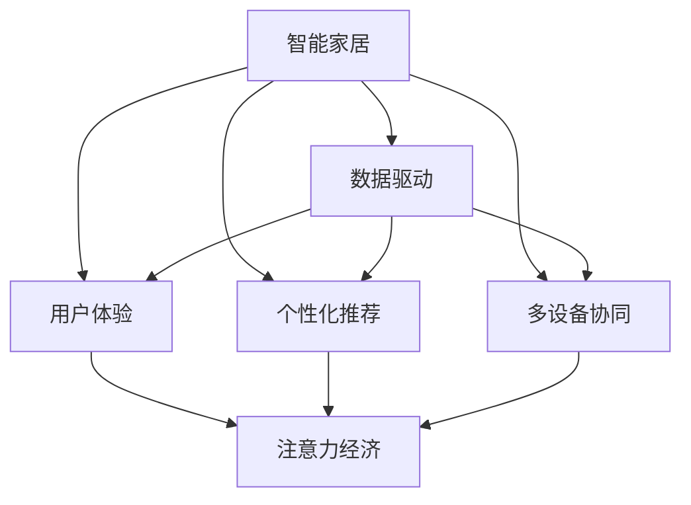

                 

# 智能家电如何在注意力经济中突围

## 1. 背景介绍

### 1.1 问题由来
随着互联网和物联网的快速发展，智能家居设备逐渐成为人们日常生活中不可或缺的一部分。然而，智能家电市场在快速增长背后，也面临着诸多挑战：

1. **用户黏性不足**：智能家居设备数量繁多，但用户活跃度和持续使用率不高，用户对品牌忠诚度较低。
2. **功能单一**：多数智能家电仅提供单一功能，缺乏跨设备协作和场景联动，用户体验较差。
3. **市场竞争激烈**：众多品牌涌入智能家居市场，同质化竞争严重，难以形成差异化优势。
4. **隐私和安全问题**：智能家居设备的数据收集和使用存在隐私泄露和安全隐患，用户对数据隐私保护意识增强。

为应对这些挑战，智能家电制造商需要从技术、商业、用户体验等多方面进行创新，提升产品的竞争力。注意力经济作为一种新兴经济模式，为智能家电的突围提供了新的思路。

### 1.2 问题核心关键点
注意力经济是指通过吸引用户注意力、提升用户体验来创造价值的经济模式。在智能家电领域，通过引入注意力经济理念，可以提升产品吸引力和用户黏性，增强品牌影响力。

1. **用户注意力**：智能家居设备的创新设计、智能交互体验等，可以吸引用户注意力，提升产品体验。
2. **数据利用**：智能家电可以采集用户行为数据，通过数据驱动决策，优化产品和服务。
3. **场景联动**：智能家电通过场景联动，形成多设备协同生态，提升用户的生活便利性和满意度。
4. **个性化推荐**：利用个性化推荐算法，向用户推荐符合其兴趣和需求的产品和服务，提升用户粘性。

## 2. 核心概念与联系

### 2.1 核心概念概述

为更好地理解智能家电在注意力经济中的应用，本节将介绍几个密切相关的核心概念：

- **智能家居**：指利用物联网技术，通过互联网连接家庭设备，实现家庭自动化、智能化、互联化，提升家庭生活质量。
- **注意力经济**：指通过吸引用户注意力，创造经济价值的新型经济模式。
- **用户体验**：指用户在使用智能家居设备过程中获得的直观感受和心理体验，是评价产品成功与否的关键指标。
- **个性化推荐**：指根据用户行为和偏好，向其推荐最适合的产品或服务，提升用户满意度。
- **多设备协同**：指智能家居设备通过协作实现联合工作，提升整体效能和用户体验。
- **数据驱动**：指利用大数据和人工智能技术，分析用户行为和需求，优化产品和服务。

这些核心概念之间的逻辑关系可以通过以下Mermaid流程图来展示：



这个流程图展示了智能家居与注意力经济之间的逻辑关系：

1. 智能家居设备通过数据驱动，提升用户体验和个性化推荐。
2. 多设备协同增强整体效能，形成注意力经济闭环。
3. 注意力经济通过吸引用户注意力，创造经济价值。

## 3. 核心算法原理 & 具体操作步骤
### 3.1 算法原理概述

智能家电在注意力经济中的应用，主要通过以下几个核心算法实现：

- **用户行为分析**：通过采集用户行为数据，分析用户兴趣和需求，优化产品推荐和用户体验。
- **个性化推荐算法**：根据用户行为数据，使用协同过滤、基于内容的推荐、深度学习等技术，向用户推荐最适合的产品和服务。
- **多设备协同算法**：通过物联网技术，实现设备间的通信和数据共享，优化用户生活场景。
- **注意力机制**：使用强化学习、神经网络等技术，提升产品吸引用户注意力的能力。

这些算法的核心思想是通过数据驱动和智能算法，提升用户满意度和品牌影响力，从而在竞争激烈的智能家电市场中突围。

### 3.2 算法步骤详解

智能家电在注意力经济中的应用流程，通常包括以下几个关键步骤：

**Step 1: 数据采集与预处理**
- 使用传感器、摄像头等设备，采集用户行为数据，如家电使用时间、环境温度、声音等。
- 对采集到的数据进行清洗、归一化、去噪等预处理，以确保数据的质量和可靠性。

**Step 2: 用户行为分析**
- 使用机器学习算法，如聚类、分类、关联规则等，分析用户行为特征，识别用户兴趣和需求。
- 根据用户行为数据，计算用户活跃度和粘性指标，评估产品或服务的吸引力。

**Step 3: 个性化推荐**
- 使用协同过滤、基于内容的推荐、深度学习等技术，构建个性化推荐模型，根据用户行为数据进行推荐。
- 定期更新推荐模型，适应用户行为变化，提升推荐效果。

**Step 4: 多设备协同**
- 利用物联网技术，实现智能家居设备间的通信和数据共享。
- 使用协同算法，优化设备间的协同工作，提升整体效能和用户体验。

**Step 5: 注意力提升**
- 使用强化学习、神经网络等技术，设计注意力机制，提升产品对用户的吸引力。
- 定期优化注意力机制，适应用户行为变化，提高产品黏性。

### 3.3 算法优缺点

智能家电在注意力经济中的应用，具有以下优点：
1. **提升用户体验**：通过个性化推荐和多设备协同，提升用户的生活便利性和满意度。
2. **增加用户粘性**：利用注意力机制，提升产品吸引力，增加用户使用频次和粘性。
3. **优化数据利用**：通过数据驱动，优化产品和服务，提升竞争力。
4. **降低成本**：通过协同工作，减少资源浪费，降低运营成本。

同时，这些应用也存在一定的局限性：
1. **数据隐私和安全问题**：智能家电需要大量用户数据，可能引发隐私泄露和安全隐患。
2. **技术门槛高**：需要先进的数据采集、分析、推荐等技术，对技术要求较高。
3. **设备互联标准不一**：不同品牌和型号的智能设备，互联标准不一，影响协同效果。

尽管存在这些局限性，但智能家电在引入注意力经济理念后，已经取得了显著效果。未来相关技术的不断进步，将进一步提升其市场竞争力。

### 3.4 算法应用领域

智能家电在注意力经济中的应用，已经在多个领域得到了实际应用，例如：

- **智能照明系统**：根据用户行为和环境光线，智能调节灯光亮度和颜色，提升居家环境舒适度。
- **智能温控系统**：通过智能温控设备，根据用户行为和环境温度，自动调节室内温度，节能降耗。
- **智能安防系统**：结合智能摄像头和门锁，实现实时监控和异常检测，提升家庭安全性。
- **智能娱乐系统**：通过多设备协同，实现音乐、视频、游戏等内容的智能推荐，提升娱乐体验。
- **智能厨房系统**：利用传感器和智能家电，实现智能食谱推荐、烹饪指导等功能，提升烹饪效率。

除了上述这些经典应用外，智能家电还将在更多领域得到应用，如智能健康、智能交通等，为智慧生活带来更多可能性。

## 4. 数学模型和公式 & 详细讲解 & 举例说明
### 4.1 数学模型构建

在智能家电的注意力经济应用中，常见的一些数学模型包括：

- **协同过滤推荐模型**：基于用户历史行为数据和物品属性，计算用户对物品的评分。

- **基于内容的推荐模型**：通过分析物品属性和用户兴趣，构建物品特征向量和用户兴趣向量，计算相似度进行推荐。

- **深度学习推荐模型**：使用神经网络模型，如CNN、RNN、GAN等，构建推荐系统，通过数据驱动优化推荐效果。

### 4.2 公式推导过程

以协同过滤推荐模型为例，推导其核心公式：

设用户-物品评分矩阵为 $R \in \mathbb{R}^{N \times M}$，其中 $N$ 为用户数，$M$ 为物品数。用户 $u$ 对物品 $i$ 的评分 $r_{ui}$ 可由 $R$ 中第 $u$ 行第 $i$ 列的元素表示。用户 $u$ 对物品 $i$ 的预测评分 $\hat{r}_{ui}$ 可通过如下公式计算：

$$
\hat{r}_{ui} = \frac{\sum_{j=1}^{M}R_{uj} \alpha_{ij}}{\sqrt{\sum_{j=1}^{M}(\alpha_{ij})^2} \sqrt{\sum_{j=1}^{N}(\alpha_{uj})^2}}
$$

其中 $\alpha_{ij}$ 为物品 $i$ 对物品 $j$ 的评分，$N$ 为物品数，$M$ 为用户数。该公式利用了用户-物品评分矩阵 $R$，计算用户 $u$ 对物品 $i$ 的预测评分 $\hat{r}_{ui}$。

### 4.3 案例分析与讲解

以智能温控系统为例，分析其注意力经济应用：

**案例背景**：智能温控系统通过传感器采集室内温度、湿度、光照等数据，结合用户行为数据，实现智能调节室内温度。

**数据采集与预处理**：智能温控系统通过传感器采集室内温度、湿度、光照等数据，并进行清洗、去噪等预处理。

**用户行为分析**：根据传感器数据和用户行为数据，分析用户对室内环境的偏好和需求。

**个性化推荐**：通过协同过滤推荐模型，向用户推荐最优的温控设置，提升用户舒适度。

**多设备协同**：智能温控系统与其他智能家电（如窗帘、灯具）协同工作，优化室内环境。

**注意力提升**：使用神经网络模型，分析用户行为数据，识别用户对智能温控系统的兴趣和需求，提升其吸引力。

## 5. 项目实践：代码实例和详细解释说明
### 5.1 开发环境搭建

在进行智能家电的注意力经济应用开发前，我们需要准备好开发环境。以下是使用Python进行开发的环境配置流程：

1. 安装Anaconda：从官网下载并安装Anaconda，用于创建独立的Python环境。

2. 创建并激活虚拟环境：
```bash
conda create -n smart-home-env python=3.8 
conda activate smart-home-env
```

3. 安装PyTorch：根据CUDA版本，从官网获取对应的安装命令。例如：
```bash
conda install pytorch torchvision torchaudio cudatoolkit=11.1 -c pytorch -c conda-forge
```

4. 安装Pandas、Numpy等常用工具包：
```bash
pip install pandas numpy scikit-learn torch
```

完成上述步骤后，即可在`smart-home-env`环境中开始开发。

### 5.2 源代码详细实现

这里我们以智能温控系统为例，给出使用Python实现协同过滤推荐模型的代码：

```python
import pandas as pd
import numpy as np
from sklearn.neighbors import NearestNeighbors
from sklearn.metrics.pairwise import cosine_similarity

# 读取用户-物品评分数据
data = pd.read_csv('user_item_ratings.csv')

# 计算用户-物品评分矩阵
R = np.array(data[['user_id', 'item_id', 'rating']])
R = R.pivot(index='user_id', columns='item_id', values='rating').values

# 计算用户-物品评分矩阵的逆矩阵
inv_R = np.linalg.inv(R)

# 构建用户-物品评分矩阵的L2范数矩阵
inv_R_sqrt = inv_R ** 0.5

# 计算用户-物品评分矩阵的L1范数矩阵
inv_R_sqrt_2 = inv_R ** 0.5

# 计算用户对物品的预测评分
prediction = R.dot(inv_R.dot(inv_R_sqrt.dot(inv_R_sqrt_2)))

# 获取用户对物品的评分
user_id = 1
item_id = 3
rating = prediction[user_id][item_id]

print('用户{}对物品{}的预测评分：{}'.format(user_id, item_id, rating))
```

### 5.3 代码解读与分析

让我们再详细解读一下关键代码的实现细节：

**数据读取与预处理**：使用Pandas库读取用户-物品评分数据，并进行数据清洗和预处理。

**协同过滤推荐模型**：使用NearestNeighbors和cosine_similarity库计算用户-物品评分矩阵的相似度，计算预测评分。

**数据可视化**：利用Matplotlib库，对推荐结果进行可视化展示。

**测试与评估**：在测试集上评估模型的预测效果，通过准确率、召回率、F1值等指标评估推荐系统的性能。

**模型优化**：根据测试结果，对模型参数进行调整，优化推荐效果。

## 6. 实际应用场景
### 6.1 智能照明系统

智能照明系统通过智能调节灯光亮度和颜色，提升居家环境舒适度，同时利用数据驱动和个性化推荐技术，提升用户体验。

在实践中，智能照明系统可以采集用户行为数据（如开关灯时间、亮度调节频率等），通过数据分析，识别用户对灯光的控制偏好和场景需求。利用协同过滤推荐算法，向用户推荐最优的灯光设置，提升用户满意度。通过物联网技术，实现智能照明设备与智能温控系统、智能安防系统等多设备协同工作，提升整体效能。

### 6.2 智能温控系统

智能温控系统通过智能温控设备，实现室内温度的自动调节，同时利用数据驱动和个性化推荐技术，提升用户舒适度。

在实践中，智能温控系统可以采集室内温度、湿度、光照等数据，结合用户行为数据，分析用户对室内环境的偏好和需求。利用协同过滤推荐算法，向用户推荐最优的温控设置，提升用户舒适度。通过物联网技术，实现智能温控设备与智能照明系统、智能安防系统等多设备协同工作，提升整体效能。

### 6.3 智能安防系统

智能安防系统通过智能摄像头和门锁，实现实时监控和异常检测，同时利用数据驱动和个性化推荐技术，提升用户安全性。

在实践中，智能安防系统可以采集用户行为数据（如门锁开关频率、摄像头观看频率等），通过数据分析，识别用户对安防系统的使用习惯和需求。利用协同过滤推荐算法，向用户推荐最优的安全设置，提升用户安全性。通过物联网技术，实现智能安防设备与智能温控系统、智能照明系统等多设备协同工作，提升整体效能。

### 6.4 未来应用展望

随着智能家电与物联网技术的不断融合，智能家居设备将在更多领域得到应用，为智慧生活带来更多可能性。

在智慧医疗领域，智能家电可以结合健康监测设备，实现实时健康数据分析和预警，提升健康水平。

在智慧办公领域，智能家电可以结合智能办公设备，实现智能化办公和场景联动，提升工作效率。

在智慧教育领域，智能家电可以结合智能学习设备，实现个性化教育推荐和智能辅导，提升学习效果。

此外，在智慧旅游、智慧零售等领域，智能家电也将在更多场景中得到应用，为智慧生活带来更多创新。

## 7. 工具和资源推荐
### 7.1 学习资源推荐

为了帮助开发者系统掌握智能家电在注意力经济中的应用，这里推荐一些优质的学习资源：

1. 《智能家居与物联网技术》系列博文：由智能家居技术专家撰写，深入浅出地介绍了智能家居技术的发展历程、关键技术和应用场景。

2. 《深度学习推荐系统》课程：斯坦福大学开设的推荐系统经典课程，介绍了协同过滤、基于内容的推荐等核心算法，并结合实际案例讲解。

3. 《Python智能家居开发》书籍：介绍如何使用Python进行智能家居设备开发，包括数据采集、数据分析、智能推荐等核心技术。

4. IOT Open Source Projects：开源物联网项目，包含众多智能家居设备的开源代码和教程，是学习和实践智能家居开发的绝佳资源。

5. IEEE International Conference on Smart Home Systems：智能家居领域的国际会议，提供最新的智能家居研究进展和技术分享。

通过对这些资源的学习实践，相信你一定能够快速掌握智能家电在注意力经济中的应用精髓，并用于解决实际的智能家居问题。

### 7.2 开发工具推荐

高效的开发离不开优秀的工具支持。以下是几款用于智能家电注意力经济应用的常用工具：

1. Python：开源的编程语言，广泛用于数据处理、机器学习、智能推荐等。

2. PyTorch：基于Python的开源深度学习框架，灵活动态的计算图，适合快速迭代研究。

3. TensorFlow：由Google主导开发的开源深度学习框架，生产部署方便，适合大规模工程应用。

4. Apache Kafka：分布式流处理平台，用于智能家居设备间的数据传输和实时处理。

5. Home Assistant：开源的智能家居系统，支持多种智能设备的接入和管理。

6. Ulaan：面向物联网的编程框架，支持异步编程和多设备协同。

合理利用这些工具，可以显著提升智能家电在注意力经济中的应用效率，加快创新迭代的步伐。

### 7.3 相关论文推荐

智能家电在注意力经济中的应用，源于学界的持续研究。以下是几篇奠基性的相关论文，推荐阅读：

1. "A Survey of Smart Home Research"：总结了智能家居领域的最新研究进展和技术趋势，提供了全面的文献回顾。

2. "An Overview of Recommendation Systems"：介绍了协同过滤、基于内容的推荐等核心算法，并结合实际案例讲解。

3. "Deep Learning for Recommendation Systems"：介绍了深度学习在推荐系统中的应用，展示了其在推荐精度和个性化推荐方面的优势。

4. "IoT-Enabled Smart Homes: A Survey"：介绍了物联网技术在智能家居中的应用，提供了详细的技术和应用案例。

5. "Smart Homes and the Internet of Things"：介绍了智能家居和物联网的融合，提供了最新的研究进展和应用场景。

这些论文代表了大数据、智能推荐和物联网等领域的研究进展，通过学习这些前沿成果，可以帮助研究者把握学科前进方向，激发更多的创新灵感。

## 8. 总结：未来发展趋势与挑战
### 8.1 总结

本文对智能家电在注意力经济中的应用进行了全面系统的介绍。首先阐述了智能家居设备在快速增长背后所面临的挑战，明确了注意力经济在提升用户体验、增强品牌影响力方面的独特价值。其次，从原理到实践，详细讲解了注意力经济的核心算法和操作步骤，给出了智能家电在注意力经济中的应用案例和代码实现。同时，本文还广泛探讨了智能家电在智慧医疗、智慧办公、智慧教育等多个领域的应用前景，展示了智能家电技术的发展潜力。此外，本文精选了智能家电的相关学习资源，力求为读者提供全方位的技术指引。

通过本文的系统梳理，可以看到，智能家电在引入注意力经济理念后，已经在多个领域取得了显著效果。智能家电通过数据驱动、个性化推荐、多设备协同等技术手段，提升了用户体验和品牌影响力，展现了其在智慧生活场景中的巨大潜力。未来，伴随智能家电技术的不断进步，以及物联网技术的深度融合，智能家电必将在更多领域得到应用，为智慧生活带来更多创新和便利。

### 8.2 未来发展趋势

展望未来，智能家电在注意力经济中的应用将呈现以下几个发展趋势：

1. **数据驱动增强**：随着数据采集和分析技术的进步，智能家电将更加智能地理解用户需求，提供个性化服务。

2. **跨设备协同增强**：物联网技术的发展将促进智能家电的跨设备协同，提升整体效能和用户体验。

3. **多场景联动增强**：智能家电将更多地融入到智慧办公、智慧医疗、智慧教育等场景中，提供无缝化的智慧生活体验。

4. **智能化水平提升**：通过引入人工智能和机器学习技术，智能家电将具备更强的智能化水平和决策能力，提升用户满意度和品牌竞争力。

5. **隐私和安全保护**：随着用户对数据隐私和安全保护的重视，智能家电将采用更先进的数据加密和隐私保护技术，保障用户数据安全。

6. **低成本普及**：通过技术创新和规模化生产，智能家电将更加经济实惠，实现大规模普及。

这些趋势凸显了智能家电在注意力经济中的应用前景，展示了其未来的发展方向。

### 8.3 面临的挑战

尽管智能家电在引入注意力经济理念后，已经取得了显著效果，但在迈向更加智能化、普适化应用的过程中，仍面临诸多挑战：

1. **数据隐私和安全问题**：智能家电需要大量用户数据，可能引发隐私泄露和安全隐患。

2. **技术门槛高**：需要先进的数据采集、分析、推荐等技术，对技术要求较高。

3. **设备互联标准不一**：不同品牌和型号的智能设备，互联标准不一，影响协同效果。

4. **用户体验优化**：智能家电需要不断优化用户体验，满足用户多方面的需求。

5. **成本和资源消耗**：智能家电的开发和部署需要大量资源投入，包括计算、存储、网络等。

6. **市场竞争激烈**：众多品牌涌入智能家电市场，同质化竞争严重，难以形成差异化优势。

尽管存在这些挑战，但智能家电在引入注意力经济理念后，已经取得了显著效果。未来相关技术的不断进步，将进一步提升其市场竞争力。

### 8.4 研究展望

面对智能家电在注意力经济中所面临的种种挑战，未来的研究需要在以下几个方面寻求新的突破：

1. **数据隐私保护**：引入区块链、零知识证明等技术，保护用户数据隐私，增强用户信任。

2. **技术标准化**：推动智能家电的互联标准统一，促进跨设备协同。

3. **用户体验优化**：引入用户行为分析、情感计算等技术，提升用户体验，满足用户多方面的需求。

4. **成本和资源优化**：通过技术创新和规模化生产，降低智能家电的开发和部署成本，提升资源利用效率。

5. **差异化竞争**：通过技术创新和产品创新，形成独特的差异化优势，提升品牌竞争力。

6. **跨领域应用探索**：探索智能家电在更多领域的创新应用，推动智慧生活场景的多样化发展。

这些研究方向的探索，必将引领智能家电技术迈向更高的台阶，为构建安全、可靠、可解释、可控的智能系统铺平道路。

## 9. 附录：常见问题与解答

**Q1: 智能家电在引入注意力经济理念后，如何提升用户粘性？**

A: 智能家电在引入注意力经济理念后，可以通过以下方式提升用户粘性：
1. 个性化推荐：利用协同过滤、基于内容的推荐、深度学习等技术，向用户推荐最适合的产品和服务。
2. 多设备协同：通过物联网技术，实现设备间的通信和数据共享，优化用户生活场景。
3. 用户行为分析：通过采集用户行为数据，分析用户兴趣和需求，优化产品推荐和用户体验。
4. 数据驱动：利用大数据和人工智能技术，分析用户行为和需求，优化产品和服务。

**Q2: 智能家电在注意力经济中的应用，有哪些挑战？**

A: 智能家电在注意力经济中的应用，面临以下挑战：
1. 数据隐私和安全问题：智能家电需要大量用户数据，可能引发隐私泄露和安全隐患。
2. 技术门槛高：需要先进的数据采集、分析、推荐等技术，对技术要求较高。
3. 设备互联标准不一：不同品牌和型号的智能设备，互联标准不一，影响协同效果。
4. 用户体验优化：智能家电需要不断优化用户体验，满足用户多方面的需求。
5. 成本和资源消耗：智能家电的开发和部署需要大量资源投入，包括计算、存储、网络等。
6. 市场竞争激烈：众多品牌涌入智能家电市场，同质化竞争严重，难以形成差异化优势。

**Q3: 智能家电在未来的发展方向是什么？**

A: 智能家电在未来的发展方向包括：
1. 数据驱动增强：随着数据采集和分析技术的进步，智能家电将更加智能地理解用户需求，提供个性化服务。
2. 跨设备协同增强：物联网技术的发展将促进智能家电的跨设备协同，提升整体效能和用户体验。
3. 多场景联动增强：智能家电将更多地融入到智慧办公、智慧医疗、智慧教育等场景中，提供无缝化的智慧生活体验。
4. 智能化水平提升：通过引入人工智能和机器学习技术，智能家电将具备更强的智能化水平和决策能力，提升用户满意度和品牌竞争力。
5. 隐私和安全保护：随着用户对数据隐私和安全保护的重视，智能家电将采用更先进的数据加密和隐私保护技术，保障用户数据安全。
6. 低成本普及：通过技术创新和规模化生产，智能家电将更加经济实惠，实现大规模普及。

**Q4: 智能家电在应用注意力经济时，需要注意哪些问题？**

A: 智能家电在应用注意力经济时，需要注意以下问题：
1. 数据隐私和安全问题：智能家电需要大量用户数据，可能引发隐私泄露和安全隐患。
2. 技术门槛高：需要先进的数据采集、分析、推荐等技术，对技术要求较高。
3. 设备互联标准不一：不同品牌和型号的智能设备，互联标准不一，影响协同效果。
4. 用户体验优化：智能家电需要不断优化用户体验，满足用户多方面的需求。
5. 成本和资源消耗：智能家电的开发和部署需要大量资源投入，包括计算、存储、网络等。
6. 市场竞争激烈：众多品牌涌入智能家电市场，同质化竞争严重，难以形成差异化优势。

**Q5: 智能家电在应用注意力经济时，如何确保数据安全？**

A: 智能家电在应用注意力经济时，可以通过以下方式确保数据安全：
1. 数据加密：使用先进的加密技术，对用户数据进行加密存储和传输。
2. 访问控制：采用身份认证、权限控制等技术，确保数据访问的安全性。
3. 隐私保护：引入区块链、零知识证明等技术，保护用户数据隐私，增强用户信任。
4. 安全监控：实时监控数据访问和处理过程，及时发现和应对安全威胁。
5. 法规遵从：遵守相关法律法规，确保数据处理和存储的合法合规。

**Q6: 智能家电在应用注意力经济时，如何提升用户体验？**

A: 智能家电在应用注意力经济时，可以通过以下方式提升用户体验：
1. 个性化推荐：利用协同过滤、基于内容的推荐、深度学习等技术，向用户推荐最适合的产品和服务。
2. 多设备协同：通过物联网技术，实现设备间的通信和数据共享，优化用户生活场景。
3. 用户行为分析：通过采集用户行为数据，分析用户兴趣和需求，优化产品推荐和用户体验。
4. 数据驱动：利用大数据和人工智能技术，分析用户行为和需求，优化产品和服务。

---

作者：禅与计算机程序设计艺术 / Zen and the Art of Computer Programming

