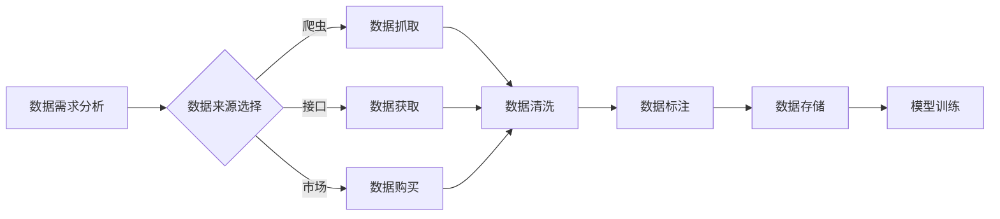

> 大模型、数据获取、数据标注、数据清洗、数据安全、数据隐私

## 1. 背景介绍

近年来，大模型技术蓬勃发展，取得了令人瞩目的成就。从自然语言处理到计算机视觉，从药物研发到科学发现，大模型正在深刻地改变着我们生活的方方面面。然而，大模型的训练和应用离不开海量高质量的数据支撑。数据获取成为了制约大模型发展的一大瓶颈。

大模型的训练数据通常需要满足以下几个关键条件：

* **海量**: 大模型通常需要训练数十亿甚至数千亿个参数，因此需要海量的数据来保证模型的泛化能力和性能。
* **高质量**: 数据的质量直接影响模型的训练效果。噪声、错误、不完整的数据都会导致模型训练不稳定，甚至产生错误的结果。
* **相关性**: 数据需要与模型的应用场景相关，才能有效地提升模型的性能。

然而，现实世界中高质量、相关的大数据往往难以获取。

## 2. 核心概念与联系

### 2.1 数据获取的挑战

数据获取的挑战主要体现在以下几个方面：

* **数据分散**: 数据通常分布在不同的平台、系统和数据库中，难以进行整合和统一管理。
* **数据格式多样**: 数据的格式多种多样，例如文本、图像、音频、视频等，需要进行格式转换和标准化处理。
* **数据标注成本高**: 许多大模型需要进行标注训练，例如图像识别、自然语言理解等，标注数据的成本很高，且需要专业的人员进行操作。
* **数据安全和隐私问题**: 数据的安全性、隐私性和合规性是需要特别关注的问题，需要采取相应的措施进行保护。

### 2.2 数据获取的解决方案

为了解决数据获取的挑战，业界提出了多种解决方案，例如：

* **数据爬虫**: 利用爬虫技术自动从互联网上抓取数据。
* **数据接口**: 通过数据接口获取第三方平台的数据。
* **数据市场**: 从数据市场购买预处理好的数据。
* **数据合成**: 利用生成模型合成新的数据。
* **联邦学习**: 在不共享原始数据的情况下，利用分布式训练的方式进行模型训练。

**数据获取流程图**



## 3. 核心算法原理 & 具体操作步骤

### 3.1 算法原理概述

数据获取算法主要包括数据爬虫、数据接口调用、数据市场购买、数据合成和联邦学习等。

* **数据爬虫**: 利用网络协议和网页解析技术自动抓取网页内容。
* **数据接口**: 通过API调用获取第三方平台的数据。
* **数据市场**: 从数据市场购买预处理好的数据。
* **数据合成**: 利用生成模型合成新的数据。
* **联邦学习**: 在不共享原始数据的情况下，利用分布式训练的方式进行模型训练。

### 3.2 算法步骤详解

**数据爬虫算法步骤**:

1. **目标网站分析**: 分析目标网站的结构、内容和爬取规则。
2. **抓取策略设计**: 设计爬取策略，包括抓取范围、抓取频率、抓取深度等。
3. **爬虫程序开发**: 开发爬虫程序，实现网页抓取、数据解析和数据存储等功能。
4. **数据清洗**: 对抓取到的数据进行清洗，去除重复数据、无效数据和噪声数据。
5. **数据存储**: 将清洗后的数据存储到数据库或文件系统中。

**数据接口调用算法步骤**:

1. **接口文档分析**: 分析目标平台的接口文档，了解接口参数、返回值和使用规范。
2. **接口调用代码开发**: 开发接口调用代码，实现接口请求、数据解析和数据存储等功能。
3. **数据清洗**: 对接口返回的数据进行清洗，去除重复数据、无效数据和噪声数据。
4. **数据存储**: 将清洗后的数据存储到数据库或文件系统中。

### 3.3 算法优缺点

**数据爬虫算法**:

* **优点**: 可以获取大量公开数据，成本相对较低。
* **缺点**: 容易受到网站反爬机制的限制，数据质量难以保证。

**数据接口调用算法**:

* **优点**: 数据质量相对较高，可以获取结构化数据。
* **缺点**: 需要付费使用，接口调用次数有限制。

### 3.4 算法应用领域

数据获取算法广泛应用于以下领域:

* **搜索引擎**: 收集网页数据，构建索引，实现搜索功能。
* **电商平台**: 收集商品信息、用户评论等数据，进行商品推荐、价格分析等。
* **社交媒体**: 收集用户行为数据、舆情信息等数据，进行用户画像、内容分析等。
* **金融行业**: 收集市场数据、交易数据等数据，进行风险管理、投资决策等。

## 4. 数学模型和公式 & 详细讲解 & 举例说明

### 4.1 数学模型构建

数据获取过程可以抽象为一个数学模型，其中数据源可以看作是一个集合，数据获取算法可以看作是一个映射函数，将数据源中的数据映射到目标数据集合中。

**数据获取模型**:

$$
D_t = f(S, A)
$$

其中:

* $D_t$ 表示目标数据集合。
* $S$ 表示数据源集合。
* $A$ 表示数据获取算法。
* $f$ 表示数据获取算法的映射函数。

### 4.2 公式推导过程

数据获取算法的映射函数 $f$ 的具体形式取决于具体的算法类型。例如，数据爬虫算法的映射函数可以表示为:

$$
f(S, A) = \text{爬取}(S, A)
$$

其中 $\text{爬取}(S, A)$ 表示爬取算法对数据源 $S$ 的爬取操作，根据爬取策略 $A$ 提取目标数据。

### 4.3 案例分析与讲解

假设我们想要获取某个电商平台上所有商品的名称和价格数据。我们可以使用数据爬虫算法进行数据获取。

1. **目标网站分析**: 分析电商平台的网页结构，找到商品信息所在的页面元素。
2. **抓取策略设计**: 设计爬取策略，包括抓取范围（所有商品页面）、抓取频率（每小时抓取一次）、抓取深度（只抓取商品信息页面）。
3. **爬虫程序开发**: 开发爬虫程序，利用网页解析技术提取商品名称和价格信息。
4. **数据清洗**: 对爬取到的数据进行清洗，去除重复数据、无效数据和噪声数据。
5. **数据存储**: 将清洗后的数据存储到数据库或文件系统中。

## 5. 项目实践：代码实例和详细解释说明

### 5.1 开发环境搭建

* Python 3.x
* Requests 库
* Beautiful Soup 4 库
* Pandas 库
* MySQL 或 PostgreSQL 数据库

### 5.2 源代码详细实现

```python
import requests
from bs4 import BeautifulSoup
import pandas as pd

# 目标网站URL
url = 'https://www.example.com/products'

# 发送HTTP请求获取网页内容
response = requests.get(url)

# 解析网页内容
soup = BeautifulSoup(response.content, 'html.parser')

# 提取商品名称和价格信息
products = []
for item in soup.find_all('div', class_='product'):
    name = item.find('h2').text.strip()
    price = item.find('span', class_='price').text.strip()
    products.append({'name': name, 'price': price})

# 将数据存储到DataFrame中
df = pd.DataFrame(products)

# 将DataFrame存储到MySQL数据库中
df.to_sql('products', con=engine, if_exists='replace', index=False)
```

### 5.3 代码解读与分析

* 使用 `requests` 库发送HTTP请求获取网页内容。
* 使用 `BeautifulSoup` 库解析网页内容，找到商品信息所在的页面元素。
* 使用循环遍历页面元素，提取商品名称和价格信息。
* 使用 `pandas` 库将数据存储到DataFrame中。
* 使用 `MySQL` 或 `PostgreSQL` 数据库连接，将DataFrame存储到数据库中。

### 5.4 运行结果展示

运行代码后，将生成一个名为 `products` 的数据库表，其中包含所有商品的名称和价格信息。

## 6. 实际应用场景

### 6.1 数据爬虫应用场景

* **搜索引擎**: 收集网页数据，构建索引，实现搜索功能。
* **电商平台**: 收集商品信息、用户评论等数据，进行商品推荐、价格分析等。
* **新闻网站**: 收集新闻文章、图片、视频等数据，进行新闻聚合、舆情分析等。

### 6.2 数据接口调用应用场景

* **天气预报**: 调用天气API获取天气数据，进行天气预报和天气提醒。
* **地图导航**: 调用地图API获取地图数据，进行路线规划和导航服务。
* **金融交易**: 调用金融API获取股票、基金、外汇等数据，进行投资决策和风险管理。

### 6.3 数据市场应用场景

* **大数据分析**: 从数据市场购买海量数据，进行大数据分析和挖掘。
* **机器学习**: 从数据市场购买标注数据，进行机器学习模型训练。
* **人工智能研究**: 从数据市场购买特定领域的专业数据，进行人工智能研究和开发。

### 6.4 未来应用展望

随着大模型技术的不断发展，数据获取将变得更加重要。未来，数据获取技术将朝着以下方向发展:

* **自动化**: 利用人工智能技术自动完成数据获取、清洗和标注等流程。
* **智能化**: 利用机器学习技术智能识别数据需求，并选择最合适的获取方式。
* **隐私保护**: 利用联邦学习等技术，在不共享原始数据的情况下进行数据获取和模型训练。

## 7. 工具和资源推荐

### 7.1 学习资源推荐

* **书籍**:
    * 《网络爬虫实战》
    * 《Python数据分析实战》
    * 《机器学习实战》
* **在线课程**:
    * Coursera: 数据科学
    * Udemy: Python编程
    * edX: 机器学习

### 7.2 开发工具推荐

* **Python**: 爬虫、数据处理、机器学习
* **Requests**: 发送HTTP请求
* **Beautiful Soup**: 解析网页内容
* **Pandas**: 数据分析和处理
* **Scrapy**: 爬虫框架

### 7.3 相关论文推荐

* **数据爬虫**:
    * "Web Scraping with Python"
    * "A Survey of Web Scraping Techniques"
* **数据接口调用**:
    * "RESTful Web Services"
    * "API Design Principles"
* **数据市场**:
    * "The Rise of Data Markets"
    * "Data Marketplace Platforms: A Survey"

## 8. 总结：未来发展趋势与挑战

### 8.1 研究成果总结

数据获取技术已经取得了显著的进展，为大模型的训练和应用提供了重要的数据支撑。

### 8.2 未来发展趋势

数据获取技术将朝着自动化、智能化、隐私保护的方向发展。

### 8.3 面临的挑战

数据获取仍然面临着许多挑战，例如数据分散、数据格式多样、数据标注成本高、数据安全和隐私问题等。

### 8.4 研究展望

未来，需要进一步研究数据获取算法的效率、鲁棒性和安全性，以及如何更好地解决数据获取中的伦理和法律问题。

## 9. 附录：常见问题与解答

### 9.1 如何选择合适的爬虫工具？

选择爬虫工具需要根据具体的需求进行选择。例如，对于简单的爬虫任务，可以使用Requests和Beautiful Soup等工具；对于复杂的爬虫任务，可以使用Scrapy等爬虫框架。