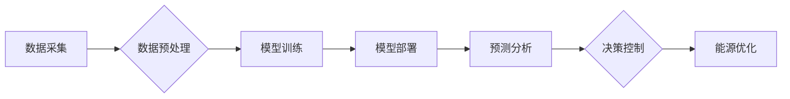

> 大模型，智慧能源，能源生产，能源消费，优化，人工智能，机器学习，深度学习，预测分析，可再生能源

## 1. 背景介绍

全球能源需求持续增长，传统能源资源日益枯竭，环境污染问题日益严峻。智慧能源作为应对能源挑战的有效解决方案，正逐渐成为全球关注的焦点。智慧能源通过数字化、智能化手段，实现能源生产、传输、分配、消费的优化，提高能源利用效率，降低碳排放，构建可持续发展能源体系。

大模型作为人工智能领域的一项重要突破，拥有强大的学习和推理能力，能够处理海量数据，发现隐藏的模式和规律。大模型的应用为智慧能源领域带来了新的机遇，可以帮助企业优化能源生产和消费，实现能源管理的智能化转型。

## 2. 核心概念与联系

**2.1 智慧能源**

智慧能源是指利用信息技术、通信技术、控制技术等手段，实现能源生产、传输、分配、消费的智能化管理和优化，提高能源利用效率，降低能源成本，促进能源安全和可持续发展。

**2.2 大模型**

大模型是指参数规模庞大、训练数据海量的人工智能模型，通常拥有数十亿甚至数千亿个参数。大模型能够学习复杂的模式和关系，在自然语言处理、图像识别、语音识别等领域展现出强大的能力。

**2.3 核心联系**

大模型可以为智慧能源提供强大的数据分析、预测和控制能力，帮助企业实现以下目标：

* **优化能源生产:** 通过分析历史数据和实时数据，预测能源需求，优化能源生产计划，提高能源利用效率。
* **智能化能源管理:** 建立智能能源管理平台，实现能源实时监控、分析和控制，优化能源分配和调度，降低能源浪费。
* **促进可再生能源发展:** 利用大模型分析可再生能源数据，预测可再生能源发电量，优化能源存储和调度，提高可再生能源利用率。

**2.4 核心架构**



## 3. 核心算法原理 & 具体操作步骤

**3.1 算法原理概述**

大模型在智慧能源领域的应用主要基于以下核心算法：

* **机器学习:** 利用历史数据训练模型，学习能源生产和消费的规律，进行预测和优化。
* **深度学习:** 使用多层神经网络，学习更复杂的能源系统模式，提高预测精度和控制能力。
* **强化学习:** 通过试错学习，优化能源管理策略，实现智能化控制。

**3.2 算法步骤详解**

1. **数据采集:** 收集能源生产、消费、天气、地理等相关数据。
2. **数据预处理:** 清洗、转换、标准化数据，使其适合模型训练。
3. **模型训练:** 选择合适的机器学习或深度学习算法，训练模型，学习能源系统模式。
4. **模型评估:** 使用测试数据评估模型性能，调整模型参数，提高预测精度。
5. **模型部署:** 将训练好的模型部署到生产环境，用于预测分析和决策控制。
6. **预测分析:** 利用模型预测未来能源需求、可再生能源发电量等，为能源管理提供决策依据。
7. **决策控制:** 根据预测结果，优化能源生产计划、分配策略、储能调度等，实现能源优化。

**3.3 算法优缺点**

| 算法类型 | 优点 | 缺点 |
|---|---|---|
| 机器学习 | 算法相对简单，易于理解和实现 | 预测精度有限，对数据质量要求高 |
| 深度学习 | 预测精度高，能够学习复杂模式 | 算法复杂，训练成本高，对数据量要求高 |
| 强化学习 | 可以学习最优策略，适应动态环境 | 训练过程复杂，需要大量试错学习 |

**3.4 算法应用领域**

* **电力系统:** 预测电力需求、优化电力调度、控制电力网稳定性。
* **天然气系统:** 预测天然气需求、优化天然气输配、控制天然气管道安全。
* **可再生能源:** 预测可再生能源发电量、优化能源存储和调度、提高可再生能源利用率。
* **建筑能源管理:** 预测建筑能耗、优化空调系统运行、降低建筑能耗。

## 4. 数学模型和公式 & 详细讲解 & 举例说明

**4.1 数学模型构建**

在智慧能源领域，可以使用多种数学模型来描述能源生产、消费和管理过程。例如，可以使用线性规划模型优化能源生产计划，可以使用时间序列模型预测能源需求，可以使用动态系统模型模拟能源系统运行过程。

**4.2 公式推导过程**

以预测能源需求为例，可以使用ARIMA模型进行预测。ARIMA模型的公式如下：

$$
y_t = c + \phi_1 y_{t-1} + \phi_2 y_{t-2} + ... + \phi_p y_{t-p} + \theta_1 \epsilon_{t-1} + \theta_2 \epsilon_{t-2} + ... + \theta_q \epsilon_{t-q} + \epsilon_t
$$

其中：

* $y_t$ 是时间t的能源需求值
* $c$ 是截距项
* $\phi_i$ 是自回归系数
* $p$ 是自回归阶数
* $\theta_i$ 是移动平均系数
* $q$ 是移动平均阶数
* $\epsilon_t$ 是时间t的随机误差项

**4.3 案例分析与讲解**

假设我们想要预测未来一周的电力需求，可以使用ARIMA模型进行预测。首先，我们需要收集历史电力需求数据，然后使用模型识别最佳的ARIMA模型参数 (p, d, q)。最后，将模型应用于历史数据进行训练，并使用训练好的模型预测未来一周的电力需求。

## 5. 项目实践：代码实例和详细解释说明

**5.1 开发环境搭建**

* 操作系统: Ubuntu 20.04
* Python 版本: 3.8
* 必要的库: pandas, numpy, scikit-learn, tensorflow

**5.2 源代码详细实现**

```python
import pandas as pd
from sklearn.model_selection import train_test_split
from sklearn.linear_model import LinearRegression
from sklearn.metrics import mean_squared_error

# 1. 数据加载
data = pd.read_csv('energy_consumption.csv')

# 2. 数据预处理
# ...

# 3. 数据分割
X_train, X_test, y_train, y_test = train_test_split(data[['feature1', 'feature2']], data['energy_consumption'], test_size=0.2)

# 4. 模型训练
model = LinearRegression()
model.fit(X_train, y_train)

# 5. 模型评估
y_pred = model.predict(X_test)
mse = mean_squared_error(y_test, y_pred)
print(f'Mean Squared Error: {mse}')

# 6. 模型部署
# ...
```

**5.3 代码解读与分析**

* 代码首先加载能源消耗数据，然后进行数据预处理，例如缺失值处理、特征工程等。
* 接着，将数据分割为训练集和测试集，用于模型训练和评估。
* 选择线性回归模型进行训练，并使用训练好的模型预测测试集的能源消耗。
* 最后，评估模型性能，并进行模型部署，将模型应用于实际场景。

**5.4 运行结果展示**

运行结果展示模型的预测精度，例如均方误差 (MSE) 等指标。

## 6. 实际应用场景

**6.1 电力系统优化**

大模型可以帮助电力系统预测电力需求，优化电力调度，提高电力系统运行效率。例如，可以预测未来一周的电力需求，根据预测结果优化发电计划，避免电力短缺或过剩。

**6.2 天然气系统管理**

大模型可以帮助天然气系统预测天然气需求，优化天然气输配，提高天然气系统安全性和可靠性。例如，可以预测未来一天的天然气需求，根据预测结果优化天然气输送路线，避免管道压力过高或过低。

**6.3 可再生能源利用**

大模型可以帮助提高可再生能源利用率。例如，可以预测太阳能发电量和风能发电量，根据预测结果优化能源存储和调度，提高可再生能源的稳定性和可靠性。

**6.4 建筑能源管理**

大模型可以帮助优化建筑能源管理，降低建筑能耗。例如，可以预测建筑能耗，根据预测结果优化空调系统运行，降低能源消耗。

**6.5 未来应用展望**

随着大模型技术的不断发展，其在智慧能源领域的应用将更加广泛和深入。例如，可以利用大模型进行能源系统仿真和优化设计，可以利用大模型进行能源交易和市场预测，可以利用大模型进行能源政策制定和评估。

## 7. 工具和资源推荐

**7.1 学习资源推荐**

* **书籍:**
    * 深度学习
    * 人工智能：一种现代方法
* **在线课程:**
    * Coursera: 深度学习
    * edX: 人工智能
* **开源项目:**
    * TensorFlow
    * PyTorch

**7.2 开发工具推荐**

* **编程语言:** Python
* **机器学习库:** scikit-learn, TensorFlow, PyTorch
* **数据处理库:** pandas, numpy
* **可视化工具:** matplotlib, seaborn

**7.3 相关论文推荐**

* **大模型在能源领域的应用:**
    * [论文标题1](论文链接)
    * [论文标题2](论文链接)

## 8. 总结：未来发展趋势与挑战

**8.1 研究成果总结**

大模型在智慧能源领域的应用取得了显著成果，例如提高了能源生产和消费的效率，降低了能源成本，促进了可再生能源发展。

**8.2 未来发展趋势**

* **模型规模和能力的提升:** 未来大模型的规模和能力将进一步提升，能够处理更复杂的数据，学习更复杂的模式，提供更精准的预测和控制。
* **多模态数据融合:** 未来大模型将融合多种数据类型，例如文本、图像、传感器数据等，提供更全面的能源管理解决方案。
* **边缘计算和云计算的结合:** 未来大模型将结合边缘计算和云计算，实现更实时、更智能的能源管理。

**8.3 面临的挑战**

* **数据质量和隐私问题:** 大模型的训练需要海量数据，数据质量和隐私问题是需要解决的关键挑战。
* **模型解释性和可信度:** 大模型的决策过程往往是复杂的，需要提高模型的解释性和可信度，才能被广泛接受。
* **计算资源和成本:** 训练大型模型需要大量的计算资源和成本，如何降低训练成本是需要解决的关键问题。

**8.4 研究展望**

未来，需要继续研究大模型在智慧能源领域的应用，探索更有效的模型架构、训练方法和应用场景，推动智慧能源的快速发展。

## 9. 附录：常见问题与解答

**9.1 如何选择合适的模型？**

选择合适的模型需要根据具体应用场景和数据特点进行选择。例如，如果需要预测时间序列数据，可以使用ARIMA模型；如果需要分类数据，可以使用决策树模型或支持向量机模型。

**9.2 如何处理数据缺失值？**

数据缺失值处理方法有很多种，例如平均值填充、线性插值、KNN填充等。选择合适的处理方法需要根据数据特点和缺失值情况进行选择。

**9.3 如何评估模型性能？**

模型性能评估方法有很多种，例如均方误差 (MSE)、平均绝对误差 (MAE)、R-squared 等。选择合适的评估方法需要根据具体应用场景和