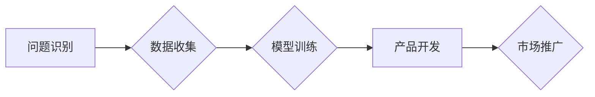

> AI创业, 95后, 码头, 深度学习, 自然语言处理, 机器学习, 算法, 项目实践, 未来趋势

## 1. 背景介绍

2023年，人工智能（AI）正处于爆发式发展阶段。从自动驾驶到语音助手，从医疗诊断到金融风险控制，AI技术正在深刻地改变着我们的生活。在这个充满机遇和挑战的时代，95后这一群体正成为AI创业的主角。他们成长于互联网时代，对技术充满热情，并拥有敏锐的商业嗅觉。

然而，AI创业并非易事。它需要扎实的技术基础、敏锐的市场洞察力和强大的执行力。本文将从95后AI创业者的视角出发，探讨他们在AI领域的探索和实践，并分析他们面临的挑战和未来发展趋势。

## 2. 核心概念与联系

### 2.1  AI创业的本质

AI创业的核心在于利用AI技术解决实际问题，创造新的价值。它不仅仅是开发AI算法，更重要的是将算法应用于具体的场景，并构建可持续的商业模式。

### 2.2  码头：AI创业的孵化器

码头，作为AI创业的孵化器，为95后创业者提供了丰富的资源和支持。

* **技术资源:** 码头拥有强大的技术团队和完善的技术体系，可以为创业者提供技术指导、算法开发和模型训练等方面的支持。
* **市场资源:** 码头拥有广泛的市场网络和客户资源，可以帮助创业者进行市场调研、寻找合作伙伴和拓展客户群体。
* **资金资源:** 码头可以为优秀的AI创业项目提供融资支持，帮助他们快速成长。

### 2.3  AI创业的流程

AI创业是一个循序渐进的过程，通常包括以下几个阶段：

1. **问题识别:** 首先要明确需要解决的实际问题，并确定AI技术是否能够有效解决该问题。
2. **数据收集:** 收集相关数据，并进行清洗、预处理和特征工程。
3. **模型训练:** 选择合适的AI算法，并进行模型训练和评估。
4. **产品开发:** 将训练好的模型集成到产品中，并进行测试和迭代。
5. **市场推广:** 推广产品，并进行用户获取和商业化。

**Mermaid 流程图**



## 3. 核心算法原理 & 具体操作步骤

### 3.1  算法原理概述

深度学习是AI领域最热门的技术之一，它能够从海量数据中自动学习特征，并进行复杂的模式识别和预测。

### 3.2  算法步骤详解

1. **数据预处理:** 将原始数据进行清洗、转换和特征工程，使其适合深度学习模型的训练。
2. **网络结构设计:** 根据具体任务选择合适的深度学习网络结构，例如卷积神经网络（CNN）、循环神经网络（RNN）或Transformer。
3. **模型训练:** 使用训练数据训练深度学习模型，并通过反向传播算法调整模型参数，使其能够准确地预测目标值。
4. **模型评估:** 使用测试数据评估模型的性能，并根据评估结果进行模型调优。
5. **模型部署:** 将训练好的模型部署到实际应用场景中，并进行持续监控和维护。

### 3.3  算法优缺点

**优点:**

* 能够从海量数据中自动学习特征，无需人工特征工程。
* 能够处理复杂的数据模式，并进行高精度预测。

**缺点:**

* 需要大量的训练数据和计算资源。
* 模型训练过程复杂，需要专业的技术人员进行操作。
* 模型解释性较差，难以理解模型的决策过程。

### 3.4  算法应用领域

深度学习算法广泛应用于以下领域：

* **图像识别:** 人脸识别、物体检测、图像分类等。
* **自然语言处理:** 语义分析、机器翻译、文本生成等。
* **语音识别:** 语音转文本、语音助手等。
* **推荐系统:** 商品推荐、内容推荐等。
* **医疗诊断:** 病情预测、疾病诊断等。

## 4. 数学模型和公式 & 详细讲解 & 举例说明

### 4.1  数学模型构建

深度学习模型通常由多个神经网络层组成，每一层都包含多个神经元。每个神经元接收来自上一层的输入信号，并对其进行线性变换和非线性激活函数处理，最终输出到下一层。

**神经元模型:**

$$
y = f(w^T x + b)
$$

其中：

* $x$ 是输入信号向量。
* $w$ 是权重向量。
* $b$ 是偏置项。
* $f$ 是激活函数。
* $y$ 是输出信号。

### 4.2  公式推导过程

深度学习模型的训练过程基于梯度下降算法。目标函数是模型预测值与真实值的误差，需要通过调整模型参数来最小化目标函数值。

**目标函数:**

$$
L = \frac{1}{N} \sum_{i=1}^{N} (y_i - \hat{y}_i)^2
$$

其中：

* $N$ 是样本数量。
* $y_i$ 是真实值。
* $\hat{y}_i$ 是模型预测值。

**梯度下降算法:**

$$
\theta = \theta - \alpha \nabla L(\theta)
$$

其中：

* $\theta$ 是模型参数。
* $\alpha$ 是学习率。
* $\nabla L(\theta)$ 是目标函数对模型参数的梯度。

### 4.3  案例分析与讲解

**举例说明:**

假设我们训练一个图像分类模型，目标是将图像分类为猫或狗。我们可以使用CNN网络结构，并使用交叉熵损失函数作为目标函数。

**交叉熵损失函数:**

$$
L = - \sum_{i=1}^{C} y_i \log(\hat{y}_i)
$$

其中：

* $C$ 是类别数量。
* $y_i$ 是真实类别标签。
* $\hat{y}_i$ 是模型预测的类别概率。

通过梯度下降算法，我们可以不断调整模型参数，使其能够准确地预测图像类别。

## 5. 项目实践：代码实例和详细解释说明

### 5.1  开发环境搭建

* **操作系统:** Ubuntu 20.04
* **编程语言:** Python 3.8
* **深度学习框架:** TensorFlow 2.0
* **其他工具:** Jupyter Notebook、Git

### 5.2  源代码详细实现

```python
import tensorflow as tf

# 定义模型结构
model = tf.keras.models.Sequential([
    tf.keras.layers.Conv2D(32, (3, 3), activation='relu', input_shape=(28, 28, 1)),
    tf.keras.layers.MaxPooling2D((2, 2)),
    tf.keras.layers.Conv2D(64, (3, 3), activation='relu'),
    tf.keras.layers.MaxPooling2D((2, 2)),
    tf.keras.layers.Flatten(),
    tf.keras.layers.Dense(10, activation='softmax')
])

# 编译模型
model.compile(optimizer='adam',
              loss='sparse_categorical_crossentropy',
              metrics=['accuracy'])

# 加载数据集
(x_train, y_train), (x_test, y_test) = tf.keras.datasets.mnist.load_data()

# 数据预处理
x_train = x_train.astype('float32') / 255.0
x_test = x_test.astype('float32') / 255.0
x_train = x_train.reshape((x_train.shape[0], 28, 28, 1))
x_test = x_test.reshape((x_test.shape[0], 28, 28, 1))

# 训练模型
model.fit(x_train, y_train, epochs=5)

# 评估模型
loss, accuracy = model.evaluate(x_test, y_test)
print('Test loss:', loss)
print('Test accuracy:', accuracy)
```

### 5.3  代码解读与分析

这段代码实现了使用TensorFlow框架训练一个简单的图像分类模型。

* 首先定义了模型结构，包括卷积层、池化层和全连接层。
* 然后编译了模型，指定了优化器、损失函数和评价指标。
* 加载了MNIST数据集，并对数据进行了预处理。
* 训练了模型，并评估了模型的性能。

### 5.4  运行结果展示

训练完成后，模型能够准确地识别MNIST数据集中的手写数字。

## 6. 实际应用场景

### 6.1  图像识别

* **人脸识别:** 用于身份验证、安全监控等场景。
* **物体检测:** 用于自动驾驶、安防监控等场景。
* **图像分类:** 用于电商商品分类、医疗影像诊断等场景。

### 6.2  自然语言处理

* **机器翻译:** 将文本从一种语言翻译成另一种语言。
* **文本摘要:** 自动生成文本的简要摘要。
* **情感分析:** 分析文本的情感倾向，例如正面、负面或中性。

### 6.3  语音识别

* **语音转文本:** 将语音信号转换为文本。
* **语音助手:** 用于语音控制设备、提供信息查询等功能。

### 6.4  未来应用展望

AI技术的发展将进一步推动其在各个领域的应用，例如：

* **个性化推荐:** 基于用户的行为数据和偏好，提供个性化的商品、内容和服务推荐。
* **智能客服:** 利用自然语言处理技术，提供智能化的客户服务，例如自动回复常见问题、引导用户解决问题。
* **医疗辅助诊断:** 利用AI技术辅助医生进行疾病诊断，提高诊断准确率和效率。

## 7. 工具和资源推荐

### 7.1  学习资源推荐

* **在线课程:** Coursera、edX、Udacity等平台提供丰富的AI课程。
* **书籍:** 《深度学习》、《机器学习实战》等经典书籍。
* **博客和论坛:** TensorFlow博客、PyTorch论坛等平台提供最新的AI技术资讯和讨论。

### 7.2  开发工具推荐

* **深度学习框架:** TensorFlow、PyTorch、Keras等。
* **数据处理工具:** Pandas、NumPy等。
* **可视化工具:** Matplotlib、Seaborn等。

### 7.3  相关论文推荐

* **《ImageNet Classification with Deep Convolutional Neural Networks》**
* **《Attention Is All You Need》**
* **《BERT: Pre-training of Deep Bidirectional Transformers for Language Understanding》**

## 8. 总结：未来发展趋势与挑战

### 8.1  研究成果总结

近年来，AI技术取得了长足的进步，特别是深度学习算法在图像识别、自然语言处理等领域取得了突破性进展。

### 8.2  未来发展趋势

* **模型规模和能力的提升:** 未来AI模型将更加庞大，拥有更强的学习能力和推理能力。
* **模型解释性和可信度的增强:** 研究者将更加关注AI模型的解释性和可信度，使其能够更好地被理解和信任。
* **AI技术的普适化:** AI技术将更加广泛地应用于各个领域，例如医疗、教育、金融等。

### 8.3  面临的挑战

* **数据获取和隐私保护:** AI模型的训练需要大量的训练数据，如何获取高质量的数据并保护用户隐私是一个重要的挑战。
* **算法效率和可解释性:** 训练大型AI模型需要大量的计算资源，如何提高算法效率和增强模型的可解释性也是一个重要的研究方向。
* **伦理和社会影响:** AI技术的快速发展也带来了伦理和社会影响，例如算法偏见、就业替代等问题，需要引起社会广泛关注和讨论。

### 