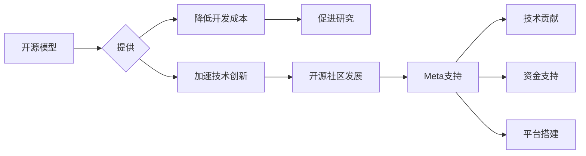

> 开源模型，人工智能，研究创新，开源社区，Meta，模型训练，数据共享，技术进步

## 1. 背景介绍

近年来，人工智能（AI）技术取得了飞速发展，深度学习模型在各个领域展现出强大的应用潜力。然而，训练大型深度学习模型需要海量数据和强大的计算资源，这对个人开发者和小型研究机构来说是一个巨大的挑战。开源模型的出现，为打破这一壁垒提供了新的途径，促进了AI技术的普及和发展。

Meta Platforms, Inc.（Meta）作为一家科技巨头，在AI领域投入巨资，开发出许多先进的开源模型，并积极支持开源社区的发展。Meta的开源策略不仅有利于自身的技术进步，也为全球开发者和研究者提供了宝贵的资源，推动了AI技术的创新和应用。

## 2. 核心概念与联系

### 2.1 开源模型

开源模型是指源代码和模型权重都公开可用的深度学习模型。开发者可以自由地访问、修改和使用这些模型，从而降低了开发成本和时间，并促进了模型的改进和创新。

### 2.2 开源社区

开源社区是一个由开发者、研究者和爱好者组成的群体，他们共同参与开源项目的开发、维护和推广。开源社区通过协作和分享，加速了技术进步，并促进了开源软件的普及和应用。

### 2.3 Meta的支持

Meta积极支持开源社区的发展，通过以下方式：

* **开源模型发布:** Meta发布了许多先进的开源模型，例如PyTorch、Detectron2、Fairseq等，为开发者和研究者提供了宝贵的资源。
* **技术贡献:** Meta的工程师和研究人员积极参与开源项目的开发，贡献代码、文档和技术支持。
* **资金支持:** Meta为开源项目提供资金支持，帮助开源社区发展壮大。
* **平台搭建:** Meta搭建了开源平台，为开发者提供协作、分享和交流的平台。

**核心概念与联系流程图:**



## 3. 核心算法原理 & 具体操作步骤

### 3.1 算法原理概述

深度学习模型的核心算法是神经网络，它由多个层级的神经元组成，每个神经元接收输入信号，并通过激活函数进行处理，输出信号。神经网络通过训练学习数据中的模式，从而实现对数据的分类、识别、预测等任务。

### 3.2 算法步骤详解

1. **数据预处理:** 将原始数据转换为模型可以理解的格式，例如归一化、编码等。
2. **模型构建:** 根据任务需求设计神经网络的结构，包括层数、神经元数量、激活函数等。
3. **模型训练:** 使用训练数据训练模型，通过调整模型参数，使模型的预测结果与真实值尽可能接近。
4. **模型评估:** 使用测试数据评估模型的性能，例如准确率、召回率等。
5. **模型部署:** 将训练好的模型部署到实际应用场景中，用于进行预测或其他任务。

### 3.3 算法优缺点

**优点:**

* **高精度:** 深度学习模型在许多任务上表现出优异的精度。
* **自动化特征提取:** 深度学习模型可以自动学习数据的特征，无需人工特征工程。
* **可扩展性:** 深度学习模型可以轻松扩展到更大的数据集和更复杂的模型结构。

**缺点:**

* **数据依赖:** 深度学习模型对数据质量和数量有很高的要求。
* **训练成本高:** 训练大型深度学习模型需要大量的计算资源和时间。
* **可解释性差:** 深度学习模型的决策过程难以理解，缺乏可解释性。

### 3.4 算法应用领域

深度学习算法广泛应用于各个领域，例如：

* **计算机视觉:** 图像识别、物体检测、图像分割等。
* **自然语言处理:** 文本分类、机器翻译、语音识别等。
* **推荐系统:** 商品推荐、内容推荐等。
* **医疗诊断:** 病理图像分析、疾病预测等。

## 4. 数学模型和公式 & 详细讲解 & 举例说明

### 4.1 数学模型构建

深度学习模型的数学基础是神经网络，它可以表示为一个多层感知机（MLP）。MLP由输入层、隐藏层和输出层组成，每个层级的神经元之间通过权重连接，并使用激活函数进行非线性变换。

**输入层:** 接收原始数据，每个神经元对应一个输入特征。

**隐藏层:** 对输入数据进行特征提取和表示，可以有多个隐藏层，每个隐藏层包含多个神经元。

**输出层:** 输出模型的预测结果，每个神经元对应一个输出类别或值。

### 4.2 公式推导过程

**激活函数:**

常用的激活函数包括ReLU、Sigmoid和Tanh等。

**ReLU函数:**

$$
f(x) = max(0, x)
$$

**Sigmoid函数:**

$$
f(x) = \frac{1}{1 + e^{-x}}
$$

**Tanh函数:**

$$
f(x) = \frac{e^{x} - e^{-x}}{e^{x} + e^{-x}}
$$

**损失函数:**

损失函数用于衡量模型预测结果与真实值的差距，常用的损失函数包括交叉熵损失和均方误差损失。

**交叉熵损失:**

$$
L = - \sum_{i=1}^{N} y_i \log(\hat{y}_i)
$$

其中，$y_i$是真实标签，$\hat{y}_i$是模型预测的概率。

**均方误差损失:**

$$
L = \frac{1}{N} \sum_{i=1}^{N} (y_i - \hat{y}_i)^2
$$

其中，$y_i$是真实值，$\hat{y}_i$是模型预测值。

**梯度下降算法:**

梯度下降算法用于优化模型参数，通过计算损失函数的梯度，不断调整参数，使损失函数最小化。

### 4.3 案例分析与讲解

**图像分类:**

假设我们有一个图像分类任务，目标是将图像分类为猫、狗或鸟。我们可以使用一个深度学习模型，例如CNN（卷积神经网络），来完成这个任务。

CNN模型可以自动学习图像特征，例如边缘、纹理和形状。通过训练CNN模型，它可以学习到不同动物的特征，并能够准确地将图像分类为猫、狗或鸟。

## 5. 项目实践：代码实例和详细解释说明

### 5.1 开发环境搭建

* **操作系统:** Linux、macOS或Windows
* **编程语言:** Python
* **深度学习框架:** PyTorch、TensorFlow等
* **其他工具:** Git、Jupyter Notebook等

### 5.2 源代码详细实现

```python
import torch
import torch.nn as nn

# 定义一个简单的CNN模型
class SimpleCNN(nn.Module):
    def __init__(self):
        super(SimpleCNN, self).__init__()
        self.conv1 = nn.Conv2d(3, 16, kernel_size=3, padding=1)
        self.relu1 = nn.ReLU()
        self.pool1 = nn.MaxPool2d(kernel_size=2, stride=2)
        self.conv2 = nn.Conv2d(16, 32, kernel_size=3, padding=1)
        self.relu2 = nn.ReLU()
        self.pool2 = nn.MaxPool2d(kernel_size=2, stride=2)
        self.fc1 = nn.Linear(32 * 7 * 7, 128)
        self.relu3 = nn.ReLU()
        self.fc2 = nn.Linear(128, 10)

    def forward(self, x):
        x = self.pool1(self.relu1(self.conv1(x)))
        x = self.pool2(self.relu2(self.conv2(x)))
        x = x.view(-1, 32 * 7 * 7)
        x = self.relu3(self.fc1(x))
        x = self.fc2(x)
        return x

# 实例化模型
model = SimpleCNN()

# 定义损失函数和优化器
criterion = nn.CrossEntropyLoss()
optimizer = torch.optim.Adam(model.parameters(), lr=0.001)

# 训练模型
for epoch in range(10):
    # 训练数据
    inputs, labels = train_data

    # 前向传播
    outputs = model(inputs)

    # 计算损失
    loss = criterion(outputs, labels)

    # 反向传播
    optimizer.zero_grad()
    loss.backward()

    # 更新参数
    optimizer.step()

    # 打印损失
    print(f'Epoch [{epoch+1}/{10}], Loss: {loss.item():.4f}')
```

### 5.3 代码解读与分析

* **模型定义:** 代码定义了一个简单的CNN模型，包含卷积层、激活函数、池化层和全连接层。
* **前向传播:** `forward()`函数定义了模型的计算过程，将输入数据通过各个层级进行处理，最终输出预测结果。
* **损失函数和优化器:** 代码使用交叉熵损失函数和Adam优化器来训练模型。
* **训练循环:** 代码使用一个循环来训练模型，在每个epoch中，模型会遍历训练数据，计算损失，并更新模型参数。

### 5.4 运行结果展示

训练完成后，我们可以使用测试数据评估模型的性能，例如计算准确率、召回率等。

## 6. 实际应用场景

### 6.1 图像识别

开源模型在图像识别领域有着广泛的应用，例如：

* **人脸识别:** 用于解锁手机、验证身份等。
* **物体检测:** 用于自动驾驶、安防监控等。
* **医学图像分析:** 用于辅助医生诊断疾病。

### 6.2 自然语言处理

开源模型在自然语言处理领域也取得了显著的成果，例如：

* **机器翻译:** 用于将文本从一种语言翻译成另一种语言。
* **文本摘要:** 用于生成文本的简短摘要。
* **聊天机器人:** 用于与用户进行自然语言对话。

### 6.3 其他应用场景

开源模型还可以应用于其他领域，例如：

* **语音识别:** 用于将语音转换为文本。
* **音乐生成:** 用于创作新的音乐作品。
* **代码生成:** 用于自动生成代码。

### 6.4 未来应用展望

随着开源模型的不断发展，其应用场景将会更加广泛，例如：

* **个性化推荐:** 基于用户的兴趣和行为，提供个性化的商品、内容或服务推荐。
* **智能客服:** 使用自然语言处理技术，提供更加智能和人性化的客服服务。
* **自动驾驶:** 使用计算机视觉和自然语言处理技术，实现更加安全和可靠的自动驾驶。

## 7. 工具和资源推荐

### 7.1 学习资源推荐

* **书籍:**
    * 深度学习
    * 构建深度学习模型
* **在线课程:**
    * Coursera深度学习课程
    * Udacity深度学习课程
* **博客和网站:**
    * TensorFlow博客
    * PyTorch博客
    * OpenAI博客

### 7.2 开发工具推荐

* **深度学习框架:**
    * PyTorch
    * TensorFlow
    * Keras
* **编程语言:**
    * Python
* **数据处理工具:**
    * Pandas
    * NumPy

### 7.3 相关论文推荐

* **ImageNet Classification with Deep Convolutional Neural Networks**
