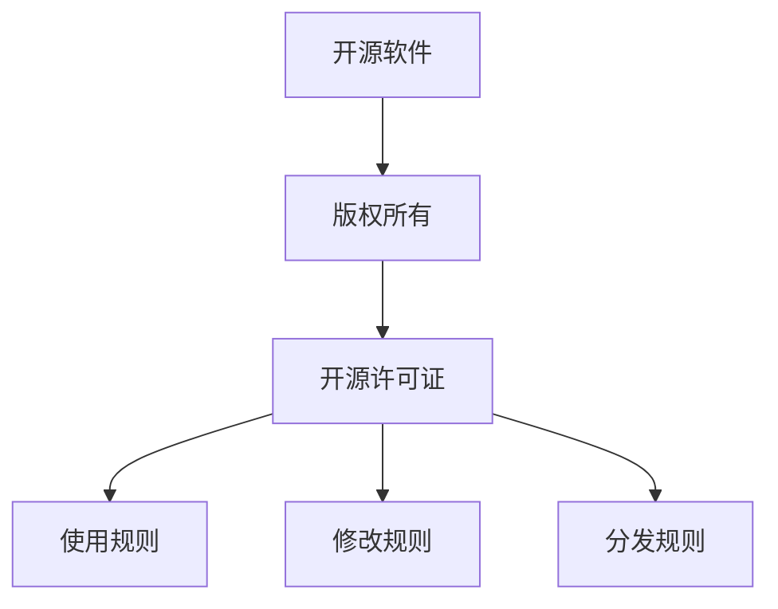

                 

## 开源项目的商业化法律考虑：合规与保护

> 关键词：开源软件、商业化、知识产权、合规、保护、版权、许可证、贡献者、法律风险

## 1. 背景介绍

开源软件已然成为当今软件开发的主流，其灵活性、可靠性和成本优势使其受到广泛欢迎。然而，将开源项目商业化时，开发者和使用者都面临着一系列法律问题。本文将深入探讨开源项目商业化时的法律考虑，重点关注合规性和保护措施。

## 2. 核心概念与联系

### 2.1 版权与开源许可证

版权是保护软件代码的主要法律手段。开源软件通常使用开源许可证（如 GPL、Apache 2.0、MIT 等）来授权其使用和修改。这些许可证定义了软件的使用、修改和分发规则。



### 2.2 知识产权保护

知识产权保护包括版权、商标和专利。开源软件的商业化可能会涉及这些知识产权的保护，以防止侵权和维护项目的可持续发展。

### 2.3 贡献者协议

贡献者协议（Contributor License Agreement, CLA）是一种法律协议，旨在保护开源项目免受潜在的法律风险。CLA 要求贡献者授权项目使用其贡献的代码，并放弃对代码的版权。

## 3. 核心算法原理 & 具体操作步骤

### 3.1 合规性评估算法原理

合规性评估是确保开源项目商业化时遵循相关法律的关键步骤。该过程包括：

1. 识别涉及的开源软件及其许可证。
2. 评估这些许可证是否允许商业使用。
3. 检查是否需要遵循特定的条款或要求（如源代码公开、授权条款等）。
4. 评估是否需要与贡献者签署 CLA。

### 3.2 合规性评估步骤详解

1. **识别开源软件及其许可证**：列出项目中使用的所有开源软件及其许可证。可以使用工具（如 FOSSA、WhiteSource、Black Duck）自动识别和跟踪开源软件。

2. **评估商业使用许可**：检查每个开源软件的许可证是否允许商业使用。大多数开源许可证（如 Apache 2.0、MIT）都允许商业使用，但一些许可证（如 GPL）可能会对商业使用施加限制。

3. **检查特定条款或要求**：某些许可证可能会要求遵循特定的条款或要求。例如，GPL 要求源代码必须公开，并授予用户修改和分发软件的权利。Apache 2.0 要求保留原始许可证和版权声明。

4. **评估是否需要 CLA**：如果项目接受外部贡献，则可能需要贡献者协议。CLA 可以保护项目免受潜在的法律风险，并确保贡献者授权项目使用其代码。

### 3.3 合规性评估优缺点

**优点**：

- 确保项目合规，避免法律风险。
- 保护项目和贡献者的利益。
- 提高项目的可信度和可持续性。

**缺点**：

- 评估过程可能复杂且费时。
- 可能需要法律咨询，增加成本。
- 评估结果可能会限制项目的灵活性和扩展性。

### 3.4 合规性评估应用领域

合规性评估适用于任何涉及开源软件商业化的项目，包括：

- 软件产品开发
- 云服务和 SaaS 解决方案
- 硬件设备和嵌入式系统
- 机器学习和人工智能应用

## 4. 数学模型和公式 & 详细讲解 & 例子说明

### 4.1 合规性评估模型构建

合规性评估模型可以表示为以下公式：

$$R = f(L, C, G, P)$$

其中：

- $R$ 是项目的合规性评估结果。
- $L$ 是项目中使用的开源软件及其许可证的集合。
- $C$ 是商业使用许可评估结果的集合。
- $G$ 是特定条款或要求的集合。
- $P$ 是是否需要 CLA 的评估结果。

### 4.2 公式推导过程

1. 为每个开源软件及其许可证评估商业使用许可（$C$）：
   $$C_i = \begin{cases} 1, & \text{if commercial use is allowed} \\ 0, & \text{otherwise} \end{cases}$$
2. 检查每个许可证是否有特定条款或要求（$G$）：
   $$G_i = \begin{cases} 1, & \text{if specific terms or requirements exist} \\ 0, & \text{otherwise} \end{cases}$$
3. 评估是否需要 CLA（$P$）：
   $$P = \begin{cases} 1, & \text{if CLA is required} \\ 0, & \text{otherwise} \end{cases}$$
4. 计算项目的合规性评估结果（$R$）：
   $$R = \begin{cases} \text{compliant}, & \text{if } \forall i, C_i = 1 \text{ and } G_i = 0 \text{ and } P = 0 \\ \text{non-compliant}, & \text{otherwise} \end{cases}$$

### 4.3 案例分析与讲解

假设项目使用了以下开源软件及其许可证：

- Library A：Apache 2.0（允许商业使用，无特定条款或要求）
- Library B：GPLv3（允许商业使用，但要求源代码公开）
- Library C：MIT（允许商业使用，无特定条款或要求）

项目接受外部贡献，因此需要 CLA。

根据上述公式，项目的合规性评估结果为：

- $C = \{1, 1, 1\}$
- $G = \{0, 1, 0\}$
- $P = 1$

项目为非合规，因为 Library B 的 GPLv3 许可证要求源代码公开，且项目需要 CLA。

## 5. 项目实践：代码实例和详细解释说明

### 5.1 开发环境搭建

为进行合规性评估，需要设置开发环境，安装开源软件识别和管理工具（如 FOSSA、WhiteSource、Black Duck）。以下是使用 FOSSA 的示例：

1. 安装 FOSSA CLI：`npm install -g @fossa/cli`
2. 初始化 FOSSA：`fossa init`
3. 连接 FOSSA：`fossa login`

### 5.2 源代码详细实现

以下是使用 FOSSA 进行合规性评估的示例代码：

```bash
# 扫描项目以识别开源软件
fossa scan

# 生成合规性报告
fossa report --format json > compliance_report.json
```

### 5.3 代码解读与分析

`fossa scan` 命令扫描项目以识别开源软件及其许可证。`fossa report` 命令生成合规性报告，其中包含商业使用许可评估结果、特定条款或要求和 CLA 需求。

### 5.4 运行结果展示

合规性报告（`compliance_report.json`）包含项目的合规性评估结果，格式如下：

```json
{
  "compliant": false,
  "dependencies": [
    {
      "name": "Library A",
      "license": "Apache 2.0",
      "commercial_use_allowed": true,
      "specific_terms_or_requirements": false
    },
    {
      "name": "Library B",
      "license": "GPLv3",
      "commercial_use_allowed": true,
      "specific_terms_or_requirements": true
    },
    {
      "name": "Library C",
      "license": "MIT",
      "commercial_use_allowed": true,
      "specific_terms_or_requirements": false
    }
  ],
  "cla_required": true
}
```

## 6. 实际应用场景

### 6.1 项目合规性评估

在项目启动初期，进行合规性评估以确保项目符合相关法律要求。在项目生命周期的各个阶段，定期重新评估以跟踪任何新的开源软件或许可证变更。

### 6.2 合规性评估报告审查

与法律顾问合作，审查合规性评估报告，并采取必要措施确保项目合规。这可能包括修改项目结构、选择不同的开源软件或签署 CLA。

### 6.3 未来应用展望

随着开源软件的广泛应用，合规性评估将成为商业化项目的标准流程。未来，开发者和使用者将更多地依赖自动化工具和 AI 来简化合规性评估过程。

## 7. 工具和资源推荐

### 7.1 学习资源推荐

- [Open Source Initiative](https://opensource.org/)
- [Free Software Foundation](https://www.fsf.org/)
- [Open Source Guide](https://opensource.guide/)
- [Choose an Open Source License](https://choosealicense.com/)

### 7.2 开发工具推荐

- [FOSSA](https://fossa.com/)
- [WhiteSource](https://www.whitesourcesoftware.com/)
- [Black Duck](https://www.blackducksoftware.com/)
- [OSS Review Toolkit](https://oss-review-toolkit.org/)

### 7.3 相关论文推荐

- [Legal Issues in Open Source Software](https://www.law.cornell.edu/wex/open_source_software)
- [Open Source Licensing: Software Freedom and Intellectual Property Law](https://www.law.cornell.edu/wex/open_source_licensing)
- [The Law of Open Source Software](https://www.law.cornell.edu/wex/the_law_of_open_source_software)

## 8. 总结：未来发展趋势与挑战

### 8.1 研究成果总结

本文介绍了开源项目商业化时的法律考虑，重点关注合规性和保护措施。我们提出了合规性评估算法，并提供了数学模型和实践指南。

### 8.2 未来发展趋势

未来，开源软件商业化将继续增长，合规性评估将成为标准流程。自动化工具和 AI 将简化评估过程，并帮助项目更好地管理法律风险。

### 8.3 面临的挑战

开源软件商业化面临的挑战包括：

- 合规性评估的复杂性和成本。
- 许可证变更和更新的跟踪。
- 贡献者协议的执行和管理。
- 侵权和法律纠纷的风险。

### 8.4 研究展望

未来的研究应关注开源软件商业化的新模式和业务模型，并开发更智能和自动化的合规性评估工具。此外，研究还应关注开源软件商业化对创新和竞争的影响。

## 9. 附录：常见问题与解答

**Q1：开源软件商业化需要遵循哪些法律要求？**

A1：开源软件商业化需要遵循相关开源许可证的条款和要求，并可能需要遵循版权法、商标法和专利法。

**Q2：如何评估开源软件的合规性？**

A2：可以使用合规性评估算法，该算法评估项目中使用的开源软件及其许可证，检查商业使用许可、特定条款或要求和 CLA 需求。

**Q3：什么是贡献者协议（CLA），为什么它很重要？**

A3：贡献者协议（CLA）是一种法律协议，旨在保护开源项目免受潜在的法律风险。CLA 要求贡献者授权项目使用其贡献的代码，并放弃对代码的版权。CLA 有助于保护项目和贡献者的利益，并确保项目的可持续发展。

!!!Note
    作者：禅与计算机程序设计艺术 / Zen and the Art of Computer Programming

