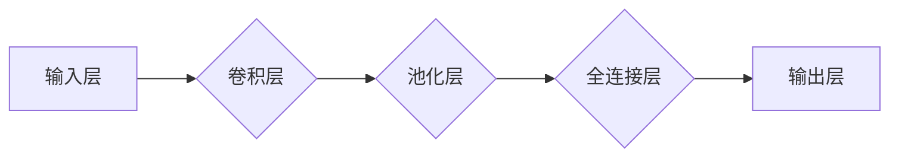

感知器，卷积神经网络，CNN，深度学习，图像识别，特征提取，卷积操作，池化操作

## 1. 背景介绍

深度学习作为机器学习领域的一颗璀璨明珠，近年来取得了令人瞩目的成就，尤其是在图像识别、自然语言处理等领域展现出了强大的实力。而卷积神经网络（CNN）作为深度学习的重要组成部分，在图像识别领域占据着主导地位。

从感知器到卷积神经网络，这是一个从简单到复杂的演进过程，见证了人工智能技术的不断进步。本文将带领读者深入了解感知器的原理，逐步揭示卷积神经网络的结构和工作机制，并探讨其在实际应用中的优势和挑战。

## 2. 核心概念与联系

感知器是神经网络的基本单元，它模拟了生物神经元的简单功能。感知器接收多个输入信号，经过加权求和后，通过激活函数进行处理，最终输出一个结果。

卷积神经网络（CNN）则是由多个感知器层组成的多层神经网络，其结构和功能更加复杂。CNN的核心在于卷积操作和池化操作，它们能够有效地提取图像中的特征。

**Mermaid 流程图**



## 3. 核心算法原理 & 具体操作步骤

### 3.1  算法原理概述

卷积神经网络的核心算法包括卷积操作和池化操作。

* **卷积操作:** 卷积操作是CNN提取图像特征的关键步骤。它通过一个称为卷积核（filter）的模板，在图像上滑动，计算每个位置的卷积结果。卷积核可以学习到图像中的不同特征，例如边缘、纹理等。

* **池化操作:** 池化操作用于降低图像的维度，同时保留其最重要的特征信息。常见的池化操作包括最大池化和平均池化。最大池化选择每个区域的最大值作为输出，平均池化则计算每个区域的平均值作为输出。

### 3.2  算法步骤详解

1. **输入图像:** 将图像输入到CNN的第一层卷积层。

2. **卷积操作:** 在卷积层中，每个卷积核与图像进行卷积运算，得到多个特征图。

3. **激活函数:** 将卷积结果输入到激活函数中，例如ReLU函数，以引入非线性特性。

4. **池化操作:** 对激活后的特征图进行池化操作，降低其维度。

5. **重复步骤2-4:** 将特征图传递到下一层卷积层，重复卷积、激活和池化操作，提取更高级的特征。

6. **全连接层:** 将最终的特征图展平，输入到全连接层，进行分类或回归任务。

### 3.3  算法优缺点

**优点:**

* **特征提取能力强:** 卷积操作和池化操作能够有效地提取图像中的特征。

* **参数共享:** 卷积核在图像上滑动时，参数共享机制可以减少模型参数的数量，提高训练效率。

* **鲁棒性强:** CNN对图像的旋转、缩放、平移等变换具有较强的鲁棒性。

**缺点:**

* **训练时间长:** CNN的训练时间相对较长，需要大量的计算资源。

* **参数量大:** CNN的参数量较大，需要大量的训练数据才能有效训练。

* **可解释性差:** CNN的内部工作机制较为复杂，难以解释其决策过程。

### 3.4  算法应用领域

CNN在图像识别、目标检测、图像分割、人脸识别、医疗影像分析等领域有着广泛的应用。

## 4. 数学模型和公式 & 详细讲解 & 举例说明

### 4.1  数学模型构建

卷积神经网络的数学模型可以概括为以下几个方面：

* **卷积操作:**

$$
y_{i,j} = \sum_{m=0}^{M-1} \sum_{n=0}^{N-1} x_{i+m,j+n} * w_{m,n} + b
$$

其中：

* $y_{i,j}$ 是卷积结果的第 $i$ 行第 $j$ 列元素。
* $x_{i+m,j+n}$ 是输入图像的第 $i+m$ 行第 $j+n$ 列元素。
* $w_{m,n}$ 是卷积核的第 $m$ 行第 $n$ 列元素。
* $b$ 是偏置项。

* **激活函数:**

$$
f(z) = \begin{cases}
z & \text{if } z > 0 \\
0 & \text{otherwise}
\end{cases}
$$

* **池化操作:**

$$
p_{i,j} = \max_{m=0}^{M-1} \max_{n=0}^{N-1} x_{i+m,j+n}
$$

### 4.2  公式推导过程

卷积操作的公式推导过程可以参考相关教材或论文。

### 4.3  案例分析与讲解

以图像边缘检测为例，卷积核可以设计成一个高斯核，用于检测图像中的边缘。

## 5. 项目实践：代码实例和详细解释说明

### 5.1  开发环境搭建

使用Python语言和深度学习框架TensorFlow或PyTorch搭建开发环境。

### 5.2  源代码详细实现

```python
import tensorflow as tf

# 定义卷积层
def conv_layer(input_tensor, filters, kernel_size, strides):
    x = tf.keras.layers.Conv2D(filters, kernel_size, strides=strides, padding='same')(input_tensor)
    x = tf.keras.layers.ReLU()(x)
    return x

# 定义池化层
def pool_layer(input_tensor, pool_size, strides):
    x = tf.keras.layers.MaxPooling2D(pool_size=pool_size, strides=strides)(input_tensor)
    return x

# 定义CNN模型
model = tf.keras.models.Sequential([
    conv_layer(input_tensor, 32, (3, 3), (1, 1)),
    pool_layer(input_tensor, (2, 2), (2, 2)),
    conv_layer(input_tensor, 64, (3, 3), (1, 1)),
    pool_layer(input_tensor, (2, 2), (2, 2)),
    tf.keras.layers.Flatten(),
    tf.keras.layers.Dense(10, activation='softmax')
])

# 编译模型
model.compile(optimizer='adam',
              loss='sparse_categorical_crossentropy',
              metrics=['accuracy'])

# 训练模型
model.fit(train_data, train_labels, epochs=10)
```

### 5.3  代码解读与分析

代码首先定义了卷积层和池化层，然后构建了CNN模型。模型包含两层卷积层和两层池化层，最后连接全连接层进行分类。

### 5.4  运行结果展示

训练完成后，可以将模型应用于测试数据，评估其性能。

## 6. 实际应用场景

CNN在图像识别、目标检测、图像分割、人脸识别、医疗影像分析等领域有着广泛的应用。

### 6.1  图像识别

CNN可以用于识别图像中的物体，例如猫、狗、车等。

### 6.2  目标检测

CNN可以用于检测图像中的多个目标，并标注其位置和类别。

### 6.3  图像分割

CNN可以用于将图像分割成不同的区域，例如分割出前景和背景。

### 6.4  人脸识别

CNN可以用于识别人脸，并进行身份验证。

### 6.5  医疗影像分析

CNN可以用于分析医学影像，例如X光片、CT扫描、MRI扫描等，辅助医生诊断疾病。

## 7. 工具和资源推荐

### 7.1  学习资源推荐

* **书籍:**

* 深度学习 (Deep Learning) - Ian Goodfellow, Yoshua Bengio, Aaron Courville
* 构建深度学习神经网络 (Hands-On Machine Learning with Scikit-Learn, Keras & TensorFlow) - Aurélien Géron

* **在线课程:**

* 深度学习 Specialization - Andrew Ng (Coursera)
* fast.ai - Practical Deep Learning for Coders

### 7.2  开发工具推荐

* **TensorFlow:** https://www.tensorflow.org/
* **PyTorch:** https://pytorch.org/

### 7.3  相关论文推荐

* AlexNet: ImageNet Classification with Deep Convolutional Neural Networks - Alex Krizhevsky, Ilya Sutskever, Geoffrey E. Hinton
* VGGNet: Very Deep Convolutional Networks for Large-Scale Image Recognition - Karen Simonyan, Andrew Zisserman
* ResNet: Deep Residual Learning for Image Recognition - Kaiming He, Xiangyu Zhang, Shaoqing Ren, Jian Sun

## 8. 总结：未来发展趋势与挑战

### 8.1  研究成果总结

从感知器到卷积神经网络，深度学习技术取得了长足的进步，为人工智能的发展注入了新的活力。CNN在图像识别等领域取得了令人瞩目的成就，其结构和算法不断优化，性能不断提升。

### 8.2  未来发展趋势

* **模型更深更广:** 研究更深层次、更广阔结构的CNN模型，以提高识别精度和泛化能力。
* **高效训练:** 研究更有效的训练算法和硬件加速技术，降低CNN训练时间和成本。
* **解释性更强:** 研究更易于解释的CNN模型，提高其可信度和应用范围。
* **跨模态学习:** 研究CNN在跨模态学习中的应用，例如图像与文本的联合学习。

### 8.3  面临的挑战

* **数据依赖性:** CNN的性能高度依赖于训练数据的质量和数量。
* **计算资源:** 训练大型CNN模型需要大量的计算资源，成本较高。
* **可解释性:** CNN的内部工作机制较为复杂，难以解释其决策过程。

### 8.4  研究展望

未来，CNN技术将继续朝着更深、更广、更强、更解释的方向发展，在更多领域发挥其重要作用。


## 9. 附录：常见问题与解答

### 9.1  CNN和传统机器学习算法相比有什么优势？

CNN相比传统机器学习算法，具有以下优势：

* **自动特征提取:** CNN可以自动学习图像中的特征，无需人工设计特征。
* **鲁棒性强:** CNN对图像的旋转、缩放、平移等变换具有较强的鲁棒性。
* **参数共享:** 卷积核的共享机制可以减少模型参数的数量，提高训练效率。

### 9.2  如何选择合适的卷积核大小和步长？

卷积核的大小和步长会影响CNN的感受野和参数量。

* **感受野:** 卷积核的大小决定了CNN能够感知到的图像区域大小。
* **参数量:** 步长越小，卷积核的滑动次数越多，参数量越大。

通常情况下，可以选择较小的卷积核和较大的步长，以减少参数量和提高训练速度。

### 9.3  如何防止CNN模型过拟合？

过拟合是指CNN模型在训练数据上表现良好，但在测试数据上表现较差。

* **数据增强:** 对训练数据进行随机变换，例如旋转、缩放、平移等，增加数据的多样性。
* **正则化:** 使用正则化技术，例如L1正则化和L2正则化，惩罚模型参数的复杂度。
* **Dropout:** 在训练过程中随机丢弃一部分神经元，防止模型过拟合特定特征。


作者：禅与计算机程序设计艺术 / Zen and the Art of Computer Programming 
<end_of_turn>