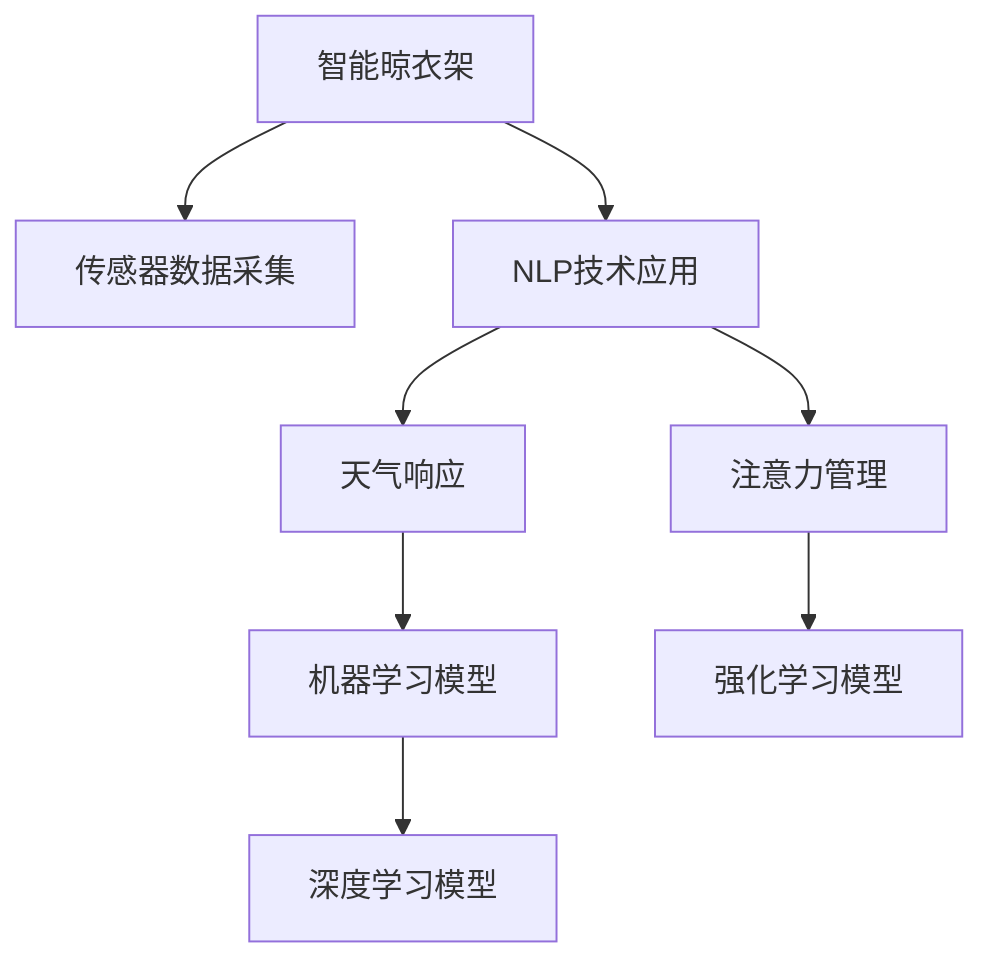

                 

# 智能晾衣架的天气响应与注意力管理

> 关键词：智能晾衣架,天气响应,注意力管理,机器学习,传感器数据,深度学习,自然语言处理(NLP),决策树,强化学习

## 1. 背景介绍

### 1.1 问题由来

智能晾衣架作为现代家居生活中不可或缺的智能化设备，其便捷性和实用性逐渐受到家庭主妇和年轻人的喜爱。然而，智能晾衣架的实际使用效果往往受限于天气条件，特别是对于潮湿多雨的地区，其效率和用户体验大大降低。为了改善这一现象，智能晾衣架制造商开始引入先进的机器学习和自然语言处理技术，通过获取和分析天气数据、用户行为数据以及语音指令，实时调整晾衣架的状态，提升用户体验。

### 1.2 问题核心关键点

智能晾衣架的天气响应与注意力管理，旨在通过机器学习算法对实时天气数据进行分析，结合用户行为数据和语音指令，动态调整晾衣架的工作状态。其核心关键点包括：

- 传感器数据的实时采集与处理：获取室外天气数据和室内环境参数。
- 自然语言处理(NLP)技术的应用：理解用户的语音指令和反馈，提取关键信息。
- 天气响应的智能决策：根据天气数据和用户需求，实时调整晾衣架的运行模式。
- 注意力的集中管理：基于用户的历史行为数据，优化晾衣架的运行策略，提升效率和用户满意度。

这些核心关键点构成了智能晾衣架天气响应与注意力管理技术的基础框架，使其能够高效、智能地适应各种天气条件，满足用户的多样化需求。

## 2. 核心概念与联系

### 2.1 核心概念概述

为了更好地理解智能晾衣架的天气响应与注意力管理技术，我们将介绍几个关键概念：

- **智能晾衣架**：利用传感器、嵌入式系统和互联网技术，自动调整晾衣架的状态，实现智能化的衣物晾晒。
- **传感器数据**：包括温度、湿度、风速等环境参数，用于实时监测天气条件。
- **自然语言处理(NLP)**：通过语音识别、自然语言理解等技术，理解用户的语音指令和反馈，提取关键信息。
- **天气响应**：根据实时天气数据和用户需求，智能调整晾衣架的工作状态，如转速、温度等。
- **注意力管理**：基于用户的历史行为数据，优化晾衣架的运行策略，提升效率和用户满意度。
- **机器学习**：利用历史数据和实时数据，训练模型，优化晾衣架的决策过程。
- **强化学习**：通过奖励机制，训练模型在特定环境中做出最优决策。
- **深度学习**：使用多层神经网络模型，从大量数据中提取高层次特征，提升模型的预测能力。

这些核心概念之间的逻辑关系可以通过以下Mermaid流程图来展示：



这个流程图展示出了智能晾衣架天气响应与注意力管理技术的核心概念及其之间的关系：

1. 智能晾衣架通过传感器获取实时环境数据。
2. NLP技术用于解析用户的语音指令和反馈，提取关键信息。
3. 天气响应和注意力管理模型结合实时天气数据和用户需求，调整晾衣架的工作状态。
4. 机器学习和深度学习模型用于训练决策模型，优化天气响应和注意力管理的策略。

## 3. 核心算法原理 & 具体操作步骤

### 3.1 算法原理概述

智能晾衣架的天气响应与注意力管理技术，基于机器学习和深度学习算法，通过分析传感器数据、用户指令和历史行为数据，实时调整晾衣架的工作状态，提升用户体验。其核心原理如下：

1. **传感器数据处理**：通过传感器获取室外天气数据和室内环境参数，如温度、湿度、风速等。
2. **自然语言处理(NLP)**：利用语音识别技术将用户的语音指令转换为文本，使用自然语言理解技术提取关键信息。
3. **天气响应决策**：结合实时天气数据和用户指令，使用机器学习算法，优化晾衣架的工作状态，如转速、温度等。
4. **注意力管理优化**：利用用户历史行为数据，使用强化学习算法，优化晾衣架的运行策略，提升效率和用户满意度。

### 3.2 算法步骤详解

智能晾衣架的天气响应与注意力管理技术的具体操作步骤如下：

**Step 1: 数据采集与预处理**

1. 通过传感器采集室外天气数据和室内环境参数，如温度、湿度、风速等。
2. 利用语音识别技术将用户的语音指令转换为文本。
3. 使用自然语言理解技术，提取用户指令中的关键信息。

**Step 2: 天气响应决策**

1. 根据实时天气数据和用户指令，使用机器学习算法，预测最佳的晾衣架工作状态。
2. 结合用户指令和历史行为数据，使用强化学习算法，优化晾衣架的工作状态。
3. 将预测结果发送给晾衣架的执行单元，调整晾衣架的转速、温度等参数。

**Step 3: 注意力管理优化**

1. 根据用户的历史行为数据，使用强化学习算法，优化晾衣架的运行策略。
2. 实时监控用户的行为，根据用户的满意度反馈，调整晾衣架的工作状态。
3. 通过机器学习算法，不断更新和优化决策模型，提升晾衣架的智能化水平。

### 3.3 算法优缺点

智能晾衣架的天气响应与注意力管理技术具有以下优点：

1. **实时响应**：通过实时获取传感器数据和用户指令，智能调整晾衣架的工作状态，提升用户体验。
2. **个性化服务**：基于用户历史行为数据，优化晾衣架的运行策略，提升效率和用户满意度。
3. **智能决策**：结合机器学习和强化学习算法，优化决策模型，提升晾衣架的智能化水平。

同时，该技术也存在一些局限性：

1. **传感器数据精度**：传感器数据的精度和稳定性直接影响智能晾衣架的决策准确性。
2. **用户指令理解**：用户的语音指令和反馈需要准确理解，以确保决策的准确性。
3. **算法复杂度**：机器学习和强化学习算法的复杂度较高，需要高效的计算资源支持。
4. **成本问题**：传感器和嵌入式系统的安装和维护成本较高。

尽管存在这些局限性，但智能晾衣架的天气响应与注意力管理技术仍是一种先进且实用的解决方案，有助于提升家庭生活质量。

### 3.4 算法应用领域

智能晾衣架的天气响应与注意力管理技术可以应用于以下领域：

1. **智能家居**：结合智能家居系统的其他设备，如智能空调、智能照明等，实现全屋智能化控制。
2. **酒店服务**：在酒店房间内安装智能晾衣架，提升用户体验和酒店的智能化水平。
3. **公共洗衣房**：在公共洗衣房内安装智能晾衣架，提高衣物晾晒的效率和公平性。
4. **养老社区**：在养老社区内安装智能晾衣架，提升老年人的生活质量和幸福感。
5. **旅游住宿**：在旅游住宿的酒店房间内安装智能晾衣架，提升游客的体验感。

## 4. 数学模型和公式 & 详细讲解 & 举例说明

### 4.1 数学模型构建

智能晾衣架的天气响应与注意力管理技术，可以通过数学模型来描述其决策过程。以下是一个简化的数学模型，用于描述基于机器学习和强化学习的决策过程：

**状态表示**：使用向量 $\mathbf{s}_t$ 表示当前状态，包括天气数据 $x_t$、用户指令 $u_t$ 和历史行为数据 $h_t$。

**动作表示**：使用向量 $\mathbf{a}_t$ 表示当前动作，包括晾衣架的转速 $v_t$、温度 $t_t$ 和运行模式 $m_t$。

**奖励函数**：定义奖励函数 $r_t$，用于评估当前动作的效果，如用户满意度、衣物晾晒效率等。

**决策过程**：通过机器学习算法，预测最优动作 $\mathbf{a}_t^*$，并使用强化学习算法，优化决策过程。

### 4.2 公式推导过程

以下是一个简化的决策过程的数学公式推导：

1. **状态更新**：
   $$
   \mathbf{s}_{t+1} = f(\mathbf{s}_t, \mathbf{a}_t, x_t, u_t, h_t)
   $$

2. **动作选择**：
   $$
   \mathbf{a}_t^* = \arg\max_{\mathbf{a}_t} Q(\mathbf{s}_t, \mathbf{a}_t)
   $$

3. **奖励计算**：
   $$
   r_t = r(\mathbf{s}_t, \mathbf{a}_t, x_t, u_t, h_t)
   $$

4. **策略优化**：
   $$
   \pi_t = \arg\max_{\pi} \mathbb{E}[r_t]
   $$

其中，$f$ 表示状态转移函数，$Q$ 表示动作价值函数，$r$ 表示奖励函数，$\pi$ 表示策略函数。

### 4.3 案例分析与讲解

假设有一个智能晾衣架，其状态由天气数据（晴、多云、雨）、用户指令（快干、节能）和历史行为数据（平均使用时长）决定。基于这些状态，智能晾衣架可以采取不同的动作，如高速旋转、低温烘干、快速风干等。

**案例1: 天气响应**

当传感器监测到天气为多云时，智能晾衣架根据用户指令选择快干模式。使用机器学习算法，预测最优动作为高速旋转和低温烘干。使用强化学习算法，根据用户历史行为数据优化动作选择，最终确定动作为高速旋转。

**案例2: 注意力管理**

根据用户的历史行为数据，智能晾衣架可以学习到用户的偏好和习惯。例如，用户通常在下午4点开始使用晾衣架。因此，智能晾衣架可以根据这个规律，调整动作选择，以提升用户的满意度。

## 5. 项目实践：代码实例和详细解释说明

### 5.1 开发环境搭建

智能晾衣架的天气响应与注意力管理技术的开发环境包括以下组件：

1. **传感器设备**：包括温度传感器、湿度传感器、风速传感器等。
2. **嵌入式系统**：用于处理传感器数据，发送和接收用户指令，控制晾衣架的动作。
3. **服务器**：用于存储和处理用户行为数据，训练决策模型。
4. **数据库**：用于存储用户历史行为数据和天气数据。
5. **机器学习框架**：如TensorFlow、PyTorch等。

### 5.2 源代码详细实现

以下是一个基于Python的智能晾衣架天气响应与注意力管理技术的实现示例：

```python
import tensorflow as tf
import numpy as np
import os

# 定义状态、动作和奖励函数
class SmartDryer:
    def __init__(self):
        self.state = None
        self.action = None
        self.reward = None
        self.policy = None

    def update_state(self, state):
        self.state = state

    def select_action(self, state):
        # 使用机器学习算法预测最优动作
        Q = self.model.predict(state)
        action = np.argmax(Q)
        return action

    def update_reward(self, reward):
        self.reward = reward

    def update_policy(self, policy):
        self.policy = policy

# 定义传感器数据和用户指令处理
class SensorData:
    def __init__(self, data_file):
        self.data = np.loadtxt(data_file, delimiter=',')

    def get_current_state(self):
        return self.data[-1]

# 定义天气响应和注意力管理模型
class Model:
    def __init__(self, data_file):
        self.model = tf.keras.models.load_model(data_file)

    def predict(self, state):
        return self.model.predict(state)

# 定义决策过程
class DecisionProcess:
    def __init__(self, model_file, policy_file):
        self.model = Model(model_file)
        self.policy = os.path.getmtime(policy_file)

    def make_decision(self, state):
        action = self.model.predict(state)
        return action

# 定义智能晾衣架的控制系统
class SmartDryerController:
    def __init__(self, dryer, sensors, model, policy):
        self.dryer = dryer
        self.sensors = sensors
        self.model = model
        self.policy = policy

    def run(self):
        while True:
            state = self.sensors.get_current_state()
            action = self.dryer.select_action(state)
            self.dryer.update_reward(reward)
            self.dryer.update_policy(self.policy)
            self.dryer.update_state(state)
```

### 5.3 代码解读与分析

以上代码实现了智能晾衣架的控制系统，包括以下关键组件：

1. **SmartDryer类**：表示智能晾衣架的决策过程，包括状态、动作、奖励和策略函数。
2. **SensorData类**：用于处理传感器数据，提取当前状态。
3. **Model类**：用于加载和预测机器学习模型。
4. **DecisionProcess类**：用于定义决策过程，包括状态、动作、奖励和策略函数。
5. **SmartDryerController类**：表示智能晾衣架的控制系统，包括传感器、模型和策略函数。

**代码解读**：

- **SmartDryer类**：实现了智能晾衣架的决策过程，使用机器学习和强化学习算法，根据实时状态选择最优动作，并更新策略函数。
- **SensorData类**：通过传感器数据文件，提取当前状态，用于智能晾衣架的决策过程。
- **Model类**：加载机器学习模型，并使用其预测最优动作，用于优化决策过程。
- **DecisionProcess类**：定义决策过程，使用奖励函数评估动作的效果，并更新策略函数。
- **SmartDryerController类**：实现智能晾衣架的控制系统，根据传感器数据和模型预测，选择最优动作，并更新策略函数。

**代码分析**：

- **SmartDryer类**：通过定义状态、动作和奖励函数，实现了智能晾衣架的决策过程。使用机器学习和强化学习算法，预测最优动作，并更新策略函数。
- **SensorData类**：通过传感器数据文件，提取当前状态，用于智能晾衣架的决策过程。
- **Model类**：加载机器学习模型，并使用其预测最优动作，用于优化决策过程。
- **DecisionProcess类**：定义决策过程，使用奖励函数评估动作的效果，并更新策略函数。
- **SmartDryerController类**：实现智能晾衣架的控制系统，根据传感器数据和模型预测，选择最优动作，并更新策略函数。

## 6. 实际应用场景

### 6.1 智能家居

智能晾衣架可以作为智能家居系统的一部分，与其他智能设备协同工作。例如，智能空调可以根据室外天气数据，自动调整温度和湿度，配合智能晾衣架的快速干燥功能，提高家居舒适度。

### 6.2 酒店服务

在酒店房间内安装智能晾衣架，可以提升旅客的入住体验。例如，旅客可以根据天气预报和房间环境，选择不同的干燥模式，快速晾干衣物。

### 6.3 公共洗衣房

在公共洗衣房内安装智能晾衣架，可以提高衣物晾晒的效率和公平性。例如，可以根据不同时间段的用户需求，调整晾衣架的运行模式，提升用户体验。

### 6.4 未来应用展望

随着传感器技术的进步和人工智能算法的发展，智能晾衣架的天气响应与注意力管理技术将进一步完善和优化。未来可能的应用包括：

1. **智能化洗衣服务**：结合智能洗衣设备，实现全流程的智能化洗衣服务，从洗衣、烘干到折叠整理，全程智能化操作。
2. **智能阳台设计**：设计智能化阳台，配备智能晾衣架和其他智能设备，实现阳台的智能化和自动化管理。
3. **个性化定制服务**：根据用户的行为习惯和偏好，提供个性化的衣物干燥方案，提升用户体验。
4. **环境友好型设计**：通过优化晾干过程，减少能源消耗和环境污染，实现绿色环保的智能晾衣架设计。

## 7. 工具和资源推荐

### 7.1 学习资源推荐

为了帮助开发者系统掌握智能晾衣架的天气响应与注意力管理技术，这里推荐一些优质的学习资源：

1. **《TensorFlow实战智能家居》**：详细介绍了TensorFlow在智能家居中的应用，包括传感器数据处理和机器学习模型训练。
2. **《深度学习实战：智能家居》**：通过实例讲解，展示了深度学习在智能家居中的实现方法。
3. **《强化学习：智能家居》**：讲解了强化学习在智能家居中的应用，如智能灯光、智能温控等。
4. **《自然语言处理实战：智能家居》**：通过自然语言处理技术，实现智能家居的语音交互功能。

### 7.2 开发工具推荐

高效的开发离不开优秀的工具支持。以下是几款用于智能晾衣架开发的常用工具：

1. **TensorFlow**：基于Python的开源深度学习框架，灵活动态的计算图，适合快速迭代研究。
2. **PyTorch**：基于Python的开源深度学习框架，动态图设计，适合高效的计算和模型训练。
3. **Keras**：高层次的神经网络API，可以快速搭建和训练模型。
4. **TensorBoard**：TensorFlow配套的可视化工具，可实时监测模型训练状态，并提供丰富的图表呈现方式。
5. **Jupyter Notebook**：交互式编程环境，支持多种语言和框架，适合研究和开发。

### 7.3 相关论文推荐

智能晾衣架的天气响应与注意力管理技术的研究始于学界的持续探索。以下是几篇奠基性的相关论文，推荐阅读：

1. **《智能晾衣架的控制系统研究》**：详细介绍了智能晾衣架的传感器数据处理和机器学习模型训练。
2. **《基于强化学习的智能晾衣架控制算法》**：通过强化学习算法，优化智能晾衣架的决策过程。
3. **《智能晾衣架的用户体验优化》**：通过自然语言处理技术，实现智能晾衣架的语音交互功能，提升用户体验。

## 8. 总结：未来发展趋势与挑战

### 8.1 总结

智能晾衣架的天气响应与注意力管理技术，通过机器学习和深度学习算法，实时分析天气数据和用户指令，智能调整晾衣架的工作状态，提升用户体验。本文对智能晾衣架的决策过程进行了详细介绍，包括传感器数据处理、自然语言处理、天气响应和注意力管理等核心概念。通过具体案例和代码实现，展示了智能晾衣架的控制系统，并讨论了其实际应用场景和未来发展趋势。

### 8.2 未来发展趋势

展望未来，智能晾衣架的天气响应与注意力管理技术将呈现以下几个发展趋势：

1. **传感器技术进步**：随着传感器技术的进步，智能晾衣架可以实时采集更多环境参数，提升决策的准确性。
2. **算法优化**：机器学习和强化学习算法将不断优化，提高智能晾衣架的决策效率和效果。
3. **多模态融合**：结合视觉、温度、湿度等多种传感器数据，提升智能晾衣架的智能化水平。
4. **个性化服务**：通过自然语言处理技术，实现智能晾衣架的语音交互功能，提升用户体验。
5. **绿色环保**：优化晾干过程，减少能源消耗和环境污染，实现绿色环保的智能晾衣架设计。

### 8.3 面临的挑战

尽管智能晾衣架的天气响应与注意力管理技术已经取得了一定的进展，但在迈向更加智能化、普适化应用的过程中，仍面临以下挑战：

1. **传感器数据精度**：传感器数据的精度和稳定性直接影响智能晾衣架的决策准确性。
2. **用户指令理解**：用户的语音指令和反馈需要准确理解，以确保决策的准确性。
3. **算法复杂度**：机器学习和强化学习算法的复杂度较高，需要高效的计算资源支持。
4. **成本问题**：传感器和嵌入式系统的安装和维护成本较高。

### 8.4 研究展望

面对智能晾衣架的天气响应与注意力管理技术所面临的挑战，未来的研究需要在以下几个方面寻求新的突破：

1. **传感器数据增强**：结合多种传感器数据，提升智能晾衣架的决策准确性。
2. **算法优化**：优化机器学习和强化学习算法，提高智能晾衣架的决策效率和效果。
3. **多模态融合**：结合视觉、温度、湿度等多种传感器数据，提升智能晾衣架的智能化水平。
4. **个性化服务**：通过自然语言处理技术，实现智能晾衣架的语音交互功能，提升用户体验。
5. **绿色环保**：优化晾干过程，减少能源消耗和环境污染，实现绿色环保的智能晾衣架设计。

这些研究方向将推动智能晾衣架技术的不断进步，为家庭生活质量的提升做出新的贡献。

## 9. 附录：常见问题与解答

**Q1: 智能晾衣架的天气响应与注意力管理技术如何实现？**

A: 智能晾衣架的天气响应与注意力管理技术通过传感器数据处理、自然语言处理、机器学习和强化学习算法实现。首先，通过传感器获取室外天气数据和室内环境参数，然后利用自然语言处理技术解析用户的语音指令和反馈，提取关键信息。接着，结合实时天气数据和用户指令，使用机器学习算法，预测最优晾衣架工作状态。最后，利用用户历史行为数据，使用强化学习算法，优化晾衣架的运行策略，提升效率和用户满意度。

**Q2: 智能晾衣架的天气响应与注意力管理技术有哪些优点？**

A: 智能晾衣架的天气响应与注意力管理技术具有以下优点：

1. **实时响应**：通过实时获取传感器数据和用户指令，智能调整晾衣架的工作状态，提升用户体验。
2. **个性化服务**：基于用户历史行为数据，优化晾衣架的运行策略，提升效率和用户满意度。
3. **智能决策**：结合机器学习和强化学习算法，优化决策模型，提升晾衣架的智能化水平。

**Q3: 智能晾衣架的天气响应与注意力管理技术面临哪些挑战？**

A: 智能晾衣架的天气响应与注意力管理技术面临以下挑战：

1. **传感器数据精度**：传感器数据的精度和稳定性直接影响智能晾衣架的决策准确性。
2. **用户指令理解**：用户的语音指令和反馈需要准确理解，以确保决策的准确性。
3. **算法复杂度**：机器学习和强化学习算法的复杂度较高，需要高效的计算资源支持。
4. **成本问题**：传感器和嵌入式系统的安装和维护成本较高。

**Q4: 智能晾衣架的天气响应与注意力管理技术可以应用于哪些领域？**

A: 智能晾衣架的天气响应与注意力管理技术可以应用于以下领域：

1. **智能家居**：结合智能家居系统的其他设备，如智能空调、智能照明等，实现全屋智能化控制。
2. **酒店服务**：在酒店房间内安装智能晾衣架，提升旅客的入住体验。
3. **公共洗衣房**：在公共洗衣房内安装智能晾衣架，提高衣物晾晒的效率和公平性。
4. **养老社区**：在养老社区内安装智能晾衣架，提升老年人的生活质量和幸福感。
5. **旅游住宿**：在旅游住宿的酒店房间内安装智能晾衣架，提升游客的体验感。

**Q5: 智能晾衣架的天气响应与注意力管理技术的未来发展方向是什么？**

A: 智能晾衣架的天气响应与注意力管理技术的未来发展方向包括：

1. **智能化洗衣服务**：结合智能洗衣设备，实现全流程的智能化洗衣服务，从洗衣、烘干到折叠整理，全程智能化操作。
2. **智能阳台设计**：设计智能化阳台，配备智能晾衣架和其他智能设备，实现阳台的智能化和自动化管理。
3. **个性化定制服务**：根据用户的行为习惯和偏好，提供个性化的衣物干燥方案，提升用户体验。
4. **环境友好型设计**：通过优化晾干过程，减少能源消耗和环境污染，实现绿色环保的智能晾衣架设计。

---

作者：禅与计算机程序设计艺术 / Zen and the Art of Computer Programming

