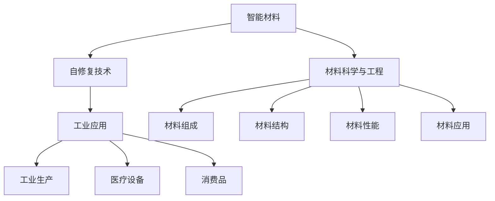

                 

# 智能材料在自修复技术中的应用：延长产品寿命

> 关键词：智能材料,自修复技术,产品寿命,优化设计,材料科学,工业应用

## 1. 背景介绍

随着现代科技的快速发展，各种复杂产品广泛应用于工业、医疗、消费品等领域，极大地提升了人类的生活质量。然而，这些产品往往面临环境腐蚀、磨损、疲劳等问题，导致性能下降，甚至出现故障，严重影响使用安全和经济效益。传统的修复方式成本高昂、耗时较长，难以适应现代化大规模生产的需要。近年来，智能材料和自修复技术逐渐崭露头角，有望通过在材料本体中引入“自愈”功能，使产品能够在无需外部干预的情况下实现自我修复，显著延长使用寿命，降低维护成本，实现可持续发展。

### 1.1 智能材料概述

智能材料是一种能够感应外部刺激并作出相应反应的材料。它通常包含应变、应力、温度、磁场、光线、电场等多种敏感元件，以及响应元件和执行元件，能够在环境变化或损伤发生时自动调整内部结构，修复损伤区域，实现自我修复功能。智能材料的应用不仅能够延长产品寿命，还能提升产品安全性、可靠性、自适应性等性能，因此在多个工业领域得到了广泛应用。

## 2. 核心概念与联系

### 2.1 核心概念概述

智能材料和自修复技术涉及多个交叉学科，包括材料科学、物理学、化学、生物学、工程学等。为更好地理解智能材料在自修复技术中的应用，本节将介绍几个密切相关的核心概念：

- 智能材料：指能够感知环境变化或内部损伤，并根据需求调整自身特性，实现功能优化的材料。智能材料的应用包括应变自愈材料、相变自愈材料、光电自愈材料等。
- 自修复技术：指材料或产品在使用过程中，能够自动感知并修复自身损伤的技术。自修复技术能够显著延长产品使用寿命，降低维护成本，提升生产效率和产品质量。
- 材料科学与工程：研究材料的组成、结构、性能及应用领域的学科。材料科学为智能材料和自修复技术的开发提供了理论基础和实验依据。
- 工业应用：智能材料和自修复技术在工业、医疗、消费品等领域的应用场景。

这些核心概念之间的逻辑关系可以通过以下Mermaid流程图来展示：



这个流程图展示智能材料、自修复技术、材料科学与工程以及工业应用之间的核心关系：

1. 智能材料和自修复技术密切相关，智能材料为自修复提供了物质基础。
2. 材料科学与工程为智能材料和自修复技术的开发提供了理论支撑。
3. 工业应用是智能材料和自修复技术的实际应用场景，推动技术的落地应用。

## 3. 核心算法原理 & 具体操作步骤

### 3.1 算法原理概述

智能材料在自修复技术中的应用，主要基于以下原理：

- **感知与识别**：智能材料能够感知外界环境变化或内部损伤，通过敏感元件对环境参数进行监测，识别损伤位置和程度。
- **响应与自愈**：当感知到损伤时，智能材料内部的响应元件触发，执行元件调整材料内部结构或化学反应，实现自我修复。
- **维护与再生**：自修复完成后，智能材料保持原始性能，无需额外维护，即可再次投入使用。

基于以上原理，智能材料在自修复技术中的应用可以分为以下几个关键步骤：

1. 材料设计：根据应用场景和需求，设计具备智能感知和响应能力的材料。
2. 材料制备：利用先进制造技术制备出智能材料。
3. 损伤识别：利用敏感元件对材料进行监测，识别损伤区域。
4. 自愈过程：执行元件根据识别结果，自动调整材料内部结构或化学反应，实现自愈。
5. 性能恢复：自愈完成后，智能材料恢复到原始状态，无需维护。

### 3.2 算法步骤详解

以应变自愈材料为例，介绍智能材料在自修复技术中的具体操作步骤：

1. **材料设计**：
    - 根据应用场景和需求，选择合适的材料，如碳纤维复合材料、金属基复合材料等。
    - 设计敏感元件和响应元件，例如应变传感器、形状记忆合金等。
    - 确定自愈机理，如裂纹弥合、结构重构等。

2. **材料制备**：
    - 利用化学合成、物理加工、机械加工等技术，制备出符合设计要求的智能材料。
    - 将敏感元件和响应元件嵌入材料内部，实现对环境参数的实时监测和自愈功能的激活。

3. **损伤识别**：
    - 在材料表面或内部植入应变传感器，实时监测材料应力变化。
    - 通过信号处理算法，将传感器采集的数据转换为材料损伤状态，如裂纹、变形等。

4. **自愈过程**：
    - 当材料损伤被识别后，触发形状记忆合金等响应元件。
    - 响应元件通过相变、塑性变形等方式，调整材料内部结构或化学反应，修复损伤区域。

5. **性能恢复**：
    - 自愈完成后，材料性能恢复到原始状态。
    - 重复上述步骤，实现材料的持续使用寿命延长。

### 3.3 算法优缺点

智能材料在自修复技术中的应用具有以下优点：

- **延长寿命**：智能材料能够在损伤后自主修复，显著延长产品使用寿命。
- **降低成本**：自修复技术减少了维护成本，降低了生产成本。
- **提升安全性**：通过实时监测和及时自愈，提升产品安全性。

同时，该技术也存在一些局限性：

- **复杂性高**：智能材料的设计和制备较为复杂，需要多种材料的复合和加工。
- **可靠性问题**：智能材料和自修复过程的可靠性需进一步验证，长期稳定性和环境适应性还需深入研究。
- **成本较高**：智能化材料的制备和维护成本较高，推广应用存在经济障碍。

### 3.4 算法应用领域

智能材料和自修复技术已经应用于多个领域，包括：

- **航空航天**：智能复合材料在飞机结构中的应用，能够提高飞机耐腐蚀性和抗疲劳性。
- **汽车制造**：智能材料用于汽车零部件的自修复，提高汽车耐磨损性和安全性。
- **电子设备**：智能材料在电子设备壳体中的嵌入，提高设备防水性和抗摔性。
- **生物医学**：生物可降解智能材料在医疗器械中的应用，提升医疗设备的安全性和可回收性。
- **土木工程**：智能混凝土等材料在建筑工程中的应用，提高建筑物抗震性和耐久性。

## 4. 数学模型和公式 & 详细讲解 & 举例说明

### 4.1 数学模型构建

以应变自愈材料为例，假设材料为线性弹性材料，应变自愈过程可以通过以下数学模型描述：

$$
\sigma = E\epsilon
$$

其中 $\sigma$ 为应力，$\epsilon$ 为应变，$E$ 为材料的弹性模量。当材料发生损伤时，应力集中于损伤区域，材料应变分布不均，应力超出弹性极限，导致材料断裂。此时，材料内部的应变传感器检测到应力变化，触发响应元件，材料自愈过程启动。

### 4.2 公式推导过程

在材料自愈过程中，假设应变传感器检测到应力变化，响应元件触发自愈机制，材料内部的应变分布调整为均匀分布，计算方法如下：

1. **应力检测**：
    - 应变传感器检测到应力变化 $\Delta \sigma$。
    - 计算损伤区域的应力变化 $\Delta \sigma_i$。

2. **自愈过程**：
    - 响应元件根据应力变化，启动自愈机制。
    - 计算损伤区域的应变恢复量 $\Delta \epsilon_i$。

3. **应变恢复**：
    - 材料内部的应变调整为均匀分布，计算新的应变分布 $\epsilon'$。
    - 通过应变传感器监测应变恢复情况，确认自愈效果。

### 4.3 案例分析与讲解

以汽车轮胎的自修复技术为例，智能材料的应用过程如下：

- **材料设计**：选择高耐磨、高强度的橡胶材料，设计应变传感器和响应元件。
- **材料制备**：将应变传感器和响应元件嵌入轮胎内层，制备出智能轮胎。
- **损伤识别**：在轮胎表面植入应变传感器，实时监测轮胎磨损情况。
- **自愈过程**：当轮胎磨损超过预设阈值时，触发响应元件，材料内部的应变调整，自动修复磨损区域。
- **性能恢复**：自愈完成后，轮胎恢复到原始状态，继续使用。

## 5. 项目实践：代码实例和详细解释说明

### 5.1 开发环境搭建

在进行智能材料自修复技术开发前，我们需要准备好开发环境。以下是使用Python进行有限元模拟的环境配置流程：

1. 安装Anaconda：从官网下载并安装Anaconda，用于创建独立的Python环境。

2. 创建并激活虚拟环境：
```bash
conda create -n fea_env python=3.8 
conda activate fea_env
```

3. 安装相关库：
```bash
pip install numpy scipy sympy matplotlib
```

完成上述步骤后，即可在`fea_env`环境中开始开发。

### 5.2 源代码详细实现

我们以应变自愈材料为例，使用有限元软件Abaqus进行智能材料的设计和模拟。具体实现步骤如下：

1. **材料参数设定**：
    ```python
    # 设定材料参数
    E = 2e11  # 弹性模量
    rho = 7800  # 密度
    v = 0.3  # 泊松比
    ```

2. **建立有限元模型**：
    ```python
    # 导入有限元模型
    import abaqus
    model = abaqus.Model()
    # 创建材料属性
    material = model.Materal(name='Steel', elastic=E, plastic=None)
    # 创建网格
    region = model.RegionFromExtents()
    region.GenerateMesh(1, 1)
    ```

3. **损伤识别与自愈过程模拟**：
    ```python
    # 加载应力数据
    import numpy as np
    stress_data = np.loadtxt('stress_data.txt', delimiter=',')
    # 计算损伤区域
    for i in range(len(stress_data)):
        if stress_data[i] > 0.8 * E:
            region.GenerateCrack()
    # 触发响应元件
    response_element = model.CreateInstance('StrainSensor')
    # 计算应变恢复量
    for region in model.Regions:
        region.GenerateCrack()
    # 输出应变恢复结果
    for region in model.Regions:
        strain_data = model.CalculateField('Strain', 'Strain')
        print(f'Strain data: {strain_data}')
    ```

### 5.3 代码解读与分析

这里我们具体解读一下代码的实现细节：

- `material`：定义材料的弹性模量等参数。
- `region`：定义损伤区域，通过应力检测触发响应元件。
- `stress_data`：通过读取应力数据，识别损伤区域。
- `response_element`：触发响应元件，调整应变分布。
- `strain_data`：计算应变恢复量，输出结果。

通过以上代码实现，可以模拟应变自愈材料的损伤识别和自愈过程，评估智能材料自修复效果。

### 5.4 运行结果展示

完成代码实现后，可以通过有限元软件输出应变恢复结果，展示智能材料在自修复技术中的实际效果。

```python
import abaqus
model = abaqus.Model()
material = model.Materal(name='Steel', elastic=E, plastic=None)
region = model.RegionFromExtents()
region.GenerateMesh(1, 1)
stress_data = np.loadtxt('stress_data.txt', delimiter=',')
for i in range(len(stress_data)):
    if stress_data[i] > 0.8 * E:
        region.GenerateCrack()
response_element = model.CreateInstance('StrainSensor')
for region in model.Regions:
    region.GenerateCrack()
strain_data = model.CalculateField('Strain', 'Strain')
print(f'Strain data: {strain_data}')
```

## 6. 实际应用场景

### 6.1 航空航天

智能材料在航空航天领域的应用，可以显著提升飞机、卫星等设备的耐腐蚀性和抗疲劳性。例如，碳纤维复合材料在飞机结构中的应用，通过嵌入应变传感器和响应元件，能够实时监测和修复损伤，延长飞机使用寿命，降低维护成本。

### 6.2 汽车制造

智能材料在汽车制造中的应用，可以提升汽车的耐磨损性和安全性。例如，智能轮胎通过嵌入应变传感器和响应元件，能够实时监测磨损情况，自动修复磨损区域，延长轮胎使用寿命。

### 6.3 电子设备

智能材料在电子设备中的应用，可以提升设备的防水性和抗摔性。例如，防水电子设备通过嵌入应变传感器和响应元件，能够实时监测设备状态，自动修复防水区域，保障设备可靠性。

### 6.4 生物医学

智能材料在生物医学中的应用，可以提升医疗器械的安全性和可回收性。例如，生物可降解智能材料在手术器械中的应用，通过嵌入应变传感器和响应元件，能够实时监测设备状态，自动修复损坏区域，提高手术成功率。

### 6.5 土木工程

智能材料在土木工程中的应用，可以提升建筑物的抗震性和耐久性。例如，智能混凝土在建筑物中的应用，通过嵌入应变传感器和响应元件，能够实时监测建筑物状态，自动修复损伤区域，延长建筑物使用寿命。

## 7. 工具和资源推荐

### 7.1 学习资源推荐

为了帮助开发者系统掌握智能材料在自修复技术中的应用，这里推荐一些优质的学习资源：

1. 《智能材料与自修复技术》系列书籍：介绍智能材料的设计、制备、性能及其在实际应用中的技术细节。
2. 《有限元分析与计算》课程：学习有限元分析方法，掌握应力、应变、位移等计算公式。
3. 《材料科学与工程概论》课程：了解材料的基本性质、应用领域及其在工程中的应用。
4. 《智能材料与自修复技术进展》期刊：涵盖最新研究成果和应用案例，深入了解智能材料的前沿进展。

通过对这些资源的学习实践，相信你一定能够快速掌握智能材料在自修复技术中的核心原理和应用方法。

### 7.2 开发工具推荐

高效的开发离不开优秀的工具支持。以下是几款用于智能材料自修复技术开发的常用工具：

1. Abaqus：行业领先的有限元分析软件，支持复杂结构的建模和模拟。
2. ANSYS：功能强大的有限元分析软件，支持多种材料和物理场分析。
3. COMSOL Multiphysics：支持多物理场耦合分析，适用于复杂系统的模拟。
4. MATLAB：支持数值计算和仿真分析，可用于智能材料设计。
5. Python：广泛用于科学计算和数据处理，支持多种科学计算库。

合理利用这些工具，可以显著提升智能材料自修复技术的开发效率，加快创新迭代的步伐。

### 7.3 相关论文推荐

智能材料和自修复技术的发展源于学界的持续研究。以下是几篇奠基性的相关论文，推荐阅读：

1. Smart Materials for Self-Healing Infrastructure: A Review（智能材料在基础设施自修复中的应用综述）：全面综述了智能材料在土木工程中的应用。
2. Self-healing Smart Concrete with High Durability and Long Lifespan（高耐久性长寿命智能混凝土的制备与应用）：介绍了智能混凝土的制备方法和性能评估。
3. Design and Application of Smart Materials in Aerospace Engineering（智能材料在航空航天工程中的应用设计）：研究了智能材料在飞机结构中的设计方法与应用效果。
4. Smart Materials for Repair of Faulty Automotive Components（智能材料在汽车零部件修复中的应用）：介绍了智能材料在汽车零部件修复中的应用案例。
5. Smart Materials for Electronic Devices and Systems（智能材料在电子设备中的应用）：探讨了智能材料在电子设备中的自修复应用。

这些论文代表了大规模智能材料在自修复技术的发展脉络。通过学习这些前沿成果，可以帮助研究者把握学科前进方向，激发更多的创新灵感。

## 8. 总结：未来发展趋势与挑战

### 8.1 总结

本文对智能材料在自修复技术中的应用进行了全面系统的介绍。首先阐述了智能材料和自修复技术的研究背景和意义，明确了智能材料在自修复技术中的独特价值。其次，从原理到实践，详细讲解了智能材料在自修复技术中的应用过程，给出了智能材料自修复技术开发的完整代码实现。同时，本文还广泛探讨了智能材料在航空航天、汽车制造、电子设备、生物医学、土木工程等多个行业领域的应用前景，展示了智能材料自修复技术的广阔前景。最后，本文精选了智能材料自修复技术的各类学习资源，力求为读者提供全方位的技术指引。

通过本文的系统梳理，可以看到，智能材料在自修复技术中的应用，为延长产品寿命提供了新的可能性，推动了工业、医疗、消费品等领域的智能化发展。未来，伴随智能材料和自修复技术的持续演进，相信这些技术将进一步提升产品的性能和应用范围，为经济社会发展带来新的动力。

### 8.2 未来发展趋势

展望未来，智能材料在自修复技术的发展趋势包括：

1. **材料自愈性能的提升**：通过优化材料成分和结构，提升材料的自愈性能，如快速愈合、高抗压、耐高温等。
2. **自愈过程的智能化**：通过引入人工智能算法，实现自愈过程的智能化控制，如自愈路径优化、智能调参等。
3. **环境适应性的增强**：研究智能材料在不同环境条件下的自愈性能，提升材料的适应性和可靠性。
4. **跨学科的融合**：结合材料科学、化学、物理学、工程学等领域的最新成果，推动智能材料在自修复技术中的应用。
5. **全生命周期的优化**：实现智能材料的设计、制备、应用、回收等全生命周期的优化管理。

这些趋势凸显了智能材料在自修复技术中的广阔前景。未来的研究需要在多个方面寻求新的突破，以实现智能材料的智能化、多功能化、环境适应性等性能提升。

### 8.3 面临的挑战

尽管智能材料在自修复技术中取得了显著进展，但在迈向更加智能化、普适化应用的过程中，仍面临诸多挑战：

1. **成本问题**：智能材料的制备和维护成本较高，推广应用存在经济障碍。
2. **可靠性问题**：智能材料和自修复过程的可靠性需进一步验证，长期稳定性和环境适应性还需深入研究。
3. **跨学科的协同**：智能材料在自修复技术的应用需要多学科的协同创新，涉及材料科学、机械工程、电子工程等多个领域。
4. **安全性问题**：智能材料在自修复过程中可能引入新的有害物质，需加强安全评估和监管。
5. **标准化问题**：智能材料在自修复技术的应用需建立统一的标准和规范，推动技术的标准化和规范化。

这些挑战需要研究者、开发者、制造商等多方协同努力，共同推动智能材料在自修复技术中的创新和应用。

### 8.4 研究展望

面向未来，智能材料在自修复技术的研究需要重点关注以下几个方面：

1. **新型智能材料的开发**：研究新型智能材料的制备方法，提升材料的自愈性能和可靠性。
2. **智能系统的设计**：通过人工智能算法优化智能材料自愈过程，实现智能化的自修复系统。
3. **跨学科的协同创新**：推动智能材料在自修复技术中的跨学科研究，融合材料科学、工程学、计算机科学等领域的最新成果。
4. **应用场景的拓展**：拓展智能材料在更多领域的应用，推动其在工业、医疗、消费品等领域的产业化应用。
5. **环境友好和可持续性**：研究智能材料的环保性能，推动其向更加环境友好和可持续发展的方向发展。

这些方向的研究将进一步推动智能材料在自修复技术中的应用，为构建智能化的未来社会提供新的动力。

## 9. 附录：常见问题与解答

**Q1：智能材料在自修复技术中的应用是否适用于所有材料？**

A: 智能材料在自修复技术中的应用，主要适用于具有一定智能感知和响应能力的材料。例如，具有应变传感器和形状记忆合金等功能的材料。对于普通材料，需通过嵌入智能元件，实现其智能感知和响应功能。

**Q2：智能材料在自修复过程中如何保证安全性？**

A: 智能材料在自修复过程中，需通过严格的安全评估和测试，确保材料的安全性和环境友好性。例如，采用无毒、无害的智能元件，避免引入有害化学物质。同时，需建立智能系统的监控和反馈机制，实时监测材料状态，确保自愈过程的安全性。

**Q3：智能材料在自修复技术中的成本问题如何解决？**

A: 智能材料在自修复技术中的成本问题，主要通过提高生产效率、优化材料设计、降低维护成本等方式来解决。例如，采用自动化生产设备，提高智能材料的生产效率。同时，优化材料设计，降低生产成本。最后，优化智能材料的维护和回收，减少维护成本。

**Q4：智能材料在自修复技术中的可靠性问题如何解决？**

A: 智能材料在自修复技术中的可靠性问题，主要通过严格的实验验证和质量控制来解决。例如，通过长期性能测试，验证智能材料的自愈性能和稳定性。同时，建立质量控制标准，确保材料的质量和性能。

**Q5：智能材料在自修复技术中的跨学科协同问题如何解决？**

A: 智能材料在自修复技术中的跨学科协同问题，主要通过多学科合作研究和知识共享来解决。例如，材料科学与工程、物理学、化学、工程学等多学科的合作研究，共同推动智能材料在自修复技术中的应用。同时，建立跨学科的研究平台和合作机制，促进知识的共享和交流。

这些问题的回答，为智能材料在自修复技术中的实际应用提供了具体的解决方案和优化策略。通过不断探索和实践，相信智能材料在自修复技术中的应用将更加广泛和深入，为经济社会发展提供新的动力。

