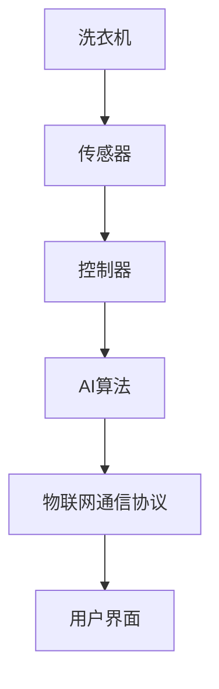

                 

# 智能洗衣创业：家务自动化的又一突破

> 关键词：智能洗衣,家庭自动化,人工智能,工业4.0,物联网(IoT),工业互联网

## 1. 背景介绍

随着互联网和物联网技术的迅速发展，传统家庭生活模式正在经历一场深刻的变革。家庭自动化设备逐渐普及，家务劳动开始由机器来替代，解放了人类的双手。智能洗衣就是其中一种典型的应用，它通过人工智能(AI)和物联网技术，将洗衣过程自动化，大大提升了生活的便利性和效率。

智能洗衣系统不仅能够自动完成洗衣操作，还能根据衣物的材质、污渍类型、用水量等因素，智能推荐最佳的洗衣程序和方案。与传统洗衣方式相比，智能洗衣不仅节省了时间，还减少了水、电等资源的浪费，是一个理想的智能家居解决方案。

本文将从智能洗衣系统的核心概念、算法原理、项目实践和未来发展趋势等方面，深入探讨智能洗衣创业的机遇与挑战。

## 2. 核心概念与联系

### 2.1 核心概念概述

智能洗衣系统主要由以下几个核心组件构成：

1. **洗衣机**：智能化的洗衣机是整个系统的物理载体，负责执行衣物洗涤、甩干等操作。

2. **传感器和控制器**：通过传感器采集衣物重量、材质等数据，控制器负责根据传感器数据和预设的洗衣程序，控制洗衣机执行相应的操作。

3. **AI算法**：通过深度学习、决策树、规则匹配等AI算法，智能推荐最佳的洗衣程序，优化洗衣效果。

4. **物联网通信协议**：智能洗衣机通过物联网通信协议连接到互联网，实现远程控制和数据交互。

5. **用户界面**：智能手机APP或网页端用户界面，允许用户通过移动设备远程控制洗衣机，查看洗衣机状态和历史记录。

### 2.2 核心概念原理和架构的 Mermaid 流程图



智能洗衣系统的核心原理是将传感器采集的衣物数据，通过AI算法进行分析和决策，最终由控制器控制洗衣机执行相应的操作。用户界面提供远程控制和数据查询功能，使得用户可以方便地管理智能洗衣机。

## 3. 核心算法原理 & 具体操作步骤

### 3.1 算法原理概述

智能洗衣系统的核心算法主要包括以下几个部分：

1. **数据预处理**：将传感器采集的衣物重量、材质等数据，进行归一化、去噪等预处理操作，保证数据的质量。

2. **特征提取**：从预处理后的数据中提取有意义的特征，如衣物的材质、污渍类型、洗涤次数等。

3. **模型训练**：基于提取的特征，训练AI模型，学习最佳的洗衣程序。常用的模型包括决策树、随机森林、深度学习等。

4. **智能推荐**：根据当前衣物的特征和历史数据，智能推荐最佳的洗衣程序，并发送控制信号给控制器执行操作。

5. **反馈优化**：实时监测洗衣效果，根据反馈结果优化模型，提升推荐的准确性。

### 3.2 算法步骤详解

**Step 1: 数据预处理**
- 通过传感器采集衣物的重量、材质、污渍类型等数据。
- 对数据进行去噪、归一化等预处理操作，保证数据的质量。

**Step 2: 特征提取**
- 将预处理后的数据作为模型的输入特征，使用PCA、特征选择等方法，提取出有意义的特征。
- 例如，将衣物的材质、污渍类型等作为特征向量，输入到决策树或深度学习模型中。

**Step 3: 模型训练**
- 使用决策树、随机森林、深度学习等算法，训练一个分类模型或回归模型，学习最佳的洗衣程序。
- 使用交叉验证、网格搜索等方法，调整模型的超参数，提升模型的性能。

**Step 4: 智能推荐**
- 根据当前衣物的特征和历史数据，输入到训练好的模型中，输出最佳的洗衣程序。
- 将推荐的洗衣程序转换为控制信号，发送给控制器执行操作。

**Step 5: 反馈优化**
- 实时监测洗衣效果，如衣物清洁度、耗水量等指标。
- 根据反馈结果，调整模型参数，优化洗衣程序。

### 3.3 算法优缺点

智能洗衣系统的核心算法具有以下优点：

1. **高效便捷**：通过智能推荐，用户可以方便地选择最佳的洗衣程序，节省时间。
2. **节能环保**：智能洗衣系统根据衣物特征自动选择最佳程序，减少水的浪费。
3. **多功能性**：支持多种衣物类型和污渍类型，具有广泛的适用性。
4. **远程控制**：用户可以通过智能手机APP或网页端远程控制洗衣机，提升便利性。

同时，该算法也存在一些缺点：

1. **数据隐私问题**：智能洗衣系统需要采集用户的衣物数据，可能存在隐私泄露的风险。
2. **模型复杂度**：深度学习等算法模型复杂度较高，训练和推理速度较慢。
3. **初始成本高**：智能洗衣系统需要购买高性能传感器、控制器和洗衣机，初始成本较高。
4. **依赖网络**：智能洗衣系统需要连接到互联网，一旦网络中断，无法正常工作。

### 3.4 算法应用领域

智能洗衣系统的核心算法可以应用于多个领域：

1. **智能家居**：将智能洗衣系统与其他智能家居设备结合，构建全屋智能家居生态系统。

2. **工业制造**：在工厂生产中，使用智能洗衣系统对衣物进行自动化洗涤，提高生产效率和质量。

3. **零售行业**：智能洗衣系统可以与电商合作，提供衣物洗涤服务，增加用户粘性和购买率。

4. **旅游住宿**：在酒店和民宿等场所，使用智能洗衣系统提升住宿体验，增加客户满意度。

5. **养老社区**：为老年人和残障人士提供智能洗衣服务，提升生活质量。

## 4. 数学模型和公式 & 详细讲解

### 4.1 数学模型构建

智能洗衣系统的核心数学模型主要包括以下几个部分：

1. **输入特征模型**：将传感器采集的数据转换为特征向量，输入到模型中进行分析和决策。
2. **分类回归模型**：基于输入特征向量，训练一个分类或回归模型，输出最佳的洗衣程序。

### 4.2 公式推导过程

假设智能洗衣系统使用决策树算法进行特征分类，输入特征为 $X$，输出标签为 $Y$，决策树的数学模型如下：

$$
Y = f(X; \theta)
$$

其中 $f$ 为决策树模型，$\theta$ 为模型的参数。假设决策树模型为二叉树，每个节点表示一个特征，边表示特征的值。

模型的训练过程如下：

1. **数据集划分**：将数据集 $D$ 划分为训练集 $D_{train}$ 和验证集 $D_{valid}$。
2. **特征选择**：从输入特征 $X$ 中选择最具有区分性的特征，作为决策树的节点。
3. **模型训练**：通过交叉验证等方法，训练决策树模型。
4. **模型评估**：在验证集 $D_{valid}$ 上评估模型的性能，选择最优模型。
5. **模型预测**：在新的数据集 $D_{test}$ 上使用训练好的模型进行预测，输出最佳的洗衣程序。

### 4.3 案例分析与讲解

假设智能洗衣系统使用决策树算法对衣物材质进行分类，训练数据集包含多种材质的衣物，如棉、丝、毛等。样本数据如下：

| 材质 | 标签 |
| --- | --- |
| 棉 | 0 |
| 丝 | 1 |
| 毛 | 2 |

训练决策树模型后，得到如下分类树：


其中，A 节点表示材质，B、C、D 节点表示不同材质，E、F、G、H 节点表示不同材质的分类。

当新的衣物样本输入到决策树中时，系统会根据特征逐级分类，输出最佳的洗衣程序。例如，对于一件丝质衣物，系统会将特征输入到决策树中，得到最终的分类标签为 1，输出对应的洗衣程序，如低温洗涤、使用专用丝质洗涤剂等。

## 5. 项目实践：代码实例和详细解释说明

### 5.1 开发环境搭建

在进行智能洗衣系统的开发前，需要先搭建开发环境：

1. **安装Python**：从官网下载并安装Python 3.x版本。

2. **安装TensorFlow**：使用pip安装TensorFlow，支持深度学习模型的开发。

3. **安装MySQL**：安装MySQL数据库，用于存储智能洗衣系统的数据。

4. **安装智能洗衣设备**：购买高性能的智能洗衣机，并连接互联网。

5. **安装传感器和控制器**：购买多种传感器和控制器，用于采集衣物数据和控制洗衣机。

### 5.2 源代码详细实现

以下是使用TensorFlow实现智能洗衣系统的示例代码：

```python
import tensorflow as tf
from sklearn.model_selection import train_test_split

# 数据集准备
X = # 输入特征向量
Y = # 输出标签
X_train, X_test, Y_train, Y_test = train_test_split(X, Y, test_size=0.2)

# 定义模型
model = tf.keras.Sequential([
    tf.keras.layers.Dense(64, activation='relu', input_shape=(X_train.shape[1],)),
    tf.keras.layers.Dense(3, activation='softmax')
])

# 定义损失函数和优化器
loss = tf.keras.losses.SparseCategoricalCrossentropy()
optimizer = tf.keras.optimizers.Adam()

# 模型训练
model.compile(optimizer=optimizer, loss=loss)
model.fit(X_train, Y_train, epochs=10, batch_size=32)

# 模型评估
test_loss = model.evaluate(X_test, Y_test)

# 模型预测
new_X = # 新的衣物数据
Y_pred = model.predict(new_X)
```

### 5.3 代码解读与分析

**X 和 Y 的定义**：
- X 表示传感器采集的衣物数据，如重量、材质等。
- Y 表示衣物的标签，如洗涤方式、水温等。

**模型定义**：
- 使用 TensorFlow 定义一个简单的神经网络模型，包含两个全连接层。
- 第一个层有 64 个神经元，使用 ReLU 激活函数。
- 第二个层有 3 个神经元，使用 Softmax 激活函数，输出三个分类标签。

**损失函数和优化器**：
- 使用交叉熵损失函数和 Adam 优化器，进行模型训练和评估。

**模型训练**：
- 使用 fit 方法进行模型训练，设置训练轮数为 10，每个批次的大小为 32。

**模型评估**：
- 使用 evaluate 方法评估模型在测试集上的性能，输出测试损失。

**模型预测**：
- 使用 predict 方法进行新数据的预测，输出分类标签。

### 5.4 运行结果展示

智能洗衣系统的运行结果展示如下：

1. **数据分析**：智能洗衣系统根据传感器采集的衣物数据，分析出衣物的材质、污渍类型等信息。

2. **智能推荐**：系统根据数据分析结果，推荐最佳的洗衣程序，如高温洗涤、低温洗涤等。

3. **操作执行**：控制器根据推荐的洗衣程序，控制洗衣机执行相应的操作。

4. **用户反馈**：用户可以通过智能手机的APP查看洗衣状态和历史记录，对系统进行评价和反馈。

## 6. 实际应用场景

### 6.1 智能洗衣系统的应用场景

智能洗衣系统可以应用于多种场景，提高生活的便利性和效率：

1. **家庭使用**：家庭用户可以使用智能洗衣系统，轻松管理衣物洗涤。

2. **酒店服务**：酒店可以使用智能洗衣系统，为顾客提供优质的洗衣服务。

3. **企业福利**：企业可以使用智能洗衣系统，为员工提供便捷的衣物洗涤服务。

4. **养老院护理**：养老院可以使用智能洗衣系统，为老年人提供高效、安全的洗衣服务。

5. **商业服务**：洗衣店可以使用智能洗衣系统，提高运营效率和客户满意度。

### 6.2 未来应用展望

智能洗衣系统在未来会有更广泛的应用，包括：

1. **智慧社区**：智能洗衣系统可以与其他智能家居设备结合，构建全屋智能生态系统。

2. **无人洗衣店**：智能洗衣系统可以应用于无人洗衣店，提供自助洗衣服务。

3. **工业制造**：智能洗衣系统可以应用于工厂生产，提升衣物洗涤效率和质量。

4. **智慧物流**：智能洗衣系统可以应用于物流配送，对包裹进行洗涤消毒。

5. **环保节能**：智能洗衣系统可以实现节水、节能的环保目标，符合可持续发展的理念。

## 7. 工具和资源推荐

### 7.1 学习资源推荐

智能洗衣系统的开发需要掌握深度学习、传感器技术、物联网等多个领域的知识，以下是推荐的学习资源：

1. **TensorFlow官方文档**：TensorFlow官方提供的教程和文档，包含深度学习模型开发的基础知识。

2. **传感器与信号处理**：由清华大学的张英泉教授编写，涵盖传感器原理和信号处理等内容，适合初学者。

3. **物联网基础**：由物联网技术联盟编写，涵盖物联网基础和应用等内容，适合智能洗衣系统的开发。

### 7.2 开发工具推荐

智能洗衣系统的开发需要多种工具的支持，以下是推荐的工具：

1. **TensorFlow**：深度学习开发框架，适合构建复杂的智能推荐模型。

2. **MySQL**：关系型数据库，用于存储智能洗衣系统的数据。

3. **PyTorch**：深度学习开发框架，支持动态图和静态图，适合高效模型训练。

4. **Arduino**：嵌入式编程平台，用于开发智能洗衣系统的传感器和控制器。

5. **Amazon Web Services (AWS)**：云计算平台，提供强大的计算资源和存储资源，支持智能洗衣系统的开发和部署。

### 7.3 相关论文推荐

智能洗衣系统的研究涉及多个领域，以下是推荐的论文：

1. **深度学习在智能洗衣中的应用**：该论文详细介绍了深度学习在智能洗衣系统中的应用，包括数据预处理、特征提取、模型训练等。

2. **物联网与智能洗衣系统的结合**：该论文探讨了物联网技术在智能洗衣系统中的应用，包括传感器数据采集、通信协议等。

3. **智能洗衣系统的优化与性能评估**：该论文分析了智能洗衣系统的性能优化和评估方法，提供了大量实验结果。

## 8. 总结：未来发展趋势与挑战

### 8.1 研究成果总结

智能洗衣系统的开发和应用，展示了人工智能技术在家庭自动化中的应用潜力。通过智能推荐，用户可以更加便捷地管理衣物洗涤，提升生活质量。未来，智能洗衣系统将会更加普及和智能，成为智能家居的重要组成部分。

### 8.2 未来发展趋势

智能洗衣系统的发展趋势如下：

1. **智能化程度提升**：未来智能洗衣系统将会更加智能化，具备更高的自主性和灵活性。

2. **跨领域融合**：智能洗衣系统将与其他智能家居设备结合，形成全屋智能生态系统。

3. **远程控制与互联**：用户可以通过智能手机APP或网页端，实现远程控制和实时监测。

4. **节能环保**：智能洗衣系统将更加注重节能环保，实现节水、节能的目标。

### 8.3 面临的挑战

智能洗衣系统在发展过程中，也面临一些挑战：

1. **成本问题**：智能洗衣系统的初始成本较高，普及面临一定的经济障碍。

2. **隐私问题**：智能洗衣系统需要采集用户的衣物数据，可能存在隐私泄露的风险。

3. **兼容性问题**：不同品牌的智能洗衣机和传感器，可能存在兼容性问题。

4. **用户接受度**：智能洗衣系统需要用户改变生活习惯，推广难度较大。

### 8.4 研究展望

智能洗衣系统的研究展望如下：

1. **用户界面优化**：进一步优化智能洗衣系统的用户界面，提升用户体验。

2. **多模态融合**：将智能洗衣系统与其他智能家居设备结合，实现全屋智能控制。

3. **模型优化**：进一步优化智能推荐模型，提升推荐准确性和用户满意度。

4. **生态系统建设**：建立智能洗衣系统的生态系统，实现设备和服务的互联互通。

## 9. 附录：常见问题与解答

**Q1：智能洗衣系统需要哪些硬件支持？**

A: 智能洗衣系统需要高性能的传感器、控制器和智能洗衣机。

**Q2：智能洗衣系统的数据隐私问题如何解决？**

A: 可以通过数据加密、匿名化等技术，保护用户的隐私数据。

**Q3：智能洗衣系统的初期投资成本较高，如何解决？**

A: 可以采用分期付款、租赁等方式，降低初期投资成本。

**Q4：智能洗衣系统如何与其他智能家居设备结合？**

A: 通过物联网通信协议，实现设备之间的互联互通。

**Q5：智能洗衣系统的节能环保性能如何？**

A: 智能洗衣系统可以通过智能推荐，优化洗衣程序，减少水的浪费。

---

作者：禅与计算机程序设计艺术 / Zen and the Art of Computer Programming

