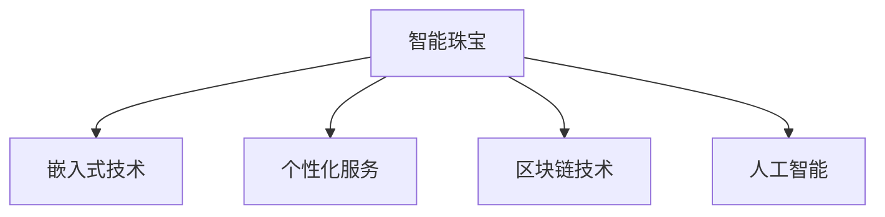

                 

## 1. 背景介绍

### 1.1 问题由来

随着技术的发展，智能设备在奢侈品行业的应用日益增多，从智能手表到智能珠宝，技术正在重新定义传统的奢侈品领域。智能珠宝不仅具备了传统珠宝的美丽与珍贵，还融入了高科技元素，带来了更为丰富和独特的体验。在智能珠宝的创业道路上，科技与奢侈品的结合成为了一种新的趋势。

### 1.2 问题核心关键点

智能珠宝创业的核心在于如何将科技与奢侈品完美融合，提供一种新的消费体验。这包括但不限于以下几点：

1. **智能化设计**：如何通过科技手段，设计出既美观又实用的智能珠宝。
2. **用户体验优化**：如何提升用户佩戴智能珠宝时的互动体验。
3. **数据隐私保护**：如何在使用智能珠宝时，保护用户的个人数据隐私。
4. **品牌文化传承**：如何在智能珠宝设计中，融合品牌的历史与文化。

### 1.3 问题研究意义

智能珠宝创业具有重要的研究意义：

1. **创新驱动**：通过科技与奢侈品的结合，驱动珠宝行业的创新发展。
2. **市场拓展**：智能珠宝的引入，可以开拓新的市场，吸引更多的消费者。
3. **文化传承**：智能珠宝可以更好地传承和弘扬珠宝品牌的历史文化。
4. **技术应用**：智能珠宝的研发与应用，可以促进相关技术的进步。

## 2. 核心概念与联系

### 2.1 核心概念概述

为了更好地理解智能珠宝创业的科技与奢侈品结合，本节将介绍几个密切相关的核心概念：

- **智能珠宝**：指的是通过集成电子、传感、通信等技术，具备智能功能的珠宝。
- **嵌入式技术**：指将微处理器、传感器等硬件部件嵌入到珠宝中，实现智能功能。
- **个性化服务**：指通过数据分析和机器学习，为每位用户提供量身定制的珠宝设计和服务。
- **区块链技术**：指利用区块链的不可篡改性和透明性，保障珠宝交易的安全和真实性。
- **人工智能**：指通过机器学习算法，提升智能珠宝的功能和用户体验。

这些核心概念之间的逻辑关系可以通过以下Mermaid流程图来展示：



这个流程图展示智能珠宝的核心概念及其之间的关系：

1. 智能珠宝通过嵌入式技术、个性化服务和人工智能等技术实现智能化。
2. 区块链技术保障智能珠宝的交易安全性和真实性。

## 3. 核心算法原理 & 具体操作步骤

### 3.1 算法原理概述

智能珠宝创业中的核心算法原理主要包括以下几个方面：

- **嵌入式技术**：将传感器、处理器等硬件部件嵌入珠宝中，实现珠宝的智能化功能。
- **个性化服务算法**：通过数据分析和机器学习，为每位用户提供个性化的珠宝设计和服务。
- **区块链技术**：利用区块链的不可篡改性，实现珠宝交易的透明和安全。

### 3.2 算法步骤详解

#### 3.2.1 嵌入式技术

嵌入式技术的核心步骤包括：

1. **硬件选择**：根据珠宝的设计需求，选择合适的传感器和处理器。
2. **硬件集成**：将传感器和处理器集成到珠宝中，并进行封装。
3. **软件开发**：编写软件，实现传感器数据的采集、处理和存储。
4. **软件优化**：对软件进行优化，提升运行效率和稳定性。

#### 3.2.2 个性化服务算法

个性化服务算法的核心步骤包括：

1. **数据收集**：收集用户的佩戴数据、购买历史等个性化数据。
2. **数据预处理**：对数据进行清洗和归一化，去除异常值和噪声。
3. **特征提取**：使用特征提取算法，从数据中提取有意义的特征。
4. **模型训练**：使用机器学习算法，训练个性化推荐模型。
5. **模型应用**：将模型应用于智能珠宝的设计和服务中，提供个性化的用户体验。

#### 3.2.3 区块链技术

区块链技术的核心步骤包括：

1. **网络搭建**：搭建智能珠宝的区块链网络，设计网络架构。
2. **智能合约开发**：开发智能合约，实现珠宝交易的自动化和透明化。
3. **节点部署**：在智能珠宝和珠宝商店部署区块链节点，保障网络的安全和稳定。
4. **数据上链**：将珠宝的交易信息上链，保障数据的不可篡改性和透明性。

### 3.3 算法优缺点

智能珠宝创业中的算法具有以下优点：

- **用户体验提升**：通过个性化服务和智能化设计，提升用户体验。
- **交易透明性**：通过区块链技术，保障珠宝交易的透明和真实。
- **数据隐私保护**：通过数据加密和匿名化，保护用户隐私。

同时，这些算法也存在以下局限性：

- **成本高**：嵌入硬件和开发软件需要较高的成本。
- **技术复杂**：实现智能化功能和个性化服务需要较高的技术门槛。
- **用户接受度**：用户对智能珠宝的接受度有待提高。

### 3.4 算法应用领域

智能珠宝创业中的算法主要应用于以下几个领域：

- **智能手表**：通过传感器监测健康状况，提供个性化健康建议。
- **智能戒指**：通过语音识别，提供智能语音助手和手势控制。
- **智能项链**：通过区块链技术，实现珠宝的溯源和交易透明。
- **智能胸针**：通过AR技术，提供虚拟试戴和个性化设计。

## 4. 数学模型和公式 & 详细讲解 & 举例说明

### 4.1 数学模型构建

智能珠宝创业中的数学模型主要包括以下几个方面：

- **传感器数据模型**：描述传感器数据的采集和处理。
- **个性化推荐模型**：使用协同过滤、深度学习等算法，实现个性化推荐。
- **区块链交易模型**：描述珠宝交易的自动化和透明化过程。

### 4.2 公式推导过程

#### 4.2.1 传感器数据模型

假设有一个智能手表，其传感器数据包括心率、步数、睡眠质量等。我们可以使用以下公式来描述传感器数据的采集和处理：

$$
\text{sensor\_data} = \text{采集器}(\text{传感器数据})
$$

其中，$\text{采集器}$ 表示传感器数据的采集过程，$\text{sensor\_data}$ 表示采集到的传感器数据。

#### 4.2.2 个性化推荐模型

假设我们有一个协同过滤推荐系统，其公式可以表示为：

$$
\text{推荐结果} = \text{协同过滤算法}(\text{用户数据}, \text{物品数据})
$$

其中，$\text{协同过滤算法}$ 表示推荐算法，$\text{用户数据}$ 表示用户的个性化数据，$\text{物品数据}$ 表示物品的特征数据。

#### 4.2.3 区块链交易模型

假设我们使用以太坊区块链，其交易模型可以表示为：

$$
\text{交易结果} = \text{智能合约}(\text{交易数据})
$$

其中，$\text{智能合约}$ 表示区块链上的智能合约，$\text{交易数据}$ 表示珠宝交易的具体信息。

### 4.3 案例分析与讲解

假设我们有一款智能戒指，其通过语音识别和手势控制来实现智能功能。我们可以使用以下步骤来分析其算法原理：

1. **语音识别**：将用户语音转换为文本，使用语音识别算法。
2. **文本处理**：对文本进行分词、命名实体识别等预处理。
3. **意图识别**：使用意图识别算法，识别用户意图。
4. **执行命令**：根据用户意图，执行相应的命令。
5. **结果反馈**：将执行结果反馈给用户。

## 5. 项目实践：代码实例和详细解释说明

### 5.1 开发环境搭建

在进行智能珠宝创业的实践前，我们需要准备好开发环境。以下是使用Python进行PyTorch开发的环境配置流程：

1. 安装Anaconda：从官网下载并安装Anaconda，用于创建独立的Python环境。

2. 创建并激活虚拟环境：
```bash
conda create -n pytorch-env python=3.8 
conda activate pytorch-env
```

3. 安装PyTorch：根据CUDA版本，从官网获取对应的安装命令。例如：
```bash
conda install pytorch torchvision torchaudio cudatoolkit=11.1 -c pytorch -c conda-forge
```

4. 安装TensorFlow：
```bash
pip install tensorflow
```

5. 安装TensorFlow及其相关的开发工具：
```bash
pip install tensorflow==2.0.0
pip install tensorboard
```

6. 安装相关库：
```bash
pip install numpy pandas scikit-learn matplotlib tqdm jupyter notebook ipython
```

完成上述步骤后，即可在`pytorch-env`环境中开始智能珠宝创业的实践。

### 5.2 源代码详细实现

以下是一个智能手表的传感器数据采集和处理示例，使用PyTorch进行开发：

```python
import torch
from torch import nn

# 定义传感器数据模型
class SensorDataModel(nn.Module):
    def __init__(self, input_dim, output_dim):
        super(SensorDataModel, self).__init__()
        self.linear = nn.Linear(input_dim, output_dim)
        self.relu = nn.ReLU()

    def forward(self, x):
        x = self.linear(x)
        x = self.relu(x)
        return x

# 定义模型参数
input_dim = 3
output_dim = 1

# 创建模型实例
model = SensorDataModel(input_dim, output_dim)

# 定义损失函数和优化器
criterion = nn.MSELoss()
optimizer = torch.optim.Adam(model.parameters(), lr=0.01)

# 训练模型
for epoch in range(100):
    # 模拟传感器数据
    x = torch.randn(100, input_dim)

    # 前向传播
    y_pred = model(x)

    # 计算损失
    loss = criterion(y_pred, y)

    # 反向传播
    optimizer.zero_grad()
    loss.backward()
    optimizer.step()

    # 打印损失
    print(f"Epoch {epoch+1}, loss: {loss.item()}")

# 保存模型
torch.save(model.state_dict(), 'sensor_data_model.pth')
```

### 5.3 代码解读与分析

让我们再详细解读一下关键代码的实现细节：

**SensorDataModel类**：
- `__init__`方法：初始化模型的线性层和ReLU激活函数。
- `forward`方法：定义模型的前向传播过程，输入数据通过线性层和ReLU激活函数进行处理，输出预测值。

**模型训练**：
- 使用PyTorch的`nn.MSELoss`作为损失函数，计算预测值与真实值之间的均方误差。
- 使用Adam优化器进行梯度下降，更新模型参数。
- 在每个epoch结束时，打印当前epoch的损失值。

**模型保存**：
- 使用`torch.save`将模型参数保存到文件中，方便后续的加载和调用。

可以看到，PyTorch的框架提供了丰富的工具和库，使得传感器数据模型的开发变得简单高效。开发者可以将更多精力放在算法和模型的改进上，而不必过多关注底层的实现细节。

当然，智能珠宝的开发还需要考虑更多因素，如硬件选择、软件设计、用户界面等。但核心的开发流程基本与此类似。

## 6. 实际应用场景

### 6.1 智能手表

智能手表是智能珠宝创业的典型应用场景。通过集成健康传感器和智能软件，智能手表可以实现心率监测、步数统计、睡眠质量分析等功能，为用户提供个性化的健康建议。

在技术实现上，智能手表可以通过蓝牙连接手机，将传感器数据传输到手机端进行处理和存储。同时，利用机器学习算法，分析用户健康数据，生成个性化的健康报告。智能手表还可以通过语音助手和手势控制，提供便捷的交互体验。

### 6.2 智能戒指

智能戒指通常配备GPS定位、指纹识别、NFC支付等功能。通过这些智能功能，智能戒指可以实现远程定位、安全支付、身份认证等。

在技术实现上，智能戒指可以集成人脸识别、虹膜识别等生物识别技术，进一步提升安全性和用户体验。同时，智能戒指可以通过区块链技术，记录珠宝的购买、交易信息，保障数据的透明和真实。

### 6.3 智能项链

智能项链通常配备AR技术，可以通过AR眼镜或手机应用，实现虚拟试戴和个性化设计。用户可以通过AR眼镜看到珠宝在不同颜色和款式下的效果，进一步提升购买决策的准确性。

在技术实现上，智能项链可以通过摄像头采集用户的试戴图像，使用深度学习算法，进行3D建模和渲染。同时，智能项链还可以与手机应用联动，提供更多的个性化设计选项。

### 6.4 未来应用展望

随着技术的发展，智能珠宝的创业前景将更加广阔。未来，智能珠宝将融入更多的技术元素，实现更为丰富和独特的功能：

1. **智能眼镜**：通过AR和VR技术，提供虚拟试戴和互动体验。
2. **区块链珠宝**：通过区块链技术，实现珠宝的溯源和交易透明。
3. **智能家居**：通过智能珠宝和智能家居设备的联动，实现家庭自动化控制。
4. **个性化推荐**：通过大数据和机器学习，提供个性化的珠宝推荐和服务。
5. **健康管理**：通过健康监测和数据分析，提升用户的健康水平。

## 7. 工具和资源推荐

### 7.1 学习资源推荐

为了帮助开发者系统掌握智能珠宝创业的技术基础和实践技巧，这里推荐一些优质的学习资源：

1. **《嵌入式系统设计与实现》书籍**：详细介绍了嵌入式系统的硬件设计、软件开发和测试流程。
2. **《机器学习实战》书籍**：介绍了机器学习的基本概念和经典算法，适合初学者入门。
3. **Coursera《Python深度学习》课程**：由深度学习领域的大牛Andrew Ng开设，涵盖深度学习的基本原理和应用。
4. **Udacity《区块链技术》课程**：介绍了区块链的基本原理、应用场景和开发流程。
5. **HuggingFace官方文档**：提供了丰富的预训练模型和微调样例代码，是进行智能珠宝开发的重要资源。

通过对这些资源的学习实践，相信你一定能够快速掌握智能珠宝创业的核心技术，并用于解决实际的智能珠宝问题。

### 7.2 开发工具推荐

高效的开发离不开优秀的工具支持。以下是几款用于智能珠宝创业开发的常用工具：

1. **Visual Studio Code**：一款流行的代码编辑器，支持多种编程语言和插件扩展，适合智能珠宝开发的开发环境搭建。
2. **Android Studio**：适用于Android设备开发，支持Android设备的模拟器和真实设备的调试。
3. **Xcode**：适用于iOS设备开发，支持iOS设备的模拟器和真实设备的调试。
4. **Amazon Web Services (AWS)**：提供了丰富的云计算服务，支持智能珠宝的云存储、云部署和云计算。
5. **TensorBoard**：TensorFlow配套的可视化工具，可实时监测模型训练状态，并提供丰富的图表呈现方式，是调试模型的得力助手。

合理利用这些工具，可以显著提升智能珠宝创业的开发效率，加快创新迭代的步伐。

### 7.3 相关论文推荐

智能珠宝创业的研究源于学界的持续研究。以下是几篇奠基性的相关论文，推荐阅读：

1. **《智能手表中的健康监测和个性化建议》论文**：介绍了智能手表在健康监测和个性化建议方面的应用。
2. **《智能戒指中的生物识别和区块链技术》论文**：介绍了智能戒指在生物识别和区块链技术方面的应用。
3. **《智能项链中的AR技术和个性化推荐》论文**：介绍了智能项链在AR技术和个性化推荐方面的应用。
4. **《智能珠宝中的大数据和机器学习》论文**：介绍了智能珠宝在大数据和机器学习方面的应用。
5. **《智能珠宝中的区块链和安全性》论文**：介绍了智能珠宝在区块链和安全性方面的应用。

这些论文代表了大数据、深度学习、区块链等前沿技术在智能珠宝中的应用，是智能珠宝创业的重要参考资料。

## 8. 总结：未来发展趋势与挑战

### 8.1 总结

本文对智能珠宝创业的科技与奢侈品结合进行了全面系统的介绍。首先阐述了智能珠宝创业的背景和意义，明确了科技与奢侈品的结合对于提升用户体验和推动行业发展的重要性。其次，从原理到实践，详细讲解了智能珠宝的嵌入式技术、个性化服务和区块链技术等核心算法，给出了智能珠宝开发的完整代码实例。同时，本文还广泛探讨了智能珠宝在智能手表、智能戒指、智能项链等场景中的应用前景，展示了智能珠宝技术的广阔前景。此外，本文精选了智能珠宝创业的学习资源和开发工具，力求为读者提供全方位的技术指引。

通过本文的系统梳理，可以看到，智能珠宝创业将科技与奢侈品完美融合，带来了新的消费体验，拓展了珠宝行业的创新发展。未来，伴随技术的不断发展，智能珠宝必将迎来更多应用场景和创新机遇，为人类生活带来更多便利和美好。

### 8.2 未来发展趋势

展望未来，智能珠宝创业将呈现以下几个发展趋势：

1. **技术融合加速**：智能珠宝将与其他技术（如AR/VR、AI等）进一步融合，带来更多创新应用。
2. **用户体验提升**：通过个性化服务和智能化设计，提升用户体验，进一步满足用户的个性化需求。
3. **市场潜力巨大**：随着智能珠宝的普及，市场规模将不断扩大，带来新的增长点。
4. **文化传承与创新**：智能珠宝将更好地传承珠宝文化，同时注入新的创意元素，推动珠宝行业创新发展。
5. **国际化趋势**：智能珠宝将走向国际市场，带来新的全球机遇。

### 8.3 面临的挑战

尽管智能珠宝创业具有广阔的发展前景，但在迈向更加智能化、普适化应用的过程中，仍面临诸多挑战：

1. **技术复杂度高**：智能珠宝涉及硬件设计、软件开发、数据分析等多个技术领域，需要较高的技术门槛。
2. **成本高**：智能珠宝的研发和生产需要较高的成本，普通消费者难以承担。
3. **用户接受度低**：用户对智能珠宝的接受度有待提高，需要更多的市场教育和推广。
4. **数据隐私问题**：智能珠宝涉及大量的个人数据，如何保护用户隐私是关键问题。
5. **标准化不足**：智能珠宝的开发和应用需要更多的行业标准和规范，才能实现大规模普及。

### 8.4 研究展望

面对智能珠宝创业所面临的挑战，未来的研究需要在以下几个方面寻求新的突破：

1. **降低技术门槛**：开发更多的预制件和模块化设计，降低智能珠宝的开发和生产成本。
2. **提升用户体验**：通过数据分析和机器学习，提升智能珠宝的用户体验，增加用户的粘性。
3. **保护数据隐私**：开发数据加密和匿名化技术，保障用户数据的隐私和安全。
4. **制定行业标准**：制定智能珠宝的行业标准和规范，推动行业健康发展。
5. **国际化战略**：探索智能珠宝的国际化路径，拓展全球市场。

这些研究方向的探索，必将引领智能珠宝创业技术的不断进步，为智能珠宝的普及和应用奠定坚实的基础。面向未来，智能珠宝创业需要多方面协同发力，才能真正实现技术与奢侈品的完美结合，推动珠宝行业进入新的发展阶段。

## 9. 附录：常见问题与解答

**Q1：智能珠宝的开发需要哪些关键技术？**

A: 智能珠宝的开发需要以下关键技术：

1. **嵌入式技术**：将传感器和处理器等硬件部件嵌入珠宝中，实现珠宝的智能化功能。
2. **个性化服务算法**：通过数据分析和机器学习，为每位用户提供个性化的珠宝设计和服务。
3. **区块链技术**：利用区块链的不可篡改性，保障珠宝交易的透明和真实。
4. **AR/VR技术**：通过AR和VR技术，提供虚拟试戴和互动体验。
5. **AI技术**：利用AI技术，提升智能珠宝的智能化水平。

**Q2：智能珠宝的开发成本高吗？**

A: 智能珠宝的开发成本相对较高，主要体现在以下几个方面：

1. **硬件成本**：智能珠宝需要集成人脸识别、指纹识别等高端硬件，成本较高。
2. **软件开发**：智能珠宝的开发需要涉及多个技术领域，如嵌入式开发、数据分析、AI等，开发周期较长。
3. **设计复杂度**：智能珠宝的设计需要考虑硬件布局、软件架构等多个方面，设计复杂度较高。

**Q3：智能珠宝如何保护用户数据隐私？**

A: 智能珠宝可以通过以下方式保护用户数据隐私：

1. **数据加密**：对用户的敏感数据进行加密，确保数据传输和存储的安全。
2. **匿名化处理**：对用户的敏感数据进行匿名化处理，保护用户隐私。
3. **访问控制**：通过权限控制，限制用户数据的访问和使用。
4. **区块链技术**：利用区块链的不可篡改性，保障用户数据的透明和真实。

**Q4：智能珠宝的市场潜力大吗？**

A: 智能珠宝的市场潜力较大，主要体现在以下几个方面：

1. **用户需求增长**：随着技术的进步和市场教育的深入，用户对智能珠宝的需求不断增长。
2. **市场规模扩大**：智能珠宝的市场规模不断扩大，带来新的增长点。
3. **多行业应用**：智能珠宝可以应用于珠宝、医疗、健康、金融等多个行业，市场需求广阔。

**Q5：智能珠宝如何提升用户体验？**

A: 智能珠宝可以通过以下方式提升用户体验：

1. **个性化设计**：通过数据分析和机器学习，为每位用户提供个性化的珠宝设计和服务。
2. **智能化功能**：通过集成智能传感器和软件，提升珠宝的智能化水平，提供便捷的交互体验。
3. **虚拟试戴**：通过AR和VR技术，提供虚拟试戴和互动体验，提升用户的购物体验。

这些问题的解答，可以帮助开发者更好地理解智能珠宝创业的技术和市场前景，进一步推动智能珠宝技术的普及和发展。

---

作者：禅与计算机程序设计艺术 / Zen and the Art of Computer Programming

