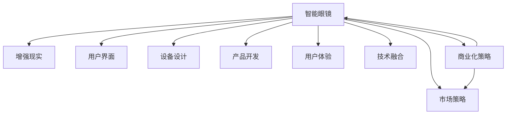

                 

# 智能眼镜创业：增强现实的随身设备

> 关键词：智能眼镜,增强现实,创业,设备设计,用户界面,市场策略,产品开发,用户体验,技术融合

## 1. 背景介绍

### 1.1 问题由来
近年来，随着科技的迅猛发展和消费者对体验的不断追求，智能眼镜作为一种重要的智能硬件，其市场潜力得到了广泛的认可。然而，尽管众多厂商纷纷入局，智能眼镜的普及程度仍远未达到预期。阻碍智能眼镜普及的原因众多，如硬件成本高昂、用户体验不佳、应用场景有限等。本文章将从技术、市场、用户体验等多个角度，分析智能眼镜发展的现状和未来方向，希望能为创业者和开发者提供一些参考和启示。

### 1.2 问题核心关键点
智能眼镜创业成功的关键在于将增强现实（AR）技术与人机交互、设备设计、市场推广等多方面因素有机结合。通过精确把握用户需求、精心设计用户体验，不断完善市场策略和技术路线，才能真正实现智能眼镜的大规模普及和成功商业化。

## 2. 核心概念与联系

### 2.1 核心概念概述

为更好地理解智能眼镜在增强现实应用中的技术和市场实践，本节将介绍几个核心概念及其相互关系：

- **智能眼镜(Smart Glasses)**：结合了计算机视觉、传感器、计算平台、显示技术等先进硬件，通过增强现实技术，为佩戴者提供沉浸式视听体验的智能硬件。

- **增强现实(Augmented Reality, AR)**：通过数字信息与现实世界的融合，在用户视场中叠加虚拟信息，实现交互和沉浸式体验。

- **用户界面(User Interface, UI)**：智能眼镜的UI设计决定了用户与设备的互动方式和感受，直接影响用户对产品的体验和满意度。

- **设备设计(Hardware Design)**：智能眼镜的硬件设计涵盖光学、机械、电子等多个领域，是实现其核心功能的基础。

- **市场策略(Market Strategy)**：在激烈的市场竞争中，制定科学有效的市场策略是智能眼镜成功商业化的关键。

- **产品开发(Product Development)**：从概念到产品化的过程，需要跨学科协作，涵盖软件工程、硬件设计、用户体验等多个领域。

- **用户体验(User Experience, UX)**：用户体验是智能眼镜的核心竞争力之一，直接影响产品的市场接受度和用户粘性。

- **技术融合(Technology Integration)**：将AR技术与AI、传感器、物联网(IoT)等多种技术融合，构建复杂而强大的功能体系。

这些核心概念通过以下Mermaid流程图展现了它们之间的联系：



这个流程图展示了智能眼镜各个关键概念的相互关系：

1. 智能眼镜的核心是增强现实技术，使得虚拟信息与现实世界融合。
2. 用户界面、设备设计和市场策略是智能眼镜成功的必要条件，它们共同塑造了用户体验。
3. 产品开发过程涉及软硬件协同，技术融合不可或缺。
4. 技术融合和商业化策略一起构成了智能眼镜成功的双轮驱动。

这些概念之间相互联系，共同构成智能眼镜的技术和市场生态。

## 3. 核心算法原理 & 具体操作步骤
### 3.1 算法原理概述

增强现实技术在智能眼镜中的应用主要涉及图像处理、传感器融合、深度学习等多个方面。以下是核心算法原理的概述：

- **图像处理**：智能眼镜通过摄像头采集现实世界图像，应用计算机视觉技术进行实时分析，将虚拟信息叠加到图像上，实现增强现实效果。

- **传感器融合**：结合GPS、IMU、陀螺仪等多种传感器，智能眼镜可以实时获取用户位置、姿态等信息，提高AR效果的准确性。

- **深度学习**：通过深度学习模型进行图像分类、目标检测、语义分割等任务，为增强现实效果提供强大的算法支持。

### 3.2 算法步骤详解

智能眼镜的增强现实系统主要由数据采集、图像处理、深度学习、信息叠加和用户交互等环节组成。以下详细介绍这些步骤：

**Step 1: 数据采集**
智能眼镜通过摄像头、传感器等设备实时获取现实世界信息，包括彩色图像、深度图、IMU数据等。

**Step 2: 图像处理**
图像处理算法包括色彩校正、边缘检测、噪声去除等，保证采集图像的质量。同时，通过图像分割算法将用户关注区域提取出来，方便后续处理。

**Step 3: 深度学习**
使用深度学习模型进行目标检测、语义分割等任务，识别用户关注的目标和环境，为信息叠加提供依据。

**Step 4: 信息叠加**
将深度学习识别出的目标信息叠加到图像上，生成增强现实效果。

**Step 5: 用户交互**
通过触觉、手势、语音等多种方式，用户与AR系统进行交互，获取增强信息或执行控制操作。

**Step 6: 模型优化**
不断收集用户反馈和数据，优化深度学习模型，提升AR效果和用户体验。

### 3.3 算法优缺点

增强现实技术在智能眼镜中的应用具有以下优点：

1. **沉浸式体验**：通过虚拟信息的叠加，使用户沉浸在虚拟与现实相结合的环境中，提升用户体验。
2. **实时性**：能够实时捕捉和处理现实世界信息，快速响应用户需求。
3. **多功能性**：结合多种传感器和算法，可以实现丰富的功能，如导航、信息检索、智能购物等。

同时，也存在一些局限性：

1. **硬件成本高**：智能眼镜通常需要高性能处理器和高质量显示屏，硬件成本较高。
2. **用户体验不完善**：现有智能眼镜的UI设计和交互方式仍有待改进，无法完全满足用户需求。
3. **技术复杂**：涉及图像处理、深度学习、传感器融合等多个领域，技术难度较大。
4. **隐私和安全问题**：摄像头和传感器收集的用户数据可能涉及隐私和安全问题，需要特别注意。

### 3.4 算法应用领域

增强现实技术在智能眼镜中的应用涵盖多个领域，以下是一些典型的应用场景：

1. **导航与定位**：结合GPS和传感器，智能眼镜可以实时定位和导航，帮助用户到达目的地。

2. **购物与电商**：通过扫描二维码或语音搜索，智能眼镜可以快速获取商品信息，辅助用户购物。

3. **健康与健身**：智能眼镜可以实时监测心率、血氧等健康数据，提供个性化的健康建议。

4. **教育和培训**：通过AR技术，智能眼镜可以为学生提供互动式学习体验，增强学习效果。

5. **旅游与观光**：智能眼镜可以提供实时的景点信息和历史背景，提升旅游体验。

6. **社交与娱乐**：智能眼镜可以用于社交和娱乐，如语音聊天、AR游戏等。

以上应用场景展示了增强现实技术在智能眼镜中的广阔前景，未来还有更多创新的应用在等待探索。

## 4. 数学模型和公式 & 详细讲解  
### 4.1 数学模型构建

增强现实系统的核心是计算机视觉算法和深度学习模型的构建。以下是数学模型构建的概述：

- **图像处理模型**：包括色彩校正、边缘检测、噪声去除等，常用的模型包括直方图均衡化、Canny边缘检测等。
- **目标检测模型**：常用的目标检测模型包括RCNN、YOLO、SSD等，通过深度学习网络识别现实世界中的目标。
- **语义分割模型**：常用的语义分割模型包括FCN、U-Net等，将图像分割成多个语义区域，为信息叠加提供依据。

### 4.2 公式推导过程

以目标检测为例，介绍常用的YOLO模型。YOLO（You Only Look Once）是一种单阶段目标检测模型，具有实时性好、精度高的特点。

**Step 1: 输入预处理**
输入图像大小为 $H \times W$，将其调整为 $D \times D$，其中 $D$ 为网络的特征图尺寸，通常为 $448 \times 448$。

**Step 2: 特征提取**
使用卷积神经网络（CNN）提取输入图像的特征，得到 $D \times D \times C$ 特征图。

**Step 3: 特征图分割**
将特征图划分为 $S \times S$ 个网格，每个网格负责检测一个目标。

**Step 4: 目标回归**
每个网格输出 $B$ 个边界框的坐标和置信度，以及 $C$ 个类别的概率。

**Step 5: 非极大值抑制（NMS）**
去除重叠的边界框，保留置信度和类别概率最高的边界框。

通过上述步骤，YOLO模型可以在实时性较高的同时，提供较高的目标检测精度。

### 4.3 案例分析与讲解

以谷歌眼镜为例，介绍其增强现实系统的构建和应用。

**设备设计**：谷歌眼镜采用轻薄的设计，集成高清摄像头、陀螺仪、加速度计等多种传感器，支持AR效果。

**用户体验**：谷歌眼镜提供语音控制和手势控制两种交互方式，方便用户操作。同时，通过AR眼镜直接查看导航信息和邮件提醒等，提升了用户体验。

**市场策略**：谷歌眼镜通过与合作伙伴（如Walmart、Coca-Cola等）合作推广，逐步扩大市场影响力。

**产品开发**：谷歌眼镜集成了AR技术、计算机视觉、传感器融合等多个技术，涉及软硬件协同开发。

**技术融合**：谷歌眼镜将AR技术与社交网络、位置服务等结合，提供全方位的智能体验。

谷歌眼镜的成功证明了AR技术在智能眼镜中的广阔应用前景。

## 5. 项目实践：代码实例和详细解释说明
### 5.1 开发环境搭建

要进行智能眼镜开发，需要搭建一个支持计算机视觉、深度学习和增强现实技术的开发环境。以下是搭建开发环境的步骤：

1. **安装Python**：确保系统安装了Python 3.x版本，建议使用Anaconda或Miniconda进行管理。
2. **安装深度学习框架**：安装TensorFlow或PyTorch，这些框架提供了强大的深度学习模型支持。
3. **安装计算机视觉库**：安装OpenCV、Pillow等库，用于图像处理和显示。
4. **安装增强现实库**：安装ARKit或ARCore，用于实现增强现实效果。

### 5.2 源代码详细实现

以下是一个简单的智能眼镜增强现实系统的实现示例：

```python
import cv2
import numpy as np
import ARKit

# 图像处理函数
def preprocess_image(image):
    # 转换为灰度图像
    gray = cv2.cvtColor(image, cv2.COLOR_BGR2GRAY)
    # 边缘检测
    edges = cv2.Canny(gray, 100, 200)
    # 二值化处理
    edges = cv2.threshold(edges, 128, 255, cv2.THRESH_BINARY)[1]
    return edges

# 目标检测函数
def detect_objects(image):
    # 加载YOLO模型
    model = load_yolo_model()
    # 预测目标位置和类别
    output = model.predict(image)
    # 筛选置信度高的目标
    filtered_output = filter_box(output, 0.5)
    return filtered_output

# 信息叠加函数
def overlay_info(image, objects):
    # 将目标信息叠加到图像上
    for obj in objects:
        cv2.rectangle(image, obj['box'], obj['box'], (0, 255, 0), 2)
    return image

# 主函数
if __name__ == '__main__':
    # 加载摄像头
    camera = ARKit.create_camera()
    # 读取摄像头图像
    image = camera.read()
    # 图像预处理
    edges = preprocess_image(image)
    # 目标检测
    objects = detect_objects(edges)
    # 信息叠加
    result = overlay_info(image, objects)
    # 显示结果
    cv2.imshow('AR Result', result)
    cv2.waitKey(0)
    cv2.destroyAllWindows()
```

### 5.3 代码解读与分析

以上代码示例展示了智能眼镜增强现实系统的主要功能：图像预处理、目标检测和信息叠加。

- **图像预处理函数`preprocess_image`**：实现灰度化、边缘检测和二值化处理，提升图像质量，方便后续处理。
- **目标检测函数`detect_objects`**：使用YOLO模型进行目标检测，筛选置信度高的目标，返回目标信息。
- **信息叠加函数`overlay_info`**：将目标信息叠加到原始图像上，展示增强现实效果。
- **主函数**：读取摄像头图像，依次调用预处理、目标检测和信息叠加函数，最终展示增强现实效果。

通过此示例，可以清晰地理解智能眼镜增强现实系统的核心功能，以及实现过程。

## 6. 实际应用场景

### 6.1 导航与定位

智能眼镜可以通过增强现实技术，结合GPS和传感器，提供实时导航和定位服务。用户可以通过AR界面查看路线、地标等信息，提升出行体验。

### 6.2 购物与电商

智能眼镜可以扫描商品二维码，实时获取商品信息，辅助用户购物。同时，通过AR界面展示商品使用场景，帮助用户做出决策。

### 6.3 健康与健身

智能眼镜可以实时监测心率、血氧等健康数据，提供个性化的健康建议。同时，通过AR界面展示运动轨迹和心率变化，提升健身效果。

### 6.4 教育和培训

智能眼镜可以提供互动式学习体验，通过AR界面展示虚拟模型和实验过程，增强学生学习效果。

### 6.5 旅游与观光

智能眼镜可以提供实时的景点信息和历史背景，提升旅游体验。通过AR界面展示虚拟导游，讲解景点故事。

### 6.6 社交与娱乐

智能眼镜可以用于语音聊天和AR游戏，提供沉浸式的社交和娱乐体验。

### 6.7 未来应用展望

未来，智能眼镜在增强现实应用上将有更多创新和突破。以下是一些未来的应用展望：

1. **实时翻译**：结合语言识别和翻译技术，智能眼镜可以实现实时翻译，支持多语言交流。

2. **远程协作**：通过AR界面展示虚拟白板、会议内容等信息，支持远程协作和会议。

3. **虚拟试衣**：结合虚拟试衣技术，智能眼镜可以展示不同服装的虚拟试穿效果，提升购物体验。

4. **智能家居**：通过AR界面控制智能家居设备，提供个性化的智能家居解决方案。

5. **远程医疗**：通过AR界面展示手术过程、检查结果等信息，支持远程医疗和远程诊疗。

6. **虚拟旅游**：通过AR界面展示虚拟旅游路线和景点信息，提升旅游体验。

7. **智能培训**：通过AR界面展示虚拟培训场景和操作流程，提升培训效果。

未来，智能眼镜在增强现实技术上的应用将更加广泛和深入，为人们的生活和工作带来更多便利和乐趣。

## 7. 工具和资源推荐
### 7.1 学习资源推荐

为了帮助开发者系统掌握智能眼镜和增强现实技术的开发，以下推荐一些优质的学习资源：

1. **《智能眼镜技术与应用》系列书籍**：全面介绍智能眼镜的硬件设计、软件实现和市场策略，是智能眼镜开发的必备参考资料。

2. **ARKit和ARCore官方文档**：详细介绍了增强现实技术的API接口和开发方法，是开发增强现实应用的重要参考。

3. **《深度学习计算机视觉基础》课程**：斯坦福大学开设的深度学习课程，涵盖计算机视觉的基础知识和深度学习模型，适合初学者学习。

4. **TensorFlow官方文档**：详细介绍了深度学习框架的使用方法和API接口，是开发智能眼镜核心算法的必备资源。

5. **OpenCV官方文档**：提供了丰富的计算机视觉算法和图像处理工具，是实现智能眼镜图像处理功能的重要工具。

通过这些学习资源，相信你可以全面掌握智能眼镜和增强现实技术的开发方法，实现自己的智能眼镜创业梦想。

### 7.2 开发工具推荐

进行智能眼镜开发，需要多种工具和库的配合使用。以下是几款推荐的工具：

1. **Anaconda和Jupyter Notebook**：用于环境管理和代码编写，支持Python编程和深度学习模型开发。

2. **ARKit和ARCore**：用于实现增强现实效果，支持iOS和Android平台。

3. **TensorFlow和PyTorch**：用于深度学习模型的开发和训练，提供强大的模型库和算法支持。

4. **OpenCV和Pillow**：用于图像处理和显示，提供丰富的图像处理算法和工具。

5. **Google Colab和Jupyter Notebook**：用于在线编程和实验，支持GPU计算和交互式编程。

合理利用这些工具，可以显著提升智能眼镜和增强现实应用的开发效率，加快创新迭代的步伐。

### 7.3 相关论文推荐

智能眼镜和增强现实技术的发展离不开学界的持续研究。以下是几篇奠基性的相关论文，推荐阅读：

1. **《AR眼镜的发展现状与未来趋势》**：总结了AR眼镜的发展历程和最新技术，探讨了未来的应用前景。

2. **《智能眼镜的硬件设计和用户体验研究》**：介绍了智能眼镜的硬件设计原则和用户体验评估方法，为产品设计提供了理论支持。

3. **《基于增强现实技术的导航系统研究》**：介绍了AR导航系统的设计和实现方法，提出了基于增强现实技术的导航策略。

4. **《深度学习在目标检测中的应用》**：介绍了深度学习在目标检测中的最新进展，为智能眼镜的目标检测功能提供了算法支持。

5. **《智能眼镜在医疗领域的应用》**：探讨了智能眼镜在医疗领域的应用场景和技术实现，为医疗设备的智能化提供了参考。

这些论文代表了智能眼镜和增强现实技术的发展脉络，通过学习这些前沿成果，可以帮助你把握学科前进方向，激发更多的创新灵感。

## 8. 总结：未来发展趋势与挑战
### 8.1 总结

本文对智能眼镜创业中的增强现实技术进行了全面系统的介绍。首先介绍了智能眼镜的发展现状和面临的挑战，明确了增强现实技术在智能眼镜中的重要地位。其次，从技术、市场、用户体验等多个角度，详细讲解了智能眼镜的各个核心概念和关键步骤，给出了具体的代码实现和案例分析。同时，本文还探讨了智能眼镜在多个应用场景中的创新应用，展示了增强现实技术的广阔前景。

通过本文的系统梳理，可以看到，智能眼镜在增强现实技术上的应用前景广阔，但其市场推广和用户体验仍有待提升。未来，伴随技术的不断进步和市场的逐步成熟，智能眼镜必将迎来大规模的商业化应用，带来新的产业变革。

### 8.2 未来发展趋势

展望未来，智能眼镜在增强现实技术上的发展将呈现以下几个趋势：

1. **技术创新不断**：随着硬件和算法技术的不断进步，智能眼镜的功能将更加强大，应用场景也将更加丰富。

2. **市场竞争加剧**：随着更多厂商入局，智能眼镜市场竞争将更加激烈，需要不断创新和优化，保持市场竞争力。

3. **用户体验提升**：增强现实技术将不断提升用户体验，通过UI设计和交互优化，满足用户对智能眼镜的期待。

4. **应用场景拓展**：智能眼镜将不断拓展到更多的应用场景，如医疗、教育、旅游等领域，带来新的商业机会。

5. **跨领域融合**：智能眼镜将与更多领域的知识和技术进行融合，提升其在垂直领域的应用价值。

6. **标准和规范**：智能眼镜市场将逐步形成统一的标准和规范，促进市场的健康发展。

以上趋势凸显了智能眼镜和增强现实技术的广阔前景，这些方向的探索发展，必将推动智能眼镜市场的大规模商业化应用。

### 8.3 面临的挑战

尽管智能眼镜和增强现实技术的发展前景广阔，但在迈向更加智能化、普适化应用的过程中，仍面临诸多挑战：

1. **硬件成本高**：智能眼镜通常需要高性能处理器和高质量显示屏，硬件成本较高，需要不断降低成本以提升市场竞争力。

2. **用户体验不完善**：现有智能眼镜的UI设计和交互方式仍有待改进，需要不断优化用户界面和交互体验。

3. **技术复杂度高**：智能眼镜涉及计算机视觉、深度学习、传感器融合等多个领域，技术难度较大，需要不断提升技术水平和研发能力。

4. **隐私和安全问题**：摄像头和传感器收集的用户数据可能涉及隐私和安全问题，需要加强数据保护和隐私保护。

5. **市场推广困难**：智能眼镜市场尚处于起步阶段，需要不断加大市场推广力度，提升市场知名度和用户接受度。

6. **商业模式不清晰**：智能眼镜的商业模式尚未完全成熟，需要探索出适合不同应用场景的商业模式。

这些挑战需要在技术、市场、用户体验等多个方面进行全面优化和改进，才能真正实现智能眼镜的市场化应用。

### 8.4 研究展望

面对智能眼镜和增强现实技术面临的诸多挑战，未来的研究需要在以下几个方面寻求新的突破：

1. **降低硬件成本**：通过硬件创新和优化设计，降低智能眼镜的硬件成本，提升市场竞争力。

2. **提升用户体验**：通过UI设计和交互优化，提升智能眼镜的用户体验，增强用户粘性。

3. **提高技术水平**：不断提升技术水平和研发能力，实现更强大的功能和更优的性能。

4. **加强隐私保护**：加强数据保护和隐私保护，确保用户数据安全。

5. **探索商业模式**：探索适合不同应用场景的商业模式，提升市场推广效果。

6. **跨领域融合**：探索智能眼镜与其他领域的知识和技术进行融合，提升其在垂直领域的应用价值。

这些研究方向的探索，必将引领智能眼镜和增强现实技术迈向更高的台阶，为智能设备的发展带来新的突破和机遇。只有勇于创新、敢于突破，才能真正实现智能眼镜的普及和成功商业化。

## 9. 附录：常见问题与解答

**Q1：智能眼镜在开发过程中需要注意哪些问题？**

A: 智能眼镜的开发过程中需要注意以下几个问题：

1. **硬件设计**：智能眼镜的硬件设计需要考虑光学、机械、电子等多个方面，确保设备的稳定性和可靠性。

2. **深度学习模型**：深度学习模型的训练和优化需要大量的数据和计算资源，需要合理的资源分配和优化策略。

3. **增强现实效果**：增强现实效果需要实时处理大量的传感器数据和图像数据，需要高效的算法和硬件支持。

4. **用户界面**：智能眼镜的用户界面设计需要考虑易用性和美观性，提供良好的用户体验。

5. **隐私和安全**：智能眼镜的摄像头和传感器可能涉及用户隐私和安全问题，需要严格的数据保护和隐私保护措施。

6. **市场推广**：智能眼镜的推广需要多渠道、多平台进行，需要制定科学的市场策略。

7. **商业模式**：智能眼镜的商业模式需要根据不同的应用场景进行设计，找到合理的盈利模式。

通过全面考虑这些问题，可以有效提升智能眼镜的开发效率和市场竞争力。

**Q2：智能眼镜的核心竞争力是什么？**

A: 智能眼镜的核心竞争力主要体现在以下几个方面：

1. **增强现实技术**：通过AR技术，智能眼镜可以实时叠加虚拟信息，提升用户体验和信息获取效率。

2. **多模态输入**：智能眼镜支持语音、手势、触屏等多种输入方式，提高了用户交互的便捷性和灵活性。

3. **实时处理能力**：智能眼镜可以通过高性能处理器和算法，实现实时的图像处理和目标检测，满足用户对实时性的需求。

4. **个性化定制**：智能眼镜可以通过软件和硬件的定制，满足不同用户的需求和场景需求。

5. **跨平台支持**：智能眼镜可以通过多种操作系统和平台进行开发和部署，适应不同用户需求。

通过这些核心竞争力，智能眼镜可以提供更加丰富和个性化的用户体验，满足用户对智能设备的需求。

**Q3：智能眼镜在各个应用场景中需要注意哪些问题？**

A: 智能眼镜在各个应用场景中需要注意以下几个问题：

1. **导航与定位**：需要确保AR效果的准确性和实时性，同时需要考虑用户的安全和隐私问题。

2. **购物与电商**：需要提供快速准确的商品信息和服务，同时需要考虑数据安全和隐私保护。

3. **健康与健身**：需要提供准确的健康监测和个性化的健身建议，同时需要考虑数据隐私和安全。

4. **教育和培训**：需要提供互动式的学习体验，同时需要考虑教育资源的公平性和可获取性。

5. **旅游与观光**：需要提供丰富的旅游信息和互动体验，同时需要考虑用户的安全和隐私问题。

6. **社交与娱乐**：需要提供互动式的社交和娱乐体验，同时需要考虑用户的数据安全和隐私保护。

通过全面考虑这些问题，可以提升智能眼镜在各个应用场景中的用户体验和应用价值。

**Q4：智能眼镜的商业化策略有哪些？**

A: 智能眼镜的商业化策略需要根据不同的应用场景进行设计，以下是几种常见的策略：

1. **定制化服务**：根据不同用户的需求和场景需求，提供定制化的智能眼镜服务，提升用户体验和市场竞争力。

2. **合作伙伴模式**：与大型企业和医疗机构合作，推出智能眼镜应用，提升市场影响力和用户覆盖面。

3. **订阅模式**：通过订阅模式提供智能眼镜服务，增强用户粘性和长期价值。

4. **设备销售**：通过销售智能眼镜设备，实现硬件收入和利润。

5. **增值服务**：通过提供增值服务（如健康监测、导航等），提升智能眼镜的附加价值和盈利能力。

6. **数据服务**：通过收集和分析用户数据，提供数据服务，实现数据价值变现。

通过合理的商业化策略，可以提升智能眼镜的市场竞争力，实现商业化应用。

**Q5：智能眼镜在市场推广中需要注意哪些问题？**

A: 智能眼镜在市场推广中需要注意以下几个问题：

1. **用户需求分析**：需要深入分析用户需求，制定科学的市场策略和推广方案。

2. **品牌建设**：需要加强品牌建设，提升品牌知名度和用户信任度。

3. **渠道建设**：需要建立多渠道的销售和推广渠道，提升市场覆盖面和用户获取能力。

4. **价格策略**：需要制定合理的价格策略，提升市场竞争力。

5. **市场调研**：需要深入市场调研，了解用户反馈和市场趋势，及时调整推广策略。

6. **用户体验**：需要注重用户体验，提供优质的产品和服务，提升用户满意度和忠诚度。

通过全面考虑这些问题，可以有效提升智能眼镜的市场推广效果和用户接受度。

---

作者：禅与计算机程序设计艺术 / Zen and the Art of Computer Programming

