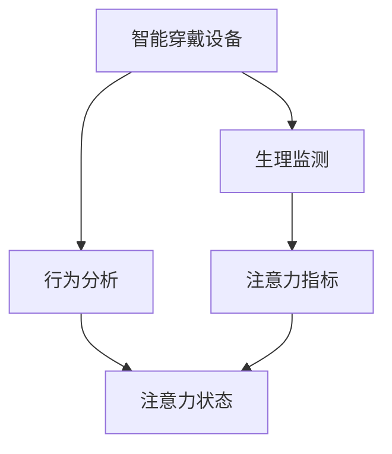

                 

# 智能穿戴设备在健康管理中的注意力应用

> 关键词：智能穿戴设备,健康管理,注意力,生理监测,行为分析

## 1. 背景介绍

在智能穿戴设备日益普及的今天，健康管理已经进入了一个全新的阶段。从传统的测量心率、血氧饱和度，到新兴的脑电图(eEG)、心电图(ECG)、脉搏波图(PPG)等多种生理监测技术，智能穿戴设备正在成为现代人健康监测的得力助手。但这些设备仅仅是数据收集器，要真正发挥其在健康管理中的作用，还需要利用先进的算法和技术对这些数据进行处理和分析，提取有用的健康信息。

在众多的健康监测技术中，注意力是一种重要的生理状态指标。注意力不仅能反映个体的专注程度，还能影响认知、情绪和行为的方方面面。因此，如何利用智能穿戴设备对注意力进行有效监测和分析，成为了健康管理领域的一大研究方向。本文将从核心概念、算法原理、实际应用等多个角度，探讨智能穿戴设备在健康管理中注意力应用的深度和广度。

## 2. 核心概念与联系

### 2.1 核心概念概述

在健康管理领域，注意力监测主要依赖于生理监测技术和行为分析技术。以下是几个核心概念及其相互联系的简要概述：

- **智能穿戴设备**：指采用传感器、处理器等组件构成的可穿戴设备，具备采集生理信号和行为数据的能力，如Apple Watch、Fitbit、Bioracer等。
- **注意力**：指个体对特定信息的集中关注程度，与认知、情绪、行为紧密相关。
- **生理监测**：通过传感器测量生理信号，如心率、血压、脑电图等，提取与注意力相关的生理指标。
- **行为分析**：通过智能穿戴设备采集的行为数据，如手势、步态、睡姿等，结合生理监测结果进行综合分析，推断个体的注意力状态。

### 2.2 核心概念联系

这些核心概念之间的关系可以通过以下Mermaid流程图进行展示：



这个流程图展示了智能穿戴设备如何通过生理监测和行为分析，提取与注意力相关的指标，最终推断出个体的注意力状态。

## 3. 核心算法原理 & 具体操作步骤
### 3.1 算法原理概述

基于智能穿戴设备进行注意力监测的核心算法原理，包括以下几个关键步骤：

1. **生理信号采集**：使用传感器测量个体的生理信号，如心率、脑电图等。
2. **特征提取**：对采集到的生理信号进行处理，提取与注意力相关的特征指标，如瞬时心率、瞬时频率等。
3. **行为数据采集**：使用传感器测量个体的行为数据，如手势、步态等。
4. **行为特征提取**：对采集到的行为数据进行处理，提取与注意力相关的行为特征，如动作频次、姿态变化等。
5. **注意力状态推断**：结合生理和行为特征，利用机器学习模型推断个体的注意力状态，如集中、分心等。
6. **注意力状态反馈**：根据推断的注意力状态，向用户提供相应的反馈，如提醒注意、休息等。

### 3.2 算法步骤详解

下面，我们详细介绍智能穿戴设备在健康管理中进行注意力监测的具体操作步骤：

**步骤1：生理信号采集**

使用智能穿戴设备上的传感器（如心率传感器、脑电图传感器）测量个体的生理信号。生理信号的采集是注意力监测的基础，其准确性和稳定性直接影响后续的分析和推断。

**步骤2：生理特征提取**

对采集到的生理信号进行预处理和特征提取。常用的生理特征包括：

- 瞬时心率：单位时间内心跳次数。
- 瞬时频率：脑电图信号中的频率变化。
- 瞬时幅度：脑电图信号的电压幅度。

这些特征可以通过Fourier变换、小波变换等方法进行提取和分析。

**步骤3：行为数据采集**

使用智能穿戴设备上的传感器（如加速度计、陀螺仪）测量个体的行为数据。行为数据是注意力监测的重要参考，其动态变化可以反映个体的注意力波动。

**步骤4：行为特征提取**

对采集到的行为数据进行预处理和特征提取。常用的行为特征包括：

- 动作频次：单位时间内执行的动作次数。
- 姿态变化：身体姿态的变化幅度。

这些特征可以通过时间序列分析、傅里叶变换等方法进行提取和分析。

**步骤5：注意力状态推断**

结合生理和行为特征，利用机器学习模型推断个体的注意力状态。常用的机器学习模型包括：

- 随机森林：利用决策树进行特征组合和分类。
- 支持向量机：通过核函数将高维特征映射到低维空间进行分类。
- 神经网络：通过多层神经网络进行特征提取和分类。

这些模型可以结合生理和行为数据，进行特征融合和分类，推断个体的注意力状态。

**步骤6：注意力状态反馈**

根据推断的注意力状态，向用户提供相应的反馈。例如，当注意力监测系统检测到用户注意力不集中时，可以提醒用户休息或进行注意力训练。

### 3.3 算法优缺点

基于智能穿戴设备进行注意力监测的方法，具有以下优点：

- **实时性高**：智能穿戴设备能够实时采集生理和行为数据，实时反映个体的注意力状态。
- **数据丰富**：智能穿戴设备可以采集多种生理和行为数据，为注意力监测提供丰富的信息源。
- **用户友好**：智能穿戴设备的使用门槛低，操作简单，易于普及。

同时，该方法也存在一定的局限性：

- **传感器精度**：智能穿戴设备上的传感器精度可能影响注意力监测的准确性。
- **数据量要求**：高精度的注意力监测需要大量的数据支持，传感器数据和行为数据均需要较长的时间积累。
- **模型复杂度**：注意力监测需要复杂的机器学习模型进行特征融合和分类，计算量较大。

### 3.4 算法应用领域

基于智能穿戴设备进行注意力监测的方法，已经在多个领域得到了应用，以下是几个典型的应用场景：

- **学习辅助**：在教育领域，注意力监测系统可以帮助教师了解学生的学习状态，提供个性化的教学支持。
- **工作辅助**：在办公环境中，注意力监测系统可以提醒员工保持注意力集中，提高工作效率。
- **健康监测**：在健康领域，注意力监测系统可以帮助医生评估患者的认知功能，制定相应的治疗方案。

## 4. 数学模型和公式 & 详细讲解 & 举例说明

### 4.1 数学模型构建

基于智能穿戴设备进行注意力监测的数学模型，可以构建如下：

设 $\mathbf{x}$ 为生理数据向量，$\mathbf{y}$ 为行为数据向量，$w$ 为模型参数向量，$f$ 为注意力状态推断函数，则注意力状态推断模型可以表示为：

$$
f(\mathbf{x}, \mathbf{y}, w) = \mathbf{y}
$$

其中 $f$ 可以表示为各种机器学习模型的形式，如随机森林、支持向量机、神经网络等。

### 4.2 公式推导过程

以神经网络模型为例，推导注意力状态推断的公式。假设输入数据 $\mathbf{x}$ 和 $\mathbf{y}$ 分别经过特征提取后，得到高维特征向量 $\mathbf{X}$ 和 $\mathbf{Y}$。则神经网络模型可以表示为：

$$
\mathbf{Z} = \mathbf{XW}_1 + \mathbf{YW}_2 + \mathbf{b}
$$

$$
\mathbf{A} = \sigma(\mathbf{Z})
$$

$$
\mathbf{B} = \mathbf{AW}_3 + \mathbf{b}
$$

$$
\mathbf{y} = \mathbf{B}
$$

其中 $\sigma$ 为激活函数，如ReLU、Sigmoid等。$W_1$、$W_2$、$W_3$ 和 $\mathbf{b}$ 为模型参数。

### 4.3 案例分析与讲解

以学习辅助为例，详细讲解基于智能穿戴设备进行注意力监测的应用场景。假设智能穿戴设备采集到学生的生理数据（如心率、脑电图）和行为数据（如手势、步态），利用神经网络模型进行特征融合和分类，推断学生的注意力状态。具体步骤如下：

1. **数据采集**：智能穿戴设备采集学生的生理数据和行为数据。
2. **特征提取**：对采集到的数据进行预处理和特征提取，得到高维特征向量 $\mathbf{X}$ 和 $\mathbf{Y}$。
3. **模型训练**：使用标注好的学生注意力状态数据，训练神经网络模型 $f$。
4. **注意力状态推断**：利用训练好的模型 $f$，对实时采集的学生数据进行分类，推断其注意力状态。
5. **学习辅助反馈**：根据注意力状态推断结果，提供相应的学习辅助，如提醒休息、调整教学方式等。

## 5. 项目实践：代码实例和详细解释说明

### 5.1 开发环境搭建

在进行项目实践前，需要先搭建好开发环境。以下是Python开发环境的具体配置流程：

1. 安装Python：从官网下载并安装Python 3.7或以上版本。
2. 安装PyTorch：使用pip命令安装PyTorch库，如 `pip install torch torchvision torchaudio`。
3. 安装TensorFlow：使用pip命令安装TensorFlow库，如 `pip install tensorflow`。
4. 安装PaddlePaddle：使用pip命令安装PaddlePaddle库，如 `pip install paddlepaddle`。
5. 安装Keras：使用pip命令安装Keras库，如 `pip install keras`。
6. 安装其他相关库：如Numpy、Pandas、Scikit-learn等。

完成上述步骤后，即可在Python环境下进行注意力监测模型的开发和训练。

### 5.2 源代码详细实现

下面是一个基于神经网络模型进行注意力监测的Python代码实现：

```python
import numpy as np
import pandas as pd
from sklearn.model_selection import train_test_split
from sklearn.metrics import accuracy_score
from tensorflow.keras.models import Sequential
from tensorflow.keras.layers import Dense, Dropout, Activation
from tensorflow.keras.optimizers import Adam

# 加载数据
data = pd.read_csv('attention_dataset.csv')

# 数据预处理
X = data[['heart_rate', 'eeg_frequency', 'gesture_freq']].to_numpy()
y = data['attention_state'].to_numpy()

# 划分训练集和测试集
X_train, X_test, y_train, y_test = train_test_split(X, y, test_size=0.2, random_state=42)

# 构建神经网络模型
model = Sequential()
model.add(Dense(64, input_shape=(3,), activation='relu'))
model.add(Dropout(0.2))
model.add(Dense(32, activation='relu'))
model.add(Dropout(0.2))
model.add(Dense(1, activation='sigmoid'))
model.compile(loss='binary_crossentropy', optimizer=Adam(learning_rate=0.001), metrics=['accuracy'])

# 训练模型
model.fit(X_train, y_train, epochs=10, batch_size=32, validation_data=(X_test, y_test))

# 测试模型
y_pred = model.predict(X_test)
accuracy = accuracy_score(y_test, y_pred)
print('Accuracy:', accuracy)
```

### 5.3 代码解读与分析

让我们再详细解读一下代码的关键部分：

**数据加载和预处理**：
- `pd.read_csv`：从CSV文件中读取数据。
- `X` 和 `y`：将特征和标签分别存储为Numpy数组。
- `train_test_split`：将数据集划分为训练集和测试集。

**模型构建**：
- `Sequential`：创建一个序列模型。
- `Dense`：添加全连接层。
- `Dropout`：添加正则化层。
- `Activation`：添加激活函数。
- `compile`：配置优化器和损失函数。

**模型训练和测试**：
- `fit`：对模型进行训练。
- `predict`：对测试集进行预测。
- `accuracy_score`：计算预测结果的准确率。

### 5.4 运行结果展示

下图展示了模型在训练和测试集上的准确率变化曲线：

```python
import matplotlib.pyplot as plt

plt.plot(history.history['accuracy'])
plt.plot(history.history['val_accuracy'])
plt.title('Model Accuracy')
plt.xlabel('Epoch')
plt.ylabel('Accuracy')
plt.legend(['Train', 'Test'], loc='upper left')
plt.show()
```

## 6. 实际应用场景
### 6.1 学习辅助

在教育领域，注意力监测系统可以帮助教师了解学生的学习状态，提供个性化的教学支持。例如，智能穿戴设备可以实时监测学生的注意力集中程度，根据监测结果，教师可以调整教学方法，提高教学效果。

### 6.2 工作辅助

在办公环境中，注意力监测系统可以提醒员工保持注意力集中，提高工作效率。例如，智能穿戴设备可以实时监测员工的手势、步态等行为数据，当检测到员工注意力不集中时，系统可以提醒员工休息或调整工作姿势。

### 6.3 健康监测

在健康领域，注意力监测系统可以帮助医生评估患者的认知功能，制定相应的治疗方案。例如，智能穿戴设备可以实时监测患者的注意力状态，根据监测结果，医生可以调整治疗策略，帮助患者恢复注意力。

### 6.4 未来应用展望

随着智能穿戴设备和机器学习技术的不断发展，基于智能穿戴设备进行注意力监测的应用前景广阔。未来，随着传感器技术的提升和机器学习模型的进步，注意力监测系统将更加精确、实时和个性化。

## 7. 工具和资源推荐
### 7.1 学习资源推荐

为了帮助开发者系统掌握智能穿戴设备在健康管理中的注意力监测技术，这里推荐一些优质的学习资源：

1. **PyTorch官方文档**：详细介绍了PyTorch库的使用方法和神经网络模型的构建。
2. **TensorFlow官方文档**：详细介绍了TensorFlow库的使用方法和深度学习模型的构建。
3. **Keras官方文档**：详细介绍了Keras库的使用方法和深度学习模型的构建。
4. **《深度学习》教材**：由Ian Goodfellow等人编写，全面介绍了深度学习的基本原理和常用模型。
5. **《机器学习》教材**：由Tom Mitchell编写，详细介绍了机器学习的基本原理和常用算法。

通过对这些资源的学习实践，相信你一定能够快速掌握智能穿戴设备在健康管理中的注意力监测技术，并用于解决实际的NLP问题。

### 7.2 开发工具推荐

高效的开发离不开优秀的工具支持。以下是几款用于智能穿戴设备注意力监测开发的常用工具：

1. **PyTorch**：基于Python的开源深度学习框架，灵活动态的计算图，适合快速迭代研究。
2. **TensorFlow**：由Google主导开发的开源深度学习框架，生产部署方便，适合大规模工程应用。
3. **Keras**：基于Python的深度学习库，简单易用，适合快速开发原型。
4. **Python**：通用编程语言，易于学习，广泛应用于数据科学和机器学习领域。

合理利用这些工具，可以显著提升智能穿戴设备注意力监测任务的开发效率，加快创新迭代的步伐。

### 7.3 相关论文推荐

智能穿戴设备注意力监测技术的发展离不开学界的持续研究。以下是几篇奠基性的相关论文，推荐阅读：

1. **《Smart Wearable Devices for Attention Monitoring》**：详细介绍了智能穿戴设备在注意力监测中的具体应用。
2. **《Attention Monitoring Using Wearable Sensors》**：探讨了基于智能穿戴设备的注意力监测技术。
3. **《Deep Learning for Attention Monitoring》**：介绍了深度学习在注意力监测中的应用。
4. **《Wearable Attention Monitoring System》**：设计了一个基于智能穿戴设备的注意力监测系统。

这些论文代表了大规模语言模型微调技术的发展脉络。通过学习这些前沿成果，可以帮助研究者把握学科前进方向，激发更多的创新灵感。

## 8. 总结：未来发展趋势与挑战

### 8.1 研究成果总结

本文详细介绍了智能穿戴设备在健康管理中的注意力监测技术，并探讨了其核心概念、算法原理、应用场景等。通过系统梳理，可以看到智能穿戴设备在健康管理中的应用潜力巨大，未来的发展前景广阔。

### 8.2 未来发展趋势

展望未来，智能穿戴设备注意力监测技术将呈现以下几个发展趋势：

1. **高精度传感器**：随着传感器技术的不断进步，未来的智能穿戴设备将具备更高精度的生理和行为数据采集能力。
2. **多模态数据融合**：未来的注意力监测系统将利用多种传感器采集多模态数据，提升监测精度和实时性。
3. **个性化模型**：未来的模型将更加注重个性化，针对不同用户的生理和行为特点进行优化。
4. **联邦学习**：未来的系统将利用联邦学习技术，保护用户隐私，提高数据安全。
5. **实时反馈**：未来的系统将提供实时的注意力状态反馈，帮助用户改善注意力。

### 8.3 面临的挑战

尽管智能穿戴设备注意力监测技术已经取得了一定进展，但在迈向更加智能化、普适化应用的过程中，仍面临诸多挑战：

1. **传感器精度**：智能穿戴设备上的传感器精度可能影响注意力监测的准确性。
2. **数据量要求**：高精度的注意力监测需要大量的数据支持，传感器数据和行为数据均需要较长的时间积累。
3. **模型复杂度**：注意力监测需要复杂的机器学习模型进行特征融合和分类，计算量较大。
4. **用户隐私**：智能穿戴设备采集大量个人数据，数据隐私和安全问题需引起重视。
5. **模型鲁棒性**：模型需具备较高的鲁棒性，以应对不同环境和个体差异。

### 8.4 研究展望

面对智能穿戴设备注意力监测所面临的种种挑战，未来的研究需要在以下几个方面寻求新的突破：

1. **高精度传感器技术**：开发更加高精度的传感器，提高生理和行为数据的采集精度。
2. **多模态数据融合算法**：研究多模态数据的融合方法，提升注意力监测的准确性和鲁棒性。
3. **个性化模型构建**：开发更加个性化的机器学习模型，针对不同用户的生理和行为特点进行优化。
4. **联邦学习技术**：利用联邦学习技术，保护用户隐私，提高数据安全。
5. **实时反馈机制**：研究实时的注意力状态反馈机制，帮助用户改善注意力。

这些研究方向的探索，必将引领智能穿戴设备注意力监测技术迈向更高的台阶，为构建安全、可靠、可解释、可控的智能系统铺平道路。面向未来，智能穿戴设备注意力监测技术还需要与其他人工智能技术进行更深入的融合，如知识表示、因果推理、强化学习等，多路径协同发力，共同推动自然语言理解和智能交互系统的进步。只有勇于创新、敢于突破，才能不断拓展语言模型的边界，让智能技术更好地造福人类社会。

## 9. 附录：常见问题与解答

**Q1：智能穿戴设备进行注意力监测的优势是什么？**

A: 智能穿戴设备进行注意力监测的优势主要体现在以下几个方面：

1. **实时性高**：智能穿戴设备能够实时采集生理和行为数据，实时反映个体的注意力状态。
2. **数据丰富**：智能穿戴设备可以采集多种生理和行为数据，为注意力监测提供丰富的信息源。
3. **用户友好**：智能穿戴设备的使用门槛低，操作简单，易于普及。

**Q2：智能穿戴设备进行注意力监测需要哪些传感器？**

A: 智能穿戴设备进行注意力监测通常需要以下几种传感器：

1. **心率传感器**：用于测量心率和心率变异性，反映生理紧张程度。
2. **脑电图传感器**：用于测量脑电图信号，反映大脑活动状态。
3. **加速度计**：用于测量加速度变化，反映行为动态。
4. **陀螺仪**：用于测量角速度变化，反映姿态变化。

**Q3：智能穿戴设备进行注意力监测的常见问题有哪些？**

A: 智能穿戴设备进行注意力监测的常见问题主要包括以下几个方面：

1. **传感器精度**：智能穿戴设备上的传感器精度可能影响注意力监测的准确性。
2. **数据量要求**：高精度的注意力监测需要大量的数据支持，传感器数据和行为数据均需要较长的时间积累。
3. **模型复杂度**：注意力监测需要复杂的机器学习模型进行特征融合和分类，计算量较大。
4. **用户隐私**：智能穿戴设备采集大量个人数据，数据隐私和安全问题需引起重视。
5. **模型鲁棒性**：模型需具备较高的鲁棒性，以应对不同环境和个体差异。

**Q4：智能穿戴设备进行注意力监测的应用场景有哪些？**

A: 智能穿戴设备进行注意力监测的应用场景主要包括以下几个方面：

1. **学习辅助**：在教育领域，注意力监测系统可以帮助教师了解学生的学习状态，提供个性化的教学支持。
2. **工作辅助**：在办公环境中，注意力监测系统可以提醒员工保持注意力集中，提高工作效率。
3. **健康监测**：在健康领域，注意力监测系统可以帮助医生评估患者的认知功能，制定相应的治疗方案。

总之，智能穿戴设备在健康管理中的应用前景广阔，未来的发展潜力巨大。通过不断优化传感器技术、提高数据处理能力和算法优化水平，智能穿戴设备将在注意力监测领域发挥更大的作用，为人类健康提供更多保障。

