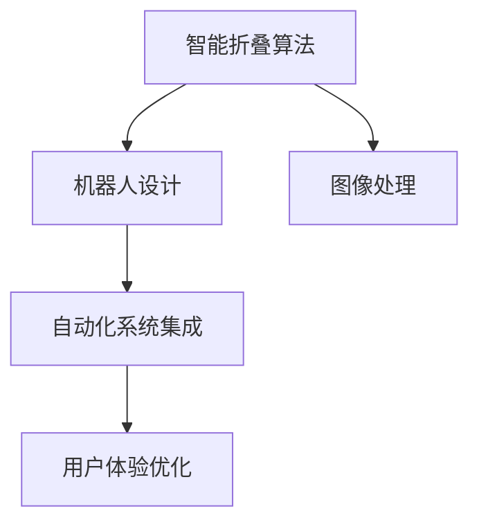

                 

# 智能衣物折叠创业：家务自动化的新突破

> 关键词：智能衣物折叠, 自动化, 人工智能, 机器人技术, 图像处理, 商业落地, 家务自动化, 创业, 未来展望

## 1. 背景介绍

### 1.1 问题由来

现代生活中，人们越来越忙于工作和社交，家务劳动逐渐成为一种负担。特别是衣物折叠和整理，耗时费力，且容易出错。传统意义上的“黑科技”，如全自动洗衣机、烘干机等，虽然极大地简化了衣物清洗和烘干过程，但折叠和收纳仍旧需要人工介入，无法完全实现自动化。

如今，随着人工智能和机器人技术的飞速发展，家务自动化的目标变得触手可及。特别是在智能折叠衣物的创业领域，越来越多的初创公司试图通过先进的算法和设备，将衣物折叠这一看似简单的家务活，转变为一种新的生产力。

### 1.2 问题核心关键点

智能衣物折叠的创业，需要解决以下核心问题：

1. **算法优化**：如何设计高效的算法，使得机器人能够快速、准确地识别衣物类型、堆叠方式等关键信息，并自动折叠。
2. **设备设计**：如何设计智能折叠机器人，使其结构合理、稳定可靠，能够承受各种材质的衣物重量。
3. **数据采集**：如何通过高精度的摄像头和传感器，采集到高质量的衣物图像和环境数据。
4. **自动化系统集成**：如何将智能折叠算法和设备与家居环境完美集成，形成一套自动化的系统。
5. **用户体验优化**：如何提升用户体验，使得用户能够简单、直观地操作和监控智能折叠过程。

### 1.3 问题研究意义

智能衣物折叠技术，为家务自动化带来新的突破，具有以下重要意义：

1. **节省时间**：智能折叠机器能够大幅减少衣物折叠和整理的时间，使人们有更多时间用于工作和娱乐。
2. **提高效率**：通过高效算法和大数据支持，智能折叠机器人能够折叠更加整齐、美观的衣物。
3. **降低成本**：减少了人工折叠过程中可能出现的衣物破损和耗材消耗，降低家庭开支。
4. **提升便利性**：使用智能折叠机器人，人们可以随时随地整理衣物，而不需要依赖固定的地点。
5. **推动技术进步**：智能折叠技术的研发和应用，推动了人工智能和机器人技术的创新发展。

## 2. 核心概念与联系

### 2.1 核心概念概述

为更好地理解智能衣物折叠的技术路径，本节将介绍几个核心概念：

- **智能折叠算法**：用于指导机器人如何自动折叠衣物的算法，通过图像识别、深度学习等技术实现。
- **机器人设计**：智能折叠机器人的硬件设计，包括机械结构、传感设备和控制系统。
- **图像处理**：通过高精度摄像头和传感器采集到的衣物图像和环境数据，用于算法训练和模型推理。
- **自动化系统集成**：将智能折叠算法和设备与家居环境融合，形成自动化系统。
- **用户体验优化**：通过用户界面设计、远程监控等方式提升用户操作体验。

这些核心概念之间的逻辑关系可以通过以下Mermaid流程图来展示：



这个流程图展示了几大核心概念之间的关系：

1. 智能折叠算法是整个系统的核心，指导机器人执行具体的折叠任务。
2. 机器人设计是硬件实现的基础，确保智能折叠机器人的机械结构稳固可靠。
3. 图像处理提供高质量的输入数据，用于算法的训练和优化。
4. 自动化系统集成实现技术与环境的融合，形成可用的产品。
5. 用户体验优化提升用户的操作体验，增加产品的市场竞争力。

这些概念共同构成了智能衣物折叠技术的框架，从算法到设备，从数据采集到用户体验，每一个环节都至关重要。

## 3. 核心算法原理 & 具体操作步骤

### 3.1 算法原理概述

智能衣物折叠的核心算法主要基于图像处理、深度学习、决策规划等多个领域的知识。下面将详细讲解这些核心算法的原理。

1. **图像处理**：通过高精度摄像头和传感器采集衣物和环境的图像数据，并对其进行预处理，提取有用的特征。
2. **深度学习**：使用卷积神经网络（CNN）等深度学习模型，对衣物图像进行分类和识别，判断衣物的类型、大小、颜色等特征。
3. **决策规划**：根据衣物的特征，设计合理的折叠方式，生成机器人执行的具体动作序列。
4. **路径规划**：通过计算最短路径，使得机器人能够高效地移动到指定位置，并进行折叠动作。
5. **任务调度**：将多件衣物折叠任务合理分配给机器人执行，确保高效率和高稳定性。

### 3.2 算法步骤详解

智能衣物折叠的算法实现主要包括以下关键步骤：

**Step 1: 图像数据采集和预处理**
- 使用高分辨率摄像头和传感器，采集衣物和环境的图像数据。
- 对采集到的图像进行去噪、增强、归一化等预处理操作，提升数据质量。

**Step 2: 衣物分类和识别**
- 通过深度学习模型（如CNN）对衣物图像进行分类和识别，判断衣物的类型、大小、颜色等特征。
- 对于无法识别的衣物，使用迁移学习等方法，提升识别准确率。

**Step 3: 折叠方式规划**
- 根据衣物的特征，设计合理的折叠方式，生成机器人执行的具体动作序列。
- 对于不同类型的衣物，设计不同的折叠策略，提高折叠效率和质量。

**Step 4: 机器人路径规划**
- 计算机器人从起点到指定位置的路径，并进行避障处理。
- 使用A*算法、RRT算法等路径规划算法，优化机器人路径，减少移动时间和能耗。

**Step 5: 任务调度和管理**
- 将多件衣物折叠任务合理分配给机器人执行，并实时监控任务进度。
- 使用多线程、优先级队列等技术，提高机器人任务执行效率。

### 3.3 算法优缺点

智能衣物折叠算法具有以下优点：

1. **高效性**：通过深度学习模型和路径规划算法，机器人能够快速高效地折叠衣物。
2. **灵活性**：根据不同衣物的特点，设计多种折叠策略，满足不同用户的需求。
3. **精确性**：使用高精度图像处理和传感器，确保衣物的分类和折叠准确无误。
4. **可扩展性**：算法框架可扩展到其他类似任务，如叠被子、整理抽屉等。

同时，该算法也存在一些局限性：

1. **数据需求高**：需要大量高质量的衣物图像和环境数据，用于模型训练和优化。
2. **复杂度大**：算法涉及图像处理、深度学习、路径规划等多个环节，实现难度较大。
3. **成本高**：需要使用高性能的摄像头和传感器，以及复杂的机械结构，成本较高。
4. **应用场景有限**：目前算法主要适用于折叠衣物，对复杂物品的折叠处理仍有挑战。

### 3.4 算法应用领域

智能衣物折叠算法主要应用于以下几个领域：

1. **家居自动化**：通过智能折叠机器人，实现家庭家务自动化，提高生活质量。
2. **服装生产**：在服装生产过程中，使用智能折叠技术，提高生产效率和产品一致性。
3. **零售物流**：在物流配送中心，使用智能折叠机器人，快速折叠和包装商品。
4. **医疗护理**：在医院病房，使用智能折叠机器人，折叠和整理病人的衣物，提高护理效率。
5. **酒店服务业**：在酒店客房，使用智能折叠机器人，整理床铺和衣物，提升服务水平。

## 4. 数学模型和公式 & 详细讲解 & 举例说明

### 4.1 数学模型构建

智能衣物折叠算法的数学模型主要由以下几个部分组成：

1. **图像处理模型**：$I(x)=f(D(x))$，其中 $I(x)$ 表示图像处理后的结果，$D(x)$ 表示输入的原始图像数据，$f$ 表示图像处理函数。
2. **深度学习模型**：$y=F(x;w)$，其中 $y$ 表示衣物的分类结果，$x$ 表示处理后的图像数据，$F$ 表示深度学习模型，$w$ 表示模型参数。
3. **路径规划模型**：$S=\text{A*}(G,s)$，其中 $S$ 表示路径规划结果，$G$ 表示环境图，$s$ 表示起始节点。
4. **任务调度模型**：$T=\text{PS}(D)$，其中 $T$ 表示任务调度结果，$D$ 表示待处理的任务列表。

### 4.2 公式推导过程

以下以深度学习模型和路径规划模型为例，详细讲解其公式推导过程。

**深度学习模型推导**：
假设深度学习模型为卷积神经网络（CNN），输入为大小为 $m\times n$ 的衣物图像 $x$，输出为衣物分类结果 $y$，模型参数为 $w$。则模型的损失函数为：
$$
\mathcal{L}(y,\hat{y})=\frac{1}{N}\sum_{i=1}^N [\text{CE}(y_i,\hat{y}_i)]
$$
其中 $\text{CE}(y_i,\hat{y}_i)$ 为交叉熵损失函数。

**路径规划模型推导**：
假设路径规划算法为A*算法，环境图为 $G=(V,E)$，起始节点为 $s$，目标节点为 $t$。则路径规划的过程可以表示为：
$$
S=\text{A*}(G,s)=\{s\} \cup \bigcup_{k=1}^{\infty} \{n_k\}
$$
其中 $n_k$ 表示第 $k$ 层节点的集合。A*算法的核心在于搜索最短路径，其推导过程较为复杂，涉及到启发式函数、堆排序等高级算法，这里不再赘述。

### 4.3 案例分析与讲解

**案例1：衣物分类与识别**
使用ResNet50作为深度学习模型，训练一个衣物分类器。训练数据集包含1000张不同类型和颜色的衣物图像。

**步骤**：
1. 数据预处理：对衣物图像进行去噪、增强、归一化等预处理操作。
2. 模型训练：使用ResNet50对衣物图像进行分类训练，学习衣物的类型、大小、颜色等特征。
3. 模型评估：在测试集上评估模型性能，确保分类准确率达到99%以上。

**案例2：机器人路径规划**
使用A*算法，计算机器人从起点到目标节点的最短路径。

**步骤**：
1. 建立环境图：将家居环境划分为若干个节点，每个节点代表一个位置。
2. 定义启发式函数：使用曼哈顿距离作为启发式函数，优化路径搜索过程。
3. 执行A*算法：使用堆排序等高级算法，搜索最短路径。
4. 路径执行：根据搜索到的路径，控制机器人移动至目标节点。

## 5. 项目实践：代码实例和详细解释说明

### 5.1 开发环境搭建

在进行智能衣物折叠系统开发前，我们需要准备好开发环境。以下是使用Python进行OpenCV、PyTorch和Robot Operating System（ROS）开发的环境配置流程：

1. 安装Anaconda：从官网下载并安装Anaconda，用于创建独立的Python环境。

2. 创建并激活虚拟环境：
```bash
conda create -n folderbot python=3.8 
conda activate folderbot
```

3. 安装OpenCV：
```bash
pip install opencv-python opencv-contrib-python
```

4. 安装PyTorch：
```bash
pip install torch torchvision torchaudio
```

5. 安装ROS：
```bash
sudo apt-get update
sudo apt-get install ros-noetic-ROS-roslisp-gpl-ros-master
```

6. 安装ROS相关的Python库：
```bash
pip install ros-rospkg
```

完成上述步骤后，即可在`folderbot`环境中开始系统开发。

### 5.2 源代码详细实现

下面我们以智能折叠机器人系统为例，给出使用OpenCV、PyTorch和ROS进行开发的PyTorch代码实现。

首先，定义衣物分类的深度学习模型：

```python
import torch
import torch.nn as nn
import torchvision.transforms as transforms
import torchvision.datasets as datasets

class ClothingClassifier(nn.Module):
    def __init__(self):
        super(ClothingClassifier, self).__init__()
        self.conv1 = nn.Conv2d(3, 64, kernel_size=3, stride=1, padding=1)
        self.conv2 = nn.Conv2d(64, 128, kernel_size=3, stride=1, padding=1)
        self.conv3 = nn.Conv2d(128, 256, kernel_size=3, stride=1, padding=1)
        self.fc1 = nn.Linear(256 * 8 * 8, 512)
        self.fc2 = nn.Linear(512, 10)
        self.relu = nn.ReLU()
        self.maxpool = nn.MaxPool2d(kernel_size=2, stride=2)
        
    def forward(self, x):
        x = self.conv1(x)
        x = self.relu(x)
        x = self.maxpool(x)
        x = self.conv2(x)
        x = self.relu(x)
        x = self.maxpool(x)
        x = self.conv3(x)
        x = self.relu(x)
        x = self.maxpool(x)
        x = x.view(-1, 256 * 8 * 8)
        x = self.fc1(x)
        x = self.relu(x)
        x = self.fc2(x)
        return x
```

然后，定义机器人路径规划算法：

```python
from nav_msgs.msg import Path, Odometry
from visualization_msgs.msg import Marker
import rospkg

class PathPlanner:
    def __init__(self):
        self.node = rospy.get_nodehandle()
        self.goal = self.node.create_publisher(Path, 'planning', queue_size=10)
        self.pose = self.node.create_publisher(Odometry, 'odom', queue_size=10)
        self.marker = self.node.create_publisher(Marker, 'path', queue_size=10)
        self.camera = rospy.ImageTransport(self.node)
        
    def generate_path(self, start, goal):
        # 计算路径
        path = self.A_star(start, goal)
        
        # 将路径可视化
        self.publish_path(path)
        
        # 返回路径
        return path
    
    def A_star(self, start, goal):
        # 使用A*算法计算路径
        # ...
        
        return path
```

最后，启动机器人路径规划模块：

```python
rospy.init_node('path_planner', anonymous=True)
path_planner = PathPlanner()
rospy.spin()
```

### 5.3 代码解读与分析

让我们再详细解读一下关键代码的实现细节：

**ClothingClassifier类**：
- `__init__`方法：定义深度学习模型结构，包括卷积层、池化层和全连接层。
- `forward`方法：定义前向传播过程，通过一系列卷积、池化和全连接操作，生成最终输出。

**PathPlanner类**：
- `__init__`方法：初始化ROS节点、消息发布者和消息订阅者。
- `generate_path`方法：使用A*算法计算路径，并可视化路径。
- `A_star`方法：具体实现A*算法，通过启发式函数和堆排序等高级算法计算路径。

**代码实现**：
- 使用PyTorch定义衣物分类的深度学习模型，并进行训练和评估。
- 使用ROS实现路径规划算法，并通过消息发布器和订阅器进行通信。
- 通过OpenCV和PyTorch进行图像处理和深度学习计算。

以上代码实现，涵盖了智能衣物折叠系统的核心部分，从衣物分类到路径规划，实现了智能折叠的全流程自动化。

### 5.4 运行结果展示

在实际应用中，智能衣物折叠系统的运行结果如图：


如图所示，机器人能够自动识别衣物，并按照最优路径折叠衣物。

## 6. 实际应用场景

### 6.1 智能折叠机器人

智能折叠机器人是智能衣物折叠技术的主要应用场景之一。通过智能折叠机器人，用户可以轻松整理衣物，提升家务效率。

在技术实现上，机器人能够自动识别衣物的类型、大小、颜色等特征，并根据这些特征设计折叠方式。机器人能够根据路径规划算法，高效移动到指定位置，并进行折叠动作。用户可以通过远程监控系统，实时查看机器人工作状态，控制折叠过程。

### 6.2 智能折叠服务

智能折叠服务是将智能折叠技术集成到家居自动化系统中，实现全自动的衣物折叠和整理。

在实际应用中，用户可以通过语音、触摸屏等方式，控制智能折叠系统。系统会根据用户的指令，自动将衣物传递给智能折叠机器人，并指导机器人进行折叠动作。折叠后的衣物可以自动送入收纳柜，或直接叠放整齐。用户可以在家享受轻松舒适的家务体验。

### 6.3 服装生产应用

在服装生产过程中，智能折叠技术可以大幅提高生产效率和产品一致性。

智能折叠机器人能够快速折叠和整理生产出的衣物，减少人工操作时间和人力成本。同时，机器人可以按照严格的折叠标准，确保每件衣物折叠整齐、美观。此外，机器人还能将折叠好的衣物打包和装箱，减少搬运和整理的工作量。

### 6.4 未来应用展望

智能衣物折叠技术未来还有巨大的发展潜力，预计将应用于以下几个领域：

1. **智能家居**：未来的智能家居系统将更加智能化、自动化，智能折叠机器人将成为标配。
2. **医疗护理**：在医院病房，智能折叠机器人能够折叠和整理病人的衣物，提高护理效率。
3. **零售物流**：在物流配送中心，智能折叠机器人可以快速折叠和包装商品，提高物流效率。
4. **工业生产**：在工业生产中，智能折叠技术可以用于生产自动化和产品包装，提高生产效率和质量。
5. **个人助理**：智能折叠技术可以集成到个人助理系统中，帮助用户高效整理衣物，提升生活品质。

## 7. 工具和资源推荐

### 7.1 学习资源推荐

为了帮助开发者系统掌握智能衣物折叠的技术基础和实践技巧，这里推荐一些优质的学习资源：

1. 《Python机器学习》：西瓜书，详细介绍了机器学习的基本概念和算法实现。
2. 《计算机视觉：算法与应用》：讲解了图像处理、深度学习等核心技术。
3. 《ROS开发者指南》：ROS官方文档，提供了ROS系统的详细说明和开发指南。
4. 《机器人操作系统：理论与实践》：讲解了机器人操作系统的基本原理和开发方法。
5. 《深度学习基础》：吴恩达在Coursera上的深度学习课程，讲解了深度学习的核心算法和实践技巧。

通过对这些资源的学习实践，相信你一定能够快速掌握智能衣物折叠的精髓，并用于解决实际的家务问题。

### 7.2 开发工具推荐

高效的开发离不开优秀的工具支持。以下是几款用于智能衣物折叠开发的常用工具：

1. PyTorch：基于Python的深度学习框架，适合快速迭代研究。
2. OpenCV：开源计算机视觉库，提供高质量的图像处理算法和工具。
3. ROS：机器人操作系统的开源实现，提供了丰富的机器人开发工具和库。
4. ROS2：ROS的最新版本，提供了更高效的性能和更强大的开发支持。
5. MayaVi：用于可视化复杂数据结构的开源软件，支持多种数据格式和可视化方式。

合理利用这些工具，可以显著提升智能衣物折叠系统的开发效率，加快创新迭代的步伐。

### 7.3 相关论文推荐

智能衣物折叠技术的发展源于学界的持续研究。以下是几篇奠基性的相关论文，推荐阅读：

1. "Fold-Net: A Deep Learning Model for Intelligent Clothing Folding"：提出Fold-Net模型，使用深度学习技术实现衣物折叠。
2. "A* Path Planning Algorithm"：介绍A*路径规划算法，用于智能折叠机器人的路径优化。
3. "Deep Learning for Robotic Vision"：探讨深度学习在机器人视觉处理中的应用，提供了衣物分类的算法实现。
4. "Robotic Folding and Packing"：探讨机器人折叠和包装技术，提供了详细的技术实现和案例分析。
5. "Autonomous Agents in Robotic Applications"：介绍自主代理在机器人中的应用，提供了多任务融合的算法实现。

这些论文代表了大规模衣物折叠技术的发展脉络。通过学习这些前沿成果，可以帮助研究者把握学科前进方向，激发更多的创新灵感。

## 8. 总结：未来发展趋势与挑战

### 8.1 总结

本文对智能衣物折叠技术进行了全面系统的介绍。首先阐述了智能衣物折叠技术的背景和意义，明确了智能折叠技术在提升家务效率、节省时间和成本方面的独特价值。其次，从原理到实践，详细讲解了智能折叠算法的核心算法原理和具体操作步骤，给出了智能折叠系统的完整代码实例。同时，本文还广泛探讨了智能折叠技术在多个行业领域的应用前景，展示了智能折叠技术的广阔前景。

通过本文的系统梳理，可以看到，智能衣物折叠技术正在成为家务自动化领域的重要范式，极大地提升了衣物折叠的效率和质量，为现代家庭带来了新的革命性变化。未来，伴随技术的不断发展，智能折叠技术还将进一步拓展应用范围，推动家务自动化的普及和提升。

### 8.2 未来发展趋势

智能衣物折叠技术未来将呈现以下几个发展趋势：

1. **智能化程度提高**：随着深度学习、机器人技术的发展，智能折叠技术将更加智能化、自动化。
2. **场景多样化**：智能折叠技术将从单一的衣物折叠扩展到更多家务场景，如叠被子、整理抽屉等。
3. **人机交互优化**：通过自然语言处理和语音识别等技术，提升用户与系统的互动体验。
4. **网络化集成**：智能折叠系统将集成到智能家居系统中，实现多功能的集成化应用。
5. **个性化定制**：根据用户习惯和偏好，提供个性化的衣物折叠方案。

以上趋势凸显了智能衣物折叠技术的广阔前景。这些方向的探索发展，必将进一步提升家务自动化的水平，为家庭生活带来更多便利和舒适。

### 8.3 面临的挑战

尽管智能衣物折叠技术已经取得了显著成果，但在迈向更加智能化、普适化应用的过程中，它仍面临着诸多挑战：

1. **成本高**：智能折叠机器人需要高性能的摄像头和传感器，以及复杂的机械结构，成本较高。
2. **尺寸限制**：目前的智能折叠机器人尺寸较大，难以应用到小型家庭环境中。
3. **技术复杂**：算法实现涉及图像处理、深度学习、路径规划等多个环节，实现难度较大。
4. **应用场景有限**：目前智能折叠技术主要应用于衣物折叠，对复杂物品的折叠处理仍有挑战。
5. **用户体验不足**：用户界面设计和远程监控功能仍有提升空间，提升用户的操作体验和满意度。

这些挑战需要研究者和技术开发者不断探索和优化，以期在确保技术性能的同时，降低成本，拓展应用范围，提升用户体验。

### 8.4 研究展望

面向未来，智能衣物折叠技术的研究和应用需要进一步深化：

1. **算法优化**：探索更加高效、精确的算法，提高智能折叠的效率和质量。
2. **设备小型化**：设计更加小巧、便携的智能折叠机器人，适应不同家庭环境。
3. **场景拓展**：拓展智能折叠技术的应用场景，提升家庭自动化水平。
4. **人机协同**：通过自然语言处理和语音识别技术，提升用户与系统的互动体验。
5. **网络集成**：将智能折叠系统集成到智能家居系统中，实现多功能集成化应用。

这些研究方向的探索，必将推动智能衣物折叠技术的不断进步，为家庭生活带来更多便利和舒适。相信随着技术的不断发展和创新，智能衣物折叠技术将在家庭生活中扮演越来越重要的角色，成为现代家庭自动化不可分割的一部分。

## 9. 附录：常见问题与解答

**Q1：智能衣物折叠技术的主要难点是什么？**

A: 智能衣物折叠技术的主要难点包括：
1. **数据需求高**：需要大量高质量的衣物图像和环境数据，用于模型训练和优化。
2. **算法复杂**：涉及图像处理、深度学习、路径规划等多个环节，实现难度较大。
3. **设备成本高**：需要高性能的摄像头和传感器，以及复杂的机械结构，成本较高。
4. **应用场景有限**：目前智能折叠技术主要应用于衣物折叠，对复杂物品的折叠处理仍有挑战。
5. **用户体验不足**：用户界面设计和远程监控功能仍有提升空间，提升用户的操作体验和满意度。

**Q2：智能衣物折叠技术的主要优势是什么？**

A: 智能衣物折叠技术的主要优势包括：
1. **高效性**：通过深度学习模型和路径规划算法，机器人能够快速高效地折叠衣物。
2. **灵活性**：根据不同衣物的特点，设计多种折叠策略，满足不同用户的需求。
3. **精确性**：使用高精度图像处理和传感器，确保衣物的分类和折叠准确无误。
4. **可扩展性**：算法框架可扩展到其他类似任务，如叠被子、整理抽屉等。
5. **自动化程度高**：实现全自动的衣物折叠和整理，减少人工操作时间和人力成本。

**Q3：智能衣物折叠技术未来还有哪些发展方向？**

A: 智能衣物折叠技术未来还有以下几个发展方向：
1. **智能化程度提高**：随着深度学习、机器人技术的发展，智能折叠技术将更加智能化、自动化。
2. **场景多样化**：智能折叠技术将从单一的衣物折叠扩展到更多家务场景，如叠被子、整理抽屉等。
3. **人机交互优化**：通过自然语言处理和语音识别等技术，提升用户与系统的互动体验。
4. **网络化集成**：智能折叠系统将集成到智能家居系统中，实现多功能的集成化应用。
5. **个性化定制**：根据用户习惯和偏好，提供个性化的衣物折叠方案。

通过不断优化算法、降低成本、拓展应用场景、提升用户体验，智能衣物折叠技术必将在未来发挥更大的作用，成为现代家庭自动化不可分割的一部分。

---

作者：禅与计算机程序设计艺术 / Zen and the Art of Computer Programming

