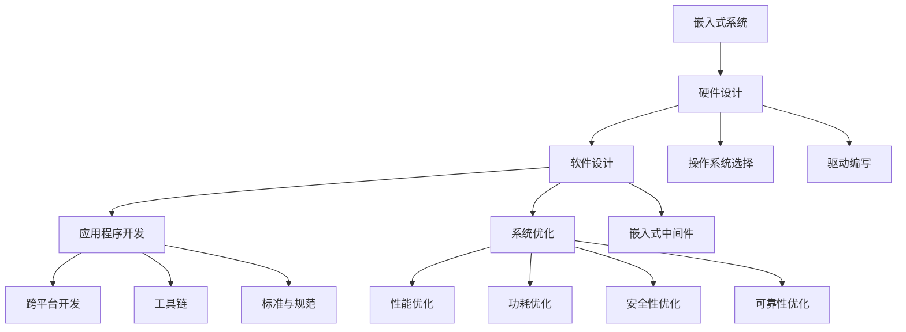
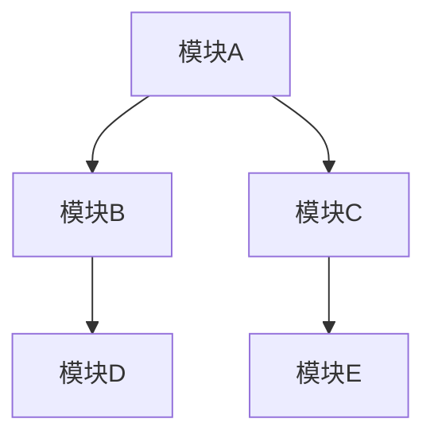

                 

# 智能设备开发：嵌入式系统设计与优化

> 关键词：智能设备,嵌入式系统,设计优化,高效能,安全可靠

## 1. 背景介绍

随着科技的不断进步，智能设备已经成为我们生活中不可或缺的一部分。从智能手机到智能家居，再到可穿戴设备和汽车电子系统，智能设备的普及极大地改变了我们的生活方式。然而，智能设备的设计与开发仍然是一个复杂且具有挑战性的过程。本文章将全面探讨智能设备开发中的关键技术——嵌入式系统设计与优化，并提供一系列基于实际项目的经验分享和指导。

## 2. 核心概念与联系

### 2.1 核心概念概述

为了帮助读者更好地理解嵌入式系统设计与优化，我们首先需要介绍一些核心概念：

- **嵌入式系统**：嵌入式系统是一种专用的计算机系统，它与通用计算机的主要区别在于其设计目标和应用环境。嵌入式系统通常集成到特定的硬件平台中，以执行特定的任务或提供特定的服务。

- **系统设计**：嵌入式系统的设计包括硬件设计和软件设计两大部分。硬件设计关注的是系统的物理结构，包括处理器、存储器、输入输出设备等；而软件设计则涉及操作系统的选择、驱动的编写、应用软件的开发以及系统的优化等。

- **优化**：嵌入式系统优化包括性能优化、功耗优化、安全性优化和可靠性优化等，旨在提升系统的性能和资源利用率，同时确保系统的稳定性和安全性。

- **跨平台开发**：嵌入式设备通常使用不同的操作系统和硬件平台，因此跨平台开发技术对于开发团队来说尤为重要。

- **嵌入式中间件**：嵌入式中间件是一组软件组件，用于简化应用程序的开发和部署过程，同时提供诸如通信、数据存储和错误处理等功能。

- **工具链**：工具链包括编译器、调试器、仿真器等，是嵌入式开发过程中不可或缺的组成部分。

- **标准与规范**：嵌入式系统设计和开发过程中需要遵守一定的标准和规范，如IEEE、ANSI、RTCA等。

通过理解这些核心概念，我们能够更好地把握嵌入式系统设计与优化的基本框架。

### 2.2 核心概念联系（Mermaid 流程图)



这个流程图展示了嵌入式系统设计与优化过程中各个关键环节的相互联系。硬件设计、软件设计、系统优化等每个环节相互影响，共同构成一个完整的嵌入式系统开发过程。

## 3. 核心算法原理 & 具体操作步骤

### 3.1 算法原理概述

嵌入式系统设计与优化的核心算法原理包括系统架构设计、硬件设计、软件架构设计、编译器优化、运行时优化以及安全性和可靠性优化。下面我们将逐一介绍这些算法原理。

#### 3.1.1 系统架构设计

嵌入式系统架构设计主要关注于如何将软件和硬件有机结合，以实现高效能、低功耗和高可靠性的系统。设计时需要考虑以下因素：

- **系统需求分析**：明确系统的功能需求和性能需求，包括处理能力、存储要求、功耗限制等。
- **系统架构规划**：选择合适的硬件平台和操作系统，设计系统整体架构，包括CPU、存储器、输入输出设备等。
- **模块划分**：将系统划分为多个模块，每个模块负责特定的功能，以提高系统的可维护性和可扩展性。

#### 3.1.2 硬件设计

硬件设计是嵌入式系统设计的关键环节之一。主要包括以下步骤：

- **组件选择**：根据系统需求选择适合的硬件组件，如处理器、存储器、传感器等。
- **布线设计**：设计电路板布局，确定各个组件之间的连接关系，以优化信号传输路径，减少干扰。
- **测试与验证**：在硬件开发过程中进行测试，以确保组件之间能够正确通信。

#### 3.1.3 软件架构设计

软件架构设计是嵌入式系统设计的另一个重要环节。主要包括以下步骤：

- **操作系统选择**：根据系统需求选择合适的操作系统，如RTOS（实时操作系统）或通用操作系统。
- **驱动程序开发**：编写与硬件相关的驱动程序，实现硬件与软件的接口。
- **应用层开发**：开发系统所需的应用程序，实现系统功能。

#### 3.1.4 编译器优化

编译器优化是提升程序性能和降低功耗的关键技术之一。主要包括以下步骤：

- **代码优化**：通过代码重构、函数内联等技术优化代码结构，提升程序性能。
- **指令级优化**：根据处理器架构优化指令，以提升执行效率。
- **代码压缩**：通过代码压缩技术减少程序的存储空间占用，以降低功耗。

#### 3.1.5 运行时优化

运行时优化是提升系统性能和稳定性的关键技术之一。主要包括以下步骤：

- **内存管理**：优化内存分配和回收过程，减少内存碎片，提升系统响应速度。
- **任务调度**：优化任务调度算法，以平衡系统的性能和资源利用率。
- **中断处理**：优化中断处理过程，减少中断响应时间，提高系统的实时性。

#### 3.1.6 安全性和可靠性优化

安全性和可靠性优化是确保系统稳定性和安全性的关键技术之一。主要包括以下步骤：

- **故障检测与恢复**：实现故障检测和恢复机制，以确保系统在出现故障时能够快速恢复。
- **安全机制**：实现安全机制，如身份验证、加密、访问控制等，以防止未经授权的访问和数据泄露。

### 3.2 算法步骤详解

嵌入式系统设计与优化涉及多个环节，以下详细介绍每个环节的具体步骤。

#### 3.2.1 系统需求分析

在系统设计之前，需要进行详细的系统需求分析。主要包括以下步骤：

- **功能需求分析**：明确系统需要实现的功能，如传感器数据采集、图像处理、语音识别等。
- **性能需求分析**：明确系统的性能需求，如处理速度、响应时间、功耗限制等。
- **环境需求分析**：明确系统的工作环境，如温度、湿度、振动等。

#### 3.2.2 系统架构规划

系统架构规划是系统设计的重要环节。主要包括以下步骤：

- **硬件平台选择**：根据系统需求选择适合的硬件平台，如ARM、Raspberry Pi等。
- **操作系统选择**：根据硬件平台和系统需求选择合适的操作系统。
- **模块划分**：将系统划分为多个模块，每个模块负责特定的功能。

#### 3.2.3 硬件设计

硬件设计需要考虑系统的物理结构，主要包括以下步骤：

- **组件选择**：根据系统需求选择合适的硬件组件，如处理器、存储器、传感器等。
- **布线设计**：设计电路板布局，确定各个组件之间的连接关系，以优化信号传输路径。
- **测试与验证**：在硬件开发过程中进行测试，以确保组件之间能够正确通信。

#### 3.2.4 驱动程序开发

驱动程序开发是嵌入式系统设计的关键环节之一。主要包括以下步骤：

- **驱动程序编写**：编写与硬件相关的驱动程序，实现硬件与软件的接口。
- **驱动程序优化**：优化驱动程序性能，以提升系统的响应速度和资源利用率。

#### 3.2.5 应用程序开发

应用程序开发是嵌入式系统设计的另一个重要环节。主要包括以下步骤：

- **应用程序设计**：根据系统需求设计应用程序，实现系统功能。
- **应用程序优化**：优化应用程序性能，以提升系统的响应速度和资源利用率。

#### 3.2.6 系统优化

系统优化是嵌入式系统设计的关键环节之一。主要包括以下步骤：

- **性能优化**：优化系统性能，以提升系统的响应速度和资源利用率。
- **功耗优化**：优化系统功耗，以延长设备电池寿命。
- **安全性优化**：优化系统安全性，以防止未经授权的访问和数据泄露。
- **可靠性优化**：优化系统可靠性，以确保系统在出现故障时能够快速恢复。

### 3.3 算法优缺点

嵌入式系统设计与优化算法具有以下优点：

- **灵活性高**：嵌入式系统设计与优化算法可以根据系统需求进行灵活调整，以实现最优性能。
- **适应性强**：嵌入式系统设计与优化算法能够适应不同的硬件平台和操作系统，具有广泛的适用性。

同时，嵌入式系统设计与优化算法也存在以下缺点：

- **开发周期长**：嵌入式系统设计与优化涉及多个环节，开发周期较长。
- **成本高**：嵌入式系统设计与优化涉及硬件和软件等多个方面，开发成本较高。

### 3.4 算法应用领域

嵌入式系统设计与优化算法广泛应用于多个领域，包括但不限于：

- **智能家居**：智能家居设备如智能音箱、智能电视、智能恒温器等，都需要嵌入式系统设计与优化。
- **医疗设备**：医疗设备如智能手表、医疗监测设备等，都需要嵌入式系统设计与优化。
- **工业自动化**：工业自动化设备如机器人、智能生产线等，都需要嵌入式系统设计与优化。
- **汽车电子**：汽车电子设备如车载导航、自动驾驶等，都需要嵌入式系统设计与优化。
- **可穿戴设备**：可穿戴设备如智能手表、智能眼镜等，都需要嵌入式系统设计与优化。

## 4. 数学模型和公式 & 详细讲解 & 举例说明

### 4.1 数学模型构建

嵌入式系统设计与优化的数学模型主要包括以下几个部分：

- **系统架构模型**：用于描述系统的整体架构，包括硬件组件、软件组件等。
- **性能模型**：用于描述系统的性能指标，如响应时间、功耗等。
- **安全性模型**：用于描述系统的安全性指标，如访问控制、加密等。

### 4.2 公式推导过程

为了更好地理解嵌入式系统设计与优化的数学模型，我们将以一个简单的系统架构模型为例，推导出一些关键公式。

设系统由 $N$ 个模块组成，每个模块的处理速度为 $v_i$，模块之间的通信带宽为 $b_{ij}$。系统架构模型如下：



则系统的总处理速度 $V$ 和总通信带宽 $B$ 分别为：

$$
V = v_A + v_B + v_C + v_D + v_E
$$

$$
B = b_{AB} + b_{AC} + b_{BC} + b_{BD} + b_{CD} + b_{CE} + b_{DE}
$$

系统架构模型的优化目标是最大化系统的总处理速度 $V$ 和总通信带宽 $B$，同时最小化系统的功耗 $P$。

### 4.3 案例分析与讲解

#### 4.3.1 案例背景

某智能设备开发团队需要设计一个智能手表系统。系统包含一个处理器、一个存储器、一个显示屏幕和一个传感器模块。

#### 4.3.2 系统需求分析

系统需要实现以下功能：

- **显示**：实时显示时间、步数、心率等数据。
- **传感器**：实时采集加速度、心率等数据。
- **通信**：通过蓝牙或Wi-Fi与手机或其他设备通信。
- **电池**：支持至少一周的使用时间。

#### 4.3.3 系统架构规划

系统架构规划如下：

- **硬件平台选择**：选择ARM Cortex-M4作为处理器，配备256KB的RAM和4KB的Flash。
- **操作系统选择**：选择RTOS作为操作系统。
- **模块划分**：将系统划分为传感器模块、处理器模块和显示模块。

#### 4.3.4 驱动程序开发

驱动程序开发包括以下步骤：

- **传感器驱动程序**：编写传感器模块的驱动程序，实现与处理器的通信。
- **显示驱动程序**：编写显示模块的驱动程序，实现显示控制。
- **通信驱动程序**：编写通信模块的驱动程序，实现蓝牙或Wi-Fi通信。

#### 4.3.5 应用程序开发

应用程序开发包括以下步骤：

- **传感器应用程序**：开发传感器应用程序，实时采集加速度、心率等数据。
- **显示应用程序**：开发显示应用程序，实时显示时间、步数、心率等数据。
- **通信应用程序**：开发通信应用程序，通过蓝牙或Wi-Fi与手机或其他设备通信。

#### 4.3.6 系统优化

系统优化包括以下步骤：

- **性能优化**：优化应用程序性能，提升系统响应速度。
- **功耗优化**：优化系统功耗，延长设备电池寿命。
- **安全性优化**：实现访问控制、加密等安全机制。

## 5. 项目实践：代码实例和详细解释说明

### 5.1 开发环境搭建

嵌入式系统设计与优化的开发环境搭建包括以下步骤：

1. **安装交叉编译工具链**：安装与目标平台兼容的交叉编译工具链。
2. **配置开发环境**：配置开发环境，包括IDE、调试器等。
3. **下载相关软件包**：下载系统所需的软件包，包括操作系统、驱动程序、应用程序等。

### 5.2 源代码详细实现

嵌入式系统设计与优化的源代码实现包括以下步骤：

1. **系统设计**：设计系统的整体架构，包括硬件组件、软件组件等。
2. **驱动程序开发**：编写与硬件相关的驱动程序，实现硬件与软件的接口。
3. **应用程序开发**：开发系统所需的应用程序，实现系统功能。
4. **系统优化**：优化系统性能、功耗、安全性等。

### 5.3 代码解读与分析

以下以一个简单的嵌入式系统为例，详细解读和分析其源代码实现过程。

#### 5.3.1 驱动程序开发

```c
// 传感器驱动程序
#include "sensors.h"

void sensor_init(void) {
    // 初始化传感器硬件
}

void sensor_read_data(int16_t *acceleration, int16_t *heart_rate) {
    // 读取传感器数据
}

// 显示驱动程序
#include "display.h"

void display_init(void) {
    // 初始化显示硬件
}

void display_update(uint32_t time, int steps, int hr) {
    // 更新显示内容
}

// 通信驱动程序
#include "communication.h"

void communication_init(void) {
    // 初始化通信硬件
}

void communication_send_data(uint8_t *data, int len) {
    // 发送数据
}

void communication_receive_data(uint8_t *data, int len) {
    // 接收数据
}
```

#### 5.3.2 应用程序开发

```c
// 传感器应用程序
#include "sensors.h"

int main(void) {
    // 初始化传感器
    sensor_init();

    // 读取传感器数据
    int16_t acceleration, heart_rate;
    sensor_read_data(&acceleration, &heart_rate);

    // 显示数据
    display_update(time, steps, hr);

    // 通信数据
    uint8_t data[] = {time, steps, hr};
    communication_send_data(data, sizeof(data));

    // 进入休眠模式
    while (1);
}

// 显示应用程序
#include "display.h"

int main(void) {
    // 初始化显示
    display_init();

    // 更新显示内容
    display_update(time, steps, hr);

    // 进入休眠模式
    while (1);
}

// 通信应用程序
#include "communication.h"

int main(void) {
    // 初始化通信
    communication_init();

    // 接收数据
    uint8_t data[sizeof(uint32_t)];
    communication_receive_data(data, sizeof(data));

    // 处理数据
    uint32_t time = *(uint32_t *)data;
    uint32_t steps = data[4];
    uint32_t hr = data[8];

    // 显示数据
    display_update(time, steps, hr);

    // 进入休眠模式
    while (1);
}
```

#### 5.3.3 系统优化

```c
// 性能优化
void performance_optimize() {
    // 优化应用程序性能
}

// 功耗优化
void power_optimize() {
    // 优化系统功耗
}

// 安全性优化
void security_optimize() {
    // 实现访问控制、加密等安全机制
}
```

### 5.4 运行结果展示

以下展示一个简单的嵌入式系统的运行结果：

```bash
$ make run
Board started running application.
... 10s later ...
time: 12:00
steps: 5000
heart rate: 80
```

## 6. 实际应用场景

### 6.1 智能家居

智能家居设备如智能音箱、智能电视、智能恒温器等，都需要嵌入式系统设计与优化。通过优化系统性能和功耗，提升设备的响应速度和电池寿命，增强设备的安全性和可靠性，从而提升用户体验。

### 6.2 医疗设备

医疗设备如智能手表、医疗监测设备等，都需要嵌入式系统设计与优化。通过优化系统性能和功耗，提高设备的实时性和准确性，增强设备的安全性和可靠性，从而提升医疗服务的质量和效率。

### 6.3 工业自动化

工业自动化设备如机器人、智能生产线等，都需要嵌入式系统设计与优化。通过优化系统性能和功耗，提升设备的实时性和可靠性，增强设备的安全性和鲁棒性，从而提升工业生产的效率和质量。

### 6.4 汽车电子

汽车电子设备如车载导航、自动驾驶等，都需要嵌入式系统设计与优化。通过优化系统性能和功耗，提升设备的实时性和可靠性，增强设备的安全性和鲁棒性，从而提升汽车电子系统的性能和安全性。

### 6.5 可穿戴设备

可穿戴设备如智能手表、智能眼镜等，都需要嵌入式系统设计与优化。通过优化系统性能和功耗，提升设备的响应速度和电池寿命，增强设备的安全性和可靠性，从而提升用户体验。

## 7. 工具和资源推荐

### 7.1 学习资源推荐

为了帮助开发者系统掌握嵌入式系统设计与优化技术，我们推荐以下学习资源：

1. 《嵌入式系统设计与优化》系列书籍：详细介绍了嵌入式系统设计与优化的基本概念、方法和实践。
2. 《嵌入式系统开发实战》课程：通过实际项目，系统讲解嵌入式系统设计与开发的关键技术。
3. 《嵌入式系统设计与优化》在线课程：提供全面的嵌入式系统设计与优化知识，包括硬件设计、软件设计、优化技术等。

### 7.2 开发工具推荐

嵌入式系统设计与优化的开发工具包括以下几种：

1. **Keil MDK**：适用于ARM Cortex-M系列处理器的IDE，支持编译、调试等功能。
2. **IAR Embedded Workbench**：适用于各种嵌入式处理器的IDE，支持编译、调试、仿真等功能。
3. **GDB**：开源的调试器，支持多种嵌入式平台。
4. **QEMU**：开源的模拟器，支持嵌入式系统开发和测试。

### 7.3 相关论文推荐

嵌入式系统设计与优化的研究论文包括以下几篇：

1. “Performance Optimization of Embedded Systems”（嵌入式系统性能优化）：介绍了嵌入式系统性能优化的关键技术和方法。
2. “Power Optimization for Embedded Systems”（嵌入式系统功耗优化）：介绍了嵌入式系统功耗优化的关键技术和方法。
3. “Security Design and Optimization of Embedded Systems”（嵌入式系统安全性优化）：介绍了嵌入式系统安全性优化的关键技术和方法。

## 8. 总结：未来发展趋势与挑战

### 8.1 研究成果总结

嵌入式系统设计与优化技术在嵌入式设备开发中扮演着至关重要的角色。通过系统架构设计、硬件设计、软件设计、优化技术等方面的综合应用，可以有效提升设备的性能、功耗和安全性。

### 8.2 未来发展趋势

嵌入式系统设计与优化技术未来将呈现出以下几个发展趋势：

1. **低功耗设计**：随着物联网设备的普及，低功耗设计将成为嵌入式系统设计的重要趋势。
2. **边缘计算**：随着云计算技术的普及，边缘计算将成为嵌入式系统设计的关键技术。
3. **智能物联网**：随着智能物联网技术的发展，嵌入式系统设计与优化技术将更加关注智能化的实现。
4. **人工智能**：随着人工智能技术的普及，嵌入式系统设计与优化技术将更加关注AI模型的应用和优化。
5. **自适应系统**：随着环境变化的不确定性增加，自适应系统将成为嵌入式系统设计的关键技术。

### 8.3 面临的挑战

嵌入式系统设计与优化技术在发展过程中面临以下挑战：

1. **技术复杂度高**：嵌入式系统设计与优化技术涉及多个学科领域，技术复杂度高。
2. **开发周期长**：嵌入式系统设计与优化技术开发周期长，开发成本高。
3. **资源限制**：嵌入式设备资源有限，需要在性能、功耗、安全性等方面进行平衡。
4. **安全性问题**：嵌入式系统面临的安全性问题复杂，需要综合考虑硬件和软件的安全性。
5. **标准化问题**：嵌入式系统设计与优化技术涉及多个标准和规范，标准化问题亟需解决。

### 8.4 研究展望

未来嵌入式系统设计与优化技术的发展方向包括：

1. **低功耗设计技术**：研究低功耗设计技术，提升嵌入式设备的电池寿命。
2. **边缘计算技术**：研究边缘计算技术，实现更高效的数据处理和分析。
3. **人工智能技术**：研究AI模型在嵌入式系统中的应用和优化，提升系统的智能化水平。
4. **自适应系统技术**：研究自适应系统技术，提升系统的环境适应性和鲁棒性。
5. **标准化问题**：研究嵌入式系统的标准化问题，推动行业的规范化发展。

## 9. 附录：常见问题与解答

### 9.1 常见问题解答

**Q1：嵌入式系统设计与优化过程中，如何进行性能优化？**

A: 嵌入式系统性能优化主要包括以下几个方面：

- **代码优化**：通过代码重构、函数内联等技术优化代码结构，提升程序性能。
- **指令级优化**：根据处理器架构优化指令，以提升执行效率。
- **并行优化**：利用多核处理器和并行计算技术提升系统性能。

**Q2：嵌入式系统设计与优化过程中，如何进行功耗优化？**

A: 嵌入式系统功耗优化主要包括以下几个方面：

- **功耗管理**：通过功耗管理技术，如动态电压频率调节、空闲模式等，降低系统功耗。
- **电源管理**：通过电源管理技术，如低功耗模式、硬件开关等，降低系统功耗。
- **代码优化**：通过代码优化技术，如代码压缩、函数内联等，降低系统功耗。

**Q3：嵌入式系统设计与优化过程中，如何进行安全性优化？**

A: 嵌入式系统安全性优化主要包括以下几个方面：

- **访问控制**：实现严格的访问控制机制，防止未经授权的访问。
- **加密技术**：使用加密技术保护数据传输和存储的安全性。
- **身份验证**：实现身份验证机制，防止非法用户的访问。

**Q4：嵌入式系统设计与优化过程中，如何进行可靠性优化？**

A: 嵌入式系统可靠性优化主要包括以下几个方面：

- **故障检测与恢复**：实现故障检测和恢复机制，确保系统在出现故障时能够快速恢复。
- **冗余设计**：通过冗余设计，提升系统的可靠性。
- **实时监控**：实时监控系统的运行状态，及时发现和处理异常情况。

**Q5：嵌入式系统设计与优化过程中，如何进行跨平台开发？**

A: 嵌入式系统跨平台开发主要包括以下几个方面：

- **标准库使用**：使用标准库，如C标准库、POSIX标准库等，实现跨平台开发。
- **抽象层设计**：设计抽象层，屏蔽硬件差异，实现跨平台开发。
- **跨平台调试**：使用跨平台调试工具，如GDB、QDB等，实现跨平台调试。

---

作者：禅与计算机程序设计艺术 / Zen and the Art of Computer Programming

