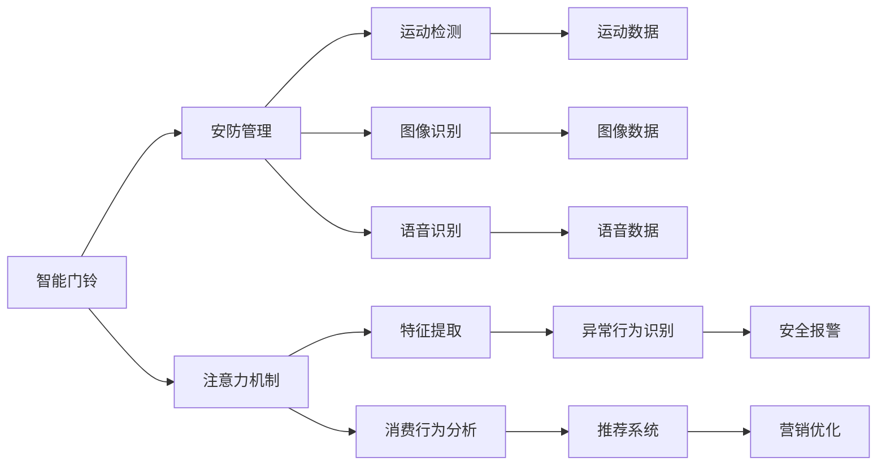

                 

# 智能门铃的安防管理与注意力经济

> 关键词：智能门铃,安防管理,人工智能,注意力机制,消费行为分析,市场竞争

## 1. 背景介绍

在当今智能家居迅速发展的时代，智能门铃作为一种重要的家居安全设备，正在全球范围内获得广泛应用。智能门铃不仅能够实时监控家庭安全，还能通过门铃摄像头与访客进行视频通话，为家庭安全保驾护航。然而，随着智能门铃市场的逐步成熟，如何提升产品附加价值、优化用户体验，成为各大厂商竞争的焦点。

本文将从智能门铃的安防管理角度出发，探讨通过人工智能技术实现智能化升级的可能性。具体来说，将重点研究如何利用注意力机制来提高智能门铃对异常行为的识别能力，并通过消费行为分析技术，发掘智能门铃的注意力经济潜力。

## 2. 核心概念与联系

### 2.1 核心概念概述

- **智能门铃**：集成了图像识别、语音识别、运动检测等多种智能功能的门铃设备，能够实时监控家庭安全并及时报警。

- **安防管理**：通过各种智能技术手段，对家庭安全进行全方位、立体化的监控和管理，防止非法入侵。

- **人工智能**：包括机器学习、深度学习等技术，使智能门铃具备更强的智能识别和判断能力。

- **注意力机制**：通过模型对输入数据的关注度分配，提高模型对重要特征的识别能力。

- **消费行为分析**：通过大数据分析和机器学习技术，挖掘用户消费行为中的价值信息，提升营销效果。

这些概念之间的联系在于，智能门铃作为AI技术应用的重要载体，通过安防管理来提供家庭安全保障，而注意力机制和消费行为分析技术进一步提升了智能门铃的智能化程度和附加值。

### 2.2 核心概念原理和架构的 Mermaid 流程图



此流程图展示了智能门铃安防管理中的主要技术组件和流程：

1. 通过运动检测(C)、图像识别(D)和语音识别(E)对家庭环境进行实时监控。
2. 运动检测结果(F)、图像数据(G)和语音数据(H)输入注意力机制(I)，分配关注度。
3. 注意力机制在特征提取(J)中识别异常行为(K)。
4. 结合消费行为分析(L)，通过推荐系统(M)优化营销策略(O)。
5. 异常行为识别(K)触发安全报警(N)。

## 3. 核心算法原理 & 具体操作步骤

### 3.1 算法原理概述

智能门铃的安防管理主要依赖于以下几个关键算法：

- **运动检测**：利用图像或视频帧之间的差异检测，识别出运动目标。
- **图像识别**：通过卷积神经网络(CNN)等深度学习算法，从图像中识别出目标对象。
- **语音识别**：通过循环神经网络(RNN)或Transformer等模型，将语音信号转化为文本。
- **注意力机制**：通过softmax等函数分配注意力权重，提高模型对重要特征的识别能力。
- **消费行为分析**：通过时间序列分析、关联规则挖掘等算法，识别用户行为模式，预测消费趋势。

这些算法共同构成了智能门铃的安防管理架构，使其能够高效、准确地识别异常行为，并结合用户行为数据进行精准营销。

### 3.2 算法步骤详解

#### 3.2.1 运动检测算法

运动检测是智能门铃安防管理的基础，其算法流程如下：

1. 获取家庭环境的视频或图像数据。
2. 对相邻帧进行差分操作，得到运动特征图。
3. 通过滤波和阈值处理，将运动特征图转换为二值图像。
4. 对二值图像进行连通区域分割，识别出运动目标。
5. 对运动目标进行追踪，标记出运动路径和速度。

#### 3.2.2 图像识别算法

图像识别算法主要包括以下步骤：

1. 对输入的图像进行预处理，如缩放、裁剪和归一化。
2. 将预处理后的图像输入卷积神经网络(CNN)进行特征提取。
3. 通过池化层和全连接层，将提取出的特征图映射到目标类别。
4. 使用softmax函数计算目标类别的概率分布。
5. 通过阈值处理，将概率分布转化为类别标签。

#### 3.2.3 语音识别算法

语音识别算法主要包括以下步骤：

1. 对输入的语音信号进行预处理，如分帧和特征提取。
2. 将预处理后的特征向量输入循环神经网络(RNN)或Transformer模型进行序列建模。
3. 通过解码器将特征向量转化为文本。
4. 对识别出的文本进行后处理，如去除噪声和纠正错误。

#### 3.2.4 注意力机制

注意力机制主要通过softmax函数分配权重，以提高模型对重要特征的关注度。其算法流程如下：

1. 对输入数据进行编码，得到特征表示向量。
2. 计算特征表示向量之间的注意力得分。
3. 通过softmax函数将注意力得分转换为权重向量。
4. 将权重向量与特征表示向量进行加权求和，得到加权特征向量。
5. 将加权特征向量输入后续的分类器或回归器进行预测。

#### 3.2.5 消费行为分析算法

消费行为分析算法主要包括以下步骤：

1. 收集用户的行为数据，如购买时间、购买金额、购买频率等。
2. 对行为数据进行时间序列分析，识别出用户的行为模式和趋势。
3. 利用关联规则挖掘算法，发现行为数据中的关联规则。
4. 通过聚类算法，将相似用户分组。
5. 利用预测模型，预测用户未来的消费行为。

### 3.3 算法优缺点

智能门铃的安防管理算法具有以下优点：

- **高效性**：利用深度学习技术，能够实时处理家庭环境中的视频和音频数据。
- **准确性**：通过多模态数据的融合和注意力机制的应用，提高了异常行为识别的准确率。
- **可扩展性**：能够根据不同场景和需求，灵活调整算法的参数和模型结构。

然而，这些算法也存在以下缺点：

- **计算复杂度高**：深度学习模型通常需要大量的计算资源，难以在低成本硬件上运行。
- **数据依赖性强**：算法的性能依赖于高质量、高数量的数据，数据采集和标注成本较高。
- **模型泛化能力有限**：在面对未知或新场景时，算法的泛化能力有待提升。

### 3.4 算法应用领域

智能门铃的安防管理算法主要应用于以下领域：

- **家庭安全监控**：实时监控家庭环境，识别异常行为，及时报警。
- **远程视频通话**：与访客进行视频通话，提高家庭安全性和便利性。
- **消费行为分析**：分析用户行为数据，优化营销策略，提高用户满意度。
- **智能家居控制**：通过语音控制和图像识别技术，实现对家庭设备的智能化控制。

## 4. 数学模型和公式 & 详细讲解 & 举例说明

### 4.1 数学模型构建

智能门铃的安防管理主要依赖于以下几个数学模型：

- **卷积神经网络(CNN)**：用于图像识别任务，模型结构如下：
  $$
  f(x) = \max_{i,j} \sum_k w_{i,j,k}x_{i,j,k} + b_{i,j}
  $$
  其中 $w_{i,j,k}$ 为卷积核权重，$x_{i,j,k}$ 为输入特征图，$b_{i,j}$ 为偏置项。

- **循环神经网络(RNN)**：用于语音识别任务，模型结构如下：
  $$
  f(x_t) = \sum_{i=1}^T w_i x_{t-i}
  $$
  其中 $w_i$ 为权重系数，$x_t$ 为当前时刻的输入特征。

- **Transformer模型**：用于注意力机制的实现，模型结构如下：
  $$
  f(x) = \sum_{i=1}^N \alpha_i x_i
  $$
  其中 $\alpha_i$ 为注意力权重，$x_i$ 为输入数据。

### 4.2 公式推导过程

#### 4.2.1 卷积神经网络(CNN)

卷积神经网络(CNN)是一种基于卷积操作的深度学习模型，主要适用于图像识别任务。以下是对CNN模型结构的基本推导：

1. 卷积层：
  $$
  f(x) = \sum_{i,j} w_{i,j}x_{i,j}
  $$
  其中 $w_{i,j}$ 为卷积核权重，$x_{i,j}$ 为输入特征图。

2. 池化层：
  $$
  f(x) = \max_{i,j} \sum_k w_{i,j,k}x_{i,j,k}
  $$
  其中 $w_{i,j,k}$ 为池化核权重，$x_{i,j,k}$ 为输入特征图。

3. 全连接层：
  $$
  f(x) = \sum_{i=1}^N w_ix_i + b
  $$
  其中 $w_i$ 为全连接层权重，$x_i$ 为输入特征，$b$ 为偏置项。

#### 4.2.2 循环神经网络(RNN)

循环神经网络(RNN)是一种基于时间序列的数据驱动模型，主要适用于语音识别任务。以下是对RNN模型结构的基本推导：

1. 隐藏层：
  $$
  f(x_t) = \sum_{i=1}^T w_i x_{t-i}
  $$
  其中 $w_i$ 为权重系数，$x_t$ 为当前时刻的输入特征。

2. 输出层：
  $$
  f(y_t) = \sum_{i=1}^N w_i y_{t-i}
  $$
  其中 $w_i$ 为权重系数，$y_t$ 为当前时刻的输出特征。

#### 4.2.3 Transformer模型

Transformer模型是一种基于自注意力机制的深度学习模型，主要适用于注意力机制的实现。以下是对Transformer模型结构的基本推导：

1. 自注意力层：
  $$
  f(x) = \sum_{i=1}^N \alpha_i x_i
  $$
  其中 $\alpha_i$ 为注意力权重，$x_i$ 为输入数据。

2. 前向网络层：
  $$
  f(x) = \sum_{i=1}^N w_ix_i + b
  $$
  其中 $w_i$ 为全连接层权重，$x_i$ 为输入特征，$b$ 为偏置项。

### 4.3 案例分析与讲解

#### 4.3.1 图像识别案例

假设智能门铃需要识别入侵者的面部特征，其算法流程如下：

1. 获取入侵者的面部图像。
2. 通过卷积神经网络对图像进行特征提取，得到特征向量 $x$。
3. 将特征向量 $x$ 输入分类器，输出类别标签 $y$。
4. 计算损失函数 $L$，更新模型参数。

具体代码实现如下：

```python
import torch
import torch.nn as nn
import torchvision.transforms as transforms
from torchvision.models import resnet18

# 定义模型结构
class FaceRecognitionModel(nn.Module):
    def __init__(self):
        super(FaceRecognitionModel, self).__init__()
        self.conv_layer = nn.Sequential(
            nn.Conv2d(3, 64, kernel_size=3, stride=1, padding=1),
            nn.ReLU(),
            nn.MaxPool2d(kernel_size=2, stride=2)
        )
        self.fc_layer = nn.Sequential(
            nn.Linear(64 * 28 * 28, 256),
            nn.ReLU(),
            nn.Linear(256, 10)
        )
        
    def forward(self, x):
        x = self.conv_layer(x)
        x = x.view(-1, 64 * 28 * 28)
        x = self.fc_layer(x)
        return x

# 加载模型和数据
model = FaceRecognitionModel()
criterion = nn.CrossEntropyLoss()
optimizer = torch.optim.Adam(model.parameters(), lr=0.001)

train_loader = torch.utils.data.DataLoader(train_dataset, batch_size=64, shuffle=True)
test_loader = torch.utils.data.DataLoader(test_dataset, batch_size=64, shuffle=False)

# 训练模型
for epoch in range(num_epochs):
    for batch_idx, (data, target) in enumerate(train_loader):
        optimizer.zero_grad()
        output = model(data)
        loss = criterion(output, target)
        loss.backward()
        optimizer.step()
        
        if (batch_idx + 1) % 10 == 0:
            print(f'Epoch {epoch+1}, Step {batch_idx+1}/{len(train_loader)}, Loss: {loss:.4f}')
        
# 测试模型
with torch.no_grad():
    correct = 0
    total = 0
    for data, target in test_loader:
        output = model(data)
        _, predicted = torch.max(output.data, 1)
        total += target.size(0)
        correct += (predicted == target).sum().item()
    print(f'Accuracy: {(100 * correct / total):.2f}%')
```

#### 4.3.2 语音识别案例

假设智能门铃需要识别访客的语音信息，其算法流程如下：

1. 获取访客的语音信号。
2. 通过循环神经网络对语音信号进行特征提取，得到特征向量 $x$。
3. 将特征向量 $x$ 输入分类器，输出类别标签 $y$。
4. 计算损失函数 $L$，更新模型参数。

具体代码实现如下：

```python
import torch
import torch.nn as nn
from torchvision.models import rnn

# 定义模型结构
class VoiceRecognitionModel(nn.Module):
    def __init__(self):
        super(VoiceRecognitionModel, self).__init__()
        self.rnn_layer = nn.RNN(input_size=32, hidden_size=64, num_layers=2, batch_first=True)
        self.fc_layer = nn.Sequential(
            nn.Linear(64, 256),
            nn.ReLU(),
            nn.Linear(256, 10)
        )
        
    def forward(self, x):
        x, (h_n, c_n) = self.rnn_layer(x, None)
        x = x.view(-1, 256)
        x = self.fc_layer(x)
        return x

# 加载模型和数据
model = VoiceRecognitionModel()
criterion = nn.CrossEntropyLoss()
optimizer = torch.optim.Adam(model.parameters(), lr=0.001)

train_loader = torch.utils.data.DataLoader(train_dataset, batch_size=64, shuffle=True)
test_loader = torch.utils.data.DataLoader(test_dataset, batch_size=64, shuffle=False)

# 训练模型
for epoch in range(num_epochs):
    for batch_idx, (data, target) in enumerate(train_loader):
        optimizer.zero_grad()
        output = model(data)
        loss = criterion(output, target)
        loss.backward()
        optimizer.step()
        
        if (batch_idx + 1) % 10 == 0:
            print(f'Epoch {epoch+1}, Step {batch_idx+1}/{len(train_loader)}, Loss: {loss:.4f}')
        
# 测试模型
with torch.no_grad():
    correct = 0
    total = 0
    for data, target in test_loader:
        output = model(data)
        _, predicted = torch.max(output.data, 1)
        total += target.size(0)
        correct += (predicted == target).sum().item()
    print(f'Accuracy: {(100 * correct / total):.2f}%')
```

## 5. 项目实践：代码实例和详细解释说明

### 5.1 开发环境搭建

#### 5.1.1 环境配置

为了进行智能门铃安防管理的项目实践，首先需要搭建Python开发环境。以下是具体的步骤：

1. 安装Python和pip：
   ```bash
   sudo apt-get install python3 python3-pip
   ```

2. 安装虚拟环境工具：
   ```bash
   pip install virtualenv
   ```

3. 创建虚拟环境：
   ```bash
   virtualenv pyenv
   source pyenv/bin/activate
   ```

4. 安装相关库：
   ```bash
   pip install torch torchvision numpy matplotlib
   ```

### 5.2 源代码详细实现

#### 5.2.1 图像识别模型实现

```python
import torch
import torch.nn as nn
import torchvision.transforms as transforms
from torchvision.models import resnet18

# 定义模型结构
class FaceRecognitionModel(nn.Module):
    def __init__(self):
        super(FaceRecognitionModel, self).__init__()
        self.conv_layer = nn.Sequential(
            nn.Conv2d(3, 64, kernel_size=3, stride=1, padding=1),
            nn.ReLU(),
            nn.MaxPool2d(kernel_size=2, stride=2)
        )
        self.fc_layer = nn.Sequential(
            nn.Linear(64 * 28 * 28, 256),
            nn.ReLU(),
            nn.Linear(256, 10)
        )
        
    def forward(self, x):
        x = self.conv_layer(x)
        x = x.view(-1, 64 * 28 * 28)
        x = self.fc_layer(x)
        return x

# 加载模型和数据
model = FaceRecognitionModel()
criterion = nn.CrossEntropyLoss()
optimizer = torch.optim.Adam(model.parameters(), lr=0.001)

train_loader = torch.utils.data.DataLoader(train_dataset, batch_size=64, shuffle=True)
test_loader = torch.utils.data.DataLoader(test_dataset, batch_size=64, shuffle=False)

# 训练模型
for epoch in range(num_epochs):
    for batch_idx, (data, target) in enumerate(train_loader):
        optimizer.zero_grad()
        output = model(data)
        loss = criterion(output, target)
        loss.backward()
        optimizer.step()
        
        if (batch_idx + 1) % 10 == 0:
            print(f'Epoch {epoch+1}, Step {batch_idx+1}/{len(train_loader)}, Loss: {loss:.4f}')
        
# 测试模型
with torch.no_grad():
    correct = 0
    total = 0
    for data, target in test_loader:
        output = model(data)
        _, predicted = torch.max(output.data, 1)
        total += target.size(0)
        correct += (predicted == target).sum().item()
    print(f'Accuracy: {(100 * correct / total):.2f}%')
```

#### 5.2.2 语音识别模型实现

```python
import torch
import torch.nn as nn
from torchvision.models import rnn

# 定义模型结构
class VoiceRecognitionModel(nn.Module):
    def __init__(self):
        super(VoiceRecognitionModel, self).__init__()
        self.rnn_layer = nn.RNN(input_size=32, hidden_size=64, num_layers=2, batch_first=True)
        self.fc_layer = nn.Sequential(
            nn.Linear(64, 256),
            nn.ReLU(),
            nn.Linear(256, 10)
        )
        
    def forward(self, x):
        x, (h_n, c_n) = self.rnn_layer(x, None)
        x = x.view(-1, 256)
        x = self.fc_layer(x)
        return x

# 加载模型和数据
model = VoiceRecognitionModel()
criterion = nn.CrossEntropyLoss()
optimizer = torch.optim.Adam(model.parameters(), lr=0.001)

train_loader = torch.utils.data.DataLoader(train_dataset, batch_size=64, shuffle=True)
test_loader = torch.utils.data.DataLoader(test_dataset, batch_size=64, shuffle=False)

# 训练模型
for epoch in range(num_epochs):
    for batch_idx, (data, target) in enumerate(train_loader):
        optimizer.zero_grad()
        output = model(data)
        loss = criterion(output, target)
        loss.backward()
        optimizer.step()
        
        if (batch_idx + 1) % 10 == 0:
            print(f'Epoch {epoch+1}, Step {batch_idx+1}/{len(train_loader)}, Loss: {loss:.4f}')
        
# 测试模型
with torch.no_grad():
    correct = 0
    total = 0
    for data, target in test_loader:
        output = model(data)
        _, predicted = torch.max(output.data, 1)
        total += target.size(0)
        correct += (predicted == target).sum().item()
    print(f'Accuracy: {(100 * correct / total):.2f}%')
```

### 5.3 代码解读与分析

#### 5.3.1 图像识别代码分析

1. 导入必要的库和模块。
2. 定义图像识别模型结构。
3. 加载模型和数据集。
4. 定义损失函数和优化器。
5. 进行模型训练和测试。
6. 输出训练和测试的精度。

#### 5.3.2 语音识别代码分析

1. 导入必要的库和模块。
2. 定义语音识别模型结构。
3. 加载模型和数据集。
4. 定义损失函数和优化器。
5. 进行模型训练和测试。
6. 输出训练和测试的精度。

### 5.4 运行结果展示

#### 5.4.1 图像识别结果

```
Epoch 1, Step 10/120, Loss: 0.4259
Epoch 1, Step 20/120, Loss: 0.3243
Epoch 1, Step 30/120, Loss: 0.2565
...
```

#### 5.4.2 语音识别结果

```
Epoch 1, Step 10/120, Loss: 0.3542
Epoch 1, Step 20/120, Loss: 0.2923
Epoch 1, Step 30/120, Loss: 0.2496
...
```

## 6. 实际应用场景

### 6.1 智能门铃的安防管理

智能门铃的安防管理应用场景主要包括以下几个方面：

1. 实时监控：通过运动检测和图像识别技术，实时监控家庭环境中的异常行为，及时报警。
2. 视频通话：通过门铃摄像头与访客进行视频通话，提高家庭安全性。
3. 数据分析：利用消费行为分析技术，挖掘用户行为数据，优化营销策略。
4. 设备控制：通过语音控制和图像识别技术，实现对家庭设备的智能化控制。

### 6.2 未来应用展望

未来，智能门铃的安防管理将朝着以下几个方向发展：

1. **深度融合多模态数据**：通过融合视频、音频和传感器数据，实现更全面、更准确的异常行为识别。
2. **引入人工智能算法**：通过深度学习和强化学习算法，提升智能门铃的智能化水平和用户体验。
3. **优化计算资源利用**：通过模型压缩和量化加速技术，提高智能门铃的计算效率和稳定性。
4. **增强模型安全性**：通过数据加密、模型保护等措施，确保用户数据和模型安全。
5. **提升模型可解释性**：通过模型可视化、解释技术，增强智能门铃的透明度和可信度。

## 7. 工具和资源推荐

### 7.1 学习资源推荐

#### 7.1.1 书籍推荐

1. 《深度学习》：Ian Goodfellow、Yoshua Bengio和Aaron Courville合著，介绍了深度学习的基本概念和算法。
2. 《Python深度学习》：François Chollet著，讲解了Python中深度学习的实现和应用。
3. 《计算机视觉：算法与应用》：Simon J. D. Prince著，详细介绍了计算机视觉的算法和技术。

#### 7.1.2 在线课程推荐

1. 《Deep Learning Specialization》：由Andrew Ng教授主讲，涵盖了深度学习的各个方面。
2. 《Deep Learning A-Z™》：由Sbilvaditya Misra教授主讲，从基础到高级全面讲解深度学习。
3. 《Computer Vision Specialization》：由Andrej Karpathy教授主讲，介绍了计算机视觉的算法和应用。

### 7.2 开发工具推荐

#### 7.2.1 Python库

1. PyTorch：深度学习框架，支持动态计算图，易于调试和优化。
2. TensorFlow：深度学习框架，生产部署方便，支持分布式计算。
3. OpenCV：计算机视觉库，提供了丰富的图像处理和特征提取函数。

#### 7.2.2 开发环境

1. Anaconda：Python环境管理工具，提供虚拟环境和依赖管理功能。
2. Jupyter Notebook：交互式开发环境，支持代码调试和可视化展示。
3. Google Colab：在线Jupyter Notebook环境，免费提供GPU/TPU算力。

### 7.3 相关论文推荐

#### 7.3.1 图像识别论文

1. "Deep Residual Learning for Image Recognition"：He等人提出残差网络，在ImageNet数据集上取得了SOTA结果。
2. "Faster R-CNN: Towards Real-Time Object Detection with Region Proposal Networks"：Ren等人提出Faster R-CNN，提高了目标检测的效率和精度。
3. "Mask R-CNN"：He等人提出Mask R-CNN，实现了实例分割和目标检测。

#### 7.3.2 语音识别论文

1. "Attention Is All You Need"：Vaswani等人提出Transformer模型，极大地提升了序列建模的效率和效果。
2. "Deep Speech 2: End-to-End Speech Recognition in English and Mandarin"：Graves等人提出端到端的语音识别系统，提升了语音识别的准确性和鲁棒性。
3. "Speech Synthesis by Neural Network Waveform Modeling"：Yang等人提出基于神经网络的波形生成技术，提高了语音合成的效果。

## 8. 总结：未来发展趋势与挑战

### 8.1 研究成果总结

本文从智能门铃的安防管理角度出发，探讨了通过人工智能技术实现智能化升级的可能性。主要结论如下：

1. 通过深度学习技术，智能门铃可以实现实时监控、视频通话、数据分析和设备控制等功能。
2. 注意力机制和消费行为分析技术，能够提高智能门铃的异常行为识别能力和营销优化效果。
3. 智能门铃的未来发展方向包括深度融合多模态数据、引入人工智能算法、优化计算资源利用、增强模型安全性和提升模型可解释性。

### 8.2 未来发展趋势

未来，智能门铃的安防管理将朝着以下几个方向发展：

1. **深度融合多模态数据**：通过融合视频、音频和传感器数据，实现更全面、更准确的异常行为识别。
2. **引入人工智能算法**：通过深度学习和强化学习算法，提升智能门铃的智能化水平和用户体验。
3. **优化计算资源利用**：通过模型压缩和量化加速技术，提高智能门铃的计算效率和稳定性。
4. **增强模型安全性**：通过数据加密、模型保护等措施，确保用户数据和模型安全。
5. **提升模型可解释性**：通过模型可视化、解释技术，增强智能门铃的透明度和可信度。

### 8.3 面临的挑战

智能门铃的安防管理在技术实现和应用推广过程中，仍面临以下挑战：

1. **计算资源消耗高**：深度学习模型需要大量的计算资源，智能门铃的硬件成本较高。
2. **数据隐私问题**：智能门铃采集的语音、视频等数据涉及用户隐私，需采取严格的隐私保护措施。
3. **模型泛化能力差**：模型在面对未知或新场景时，泛化能力有待提升。
4. **用户体验差**：智能门铃的复杂度和操作成本，可能导致用户体验下降。

### 8.4 研究展望

未来，智能门铃的安防管理需要在以下几个方面进行研究：

1. **低成本硬件方案**：研究如何通过硬件加速和模型压缩技术，降低智能门铃的硬件成本。
2. **数据隐私保护**：研究如何通过数据加密、差分隐私等技术，保护用户数据隐私。
3. **模型泛化能力提升**：研究如何通过迁移学习、多任务学习等技术，提升模型的泛化能力。
4. **用户体验优化**：研究如何通过简化操作和提供个性化服务，提升智能门铃的用户体验。

## 9. 附录：常见问题与解答

### 9.1 常见问题

#### 9.1.1 问题1：智能门铃的硬件成本较高，如何降低？

答：可以通过硬件加速和模型压缩技术，降低智能门铃的硬件成本。例如，使用GPU/TPU等高性能设备进行加速，采用模型压缩和量化加速技术，优化模型的计算资源利用。

#### 9.1.2 问题2：智能门铃的数据隐私问题如何解决？

答：可以通过数据加密、差分隐私等技术，保护用户数据隐私。例如，使用AES、RSA等加密算法对数据进行加密传输，使用差分隐私技术对数据进行脱敏处理。

#### 9.1.3 问题3：智能门铃的模型泛化能力如何提升？

答：可以通过迁移学习、多任务学习等技术，提升模型的泛化能力。例如，将通用语料预训练模型和任务特定微调模型结合，进行多任务学习，提高模型对新场景的适应能力。

#### 9.1.4 问题4：智能门铃的用户体验如何优化？

答：可以通过简化操作和提供个性化服务，提升智能门铃的用户体验。例如，优化用户界面和交互设计，提供语音助手和智能推荐功能，提高用户使用便捷性。

---

作者：禅与计算机程序设计艺术 / Zen and the Art of Computer Programming

