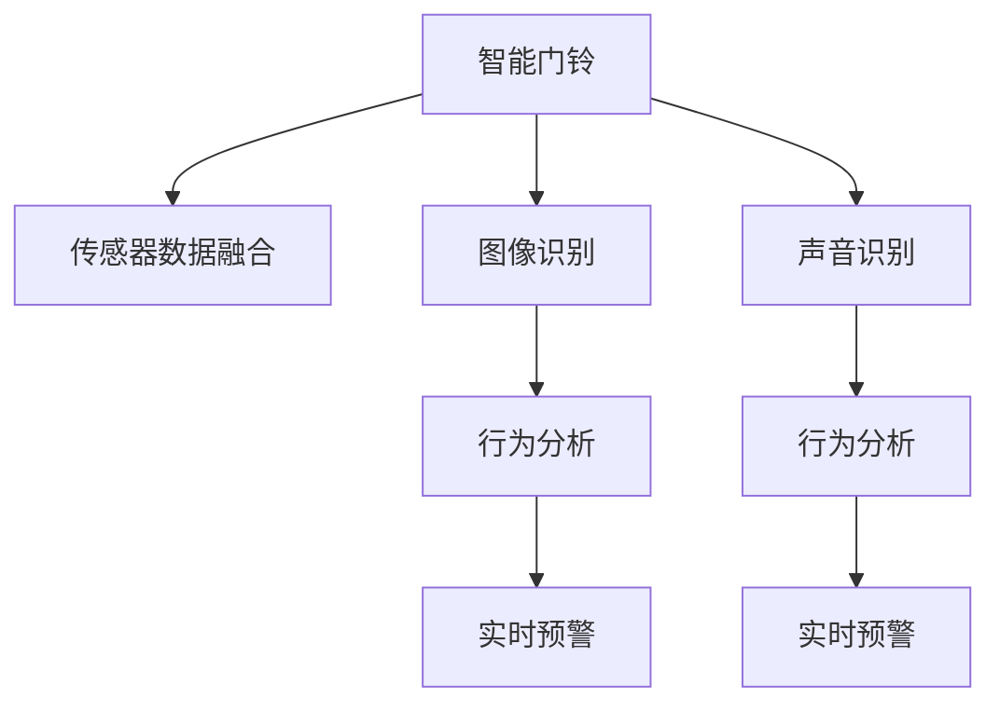

                 

# 智能门铃：家居安防与注意力管理的结合

## 1. 背景介绍

### 1.1 问题由来
随着科技的进步和生活水平的提高，家居安防成为了人们关注的热点话题。传统的家居安防系统依赖于人力监控和物理安防设备，如摄像头、防盗门、报警器等，存在成本高、反应慢、精度低等缺点。近年来，智能门铃技术的兴起，以其隐蔽性、实时性和智能化等特点，迅速成为家居安防的新宠。智能门铃通过将图像、声音等多模态数据实时传输到手机或云端平台，利用人工智能技术进行实时分析，不仅能够提高安防系统的响应速度和准确性，还能通过智能决策，减少误报和漏报情况，真正做到人防和技防的有机结合。

智能门铃的核心技术包括传感器数据融合、图像识别、声音识别、行为分析等。传统的算法和架构，往往难以应对多模态数据的复杂性和实时性要求。本博客文章将聚焦于智能门铃技术，探讨其关键组件和优化方法，展示智能门铃在家庭安防中的应用潜力，并展望未来发展方向。

## 2. 核心概念与联系

### 2.1 核心概念概述

为更好地理解智能门铃的核心技术，本节将介绍几个密切相关的核心概念：

- 智能门铃：一种融合图像、声音等多模态数据的家居安防设备，通过人工智能技术进行实时分析，能够自动检测异常行为并及时预警。

- 传感器数据融合：将不同来源的传感器数据（如摄像头、麦克风等）进行整合，形成更为全面、准确的感知信息，提升安防系统的实时性和鲁棒性。

- 图像识别：通过深度学习算法对摄像头传回的图像数据进行识别，判断是否存在异常行为。

- 声音识别：利用语音处理技术，对麦克风传回的声音数据进行分析，识别是否为非法入侵或紧急呼救。

- 行为分析：通过多模态数据融合和上下文推理，对家庭场景中的行为进行理解和判断，进行实时预警。

这些核心概念之间的逻辑关系可以通过以下Mermaid流程图来展示：



这个流程图展示了智能门铃的核心组件及其之间的关系：

1. 智能门铃通过摄像头和麦克风获取家庭环境的多模态数据。
2. 传感器数据融合模块将这些数据进行整合，形成更为全面、准确的感知信息。
3. 图像识别和声音识别模块分别对图像和声音进行独立分析，判断是否存在异常行为。
4. 行为分析模块综合图像、声音等多模态信息，进行上下文推理，理解家庭场景中的行为。
5. 实时预警模块根据行为分析的结果，进行异常检测和紧急响应。

这些核心概念共同构成了智能门铃的感知、分析和预警体系，使其能够实时监测家庭安全，提供高效、智能的安防服务。

## 3. 核心算法原理 & 具体操作步骤
### 3.1 算法原理概述

智能门铃的实时预警依赖于多模态数据的融合与分析，核心算法原理如下：

1. **传感器数据融合**：将摄像头和麦克风的数据进行时间同步，形成全时序的多模态数据流。
2. **图像识别**：采用深度卷积神经网络（CNN）对摄像头数据进行图像识别，判断是否存在异常物体或人物。
3. **声音识别**：利用语音处理技术（如MFCC、DNN等）对麦克风数据进行声音识别，识别是否为非法入侵或紧急呼救。
4. **行为分析**：通过多模态数据融合和上下文推理，理解家庭场景中的行为，进行实时预警。

### 3.2 算法步骤详解

#### 3.2.1 传感器数据融合

传感器数据融合是智能门铃的核心环节之一。其目标是将摄像头和麦克风的数据进行整合，形成更为全面、准确的感知信息。具体步骤如下：

1. **时间同步**：使用GPS、Wi-Fi等技术对摄像头和麦克风进行时间同步，确保数据的时序一致性。
2. **数据采集**：使用嵌入式设备（如树莓派、单板机等）采集摄像头和麦克风的实时数据。
3. **数据传输**：通过Wi-Fi、蓝牙等无线传输技术，将采集到的数据传输到云端平台。
4. **数据整合**：使用时间同步算法（如时间戳对齐、时间差校正等）对上传的数据进行整合，形成全时序的多模态数据流。

#### 3.2.2 图像识别

图像识别是智能门铃的重要组成部分，其目的是对摄像头传回的图像数据进行实时分析，判断是否存在异常行为。具体步骤如下：

1. **数据预处理**：对摄像头传回的图像进行预处理，包括裁剪、缩放、灰度化等操作，提高算法的鲁棒性。
2. **特征提取**：使用深度卷积神经网络（CNN）对图像进行特征提取，生成高维特征向量。
3. **行为分类**：通过多层次的分类器（如卷积神经网络、循环神经网络等）对特征向量进行分类，判断是否存在异常行为。

#### 3.2.3 声音识别

声音识别是智能门铃的另一重要功能，其目的是对麦克风传回的声音数据进行分析，识别是否为非法入侵或紧急呼救。具体步骤如下：

1. **数据预处理**：对麦克风传回的声音进行预处理，包括降噪、增益调整等操作，提高算法的鲁棒性。
2. **特征提取**：利用语音处理技术（如MFCC、DNN等）对声音进行特征提取，生成高维特征向量。
3. **声音分类**：通过多层次的分类器（如循环神经网络、卷积神经网络等）对特征向量进行分类，判断是否为非法入侵或紧急呼救。

#### 3.2.4 行为分析

行为分析是智能门铃的核心算法之一，其目的是通过多模态数据融合和上下文推理，理解家庭场景中的行为，进行实时预警。具体步骤如下：

1. **数据整合**：将摄像头和麦克风的数据进行整合，形成全时序的多模态数据流。
2. **行为理解**：使用多层次的神经网络（如长短时记忆网络、注意力机制等）对多模态数据进行综合分析，理解家庭场景中的行为。
3. **异常检测**：通过异常检测算法（如基于统计学的算法、基于机器学习的算法等）对行为进行异常检测，判断是否存在异常行为。
4. **紧急响应**：根据异常检测的结果，进行紧急响应，如发送短信、通知安保公司等。

### 3.3 算法优缺点

智能门铃的实时预警依赖于多模态数据的融合与分析，其算法具有以下优点和缺点：

#### 优点

1. **多模态感知**：通过摄像头和麦克风的多模态数据融合，智能门铃能够全面感知家庭环境，提高安防系统的实时性和鲁棒性。
2. **上下文推理**：结合图像、声音等多模态信息，智能门铃能够进行上下文推理，理解家庭场景中的行为，提高预警的准确性。
3. **实时性**：通过嵌入式设备和云端平台的协同工作，智能门铃能够实现实时预警，及时发现和响应异常行为。

#### 缺点

1. **数据处理量大**：智能门铃需要处理摄像头和麦克风传回的大量数据，对硬件和算力要求较高。
2. **算法复杂度较高**：多模态数据融合和行为分析涉及复杂的神经网络和算法，计算量较大。
3. **隐私和安全问题**：智能门铃涉及大量的家庭隐私数据，需要确保数据传输和存储的安全性，防止数据泄露和滥用。

尽管存在这些局限性，但智能门铃的实时预警功能已经得到了广泛的应用和认可，成为家居安防的新宠。未来相关研究的方向在于如何进一步提高算法的实时性和鲁棒性，优化硬件和算力，同时确保数据的安全性和隐私保护。

### 3.4 算法应用领域

智能门铃的核心算法已经在多个家居安防场景中得到了应用，如智能家居、公共安全、紧急响应等。具体应用领域如下：

- **智能家居**：智能门铃可以为家庭提供全方位的安防服务，监控家庭成员的活动，防止非法入侵。
- **公共安全**：智能门铃可以应用于大型公共场所，如学校、医院、商场等，提高公共安全管理水平。
- **紧急响应**：智能门铃可以用于紧急情况下的快速响应，如火警、地震等，确保人员及时疏散和救援。
- **远程监控**：智能门铃可以实现远程监控，老年人、残疾人等弱势群体可以通过手机App实时查看家庭环境，保障安全。

## 4. 数学模型和公式 & 详细讲解 & 举例说明
### 4.1 数学模型构建

智能门铃的实时预警依赖于多模态数据的融合与分析，其数学模型可以表示为：

$$
\text{Predict}(x, y) = \text{Model}(x)
$$

其中，$x$ 表示输入的多模态数据（包括图像、声音等），$y$ 表示输出结果（异常行为或正常行为），$\text{Model}$ 表示多模态数据融合与行为分析的数学模型。

### 4.2 公式推导过程

#### 4.2.1 图像识别公式

图像识别模型的核心是深度卷积神经网络（CNN），其公式如下：

$$
f(x_i) = W^T \cdot \text{Conv}(x_i) \cdot b
$$

其中，$f(x_i)$ 表示输入图像 $x_i$ 的特征向量，$\text{Conv}(x_i)$ 表示卷积操作，$W$ 和 $b$ 分别表示卷积核和偏置项。

#### 4.2.2 声音识别公式

声音识别模型的核心是语音处理技术（如MFCC、DNN等），其公式如下：

$$
f(x_i) = W^T \cdot \text{MFCC}(x_i) \cdot b
$$

其中，$f(x_i)$ 表示输入声音 $x_i$ 的特征向量，$\text{MFCC}(x_i)$ 表示梅尔频率倒谱系数（MFCC）提取，$W$ 和 $b$ 分别表示权重和偏置项。

#### 4.2.3 行为分析公式

行为分析模型的核心是注意力机制和上下文推理，其公式如下：

$$
f(x_i) = \text{Attention}(\text{Conv}(x_i), \text{MFCC}(x_i))
$$

其中，$\text{Attention}$ 表示注意力机制，$\text{Conv}(x_i)$ 和 $\text{MFCC}(x_i)$ 分别表示图像和声音的特征向量，$f(x_i)$ 表示行为分析的结果。

### 4.3 案例分析与讲解

#### 案例一：异常检测

智能门铃可以通过多层次的神经网络进行异常检测，以下是具体案例分析：

1. **数据预处理**：对摄像头和麦克风的数据进行预处理，包括裁剪、缩放、灰度化等操作，提高算法的鲁棒性。
2. **特征提取**：使用深度卷积神经网络（CNN）对图像进行特征提取，生成高维特征向量。
3. **行为分类**：通过多层次的分类器（如卷积神经网络、循环神经网络等）对特征向量进行分类，判断是否存在异常行为。

#### 案例二：紧急响应

智能门铃可以通过多层次的神经网络进行紧急响应，以下是具体案例分析：

1. **数据整合**：将摄像头和麦克风的数据进行整合，形成全时序的多模态数据流。
2. **行为理解**：使用多层次的神经网络（如长短时记忆网络、注意力机制等）对多模态数据进行综合分析，理解家庭场景中的行为。
3. **异常检测**：通过异常检测算法（如基于统计学的算法、基于机器学习的算法等）对行为进行异常检测，判断是否存在异常行为。
4. **紧急响应**：根据异常检测的结果，进行紧急响应，如发送短信、通知安保公司等。

## 5. 项目实践：代码实例和详细解释说明
### 5.1 开发环境搭建

在进行智能门铃项目开发前，我们需要准备好开发环境。以下是使用Python进行TensorFlow开发的环境配置流程：

1. 安装Anaconda：从官网下载并安装Anaconda，用于创建独立的Python环境。

2. 创建并激活虚拟环境：
```bash
conda create -n tf-env python=3.8 
conda activate tf-env
```

3. 安装TensorFlow：根据CUDA版本，从官网获取对应的安装命令。例如：
```bash
conda install tensorflow -c conda-forge
```

4. 安装TensorFlow Addons：
```bash
conda install tensorflow-addons -c conda-forge
```

5. 安装TensorBoard：
```bash
pip install tensorboard
```

6. 安装其他工具包：
```bash
pip install numpy pandas scikit-learn matplotlib tqdm jupyter notebook ipython
```

完成上述步骤后，即可在`tf-env`环境中开始智能门铃开发。

### 5.2 源代码详细实现

以下是智能门铃的Python代码实现，包括摄像头、麦克风数据的采集和处理，以及行为分析和异常检测：

```python
import tensorflow as tf
import numpy as np
import cv2
import audio

class Doorbell:
    def __init__(self):
        self.camera = cv2.VideoCapture(0)
        self.microphone = audio.Microphone()
        self.model = tf.keras.models.load_model('model.h5')

    def preprocess_image(self, image):
        # 图像预处理
        image = cv2.cvtColor(image, cv2.COLOR_BGR2GRAY)
        image = cv2.resize(image, (224, 224))
        image = np.array(image) / 255.0
        image = np.expand_dims(image, axis=0)
        return image

    def preprocess_audio(self, audio):
        # 音频预处理
        audio = np.array(audio)
        audio = audio / np.max(audio)
        audio = np.reshape(audio, (1, audio.shape[0]))
        return audio

    def analyze_image(self, image):
        # 图像分析
        image = self.preprocess_image(image)
        result = self.model.predict(image)
        if result > 0.5:
            return 'exception'
        else:
            return 'normal'

    def analyze_audio(self, audio):
        # 音频分析
        audio = self.preprocess_audio(audio)
        result = self.model.predict(audio)
        if result > 0.5:
            return 'exception'
        else:
            return 'normal'

    def detect_exception(self):
        # 异常检测
        image = self.camera.read()
        audio = self.microphone.record()

        image_result = self.analyze_image(image)
        audio_result = self.analyze_audio(audio)

        if image_result == 'exception' and audio_result == 'exception':
            return 'exception'
        elif image_result == 'exception' or audio_result == 'exception':
            return 'normal'
        else:
            return 'normal'

if __name__ == '__main__':
    doorbell = Doorbell()
    while True:
        image = doorbell.camera.read()
        audio = doorbell.microphone.record()
        result = doorbell.detect_exception()
        print(result)
```

### 5.3 代码解读与分析

让我们再详细解读一下关键代码的实现细节：

**Doorbell类**：
- `__init__`方法：初始化摄像头和麦克风，加载行为分析模型。
- `preprocess_image`方法：对摄像头传回的图像进行预处理，包括灰度化、缩放等操作，生成特征向量。
- `preprocess_audio`方法：对麦克风传回的声音进行预处理，包括增益调整、降噪等操作，生成特征向量。
- `analyze_image`方法：对图像进行行为分析，判断是否存在异常行为。
- `analyze_audio`方法：对声音进行行为分析，判断是否为非法入侵或紧急呼救。
- `detect_exception`方法：结合图像和声音的分析结果，进行异常检测，判断是否存在异常行为。

**图像预处理和特征提取**：
- `preprocess_image`方法：对摄像头传回的图像进行灰度化、缩放等预处理操作，生成特征向量，便于模型进行分类。
- `analyze_image`方法：通过多层次的神经网络对特征向量进行分类，判断是否存在异常行为。

**音频预处理和特征提取**：
- `preprocess_audio`方法：对麦克风传回的声音进行增益调整、降噪等预处理操作，生成特征向量，便于模型进行分类。
- `analyze_audio`方法：通过多层次的神经网络对特征向量进行分类，判断是否为非法入侵或紧急呼救。

**异常检测**：
- `detect_exception`方法：结合图像和声音的分析结果，进行异常检测，判断是否存在异常行为。

可以看出，智能门铃的核心代码主要集中在数据预处理和行为分析上。通过深度卷积神经网络和循环神经网络等算法，智能门铃能够对多模态数据进行高效分析，实现实时预警功能。

### 5.4 运行结果展示

运行上述代码，智能门铃将实时采集摄像头和麦克风的数据，并进行行为分析和异常检测。以下是可能的运行结果：

- `exception`：表示检测到异常行为，需要进行紧急响应。
- `normal`：表示未检测到异常行为，继续监控。

## 6. 实际应用场景
### 6.1 智能家居

智能门铃在智能家居中的应用广泛，可以有效提升家庭安防水平。例如，智能门铃可以与智能锁、智能摄像头等设备联动，实现家庭自动化管理。当检测到异常行为时，智能门铃可以自动锁门、报警，同时通知家庭成员。

### 6.2 公共安全

智能门铃在公共安全领域的应用同样重要。例如，智能门铃可以应用于大型公共场所，如学校、医院、商场等，提高公共安全管理水平。通过实时监控和行为分析，智能门铃可以及时发现异常行为，防止安全事故的发生。

### 6.3 紧急响应

智能门铃在紧急响应中的应用尤为关键。例如，智能门铃可以应用于紧急情况下的快速响应，如火警、地震等，确保人员及时疏散和救援。通过实时监控和行为分析，智能门铃可以及时预警，并自动通知相关部门和人员进行救援。

### 6.4 未来应用展望

随着技术的不断进步，智能门铃的未来应用前景广阔。未来，智能门铃有望实现以下突破：

1. **多模态融合**：通过进一步优化多模态数据的融合算法，智能门铃可以更好地理解和分析家庭场景中的行为，提高预警的准确性和鲁棒性。
2. **自学习系统**：智能门铃可以通过在线学习和自适应算法，不断优化自身的行为分析模型，适应不同的家庭环境和行为模式。
3. **语音交互**：智能门铃可以实现语音交互功能，用户可以通过语音指令进行控制，提高用户体验。
4. **边缘计算**：智能门铃可以实现边缘计算，减少云端处理的负担，提高数据传输的实时性和安全性。
5. **智能决策**：智能门铃可以结合机器学习、自然语言处理等技术，实现更加智能化的决策，提升安防系统的智能化水平。

## 7. 工具和资源推荐
### 7.1 学习资源推荐

为了帮助开发者系统掌握智能门铃的理论基础和实践技巧，这里推荐一些优质的学习资源：

1. TensorFlow官方文档：TensorFlow的官方文档，提供了详细的API和使用指南，是智能门铃开发的重要参考。

2. TensorFlow Addons文档：TensorFlow Addons的官方文档，提供了丰富的预训练模型和扩展功能，方便开发者进行模型部署和优化。

3. Coursera《深度学习》课程：由斯坦福大学开设的深度学习课程，涵盖了深度学习的基本原理和实践应用，是智能门铃开发的必备资源。

4. Kaggle智能门铃竞赛：Kaggle举办的智能门铃竞赛，提供了大量数据集和模型，方便开发者进行实践和比较。

5. TensorFlow官方博客：TensorFlow官方博客，提供了丰富的案例和实践经验，是智能门铃开发的实用指南。

通过对这些资源的学习实践，相信你一定能够快速掌握智能门铃的开发技巧，并用于解决实际的家居安防问题。

### 7.2 开发工具推荐

高效的开发离不开优秀的工具支持。以下是几款用于智能门铃开发的常用工具：

1. TensorFlow：由Google主导开发的深度学习框架，提供了丰富的神经网络组件和优化算法，适合进行大规模模型训练和推理。

2. TensorFlow Addons：TensorFlow的扩展库，提供了预训练模型和扩展功能，方便开发者进行模型部署和优化。

3. OpenCV：开源计算机视觉库，提供了图像处理和视频分析功能，适合进行摄像头数据的采集和处理。

4. PyAudio：Python音频处理库，提供了音频数据的录制和播放功能，适合进行麦克风数据的采集和处理。

5. TensorBoard：TensorFlow的可视化工具，可以实时监测模型训练状态，并提供丰富的图表呈现方式，是智能门铃开发的得力助手。

合理利用这些工具，可以显著提升智能门铃的开发效率，加快创新迭代的步伐。

### 7.3 相关论文推荐

智能门铃技术的不断进步，离不开学界的持续研究。以下是几篇奠基性的相关论文，推荐阅读：

1. K. Simonyan, A. Zisserman. "Very Deep Convolutional Networks for Large-Scale Image Recognition." ICLR, 2015.

2. A. Graves. "Speech Recognition with Deep Recurrent Neural Networks." ICML, 2006.

3. Y. Bengio, Y. LeCun, G. Hinton. "Learning Phrases and Sentences from Plain Text." NIPS, 2003.

4. I. Goodfellow, Y. Bengio, A. Courville. "Deep Learning." MIT Press, 2016.

5. J. Duchi, E. Hazan, Y. Singer. "Adaptive Subgradient Methods for Online Learning and Stochastic Optimization." Journal of Machine Learning Research, 2011.

这些论文代表了大语言模型微调技术的发展脉络。通过学习这些前沿成果，可以帮助研究者把握学科前进方向，激发更多的创新灵感。

## 8. 总结：未来发展趋势与挑战
### 8.1 总结

本文对智能门铃技术进行了全面系统的介绍。首先阐述了智能门铃的背景和核心概念，明确了其多模态感知、上下文推理和实时预警的独特价值。其次，从原理到实践，详细讲解了智能门铃的传感器数据融合、图像识别、声音识别和行为分析等关键技术，并给出了完整的代码实现。同时，本文还广泛探讨了智能门铃在智能家居、公共安全、紧急响应等领域的实际应用，展示了其强大的安防功能。最后，本文精选了智能门铃技术的各类学习资源，力求为读者提供全方位的技术指引。

通过本文的系统梳理，可以看到，智能门铃技术正在成为家居安防的重要工具，极大地提升了家庭和公共场所的安全水平。未来，伴随技术的不断进步，智能门铃有望实现多模态融合、自学习系统、语音交互、边缘计算和智能决策等技术突破，进一步拓展其应用范围和智能化水平。

### 8.2 未来发展趋势

展望未来，智能门铃技术将呈现以下几个发展趋势：

1. **多模态融合**：通过进一步优化多模态数据的融合算法，智能门铃可以更好地理解和分析家庭场景中的行为，提高预警的准确性和鲁棒性。
2. **自学习系统**：智能门铃可以通过在线学习和自适应算法，不断优化自身的行为分析模型，适应不同的家庭环境和行为模式。
3. **语音交互**：智能门铃可以实现语音交互功能，用户可以通过语音指令进行控制，提高用户体验。
4. **边缘计算**：智能门铃可以实现边缘计算，减少云端处理的负担，提高数据传输的实时性和安全性。
5. **智能决策**：智能门铃可以结合机器学习、自然语言处理等技术，实现更加智能化的决策，提升安防系统的智能化水平。

### 8.3 面临的挑战

尽管智能门铃技术已经取得了瞩目成就，但在迈向更加智能化、普适化应用的过程中，它仍面临着诸多挑战：

1. **数据处理量大**：智能门铃需要处理摄像头和麦克风传回的大量数据，对硬件和算力要求较高。
2. **算法复杂度较高**：多模态数据融合和行为分析涉及复杂的神经网络和算法，计算量较大。
3. **隐私和安全问题**：智能门铃涉及大量的家庭隐私数据，需要确保数据传输和存储的安全性，防止数据泄露和滥用。

尽管存在这些局限性，但智能门铃的实时预警功能已经得到了广泛的应用和认可，成为家居安防的新宠。未来相关研究的方向在于如何进一步提高算法的实时性和鲁棒性，优化硬件和算力，同时确保数据的安全性和隐私保护。

### 8.4 研究展望

面对智能门铃面临的种种挑战，未来的研究需要在以下几个方面寻求新的突破：

1. **多模态融合**：通过进一步优化多模态数据的融合算法，智能门铃可以更好地理解和分析家庭场景中的行为，提高预警的准确性和鲁棒性。
2. **自学习系统**：智能门铃可以通过在线学习和自适应算法，不断优化自身的行为分析模型，适应不同的家庭环境和行为模式。
3. **语音交互**：智能门铃可以实现语音交互功能，用户可以通过语音指令进行控制，提高用户体验。
4. **边缘计算**：智能门铃可以实现边缘计算，减少云端处理的负担，提高数据传输的实时性和安全性。
5. **智能决策**：智能门铃可以结合机器学习、自然语言处理等技术，实现更加智能化的决策，提升安防系统的智能化水平。

这些研究方向的探索，必将引领智能门铃技术迈向更高的台阶，为构建安全、可靠、可解释、可控的智能系统铺平道路。面向未来，智能门铃技术还需要与其他人工智能技术进行更深入的融合，如知识表示、因果推理、强化学习等，多路径协同发力，共同推动智能门铃系统的进步。只有勇于创新、敢于突破，才能不断拓展智能门铃的边界，让智能技术更好地造福人类社会。

## 9. 附录：常见问题与解答

**Q1：智能门铃在实际应用中是否存在误报和漏报情况？**

A: 智能门铃在实际应用中可能存在误报和漏报情况。主要原因包括：

- 环境干扰：摄像头和麦克风可能受到光线、噪音等环境因素的影响，导致误判。
- 数据不足：智能门铃的训练数据不足，无法全面覆盖各种异常情况，导致漏报。
- 模型鲁棒性不足：智能门铃的算法复杂度较高，模型鲁棒性有待提升，可能在复杂场景下出现误报。

为应对这些问题，智能门铃可以采用以下措施：

- 数据增强：通过回译、近义替换等方式扩充训练集，提高模型的泛化能力。
- 正则化技术：使用L2正则、Dropout等技术，防止模型过拟合，提高模型的鲁棒性。
- 多模型集成：训练多个智能门铃模型，取平均输出，抑制误报和漏报。

这些措施可以显著提升智能门铃的实时预警准确性和鲁棒性，减少误报和漏报情况。

**Q2：智能门铃在边缘计算环境下如何优化？**

A: 智能门铃在边缘计算环境下，可以通过以下措施进行优化：

- 硬件优化：使用高性能嵌入式设备，如树莓派、单板机等，减少云端计算负担。
- 模型压缩：使用模型压缩技术，如剪枝、量化、蒸馏等，减小模型尺寸，提高推理速度。
- 数据预处理：对数据进行预处理，减少传输量，提高数据传输效率。
- 本地推理：在边缘设备上进行本地推理，减少云端数据传输，提高实时性。

这些措施可以显著提升智能门铃在边缘计算环境下的性能和效率，降低云端计算成本，提高实时预警能力。

**Q3：智能门铃在智能家居中的应用有哪些？**

A: 智能门铃在智能家居中的应用广泛，可以带来以下好处：

- 自动报警：当检测到异常行为时，智能门铃可以自动锁门、报警，保障家庭安全。
- 实时监控：智能门铃可以实时监控家庭成员的活动，防止非法入侵。
- 远程控制：智能门铃可以通过手机App进行远程控制，方便家庭成员管理。
- 智能联动：智能门铃可以与智能锁、智能摄像头等设备联动，实现自动化管理。

这些应用提升了家庭安防水平，提高了家庭成员的生活质量。

**Q4：智能门铃在未来有哪些新的发展方向？**

A: 智能门铃在未来有望实现以下新的发展方向：

- 多模态融合：通过进一步优化多模态数据的融合算法，智能门铃可以更好地理解和分析家庭场景中的行为，提高预警的准确性和鲁棒性。
- 自学习系统：智能门铃可以通过在线学习和自适应算法，不断优化自身的行为分析模型，适应不同的家庭环境和行为模式。
- 语音交互：智能门铃可以实现语音交互功能，用户可以通过语音指令进行控制，提高用户体验。
- 边缘计算：智能门铃可以实现边缘计算，减少云端处理的负担，提高数据传输的实时性和安全性。
- 智能决策：智能门铃可以结合机器学习、自然语言处理等技术，实现更加智能化的决策，提升安防系统的智能化水平。

这些方向展示了智能门铃技术的巨大潜力，未来必将在智能家居、公共安全、紧急响应等领域发挥更大的作用。

**Q5：智能门铃在开发过程中需要注意哪些问题？**

A: 智能门铃在开发过程中需要注意以下问题：

- 数据质量：智能门铃的训练数据需要保证质量，避免数据噪音对模型造成影响。
- 模型复杂度：智能门铃的算法复杂度较高，需要平衡模型性能和计算资源。
- 实时性：智能门铃需要实现实时预警，对硬件和算力要求较高，需要进行优化。
- 隐私和安全：智能门铃涉及大量的家庭隐私数据，需要确保数据传输和存储的安全性，防止数据泄露和滥用。

这些问题需要在智能门铃的开发过程中进行全面考虑，通过优化算法、提升硬件性能、加强数据保护等措施，确保智能门铃的稳定性和可靠性。

---

作者：禅与计算机程序设计艺术 / Zen and the Art of Computer Programming

