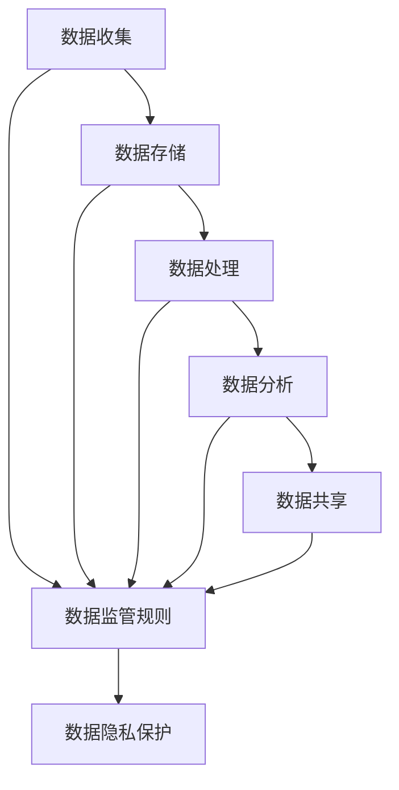

                 

## 1. 背景介绍

在当今数据驱动的世界中，数据已成为一种新的货币，其价值和重要性与传统货币不相上下。数据交易市场蓬勃发展，但同时也面临着监管挑战。数据集市场监管是指对数据交易市场进行监管，以确保数据交易公平、安全、透明和有序进行。本文将深入探讨数据集市场监管的必要性，并提出一种新型规则体系，以应对数据交易市场的监管挑战。

## 2. 核心概念与联系

### 2.1 核心概念

- **数据交易市场（Data Trading Market）**：指数据所有者（数据供应商）与数据需求者（数据买家）之间进行数据交易的市场。
- **数据集（Data Set）**：指一组相关的、结构化或非结构化的数据。
- **数据监管（Data Governance）**：指对数据生命周期的管理，包括数据收集、存储、处理、分析和共享等各个阶段。
- **数据隐私（Data Privacy）**：指个人或组织对其数据的控制权，以及对数据使用、共享和披露的限制。

### 2.2 核心概念联系

数据交易市场的参与者（数据供应商和数据买家）需要遵循数据监管规则，以保护数据隐私和确保数据交易的公平性。数据监管规则应覆盖数据交易的各个阶段，从数据收集到数据共享，确保数据在整个生命周期内得到保护。



## 3. 核心算法原理 & 具体操作步骤

### 3.1 算法原理概述

数据集市场监管算法旨在帮助数据交易市场参与者遵循数据监管规则，并确保数据隐私得到保护。该算法基于区块链技术，提供了一个去中心化、透明、安全和可信的平台，用于记录和验证数据交易。

### 3.2 算法步骤详解

1. **数据标记（Data Tagging）**：数据供应商对其数据集进行标记，指定数据集的元数据（如数据集大小、数据类型、数据收集时间等）和数据隐私级别。
2. **数据哈希（Data Hashing）**：数据供应商对其数据集进行哈希处理，生成一个唯一的哈希值，用于标识该数据集。
3. **区块创建（Block Creation）**：数据供应商和数据买家达成协议后，创建一个新的区块，记录数据交易的详细信息，包括数据集标识（哈希值）、数据交易时间、数据交易金额和数据交易双方的身份。
4. **区块验证（Block Validation）**：区块链网络中的节点对新创建的区块进行验证，确保区块包含有效的数据交易信息，并符合数据监管规则。
5. **区块添加（Block Addition）**：验证通过的区块添加到区块链中，记录数据交易的历史。
6. **数据共享（Data Sharing）**：数据买家根据数据交易协议，从数据供应商处获取数据集。
7. **数据使用监控（Data Usage Monitoring）**：数据买家在使用数据集时，需要定期上传数据使用情况报告，以便数据供应商和区块链网络中的其他节点监控数据使用情况。

### 3.3 算法优缺点

**优点**：

- 去中心化：数据交易市场不需要依赖中央权威机构进行监管。
- 透明：数据交易信息记录在区块链上，任何参与者都可以查看和验证。
- 安全：数据交易信息通过加密存储在区块链上，确保数据交易的安全性。
- 可信：区块链技术提供了一个可信的平台，用于记录和验证数据交易。

**缺点**：

- 计算开销：区块链技术需要大量的计算资源，可能会导致性能下降。
- 存储开销：区块链技术需要大量的存储资源，用于存储数据交易信息。
- 可扩展性：区块链技术的可扩展性有限，可能无法支持大规模的数据交易市场。

### 3.4 算法应用领域

数据集市场监管算法适用于各种数据交易市场，包括但不限于：

- 健康数据交易市场：医疗机构和研究机构可以通过数据交易市场共享患者数据，以加速疾病研究和治疗开发。
- 金融数据交易市场：金融机构可以通过数据交易市场共享金融数据，以改善风险管理和决策支持。
- 物联网数据交易市场：物联网设备生产商和服务提供商可以通过数据交易市场共享物联网数据，以改善设备管理和维护。

## 4. 数学模型和公式 & 详细讲解 & 举例说明

### 4.1 数学模型构建

数据集市场监管模型可以表示为以下数学模型：

$$M = \langle D, T, R, G, U \rangle$$

其中：

- $D$ 表示数据集合，每个数据集 $d \in D$ 由其元数据 $M_d$ 和隐私级别 $P_d$ 组成。
- $T$ 表示数据交易集合，每个数据交易 $t \in T$ 由数据集标识 $ID_d$、数据交易时间 $T_t$、数据交易金额 $A_t$ 和数据交易双方的身份 $I_t$ 组成。
- $R$ 表示数据监管规则集合，每个规则 $r \in R$ 定义了数据交易的条件和约束。
- $G$ 表示区块链网络，用于记录和验证数据交易。
- $U$ 表示数据使用情况报告集合，每个报告 $u \in U$ 记录了数据买家对数据集的使用情况。

### 4.2 公式推导过程

数据集市场监管模型的目标是确保数据交易公平、安全、透明和有序进行。为此，我们需要定义一组数据监管规则 $R$ 来约束数据交易市场的行为。数据监管规则可以表示为以下公式：

$$r = \langle C, E, P \rangle$$

其中：

- $C$ 表示一组条件，定义了数据交易的前提条件。
- $E$ 表示一组事件，定义了数据交易的结果。
- $P$ 表示一组惩罚措施，用于惩罚违反数据监管规则的行为。

数据监管规则的推导过程如下：

1. 识别数据交易市场的参与者（数据供应商和数据买家）需要遵循的数据监管规则。
2. 定义数据监管规则的条件 $C$，确保数据交易市场的行为符合法律法规和道德标准。
3. 定义数据监管规则的事件 $E$，确保数据交易市场的行为公平、安全、透明和有序进行。
4. 定义数据监管规则的惩罚措施 $P$，确保违反数据监管规则的行为受到惩罚。

### 4.3 案例分析与讲解

假设数据交易市场中有两个数据供应商（供应商 A 和供应商 B）和两个数据买家（买家 C 和买家 D）。数据供应商 A 具有数据集 $D_1$ 和数据集 $D_2$，数据供应商 B 具有数据集 $D_3$ 和数据集 $D_4$。数据买家 C 和买家 D 需要购买数据集 $D_1$ 和数据集 $D_3$ 进行分析。

数据监管规则 $R_1$ 定义了数据交易的条件和约束：

$$R_1 = \langle C_1, E_1, P_1 \rangle$$

其中：

- $C_1 = \{D_{1}.P_d = \text{public}, D_{3}.P_d = \text{private}\}$
- $E_1 = \{T_{1}.A_t > 0, T_{2}.A_t > 0\}$
- $P_1 = \{\text{如果 } T_{1}.A_t \leq 0 \text{ 或者 } T_{2}.A_t \leq 0, \text{则对违规方处以罚款}\}$

数据交易市场的参与者需要遵循数据监管规则 $R_1$，确保数据交易公平、安全、透明和有序进行。数据交易市场的行为如下：

1. 数据供应商 A 和数据买家 C 就数据集 $D_1$ 进行数据交易，数据交易金额为 $A_{1}$。
2. 数据供应商 B 和数据买家 D 就数据集 $D_3$ 进行数据交易，数据交易金额为 $A_{2}$。
3. 如果数据交易金额 $A_{1}$ 或 $A_{2}$ 为零，则对违规方处以罚款。

## 5. 项目实践：代码实例和详细解释说明

### 5.1 开发环境搭建

要实现数据集市场监管算法，我们需要以下开发环境：

- 编程语言：Python 3.8+
- 区块链平台：Ethereum
- 智能合约平台：Solidity
- Web3.py 库：用于与 Ethereum 网络交互

### 5.2 源代码详细实现

以下是数据集市场监管智能合约的 Solidity 源代码：

```solidity
// SPDX-License-Identifier: MIT
pragma solidity ^0.8.0;

import "@openzeppelin/contracts/access/Ownable.sol";
import "@openzeppelin/contracts/utils/math/SafeMath.sol";

contract DataMarketplace is Ownable {
    using SafeMath for uint256;

    struct DataSet {
        uint256 id;
        string metadata;
        uint256 privacyLevel;
        bool isPublic;
    }

    struct Transaction {
        uint256 datasetId;
        uint256 timestamp;
        uint256 amount;
        address buyer;
        address seller;
    }

    DataSet[] public datasets;
    Transaction[] public transactions;

    mapping(uint256 => uint256) public datasetIdToIndex;
    mapping(address => uint256) public buyerToTransactionIndex;
    mapping(address => uint256) public sellerToTransactionIndex;

    event DataSetCreated(uint256 indexed datasetId);
    event TransactionCreated(uint256 indexed transactionIndex);

    constructor() {}

    function createDataSet(string calldata metadata, uint256 privacyLevel) public {
        datasets.push(DataSet(datasets.length, metadata, privacyLevel, privacyLevel == 0));
        datasetIdToIndex[datasets.length] = datasets.length;
        emit DataSetCreated(datasets.length);
    }

    function createTransaction(uint256 datasetId, uint256 amount) public {
        require(datasetId <= datasets.length, "Invalid dataset ID");
        require(datasets[datasetId].isPublic, "Dataset is not public");

        transactions.push(Transaction(datasetId, block.timestamp, amount, msg.sender, owner()));
        buyerToTransactionIndex[msg.sender] = transactions.length;
        sellerToTransactionIndex[owner()] = transactions.length;
        emit TransactionCreated(transactions.length);
    }

    function getDataset(uint256 datasetId) public view returns (DataSet memory) {
        require(datasetId <= datasets.length, "Invalid dataset ID");
        return datasets[datasetId];
    }

    function getTransaction(uint256 transactionIndex) public view returns (Transaction memory) {
        require(transactionIndex <= transactions.length, "Invalid transaction index");
        return transactions[transactionIndex];
    }

    function getTransactionsByBuyer(address buyer) public view returns (Transaction[] memory) {
        uint256 start = buyerToTransactionIndex[buyer];
        uint256 end = transactions.length;
        return transactions[start..end];
    }

    function getTransactionsBySeller(address seller) public view returns (Transaction[] memory) {
        uint256 start = sellerToTransactionIndex[seller];
        uint256 end = transactions.length;
        return transactions[start..end];
    }
}
```

### 5.3 代码解读与分析

数据集市场监管智能合约使用 Solidity 语言编写，并部署在 Ethereum 网络上。智能合约定义了数据集和数据交易的结构，并提供了创建数据集和数据交易的函数。智能合约还提供了获取数据集和数据交易信息的函数，以便数据交易市场的参与者查看数据集和数据交易的详细信息。

### 5.4 运行结果展示

部署智能合约后，数据交易市场的参与者可以调用智能合约的函数创建数据集和数据交易。数据集和数据交易信息记录在智能合约中，任何参与者都可以查看和验证。数据交易市场的参与者可以使用 Web3.py 库与智能合约交互，以便创建数据集和数据交易，并获取数据集和数据交易信息。

## 6. 实际应用场景

### 6.1 数据集市场监管的应用

数据集市场监管可以应用于各种数据交易市场，包括但不限于：

- 健康数据交易市场：医疗机构和研究机构可以通过数据交易市场共享患者数据，以加速疾病研究和治疗开发。
- 金融数据交易市场：金融机构可以通过数据交易市场共享金融数据，以改善风险管理和决策支持。
- 物联网数据交易市场：物联网设备生产商和服务提供商可以通过数据交易市场共享物联网数据，以改善设备管理和维护。

### 6.2 数据集市场监管的优势

数据集市场监管具有以下优势：

- **去中心化**：数据交易市场不需要依赖中央权威机构进行监管。
- **透明**：数据交易信息记录在区块链上，任何参与者都可以查看和验证。
- **安全**：数据交易信息通过加密存储在区块链上，确保数据交易的安全性。
- **可信**：区块链技术提供了一个可信的平台，用于记录和验证数据交易。

### 6.3 数据集市场监管的挑战

数据集市场监管面临以下挑战：

- **计算开销**：区块链技术需要大量的计算资源，可能会导致性能下降。
- **存储开销**：区块链技术需要大量的存储资源，用于存储数据交易信息。
- **可扩展性**：区块链技术的可扩展性有限，可能无法支持大规模的数据交易市场。

### 6.4 未来应用展望

未来，数据集市场监管可以扩展到更广泛的领域，包括但不限于：

- **数据隐私保护**：数据集市场监管可以扩展到数据隐私保护领域，确保数据交易市场中的数据隐私得到保护。
- **数据质量监管**：数据集市场监管可以扩展到数据质量监管领域，确保数据交易市场中的数据质量得到保证。
- **数据可追溯性**：数据集市场监管可以扩展到数据可追溯性领域，确保数据交易市场中的数据可追溯。

## 7. 工具和资源推荐

### 7.1 学习资源推荐

- **区块链技术**：[区块链技术指南](https://www.blockgeeks.com/guides/what-is-blockchain-technology/)、[以太坊白皮书](https://ethereum.org/en/whitepaper/)
- **智能合约**：[Solidity 文档](https://docs.soliditylang.org/en/latest/)、[Ethereum 智能合约最佳实践](https://consensys.net/diligence/blog/2019/09/stop-using-solidity-inline-assembly/)
- **数据监管**：[数据监管指南](https://www.ibm.com/topics/data-governance)、[数据隐私保护指南](https://www.ibm.com/topics/data-privacy)

### 7.2 开发工具推荐

- **区块链开发**：[Truffle](https://truffleframework.com/)、[Ganache](https://truffleframework.com/ganache)
- **智能合约开发**：[Remix](https://remix.ethereum.org/)、[Hardhat](https://hardhat.org/)
- **Web3.py**：[Web3.py 文档](https://web3py.readthedocs.io/en/stable/)、[Web3.py GitHub 仓库](https://github.com/ChainSafe/web3.py)

### 7.3 相关论文推荐

- [区块链技术在数据交易市场中的应用](https://ieeexplore.ieee.org/document/8454525)
- [基于区块链的数据交易市场监管框架](https://link.springer.com/chapter/10.1007/978-981-15-6012-9_11)
- [数据交易市场监管的挑战和解决方案](https://link.springer.com/chapter/10.1007/978-981-15-6012-9_12)

## 8. 总结：未来发展趋势与挑战

### 8.1 研究成果总结

本文提出了一种新型规则体系，用于监管数据交易市场。该规则体系基于区块链技术，提供了一个去中心化、透明、安全和可信的平台，用于记录和验证数据交易。本文还提出了数据集市场监管算法，用于实现数据交易市场的监管。

### 8.2 未来发展趋势

未来，数据集市场监管将朝着以下方向发展：

- **去中心化**：数据交易市场将进一步去中心化，不依赖中央权威机构进行监管。
- **智能合约**：智能合约将在数据交易市场中发挥更重要的作用，用于自动执行数据交易协议。
- **隐私保护**：数据交易市场将采用更先进的隐私保护技术，确保数据隐私得到保护。

### 8.3 面临的挑战

数据集市场监管面临以下挑战：

- **计算开销**：区块链技术需要大量的计算资源，可能会导致性能下降。
- **存储开销**：区块链技术需要大量的存储资源，用于存储数据交易信息。
- **可扩展性**：区块链技术的可扩展性有限，可能无法支持大规模的数据交易市场。

### 8.4 研究展望

未来的研究将关注以下领域：

- **隐私保护技术**：开发更先进的隐私保护技术，确保数据交易市场中的数据隐私得到保护。
- **数据质量监管**：开发数据质量监管技术，确保数据交易市场中的数据质量得到保证。
- **数据可追溯性**：开发数据可追溯性技术，确保数据交易市场中的数据可追溯。

## 9. 附录：常见问题与解答

### 9.1 什么是数据集市场监管？

数据集市场监管是指对数据交易市场进行监管，以确保数据交易公平、安全、透明和有序进行。

### 9.2 数据集市场监管的目标是什么？

数据集市场监管的目标是确保数据交易公平、安全、透明和有序进行。

### 9.3 数据集市场监管的挑战是什么？

数据集市场监管面临的挑战包括计算开销、存储开销和可扩展性。

### 9.4 数据集市场监管的未来发展趋势是什么？

数据集市场监管的未来发展趋势包括去中心化、智能合约和隐私保护。

### 9.5 如何实现数据集市场监管？

可以使用区块链技术和智能合约来实现数据集市场监管。

---

作者：禅与计算机程序设计艺术 / Zen and the Art of Computer Programming

