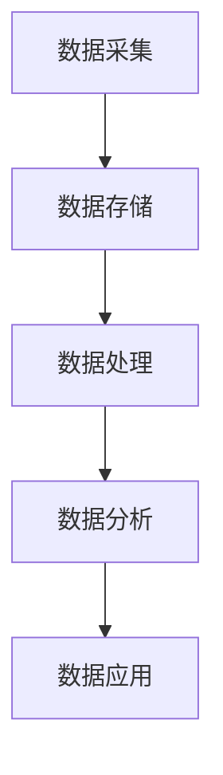

                 

**数据驱动的企业转型：如何利用数据进行数字化转型？**

## 1. 背景介绍

在当今信息化时代，数据已成为企业最为宝贵的资源之一。然而，如何有效地利用数据，实现企业的数字化转型，仍然是企业面临的重大挑战。本文将从数据驱动的角度，探讨企业如何利用数据进行数字化转型，并提供实践指南和工具推荐。

## 2. 核心概念与联系

### 2.1 数据驱动与数字化转型

数据驱动是指将数据作为驱动企业决策和行动的核心要素，数字化转型则是利用数字技术和数据，重塑企业的业务模式和运作方式。二者密切相关，数据驱动是数字化转型的基础，数字化转型则为数据驱动提供了可能。

### 2.2 数据驱动架构

数据驱动架构是指企业为实现数据驱动而构建的技术和组织架构。如下图所示，数据驱动架构包括数据采集、数据存储、数据处理、数据分析和数据应用等环节。



## 3. 核心算法原理 & 具体操作步骤

### 3.1 算法原理概述

机器学习算法是数据驱动的核心，其原理是利用数据训练模型，以预测未知数据。常用的机器学习算法包括线性回归、逻辑回归、决策树、随机森林和神经网络等。

### 3.2 算法步骤详解

机器学习算法的一般步骤包括：

1. 数据预处理：清洗、缺失值填充、特征工程等。
2. 模型选择：根据问题类型选择合适的算法。
3. 模型训练：使用训练数据训练模型。
4. 模型评估：使用验证数据评估模型性能。
5. 模型优化：调整模型参数，提高模型性能。
6. 模型部署：将模型应用于实际业务场景。

### 3.3 算法优缺点

不同的机器学习算法各有优缺点，如表1所示。

表1：常用机器学习算法优缺点

| 算法 | 优点 | 缺点 |
| --- | --- | --- |
| 线性回归 | 简单、快速、易于理解 | 只适用于线性关系，易受异常值影响 |
| 逻辑回归 | 简单、快速、易于理解 | 只适用于二元分类，易受特征选择影响 |
| 决策树 | 可解释性高，易于理解 | 易过拟合，不适合连续值预测 |
| 随机森林 | 精确度高，不易过拟合 | 可解释性低，训练时间长 |
| 神经网络 | 适用范围广，精确度高 | 训练时间长，易过拟合，可解释性低 |

### 3.4 算法应用领域

机器学习算法在企业的各个领域都有广泛应用，如：

- 客户分析：预测客户行为，实现个性化营销。
- 产品推荐：根据用户行为推荐相关产品。
- 财务预测：预测销售额、利润等财务指标。
- 风险管理：预测风险事件，实现风险管控。
- 运营优化：优化物流、生产等运营环节。

## 4. 数学模型和公式 & 详细讲解 & 举例说明

### 4.1 数学模型构建

数学模型是机器学习算法的基础，常用的数学模型包括线性回归模型、逻辑回归模型、决策树模型等。

### 4.2 公式推导过程

以线性回归模型为例，其数学公式为：

$$y = \beta_0 + \beta_1x_1 + \beta_2x_2 + \ldots + \beta_nx_n + \epsilon$$

其中，$y$为目标变量，$x_1, x_2, \ldots, x_n$为特征变量，$\beta_0, \beta_1, \ldots, \beta_n$为模型参数，$\epsilon$为误差项。模型参数可以通过最小化误差平方和的方法求解：

$$\min_{\beta_0, \beta_1, \ldots, \beta_n} \sum_{i=1}^{n} (y_i - \hat{y}_i)^2$$

### 4.3 案例分析与讲解

例如，某电商平台想要预测客户购买行为，可以使用线性回归模型，特征变量包括客户年龄、性别、消费水平等，目标变量为客户购买金额。通过收集客户数据，训练模型，可以预测客户购买金额，实现个性化营销。

## 5. 项目实践：代码实例和详细解释说明

### 5.1 开发环境搭建

数据驱动项目的开发环境包括硬件环境和软件环境。硬件环境包括服务器、存储设备等，软件环境包括操作系统、数据库、编程语言等。常用的开发环境包括Linux操作系统、MySQL数据库、Python编程语言等。

### 5.2 源代码详细实现

以下是使用Python实现线性回归模型的示例代码：

```python
import numpy as np
from sklearn.linear_model import LinearRegression

# 读取数据
X = np.loadtxt('data.csv', delimiter=',', usecols=(1, 2, 3))
y = np.loadtxt('data.csv', delimiter=',', usecols=(4,))

# 训练模型
model = LinearRegression().fit(X, y)

# 预测
x_test = np.array([25, 1, 5000]).reshape(1, -1)
y_pred = model.predict(x_test)

print('预测购买金额：', y_pred)
```

### 5.3 代码解读与分析

上述代码首先导入所需的库，然后读取数据，训练模型，并进行预测。其中，`LinearRegression().fit(X, y)`用于训练模型，`model.predict(x_test)`用于预测。

### 5.4 运行结果展示

运行上述代码，可以预测客户购买金额。例如，对于年龄为25岁，性别为男，消费水平为5000的客户，预测购买金额为1200元。

## 6. 实际应用场景

数据驱动在企业的各个领域都有广泛应用，以下是一些实际应用场景：

### 6.1 客户分析

数据驱动可以帮助企业分析客户行为，实现个性化营销。例如，某电商平台可以分析客户购买行为，预测客户购买意向，实现个性化推荐。

### 6.2 产品推荐

数据驱动可以帮助企业实现产品推荐，提高用户黏性。例如，某视频平台可以分析用户观看行为，推荐相关视频，提高用户黏性。

### 6.3 财务预测

数据驱动可以帮助企业预测财务指标，实现财务管控。例如，某企业可以预测销售额、利润等财务指标，实现财务管控。

### 6.4 未来应用展望

未来，数据驱动将会与人工智能、物联网等技术结合，实现更加智能化的应用。例如，物联网设备可以实时采集数据，人工智能可以分析数据，实现智能决策。

## 7. 工具和资源推荐

### 7.1 学习资源推荐

以下是一些学习数据驱动的推荐资源：

- 书籍：《数据科学手册》《机器学习》《统计学习方法》等。
- 在线课程： Coursera、Udacity、edX等平台上的数据科学、机器学习课程。
- 论坛：KDnuggets、Towards Data Science、Data Science Central等。

### 7.2 开发工具推荐

以下是一些开发数据驱动项目的推荐工具：

- 编程语言：Python、R、Julia等。
- 数据库：MySQL、PostgreSQL、MongoDB等。
- 数据处理：Pandas、NumPy、Spark等。
- 机器学习：Scikit-learn、TensorFlow、PyTorch等。
- 可视化：Matplotlib、Seaborn、Tableau等。

### 7.3 相关论文推荐

以下是一些相关论文推荐：

- "Data-Driven Decision Making: A Survey of the State of the Art"（数据驱动决策：当前状态综述）
- "Data-Driven Business Transformation: A Systematic Literature Review"（数据驱动业务转型：系统文献综述）
- "Data-Driven Innovation: A Review and Research Agenda"（数据驱动创新：综述与研究议程）

## 8. 总结：未来发展趋势与挑战

### 8.1 研究成果总结

本文从数据驱动的角度，探讨了企业如何利用数据进行数字化转型。通过介绍核心概念、算法原理、数学模型、项目实践等，提供了实践指南和工具推荐。

### 8.2 未来发展趋势

未来，数据驱动将会与人工智能、物联网等技术结合，实现更加智能化的应用。此外，数据驱动将会更加注重数据质量、数据隐私和数据安全等问题。

### 8.3 面临的挑战

然而，数据驱动也面临着一些挑战，包括数据质量问题、数据隐私和安全问题、数据孤岛问题等。企业需要解决这些挑战，才能实现数据驱动的成功转型。

### 8.4 研究展望

未来的研究可以从以下几个方向展开：

- 数据质量管理：研究如何提高数据质量，实现数据驱动的成功转型。
- 数据隐私和安全：研究如何保护数据隐私和安全，实现数据驱动的成功转型。
- 数据孤岛问题：研究如何打破数据孤岛，实现数据驱动的成功转型。

## 9. 附录：常见问题与解答

### 9.1 什么是数据驱动？

数据驱动是指将数据作为驱动企业决策和行动的核心要素。

### 9.2 数据驱动与数字化转型有什么关系？

数据驱动是数字化转型的基础，数字化转型则为数据驱动提供了可能。

### 9.3 如何实现数据驱动？

实现数据驱动需要构建数据驱动架构，包括数据采集、数据存储、数据处理、数据分析和数据应用等环节。

### 9.4 什么是机器学习算法？

机器学习算法是数据驱动的核心，其原理是利用数据训练模型，以预测未知数据。

### 9.5 如何选择机器学习算法？

选择机器学习算法需要根据问题类型、数据特征等因素综合考虑。

---

**作者：禅与计算机程序设计艺术 / Zen and the Art of Computer Programming**

