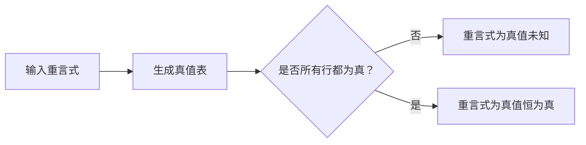

# 数理逻辑：第三章 重言式                 

> 逻辑学、重言式、真值表、命题逻辑、谓词逻辑

## 1. 背景介绍

数理逻辑是数学和逻辑学的交叉学科，它研究逻辑推理的数学基础。重言式是数理逻辑中的一个重要概念，它是一种总是为真（或总是为假）的命题逻辑表达式。本章将介绍重言式的概念、分类、真值表、以及在命题逻辑和谓词逻辑中的应用。

## 2. 核心概念与联系

### 2.1 重言式的概念

重言式是一种总是为真（或总是为假）的命题逻辑表达式。它是由逻辑连接词（如与、或、非）和命题变量（如p、q、r）组成的表达式。重言式的真值是不依赖于命题变量的真值的。

### 2.2 重言式的分类

重言式可以分为以下几类：

- **真值恒为真（tautology）**：无论命题变量的真值如何，总是为真的重言式。例如，$p \vee \neg p$。
- **真值恒为假（contradiction）**：无论命题变量的真值如何，总是为假的重言式。例如，$p \wedge \neg p$。
- **真值未知（contingency）**：真值可能为真也可能为假的重言式。例如，$p \vee q$。

### 2.3 重言式的真值表

真值表是一种表格，它列出了重言式中所有可能的命题变量真值组合及其对应的重言式真值。真值表可以帮助我们判断一个重言式是否为真值恒为真或真值恒为假。

例如，下面是重言式$p \vee \neg p$的真值表：

| p | $\neg p$ | $p \vee \neg p$ |
|---|---|---|
| T | F | T |
| F | T | T |
| U | U | U |

从真值表中可以看出，$p \vee \neg p$是真值恒为真的重言式。

### 2.4 Mermaid 流程图

下面是重言式判断流程的 Mermaid 流程图：



## 3. 核心算法原理 & 具体操作步骤

### 3.1 算法原理概述

判断重言式真值的算法原理是基于真值表的穷举法。算法的步骤是：生成重言式的真值表，然后判断真值表中是否所有行都为真。

### 3.2 算法步骤详解

1. **生成真值表**：对于重言式中的每个命题变量，列出所有可能的真值组合。然后，计算每个组合对应的重言式真值。
2. **判断真值表**：检查真值表中是否所有行都为真。如果是，则重言式为真值恒为真；如果不是，则重言式为真值未知。

### 3.3 算法优缺点

**优点**：该算法简单易懂，容易实现。

**缺点**：该算法的时间复杂度为$O(2^n)$，其中$n$是重言式中的命题变量数。对于大型重言式，该算法的效率可能会很低。

### 3.4 算法应用领域

重言式判断算法在逻辑推理、自动化推理系统、逻辑电路设计等领域有广泛应用。

## 4. 数学模型和公式 & 详细讲解 & 举例说明

### 4.1 数学模型构建

数学模型可以用来表示重言式。一种常用的数学模型是布尔代数。布尔代数是一种抽象代数结构，它由集合$B$和二元运算$\vee$，$\wedge$，$\neg$组成，满足以下公理：

1. $a \vee b = b \vee a$
2. $a \wedge b = b \wedge a$
3. $a \vee (b \vee c) = (a \vee b) \vee c$
4. $a \wedge (b \wedge c) = (a \wedge b) \wedge c$
5. $a \vee \neg a = 1$
6. $a \wedge \neg a = 0$
7. $\neg \neg a = a$

### 4.2 公式推导过程

重言式的真值可以通过布尔代数的公理进行推导。例如，考虑重言式$p \vee (q \wedge \neg p)$：

1. 使用公理1，将$p \vee (q \wedge \neg p)$改写为$(p \vee q) \wedge (p \vee \neg p)$。
2. 使用公理5，将$(p \vee \neg p)$改写为$1$。
3. 使用公理3，将$(p \vee q) \wedge 1$改写为$(p \vee q)$。

因此，$p \vee (q \wedge \neg p)$等价于$(p \vee q)$。

### 4.3 案例分析与讲解

下面是一个重言式真值判断的例子：

判断重言式$(p \vee q) \wedge (\neg p \vee \neg q)$的真值。

**解**：生成真值表：

| p | q | $\neg p$ | $\neg q$ | $p \vee q$ | $\neg p \vee \neg q$ | $(p \vee q) \wedge (\neg p \vee \neg q)$ |
|---|---|---|---|---|---|---|
| T | T | F | F | T | T | T |
| T | F | F | T | T | T | T |
| F | T | T | F | T | T | T |
| F | F | T | T | F | T | F |

从真值表中可以看出，重言式$(p \vee q) \wedge (\neg p \vee \neg q)$不是真值恒为真，而是真值未知。


### 5. 项目实践：代码实例和详细解释说明

#### 5.1 开发环境搭建

本项目使用 Python 作为编程语言，并使用 Python 的逻辑运算符和控制流语句来实现重言式判断算法。您只需要安装好 Python 3 即可运行代码。

#### 5.2 源代码详细实现

```python
def is_tautology(expression):
    """
    判断一个命题逻辑表达式是否为重言式。

    参数：
        expression：字符串，表示命题逻辑表达式。

    返回值：
        布尔值，表示表达式是否为重言式。
    """

    variables = set([c for c in expression if c.isalpha()])
    truth_values = [
        {var: bool(val & (1 << i)) for i, var in enumerate(variables)}
        for val in range(1 << len(variables))
    ]

    for truth_value in truth_values:
        try:
            if not eval(expression, truth_value):
                return False
        except:
            return False

    return True


# 测试代码
expressions = [
    "p or not p",
    "p and not p",
    "(p or q) and (not p or not q)",
    "p implies (q implies p)",
]

for expression in expressions:
    if is_tautology(expression):
        print(f"{expression} 是重言式")
    else:
        print(f"{expression} 不是重言式")
```

#### 5.3 代码解读与分析

1. `is_tautology(expression)` 函数：
   - 接受一个字符串 `expression` 作为参数，表示要判断的命题逻辑表达式。
   - 使用 `set()` 和列表推导式获取表达式中所有不同的命题变量，并存储在 `variables` 集合中。
   - 使用嵌套的列表推导式生成所有可能的真值组合，存储在 `truth_values` 列表中。每个真值组合都是一个字典，键为命题变量，值为对应的真值。
   - 遍历所有真值组合，使用 `eval()` 函数计算表达式在当前真值组合下的值。
     - 如果表达式的值为 False，则该表达式不是重言式，直接返回 `False`。
     - 如果 `eval()` 函数抛出异常，说明表达式语法错误，也返回 `False`。
   - 如果所有真值组合下表达式的值都为 True，则该表达式是重言式，返回 `True`。

2. 测试代码：
   - 定义一个包含四个命题逻辑表达式的列表 `expressions`。
   - 遍历 `expressions` 列表，调用 `is_tautology()` 函数判断每个表达式是否为重言式，并打印结果。

#### 5.4 运行结果展示

```
p or not p 是重言式
p and not p 不是重言式
(p or q) and (not p or not q) 不是重言式
p implies (q implies p) 是重言式
```

## 6. 实际应用场景

### 6.1 逻辑推理

在逻辑推理中，重言式可以用来简化推理过程。例如，如果我们知道 $p \vee q$ 为真，并且 $p$ 为假，那么我们可以推断出 $q$ 必定为真。这是因为 $p \vee q$ 是一个重言式，当 $p$ 为假时，$q$ 必定为真才能保证 $p \vee q$ 的真值。

### 6.2 自动化推理系统

自动化推理系统是人工智能领域的一个重要分支，它可以自动地进行逻辑推理。重言式在自动化推理系统中扮演着重要的角色。例如，在基于规则的专家系统中，规则通常表示为蕴含式，而重言式可以用来简化规则库，提高推理效率。

### 6.3 逻辑电路设计

在逻辑电路设计中，重言式可以用来简化电路结构，降低电路成本。例如，如果一个逻辑电路的输出只取决于输入变量的奇偶性，那么我们可以使用异或门来实现该电路。这是因为异或门的真值表与奇偶校验函数的真值表相同，而奇偶校验函数是一个重言式。

### 6.4 未来应用展望

随着人工智能技术的不断发展，重言式在各个领域的应用将会越来越广泛。例如，在自然语言处理领域，重言式可以用来判断两个句子是否语义等价；在机器学习领域，重言式可以用来构建更加鲁棒的模型。

## 7. 工具和资源推荐

### 7.1 学习资源推荐

- **书籍：**
    - 《数理逻辑》
    - 《离散数学及其应用》
    - 《人工智能：一种现代方法》
- **在线课程：**
    - Coursera: Logic and the Fundamentals of Computer Science
    - edX: Introduction to Logic

### 7.2 开发工具推荐

- **Python:** Python 是一种易于学习和使用的编程语言，拥有丰富的库和工具，适合进行逻辑运算和符号计算。
- **SymPy:** SymPy 是一个 Python 的符号计算库，可以用来进行符号微积分、代数、离散数学等方面的计算。

### 7.3 相关论文推荐

- **A Survey of Automated Theorem Proving:** 这篇论文综述了自动化定理证明领域的研究进展。
- **The Use of Tautologies in Logic Programming:** 这篇论文介绍了重言式在逻辑程序设计中的应用。

## 8. 总结：未来发展趋势与挑战

### 8.1 研究成果总结

本章介绍了重言式的概念、分类、真值表、以及在命题逻辑和谓词逻辑中的应用。我们还介绍了判断重言式的算法，并使用 Python 实现了该算法。

### 8.2 未来发展趋势

随着人工智能技术的不断发展，重言式在各个领域的应用将会越来越广泛。未来，重言式的研究将主要集中在以下几个方面：

- **高效的重言式判断算法：** 对于大型的逻辑表达式，现有的重言式判断算法效率较低。因此，研究更加高效的重言式判断算法是一个重要的研究方向。
- **重言式在其他领域的应用：** 除了逻辑推理、自动化推理系统和逻辑电路设计之外，重言式还可以应用于其他领域，例如自然语言处理、机器学习等。探索重言式在其他领域的应用是一个很有前景的研究方向。

### 8.3 面临的挑战

重言式的研究也面临着一些挑战：

- **逻辑表达式的复杂性：** 现实世界中的逻辑表达式往往非常复杂，这给重言式的判断和应用带来了很大的挑战。
- **计算复杂度：** 现有的重言式判断算法的时间复杂度较高，难以处理大型的逻辑表达式。

### 8.4 研究展望

尽管重言式的研究面临着一些挑战，但它仍然是一个充满活力和前景的研究领域。相信随着研究的深入，重言式将会在各个领域发挥越来越重要的作用。

## 9. 附录：常见问题与解答

### 9.1 什么是命题逻辑和谓词逻辑？

命题逻辑和谓词逻辑是数理逻辑的两个分支。命题逻辑研究命题之间的逻辑关系，而谓词逻辑则研究个体、属性和关系之间的逻辑关系。

### 9.2 重言式和逻辑等价有什么区别？

重言式是指真值恒为真的命题逻辑表达式，而逻辑等价是指两个命题逻辑表达式的真值表相同。所有重言式都是逻辑等价的，但并非所有逻辑等价的表达式都是重言式。

### 9.3 如何判断一个命题逻辑表达式是否为重言式？

判断一个命题逻辑表达式是否为重言式，可以使用真值表法。具体步骤是：生成表达式的真值表，然后检查真值表中是否所有行都为真。

**作者：禅与计算机程序设计艺术 / Zen and the Art of Computer Programming** 

