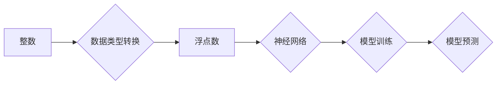

> 整数，浮点数，神经网络，数据类型，数值表示，精度，范围，计算

## 1. 背景介绍

神经网络作为机器学习领域的核心技术，在图像识别、自然语言处理、语音识别等领域取得了突破性的进展。然而，神经网络的训练和运行离不开数据的支撑。数据类型是神经网络的基础，其中整数和浮点数扮演着至关重要的角色。

本文将深入探讨整数和浮点数在神经网络中的应用，分析其原理、算法、数学模型以及实际应用场景。通过对数据类型的理解，我们可以更好地掌握神经网络的运作机制，并为模型的训练和优化提供更深入的见解。

## 2. 核心概念与联系

**2.1 整数和浮点数**

* **整数:** 整数是指没有小数部分的数字，例如：-5, 0, 10, 100。
* **浮点数:** 浮点数是指包含小数部分的数字，例如：3.14, -2.5, 0.01。

**2.2 神经网络中的数据类型**

在神经网络中，数据通常以数字的形式表示。整数和浮点数是两种常见的数字类型，它们分别用于表示离散值和连续值。

* **整数:** 用于表示离散的类别标签、特征编码等。例如，在图像分类任务中，每个图像可能被标记为不同的类别，可以使用整数来表示这些类别。
* **浮点数:** 用于表示连续的数值特征，例如图像像素值、文本词嵌入等。

**2.3 数据类型之间的转换**

在实际应用中，整数和浮点数之间可能需要进行转换。例如，将整数转换为浮点数可以提高模型的精度，而将浮点数转换为整数可以减少模型的计算量。

**2.4 数据类型选择的影响**

选择合适的数字类型对于神经网络的性能和效率至关重要。

* **精度:** 浮点数可以表示更精确的数值，但同时也增加了模型的内存占用和计算量。
* **范围:** 整数的范围通常比浮点数小，但对于某些任务来说，整数的范围可能足够。
* **计算效率:** 整数运算通常比浮点数运算更快，因此在某些情况下，使用整数可以提高模型的训练速度。

**2.5 Mermaid 流程图**



## 3. 核心算法原理 & 具体操作步骤

### 3.1 算法原理概述

神经网络的训练过程本质上是通过调整网络参数来最小化模型预测误差的过程。

* **前向传播:** 将输入数据通过神经网络传递，得到最终的预测结果。
* **反向传播:** 计算预测结果与真实值的误差，并根据误差反向调整网络参数。

整数和浮点数在神经网络的训练过程中扮演着不同的角色。

* **浮点数:** 用于表示网络参数、激活函数输出等连续值。
* **整数:** 用于表示离散的类别标签、特征编码等。

### 3.2 算法步骤详解

1. **数据预处理:** 将原始数据转换为适合神经网络输入的格式，例如将文本数据转换为词嵌入向量。
2. **网络结构设计:** 根据任务需求设计神经网络的结构，包括层数、节点数、激活函数等。
3. **参数初始化:** 为网络参数赋予初始值，通常使用随机初始化。
4. **前向传播:** 将输入数据通过神经网络传递，得到最终的预测结果。
5. **损失函数计算:** 计算预测结果与真实值的误差，使用损失函数来量化误差。
6. **反向传播:** 根据误差反向传播，更新网络参数。
7. **迭代训练:** 重复步骤4-6，直到模型性能达到预期的水平。

### 3.3 算法优缺点

**优点:**

* **高精度:** 浮点数可以表示更精确的数值，从而提高模型的预测精度。
* **灵活度高:** 神经网络可以处理各种类型的输入数据，包括连续值和离散值。

**缺点:**

* **计算量大:** 浮点数运算比整数运算复杂，因此训练神经网络需要消耗大量的计算资源。
* **内存占用大:** 浮点数需要更多的内存空间来存储，这可能会导致内存不足的问题。

### 3.4 算法应用领域

* **图像识别:** 使用卷积神经网络识别图像中的物体、场景等。
* **自然语言处理:** 使用循环神经网络处理文本数据，例如机器翻译、文本摘要等。
* **语音识别:** 使用循环神经网络识别语音信号，将语音转换为文本。

## 4. 数学模型和公式 & 详细讲解 & 举例说明

### 4.1 数学模型构建

神经网络的数学模型基于线性变换和非线性激活函数。

* **线性变换:** 将输入数据通过矩阵乘法和向量加法进行线性变换。
* **非线性激活函数:** 将线性变换的结果通过非线性函数进行变换，引入非线性特征。

### 4.2 公式推导过程

**4.2.1 线性变换:**

假设输入数据为向量 $x = (x_1, x_2, ..., x_n)$, 权重矩阵为 $W = (w_{ij})$, 偏置向量为 $b = (b_1, b_2, ..., b_m)$, 则线性变换结果为:

$$z = Wx + b$$

其中 $z = (z_1, z_2, ..., z_m)$ 为线性变换后的输出向量。

**4.2.2 非线性激活函数:**

常用的激活函数包括 sigmoid 函数、ReLU 函数、tanh 函数等。

* **sigmoid 函数:**

$$f(z) = \frac{1}{1 + e^{-z}}$$

* **ReLU 函数:**

$$f(z) = max(0, z)$$

* **tanh 函数:**

$$f(z) = \frac{e^z - e^{-z}}{e^z + e^{-z}}$$

### 4.3 案例分析与讲解

**4.3.1 Sigmoid 函数应用:**

在二分类问题中，可以使用 sigmoid 函数作为激活函数，将线性变换后的输出映射到 0 到 1 之间，表示样本属于正类的概率。

**4.3.2 ReLU 函数应用:**

在图像识别任务中，ReLU 函数常用于隐藏层，因为它能够有效地解决梯度消失问题。

## 5. 项目实践：代码实例和详细解释说明

### 5.1 开发环境搭建

* **操作系统:** Linux, macOS, Windows
* **编程语言:** Python
* **深度学习框架:** TensorFlow, PyTorch

### 5.2 源代码详细实现

```python
import tensorflow as tf

# 定义神经网络模型
model = tf.keras.models.Sequential([
    tf.keras.layers.Dense(128, activation='relu', input_shape=(784,)),
    tf.keras.layers.Dense(10, activation='softmax')
])

# 编译模型
model.compile(optimizer='adam',
              loss='sparse_categorical_crossentropy',
              metrics=['accuracy'])

# 训练模型
model.fit(x_train, y_train, epochs=10)

# 评估模型
loss, accuracy = model.evaluate(x_test, y_test)
print('Test loss:', loss)
print('Test accuracy:', accuracy)
```

### 5.3 代码解读与分析

* **模型定义:** 使用 `tf.keras.models.Sequential` 创建一个顺序模型，包含两层全连接层。
* **激活函数:** 使用 `relu` 作为隐藏层的激活函数，使用 `softmax` 作为输出层的激活函数。
* **编译模型:** 使用 `adam` 优化器、`sparse_categorical_crossentropy` 损失函数和 `accuracy` 评估指标编译模型。
* **训练模型:** 使用 `model.fit` 方法训练模型，输入训练数据 `x_train` 和标签 `y_train`，训练 10 个 epochs。
* **评估模型:** 使用 `model.evaluate` 方法评估模型，输入测试数据 `x_test` 和标签 `y_test`，输出测试损失和准确率。

### 5.4 运行结果展示

训练完成后，可以查看模型的测试损失和准确率。

## 6. 实际应用场景

### 6.1 图像分类

使用卷积神经网络对图像进行分类，例如识别猫、狗、汽车等物体。

### 6.2 自然语言处理

使用循环神经网络处理文本数据，例如机器翻译、文本摘要、情感分析等。

### 6.3 语音识别

使用循环神经网络识别语音信号，将语音转换为文本。

### 6.4 未来应用展望

* **自动驾驶:** 使用神经网络进行图像识别、路径规划等，实现自动驾驶汽车。
* **医疗诊断:** 使用神经网络分析医学图像、患者数据，辅助医生进行诊断。
* **个性化推荐:** 使用神经网络分析用户行为数据，提供个性化的商品推荐。

## 7. 工具和资源推荐

### 7.1 学习资源推荐

* **书籍:**
    * 深度学习
    * 神经网络与深度学习
* **在线课程:**
    * Coursera 深度学习课程
    * Udacity 深度学习工程师 Nanodegree

### 7.2 开发工具推荐

* **深度学习框架:** TensorFlow, PyTorch
* **编程语言:** Python
* **数据可视化工具:** Matplotlib, Seaborn

### 7.3 相关论文推荐

* **AlexNet:** ImageNet Classification with Deep Convolutional Neural Networks
* **VGGNet:** Very Deep Convolutional Networks for Large-Scale Image Recognition
* **ResNet:** Deep Residual Learning for Image Recognition

## 8. 总结：未来发展趋势与挑战

### 8.1 研究成果总结

近年来，神经网络在图像识别、自然语言处理等领域取得了突破性的进展，这得益于算法的不断改进、硬件性能的提升以及海量数据的积累。

### 8.2 未来发展趋势

* **模型更深更广:** 研究更深层次、更广阔结构的神经网络，提高模型的表达能力和泛化能力。
* **高效训练:** 研究更有效的训练算法，降低模型训练的成本和时间。
* **可解释性:** 研究更可解释的神经网络模型，提高模型的透明度和可信度。

### 8.3 面临的挑战

* **数据获取和标注:** 训练高性能的神经网络需要大量的标注数据，数据获取和标注成本较高。
* **模型复杂度:** 神经网络模型越来越复杂，训练和部署成本也越来越高。
* **伦理问题:** 神经网络的应用可能带来一些伦理问题，例如数据隐私、算法偏见等。

### 8.4 研究展望

未来，神经网络研究将继续朝着更深、更广、更有效、更可解释的方向发展，并应用于更多领域，为人类社会带来更多福祉。

## 9. 附录：常见问题与解答

**9.1 为什么使用浮点数而不是整数？**

浮点数可以表示更精确的数值，这对于许多机器学习任务来说至关重要。例如，在图像识别任务中，像素值通常是浮点数，因为它们需要表示微妙的色彩变化。

**9.2 如何选择合适的数字类型？**

选择合适的数字类型取决于具体的应用场景。对于需要高精度的任务，可以使用浮点数；对于需要低内存占用和高计算效率的任务，可以使用整数。

**9.3 如何处理整数和浮点数之间的转换？**

可以使用各种方法来处理整数和浮点数之间的转换，例如：

* **强制类型转换:** 使用 `int()` 或 `float()` 函数强制将数据类型转换为目标类型。
* **四舍五入:** 使用 `round()` 函数将浮点数四舍五入到整数。
* **截断:** 使用 `trunc()` 函数将浮点数截断到整数部分。


作者：禅与计算机程序设计艺术 / Zen and the Art of Computer Programming 
<end_of_turn>