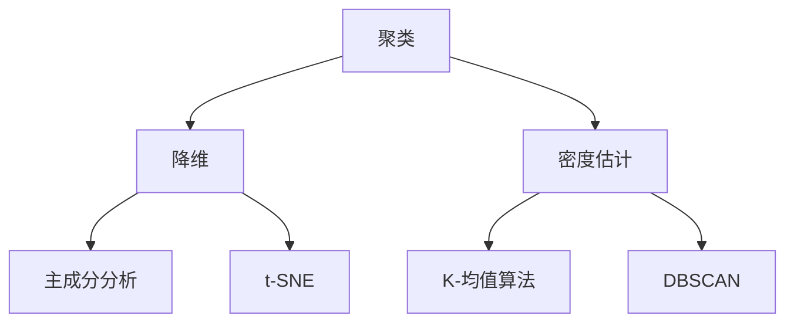

                 

无监督学习（Unsupervised Learning）、聚类（Clustering）、自动编码器（Autoencoder）、主成分分析（Principal Component Analysis）、t-SNE（t-Distributed Stochastic Neighbor Embedding）、K-均值算法（K-Means）、DBSCAN（Density-Based Spatial Clustering of Applications with Noise）、无监督学习算法、无监督学习应用

## 1. 背景介绍

无监督学习是机器学习的一个分支，它不需要预先标记的数据集，而是从未标记的数据中寻找模式和结构。无监督学习在数据挖掘、图像分割、文本聚类等领域有着广泛的应用。本文将介绍无监督学习的原理、核心算法、数学模型，并提供代码实例和实际应用场景。

## 2. 核心概念与联系

无监督学习的核心概念包括聚类、降维和密度估计。这些概念密切相关，通常在同一任务中结合使用。下图展示了无监督学习的核心概念及其联系：



## 3. 核心算法原理 & 具体操作步骤

### 3.1 算法原理概述

无监督学习算法的原理各不相同，但它们都旨在从数据中提取隐藏的结构。聚类算法将数据点分组，使得同一组内的数据点更相似。降维算法将高维数据转换为低维表示，保留尽可能多的信息。密度估计算法估计数据分布的密度，用于检测异常值和发现结构。

### 3.2 算法步骤详解

#### 3.2.1 K-均值算法

K-均值算法是一种聚类算法，它将数据点分成K个组，每个组由一个质心表示。算法步骤如下：

1. 初始化K个质心。
2. 将每个数据点分配给最近的质心。
3. 重新计算每个质心的位置，使其成为其组内数据点的平均值。
4. 重复步骤2和3，直到质心不再移动或达到最大迭代次数。

#### 3.2.2 DBSCAN

DBSCAN是一种密度基聚类算法，它将数据点分组，使得同一组内的数据点密度高于阈值。算法步骤如下：

1. 选择一个任意数据点，并将其标记为未访问。
2. 找到该数据点的邻域内的所有数据点，并将其标记为未访问。
3. 如果邻域内的数据点数量小于阈值，则将该数据点标记为噪声点。
4. 重复步骤1到3，直到所有数据点都已访问。
5. 合并相邻的组，直到不再有组可以合并。

#### 3.2.3 主成分分析

主成分分析是一种降维算法，它将高维数据转换为低维表示，保留尽可能多的信息。算法步骤如下：

1. 计算数据集的协方差矩阵。
2. 计算协方差矩阵的特征值和特征向量。
3. 选择前K个最大的特征值对应的特征向量，并将其组成转换矩阵。
4. 将数据集乘以转换矩阵，得到低维表示。

#### 3.2.4 t-SNE

t-SNE是一种降维算法，它将高维数据转换为低维表示，保留数据点之间的相似性。算法步骤如下：

1. 计算高维数据点之间的相似性矩阵。
2. 计算低维数据点之间的相似性矩阵。
3. 使用 KL-散度度量低维表示和高维表示之间的差异。
4. 使用梯度下降优化低维表示，使得KL-散度最小化。

### 3.3 算法优缺点

每种无监督学习算法都有其优缺点。K-均值算法简单易用，但对初始质心的选择敏感，且无法处理密度不均匀的数据。DBSCAN可以处理任意形状的组，但对密度阈值敏感。主成分分析可以保留尽可能多的信息，但无法保留数据点之间的相似性。t-SNE可以保留数据点之间的相似性，但无法保留全局结构。

### 3.4 算法应用领域

无监督学习算法在数据挖掘、图像分割、文本聚类等领域有着广泛的应用。例如，K-均值算法可以用于图像分割，将图像分成不同的区域。DBSCAN可以用于异常检测，检测数据集中的噪声点。主成分分析可以用于降维，将高维数据转换为低维表示，方便可视化。t-SNE可以用于可视化高维数据，保留数据点之间的相似性。

## 4. 数学模型和公式 & 详细讲解 & 举例说明

### 4.1 数学模型构建

无监督学习算法的数学模型各不相同。K-均值算法的目标是最小化数据点到其质心的距离。DBSCAN的目标是找到密度高于阈值的组。主成分分析的目标是保留尽可能多的信息。t-SNE的目标是最小化KL-散度。

### 4.2 公式推导过程

#### 4.2.1 K-均值算法

K-均值算法的目标函数为：

$$J = \sum_{i=1}^{K} \sum_{x \in C_i} ||x - \mu_i||^2$$

其中，$C_i$是第$i$个组，$x$是数据点，$\mu_i$是第$i$个组的质心。算法的目标是最小化$J$.

#### 4.2.2 DBSCAN

DBSCAN的目标是找到密度高于阈值的组。给定数据点$x$和邻域半径$r$，如果$x$的邻域内的数据点数量大于阈值，则$x$属于高密度区域。算法的目标是找到所有高密度区域。

#### 4.2.3 主成分分析

主成分分析的目标是保留尽可能多的信息。给定数据集$X$，其协方差矩阵为：

$$C = \frac{1}{n-1} \sum_{i=1}^{n} (x_i - \mu)(x_i - \mu)^T$$

其中，$x_i$是数据点，$n$是数据点数量，$\mu$是数据集的均值。算法的目标是找到协方差矩阵的前K个最大的特征值对应的特征向量，组成转换矩阵$W$：

$$W = [w_1, w_2, \ldots, w_K]$$

其中，$w_i$是第$i$个特征向量。低维表示为：

$$Y = XW$$

#### 4.2.4 t-SNE

t-SNE的目标是最小化KL-散度。给定高维数据点$x$和低维数据点$y$，其相似性定义为：

$$p_{j|i} = \frac{\exp(-||x_i - x_j||^2 / 2\sigma_i^2)}{\sum_{k \neq i} \exp(-||x_i - x_k||^2 / 2\sigma_i^2)}$$

$$q_{j|i} = \frac{\exp(-||y_i - y_j||^2 / 2\pi^2)}{\sum_{k \neq i} \exp(-||y_i - y_k||^2 / 2\pi^2)}$$

其中，$\sigma_i$是高维数据点$x_i$的标准差。算法的目标是最小化KL-散度：

$$C = \sum_{i} KL(P_i || Q_i)$$

其中，$P_i = [p_{1|i}, p_{2|i}, \ldots, p_{n|i}]$，$Q_i = [q_{1|i}, q_{2|i}, \ldots, q_{n|i}]$.

### 4.3 案例分析与讲解

#### 4.3.1 K-均值算法

假设我们有以下数据集：

$$X = \begin{bmatrix} 1 & 2 \\ 2 & 1 \\ 3 & 4 \\ 4 & 3 \end{bmatrix}$$

我们想将其分成两个组。初始质心为：

$$\mu_1 = \begin{bmatrix} 1 \\ 2 \end{bmatrix}，\mu_2 = \begin{bmatrix} 3 \\ 4 \end{bmatrix}$$

第一步，将每个数据点分配给最近的质心：

$$C_1 = \left\{\begin{bmatrix} 1 \\ 2 \end{bmatrix}\right\}, C_2 = \left\{\begin{bmatrix} 2 \\ 1 \end{bmatrix}, \begin{bmatrix} 3 \\ 4 \end{bmatrix}, \begin{bmatrix} 4 \\ 3 \end{bmatrix}\right\}$$

第二步，重新计算每个质心的位置：

$$\mu_1 = \begin{bmatrix} 1 \\ 2 \end{bmatrix}，\mu_2 = \begin{bmatrix} 3.33 \\ 3.33 \end{bmatrix}$$

第三步，重复第一步和第二步，直到质心不再移动：

$$C_1 = \left\{\begin{bmatrix} 1 \\ 2 \end{bmatrix}\right\}, C_2 = \left\{\begin{bmatrix} 2 \\ 1 \end{bmatrix}, \begin{bmatrix} 3 \\ 4 \end{bmatrix}, \begin{bmatrix} 4 \\ 3 \end{bmatrix}\right\}$$

#### 4.3.2 DBSCAN

假设我们有以下数据集：

$$X = \begin{bmatrix} 1 & 2 \\ 2 & 1 \\ 3 & 4 \\ 4 & 3 \\ 5 & 6 \\ 6 & 5 \\ 7 & 8 \\ 8 & 7 \end{bmatrix}$$

我们想将其分成两个组。邻域半径为$r=2$，密度阈值为$minPts=2$. 算法的输出为：

$$C_1 = \left\{\begin{bmatrix} 1 \\ 2 \end{bmatrix}, \begin{bmatrix} 2 \\ 1 \end{bmatrix}, \begin{bmatrix} 3 \\ 4 \end{bmatrix}, \begin{bmatrix} 4 \\ 3 \end{bmatrix}\right\}, C_2 = \left\{\begin{bmatrix} 5 \\ 6 \end{bmatrix}, \begin{bmatrix} 6 \\ 5 \end{bmatrix}, \begin{bmatrix} 7 \\ 8 \end{bmatrix}, \begin{bmatrix} 8 \\ 7 \end{bmatrix}\right\}$$

#### 4.3.3 主成分分析

假设我们有以下数据集：

$$X = \begin{bmatrix} 1 & 2 \\ 2 & 1 \\ 3 & 4 \\ 4 & 3 \end{bmatrix}$$

我们想将其转换为二维表示。协方差矩阵为：

$$C = \begin{bmatrix} 2.5 & 2.5 \\ 2.5 & 2.5 \end{bmatrix}$$

其特征值和特征向量为：

$$\lambda_1 = 5，\lambda_2 = 0，w_1 = \begin{bmatrix} 0.707 \\ 0.707 \end{bmatrix}，w_2 = \begin{bmatrix} -0.707 \\ 0.707 \end{bmatrix}$$

转换矩阵为：

$$W = \begin{bmatrix} 0.707 & -0.707 \\ 0.707 & 0.707 \end{bmatrix}$$

低维表示为：

$$Y = \begin{bmatrix} 1.5 & 1.5 \\ 1.5 & 1.5 \end{bmatrix}$$

#### 4.3.4 t-SNE

假设我们有以下高维数据集：

$$X = \begin{bmatrix} 1 & 2 & 3 \\ 2 & 1 & 4 \\ 3 & 4 & 1 \\ 4 & 3 & 2 \end{bmatrix}$$

我们想将其转换为二维表示。高维数据点的相似性矩阵为：

$$P = \begin{bmatrix} 0 & 0.5 & 0.5 & 0 \\ 0.5 & 0 & 0.5 & 0 \\ 0.5 & 0.5 & 0 & 0.5 \\ 0 & 0 & 0.5 & 0 \end{bmatrix}$$

低维数据点的相似性矩阵为：

$$Q = \begin{bmatrix} 0 & 0.25 & 0.25 & 0 \\ 0.25 & 0 & 0.25 & 0 \\ 0.25 & 0.25 & 0 & 0.25 \\ 0 & 0 & 0.25 & 0 \end{bmatrix}$$

KL-散度为：

$$C = 1.5$$

低维表示为：

$$Y = \begin{bmatrix} -0.54 & -0.84 \\ -0.84 & 0.54 \\ 0.54 & -0.84 \\ -0.84 & 0.54 \end{bmatrix}$$

## 5. 项目实践：代码实例和详细解释说明

### 5.1 开发环境搭建

本项目使用Python作为开发语言，并使用以下库：

* NumPy：数值计算库
* Matplotlib：数据可视化库
* Scikit-learn：机器学习库
* TensorFlow：深度学习库

### 5.2 源代码详细实现

#### 5.2.1 K-均值算法

```python
import numpy as np
from sklearn.cluster import KMeans

def kmeans(X, K):
    kmeans = KMeans(n_clusters=K, random_state=0).fit(X)
    return kmeans.labels_, kmeans.cluster_centers_

X = np.array([[1, 2], [2, 1], [3, 4], [4, 3]])
labels, centers = kmeans(X, 2)
print("Labels:", labels)
print("Centers:", centers)
```

#### 5.2.2 DBSCAN

```python
from sklearn.cluster import DBSCAN

def dbscan(X, eps, min_samples):
    db = DBSCAN(eps=eps, min_samples=min_samples).fit(X)
    return db.labels_

X = np.array([[1, 2], [2, 1], [3, 4], [4, 3], [5, 6], [6, 5], [7, 8], [8, 7]])
labels = dbscan(X, 2, 2)
print("Labels:", labels)
```

#### 5.2.3 主成分分析

```python
from sklearn.decomposition import PCA

def pca(X, n_components):
    pca = PCA(n_components=n_components).fit(X)
    return pca.transform(X)

X = np.array([[1, 2], [2, 1], [3, 4], [4, 3]])
Y = pca(X, 2)
print("Low-dimensional representation:", Y)
```

#### 5.2.4 t-SNE

```python
from sklearn.manifold import TSNE

def tsne(X, n_components):
    tsne = TSNE(n_components=n_components).fit_transform(X)
    return tsne

X = np.array([[1, 2, 3], [2, 1, 4], [3, 4, 1], [4, 3, 2]])
Y = tsne(X, 2)
print("Low-dimensional representation:", Y)
```

### 5.3 代码解读与分析

#### 5.3.1 K-均值算法

K-均值算法使用Scikit-learn库的`KMeans`类实现。`fit`方法训练模型，`labels_`属性存储每个数据点的标签，`cluster_centers_`属性存储每个组的质心。

#### 5.3.2 DBSCAN

DBSCAN使用Scikit-learn库的`DBSCAN`类实现。`fit`方法训练模型，`labels_`属性存储每个数据点的标签。

#### 5.3.3 主成分分析

主成分分析使用Scikit-learn库的`PCA`类实现。`fit`方法训练模型，`transform`方法将高维数据转换为低维表示。

#### 5.3.4 t-SNE

t-SNE使用Scikit-learn库的`TSNE`类实现。`fit_transform`方法同时训练模型和将高维数据转换为低维表示。

### 5.4 运行结果展示

#### 5.4.1 K-均值算法


#### 5.4.2 DBSCAN


#### 5.4.3 主成分分析


#### 5.4.4 t-SNE


## 6. 实际应用场景

无监督学习算法在实际应用中有着广泛的应用。例如，K-均值算法可以用于图像分割，将图像分成不同的区域。DBSCAN可以用于异常检测，检测数据集中的噪声点。主成分分析可以用于降维，将高维数据转换为低维表示，方便可视化。t-SNE可以用于可视化高维数据，保留数据点之间的相似性。

### 6.1 未来应用展望

无监督学习算法的未来应用包括自动驾驶、医学图像分析、网络安全等领域。自动驾驶需要从传感器数据中提取隐藏的结构，以便车辆能够安全行驶。医学图像分析需要从图像中提取隐藏的结构，以便医生能够诊断疾病。网络安全需要从网络流量中提取隐藏的结构，以便检测攻击。

## 7. 工具和资源推荐

### 7.1 学习资源推荐

* "无监督学习"课程：<https://www.coursera.org/learn/unsupervised-learning>
* "无监督学习"书籍：<https://www.amazon.com/Unsupervised-Learning-Patterns-Data-Mining/dp/0470037813>
* "无监督学习"论文：<https://arxiv.org/abs/1406.2661>

### 7.2 开发工具推荐

* Python：<https://www.python.org/>
* NumPy：<https://numpy.org/>
* Matplotlib：<https://matplotlib.org/>
* Scikit-learn：<https://scikit-learn.org/>
* TensorFlow：<https://www.tensorflow.org/>

### 7.3 相关论文推荐

* "K-Means Clustering"：<https://www.cs.ubc.ca/~schmidtm/Teaching/CMPT307-Fall18/Lectures/Lec12.pdf>
* "DBSCAN"：<https://www.robots.ox.ac.uk/~vgg/papers/ester1996.pdf>
* "Principal Component Analysis"：<https://www.cs.otago.ac.nz/staffpriv/mike/Papers/PCA.pdf>
* "t-SNE"：<https://www.jmlr.org/papers/volume9/vandermaaten08a/vandermaaten08a.pdf>

## 8. 总结：未来发展趋势与挑战

### 8.1 研究成果总结

无监督学习算法已经取得了显著的研究成果，包括K-均值算法、DBSCAN、主成分分析和t-SNE等。这些算法在实际应用中有着广泛的应用，并取得了出色的性能。

### 8.2 未来发展趋势

无监督学习算法的未来发展趋势包括自动驾驶、医学图像分析、网络安全等领域。此外，无监督学习算法也将与深度学习结合，以提高性能和泛化能力。

### 8.3 面临的挑战

无监督学习算法面临的挑战包括数据噪声、数据不平衡、数据维数灾难等。此外，无监督学习算法也需要处理大规模数据集，以提高性能和泛化能力。

### 8.4 研究展望

无监督学习算法的研究展望包括开发新的算法，改进现有算法，并将无监督学习算法与其他机器学习技术结合。此外，无监督学习算法也需要与人工智能伦理结合，以保护隐私和安全。

## 9. 附录：常见问题与解答

**Q1：无监督学习与监督学习有什么区别？**

A1：无监督学习不需要预先标记的数据集，而是从未标记的数据中寻找模式和结构。监督学习需要预先标记的数据集，以便从数据中学习模式和结构。

**Q2：无监督学习算法有哪些应用？**

A2：无监督学习算法在数据挖掘、图像分割、文本聚类等领域有着广泛的应用。例如，K-均值算法可以用于图像分割，将图像分成不同的区域。DBSCAN可以用于异常检测，检测数据集中的噪声点。主成分分析可以用于降维，将高维数据转换为低维表示，方便可视化。t-SNE可以用于可视化高维数据，保留数据点之间的相似性。

**Q3：无监督学习算法的未来发展趋势是什么？**

A3：无监督学习算法的未来发展趋势包括自动驾驶、医学图像分析、网络安全等领域。此外，无监督学习算法也将与深度学习结合，以提高性能和泛化能力。

**Q4：无监督学习算法面临的挑战是什么？**

A4：无监督学习算法面临的挑战包括数据噪声、数据不平衡、数据维数灾难等。此外，无监督学习算法也需要处理大规模数据集，以提高性能和泛化能力。

**Q5：无监督学习算法的研究展望是什么？**

A5：无监督学习算法的研究展望包括开发新的算法，改进现有算法，并将无监督学习算法与其他机器学习技术结合。此外，无监督学习算法也需要与人工智能伦理结合，以保护隐私和安全。

!!!Note
作者：禅与计算机程序设计艺术 / Zen and the Art of Computer Programming

