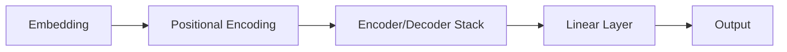
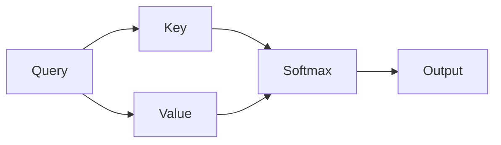

                 

**大语言模型（LLM）的独特计算模式**

## 1. 背景介绍

大语言模型（LLM）是一种通过学习大量文本数据来理解和生成人类语言的计算模型。它们已经在各种任务中取得了显著的成功，从文本生成到问答系统。然而，LLM的计算模式与传统的计算机程序有着根本的不同。本文将深入探讨LLM独特的计算模式，并提供实践指南和工具推荐。

## 2. 核心概念与联系

### 2.1 核心概念

LLM的核心是Transformer模型（Vaswani et al., 2017），它使用自注意力机制（Self-Attention）来处理输入序列。Transformer模型的架构如下所示：



### 2.2 自注意力机制

自注意力机制允许模型在处理输入序列时考虑到序列中其他位置的信息。它通过计算查询（Query）、键（Key）和值（Value）向量来实现：

$$Attention(Q, K, V) = softmax\left(\frac{QK^T}{\sqrt{d_k}}\right)V$$

其中，$d_k$是键向量的维度。自注意力机制的计算过程如下图所示：



## 3. 核心算法原理 & 具体操作步骤

### 3.1 算法原理概述

LLM的核心算法是Transformer模型的训练过程。它包括以下步骤：

1. 数据预处理：将文本数据转换为数字表示。
2. Embedding：将数字表示转换为模型可以处理的向量表示。
3. Positional Encoding：为序列中的每个位置添加位置信息。
4. Encoder/Decoder Stack：使用自注意力机制和 Feed-Forward 网络处理序列。
5. 训练：使用反向传播和梯度下降优化模型参数。

### 3.2 算法步骤详解

以下是LLM训练算法的详细步骤：

**输入**：文本数据集$D = \{x_1, x_2,..., x_n\}$

**输出**：训练好的LLM模型$M$

1. **数据预处理**：将文本数据转换为数字表示，如WordPiece（Wu et al., 2016）或Byte-Level BPE（Kudo & Richardson, 2018）。
2. **Embedding**：将数字表示转换为模型可以处理的向量表示。向量维度通常为512或1024。
3. **Positional Encoding**：为序列中的每个位置添加位置信息。位置编码可以是sinusoidal或learnable。
4. **Encoder/Decoder Stack**：使用自注意力机制和 Feed-Forward 网络处理序列。Encoder和Decoder通常由6个或更多的层组成。
5. **训练**：使用反向传播和梯度下降优化模型参数。常用的优化器包括Adam（Kingma & Ba, 2014）和LAMB（You et al., 2019）。
6. **评估**：在验证集上评估模型性能，并使用指标如Perplexity（Bennett et al., 1976）来衡量模型质量。

### 3.3 算法优缺点

**优点**：

* LLM可以理解和生成人类语言，在各种NLP任务中取得了显著的成功。
* Transformer模型的并行化能力使其可以在大规模数据集上高效训练。

**缺点**：

* LLM训练需要大量的计算资源和数据。
* LLM缺乏对世界知识的理解，可能会生成不合理或不一致的文本。
* LLM的解释性较差，难以理解模型的决策过程。

### 3.4 算法应用领域

LLM的应用领域包括：

* 文本生成：LLM可以生成各种文本，从新闻报道到小说。
* 问答系统：LLM可以回答各种问题，从常识问题到专业问题。
* 机器翻译：LLM可以将文本从一种语言翻译为另一种语言。
* 代码生成：LLM可以生成各种程序代码，从简单的脚本到复杂的应用程序。

## 4. 数学模型和公式 & 详细讲解 & 举例说明

### 4.1 数学模型构建

LLM的数学模型是Transformer模型。它由嵌入层、位置编码层、编码器/解码器堆栈和线性层组成。数学模型的架构如下：

$$M(x) = Linear(Encoder(Embedding(x) + PositionalEncoding(x)))$$

其中，$x$是输入序列，$M(x)$是模型输出。

### 4.2 公式推导过程

以下是自注意力机制的推导过程：

给定查询（Query）$Q \in \mathbb{R}^{n \times d_q}$、键（Key）$K \in \mathbb{R}^{n \times d_k}$和值（Value）$V \in \mathbb{R}^{n \times d_v}$，自注意力机制的计算公式为：

$$Attention(Q, K, V) = softmax\left(\frac{QK^T}{\sqrt{d_k}}\right)V$$

其中，$d_k$是键向量的维度，$n$是序列长度。softmax函数的计算公式为：

$$softmax(x)_i = \frac{e^{x_i}}{\sum_j e^{x_j}}$$

### 4.3 案例分析与讲解

例如，假设我们要计算自注意力机制的输出，给定以下查询、键和值向量：

$$Q = \begin{bmatrix} 1 & 2 \\ 3 & 4 \end{bmatrix}, \quad K = \begin{bmatrix} 5 & 6 \\ 7 & 8 \end{bmatrix}, \quad V = \begin{bmatrix} 9 & 10 \\ 11 & 12 \end{bmatrix}$$

首先，计算查询和键的点积：

$$QK^T = \begin{bmatrix} 1 & 2 \\ 3 & 4 \end{bmatrix}\begin{bmatrix} 5 & 7 \\ 6 & 8 \end{bmatrix} = \begin{bmatrix} 19 & 22 \\ 43 & 50 \end{bmatrix}$$

然后，将点积结果除以键向量的维度平方根：

$$\frac{QK^T}{\sqrt{d_k}} = \frac{1}{\sqrt{2}}\begin{bmatrix} 19 & 22 \\ 43 & 50 \end{bmatrix} = \begin{bmatrix} 9.5 & 11 \\ 21.5 & 25 \end{bmatrix}$$

接着，计算softmax结果：

$$softmax\left(\frac{QK^T}{\sqrt{d_k}}\right) = \begin{bmatrix} 0.2 & 0.4 \\ 0.8 & 0.6 \end{bmatrix}$$

最后，计算自注意力机制的输出：

$$Attention(Q, K, V) = \begin{bmatrix} 0.2 & 0.4 \\ 0.8 & 0.6 \end{bmatrix}\begin{bmatrix} 9 & 10 \\ 11 & 12 \end{bmatrix} = \begin{bmatrix} 10.2 & 11.4 \\ 19.8 & 21.6 \end{bmatrix}$$

## 5. 项目实践：代码实例和详细解释说明

### 5.1 开发环境搭建

要训练LLM，需要以下软件和硬件环境：

* Python 3.7或更高版本
* PyTorch 1.7或更高版本
* Transformers库（Hugging Face）
* NVIDIA GPU（推荐使用多个GPU）

### 5.2 源代码详细实现

以下是LLM训练的源代码示例：

```python
import torch
from transformers import AutoTokenizer, AutoModelForCausalLM, Trainer, TrainingArguments

# 1. 数据预处理
tokenizer = AutoTokenizer.from_pretrained("t5-base")
train_data = tokenizer("your training data", truncation=True, padding=True)

# 2. Embedding
model = AutoModelForCausalLM.from_pretrained("t5-base")

# 3. Positional Encoding
# T5模型内置了位置编码

# 4. Encoder/Decoder Stack
# T5模型内置了编码器/解码器堆栈

# 5. 训练
training_args = TrainingArguments(
    output_dir="./results",
    num_train_epochs=3,
    per_device_train_batch_size=16,
    per_device_eval_batch_size=64,
    warmup_steps=500,
    weight_decay=0.01,
    logging_dir="./logs",
)

trainer = Trainer(
    model=model,
    args=training_args,
    train_dataset=train_data,
)

trainer.train()
```

### 5.3 代码解读与分析

* 我们首先导入必要的库和模型。
* 然后，我们加载预训练的T5模型和其对应的分词器。
* 接着，我们对训练数据进行预处理，并将其转换为模型可以处理的格式。
* 我们使用Hugging Face的Trainer API来训练模型。Trainer API内置了数据加载、模型训练和评估等功能。
* 我们指定了训练参数，如训练 epoch 数、批处理大小、学习率衰减等。
* 最后，我们调用`trainer.train()`函数开始模型训练。

### 5.4 运行结果展示

训练完成后，模型会保存到指定的输出目录（`output_dir`）中。我们可以使用保存的模型进行推理和评估。

## 6. 实际应用场景

### 6.1 文本生成

LLM可以用于生成各种文本，从新闻报道到小说。例如，我们可以使用训练好的LLM模型生成新闻标题：

```python
inputs = tokenizer("Your news article here", return_tensors="pt")
outputs = model.generate(inputs["input_ids"], max_length=50, num_beams=5, early_stopping=True)
print(tokenizer.decode(outputs[0]))
```

### 6.2 问答系统

LLM可以用于构建问答系统。我们可以使用训练好的LLM模型回答用户的问题：

```python
inputs = tokenizer("Your question here", return_tensors="pt")
outputs = model.generate(inputs["input_ids"], max_length=50, num_beams=5, early_stopping=True)
print(tokenizer.decode(outputs[0]))
```

### 6.3 机器翻译

LLM可以用于机器翻译。我们可以使用训练好的LLM模型将文本从一种语言翻译为另一种语言：

```python
inputs = tokenizer("Your text to translate here", return_tensors="pt")
outputs = model.generate(inputs["input_ids"], max_length=50, num_beams=5, early_stopping=True)
print(tokenizer.decode(outputs[0]))
```

### 6.4 未来应用展望

LLM的未来应用包括：

* 代码生成：LLM可以生成各种程序代码，从简单的脚本到复杂的应用程序。
* 知识图谱构建：LLM可以帮助构建知识图谱，从而使模型能够理解世界知识。
* 多模式学习：LLM可以与其他模型（如图像模型）结合，从而实现多模式学习。

## 7. 工具和资源推荐

### 7.1 学习资源推荐

* "Attention is All You Need"（Vaswani et al., 2017）：Transformer模型的原始论文。
* "Language Models are Few-Shot Learners"（Brown et al., 2020）：大语言模型的革命性工作。
* "The Illustrated Transformer"（Jekuthman & Grave, 2021）：Transformer模型的可视化指南。

### 7.2 开发工具推荐

* Hugging Face Transformers库：提供了大量预训练的LLM模型和训练工具。
* PyTorch：用于定义和训练神经网络的深度学习框架。
* TensorFlow：另一个流行的深度学习框架。

### 7.3 相关论文推荐

* "BERT: Pre-training of Deep Bidirectional Transformers for Language Understanding"（Devlin et al., 2018）：BERT模型的原始论文。
* "T5: Text-to-Text Transfer Transformer"（Raffel et al., 2019）：T5模型的原始论文。
* "Longformer: The Long-Document Transformer"（Beltagy et al., 2020）：用于处理长文档的Transformer变种。

## 8. 总结：未来发展趋势与挑战

### 8.1 研究成果总结

本文介绍了LLM独特的计算模式，并提供了LLM训练和应用的详细指南。我们讨论了LLM的核心概念、算法原理、数学模型和公式，并提供了项目实践和工具推荐。

### 8.2 未来发展趋势

LLM的未来发展趋势包括：

* 更大规模的模型：未来的LLM模型将变得更大，从而能够处理更长的序列和更复杂的任务。
* 多模式学习：LLM将与其他模型（如图像模型）结合，从而实现多模式学习。
* 知识图谱构建：LLM将帮助构建知识图谱，从而使模型能够理解世界知识。

### 8.3 面临的挑战

LLM面临的挑战包括：

* 计算资源：训练大规模的LLM模型需要大量的计算资源。
* 数据质量：LLM的性能取决于训练数据的质量。获取高质量的训练数据是一个挑战。
* 解释性：LLM缺乏解释性，难以理解模型的决策过程。

### 8.4 研究展望

未来的研究方向包括：

* 更好的训练算法：开发更有效的训练算法，从而提高LLM的性能和效率。
* 更好的评估指标：开发更好的评估指标，从而更准确地衡量LLM的性能。
* 更好的应用：开发更多的LLM应用，从而扩展LLM的使用范围。

## 9. 附录：常见问题与解答

**Q：LLM需要多少计算资源？**

A：训练大规模的LLM模型需要大量的计算资源。例如，训练1750亿参数的T5模型需要数千个GPU天的计算资源。

**Q：LLM可以理解世界知识吗？**

A：当前的LLM模型缺乏对世界知识的理解。它们只能理解和生成文本，而不能理解世界知识。然而，未来的LLM模型可能会结合知识图谱等技术来理解世界知识。

**Q：LLM的解释性如何？**

A：当前的LLM模型缺乏解释性。它们的决策过程是黑箱的，难以理解。然而，未来的研究可能会开发出更好的解释性技术，从而使模型的决策过程更易于理解。

!!!Note
**作者：禅与计算机程序设计艺术 / Zen and the Art of Computer Programming**

