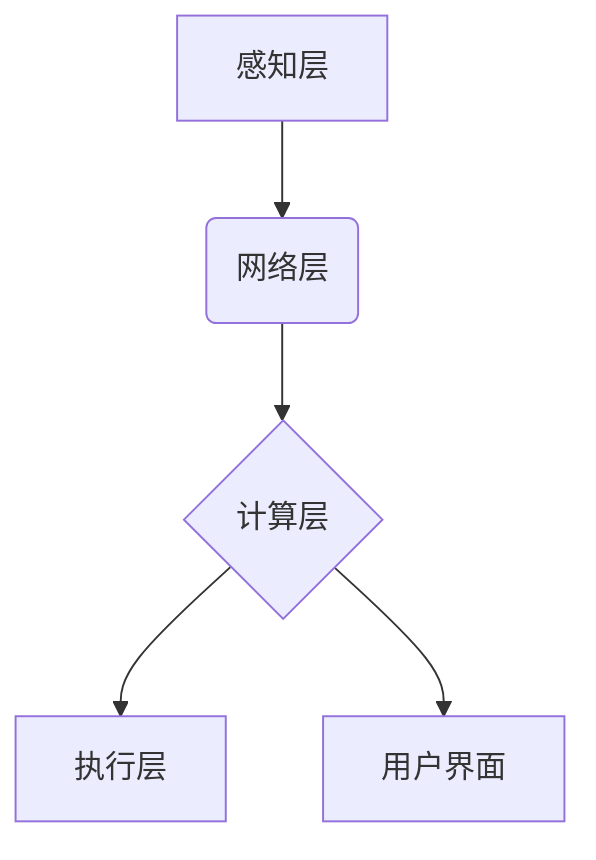

> 智能农场, 精准农业, 农业物联网, 机器学习, 数据分析, 自动化, 农业机器人, 智慧种植

## 1. 背景介绍

全球人口持续增长，粮食需求不断攀升，而传统农业面临着土地资源短缺、环境污染、生产效率低下等诸多挑战。精准农业作为应对这些挑战的有效途径，正逐渐成为农业发展的新趋势。智能农场作为精准农业的典型应用场景，通过融合物联网、人工智能、大数据等先进技术，实现农业生产的智能化、自动化和数据化，为提高农业生产效率、降低生产成本、保障粮食安全提供了新的解决方案。

## 2. 核心概念与联系

**2.1 精准农业**

精准农业是指利用现代信息技术和数据分析手段，对农业生产进行精细化管理，实现“对症下药”的生产模式。其核心目标是通过收集和分析农业生产数据，为作物生长提供个性化的养分、水肥、农药等管理方案，从而提高产量、降低成本、减少环境污染。

**2.2 智能农场**

智能农场是指利用物联网、人工智能、自动化等技术，实现农业生产的智能化、自动化和数据化管理的农场。其主要特点包括：

* **数据驱动:** 通过传感器、摄像头等设备收集作物生长、土壤环境、气候条件等数据，并利用大数据分析技术进行数据挖掘和分析，为农业生产提供决策支持。
* **自动化控制:** 利用自动化控制系统，实现作物播种、施肥、灌溉、病虫害防治等生产环节的自动化操作，提高生产效率和降低人工成本。
* **远程监控:** 通过云计算平台和移动设备，实现对农场生产情况的远程监控和管理，及时发现和解决生产问题。

**2.3 核心架构**

智能农场系统通常由以下几个核心模块组成：

* **感知层:** 包括各种传感器、摄像头等设备，负责收集农业生产数据。
* **网络层:** 利用物联网技术，将感知层数据传输到云平台。
* **计算层:** 利用云计算平台和人工智能算法，对数据进行分析和处理，生成决策建议。
* **执行层:** 利用自动化控制系统，执行决策建议，实现农业生产的自动化操作。
* **用户界面:** 提供用户访问系统数据、查看生产情况、进行远程控制等功能的界面。



## 3. 核心算法原理 & 具体操作步骤

**3.1 算法原理概述**

智能农场中常用的算法包括机器学习、深度学习、数据挖掘等。这些算法可以帮助系统从海量农业生产数据中提取有价值的信息，并根据这些信息进行决策。例如，机器学习算法可以用于预测作物产量、识别病虫害、优化施肥方案等。

**3.2 算法步骤详解**

以机器学习算法为例，其基本步骤包括：

1. **数据收集:** 收集相关农业生产数据，例如土壤湿度、温度、光照强度、作物生长状况等。
2. **数据预处理:** 对收集到的数据进行清洗、转换、归一化等处理，使其符合算法的输入要求。
3. **模型选择:** 根据具体应用场景选择合适的机器学习算法，例如线性回归、决策树、支持向量机等。
4. **模型训练:** 利用训练数据对选定的算法进行训练，使其能够学习到数据中的规律。
5. **模型评估:** 利用测试数据对训练好的模型进行评估，并根据评估结果进行模型调优。
6. **模型部署:** 将训练好的模型部署到智能农场系统中，用于进行实际应用。

**3.3 算法优缺点**

* **优点:**

    * 可以从海量数据中提取有价值的信息，提高决策的准确性。
    * 可以自动学习和适应环境变化，实现智能化管理。
    * 可以提高生产效率、降低生产成本、减少环境污染。

* **缺点:**

    * 需要大量的训练数据，数据质量对算法性能有重要影响。
    * 算法的解释性较差，难以理解算法的决策过程。
    * 算法的开发和维护需要专业技术人员。

**3.4 算法应用领域**

* **作物产量预测:** 利用历史数据和当前环境条件，预测作物产量，帮助农民制定合理的种植计划。
* **病虫害识别:** 利用图像识别技术，识别作物病虫害，及时采取防治措施。
* **施肥方案优化:** 根据土壤肥力、作物生长状况等数据，优化施肥方案，提高肥料利用率，减少环境污染。
* **灌溉管理:** 根据土壤湿度、天气预报等数据，自动控制灌溉系统，实现精准灌溉。

## 4. 数学模型和公式 & 详细讲解 & 举例说明

**4.1 数学模型构建**

智能农场中，可以使用数学模型来描述作物生长、土壤水分、气候条件等因素之间的关系。例如，可以使用Logistic模型来描述作物生长曲线，可以使用水文模型来描述土壤水分变化。

**4.2 公式推导过程**

以Logistic模型为例，其公式如下：

$$
y = \frac{L}{1 + e^{-k(x-x_0)}}
$$

其中：

* $y$：作物生长量
* $L$：作物生长上限
* $k$：生长速率
* $x$：时间
* $x_0$：生长开始时间

该公式可以用来预测作物在不同时间点的生长量。

**4.3 案例分析与讲解**

假设一个作物生长上限为100 kg/m²，生长速率为0.5/天，生长开始时间为第1天。可以使用上述公式来预测作物在第5天、第10天、第15天的生长量。

* 第5天：$y = \frac{100}{1 + e^{-0.5(5-1)}} \approx 63.2$ kg/m²
* 第10天：$y = \frac{100}{1 + e^{-0.5(10-1)}} \approx 93.2$ kg/m²
* 第15天：$y = \frac{100}{1 + e^{-0.5(15-1)}} \approx 99.3$ kg/m²

## 5. 项目实践：代码实例和详细解释说明

**5.1 开发环境搭建**

智能农场项目可以使用Python语言进行开发，并结合相关库和框架，例如TensorFlow、PyTorch、Scikit-learn等。

**5.2 源代码详细实现**

以下是一个简单的作物产量预测代码示例：

```python
import pandas as pd
from sklearn.model_selection import train_test_split
from sklearn.linear_model import LinearRegression

# 加载数据
data = pd.read_csv("crop_data.csv")

# 划分训练集和测试集
X_train, X_test, y_train, y_test = train_test_split(data[['temperature', 'rainfall']], data['yield'], test_size=0.2)

# 创建线性回归模型
model = LinearRegression()

# 训练模型
model.fit(X_train, y_train)

# 预测测试集产量
y_pred = model.predict(X_test)

# 评估模型性能
print("模型评分:", model.score(X_test, y_test))
```

**5.3 代码解读与分析**

该代码首先加载了作物产量数据，然后将数据划分成训练集和测试集。接着，创建了一个线性回归模型，并使用训练集数据训练模型。最后，使用测试集数据预测产量，并评估模型性能。

**5.4 运行结果展示**

运行该代码后，会输出模型评分，该评分表示模型在测试集上的预测准确率。

## 6. 实际应用场景

**6.1 智慧种植**

智能农场可以实现智慧种植，通过传感器监测土壤湿度、温度、光照强度等数据，并根据这些数据自动控制灌溉、施肥、通风等生产环节，实现作物生长环境的精准控制。

**6.2 自动化管理**

智能农场可以利用自动化控制系统，实现作物播种、收获等生产环节的自动化操作，减少人工成本，提高生产效率。

**6.3 数据分析决策**

智能农场可以收集和分析海量农业生产数据，为农业生产决策提供数据支持，例如预测作物产量、识别病虫害、优化施肥方案等。

**6.4 未来应用展望**

随着人工智能、物联网等技术的不断发展，智能农场将朝着更加智能化、自动化、数据化方向发展，例如：

* **无人驾驶农业机械:** 利用无人驾驶技术，实现农业机械的自动作业，提高作业效率和安全性。
* **精准病虫害防治:** 利用人工智能技术，识别和预测病虫害，实现精准的病虫害防治，减少农药使用。
* **个性化养分管理:** 利用传感器和数据分析技术，为不同作物提供个性化的养分管理方案，提高肥料利用率，减少环境污染。

## 7. 工具和资源推荐

**7.1 学习资源推荐**

* **书籍:**
    * 《深度学习》
    * 《机器学习实战》
    * 《Python数据科学手册》
* **在线课程:**
    * Coursera: 深度学习
    * edX: 机器学习
    * Udacity: 数据科学

**7.2 开发工具推荐**

* **Python:** 
    * TensorFlow
    * PyTorch
    * Scikit-learn
* **物联网平台:**
    * AWS IoT
    * Azure IoT
    * Google Cloud IoT

**7.3 相关论文推荐**

* **Precision agriculture using machine learning:** https://www.researchgate.net/publication/329724704_Precision_agriculture_using_machine_learning
* **Smart farming: A review of technologies and applications:** https://www.sciencedirect.com/science/article/pii/S221267161830087X

## 8. 总结：未来发展趋势与挑战

**8.1 研究成果总结**

智能农场技术在农业生产中取得了显著的成果，例如提高了产量、降低了成本、减少了环境污染。

**8.2 未来发展趋势**

智能农场技术将朝着更加智能化、自动化、数据化方向发展，例如无人驾驶农业机械、精准病虫害防治、个性化养分管理等。

**8.3 面临的挑战**

智能农场技术还面临着一些挑战，例如数据安全、算法解释性、成本高昂等。

**8.4 研究展望**

未来，需要进一步研究智能农场技术的安全性、可靠性、可扩展性等问题，并探索新的应用场景，推动智能农场技术在农业生产中的广泛应用。

## 9. 附录：常见问题与解答

**9.1 如何选择合适的智能农场系统？**

选择智能农场系统时，需要考虑以下因素：

* 农场规模
* 作物类型
* 农业生产模式
* 预算

**9.2 智能农场系统的成本如何？**

智能农场系统的成本取决于多种因素，例如农场规模、选用的技术方案、设备价格等。

**9.3 智能农场系统是否安全可靠？**

智能农场系统需要采用安全可靠的技术方案，确保数据安全和系统稳定性。

**9.4 智能农场系统是否易于使用？**

智能农场系统需要提供友好的用户界面和完善的培训支持，方便用户使用和维护。


作者：禅与计算机程序设计艺术 / Zen and the Art of Computer Programming 
<end_of_turn>