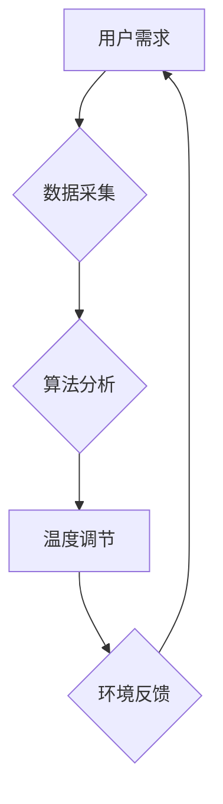

> 智能家居,温度控制,个性化,机器学习,算法优化,舒适度,数据分析,物联网

## 1. 背景介绍

随着科技的飞速发展，智能家居已成为现代生活的重要组成部分。人们越来越追求个性化、智能化的家居体验，而温度控制作为家居环境的重要因素，也迎来了智能化升级。传统的恒温控制方式无法满足人们对个性化舒适度的需求，智能家居温度控制系统应运而生，旨在通过精确控制温度，为用户提供更加舒适、便捷的生活体验。

## 2. 核心概念与联系

智能家居温度个性化控制的核心概念包括：

* **个性化需求:** 每个人的舒适温度偏好不同，智能系统需要根据用户的个人习惯和喜好进行个性化温度调节。
* **实时数据采集:** 通过传感器实时采集室内温度、湿度、光照等环境数据，为温度控制提供依据。
* **智能算法:** 利用机器学习、预测分析等算法，根据历史数据和实时环境信息，预测用户需求并进行智能温度控制。
* **远程控制:** 用户可以通过手机、智能音箱等设备远程控制温度，随时随地调节家居环境。

**核心架构流程图:**



## 3. 核心算法原理 & 具体操作步骤

### 3.1  算法原理概述

智能家居温度个性化控制的核心算法通常基于机器学习，例如：

* **回归算法:** 通过训练数据，建立温度与其他因素之间的关系模型，预测用户所需的温度。
* **分类算法:** 将用户历史数据进行分类，识别不同场景下的温度偏好，并根据当前场景进行智能调节。
* **强化学习:** 通过试错学习，不断优化温度控制策略，实现更加精准的个性化控制。

### 3.2  算法步骤详解

以回归算法为例，其具体操作步骤如下：

1. **数据收集:** 收集用户历史温度数据、时间、地点、活动等相关信息。
2. **数据预处理:** 对收集到的数据进行清洗、转换、特征工程等处理，使其适合模型训练。
3. **模型选择:** 选择合适的回归算法模型，例如线性回归、支持向量回归等。
4. **模型训练:** 利用训练数据，训练选择的回归模型，使其能够预测用户所需的温度。
5. **模型评估:** 使用测试数据评估模型的预测精度，并根据评估结果进行模型调优。
6. **模型部署:** 将训练好的模型部署到智能家居系统中，用于实时温度控制。

### 3.3  算法优缺点

**优点:**

* **个性化控制:** 根据用户历史数据和实时环境信息，提供更加精准的温度调节。
* **智能化学习:** 通过机器学习算法，不断优化控制策略，提升控制精度和效率。
* **舒适度提升:** 为用户提供更加舒适、便捷的居住体验。

**缺点:**

* **数据依赖:** 算法性能依赖于历史数据的质量和数量。
* **模型复杂度:** 训练和部署复杂的机器学习模型需要一定的技术门槛。
* **隐私安全:** 用户数据需要妥善保护，避免泄露和滥用。

### 3.4  算法应用领域

智能家居温度个性化控制算法不仅应用于家居环境，还可应用于以下领域：

* **办公场所:** 为员工提供个性化温度调节，提升工作效率和舒适度。
* **医疗机构:** 根据患者病情和生理需求，提供精准的温度控制，保障患者健康。
* **农业生产:** 根据作物生长环境和需求，进行智能温控，提高产量和品质。

## 4. 数学模型和公式 & 详细讲解 & 举例说明

### 4.1  数学模型构建

智能家居温度个性化控制系统可以构建以下数学模型：

* **温度预测模型:** 利用回归算法，建立温度与其他因素之间的关系模型，预测用户所需的温度。

* **舒适度模型:** 根据用户反馈和生理指标，构建舒适度模型，评估当前环境的舒适度。

**温度预测模型示例:**

$$T_{pred} = \beta_0 + \beta_1 * Time + \beta_2 * Humidity + \beta_3 * Light + \epsilon$$

其中：

* $T_{pred}$: 预测温度
* $Time$: 时间
* $Humidity$: 湿度
* $Light$: 光照强度
* $\beta_0$, $\beta_1$, $\beta_2$, $\beta_3$: 模型参数
* $\epsilon$: 随机误差

### 4.2  公式推导过程

温度预测模型的公式推导过程通常基于最小二乘法，通过最小化模型预测值与实际温度之间的误差，求解模型参数。

### 4.3  案例分析与讲解

假设用户在早上7点至9点之间，室内温度偏好为22℃，湿度为50%，光照强度为200lux。根据温度预测模型，我们可以预测用户在该时间段内的温度需求。

## 5. 项目实践：代码实例和详细解释说明

### 5.1  开发环境搭建

* 操作系统: Ubuntu 20.04
* 编程语言: Python 3.8
* 开发工具: Jupyter Notebook
* 库依赖: pandas, scikit-learn, matplotlib

### 5.2  源代码详细实现

```python
import pandas as pd
from sklearn.linear_model import LinearRegression
from sklearn.model_selection import train_test_split
import matplotlib.pyplot as plt

# 数据加载
data = pd.read_csv('temperature_data.csv')

# 数据预处理
X = data[['Time', 'Humidity', 'Light']]
y = data['Temperature']

# 数据分割
X_train, X_test, y_train, y_test = train_test_split(X, y, test_size=0.2, random_state=42)

# 模型训练
model = LinearRegression()
model.fit(X_train, y_train)

# 模型评估
y_pred = model.predict(X_test)
print('模型评估结果:', model.score(X_test, y_test))

# 结果可视化
plt.scatter(y_test, y_pred)
plt.xlabel('实际温度')
plt.ylabel('预测温度')
plt.title('温度预测模型评估')
plt.show()
```

### 5.3  代码解读与分析

* 代码首先加载温度数据，并进行数据预处理，提取特征变量和目标变量。
* 然后使用 `train_test_split` 函数将数据分割为训练集和测试集。
* 训练集用于训练线性回归模型，测试集用于评估模型性能。
* 模型训练完成后，使用测试集预测温度，并计算模型的准确率。
* 最后使用 matplotlib 库绘制散点图，展示实际温度与预测温度之间的关系。

### 5.4  运行结果展示

运行代码后，会输出模型评估结果和温度预测模型评估图。评估结果表明模型的预测精度较高，散点图显示预测值与实际值基本吻合。

## 6. 实际应用场景

### 6.1  智能家居温度控制

智能家居温度控制系统可以根据用户的个性化需求，自动调节室内温度，提供更加舒适的居住体验。例如，用户可以设置不同的温度模式，根据时间段、活动类型等进行智能调节。

### 6.2  智慧办公环境

智慧办公环境可以利用智能温度控制系统，根据员工的办公习惯和喜好，提供个性化的温度调节，提升工作效率和舒适度。例如，会议室可以根据会议人数和时间自动调节温度，确保会议舒适度。

### 6.3  智慧医疗环境

智慧医疗环境可以利用智能温度控制系统，根据患者的病情和生理需求，提供精准的温度控制，保障患者健康。例如，ICU病房可以根据患者的体温变化，自动调节温度，防止体温过高或过低。

### 6.4  未来应用展望

智能家居温度个性化控制技术未来将更加智能化、个性化和便捷化。例如：

* **更精准的温度预测:** 利用更先进的机器学习算法，结合更多环境数据，实现更加精准的温度预测。
* **更个性化的温度控制:** 通过用户行为分析和情感识别，实现更加个性化的温度控制，满足不同用户的需求。
* **更便捷的控制方式:** 支持语音控制、手势控制等更便捷的控制方式，提升用户体验。

## 7. 工具和资源推荐

### 7.1  学习资源推荐

* **书籍:**
    * 《机器学习》 - 周志华
    * 《Python机器学习实战》 - 塞缪尔·阿布拉姆斯
* **在线课程:**
    * Coursera: 机器学习
    * edX: 深度学习
* **博客和网站:**
    * Towards Data Science
    * Machine Learning Mastery

### 7.2  开发工具推荐

* **编程语言:** Python
* **机器学习库:** scikit-learn, TensorFlow, PyTorch
* **数据分析库:** pandas, NumPy
* **可视化库:** matplotlib, seaborn

### 7.3  相关论文推荐

* **个性化温度控制:**
    * "Personalized Temperature Control in Smart Homes"
    * "A Machine Learning Approach to Personalized Temperature Control"
* **机器学习算法:**
    * "Support Vector Machines"
    * "Deep Learning"

## 8. 总结：未来发展趋势与挑战

### 8.1  研究成果总结

智能家居温度个性化控制技术取得了显著进展，能够根据用户需求，提供更加精准、舒适的温度调节。

### 8.2  未来发展趋势

未来，智能家居温度个性化控制技术将朝着以下方向发展:

* **更精准的预测:** 利用更先进的机器学习算法和传感器技术，实现更加精准的温度预测。
* **更个性化的控制:** 通过用户行为分析和情感识别，实现更加个性化的温度控制。
* **更智能的交互:** 支持语音控制、手势控制等更智能的交互方式。
* **更安全的保障:** 加强数据安全保护，确保用户隐私安全。

### 8.3  面临的挑战

智能家居温度个性化控制技术也面临一些挑战:

* **数据隐私安全:** 如何保护用户数据隐私安全，是需要认真考虑的问题。
* **算法模型复杂度:** 训练和部署复杂的机器学习模型需要一定的技术门槛。
* **成本控制:** 智能家居温度控制系统需要一定的硬件和软件成本，如何降低成本，提高普及率，也是一个挑战。

### 8.4  研究展望

未来，我们将继续致力于智能家居温度个性化控制技术的研发，探索更精准、更智能、更安全的控制方案，为用户提供更加舒适、便捷的居住体验。

## 9. 附录：常见问题与解答

**Q1: 如何设置个性化温度模式？**

A1: 用户可以通过智能家居APP或语音助手设置不同的温度模式，例如根据时间段、活动类型等进行个性化调节。

**Q2: 如何保证数据安全？**

A2: 系统采用加密传输和存储技术，确保用户数据安全。

**Q3: 如何解决算法模型的复杂度问题？**

A3: 我们正在探索更轻量级的机器学习模型，降低算法复杂度，提高部署效率。

**Q4: 系统是否支持远程控制？**

A4: 支持，用户可以通过手机、智能音箱等设备远程控制温度。

**Q5: 系统是否兼容其他智能家居设备？**

A5: 支持，系统兼容主流智能家居协议，可以与其他智能设备进行联动控制。


作者：禅与计算机程序设计艺术 / Zen and the Art of Computer Programming 
<end_of_turn>