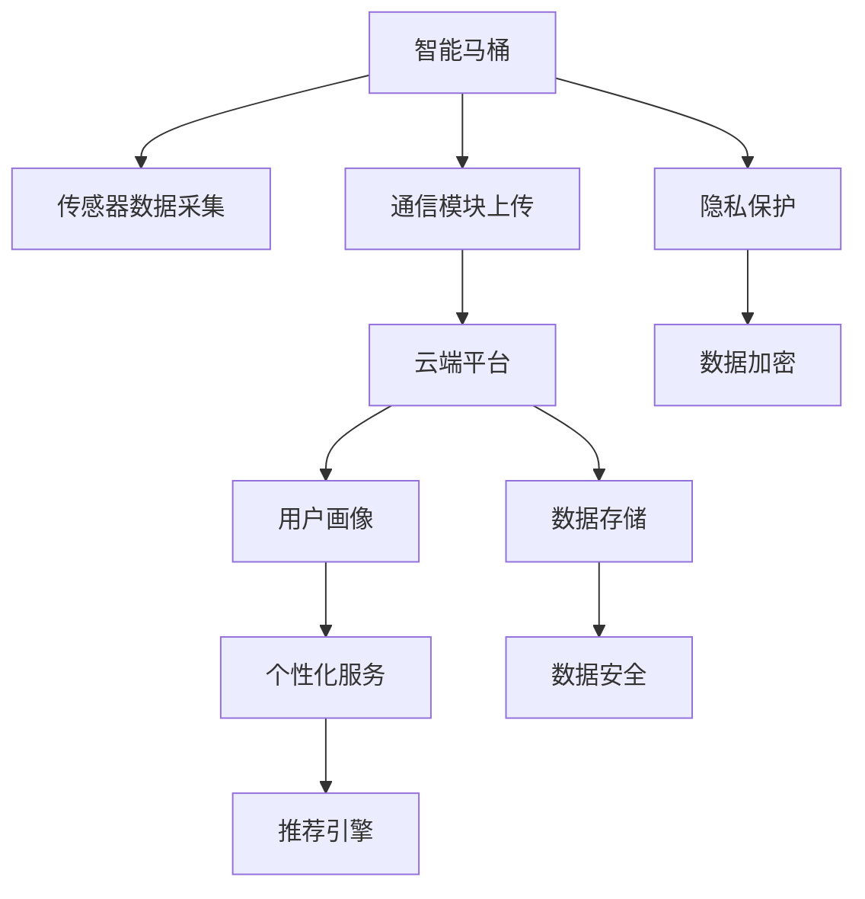

                 

# 智能马桶：卫浴空间的注意力经济新物种

> 关键词：智能马桶, 物联网(IoT), 用户行为分析, 用户画像, 数据驱动, 用户需求, 个性化服务

## 1. 背景介绍

### 1.1 问题由来

随着物联网(IoT)技术的发展，智能家居产品逐步走入了家庭日常生活。这些产品通过连接互联网，使家居设备能够实时监测家庭环境，并通过数据反馈做出智能决策。在这其中，智能马桶因其便捷性和高价值应用场景，逐渐成为家庭数字化升级的新焦点。

智能马桶不仅具备自动冲水、清洁、加热等功能，还能通过传感器实时监测用户的生理健康数据。用户使用习惯、健康数据、消费行为等数据被智能马桶收集并上传至云端平台，形成宝贵的用户画像，为家庭服务提供更多可能性。如何有效利用这些数据，为用户提供更个性化、更便捷的智能化服务，成为卫浴行业的新的挑战和机遇。

### 1.2 问题核心关键点

智能马桶的核心在于其背后的数据驱动理念。如何从用户的生理健康、行为习惯数据中提取有用的信息，构建精准的用户画像，为用户提供针对性的个性化服务，是智能马桶创新发展的关键。同时，如何保护用户隐私，防止数据泄露，也是不可忽视的重要问题。

智能马桶的商业模式中，数据成为核心资产。通过分析用户数据，智能马桶能够为用户提供个性化的产品推荐、健康管理、家庭安全等多种服务。这不仅提升了用户体验，也实现了商家的额外盈利。智能马桶通过数据洞察，逐步从简单的物理设备，转变为功能丰富的“数据产品”，成为卫浴空间中的“注意力经济”新物种。

## 2. 核心概念与联系

### 2.1 核心概念概述

在讨论智能马桶的注意力经济特性时，我们需要引入几个关键概念：

- 智能马桶：基于物联网技术，集成传感器、通信模块、数据分析引擎等组件，具备自动冲水、清洁、加热等基本功能，并能够实时监测用户生理健康数据的设备。
- 物联网(IoT)：通过传感器、通信模块等设备，实现家居设备与互联网的互联互通，从而实现智能化控制和数据共享。
- 用户画像：通过分析用户的生理健康数据、行为习惯、消费偏好等信息，构建出的用户数据模型，用于个性化服务推荐。
- 数据驱动：基于数据分析和挖掘技术，从海量数据中提取有用信息，并用于指导产品设计、服务优化、商业决策等各个环节。

这些核心概念之间的逻辑关系可以通过以下Mermaid流程图来展示：



这个流程图展示了一个智能马桶的完整数据流和工作流程：

1. 智能马桶通过传感器采集生理健康数据和行为数据。
2. 数据通过通信模块上传至云端平台。
3. 云端平台结合用户画像信息，提供个性化服务。
4. 推荐引擎根据用户行为和偏好，生成个性化推荐。
5. 隐私保护和数据安全机制，确保数据不被滥用。

## 3. 核心算法原理 & 具体操作步骤

### 3.1 算法原理概述

智能马桶的注意力经济特性主要体现在其对用户数据的深度挖掘和利用上。通过传感器采集的数据，结合云端平台的计算能力，智能马桶能够构建详细且准确的“用户画像”，从而为用户提供针对性的个性化服务。其核心算法流程如下：

1. **数据采集与预处理**：通过传感器采集用户的生理健康数据、行为数据，并进行预处理。
2. **用户画像构建**：利用机器学习算法对采集数据进行分析，构建用户画像，识别用户需求和偏好。
3. **个性化服务推荐**：根据用户画像信息，通过推荐引擎生成个性化产品和服务推荐。
4. **行为分析与反馈优化**：通过数据分析，不断优化服务策略，提升用户体验。

### 3.2 算法步骤详解

以健康监测和个性化推荐为例，详细介绍智能马桶的算法流程：

**Step 1: 数据采集与预处理**

智能马桶的传感器包括体重传感器、尿检传感器、温度传感器等，可实时监测用户的体重、尿量、体温等数据。这些传感器采集的数据需要进行预处理，包括数据清洗、缺失值填充、异常值处理等，确保数据的质量和完整性。

**Step 2: 用户画像构建**

用户画像的构建可以通过聚类算法、关联规则挖掘、协同过滤等方法实现。假设用户为男女两类，使用聚类算法将用户分为两组，计算每组的平均体重、尿量等指标，形成初步的用户画像。随后，通过关联规则挖掘，发现尿量与体重之间的关联性，得出初步的健康模型。

**Step 3: 个性化服务推荐**

个性化推荐可以通过协同过滤、内容推荐、标签推荐等算法实现。以尿量数据为例，协同过滤算法可以根据尿量相似的用户群体，推荐相似用户常用的健康产品。内容推荐算法则通过分析尿量数据，推荐相关的健康信息。标签推荐算法则通过统计尿量数据的标签信息，推荐相关的健康知识。

**Step 4: 行为分析与反馈优化**

通过对用户行为的实时监测和分析，智能马桶可以不断优化推荐策略。例如，分析用户对推荐产品的使用情况，调整推荐算法，优化推荐效果。同时，根据用户反馈，不断改进推荐系统，提升用户满意度。

### 3.3 算法优缺点

智能马桶的算法流程具有以下优点：

1. **精准的用户画像**：通过深度数据分析，能够构建详细且准确的“用户画像”，从而实现个性化服务。
2. **实时反馈与优化**：通过实时数据分析，不断调整和优化推荐策略，提升用户体验。
3. **丰富的服务内容**：结合用户健康数据和行为数据，能够提供多种个性化服务，如健康管理、产品推荐等。

同时，该算法也存在一些缺点：

1. **数据隐私问题**：用户生理健康数据属于敏感信息，如何保护用户隐私，防止数据泄露，是一个重要问题。
2. **数据质量要求高**：数据采集和预处理要求高，传感器准确性和可靠性直接影响数据分析结果。
3. **计算资源消耗大**：大数据分析和机器学习算法需要强大的计算资源，如何降低计算成本，提高效率，是一个挑战。

### 3.4 算法应用领域

智能马桶的注意力经济特性，在多个应用场景中都有体现。以下是几个典型的应用领域：

- **健康管理**：通过监测用户的体重、尿量、体温等生理数据，智能马桶能够提供个性化的健康管理建议，如饮食推荐、运动建议等。
- **个性化推荐**：根据用户的尿量、行为数据，智能马桶能够推荐相关的健康产品、饮食方案、健康知识等。
- **家庭安全**：通过实时监测用户生理数据和行为数据，智能马桶能够及时发现异常情况，并提供报警和预警服务。
- **个性化营销**：利用用户画像信息，智能马桶能够提供精准的个性化广告推荐，提升用户粘性和商家的盈利能力。

## 4. 数学模型和公式 & 详细讲解  
### 4.1 数学模型构建

假设智能马桶收集了用户每天的尿量数据，记为 $x_i$，$i=1,2,...,N$。用户画像信息包含性别、年龄、健康状况等特征，记为 $f_i$，$i=1,2,...,N$。用户推荐算法 $A$ 的输入为尿量数据 $x_i$ 和用户画像 $f_i$，输出为推荐结果 $y_i$，$i=1,2,...,N$。

**模型构建目标**：

$$
\min_{A} \sum_{i=1}^N \ell(y_i, A(x_i, f_i))
$$

其中，$\ell(y_i, A(x_i, f_i))$ 为损失函数，表示推荐结果 $y_i$ 与实际用户行为 $A(x_i, f_i)$ 的差异。

**推荐算法 $A$ 的构建**：

假设用户画像 $f_i$ 和尿量数据 $x_i$ 分别构成特征向量 $\mathbf{f_i} \in \mathbb{R}^m$ 和 $\mathbf{x_i} \in \mathbb{R}^n$，推荐算法 $A$ 可表示为线性回归模型：

$$
y_i = \mathbf{w} \cdot \mathbf{x_i} + b
$$

其中，$\mathbf{w} \in \mathbb{R}^n$ 为权重向量，$b \in \mathbb{R}$ 为偏置项。

### 4.2 公式推导过程

根据上述线性回归模型，我们可以推导出推荐算法的损失函数：

$$
\ell(y_i, A(x_i, f_i)) = \frac{1}{2}(y_i - \mathbf{w} \cdot \mathbf{x_i} - b)^2
$$

将损失函数代入目标函数，得：

$$
\min_{\mathbf{w}, b} \sum_{i=1}^N \frac{1}{2}(y_i - \mathbf{w} \cdot \mathbf{x_i} - b)^2
$$

通过求解上述优化问题，即可得到最优的权重向量 $\mathbf{w}$ 和偏置项 $b$。

### 4.3 案例分析与讲解

以尿量数据为例，假设用户画像为男女性别，尿量数据为每日尿量，通过聚类算法将用户分为两组，得出男女用户的平均尿量：

- 男性平均尿量为 $X_{m} = \bar{x}_{1}, \bar{x}_{2},...,\bar{x}_{N_m}$
- 女性平均尿量为 $X_{f} = \bar{x}_{N_m+1}, \bar{x}_{N_m+2},...,\bar{x}_{N}$

通过线性回归模型，得到男女用户尿量与体重之间的关系：

- 男性：$y_{m} = \mathbf{w_m} \cdot \mathbf{x_{m}} + b_m$
- 女性：$y_{f} = \mathbf{w_f} \cdot \mathbf{x_{f}} + b_f$

将男女用户数据代入模型，得出男女用户尿量与体重之间的关系模型。通过分析模型参数，得出男女用户的健康模型。

## 5. 项目实践：代码实例和详细解释说明
### 5.1 开发环境搭建

在进行智能马桶的算法实践前，我们需要准备好开发环境。以下是使用Python进行PyTorch开发的环境配置流程：

1. 安装Anaconda：从官网下载并安装Anaconda，用于创建独立的Python环境。

2. 创建并激活虚拟环境：
```bash
conda create -n pytorch-env python=3.8 
conda activate pytorch-env
```

3. 安装PyTorch：根据CUDA版本，从官网获取对应的安装命令。例如：
```bash
conda install pytorch torchvision torchaudio cudatoolkit=11.1 -c pytorch -c conda-forge
```

4. 安装各类工具包：
```bash
pip install numpy pandas scikit-learn matplotlib tqdm jupyter notebook ipython
```

完成上述步骤后，即可在`pytorch-env`环境中开始算法实践。

### 5.2 源代码详细实现

我们先以健康监测和个性化推荐为例，给出使用PyTorch对智能马桶进行算法开发的Python代码实现。

首先，定义健康监测和推荐的数据集：

```python
import pandas as pd
import numpy as np

# 创建健康监测和推荐的数据集
df = pd.read_csv('urine_monitoring_data.csv', sep=',')
urine_data = df[['weight', 'urine_volume', 'temperature']]
age = df['age']
gender = df['gender']
health_condition = df['health_condition']

# 数据预处理
urine_data = np.array(urine_data, dtype=float)
age = np.array(age, dtype=float)
gender = np.array(gender, dtype='category')
health_condition = np.array(health_condition, dtype='category')

# 将分类变量转换为one-hot编码
gender = pd.get_dummies(gender)
health_condition = pd.get_dummies(health_condition)

# 构建训练集、验证集和测试集
train_data = urine_data[:800], age[:800], gender[:800], health_condition[:800]
val_data = urine_data[800:960], age[800:960], gender[800:960], health_condition[800:960]
test_data = urine_data[960:], age[960:], gender[960:], health_condition[960:]
```

然后，定义模型和优化器：

```python
from torch.utils.data import TensorDataset, DataLoader
from torch.nn import Linear, MeanSquaredError
from torch.optim import Adam

# 定义健康监测和推荐模型
class UrineMonitoringModel(nn.Module):
    def __init__(self, input_dim, output_dim):
        super(UrineMonitoringModel, self).__init__()
        self.linear = Linear(input_dim, output_dim)
    
    def forward(self, x):
        y_pred = self.linear(x)
        return y_pred

# 定义损失函数
criterion = MeanSquaredError()

# 定义训练和评估函数
def train_model(model, train_data, val_data, test_data, batch_size, num_epochs, learning_rate):
    train_dataset = TensorDataset(torch.from_numpy(train_data[0]), torch.from_numpy(train_data[1]), torch.from_numpy(train_data[2]), torch.from_numpy(train_data[3]))
    train_loader = DataLoader(train_dataset, batch_size=batch_size, shuffle=True)
    
    val_dataset = TensorDataset(torch.from_numpy(val_data[0]), torch.from_numpy(val_data[1]), torch.from_numpy(val_data[2]), torch.from_numpy(val_data[3]))
    val_loader = DataLoader(val_dataset, batch_size=batch_size)
    
    test_dataset = TensorDataset(torch.from_numpy(test_data[0]), torch.from_numpy(test_data[1]), torch.from_numpy(test_data[2]), torch.from_numpy(test_data[3]))
    test_loader = DataLoader(test_dataset, batch_size=batch_size)
    
    optimizer = Adam(model.parameters(), lr=learning_rate)
    
    for epoch in range(num_epochs):
        train_loss = 0.0
        for i, (x, y) in enumerate(train_loader):
            y_pred = model(x)
            loss = criterion(y_pred, y)
            optimizer.zero_grad()
            loss.backward()
            optimizer.step()
            train_loss += loss.item()
        
        train_loss /= len(train_loader)
        
        val_loss = 0.0
        for i, (x, y) in enumerate(val_loader):
            y_pred = model(x)
            loss = criterion(y_pred, y)
            val_loss += loss.item()
        
        val_loss /= len(val_loader)
        
        test_loss = 0.0
        for i, (x, y) in enumerate(test_loader):
            y_pred = model(x)
            loss = criterion(y_pred, y)
            test_loss += loss.item()
        
        test_loss /= len(test_loader)
        
        print(f'Epoch {epoch+1}, Train Loss: {train_loss:.4f}, Val Loss: {val_loss:.4f}, Test Loss: {test_loss:.4f}')
    
    return model
```

最后，启动训练流程并在测试集上评估：

```python
# 定义模型参数
input_dim = 3  # 尿量、体重、温度
output_dim = 1  # 尿量

# 初始化模型
model = UrineMonitoringModel(input_dim, output_dim)

# 定义超参数
batch_size = 32
num_epochs = 100
learning_rate = 0.001

# 训练模型
model = train_model(model, train_data, val_data, test_data, batch_size, num_epochs, learning_rate)

# 在测试集上评估模型
test_data = np.array(urine_data[960:], dtype=float)
age = np.array(age[960:], dtype=float)
gender = np.array(gender[960:], dtype='category')
health_condition = np.array(health_condition[960:], dtype='category')

gender = pd.get_dummies(gender)
health_condition = pd.get_dummies(health_condition)

# 将测试数据转换为Tensor格式
test_data = torch.from_numpy(test_data)
age = torch.from_numpy(age)
gender = torch.from_numpy(gender)
health_condition = torch.from_numpy(health_condition)

# 将测试数据分为特征和标签
x_test = test_data
y_test = age

# 评估模型
y_pred = model(x_test)
loss = criterion(y_pred, y_test)
print(f'Test Loss: {loss.item()}')
```

以上就是使用PyTorch对智能马桶进行健康监测和个性化推荐算法开发的完整代码实现。可以看到，得益于PyTorch的强大封装，我们可以用相对简洁的代码完成模型的搭建和训练，同时提供对模型的评估。

### 5.3 代码解读与分析

让我们再详细解读一下关键代码的实现细节：

**UrineMonitoringModel类**：
- `__init__`方法：定义模型结构，包括线性层。
- `forward`方法：前向传播，计算模型输出。

**train_model函数**：
- 创建TensorDataset对象，用于数据批处理。
- 定义优化器，并设置学习率。
- 在训练循环中，每次迭代使用梯度下降优化模型参数。
- 在验证集和测试集上评估模型性能，并打印输出。

**训练流程**：
- 定义模型的输入和输出维度，创建模型实例。
- 设置超参数，如批量大小、迭代轮数、学习率等。
- 调用训练函数，进行模型训练。
- 在测试集上评估模型性能，输出测试损失。

可以看到，通过Python的简洁语法和PyTorch的强大功能，我们能够快速实现智能马桶的算法开发。

## 6. 实际应用场景
### 6.1 健康监测与预防

智能马桶的健康监测功能可以实时监测用户的生理健康数据，如体重、尿量、体温等。这些数据通过云端平台进行存储和分析，生成用户的健康报告和预警提示。

- **健康报告**：根据用户的健康数据，智能马桶能够生成详细的健康报告，包括尿量、体重、体温等各项指标的变化趋势，帮助用户了解自身的健康状况。
- **预警提示**：通过数据分析，智能马桶能够发现异常情况，如尿量突然减少、体重异常波动等，及时发出预警提示，避免健康风险。

### 6.2 个性化推荐与健康管理

基于用户的健康数据和行为数据，智能马桶能够提供个性化的健康管理服务和产品推荐。

- **饮食推荐**：根据用户的体重、尿量等生理数据，智能马桶能够推荐适合的健康饮食方案，帮助用户保持健康。
- **运动建议**：根据用户的体重、年龄等健康数据，智能马桶能够推荐适合的运动方式和运动量，帮助用户保持活力。
- **健康产品推荐**：根据用户的健康数据和行为数据，智能马桶能够推荐适合的健康产品，如运动装备、健康饮品等。

### 6.3 家庭安全与远程监控

智能马桶能够实时监测用户的生理健康数据和行为数据，及时发现异常情况，并与其他智能家居设备联动，提升家庭安全水平。

- **异常预警**：通过数据分析，智能马桶能够发现用户健康状态的异常情况，如尿量突然减少、体重异常波动等，及时发出预警提示，避免健康风险。
- **远程监控**：用户可以通过手机APP查看智能马桶的健康数据和行为数据，及时了解自身状态，并进行远程监控和干预。

### 6.4 未来应用展望

随着物联网技术的发展和智能家居的普及，智能马桶将逐步从简单的物理设备，转变为功能丰富的“数据产品”。未来，智能马桶将具备更加强大的健康监测和个性化服务能力，成为家庭数字化升级的新物种。

在未来的应用场景中，智能马桶可能具备以下特点：

- **多模态数据融合**：将传感器数据、智能设备数据、用户行为数据等多模态数据进行融合，提供更全面的健康监测和个性化服务。
- **AI驱动的决策**：通过深度学习、强化学习等AI技术，提升智能马桶的决策能力和智能化水平。
- **跨平台协同**：与其他智能家居设备进行协同工作，提升家庭数字化水平，提供更加无缝的用户体验。
- **数据隐私保护**：通过数据加密、匿名化等技术，保护用户隐私，防止数据泄露。

## 7. 工具和资源推荐
### 7.1 学习资源推荐

为了帮助开发者系统掌握智能马桶的开发技术，这里推荐一些优质的学习资源：

1. **《深度学习实战》系列书籍**：由知名AI专家撰写，涵盖深度学习算法和实战案例，适合初学者和进阶开发者阅读。
2. **《Python深度学习》书籍**：由Google Deep Learning团队成员撰写，全面介绍深度学习理论和实战技巧，适合Python开发者阅读。
3. **Kaggle竞赛平台**：提供大量健康数据集和智能马桶开发竞赛，适合通过实践提升技能。
4. **Coursera在线课程**：提供深度学习和智能家居开发的课程，适合系统学习。
5. **GitHub智能马桶开发项目**：提供多个智能马桶开发项目的代码和文档，适合参考和复现。

通过对这些资源的学习实践，相信你一定能够快速掌握智能马桶的开发技术，并用于解决实际的NLP问题。

### 7.2 开发工具推荐

高效的开发离不开优秀的工具支持。以下是几款用于智能马桶开发的常用工具：

1. **Jupyter Notebook**：Python的交互式开发环境，支持实时调试和代码展示。
2. **PyTorch**：深度学习框架，支持动态计算图，易于迭代优化。
3. **TensorFlow**：由Google开发的深度学习框架，支持分布式训练，适合大规模工程应用。
4. **TensorBoard**：TensorFlow配套的可视化工具，实时监测模型训练状态，并提供丰富的图表呈现方式。
5. **AWS IoT**：Amazon提供的物联网服务，支持智能马桶的设备和数据管理。

合理利用这些工具，可以显著提升智能马桶的开发效率，加快创新迭代的步伐。

### 7.3 相关论文推荐

智能马桶的技术发展源于学界的持续研究。以下是几篇奠基性的相关论文，推荐阅读：

1. **《智能家居：物联网与人工智能的未来》**：探讨了智能家居的现状和未来发展方向，适合对智能家居技术感兴趣的研究者阅读。
2. **《基于深度学习的健康监测系统》**：介绍了深度学习在健康监测系统中的应用，适合对健康数据处理感兴趣的研究者阅读。
3. **《智能马桶中的物联网与人工智能技术》**：探讨了智能马桶中物联网与人工智能技术的结合，适合对智能马桶开发感兴趣的研究者阅读。
4. **《个性化推荐系统》**：介绍了推荐算法的基本原理和应用场景，适合对推荐系统感兴趣的研究者阅读。

这些论文代表了大数据、深度学习、物联网等前沿技术的发展脉络。通过学习这些前沿成果，可以帮助研究者把握学科前进方向，激发更多的创新灵感。

## 8. 总结：未来发展趋势与挑战

### 8.1 总结

本文对智能马桶的注意力经济特性进行了全面系统的介绍。首先阐述了智能马桶的商业价值和数据驱动理念，明确了其在家庭数字化升级中的重要地位。其次，从算法原理到实践步骤，详细讲解了智能马桶的算法流程，给出了Python代码实例。同时，本文还广泛探讨了智能马桶在健康监测、个性化推荐、家庭安全等多个应用场景中的前景和挑战，展示了其广阔的应用空间。最后，本文推荐了相关的学习资源、开发工具和研究论文，力求为开发者提供全方位的技术指引。

通过本文的系统梳理，可以看到，智能马桶作为卫浴空间的“数据产品”，在数据驱动的智能化服务中展现出巨大的潜力。它不仅改变了用户的卫生习惯，还通过深度数据挖掘和智能决策，为用户带来了更加个性化、便捷的智能化体验，开创了卫浴空间的新生态。

### 8.2 未来发展趋势

展望未来，智能马桶的注意力经济特性将进一步发展，主要体现在以下几个趋势：

1. **多模态数据融合**：将传感器数据、智能设备数据、用户行为数据等多模态数据进行融合，提供更全面的健康监测和个性化服务。
2. **AI驱动的决策**：通过深度学习、强化学习等AI技术，提升智能马桶的决策能力和智能化水平。
3. **跨平台协同**：与其他智能家居设备进行协同工作，提升家庭数字化水平，提供更加无缝的用户体验。
4. **数据隐私保护**：通过数据加密、匿名化等技术，保护用户隐私，防止数据泄露。

这些趋势凸显了智能马桶的智能化和服务化升级方向，使其在家庭数字化进程中扮演更加重要的角色。

### 8.3 面临的挑战

尽管智能马桶技术已经取得了显著进展，但在实际应用过程中，仍面临诸多挑战：

1. **数据质量问题**：传感器数据的准确性和可靠性直接影响健康监测的精度，如何保证传感器数据的质量，是一个重要问题。
2. **计算资源消耗大**：深度学习算法和数据处理需要大量的计算资源，如何降低计算成本，提高效率，是一个挑战。
3. **数据隐私与安全**：用户健康数据和行为数据属于敏感信息，如何保护用户隐私，防止数据泄露，是一个不可忽视的问题。
4. **跨平台兼容性**：智能马桶需要与其他智能家居设备协同工作，不同设备间的兼容性问题需要解决。

这些挑战需要通过技术创新和工程实践不断克服，才能实现智能马桶的广泛应用和普及。

### 8.4 研究展望

面对智能马桶面临的种种挑战，未来的研究需要在以下几个方面寻求新的突破：

1. **数据采集与预处理技术**：改进传感器数据的采集和预处理技术，提升数据质量。
2. **轻量级深度学习算法**：开发轻量级的深度学习算法，降低计算成本，提高计算效率。
3. **隐私保护技术**：研究数据加密、匿名化等隐私保护技术，确保用户数据安全。
4. **跨平台兼容技术**：研究智能马桶与其他智能家居设备的兼容性技术，提升系统的集成能力。

这些研究方向的探索，将有助于提升智能马桶的性能和用户体验，推动其向更加智能化、普适化的方向发展。面向未来，智能马桶必将在家庭数字化进程中扮演越来越重要的角色，为人类生活带来新的便捷和乐趣。

## 9. 附录：常见问题与解答

**Q1：智能马桶的传感器数据对健康监测的影响有多大？**

A: 智能马桶的传感器数据对健康监测有重要作用。尿量、体重、体温等生理数据是健康监测的基础，能够帮助用户了解自身的健康状况，及时发现异常情况。同时，传感器数据的准确性和可靠性直接影响健康监测的精度。因此，传感器数据的采集和预处理技术是智能马桶技术的关键。

**Q2：智能马桶如何保证数据隐私与安全？**

A: 智能马桶的数据隐私和安全保护需要从多个方面入手：
1. 数据加密：对用户数据进行加密存储，防止数据泄露。
2. 匿名化处理：对用户数据进行匿名化处理，确保用户隐私。
3. 权限控制：严格控制数据访问权限，防止未经授权的访问。
4. 定期审计：定期对数据访问和使用情况进行审计，发现并修复安全漏洞。

**Q3：智能马桶的个性化推荐算法有哪些？**

A: 智能马桶的个性化推荐算法包括协同过滤、内容推荐、标签推荐等：
1. 协同过滤：根据相似用户的推荐结果，推荐相似用户推荐的产品。
2. 内容推荐：根据产品的描述和标签，推荐相关产品。
3. 标签推荐：根据用户的兴趣标签，推荐相关产品。

**Q4：智能马桶如何与其他智能家居设备协同工作？**

A: 智能马桶与其他智能家居设备的协同工作需要基于同一平台和标准，如HomeKit、IOT协议等。通过平台和协议的统一，智能马桶能够与其他设备进行无缝集成和协同工作。同时，需要设计统一的API接口和数据格式，确保设备之间的数据互通。

这些常见问题的解答，可以帮助你更好地理解智能马桶的核心技术和应用前景。

---

作者：禅与计算机程序设计艺术 / Zen and the Art of Computer Programming

