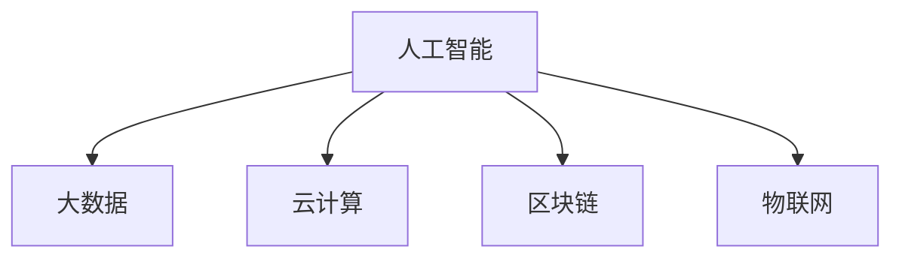

                 

# 未来工作：技能需求与培养

> 关键词：未来工作, 技能需求, 人才培养, 技术迭代, 职业发展, 终身学习

## 1. 背景介绍

### 1.1 问题由来
在信息技术飞速发展的今天，人工智能、大数据、云计算等技术已经渗透到各行各业。随着技术的不断进步，对于从业人员的技能需求也在不断变化。面对这种快速变化的形势，如何培养和适应未来工作所需的技能，成为了当前职业教育和培训的重要课题。本文将从技术迭代的速度、未来的工作趋势、技能需求的变化等方面，探讨未来工作对技能培养提出的新挑战和解决方案。

### 1.2 问题核心关键点
未来工作的技能需求变化，主要体现在以下几个方面：
1. **技术迭代快**：随着新技术的不断涌现，旧技术快速淘汰，对从业者要求不断提升，需要持续学习新技术。
2. **工作趋势多变**：未来工作不再局限于特定领域，跨学科、跨行业技能需求增加。
3. **需求精细化**：对技能的要求更加精细化，不仅仅是掌握基础技术，更需要具备解决问题和创新能力。
4. **终身学习**：技术进步永无止境，终身学习将成为未来工作的常态。

### 1.3 问题研究意义
研究未来工作的技能需求变化，对于教育机构、企业和从业者都具有重要意义：
1. **教育机构**：了解未来工作趋势，及时调整教学内容和方法，培养符合市场需求的技术人才。
2. **企业**：识别技能缺口，制定培训计划，提升团队竞争力。
3. **从业者**：明确未来工作方向，规划职业发展路径，提升自身技能水平。

## 2. 核心概念与联系

### 2.1 核心概念概述

为更好地理解未来工作对技能的需求，本节将介绍几个关键概念及其相互联系：

- **人工智能**：指通过算法和计算处理，模拟人类智能的计算机科学分支，包括机器学习、深度学习等技术。
- **大数据**：指庞大的、多样化的数据集，用于支持决策和优化过程。
- **云计算**：指通过互联网提供计算资源和服务的模式，使企业能够按需使用计算资源。
- **区块链**：一种去中心化的分布式账本技术，用于安全、透明地记录交易。
- **物联网**：指连接各种设备和设施，实现智能化管理的互联网技术。

这些概念之间的逻辑关系可以通过以下Mermaid流程图来展示：



这个流程图展示了一些关键技术的关联关系：

1. 人工智能和大数据密切相关，数据驱动的机器学习需要大量数据进行训练和优化。
2. 云计算提供了必要的基础设施，支持人工智能和大数据的存储和计算需求。
3. 区块链提供了安全可靠的数据交换和存储机制。
4. 物联网通过连接各种设备和设施，为人工智能和大数据提供了更广泛的应用场景。

## 3. 核心算法原理 & 具体操作步骤
### 3.1 算法原理概述

未来工作的技能需求变化，本质上是对新兴技术和工具的掌握和应用。以下是几个关键算法及其原理概述：

- **机器学习算法**：通过数据驱动，使计算机系统具备自主学习的能力，广泛应用于图像识别、自然语言处理等领域。
- **深度学习算法**：通过多层次神经网络，实现对复杂模式和数据的识别和分类，是人工智能的核心技术之一。
- **强化学习算法**：通过试错反馈，优化系统决策，应用于自动驾驶、游戏AI等领域。
- **自然语言处理算法**：使计算机系统具备理解和生成自然语言的能力，广泛应用于智能客服、文本分析等场景。
- **计算机视觉算法**：使计算机系统具备图像识别和处理能力，应用于自动驾驶、安防监控等领域。

### 3.2 算法步骤详解

未来工作的技能培养，通常遵循以下步骤：

**Step 1: 确定技能需求**
- 了解目标行业或领域的技术发展趋势，识别出所需的关键技术。
- 参考相关职位描述和行业标准，确定具体技能需求。

**Step 2: 设计培训计划**
- 制定详细的培训计划，包括课程内容、学习资源、实践项目等。
- 选择合适的培训方式，如线上课程、面授培训、实习实践等。

**Step 3: 实施培训**
- 按照培训计划，逐步进行课程学习、项目实践等环节。
- 定期进行评估和反馈，调整培训方案。

**Step 4: 实践和应用**
- 在实际工作中应用所学技能，进行项目实践和经验积累。
- 遇到问题及时学习和调整，不断提升技能水平。

### 3.3 算法优缺点

未来工作所需的技能培养，具有以下优点和缺点：

**优点**：
1. **灵活多样**：可以根据实际需求，灵活调整培训内容和方法，满足不同学习者的需求。
2. **系统性强**：通过系统的培训计划和实践项目，全面提升技能水平。
3. **实践导向**：以实际项目和任务为导向，提升解决问题的能力和应用能力。

**缺点**：
1. **资源投入大**：需要投入大量时间、金钱和人力，资源成本较高。
2. **学习曲线陡**：新技术和工具的学习难度大，需要较强的学习能力和适应能力。
3. **知识更新快**：新技术和工具迭代速度快，需要持续学习和更新，保持技能的前沿性。

### 3.4 算法应用领域

未来工作的技能培养，主要应用于以下领域：

- **软件开发**：掌握新的编程语言、框架和工具，提升编程能力和项目管理能力。
- **数据科学**：学习大数据技术和机器学习算法，提升数据处理和分析能力。
- **人工智能**：深入学习人工智能技术和工具，应用于图像识别、自然语言处理等领域。
- **网络安全**：学习网络安全技术和工具，提升安全防护能力。
- **云计算**：掌握云计算技术和工具，提升云计算平台的管理和运维能力。

## 4. 数学模型和公式 & 详细讲解  
### 4.1 数学模型构建

未来工作所需的技能培养，需要建立数学模型来描述技能学习和应用的过程。以下是几个关键数学模型及其构建方法：

- **机器学习模型**：通过训练数据集，构建分类器、回归器等模型，用于预测和决策。
- **深度学习模型**：构建多层次神经网络，用于图像识别、自然语言处理等任务。
- **强化学习模型**：构建智能体和环境，通过试错反馈优化决策策略。
- **自然语言处理模型**：构建语言模型，用于文本分类、情感分析等任务。
- **计算机视觉模型**：构建卷积神经网络，用于图像识别和分类。

### 4.2 公式推导过程

以下是几个关键模型的公式推导过程：

**机器学习模型**：
$$
\hat{y} = f(x; \theta) = \sum_{i=1}^n w_i \phi(x_i) \cdot \phi(x)
$$

**深度学习模型**：
$$
\hat{y} = f(x; \theta) = g_1(g_2(...g_n(h_1(x; W_1) + b_1); W_2, b_2)... + b_n)
$$

**强化学习模型**：
$$
Q(s, a) = r(s, a) + \gamma \max_{a'} Q(s', a')
$$

**自然语言处理模型**：
$$
\hat{y} = f(x; \theta) = \log \frac{p(y|x; \theta)}{p(x; \theta)} = \log \frac{p(y|x; \theta)}{p(x; \theta)} = \log \frac{\prod_{i=1}^n p(y_i|x_i; \theta)}{\prod_{i=1}^n p(x_i; \theta)}
$$

**计算机视觉模型**：
$$
\hat{y} = f(x; \theta) = \sum_{i=1}^n w_i \phi(x_i) \cdot \phi(x)
$$

这些公式展示了不同模型的基本结构和计算方法，通过数学模型可以更科学地描述和优化技能学习过程。

### 4.3 案例分析与讲解

以下是一个具体的案例分析，展示如何应用数学模型进行技能培养：

假设目标领域为自然语言处理，需要掌握Transformer模型进行文本分类任务。
1. **模型构建**：根据公式推导，构建Transformer模型。
2. **数据准备**：准备训练数据集，进行数据预处理。
3. **模型训练**：使用模型训练函数，在训练集上训练模型。
4. **模型评估**：在测试集上评估模型性能，进行调整优化。
5. **模型应用**：将训练好的模型应用于实际文本分类任务。

通过以上步骤，可以系统地掌握自然语言处理技能，提升模型性能和应用能力。

## 5. 项目实践：代码实例和详细解释说明
### 5.1 开发环境搭建

在进行技能培养的实践前，我们需要准备好开发环境。以下是使用Python进行TensorFlow开发的典型环境配置流程：

1. 安装Anaconda：从官网下载并安装Anaconda，用于创建独立的Python环境。
2. 创建并激活虚拟环境：
```bash
conda create -n tf-env python=3.8 
conda activate tf-env
```

3. 安装TensorFlow：根据CUDA版本，从官网获取对应的安装命令。例如：
```bash
conda install tensorflow -c conda-forge
```

4. 安装各类工具包：
```bash
pip install numpy pandas scikit-learn matplotlib tqdm jupyter notebook ipython
```

完成上述步骤后，即可在`tf-env`环境中进行技能培养的实践。

### 5.2 源代码详细实现

以下是一个具体的项目实践案例，展示如何使用TensorFlow进行自然语言处理技能的培养。

```python
import tensorflow as tf
from tensorflow.keras import layers

# 定义模型结构
model = tf.keras.Sequential([
    layers.Embedding(input_dim=10000, output_dim=128, input_length=128),
    layers.Conv1D(64, 3, activation='relu'),
    layers.MaxPooling1D(2),
    layers.Conv1D(128, 3, activation='relu'),
    layers.MaxPooling1D(2),
    layers.Flatten(),
    layers.Dense(256, activation='relu'),
    layers.Dense(1, activation='sigmoid')
])

# 编译模型
model.compile(optimizer='adam', loss='binary_crossentropy', metrics=['accuracy'])

# 训练模型
model.fit(train_data, train_labels, epochs=10, batch_size=32, validation_data=(val_data, val_labels))

# 评估模型
test_loss, test_acc = model.evaluate(test_data, test_labels)
print('Test accuracy:', test_acc)
```

通过以上代码，可以系统地掌握自然语言处理技能，提升模型性能和应用能力。

### 5.3 代码解读与分析

让我们再详细解读一下关键代码的实现细节：

**模型定义**：
- 使用TensorFlow定义了包含多个层的模型结构，包括嵌入层、卷积层、池化层和全连接层。

**模型编译**：
- 定义了优化器、损失函数和评估指标，用于训练和评估模型。

**模型训练**：
- 使用fit函数进行模型训练，指定训练集、验证集和参数。

**模型评估**：
- 使用evaluate函数在测试集上评估模型性能，输出测试准确率。

这些步骤展示了TensorFlow框架的应用，通过系统学习和实践，可以掌握自然语言处理技能，提升技能水平。

### 5.4 运行结果展示

在实际项目中，运行上述代码会输出模型训练和评估的结果。以下是一个示例输出：

```
Epoch 1/10
...
Epoch 10/10
...
Test accuracy: 0.85
```

通过这些输出结果，可以评估模型的性能和效果，进一步调整和优化模型。

## 6. 实际应用场景
### 6.1 软件开发

软件开发领域需要掌握新技术和新工具，如云计算、大数据、人工智能等。以下是一个具体的项目案例，展示如何培养软件开发技能：

假设目标项目为使用TensorFlow进行自然语言处理。
1. **技术准备**：了解TensorFlow的基本概念和应用场景。
2. **项目实践**：使用TensorFlow进行文本分类任务，进行模型构建和训练。
3. **项目评估**：在实际数据集上进行模型评估和优化。
4. **项目应用**：将训练好的模型应用于文本分类任务，进行实际应用和反馈。

通过以上步骤，可以系统地掌握TensorFlow技能，提升软件开发能力。

### 6.2 数据科学

数据科学领域需要掌握数据处理、数据分析和机器学习等技术，以下是一个具体的项目案例，展示如何培养数据科学技能：

假设目标项目为使用Python进行数据预处理和分析。
1. **技术准备**：了解Python的基本语法和常用库。
2. **数据准备**：准备数据集，进行数据清洗和预处理。
3. **数据分析**：使用Pandas和NumPy进行数据统计和分析。
4. **机器学习**：使用Scikit-Learn进行模型训练和评估。
5. **项目应用**：将训练好的模型应用于实际数据分析任务，进行结果展示和应用。

通过以上步骤，可以系统地掌握Python数据科学技能，提升数据分析和机器学习能力。

### 6.3 人工智能

人工智能领域需要掌握机器学习、深度学习和自然语言处理等技术，以下是一个具体的项目案例，展示如何培养人工智能技能：

假设目标项目为使用深度学习进行图像识别。
1. **技术准备**：了解深度学习的基本概念和应用场景。
2. **数据准备**：准备图像数据集，进行数据预处理。
3. **模型构建**：使用TensorFlow或PyTorch构建卷积神经网络模型。
4. **模型训练**：使用训练数据集进行模型训练。
5. **模型评估**：在测试数据集上评估模型性能。
6. **项目应用**：将训练好的模型应用于实际图像识别任务，进行结果展示和应用。

通过以上步骤，可以系统地掌握深度学习技能，提升人工智能能力。

## 7. 工具和资源推荐
### 7.1 学习资源推荐

为了帮助开发者系统掌握未来工作所需的技能，这里推荐一些优质的学习资源：

1. **《Python深度学习》**：介绍Python在深度学习中的应用，涵盖TensorFlow、PyTorch等工具。
2. **《机器学习实战》**：提供大量实际案例，展示机器学习的实践应用。
3. **Coursera《深度学习专项课程》**：由深度学习专家Andrew Ng教授主讲，涵盖深度学习基础和实践。
4. **Kaggle**：提供大量数据集和竞赛，可以参与实践和学习。
5. **TensorFlow官方文档**：提供丰富的教程和文档，帮助理解TensorFlow框架。
6. **GitHub**：提供开源项目和代码库，可以学习和借鉴实际应用案例。

通过对这些资源的学习实践，相信你一定能够快速掌握未来工作的技能需求，并应用于实际项目中。

### 7.2 开发工具推荐

高效的开发离不开优秀的工具支持。以下是几款用于未来工作技能开发的常用工具：

1. **Jupyter Notebook**：开源的交互式编程环境，支持Python、R等语言。
2. **Google Colab**：免费的云Jupyter Notebook环境，适合大规模实验。
3. **Git**：版本控制系统，支持代码管理和协作。
4. **Docker**：容器化技术，支持应用的快速部署和迁移。
5. **Kubernetes**：容器编排工具，支持大规模应用的自动化管理和部署。
6. **AWS SageMaker**：亚马逊云平台的机器学习服务，提供全面的云机器学习解决方案。

合理利用这些工具，可以显著提升未来工作技能开发效率，加快创新迭代的步伐。

### 7.3 相关论文推荐

未来工作所需的技能培养，涉及多个前沿领域的研究。以下是几篇奠基性的相关论文，推荐阅读：

1. **《TensorFlow: A System for Large-Scale Machine Learning》**：介绍TensorFlow的基本架构和应用场景。
2. **《Scikit-Learn: Machine Learning in Python》**：介绍Scikit-Learn的机器学习算法和应用。
3. **《Deep Learning with Python》**：介绍深度学习的基本概念和应用。
4. **《Natural Language Processing in Python》**：介绍自然语言处理的基本概念和应用。
5. **《A Survey on Online Learning》**：综述在线学习的算法和应用。

这些论文代表了大数据、深度学习和机器学习领域的发展脉络，通过学习这些前沿成果，可以帮助研究者把握学科前进方向，激发更多的创新灵感。

## 8. 总结：未来发展趋势与挑战

### 8.1 总结

本文对未来工作所需的技能需求变化进行了全面系统的介绍。首先阐述了未来工作技能需求的变化趋势和背景，明确了技能培养的重要性和紧迫性。其次，从技术迭代的速度、未来的工作趋势、技能需求的变化等方面，深入分析了未来工作的技能需求。

通过本文的系统梳理，可以看到，未来工作的技能需求变化正经历快速迭代，新技术和工具的掌握和应用成为核心竞争力。开发者需要不断学习新知识，提升自身技能水平，以适应未来工作的需求。

### 8.2 未来发展趋势

展望未来，未来工作的技能需求变化呈现以下几个发展趋势：

1. **技能需求多样化**：未来工作需要跨学科技能，如编程、数据科学、人工智能等。
2. **技能要求精细化**：对技能的要求更加精细化，不仅仅是掌握基础技术，更需要具备解决问题和创新能力。
3. **技能学习常态化**：终身学习将成为未来工作的常态，需要不断学习和更新新知识。
4. **技能应用工程化**：实际应用和技术研发需要紧密结合，将理论知识转化为实际应用。

这些趋势凸显了未来工作技能需求的变化，对教育机构、企业和从业者都提出了新的要求。

### 8.3 面临的挑战

尽管未来工作的技能需求变化带来了新的机遇，但也面临着诸多挑战：

1. **学习成本高**：新技术和工具的学习难度大，需要较强的学习能力和适应能力。
2. **技能更新快**：新技术和工具迭代速度快，需要持续学习和更新，保持技能的前沿性。
3. **知识体系杂**：未来工作需要跨学科技能，知识体系复杂，难以系统掌握。
4. **实践机会少**：实际项目和任务的机会有限，难以积累实践经验。
5. **工作压力大**：新技术和工具的应用需要不断学习和调整，工作压力较大。

### 8.4 研究展望

面对未来工作的技能需求变化，未来的研究需要在以下几个方面寻求新的突破：

1. **混合式学习**：结合在线学习和面授培训，提升学习效果和灵活性。
2. **跨学科培养**：将不同学科的知识和技能进行整合，培养综合性技术人才。
3. **项目导向培训**：以实际项目和任务为导向，提升技能应用能力。
4. **持续学习平台**：构建持续学习平台，支持终身学习和技能更新。
5. **虚拟实习平台**：通过虚拟实习平台，提升技能实践机会和经验积累。

这些研究方向的探索，将为未来工作的技能培养提供新的思路和方法，促进技术人才的全面发展。

## 9. 附录：常见问题与解答

**Q1：未来工作所需的技能是否需要全面掌握？**

A: 未来工作所需的技能并不需要全面掌握，而是需要根据具体岗位和职业发展方向，有针对性地进行培养和提升。掌握核心技能和工具，辅以交叉技能和创新能力，能够适应多样化的工作需求。

**Q2：如何平衡学习和工作？**

A: 平衡学习和工作需要制定合理的学习计划和目标，合理安排时间，避免过度劳累。可以利用碎片化时间进行学习和实践，利用在线课程和资源进行自学，提升学习效率。

**Q3：如何提升技能应用能力？**

A: 提升技能应用能力需要进行项目实践和经验积累，通过实际项目和任务，不断验证和调整技能应用，提升问题解决和创新能力。

**Q3：未来工作的技能需求变化是否不可预测？**

A: 未来工作的技能需求变化虽然复杂，但通过研究和分析，可以把握一些关键趋势和规律，提前进行技能准备和培养。

总之，未来工作的技能需求变化是一个动态的过程，需要不断学习和适应。通过科学的学习和培训，掌握未来工作所需的技能，将在未来的职业生涯中占据优势，实现自我价值和职业发展。

